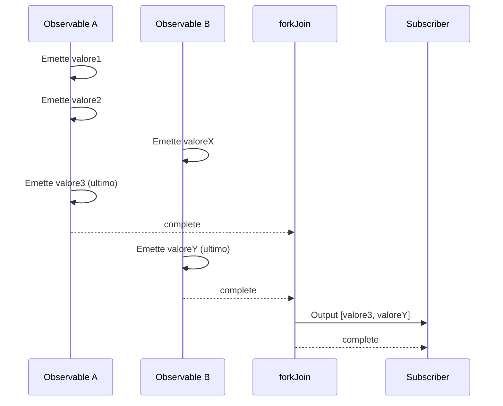
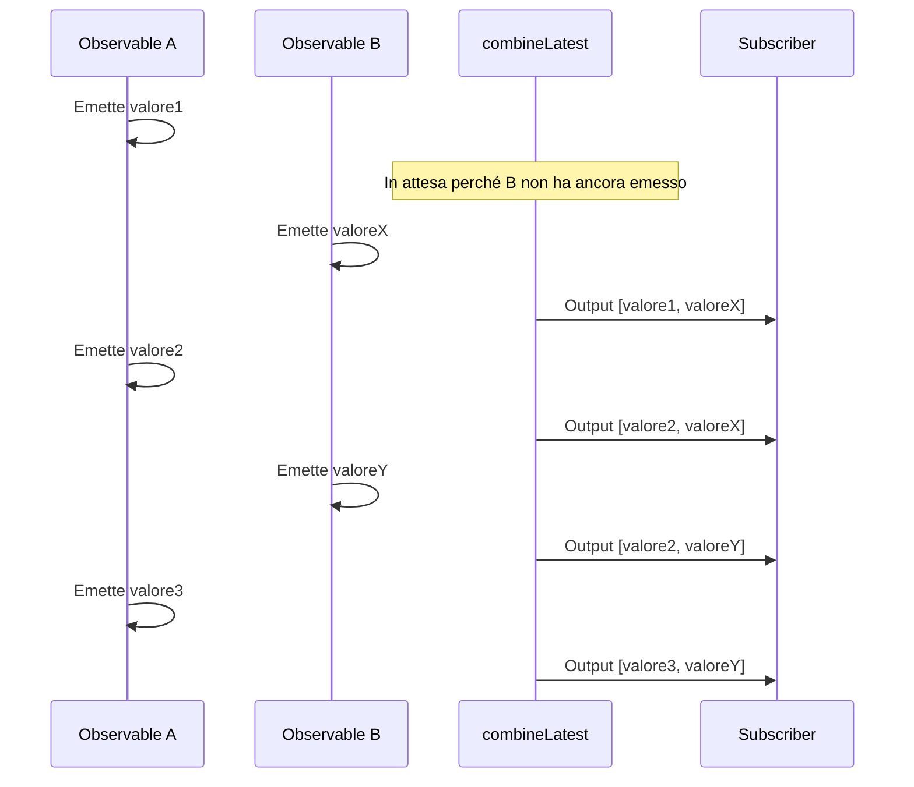

# Differenza tra forkJoin e combineLatest

Quando si combinano più Observable in RxJS, `forkJoin` e `combineLatest` sono le Creation Function più comunemente utilizzate. Tuttavia, queste due hanno **comportamenti significativamente diversi**, e usarle in modo errato non produrrà i risultati attesi.

Questa pagina confronta approfonditamente entrambe usando diagrammi ed esempi pratici, rendendo chiaro "quale usare."

## Conclusione: Differenza tra forkJoin e combineLatest

| Caratteristica | forkJoin | combineLatest |
|----------------|----------|---------------|
| **Timing di output** | **Una volta** dopo il completamento di tutti | **Ogni volta** che un valore viene aggiornato |
| **Valore di output** | **Ultimo valore** di ogni Observable | **Valore più recente** di ogni Observable |
| **Condizione di completamento** | Tutti gli Observable completano | Ogni volta che uno emette un valore |
| **Casi d'uso principali** | Chiamate API parallele, caricamento dati iniziale | Monitoraggio form, sync in tempo reale |
| **Stream infiniti** | ❌ Non può usare | ✅ Può usare |

> [!TIP]
> **Modo semplice per ricordare**
> - `forkJoin` = "Una volta che tutti sono pronti, **partire una volta**" (simile a Promise.all)
> - `combineLatest` = "**Riportare l'ultimo stato** ogni volta che qualcuno si muove"

## Comprendere le differenze di comportamento con diagrammi

### Comportamento di forkJoin

### Comportamento di combineLatest

## Quando usare quale (Guida caso per caso)

### Casi per usare forkJoin

- **Chiamate API parallele**: Quando vuoi elaborare solo dopo che tutti i dati sono pronti
- **Caricamento dati iniziale**: Recuperare tutti i dati master necessari all'avvio dell'app

> [!WARNING]
> `forkJoin` non può essere usato con **Observable che non completano mai** (`interval`, WebSocket, stream di eventi, ecc.).

### Casi per usare combineLatest

- **Monitoraggio input form in tempo reale**: Combinare più valori di input per la validazione
- **Sync in tempo reale di più stream**: Visualizzazione integrata di dati sensore
- **Combinazione condizioni filtro**: Eseguire ricerca quando cambia una condizione

## Riepilogo

| Criterio di selezione | forkJoin | combineLatest |
|----------------------|----------|---------------|
| Elaborare una volta quando tutto è pronto | ✅ | ❌ |
| Elaborare ad ogni cambio di valore | ❌ | ✅ |
| Stream non completanti | ❌ | ✅ |
| Uso tipo Promise.all | ✅ | ❌ |
| Sincronizzazione in tempo reale | ❌ | ✅ |

## Pagine correlate

- **[forkJoin](/it/guide/creation-functions/combination/forkJoin)** - Spiegazione dettagliata di forkJoin
- **[combineLatest](/it/guide/creation-functions/combination/combineLatest)** - Spiegazione dettagliata di combineLatest
- **[zip](/it/guide/creation-functions/combination/zip)** - Accoppiare valori corrispondenti
- **[merge](/it/guide/creation-functions/combination/merge)** - Eseguire più Observable in parallelo
