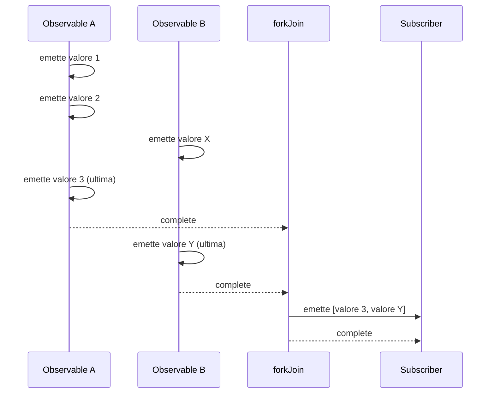
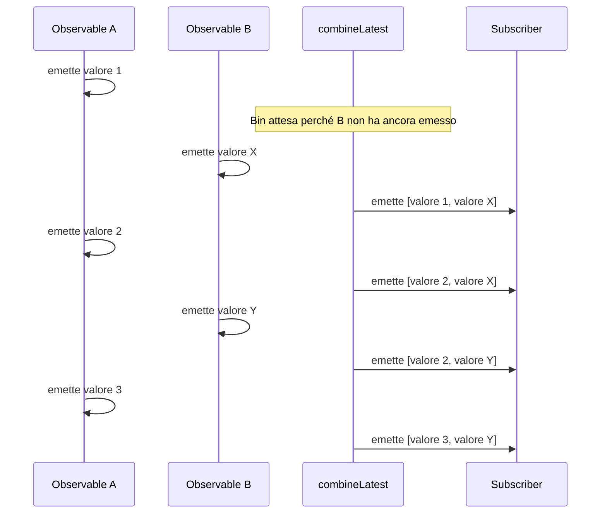
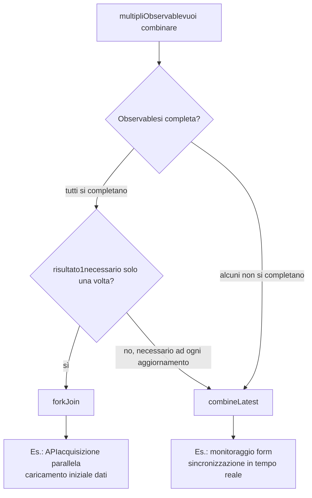

# Differenza tra forkJoin e combineLatest

Quando si combinano più Observable in RxJS, `forkJoin` e `combineLatest` sono le Creation Function più comunemente usate. Tuttavia, queste due **si comportano in modo molto diverso** e, se non utilizzate correttamente, non produrranno i risultati attesi.

Questa pagina confronta in modo approfondito le differenze tra le due, con illustrazioni ed esempi pratici, per chiarire quale utilizzare.

## Conclusione: la differenza tra forkJoin e combineLatest

| Caratteristica | forkJoin | combineLatest |
|---|---|---|
| **Timing di emissione** | **Solo una volta** dopo il completamento di tutti | **A ogni aggiornamento** di un valore |
| **Valore emesso** | L'**ultimo valore** di ciascun Observable | Il **valore più recente** di ciascun Observable |
| **Condizione di completamento** | Tutti gli Observable completati | Tutti gli Observable completati |
| **Uso principale** | Acquisizione parallela API, caricamento iniziale | Monitoraggio form, sincronizzazione in tempo reale |
| **Stream infinito** | ❌ Non utilizzabile (non si completa) | ✅ Utilizzabile (emette valori senza completarsi) |

> [!TIP]

> **Facile da ricordare**
> - `forkJoin` = «parti **una sola volta** quando tutti sono presenti» (simile a Promise.all)
> - `combineLatest` = «**riporta lo stato più recente** ogni volta che qualcuno si muove»

## Comprendere le differenze di comportamento con le illustrazioni

### Comportamento di forkJoin


```mermaid
sequenceDiagram
    participant A as Observable A
    participant B as Observable B
    participant F as forkJoin
    participant S as Subscriber

    A->>A: emette valore 1
    A->>A: emette valore 2
    B->>B: emette valore X
    A->>A: emette valore 3 (ultima)
    A-->>F: complete
    B->>B: emette valore Y (ultima)
    B-->>F: complete
    F->>S: emette [valore 3, valore Y]
    F-->>S: complete
```

**Punto**: attendere che tutti gli Observable siano `complete` e produrre **solo l'ultimo valore** una volta.

### Comportamento di combineLatest


```mermaid
sequenceDiagram
    participant A as Observable A
    participant B as Observable B
    participant C as combineLatest
    participant S as Subscriber

    A->>A: emette valore 1
    Note over C: Bin attesa perché B non ha ancora emesso
    B->>B: emette valore X
    C->>S: emette [valore 1, valore X]
    A->>A: emette valore 2
    C->>S: emette [valore 2, valore X]
    B->>B: emette valore Y
    C->>S: emette [valore 2, valore Y]
    A->>A: emette valore 3
    C->>S: emette [valore 3, valore Y]
```

**Punto**: dopo che tutti gli Observable hanno emesso il loro primo valore, continueranno a emettere l'ultima combination **ogni volta che uno di essi viene aggiornato**.

## Differenze nella timeline


```mermaid
gantt
    title forkJoin vs Timing di emissione di combineLatest
    dateFormat X
    axisFormat %s

    section Observable A
    valore1 :a1, 0, 1
    valore2 :a2, 2, 1
    valore3 :a3, 4, 1
    complete :milestone, a_done, 5, 0

    section Observable B
    valoreX :b1, 1, 1
    valoreY :b2, 3, 1
    complete :milestone, b_done, 4, 0

    section forkJoinemissione
    [valore3,valoreY] :crit, fork_out, 5, 1

    section combineLatestemissione
    [valore1,valoreX] :c1, 1, 1
    [valore2,valoreX] :c2, 2, 1
    [valore2,valoreY] :c3, 3, 1
    [valore3,valoreY] :c4, 4, 1
```

## Confronto pratico: verifica del comportamento con la stessa fonte di dati

Applichiamo `forkJoin` e `combineLatest` allo stesso Observable e verifichiamo le differenze nell'output.

```ts
import { forkJoin, combineLatest, interval, take, map } from 'rxjs';

// creare area di output
const output = document.createElement('div');
output.innerHTML = '<h3>Confronto forkJoin vs combineLatest:</h3>';
document.body.appendChild(output);

// Creare 2 Observable
const obs1$ = interval(1000).pipe(
  take(3),
  map(i => `A${i}`)
);

const obs2$ = interval(1500).pipe(
  take(2),
  map(i => `B${i}`)
);

// Area di visualizzazione del risultato di forkJoin
const forkJoinResult = document.createElement('div');
forkJoinResult.innerHTML = '<h4>forkJoin:</h4><div id="forkjoin-output">in attesa...</div>';
output.appendChild(forkJoinResult);

// Area di visualizzazione del risultato di combineLatest
const combineLatestResult = document.createElement('div');
combineLatestResult.innerHTML = '<h4>combineLatest:</h4><div id="combinelatest-output"></div>';
output.appendChild(combineLatestResult);

// forkJoin：dopo il completamento di tutti1emette una sola volta
forkJoin([obs1$, obs2$]).subscribe(result => {
  const el = document.getElementById('forkjoin-output');
  if (el) {
    el.textContent = `emissione: [${result.join(', ')}]`;
    el.style.color = 'green';
    el.style.fontWeight = 'bold';
  }
});

// combineLatest：emette ad ogni aggiornamento del valore
const combineOutput = document.getElementById('combinelatest-output');
combineLatest([obs1$, obs2$]).subscribe(result => {
  if (combineOutput) {
    const item = document.createElement('div');
    item.textContent = `emissione: [${result.join(', ')}]`;
    combineOutput.appendChild(item);
  }
});
```

**Risultato dell'esecuzione**:
- `forkJoin`: emette `[A2, B1]` **una sola volta** dopo circa 3 secondi
- `combineLatest`: emette **4 volte** a partire da circa 1,5 s (es. `[A0, B0]` → `[A1, B0]` → `[A2, B0]` → `[A2, B1]`)

> [!NOTE]

> L'ordine di emissione di `combineLatest` dipende dalla programmazione del timer e può variare a seconda dell'ambiente. Il punto importante è che «un valore viene emesso ogni volta che uno di essi viene aggiornato». Nell'esempio sopra l'emissione avviene 4 volte, ma l'ordine può cambiare, ad esempio `[A1, B0]` → `[A1, B1]`.

## Quale utilizzare (guida per caso)

### Casi in cui utilizzare forkJoin

#### 1. Acquisizione parallela di più API

Quando si vogliono elaborare i dati dopo che tutti i dati sono disponibili.

```ts
import { forkJoin } from 'rxjs';
import { ajax } from 'rxjs/ajax';

// acquisire info utente e impostazioni contemporaneamente
forkJoin({
  user: ajax.getJSON('/api/user/123'),
  settings: ajax.getJSON('/api/settings'),
  notifications: ajax.getJSON('/api/notifications')
}).subscribe(({ user, settings, notifications }) => {
  // renderizzare lo schermo dopo che tutti i dati sono pronti
  renderDashboard(user, settings, notifications);
});
```

#### 2. Acquisizione raggruppata dei dati al caricamento iniziale

Acquisire in blocco i dati anagrafici necessari all'avvio dell'applicazione.

```ts
import { forkJoin } from 'rxjs';
import { ajax } from 'rxjs/ajax';

function loadInitialData() {
  return forkJoin({
    categories: ajax.getJSON('/api/categories'),
    countries: ajax.getJSON('/api/countries'),
    currencies: ajax.getJSON('/api/currencies')
  });
}
```

> [!WARNING]

> `forkJoin` non può essere usato con **Observable che non si completano** (ad esempio `interval`, WebSocket, stream di eventi). Se non si completa, continuerà ad aspettare indefinitamente.

### Casi in cui utilizzare combineLatest

#### 1. Monitoraggio in tempo reale dell'input del form

Combinare più valori di input per aggiornare la convalida e la visualizzazione.

```ts
import { combineLatest, fromEvent } from 'rxjs';
import { map, startWith } from 'rxjs';

const name$ = fromEvent(nameInput, 'input').pipe(
  map(e => (e.target as HTMLInputElement).value),
  startWith('')
);

const email$ = fromEvent(emailInput, 'input').pipe(
  map(e => (e.target as HTMLInputElement).value),
  startWith('')
);

const age$ = fromEvent(ageInput, 'input').pipe(
  map(e => parseInt((e.target as HTMLInputElement).value) || 0),
  startWith(0)
);

// eseguire la validazione ad ogni cambio di input
combineLatest([name$, email$, age$]).subscribe(([name, email, age]) => {
  const isValid = name.length > 0 && email.includes('@') && age >= 18;
  submitButton.disabled = !isValid;
});
```

#### 2. Sincronizzazione in tempo reale di flussi multipli

Visualizzazione integrata dei dati e dello stato dei sensori.

```ts
import { combineLatest, interval } from 'rxjs';
import { map } from 'rxjs';

const temperature$ = interval(2000).pipe(map(() => 20 + Math.random() * 10));
const humidity$ = interval(3000).pipe(map(() => 40 + Math.random() * 30));
const pressure$ = interval(2500).pipe(map(() => 1000 + Math.random() * 50));

combineLatest([temperature$, humidity$, pressure$]).subscribe(
  ([temp, humidity, pressure]) => {
    updateDashboard({ temp, humidity, pressure });
  }
);
```

#### 3. Combinazione di condizioni di filtraggio

Eseguire una ricerca ogni volta che cambiano più condizioni di filtro.

```ts
import { combineLatest, BehaviorSubject } from 'rxjs';
import { debounceTime, switchMap } from 'rxjs';

const searchText$ = new BehaviorSubject('');
const category$ = new BehaviorSubject('all');
const sortOrder$ = new BehaviorSubject('asc');

combineLatest([searchText$, category$, sortOrder$]).pipe(
  debounceTime(300),
  switchMap(([text, category, sort]) =>
    fetchProducts({ text, category, sort })
  )
).subscribe(products => {
  renderProductList(products);
});
```

## Diagramma di flusso di utilizzo


```mermaid
flowchart TD
    A[multipliObservablevuoi combinare] --> B{Observablesi completa?}
    B -->|tutti si completano| C{risultato1necessario solo una volta?}
    B -->|alcuni non si completano| D[combineLatest]
    C -->|sì| E[forkJoin]
    C -->|no, necessario ad ogni aggiornamento| D

    E --> E1[Es.: APIacquisizione parallela<br>caricamento iniziale dati]
    D --> D1[Es.: monitoraggio form<br>sincronizzazione in tempo reale]
```

## Errori comuni e rimedi

### Errore 1: usare forkJoin per un Observable che non si completa

```ts
// ❌ questo non verrà mai emesso
forkJoin([
  interval(1000),  // non si completa
  ajax.getJSON('/api/data')
]).subscribe(console.log);

// ✅ takecompletare con combineLatestusare
forkJoin([
  interval(1000).pipe(take(5)),  // 5si completa in
  ajax.getJSON('/api/data')
]).subscribe(console.log);
```

### Errore 2: nessun valore iniziale in combineLatest

```ts
// ❌ name$fino alla prima emissione di Bemail$anche con valori, nulla viene emesso
combineLatest([name$, email$]).subscribe(console.log);

// ✅ startWithimpostare il valore iniziale con
combineLatest([
  name$.pipe(startWith('')),
  email$.pipe(startWith(''))
]).subscribe(console.log);
```

## Riepilogo

| Criterio di selezione | forkJoin | combineLatest |
|---|---|---|
| Elaborazione una volta sola quando tutti sono pronti | ✅ | ❌ |
| Elaborazione ad ogni cambio di valore | ❌ | ✅ |
| Stream che non si completa | ❌ | ✅ |
| Uso simile a Promise.all | ✅ | ❌ |
| Sincronizzazione in tempo reale | ❌ | ✅ |

> [!IMPORTANT]

> **Principio d'uso**
> - **forkJoin**: «una sola volta quando tutti sono presenti» → acquisizione parallela di API, caricamento iniziale
> - **combineLatest**: «aggiorna ogni volta che qualcuno si muove» → monitoraggio form, UI in tempo reale

## Pagine correlate

- **[forkJoin](/it/guide/creation-functions/combination/forkJoin)** - Spiegazione dettagliata di forkJoin
- **[combineLatest](/it/guide/creation-functions/combination/combineLatest)** - Spiegazione dettagliata di combineLatest
- **[zip](/it/guide/creation-functions/combination/zip)** - Accoppiare i valori corrispondenti
- **[merge](/it/guide/creation-functions/combination/merge)** - Eseguire più Observable in parallelo
- **[withLatestFrom](/it/guide/operators/combination/withLatestFrom)** - Solo il flusso principale è trigger
