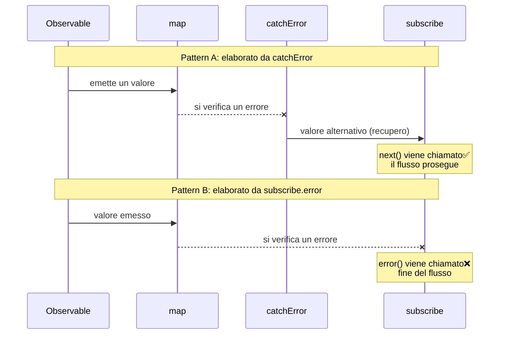
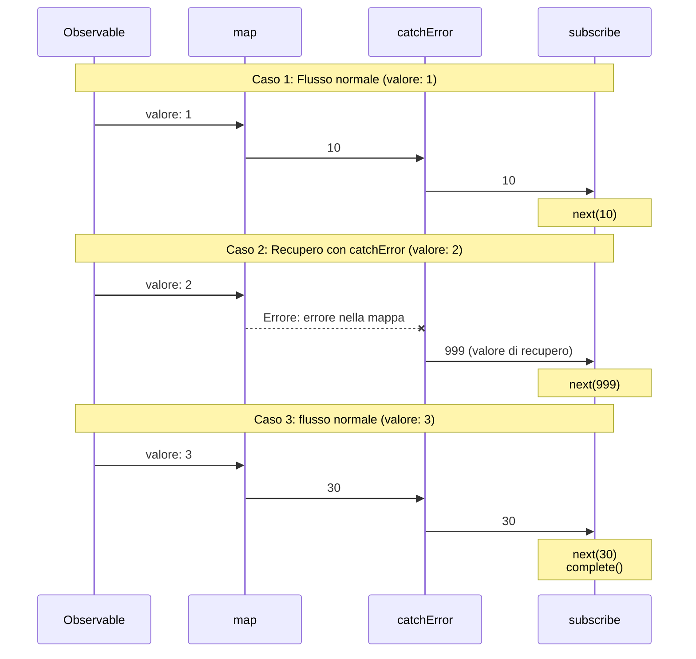
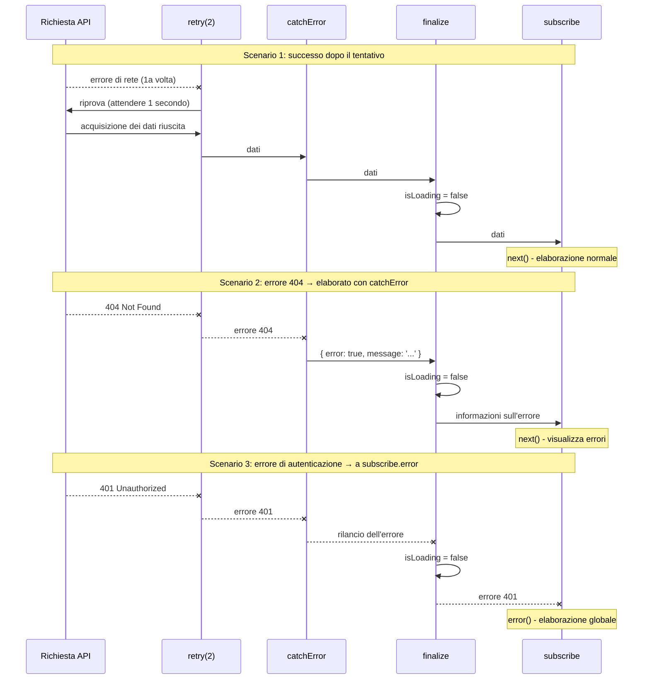
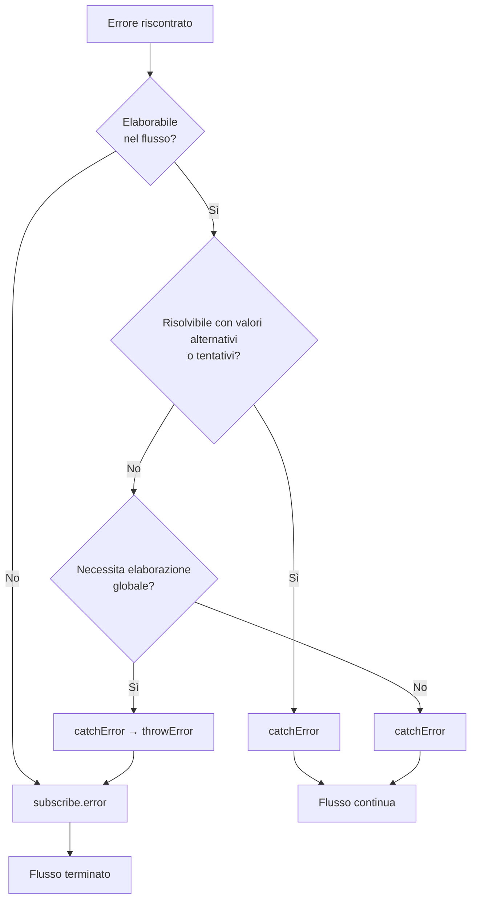

# 2 posti per la gestione degli errori

Quando si gestiscono gli errori in RxJS, dove "catturare" gli errori è una decisione importante per la progettazione; RxJS ha due luoghi principali per la gestione degli errori. L'operatore `catchError` nella pipeline e il callback `error` nella `subscribe` finale. Questa pagina spiega le differenze tra i due e l'uso appropriato di entrambi.

## Due luoghi per la gestione degli errori

Ci sono due luoghi principali per la gestione degli errori in RxJS

1. **Nella pipeline** - `.pipe(catchError(...))`
2. **Sulla sottoscrizione** - `subscribe({ error: ... })`

La comprensione di questa differenza consente una strategia di gestione degli errori robusta e manutenibile.

## Tabella di confronto: catchError vs subscribe.error

La tabella seguente riassume le differenze principali tra i due approcci.

| Voce | `.pipe(catchError(...))` | `subscribe({ error: ... })` |
|------|-------------------------|----------------------------|
| **Tempo di elaborazione** | nella pipeline (elaborazione intermedia) | alla sottoscrizione finale (endpoint) |
| **Tipo di errore** | Errori che si verificano nel flusso | Errori non catturati |
| **Utilizzo primario** | Recupero degli errori, conversione, riprova | Notifica finale degli errori, logging |
| **Continuazione del flusso** | Può essere continuato con un ritorno alternativo Observable | Fine del flusso (nessun altro flusso di valori) |
| **Recuperabilità** | ✅ Possibile (valore alternativo o tentativo) | ❌ Impossibile (terminazione) |
| **Posizionamento multiplo** | ✅ Possibile (multiplo nella pipeline) | ⚠️ uno per sottoscrizione |
| **Tipo di ritorno** | Deve restituire `Observable<T>` | `void` (non restituisce nulla) |

### Diagramma di sequenza: catchError vs subscribe.error

Il diagramma seguente mostra visivamente la differenza tra l'elaborazione con `catchError` e quella con `subscribe.error`.



#### Punti importanti di questo diagramma

**Pattern A (che usa catchError):**
- Se si verifica un errore, viene chiamato `next()` di `subscribe`, perché `catchError` restituisce un valore alternativo
- Il flusso continua e i valori successivi possono essere elaborati
- Gli errori vengono "recuperati" e restituiti al flusso normale

**Pattern B (usando subscribe.error):**
- Se l'errore raggiunge `subscribe`, viene richiamato il callback `error()`
- Lo stream viene terminato e non fluisce più alcun valore
- L'errore viene "notificato" e lo stream viene terminato

## Comprendere i flussi di errori

Vediamo un esempio di codice reale per capire come scorrono gli errori.

```typescript
import { of, map, catchError } from 'rxjs';
of(1, 2, 3).pipe(
  map(x => {
    if (x === 2) throw new Error('Errore nella mappa'); // ①
    return x * 10;
  }),
  catchError(err => {
    console.log('Catturato in catchError:', err.message); // ②
    return of(999); // Recupero
  })
).subscribe({
  next: val => console.log('Valore:', val),
  error: err => console.log('Catturato da subscribe.error:', err), // ③
  complete: () => console.log('Completato')
});

// Output:
// Valore: 10
// Catturato da catchError: Errore nella mappa (← gestito da ②)
// Valore: 999 (← Recupero riuscito)
// Valore: 30
// Completato
```

In questo esempio,
1. si verifica un errore in `map` (①)
2. `catchError` cattura l'errore e lo recupera (②)
3. `subscribe.error` non viene richiamato (perché l'errore è stato gestito)

> [!TIP] Flusso di errori
> Gli errori elaborati da `catchError` non raggiungono `subscribe.error`. Il `catchError` è responsabile del "trattamento dell'errore nel flusso normale".

### Diagramma di sequenza: flusso di errori (3 casi)

Il diagramma seguente mostra come si propagano gli errori in tre casi.



#### Come si può vedere da questo diagramma
- **Caso 1 e 3**: se non ci sono errori, i valori passano a turno a `map` → `catchError` → `subscribe`
- **Caso 2**: se si verifica un errore in `map`, `catchError` lo cattura e restituisce un valore di recupero (999)
- Gli errori elaborati da `catchError` non raggiungono `subscribe.error`

## Errori catturati da catchError

Il `catchError` nella pipeline può catturare i seguenti errori.

| Dove si è verificato l'errore | Esempio | catchError può catturare |
|----------------|-----|---------------------|
| throw nell'operatore | `map(x => { throw new Error() })` | ✅ |
| Errore HTTP | `ajax.get('/api').pipe(catchError(...))` | ✅ |
| Errori nella switchMap | `switchMap(() => throwError(...))` | ✅ |
| Observable personalizzato | `new Observable(sub => sub.error(...))` | ✅ |
| Promise reject | `from(Promise.reject(...))` | ✅ |

### Esempio pratico: elaborazione a tappe degli errori API

```typescript
import { of, throwError, catchError, switchMap } from 'rxjs';
import { ajax } from 'rxjs/ajax';

// Gestire gli errori API con catchError
ajax.get('/api/user/123').pipe(
  catchError(err => {
    if (err.status === 404) {
      // errore 404 → restituire l'utente predefinito
      return of({ id: 123, name: 'Utente predefinito' });
    }
    // Gli altri errori vengono respinti (a subscribe.error)
    return throwError(() => err);
  }),
  switchMap(user => {
    // Dopo aver ottenuto l'utente, ottenere il profilo
    return ajax.get(`/api/profile/${user.id}`);
  }),
  catchError(err => {
    console.log('Errore di acquisizione del profilo:', err);
    // Continuare senza profilo
    return of(null);
  })
).subscribe({
  next: profile => console.log('Profilo:', profile),
  error: err => console.log('Errore finale:', err) // Solo gli errori non gestiti da catchError
});
```

> [!IMPORTANT] Posizionare più catchError
> Collocando più `catchError` nella pipeline, gli errori in fasi diverse possono essere gestiti separatamente. Ciò consente una gestione degli errori a grana fine.

## Errori catturati da subscribe.error

Il callback `error` di `subscribe` cattura i seguenti errori.

| Tipo di errore | Descrizione | Esempio |
|------------|------|-----|
| **catchError errore non gestito** | Errore non elaborato nella pipeline | Propagare l'errore così com'è |
| **rilancio dopo catchError** | errore esplicitamente rilanciato con catchError | `catchError(e => throwError(() => e))` |

### Esempio pratico: gestione a tappe di errori e rilancio

```typescript
import { of, throwError, map, catchError } from 'rxjs';
// Pattern 1: Errori non gestiti da catchError
throwError(() => new Error('Errore non gestito')).subscribe({
  next: val => console.log('Valore:', val),
  error: err => console.log('subscribe.error:', err.message)
  // Output: subscribe.error: Errore non gestito
});

// Pattern 2: rilanciare con catchError
of(1).pipe(
  map(() => { throw new Error('Errore nella mappa'); }),
  catchError(err => {
    console.log('Catturato da catchError:', err.message);
    // rilancia l'errore dopo la registrazione
    return throwError(() => new Error('Errore rilanciato'));
  })
).subscribe({
  next: val => console.log('Valore:', val),
  error: err => console.log('subscribe.error:', err.message)
  // Output:
  // Catturato da catchError: Errore nella mappa
  // subscribe.error: Errore rilanciato
});
```

> [!WARNING] Errori in subscribe
> `throw` all'interno dei callback `subscribe` `next` e `complete` è **sconsigliato**. La gestione degli errori deve sempre essere fatta nella pipeline (`catchError`); lanciare all'interno di subscribe può causare un comportamento non definito.

## Criteri per determinare quale usare

Quale usare dipende da "dove si vogliono gestire gli errori".

### Casi in cui si dovrebbe usare catchError

Usare `catchError` se si verifica una delle seguenti condizioni:

- ✅ **Si vuole completare il processo nel flusso**
- ✅ **È possibile fornire un valore alternativo o dati di riserva**
- ✅ **Può essere risolto con dei tentativi**
- ✅ **Si vuole convertire gli errori e passare a un altro Observable**
- ✅ **Si vuole continuare l'elaborazione successiva**

#### Pattern 1: Formato uniforme su successo ed errore

```typescript
import { of, throwError, catchError, map } from 'rxjs';
interface User {
  id: number;
  name: string;
}

interface ApiResult {
  success: boolean;
  data?: User[];
  error?: string;
}

// Simulare una chiamata API (esempio di generazione di un errore)
function fetchUsers(shouldFail: boolean) {
  if (shouldFail) {
    return throwError(() => new Error('Errore di rete'));
  }
  return of<User[]>([
    { id: 1, name: 'Taro Yamada' },
    { id: 2, name: 'Hanako Sato' }
  ]);
}

fetchUsers(true).pipe(
  // In caso di successo: { success: true, data: [...] }
  map(users => ({ success: true, data: users } as ApiResult)),
  // In caso di errore: { success: false, error: '...' }
  catchError(err => {
    return of<ApiResult>({
      success: false,
      error: 'Impossibile acquisire l\'utente'
    });
  })
).subscribe(result => {
  // Stesso formato per successo ed errore
  if (result.success) {
    console.log('Utente:', result.data);
  } else {
    console.log('Si è verificato un errore:', result.error);
  }
});

// Output: Si è verificato un errore: Impossibile acquisire l'utente
```

#### Pattern 2: restituire semplicemente i valori predefiniti

```typescript
import { of, throwError, catchError } from 'rxjs';
interface User {
  id: number;
  name: string;
}

// Simulare una chiamata API (esempio di generazione di un errore)
function fetchUsers(shouldFail: boolean) {
  if (shouldFail) {
    return throwError(() => new Error('Errore di rete'));
  }
  return of<User[]>([
    { id: 1, name: 'Taro Yamada' },
    { id: 2, name: 'Hanako Sato' }
  ]);
}

fetchUsers(true).pipe(
  catchError(err => {
    console.error('Si è verificato un errore:', err.message);
    // restituisce un array vuoto come valore predefinito
    return of<User[]>([]);
  })
).subscribe(users => {
  if (users.length === 0) {
    console.log('Utente non trovato');
  } else {
    console.log('Utente:', users);
  }
});

// Output:
// Si è verificato un errore: Errore di rete
// Utente non trovato
```

### Casi in cui si dovrebbe usare subscribe.error

Usare `subscribe.error` se si verifica una delle seguenti condizioni:

- ✅ **Si vuole gestire l'errore con un gestore di errori globale**
- ✅ **Ho bisogno di un'elaborazione che riguardi l'intera applicazione**
- ✅ **Voglio inviare i log degli errori al server**
- ✅ **Voglio terminare il flusso**
- ✅ **Gestione degli errori come ultima linea di difesa**

```typescript
import { throwError, catchError, retry } from 'rxjs';
import { ajax } from 'rxjs/ajax';

ajax.getJSON('/api/critical-data').pipe(
  retry(2),
  catchError(err => {
    if (err.status === 401) {
      // Gli errori di autenticazione vengono respinti (gestiti globalmente)
      return throwError(() => err);
    }
    // Gli altri vengono gestiti
    return throwError(() => new Error('Impossibile recuperare i dati'));
  })
).subscribe({
  next: data => console.log('Dati:', data),
  error: err => {
    // Gestore globale degli errori
    globalErrorHandler.handle(err);
    // Passaggio alla pagina di errore
    router.navigate(['/error']);
  }
});
```

## Pattern pratico: gestione gerarchica degli errori

In pratica, la gestione gerarchica degli errori è efficace combinando `catchError` e `subscribe.error`.

```typescript
import { of, throwError, catchError, retry, finalize } from 'rxjs';
import { ajax } from 'rxjs/ajax';

function fetchUserData(userId: string) {
  let isLoading = true;

  return ajax.getJSON(`/api/users/${userId}`).pipe(
    // Livello 1: errore di rete ripetibile
    retry({ count: 2, delay: 1000 }),

    // Livello 2: errore recuperabile
    catchError((error) => {
      if (error.status === 404) {
        // 404 → continua con i dati predefiniti
        return of({
          error: true,
          message: 'Utente non trovato',
          data: null
        });
      } else if (error.status >= 500) {
        // serie 500 → Continua con il messaggio di errore
        return of({
          error: true,
          message: 'Si è verificato un errore del server',
          data: null
        });
      }
      // Gli altri errori sono respinti (a subscribe.error)
      return throwError(() => error);
    }),

    // Livello 3: pulizia che deve essere eseguita
    finalize(() => {
      isLoading = false;
      console.log('Caricamento completato');
    })
  );
}

// Esempio di utilizzo
fetchUserData('123').subscribe({
  next: (result) => {
    if (result.error) {
      // Errore gestito da catchError (visualizzato nell'interfaccia utente)
      console.error('Errore utente:', result.message);
      showUserFriendlyError(result.message);
    } else {
      // Dati normali
      console.log('Dati utente:', result.data);
      displayUserData(result.data);
    }
  },
  error: (err) => {
    // Errore fatale non gestito da catchError
    console.error('Errore fatale:', err);
    // Notifica il gestore globale degli errori
    globalErrorHandler.handle(err);
    // Passaggio alla pagina degli errori
    navigateToErrorPage();
  },
  complete: () => console.log('Elaborazione completata')
});

// Funzioni di supporto
function showUserFriendlyError(message: string) {
  console.log('Errore visualizzato nell\'interfaccia utente:', message);
}
function displayUserData(data: any) {
  console.log('Visualizza i dati nell\'interfaccia utente:', data);
}
function navigateToErrorPage() {
  console.log('Passaggio alla pagina di errore');
}

// Gestore globale degli errori
const globalErrorHandler = {
  handle(err: any) {
    console.error('Errore globale:', err);
    // invia il log degli errori al server
    // sendErrorLog(err);
  }
};
```

> [!TIP] Vantaggi della gestione gerarchica degli errori
> - **Livello 1 (retry)**: recupero automatico di errori di rete temporanei
> - **Livello 2 (catchError)**: fornisce messaggi di errore di facile comprensione
> - **Livello 3 (subscribe.error)**: gestisce gli errori imprevisti nell'ultima linea di difesa
> - **finalize**: ripulisce sempre le risorse

### Diagramma di sequenza: flusso gerarchico di gestione degli errori

Il diagramma seguente mostra il flusso gerarchico di gestione degli errori: retry → catchError → finalize → subscribe.



#### Come si può vedere da questo diagramma
- **Scenario 1**: gli errori temporanei vengono recuperati con `retry` e i dati vengono recuperati con successo
- **Scenario 2**: gli errori 404 vengono catturati da `catchError` e convertiti in messaggi di facile comprensione
- **Scenario 3**: gli errori di autenticazione vengono ri-gettati con `catchError` e gestiti centralmente con `subscribe.error`
- **Tutti gli scenari**: `finalize` viene sempre eseguito per resettare lo stato di caricamento

## Guida alla selezione specifica per lo scenario

Linee guida su quale utilizzare per ogni scenario reale.

| Scenario | Consigliato | Motivo |
|---------|------|------|
| 404 Not Found → valore predefinito visualizzato | `catchError` | valore alternativo può essere restituito nello stream |
| Errore di rete temporaneo → riprovare | `catchError` | continuare l'elaborazione dopo il tentativo |
| Errore di autenticazione (401) → pagina di login | entrambi possibili | può essere reindirizzato con catchError o centralizzato con subscribe.error |
| Errore del server 500 → pagina di errore | entrambi possibili | catchError per il tentativo, subscribe.error per la risoluzione immediata |
| Errore di convalida → visualizzazione nel modulo | `catchError` | passare le informazioni sull'errore all'interfaccia utente per la visualizzazione |
| Errore imprevisto → inviare al log | `subscribe.error` | registrato come ultima linea di difesa |

### Esempi di gestione flessibile degli errori di autenticazione

Gli errori di autenticazione (401) possono essere affrontati in entrambi i modi, a seconda del progetto.

```typescript
import { throwError, EMPTY, catchError } from 'rxjs';
import { ajax } from 'rxjs/ajax';

// Approccio 1: reindirizzamento con catchError (completo nel flusso)
ajax.getJSON('/api/protected-data').pipe(
  catchError(err => {
    if (err.status === 401) {
      // catchError gestisce gli errori di autenticazione
      router.navigate(['/login']);
      return EMPTY; // Svuota lo stream ed esce
    }
    return throwError(() => err);
  })
).subscribe({
  next: data => console.log('Dati:', data)
});

// Approccio 2: gestione centralizzata con subscribe.error
ajax.getJSON('/api/protected-data').pipe(
  catchError(err => {
    // Gli errori di autenticazione vengono respinti (gestiti globalmente)
    if (err.status === 401) {
      return throwError(() => err);
    }
    // Gli altri vengono gestiti
    return throwError(() => err);
  })
).subscribe({
  next: data => console.log('Dati:', data),
  error: err => {
    if (err.status === 401) {
      // Gestore dell'autenticazione globale
      authService.handleUnauthorized();
    }
  }
});
```

> [!NOTE] Scelte progettuali
> Gli errori che riguardano l'intera applicazione, come gli errori di autenticazione, sono gestiti dove si trovano, a seconda della politica di progettazione del progetto.
> - **Elaborazione distribuita**: gestita separatamente in ogni chiamata API (catchError)
> - **Centralizzata**: elaborazione unificata nel gestore globale degli errori (subscribe.error)

## Diagramma di flusso: selezione della gestione degli errori



## Best Practice

### 1. Cogliere gli errori in anticipo, rilanciare in ritardo

```typescript
import { throwError, catchError, map } from 'rxjs';
import { ajax } from 'rxjs/ajax';

ajax.getJSON('/api/data').pipe(
  // catturare in anticipo
  catchError(err => {
    console.log('Errore di log:', err);
    // rilanciare se non può essere gestito
    return throwError(() => err);
  }),
  map(data => transformData(data)),
  // cattura anche gli errori di trasformazione
  catchError(err => {
    console.log('Errore di conversione:', err);
    return throwError(() => err);
  })
).subscribe({
  next: data => console.log('Dati:', data),
  error: err => {
    // Gestore finale degli errori
    globalErrorHandler.handle(err);
  }
});

function transformData(data: any) {
  return data;
}
```

### 2. Chiara distinzione tra i tipi di errore

```typescript
import { of, throwError, catchError } from 'rxjs';
import { ajax } from 'rxjs/ajax';

// Tipi di errore personalizzati
class RecoverableError extends Error {
  constructor(message: string) {
    super(message);
    this.name = 'RecoverableError';
  }
}

class FatalError extends Error {
  constructor(message: string) {
    super(message);
    this.name = 'FatalError';
  }
}

ajax.getJSON('/api/data').pipe(
  catchError(err => {
    if (err.status === 404 || err.status === 500) {
      // Recuperabile
      return throwError(() => new RecoverableError(err.message));
    }
    // Errore fatale
    return throwError(() => new FatalError(err.message));
  })
).subscribe({
  next: data => console.log('Dati:', data),
  error: err => {
    if (err instanceof RecoverableError) {
      // Processo di recupero
      console.log('Errore recuperabile:', err.message);
    } else if (err instanceof FatalError) {
      // Gestione dell'errore fatale
      console.error('Errore fatale:', err.message);
    }
  }
});
```

### 3. Assicurare la pulizia con finalize

```typescript
import { of, catchError, finalize } from 'rxjs';
import { ajax } from 'rxjs/ajax';

let isLoading = true;
let resourceHandle: any = null;

ajax.getJSON('/api/data').pipe(
  catchError(err => {
    console.log('Gestione degli errori:', err);
    return of(null);
  }),
  finalize(() => {
    // Viene sempre eseguito, indipendentemente dal successo o dal fallimento
    isLoading = false;
    if (resourceHandle) {
      resourceHandle.release();
      resourceHandle = null;
    }
    console.log('Pulizia completata');
  })
).subscribe({
  next: data => console.log('Dati:', data),
  error: err => console.error('Errore:', err)
});
```

## Domande frequenti

::: info **Q: Devo scrivere sia catchError che subscribe.error?**
A: Sì, si raccomanda di scriverli entrambi.
`catchError` è un "errore che può essere gestito",
`subscribe.error` serve come "ultima linea di difesa per gli errori inattesi".
:::

::: info **Q: Dove va throwError() all'interno di catchError?**
A: Se c'è un successivo `catchError`, viene catturato lì, altrimenti raggiunge `subscribe.error`.
:::

::: info **Q: Posso inserire più di un catchError?**
A: Sì, è possibile inserirne più di uno nella pipeline. Si possono gestire errori diversi in ogni fase.
:::

::: info **Q: Cosa succede se ometto subscribe.error?**
A: Se si verifica un errore, verrà visualizzato `"Unhandled error"` nella console e l'applicazione potrebbe comportarsi in modo imprevisto. Si raccomanda di scrivere sempre.
:::

::: info **Q: Cosa succede se catchError restituisce EMPTY?**
A: Lo stream viene completato immediatamente. La funzione `complete()` viene chiamata senza rilasciare un valore. Usare questo metodo quando si vogliono ignorare gli errori.
```typescript
import { EMPTY, catchError } from 'rxjs';
source$.pipe(
  catchError(() => EMPTY) // Ignora l'errore e completa
).subscribe({
  next: val => console.log(val),
  complete: () => console.log('Completato') // questo viene chiamato
});
```
:::

::: info **Q: Lo stream termina sempre se si verifica un errore?**
A: No. Lo stream continuerà se viene gestito con `catchError`. Terminerà solo se viene raggiunto `subscribe.error`.
:::

::: info **Q: finalize dovrebbe essere posto prima o dopo catchError?**
A: Normalmente dovrebbe essere collocato **dopo** il catchError. Questo assicura che la pulizia venga eseguita dopo la gestione degli errori.
```typescript
source$.pipe(
  retry(2),
  catchError(err => of(defaultValue)),
  finalize(() => cleanup()) // dopo catchError
)
```
:::

::: info **Q: Qual è la differenza tra catchError e try-catch?**
A: `try-catch` cattura solo gli **errori sincroni**, mentre `catchError` cattura tutti gli errori nel flusso, compresi gli **errori asincroni** (richieste HTTP, timer, ecc.).
:::

## Riepilogo

La comprensione dei due punti della gestione degli errori in RxJS può aiutare a costruire una strategia di gestione degli errori efficace.

### Punti chiave

- **catchError**: recuperare gli errori nel flusso e continuare l'elaborazione
- **subscribe.error**: cattura gli errori non elaborati come ultima linea di difesa
- **Elaborazione gerarchica**: retry → catchError → finalize → subscribe.error è una combinazione efficace
- **Delimitazione chiara**: determina se il flusso può essere completato o meno

> [!IMPORTANT] Principi di progettazione per la gestione degli errori
> 1. **Cogliere tempestivamente gli errori, lanciarli nuovamente se necessario**
> 2. **Gli errori recuperabili sono gestiti da catchError**
> 3. **Eseguire gli errori a livello di applicazione con subscribe.error**
> 4. **Pulire le risorse in modo affidabile con finalize**
> 5. **Distinguere chiaramente i tipi di errore e gestirli**

## Sezioni correlate

- **[Strategie di gestione degli errori](/it/guide/error-handling/strategies)** - Strategie complete di gestione degli errori per RxJS
- **[retry e catchError](/it/guide/error-handling/retry-catch)** - Dettagli su retry e cattura degli errori
- **[finalize e complete](/it/guide/error-handling/finalize)** - Gestione del rilascio delle risorse e del completamento dello stream
- **[Errori comuni e soluzioni](/it/guide/anti-patterns/common-mistakes#9-soppressione-degli-errori)** - Anti-pattern per la gestione degli errori

## Risorse di riferimento

- [Documentazione ufficiale RxJS - catchError](https://rxjs.dev/api/index/function/catchError)
- [Documentazione ufficiale RxJS - retry](https://rxjs.dev/api/index/function/retry)
- [Learn RxJS - Error Handling](https://www.learnrxjs.io/learn-rxjs/operators/error_handling)
