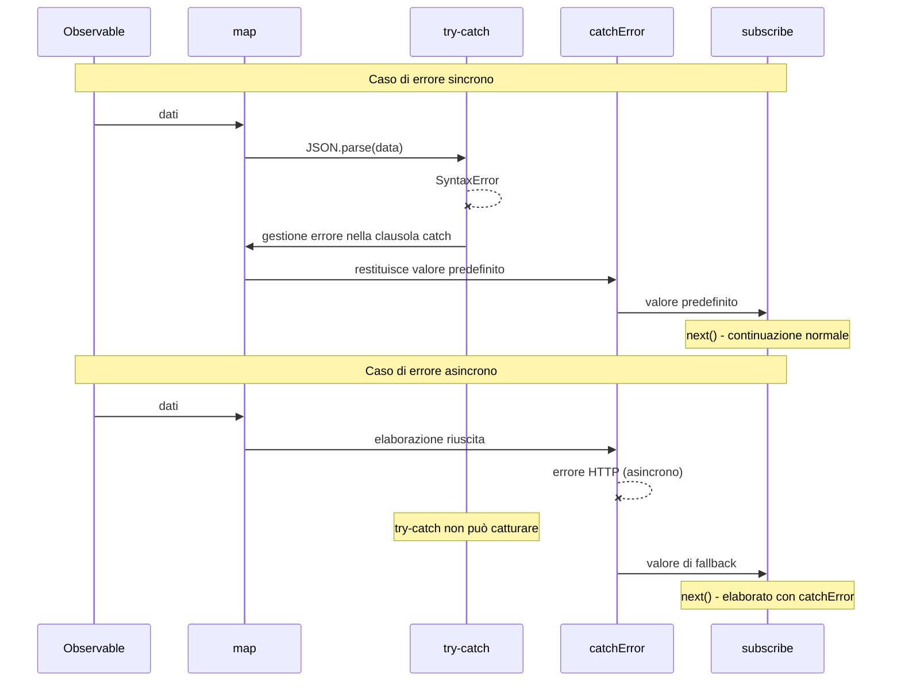

# Integrazione di try-catch e RxJS

JavaScript ha `try-catch` come gestione standard degli errori, mentre RxJS ha i suoi meccanismi di gestione degli errori, come `catchError` e `subscribe.error`. Questa pagina spiega le differenze tra i due e come usarli insieme in modo appropriato.

## try-catch vs gestione degli errori di RxJS

### Differenze di base

| Voce | try-catch | catchError / subscribe.error |
|------|-----------|------------------------------|
| **Si applica a** | Codice sincrono | Stream asincroni |
| **Tipo di errore** | Eccezione JavaScript | Tutti gli errori in Observable |
| **Applicabilità** | Solo nei blocchi try-catch | Intera pipeline |
| **Supporto asincrono** | ❌ Gli errori asincroni non possono essere catturati | ✅ Gli errori asincroni possono essere catturati |
| **Continuazione dello stream** | - | ✅ catchError permette la continuazione |

### Errori non catturati da try-catch

I seguenti errori asincroni non possono essere catturati da `try-catch`.

```typescript
import { timer, throwError, mergeMap, catchError, of } from 'rxjs';
// ❌ try-catch non può catturare errori asincroni
try {
  setTimeout(() => {
    throw new Error('Errore asincrono');
  }, 1000);
} catch (error) {
  // Non viene eseguito qui
  console.error('Catturato:', error);
}

// ✅ RxJS può catturare errori asincroni

timer(1000).pipe(
  mergeMap(() => throwError(() => new Error('Errore asincrono'))),
  catchError(error => {
    console.error('Catturato:', error.message); // ✅ Eseguito
    return of('Valore predefinito');
  })
).subscribe();
```

> [!IMPORTANT] Limitazioni di try-catch
> `try-catch` si rivolge solo al codice **sincrono**; non può catturare gli errori che si verificano nei processi asincroni, come setTimeout, richieste HTTP, Promise, Observable, ecc.

## Casi in cui dovrebbe essere usato try-catch

Anche se si usa RxJS, è necessario usare `try-catch` nei seguenti casi.

### 1. Gestione degli errori durante la pulizia delle risorse

Quando si rilasciano le risorse in `finalize` o `using`, catturare gli errori con `try-catch`.

```typescript
import { interval, take, finalize } from 'rxjs';
let ws: WebSocket | null = null;

interval(1000).pipe(
  take(5),
  finalize(() => {
    // Gestire gli errori sul rilascio delle risorse con try-catch
    try {
      if (ws) {
        ws.close();
        console.log('WebSocket terminato normalmente');
      }
    } catch (error) {
      // L'applicazione continua anche se la chiusura fallisce
      console.error('Errore di chiusura del WebSocket:', error);
    }
  })
).subscribe({
  next: val => console.log('Valore:', val)
});
```

**Motivo**: perché spesso è auspicabile continuare l'applicazione anche se il processo di rilascio delle risorse fallisce.

### 2. Gestione degli errori sincroni in un Observable personalizzato

Quando si convertono gli errori sincroni in errori RxJS all'interno di `new Observable()`.

```typescript
import { Observable } from 'rxjs';

interface User {
  id: number;
  name: string;
}

function parseUserData(json: string): Observable<User> {
  return new Observable<User>(subscriber => {
    try {
      // JSON.parse è un processo sincrono, quindi viene catturato da try-catch
      const data = JSON.parse(json);

      // Validazione
      if (!data.id || !data.name) {
        throw new Error('Dati utente non validi');
      }

      subscriber.next(data);
      subscriber.complete();
    } catch (error) {
      // Converte l'errore sincrono in errore RxJS
      subscriber.error(error);
    }
  });
}

// Esempio di utilizzo
parseUserData('{"id": 1, "name": "Taro"}').subscribe({
  next: user => console.log('Utente:', user),
  error: err => console.error('Errore:', err.message)
});

// JSON non valido
parseUserData('invalid json').subscribe({
  next: user => console.log('Utente:', user),
  error: err => console.error('Errore:', err.message) // Cattura errore JSON.parse
});
```

**Motivo**: propagare gli errori che si verificano nei processi sincroni (JSON.parse, validazione, ecc.) come errori Observable.

### 3. Interfacciamento con librerie esterne

Gestione degli errori quando si usano librerie esterne che non utilizzano RxJS.

```typescript
import { of, map, catchError } from 'rxjs';
// Libreria esterna (ad esempio, libreria per l'elaborazione di immagini)
declare const ExternalImageLib: {
  process(data: string): string;
};

of('image-data-1', 'image-data-2', 'invalid-data').pipe(
  map(imageData => {
    try {
      // La libreria esterna può lanciare un'eccezione
      const processed = ExternalImageLib.process(imageData);
      return { success: true, data: processed };
    } catch (error) {
      // Cattura un errore sincrono e lo restituisce come valore contenente le informazioni sull'errore
      console.error('Errore di elaborazione immagine:', error);
      return { success: false, error: (error as Error).message };
    }
  })
).subscribe({
  next: result => {
    if (result.success) {
      console.log('Elaborazione riuscita:', result.data);
    } else {
      console.log('Elaborazione fallita:', result.error);
    }
  }
});
```

**Motivo**: per gestire in modo sicuro gli errori delle librerie esterne all'interno dello stream e permettere allo stream di continuare.

### 4. Gestione sincrona all'interno dell'operatore

Per l'elaborazione sincrona all'interno di operatori come `map`, `tap`, ecc.

```typescript
import { of, map } from 'rxjs';
interface Config {
  apiUrl: string;
  timeout: number;
}

of('{"apiUrl": "https://api.example.com", "timeout": 5000}').pipe(
  map(jsonString => {
    try {
      const config: Config = JSON.parse(jsonString);

      // Validazione del valore di configurazione
      if (config.timeout < 0) {
        throw new Error('Il timeout deve essere un numero positivo');
      }

      return config;
    } catch (error) {
      console.error('Errore di parsing della configurazione:', error);
      // Restituisce la configurazione predefinita
      return { apiUrl: 'https://default.example.com', timeout: 3000 };
    }
  })
).subscribe({
  next: config => console.log('Configurazione:', config)
});
```

**Motivo**: per gestire gli errori sincroni nell'operatore e restituire valori predefiniti senza interrompere il flusso.

## Pattern pratici di combinazione

### Pattern 1: Gestione gerarchica degli errori

Un approccio gerarchico in cui gli errori sincroni sono gestiti da `try-catch` e quelli asincroni da `catchError`.

```typescript
import { of, map, catchError, finalize } from 'rxjs';
import { ajax } from 'rxjs/ajax';

interface ApiResponse {
  data: string;
  timestamp: number;
}

let connection: any = null;

ajax.getJSON<ApiResponse>('https://api.example.com/data').pipe(
  // Livello 1: gestire gli errori sincroni con try-catch
  map(response => {
    try {
      // Conversione dei dati (elaborazione sincrona)
      const decoded = atob(response.data);
      return { decoded, timestamp: response.timestamp };
    } catch (error) {
      console.error('Errore di decodifica:', error);
      throw new Error('Conversione dei dati fallita');
    }
  }),
  // Livello 2: gli errori asincroni sono gestiti da catchError
  catchError(error => {
    console.error('Errore di chiamata API:', error);
    return of({ decoded: '', timestamp: Date.now() });
  }),
  // Livello 3: pulizia delle risorse protetta da try-catch
  finalize(() => {
    try {
      if (connection) {
        connection.close();
        console.log('Connessione chiusa');
      }
    } catch (error) {
      console.error('Errore di chiusura:', error);
    }
  })
).subscribe({
  next: result => console.log('Risultato:', result),
  error: err => console.error('Errore finale:', err)
});
```

### Pattern 2: Gestione delle risorse con using()

```typescript
import { using, interval, take } from 'rxjs';
interface ManagedResource {
  id: string;
  close: () => void;
}

function createManagedStream(resource: ManagedResource) {
  return using(
    // Resource factory
    () => {
      console.log('Risorsa creata:', resource.id);

      return {
        unsubscribe: () => {
          // Gestire gli errori sul rilascio della risorsa con try-catch
          try {
            resource.close();
            console.log('Rilascio della risorsa riuscito:', resource.id);
          } catch (error) {
            console.error('Errore nel rilascio della risorsa:', resource.id, error);
            // L'applicazione continua anche se si verifica un errore
          }
        }
      };
    },
    // Observable factory
    () => interval(1000).pipe(take(3))
  );
}

// Esempio di utilizzo
const resource: ManagedResource = {
  id: 'resource-1',
  close: () => {
    // Il processo di chiusura può fallire
    if (Math.random() > 0.5) {
      throw new Error('Chiusura fallita');
    }
  }
};

createManagedStream(resource).subscribe({
  next: val => console.log('Valore:', val),
  complete: () => console.log('Completato')
});
```

### Pattern 3: Conversione personalizzata degli errori

Convertire gli errori delle API esterne in errori specifici dell'applicazione.

```typescript
import { Observable, throwError, catchError, map } from 'rxjs';
import { ajax } from 'rxjs/ajax';

// Classe di errore personalizzata
class ValidationError extends Error {
  constructor(message: string, public field: string) {
    super(message);
    this.name = 'ValidationError';
  }
}

class NetworkError extends Error {
  constructor(message: string, public statusCode: number) {
    super(message);
    this.name = 'NetworkError';
  }
}

interface UserData {
  email: string;
  age: number;
}

function validateAndFetchUser(userId: string): Observable<UserData> {
  return ajax.getJSON<UserData>(`https://api.example.com/users/${userId}`).pipe(
    map(user => {
      try {
        // Validazione sincrona
        if (!user.email || !user.email.includes('@')) {
          throw new ValidationError('Indirizzo email non valido', 'email');
        }
        if (user.age < 0 || user.age > 150) {
          throw new ValidationError('Età non valida', 'age');
        }
        return user;
      } catch (error) {
        if (error instanceof ValidationError) {
          // Rilancia l'errore di validazione come errore RxJS
          throw error;
        }
        throw new Error('Errore di validazione dei dati');
      }
    }),
    catchError(error => {
      // Gestisce gli errori asincroni (ad esempio gli errori HTTP)
      if (error.status) {
        const networkError = new NetworkError(
          `HTTP ${error.status}: ${error.message}`,
          error.status
        );
        return throwError(() => networkError);
      }
      return throwError(() => error);
    })
  );
}

// Esempio di utilizzo
validateAndFetchUser('123').subscribe({
  next: user => console.log('Utente:', user),
  error: err => {
    if (err instanceof ValidationError) {
      console.error(`Errore di validazione (${err.field}):`, err.message);
    } else if (err instanceof NetworkError) {
      console.error(`Errore di rete (${err.statusCode}):`, err.message);
    } else {
      console.error('Errore imprevisto:', err);
    }
  }
});
```

## Diagramma di sequenza: cooperazione tra try-catch e catchError



#### Come si può vedere da questo diagramma
- **Errore sincrono**: catturato con `try-catch` → elaborato → il flusso continua
- **Errore asincrono**: salta `try-catch` → catturato con `catchError`

## Anti-pattern

### ❌ Anti-pattern 1: cercare di catturare errori asincroni con try-catch

```typescript
// ❌ Cattivo esempio: gli errori asincroni non possono essere catturati
import { ajax } from 'rxjs/ajax';

try {
  ajax.getJSON('https://api.example.com/data').subscribe({
    next: data => console.log(data)
  });
} catch (error) {
  // Gli errori HTTP non vengono catturati qui
  console.error('Errore:', error);
}
```

```typescript
import { of, catchError } from 'rxjs';
// ✅ Buon esempio: gestire con catchError o subscribe.error
import { ajax } from 'rxjs/ajax';

ajax.getJSON('https://api.example.com/data').pipe(
  catchError(error => {
    console.error('Errore HTTP:', error);
    return of(null);
  })
).subscribe({
  next: data => console.log(data)
});
```

### ❌ Anti-pattern 2: sopprimere gli errori con try-catch

```typescript
import { of, map } from 'rxjs';
// ❌ Cattivo esempio: registrare l'errore e sopprimerlo

of('invalid-json').pipe(
  map(json => {
    try {
      return JSON.parse(json);
    } catch (error) {
      console.error('Errore:', error);
      return null; // Le informazioni sull'errore vengono perse
    }
  })
).subscribe({
  next: data => {
    // I dati sono null ma non viene notato
    console.log(data);
  }
});
```

```typescript
import { of, map } from 'rxjs';
// ✅ Buon esempio: mantenere le informazioni sugli errori

interface ParseResult {
  success: boolean;
  data?: any;
  error?: string;
}

of('invalid-json').pipe(
  map(json => {
    try {
      const data = JSON.parse(json);
      return { success: true, data } as ParseResult;
    } catch (error) {
      return {
        success: false,
        error: (error as Error).message
      } as ParseResult;
    }
  })
).subscribe({
  next: result => {
    if (result.success) {
      console.log('Dati:', result.data);
    } else {
      console.error('Errore di parsing:', result.error);
    }
  }
});
```

### ❌ Anti-pattern 3: abuso di try-catch non necessari

```typescript
import { of, map } from 'rxjs';
// ❌ Cattivo esempio: try-catch avvolge errori che RxJS può gestire

of(1, 2, 3).pipe(
  map(x => {
    try {
      return x * 10;
    } catch (error) {
      // Questo codice non è necessario perché non lancia un errore
      return 0;
    }
  })
).subscribe();
```

```typescript
import { of, map } from 'rxjs';
// ✅ Buon esempio: usare try-catch solo dove necessario

of('{"value": 1}', 'invalid', '{"value": 2}').pipe(
  map(json => {
    try {
      // JSON.parse può lanciare un'eccezione, quindi è necessario un try-catch
      return JSON.parse(json);
    } catch (error) {
      console.error('Errore di parsing JSON:', error);
      return { value: 0 };
    }
  })
).subscribe({
  next: data => console.log('Dati:', data)
});
```

## Best Practice

### 1. Utilizzare diversi tipi di errori

```typescript
import { of, map, catchError, finalize } from 'rxjs';
import { ajax } from 'rxjs/ajax';

// Distinzione chiara di utilizzo
ajax.getJSON<{ data: string }>('https://api.example.com/data').pipe(
  // Errori di elaborazione sincrona → try-catch
  map(response => {
    try {
      return JSON.parse(response.data);
    } catch (error) {
      console.error('Errore di parsing:', error);
      return {};
    }
  }),
  // Errori asincroni → catchError
  catchError(error => {
    console.error('Errore API:', error);
    return of({});
  }),
  // Errori di pulizia → try-catch
  finalize(() => {
    try {
      // Processo di rilascio risorse
    } catch (error) {
      console.error('Errore di pulizia:', error);
    }
  })
).subscribe();
```

### 2. Conservare le informazioni sugli errori

```typescript
import { of, map } from 'rxjs';
interface Result<T> {
  success: boolean;
  value?: T;
  error?: string;
}

function safeParse<T>(json: string): Result<T> {
  try {
    const value = JSON.parse(json);
    return { success: true, value };
  } catch (error) {
    return {
      success: false,
      error: error instanceof Error ? error.message : String(error)
    };
  }
}

of('{"name": "Taro"}', 'invalid').pipe(
  map(json => safeParse(json))
).subscribe({
  next: result => {
    if (result.success) {
      console.log('Successo:', result.value);
    } else {
      console.error('Fallimento:', result.error);
    }
  }
});
```

### 3. Fornire informazioni dettagliate con errori personalizzati

```typescript
import { of, map } from 'rxjs';
// Classe di errore personalizzata
class DataProcessingError extends Error {
  constructor(
    message: string,
    public readonly data: unknown,
    public readonly step: string
  ) {
    super(message);
    this.name = 'DataProcessingError';
  }
}

of({ raw: 'some-data' }).pipe(
  map(input => {
    try {
      // Elaborazione complessa
      const processed = processData(input.raw);
      return processed;
    } catch (error) {
      throw new DataProcessingError(
        'Elaborazione dati fallita',
        input,
        'processing'
      );
    }
  })
).subscribe({
  next: data => console.log('Elaborato:', data),
  error: (err: DataProcessingError) => {
    console.error(`Errore (${err.step}):`, err.message);
    console.error('Dati di input:', err.data);
  }
});

function processData(raw: string): any {
  return raw;
}
```

### 4. Logging e monitoraggio

```typescript
import { of, map, catchError, tap } from 'rxjs';
import { ajax } from 'rxjs/ajax';

// Funzione di monitoraggio errori
function logError(context: string, error: Error): void {
  console.error(`[${context}]`, error.message);
  // In produzione inviare al servizio di monitoraggio errori
  // errorMonitoringService.captureException(error, { context });
}

ajax.getJSON('https://api.example.com/data').pipe(
  tap(data => console.log('Ricevuto:', data)),
  map(data => {
    try {
      // Trasformazione dati
      return transformData(data);
    } catch (error) {
      logError('Data Transformation', error as Error);
      throw error; // Propaga a catchError
    }
  }),
  catchError(error => {
    logError('API Request', error);
    return of(null);
  })
).subscribe();

function transformData(data: any): any {
  return data;
}
```

## Domande frequenti

::: info **Q: Devo usare sia try-catch che catchError?**
A: Sì, è necessario usarli separatamente.
- **try-catch**: errori nell'elaborazione sincrona (JSON.parse, validazione, ecc.)
- **catchError**: errori asincroni (HTTP, timer, Promise, ecc.)
:::

::: info **Q: È meglio lanciare in map o gestire con try-catch?**
A: Dipende dalla situazione.
- **throw**: se si vuole che l'errore si propaghi in tutto il flusso
- **gestito da try-catch**: se si vuole recuperare al volo e continuare il flusso
```typescript
// Esempio di throw
map(x => {
  if (x < 0) throw new Error('Numero negativo');
  return x;
})

// Esempio di gestione con try-catch
map(x => {
  try {
    return riskyOperation(x);
  } catch (error) {
    return defaultValue; // Recupero al volo
  }
})
```
:::

::: info **Q: Cosa succede se si verifica un errore in finalize?**
A: Se si verifica un errore in `finalize`, l'errore non viene propagato a `subscribe.error`, ma viene visualizzato nella console come `Uncaught Error`. Pertanto, si dovrebbero sempre catturare gli errori in `finalize` con `try-catch`.
:::

::: info **Q: Posso usare una combinazione di async/await e try-catch?**
A: Sì, è valida quando si ha a che fare con Promise.
```typescript
import { from, mergeMap } from 'rxjs';
async function fetchData(id: string): Promise<any> {
  try {
    const response = await fetch(`/api/data/${id}`);
    return await response.json();
  } catch (error) {
    console.error('Fetch error:', error);
    throw error;
  }
}

from([1, 2, 3]).pipe(
  mergeMap(id => from(fetchData(String(id))))
).subscribe({
  next: data => console.log('Dati:', data),
  error: err => console.error('Errore:', err)
});
```
:::

::: info **Q: Devo chiamare subscriber.error() o lanciare in un Observable personalizzato?**
A: All'interno di un `new Observable()`, si dovrebbe **usare subscriber.error()**. Se si fa `throw`, si può causare un comportamento inatteso nel costruttore dell'Observable.
```typescript
// ✅ Corretto
new Observable(subscriber => {
  try {
    const data = riskyOperation();
    subscriber.next(data);
  } catch (error) {
    subscriber.error(error); // Propaga come errore RxJS
  }
})

// ❌ Sbagliato (throw nel costruttore Observable può causare comportamento imprevisto)
new Observable(subscriber => {
  const data = riskyOperation(); // L'errore potrebbe non essere catturato
  subscriber.next(data);
})
```
:::

## Riepilogo

`try-catch` e la gestione degli errori di RxJS hanno ruoli diversi e possono essere usati insieme per fornire una gestione robusta degli errori.

### Principi di utilizzo

| Scenario | Raccomandato | Motivo |
|---------|------|------|
| Elaborazione sincrona (JSON.parse, validazione) | try-catch | Cattura gli errori sincroni immediatamente |
| Elaborazione asincrona (HTTP, timer) | catchError | Cattura gli errori asincroni |
| Rilascio risorse (finalize, using) | try-catch | Gestisce in modo sicuro i fallimenti di rilascio |
| In Observable personalizzati | try-catch + subscriber.error() | Converte gli errori sincroni in errori RxJS |
| Integrazione librerie esterne | try-catch | Gestisce in modo sicuro gli errori di libreria |

> [!IMPORTANT] Principi chiave
> 1. **L'elaborazione sincrona è try-catch, l'elaborazione asincrona è catchError/subscribe.error**
> 2. **Catturare sempre gli errori in finalize con try-catch**
> 3. **Non sopprimere le informazioni sugli errori, ma propagarle o registrarle in modo appropriato**
> 4. **Fornire informazioni dettagliate in classi di errore personalizzate**
> 5. **Non usare try-catch non necessari (il codice diventa più complesso)**

## Sezioni correlate

- **[Due sedi per la gestione degli errori](/it/guide/error-handling/error-handling-locations)** - Differenza tra catchError e subscribe.error
- **[Strategie di gestione degli errori](/it/guide/error-handling/strategies)** - Strategie complete di gestione degli errori per RxJS
- **[using()](/it/guide/creation-functions/control/using)** - Esempi di utilizzo di try-catch con la gestione delle risorse
- **[finalize e complete](/it/guide/error-handling/finalize)** - Gestione degli errori nel rilascio delle risorse

## Risorse di riferimento

- [Documentazione ufficiale RxJS - catchError](https://rxjs.dev/api/index/function/catchError)
- [MDN - try...catch](https://developer.mozilla.org/docs/Web/JavaScript/Reference/Statements/try...catch)
- [Documentazione ufficiale RxJS - Error Handling](https://rxjs.dev/guide/error-handling)
