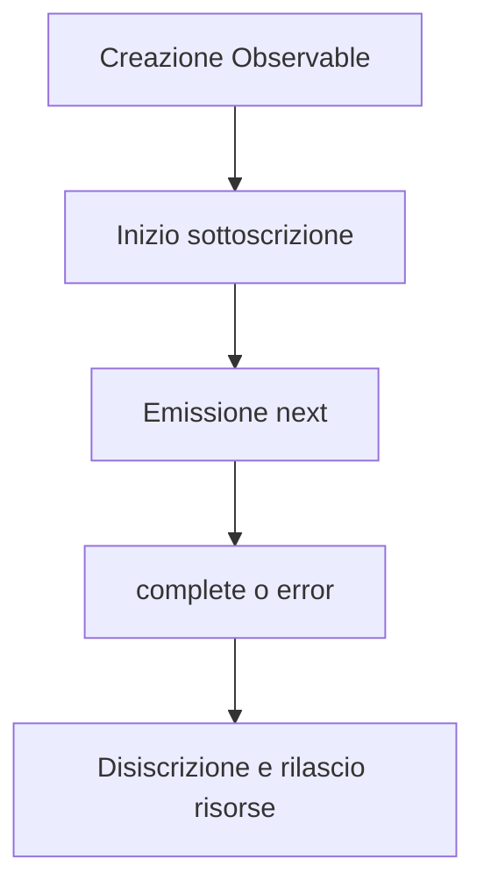

# Ciclo di vita degli Observable

Questa sezione descrive passo per passo il ciclo di vita degli Observable in RxJS, dalla creazione, alla sottoscrizione, alla pubblicazione dei dati, al completamento e alla notifica degli errori, alla disiscrizione e alla gestione delle risorse.
La comprensione di questo ciclo di vita è fondamentale per utilizzare RxJS in modo efficace.

## Panoramica del ciclo di vita degli Observable

Il ciclo di vita dell'Observable si riferisce alla sequenza di creazione di un Observable, al momento in cui pubblica i dati, al modo in cui viene terminato o notificato l'errore e infine al momento in cui la risorsa viene rilasciata. La comprensione di questo aspetto consente di capire correttamente il comportamento di RxJS, di annullare la sottoscrizione nei tempi previsti, di controllare gli effetti collaterali e di gestire gli errori.

### 🔄 Diagramma del ciclo di vita dell'Observable (transizioni di stato)




## Struttura del ciclo di vita di un Observable
Il ciclo di vita di un Observable consiste nelle seguenti fasi.

|Ordine|Fase|Contenuto|
|---|---|---|
|1|Creazione (Creation)|Creazione dell'istanza Observable|
|2|Sottoscrizione (Subscription)|Avvio della sottoscrizione tramite il metodo `subscribe()`|
|3|Esecuzione (Execution)|<li>`next()`: pubblicazione dati</li><li>`error()`: notifica errore</li><li>`complete()`: notifica completamento</li>|
|4|Disiscrizione (Disposal)|Annullamento della sottoscrizione con il metodo `unsubscribe()`|

L'Observable è "lazy" (esecuzione pigra) e lo stream non viene pubblicato finché non viene chiamato `subscribe()`. Inoltre, lo stream viene terminato quando viene chiamato `complete()` o `error()` e ogni ulteriore chiamata a `next()` viene ignorata.

> [!CAUTION]
> Nessun tipo di "elaborazione" viene eseguita direttamente da `subscribe()`.
> Si usa spesso l'espressione "Non viene eseguito finché non si chiama `subscribe()`".
> Per essere precisi, la "logica interna dell'Observable (processo di notifica)" viene attivata per la prima volta da `subscribe()`.
>
> Operatori come `pipe()` costruiscono solo la catena di valutazione, l'esecuzione è avviata dalle callback dell'Observer.

### Esempio di ciclo di vita di un Observable
```ts
import { Observable } from 'rxjs';

// 1. Creazione Observable
const observable$ = new Observable<number>(subscriber => {
  console.log('Inizio esecuzione Observable');

  // 3. Esecuzione: pubblicazione dati
  subscriber.next(1);
  subscriber.next(2);

  // Setup del timer
  const timerId = setTimeout(() => {
    subscriber.next(3);
    subscriber.complete(); // 3. Esecuzione: notifica completamento
    console.log('Observable completato');
  }, 1000);

  // Restituisce la funzione di cleanup (chiamata su unsubscribe)
  return () => {
    console.log('Esecuzione cleanup');
    clearTimeout(timerId);
  };
});

// 2. Sottoscrizione
const subscription = observable$.subscribe({
  next: value => console.log('Valore successivo:', value),
  error: err => console.error('Errore:', err),
  complete: () => console.log('Notifica di completamento ricevuta')
});

// 4. Disiscrizione (manuale o al completamento)
setTimeout(() => {
  console.log('Disiscrizione manuale');
  subscription.unsubscribe();
}, 500); // Disiscrizione a 500ms (prima della notifica di completamento)

// Risultato:
// Inizio esecuzione Observable
// Valore successivo: 1
// Valore successivo: 2
// Disiscrizione manuale
// Esecuzione cleanup
```

## Observer (Osservatore) {#observer}

Un Observer è un oggetto che funge da ricevitore per ricevere notifiche da un Observable. Quando si sottoscrive (subscribe) a un Observable, si può passare un Observer per gestire i dati pubblicati, gli errori e le notifiche di completamento.

### Le tre funzioni callback dell'Observer
L'Observer è l'interfaccia per ricevere le notifiche dall'Observable.
Ha tre funzioni callback:
- `next`: pubblicazione dati
- `error`: notifica errore
- `complete`: notifica completamento

#### Esempio
```ts
import { Observer, of } from 'rxjs';

// Oggetto Observer completo
const observer: Observer<number> = {
  next: value => console.log('Valore:', value),// Pubblicazione dati
  error: err => console.error('Errore:', err), // Notifica errore
  complete: () => console.log('Completato') // Notifica completamento
};

const observable$ = of(1, 2, 3); // Creazione semplice di Observable

// Utilizzo dell'oggetto Observer
observable$.subscribe(observer);

// È possibile anche un Observer parziale
observable$.subscribe({
  next: value => console.log('Solo elaborazione valore:', value)
});

// Formato oggetto (consigliato)
observable$.subscribe({
  next: value => console.log('Valore::', value),
  error: err => console.error('Errore:', err),
  complete: () => console.log('Completato::')
});

// Risultato:
// Valore: 1
// Valore: 2
// Valore: 3
// Completato
// Solo elaborazione valore: 1
// Solo elaborazione valore: 2
// Solo elaborazione valore: 3
// Valore:: 1
// Valore:: 2
// Valore:: 3
// Completato::
```

## Subscription (Sottoscrizione) {#subscription}

La Subscription rappresenta l'esecuzione di un Observable ed è usata principalmente per la disiscrizione `unsubscribe()`.

#### Esempio
```ts
import { interval } from 'rxjs';
import { take } from 'rxjs';

const numbers$ = interval(1000).pipe(take(5));

// Mantieni la subscription
const subscription = numbers$.subscribe({
  next: value => console.log('Valore:', value),
  complete: () => console.log('Completato')
});

// Disiscrizione manuale dopo 3 secondi
setTimeout(() => {
  subscription.unsubscribe(); // Disiscrizione
  console.log('Disiscrizione completata');
}, 3000);

// Risultato:
// Valore: 0
// Valore: 1
// Valore: 2
// Disiscrizione completata
```


## Gestione degli errori

Nel ciclo di vita di Observable, la chiamata a `error()` termina immediatamente lo stream e `complete()` non viene chiamata. Per questo è importante l'uso di `catchError` e la progettazione di `retry`.

#### Esempio
```ts
import { Observable, of } from 'rxjs';
import { catchError, retry } from 'rxjs';

// Observable che genera un errore
const failingObservable$ = new Observable<number>(subscriber => {
  subscriber.next(1);
  subscriber.next(2);
  subscriber.error(new Error('Errore intenzionale'));
  // Nota: complete non viene chiamato dopo l'errore
});

// Esempio di gestione errori
failingObservable$.pipe(
  // Riprova 3 volte in caso di errore
  retry(3),
  // Se ancora in errore, passa a un Observable alternativo
  catchError(error => {
    console.error('Errore catturato:', error.message);
    return of('Valore alternativo dopo errore');
  })
).subscribe({
  next: value => console.log('Valore:', value),
  error: err => console.error('Errore non gestito:', err),
  complete: () => console.log('Completato')
});

// Risultato:
// Valore: 1
// Valore: 2
// Valore: 1
// Valore: 2
// Valore: 1
// Valore: 2
// Valore: 1
// Valore: 2
// Errore catturato: Errore intenzionale
// Valore: Valore alternativo dopo errore
// Completato
```

## Ciclo di vita del completamento

Il completamento di un Observable avviene quando viene chiamato esplicitamente `complete()` o quando viene terminato uno stream finito.

#### Esempio
```ts
import { of, interval, Observable } from 'rxjs';
import { take } from 'rxjs';

// Observable finito (completamento automatico)
const finite$ = of(1, 2, 3);
finite$.subscribe({
  next: value => console.log('Valore finito:', value),
  complete: () => console.log('Observable finito completato')
});

// Conversione di Observable infinito in finito
const limited$ = interval(1000).pipe(take(3));
limited$.subscribe({
  next: value => console.log('Valore limitato:', value),
  complete: () => console.log('Observable limitato completato')
});

// Observable completato manualmente
const manual$ = new Observable<number>(subscriber => {
  subscriber.next(1);

  setTimeout(() => {
    subscriber.next(2);
    subscriber.complete(); // Completamento esplicito
  }, 2000);
});

manual$.subscribe({
  next: value => console.log('Valore manuale:', value),
  complete: () => console.log('Observable manuale completato')
});

// Risultato:
// Valore finito: 1
// Valore finito: 2
// Valore finito: 3
// Observable finito completato
// Valore manuale: 1
// Valore limitato: 0
// Valore limitato: 1
// Valore manuale: 2
// Observable manuale completato
// Valore limitato: 2
// Observable limitato completato
```

## Gestione delle risorse e prevenzione delle perdite di memoria

La disiscrizione al momento giusto è importante per prevenire le perdite di memoria.

#### Esempio
```ts
import { interval, Subject } from 'rxjs';
import { takeUntil } from 'rxjs';

// Simulazione del ciclo di vita di un componente
class Component {
  private destroy$ = new Subject<void>();

  constructor() {
    // Intervallo ogni secondo (potenziale causa di memory leak)
    interval(1000).pipe(
      // Disiscrizione automatica alla distruzione del componente
      takeUntil(this.destroy$)
    ).subscribe(value => {
      console.log('Valore nel componente:', value);
    });
  }

  // Distruzione del componente
  ngOnDestroy() {
    console.log('Distruzione componente');
    this.destroy$.next();
    this.destroy$.complete();
  }
}

// Esempio di utilizzo
const component = new Component();

// Distruggi il componente dopo 5 secondi
setTimeout(() => {
  (component as any).ngOnDestroy();
}, 5000);

// Risultato:
// Valore nel componente: 0
// Valore nel componente: 1
// Valore nel componente: 2
// Valore nel componente: 3
// Valore nel componente: 4
// Distruzione componente
```

## Riepilogo

La comprensione del ciclo di vita di un Observable consente di:

- Rilasciare le risorse al momento giusto
- Implementare strategie di gestione e recupero degli errori
- Distinguere tra l'uso di Observable freddi e caldi
- Gestire gli effetti collaterali

In particolare, i framework basati su componenti come Angular e React richiedono la gestione delle sottoscrizioni lungo il ciclo di vita, utilizzando `takeUntil`, `unsubscribe`, `finalize`, ecc.
