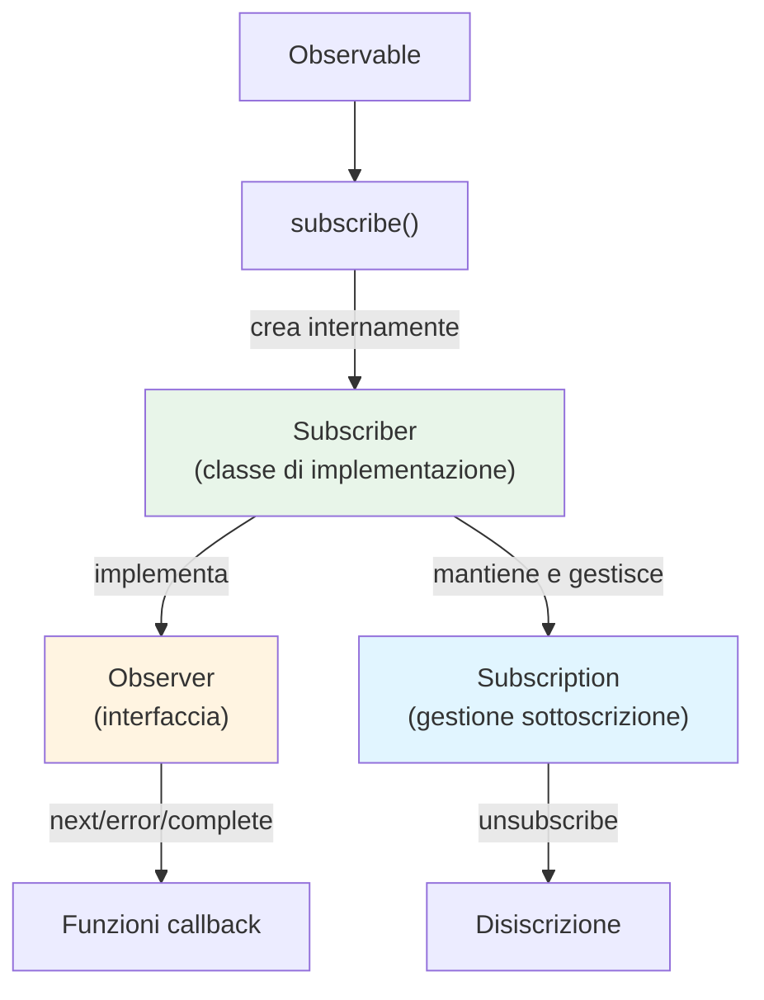
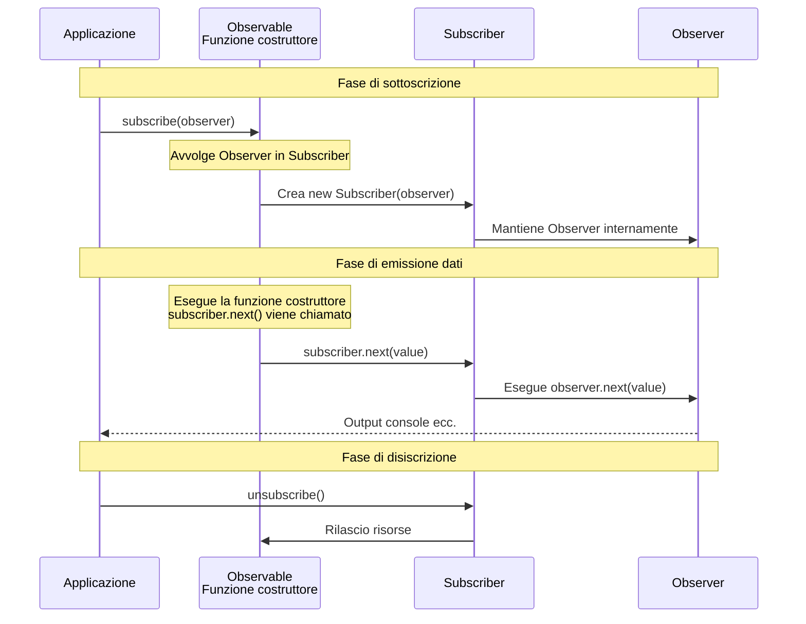

# Differenza tra Observer e Subscriber

## Perché vengono confusi

Quando si impara RxJS, i termini "Observer" e "Subscriber" possono creare confusione. I due sono strettamente correlati, ma hanno ruoli nettamente diversi.

## Cos'è un Observer

Un **Observer (Osservatore)** è un'**interfaccia** per ricevere dati.

### Definizione di Observer

```typescript
interface Observer<T> {
  next: (value: T) => void;       // Riceve valori
  error?: (err: any) => void;     // Riceve errori
  complete?: () => void;          // Riceve il completamento
}
```

### Ruolo dell'Observer
- Definisce come i dati vengono "ricevuti"
- Ha tre funzioni di callback
- Descrive **cosa fare**

## Cos'è un Subscriber

Un **Subscriber (Sottoscrittore)** è una **classe** che implementa Observer e gestisce l'effettivo processo di sottoscrizione.

### Ruolo del Subscriber
- Esegue le callback dell'Observer
- Mantiene la Subscription (gestione delle sottoscrizioni)
- Gestisce il processo di disiscrizione
- Controlla **come viene eseguito**

## Due situazioni in cui compare Subscriber

Subscriber appare in **due diverse situazioni**. Tuttavia, **entrambi sono lo stesso oggetto Subscriber**. Capire questa differenza è fondamentale per evitare confusione.

### Situazione 1: Quando si crea un Observable (ricevuto come parametro)

Quando si crea un Observable con `new Observable()`, il `subscriber` viene passato come parametro alla funzione costruttore.

```typescript
import { Observable } from 'rxjs';

// Usa subscriber per emettere valori (tipo è Subscriber<number>)
const observable$ = new Observable<number>(subscriber => {
  subscriber.next(1);      // Emette un valore
  subscriber.next(2);
  subscriber.complete();   // Notifica il completamento
});
```

::: tip Tipo di subscriber in questa situazione
- Tipo: `Subscriber<number>`
- Ruolo: Usato per pubblicare dati internamente nell'Observable
- Usato direttamente dallo sviluppatore (chiama `next()`, `error()`, `complete()`)
:::

### Situazione 2: Quando viene chiamato subscribe() (converte Observer → Subscriber)

Quando si chiama `subscribe()` su un Observable, l'**Observer passato dallo sviluppatore viene internamente convertito in un Subscriber**.

```typescript
// Lo sviluppatore passa un'interfaccia Observer
observable$.subscribe({
  next: value => console.log('Valore successivo:', value),
  error: err => console.error('Errore:', err),
  complete: () => console.log('Completato')
});

// ↑ RxJS internamente crea il Subscriber come segue
// const subscriber = new Subscriber(observer);
// E questo subscriber viene passato come parametro nella situazione 1
```

::: tip Elaborazione in questa situazione
1. Lo sviluppatore passa l'interfaccia `Observer`
2. RxJS avvolge internamente l'`Observer` in un `Subscriber`
3. Il `Subscriber` viene passato alla funzione costruttore dell'Observable (= `subscriber` nella situazione 1)
:::

### Importante: entrambi sono lo stesso oggetto Subscriber

> [!IMPORTANT] Il `Subscriber` della situazione 1 e della situazione 2 è lo stesso oggetto
>
> ```typescript
> const observable$ = new Observable(subscriber => {
>   // Questo subscriber è lo stesso oggetto Subscriber
>   // creato quando viene chiamato subscribe()
>   subscriber.next(1);
> });
>
> observable$.subscribe({
>   // Questo Observer viene avvolto in un Subscriber,
>   // che viene passato alla funzione costruttore sopra
>   next: v => console.log(v)
> });
> ```
>
> **In altre parole:**
> - Lo sviluppatore chiama `subscribe(observer)`
> - RxJS crea un `new Subscriber(observer)`
> - Questo Subscriber diventa l'argomento della funzione costruttore dell'Observable
> - Quindi `subscriber` nella situazione 1 = `Subscriber` creato nella situazione 2

## Illustrazione delle relazioni



## Differenze viste nel codice

### Esempio completo: dalla creazione dell'Observable alla sottoscrizione

```typescript
import { Observable } from 'rxjs';

// 1. Creazione Observable: usa subscriber per emettere valori
const observable$ = new Observable<number>(subscriber => {
  console.log('Inizio sottoscrizione');
  subscriber.next(1);
  subscriber.next(2);
  subscriber.next(3);
  subscriber.complete();
});

// 2. Sottoscrizione: passa un Observer (internamente viene creato il Subscriber)
observable$.subscribe({
  next: value => console.log('Valore successivo:', value),
  error: err => console.error('Errore:', err),
  complete: () => console.log('Completato')
});

// Output:
// Inizio sottoscrizione
// Valore successivo: 1
// Valore successivo: 2
// Valore successivo: 3
// Completato
```

#### In questo esempio
- **`subscriber` alla creazione**: usato per pubblicare dati all'interno dell'Observable
- **`Observer` alla sottoscrizione**: definisce il processo per ricevere i dati pubblicati

### Quando si passa un Observer

```typescript
import { interval } from 'rxjs';

const observer = {
  next: (value: number) => console.log(value),
  error: (err: any) => console.error(err),
  complete: () => console.log('Completato')
};

// Passa Observer a subscribe
const subscription = interval(1000).subscribe(observer);
// Internamente viene creato un Subscriber che esegue le callback dell'observer
```

### Quando si passano direttamente le callback (notazione semplificata)

```typescript
// Anche qui viene creato internamente un Subscriber
const subscription = interval(1000).subscribe(
  value => console.log(value),  // next
  err => console.error(err),    // error
  () => console.log('Completato')     // complete
);
```

## Flusso effettivo dell'operazione

Il seguente diagramma di sequenza mostra il flusso dalla creazione dell'Observable alla sottoscrizione e alla pubblicazione dei dati.



**Punti importanti di questo flusso:**
1. La chiamata a `subscribe(observer)` crea un `new Subscriber(observer)`
2. Il Subscriber viene passato come parametro alla funzione costruttore dell'Observable
3. Quando viene chiamato `subscriber.next()` nella funzione costruttore, viene eseguito l'interno `observer.next()`
4. In altre parole, **`subscriber` nella situazione 1 = `Subscriber` creato nella situazione 2**

## Punti chiave

> [!IMPORTANT] Observer è un "blueprint", Subscriber è un "executor"
> - **Observer**: l'interfaccia che **definisce** come vengono ricevuti i dati
> - **Subscriber**: la classe che **implementa** l'Observer e **esegue** effettivamente la sottoscrizione
> - Subscriber appare in due situazioni

> [!TIP] Capire quando usare Subscriber
> - **Quando si crea un Observable**: usa direttamente il parametro `subscriber` di `new Observable(subscriber => {...})`
> - **Quando si sottoscrive**: la chiamata a `subscribe(observer)` crea automaticamente il Subscriber internamente
>
> In entrambe le situazioni, il Subscriber è lo stesso oggetto con i metodi `next()`, `error()` e `complete()`.

## Pattern di confusione comuni

### ❌ Comprensione errata #1

"`subscriber` quando si crea un Observable e `observer` quando si sottoscrive sono cose diverse"

### ❌ Comprensione errata #2

"Subscriber è un'implementazione interna, quindi gli sviluppatori non la toccano"

### ✅ Comprensione corretta

**Fatto importante:**
- L'**Observer** che lo sviluppatore passa in `subscribe(observer)` viene internamente avvolto in un **Subscriber**
- Quel **Subscriber** viene passato come parametro alla funzione costruttore quando si crea l'Observable
- In altre parole, **`subscriber` nella situazione 1 = `Subscriber` creato nella situazione 2 (stesso oggetto)**

### Capire con un esempio completo

```typescript
import { Observable } from 'rxjs';

// 1. Crea Observable (a questo punto non viene eseguito nulla)
const observable$ = new Observable<number>(subscriber => {
  console.log('La funzione costruttore è stata eseguita!');
  subscriber.next(1);
  subscriber.next(2);
  subscriber.complete();
});

// 2. Sottoscrivi (solo in questo momento la funzione costruttore viene eseguita)
observable$.subscribe({
  next: v => console.log('Ricevuto:', v),
  complete: () => console.log('Completato')
});

// Output:
// La funzione costruttore è stata eseguita!
// Ricevuto: 1
// Ricevuto: 2
// Completato
```

**Flusso in questo esempio:**
1. `observable$.subscribe({...})` viene chiamato
2. RxJS crea `new Subscriber({next: ..., complete: ...})`
3. La funzione costruttore `(subscriber => {...})` viene eseguita con quel `Subscriber` come parametro
4. `subscriber.next(1)` nella funzione costruttore viene chiamato
5. Internamente viene eseguito `observer.next(1)` e viene emesso "Ricevuto: 1"

**In altre parole:**
- Il `subscriber` della situazione 1 ← questo
- Il `Subscriber` creato nella situazione 2 ← questo
- **Stesso oggetto!**

## Riepilogo

### Confronto tra Observer e Subscriber

| | Observer | Subscriber |
|---|----------|------------|
| **Tipo** | Interfaccia | Classe (implementa Observer) |
| **Ruolo** | Definisce come vengono ricevuti i dati | Esegue l'effettivo processo di sottoscrizione |
| **Contenuto** | Callback per next/error/complete | Observer + Gestione Subscription |
| **Quando appare** | Solo alla sottoscrizione | Alla creazione Observable e alla sottoscrizione |

### Importante: relazione tra le due situazioni

| Situazione | Gestito dallo sviluppatore | Tipo effettivo | Relazione |
|------|------------------|----------|--------|
| **Alla creazione Observable** | Parametro di `new Observable(subscriber => {...})` | `Subscriber<T>` | Usato direttamente dallo sviluppatore |
| **Alla sottoscrizione** | Oggetto passato a `subscribe(observer)` | `Observer<T>` → convertito internamente in `Subscriber<T>` | Convertito automaticamente da RxJS |

> [!IMPORTANT] Punti fondamentali
> - L'`Observer` che lo sviluppatore passa in `subscribe(observer)` viene internamente avvolto in un `Subscriber`
> - Il `Subscriber` viene passato come parametro alla funzione costruttore dell'Observable
> - Pertanto, **il `Subscriber` utilizzato in entrambe le situazioni è lo stesso oggetto**

## Prossimi passi

Una volta compresa la differenza tra Observer e Subscriber, il passo successivo è imparare a gestire le sottoscrizioni nella pratica.

- [Ciclo di vita degli Observable](/it/guide/observables/observable-lifecycle) - Dall'inizio alla fine della sottoscrizione
- [Gestione delle Subscription](/it/guide/observables/observable-lifecycle#subscription-サブスクリプション) - Disiscrizione e gestione delle risorse

## Risorse di riferimento

- [Documentazione ufficiale RxJS - Observer](https://rxjs.dev/guide/observer) - Specifiche dettagliate dell'Observer
- [Documentazione ufficiale RxJS - Subscription](https://rxjs.dev/guide/subscription) - Specifiche dettagliate della Subscription
- [Understanding the Difference Between Observer and Subscriber in RxJS](https://www.codingscenes.com/posts/92/Understanding-the-Difference-Between-Observer-and-Subscriber-in-RxJS) - Estensioni di Subscriber ed esempi pratici (inglese)
