# Barriere alla comprensione concettuale

La prima barriera a RxJS è la **comprensione dei concetti**. Il comportamento degli Observable può essere controintuitivo, specialmente per gli sviluppatori abituati alle Promise.

## Differenze essenziali tra Observable e Promise

### Promise: elaborazione asincrona una tantum

```typescript
// Promise: restituisce il valore una sola volta
const userPromise = fetch('/api/user/1').then(res => res.json());

userPromise.then(user => console.log(user)); // Ottiene le informazioni utente una sola volta
userPromise.then(user => console.log(user)); // Stesso risultato dalla cache
```

> [!TIP] Caratteristiche
> - **Eager (esecuzione immediata)** - L'elaborazione inizia al momento della creazione della Promise
> - **Completa solo una volta** - Solo una volta, successo o fallimento
> - **Non cancellabile** - Una volta avviata, non può essere interrotta
> - **Sempre Hot** - Più then condividono lo stesso risultato

### Observable: stream (flusso di dati con asse temporale)

```typescript
import { Observable } from 'rxjs';

// Observable: più valori che fluiscono lungo l'asse temporale
const user$ = new Observable<User>(subscriber => {
  console.log('Esecuzione Observable iniziata!');
  fetch('/api/user/1')
    .then(res => res.json())
    .then(user => {
      subscriber.next(user);
      subscriber.complete();
    });
});

// ❌ Non succede ancora nulla a questo punto (Lazy)
console.log('Creazione Observable completata');

// ✅ Eseguito solo dopo la sottoscrizione
user$.subscribe(user => console.log('Sottoscrizione 1:', user));
user$.subscribe(user => console.log('Sottoscrizione 2:', user));
// → La chiamata API viene eseguita due volte (Cold Observable)
```

#### Output
```
Creazione Observable completata
Esecuzione Observable iniziata!
Sottoscrizione 1: { id: 1, name: 'Alice' }
Esecuzione Observable iniziata!
Sottoscrizione 2: { id: 1, name: 'Alice' }
```

> [!TIP] Caratteristiche
> - **Lazy (esecuzione ritardata)** - Non succede nulla finché non si sottoscrive
> - **Più valori possono fluire** - next() può essere chiamato più volte
> - **Cancellabile** - Può essere interrotto con unsubscribe
> - **Cold o Hot** - Si può scegliere di eseguire per sottoscrizione o condividere

### Tabella di confronto

| Caratteristica | Promise | Observable |
|---|---|---|
| **Tempistica di esecuzione** | Immediata (Eager) | Alla sottoscrizione (Lazy) |
| **Numero di valori** | Solo una volta | 0 o più (multipli possibili) |
| **Cancellazione** | Non possibile | Possibile (unsubscribe) |
| **Riutilizzo** | Risultato dalla cache | Riesecuzione per sottoscrizione (Cold) |
| **Dopo errore** | Termina | Termina (retry possibile) |

### Visualizzazione delle differenze di comportamento

Il seguente diagramma di sequenza illustra le differenze nel flusso di esecuzione tra Promise e Observable.

```mermaid
sequenceDiagram
    participant User
    participant Promise
    participant Observable

    Note over User,Promise: Nel caso di Promise
    User->>Promise: Creazione (esecuzione immediata)
    activate Promise
    Promise-->>Promise: Chiamata API in corso...
    Promise-->>User: Restituisce un valore
    deactivate Promise
    Note over Promise: Completata (non rieseguibile)

    Note over User,Observable: Nel caso di Observable
    User->>Observable: Creazione (non succede nulla)
    Note over Observable: In attesa (Lazy)

    User->>Observable: subscribe()
    activate Observable
    Observable-->>Observable: Chiamata API in corso...
    Observable-->>User: Valore 1
    Observable-->>User: Valore 2
    Observable-->>User: Valore 3
    Note over Observable: Più valori lungo l'asse temporale
    Observable-->>User: complete()
    deactivate Observable

    User->>Observable: subscribe() di nuovo
    activate Observable
    Note over Observable: Riesecuzione dall'inizio (Cold)
    Observable-->>User: Valore 1
    Observable-->>User: Valore 2
    deactivate Observable
    User->>Observable: unsubscribe()
    Note over Observable: Cancellabile
```



### Idee sbagliate comuni

#### ❌ Idea sbagliata 1: "Observable è solo per l'asincrono"

```typescript
// Observable può gestire anche elaborazioni sincrone
import { of } from 'rxjs';

const sync$ = of(1, 2, 3);

console.log('Prima di subscribe');
sync$.subscribe(value => console.log(value));
console.log('Dopo subscribe');

// Output (eseguito sincronamente):
// Prima di subscribe
// 1
// 2
// 3
// Dopo subscribe
```

#### ❌ Idea sbagliata 2: "subscribe restituisce un valore"

```typescript
import { map, of } from "rxjs";

const observable$ = of(1, 2, 3);

// ❌ Cattivo esempio: pensiero da Promise
const value = observable$.subscribe(x => x); // value è un oggetto Subscription
console.log(value); // Subscription { ... } ← Non il valore atteso

// ✅ Buon esempio: pensiero da Observable
observable$.pipe(
  map(x => x * 2)
).subscribe(value => {
  console.log(value); // Usa il valore qui
});
```

## Comprensione intuitiva di Cold vs Hot

### Cold Observable: stream indipendenti per sottoscrizione

```typescript
import { interval } from 'rxjs';
import { take } from 'rxjs';

// Cold: ogni sottoscrittore ha un timer indipendente
const cold$ = interval(1000).pipe(take(3));

console.log('Sottoscrizione 1 avviata');
cold$.subscribe(x => console.log('Sottoscrizione 1:', x));

setTimeout(() => {
  console.log('Sottoscrizione 2 avviata (dopo 2 secondi)');
  cold$.subscribe(x => console.log('Sottoscrizione 2:', x));
}, 2000);

// Output:
// Sottoscrizione 1 avviata
// Sottoscrizione 1: 0        (dopo 1 secondo)
// Sottoscrizione 1: 1        (dopo 2 secondi)
// Sottoscrizione 2 avviata (dopo 2 secondi)
// Sottoscrizione 1: 2        (dopo 3 secondi)
// Sottoscrizione 2: 0        (dopo 3 secondi) ← Sottoscrizione 2 parte dall'inizio
// Sottoscrizione 2: 1        (dopo 4 secondi)
// Sottoscrizione 2: 2        (dopo 5 secondi)
```

> [!TIP] Caratteristiche Cold
> - **Esecuzione indipendente** per sottoscrizione
> - Mantiene un "blueprint" dei dati
> - Esempi: chiamate API HTTP, timer, lettura file

### Hot Observable: tutti i sottoscrittori condividono lo stesso stream

```typescript
import { interval } from 'rxjs';
import { take, share } from 'rxjs';

// Hot: condiviso da share()
const hot$ = interval(1000).pipe(
  take(3),
  share() // Questo lo rende Hot
);

console.log('Sottoscrizione 1 avviata');
hot$.subscribe(x => console.log('Sottoscrizione 1:', x));

setTimeout(() => {
  console.log('Sottoscrizione 2 avviata (dopo 2 secondi)');
  hot$.subscribe(x => console.log('Sottoscrizione 2:', x));
}, 2000);

// Output:
// Sottoscrizione 1 avviata
// Sottoscrizione 1: 0        (dopo 1 secondo)
// Sottoscrizione 1: 1        (dopo 2 secondi)
// Sottoscrizione 2 avviata (dopo 2 secondi)
// Sottoscrizione 1: 2        (dopo 3 secondi)
// Sottoscrizione 2: 2        (dopo 3 secondi) ← Sottoscrizione 2 si è unita a metà
```

> [!TIP] Caratteristiche Hot
> - Tutti i sottoscrittori **condividono la stessa esecuzione**
> - I dati vengono "trasmessi"
> - Esempi: eventi click, WebSocket, Subject

### Come identificare Cold/Hot

```typescript
import { fromEvent, interval, of, Subject } from 'rxjs';
import { share } from 'rxjs';

// Cold (esecuzione indipendente per sottoscrizione)
const cold1$ = of(1, 2, 3);
const cold2$ = interval(1000);
const cold3$ = ajax('/api/data');
const cold4$ = fromEvent(button, 'click'); // Cold ma speciale

// Hot (condiviso tra sottoscrittori)
const hot1$ = new Subject<number>();
const hot2$ = interval(1000).pipe(share()); // Converte Cold in Hot
```

> [!IMPORTANT] Come distinguere
> - **Creation Functions (of, from, fromEvent, interval, ajax, ecc.)** → Cold
> - **Famiglia Subject** → Hot
> - **Uso di share(), shareReplay()** → Converte Cold in Hot

## Passaggio al pensiero dichiarativo

### Imperativo vs Dichiarativo

RxJS è un paradigma di **programmazione dichiarativa**.

#### ❌ Pensiero imperativo (Promise/async-await)

```typescript
// Imperativo: descrive "come" elaborare
async function processUsers() {
  const response = await fetch('/api/users');
  const users = await response.json();

  const activeUsers = [];
  for (const user of users) {
    if (user.isActive) {
      activeUsers.push(user);
    }
  }

  const userNames = [];
  for (const user of activeUsers) {
    userNames.push(user.name.toUpperCase());
  }

  return userNames;
}
```

#### ✅ Pensiero dichiarativo (RxJS)

```typescript
import { from } from 'rxjs';
import { mergeMap, filter, map, toArray } from 'rxjs';

// Dichiarativo: descrive "cosa" trasformare
const processUsers$ = from(fetch('/api/users')).pipe(
  mergeMap(res => res.json()),
  mergeMap(users => users), // Espande l'array
  filter(user => user.isActive),
  map(user => user.name.toUpperCase()),
  toArray()
);

processUsers$.subscribe(userNames => console.log(userNames));
```


::: tip Differenza
- **Imperativo**: descrive la procedura (loop, ramificazione condizionale, assegnazione variabili)
- **Dichiarativo**: descrive la pipeline di trasformazione (flusso di dati)
:::

### Punti chiave per la trasformazione del pensiero

#### Punto 1: Nessuna elaborazione dati dentro subscribe

La trasformazione dei dati dovrebbe essere in pipe, subscribe solo per gli effetti collaterali.

```typescript
import { filter, map, of } from "rxjs";

const observable$ = of(1, 2, 3);
// ❌ Cattivo esempio: elaborazione dentro subscribe
observable$.subscribe(value => {
  const doubled = value * 2;           // 👈 Calcolo dentro subscribe
  const filtered = doubled > 4 ? doubled : null;  // 👈 Ramificazione condizionale dentro subscribe
  if (filtered) {                      // 👈 if dentro subscribe
    console.log(filtered);
  }
});

// ✅ Buon esempio: trasformazione in pipe
observable$.pipe(
  map(value => value * 2),       // Calcolo in pipe
  filter(value => value > 4)     // Anche il filtraggio in pipe
).subscribe(value => console.log(value));  // subscribe solo per effetti collaterali
```

#### Punto 2: Nessuna variabile intermedia

```typescript
import { filter, map, Observable, of } from "rxjs";

const source$ = of(1, 2, 3, 4, 5);

// ❌ Cattivo esempio: salva in variabili intermedie
let doubled$: Observable<number>;      // 👈 Dichiara variabile intermedia
let filtered$: Observable<number>;     // 👈 Dichiara variabile intermedia

doubled$ = source$.pipe(map(x => x * 2));    // 👈 Assegna a variabile intermedia
filtered$ = doubled$.pipe(filter(x => x > 5)); // 👈 Assegna a variabile intermedia
filtered$.subscribe(console.log);

// ✅ Buon esempio: connetti con pipeline
source$.pipe(
  map(x => x * 2),      // Connetti direttamente nella pipeline
  filter(x => x > 5)    // Connetti direttamente nella pipeline
).subscribe(console.log);
```

#### Punto 3: Evita subscribe annidati

```typescript
// ❌ Cattivo esempio: subscribe annidato
getUser$(userId).subscribe(user => {
  getOrders$(user.id).subscribe(orders => {  // 👈 Altro subscribe dentro subscribe (annidato)
    console.log(user, orders);
  });  // 👈 L'unsubscribe diventa complicato
});

// ✅ Buon esempio: appiattisci con mergeMap
getUser$(userId).pipe(
  mergeMap(user =>                // Appiattisci l'Observable interno con mergeMap
    getOrders$(user.id).pipe(
      map(orders => ({ user, orders }))
    )
  )
).subscribe(({ user, orders }) => console.log(user, orders));  // Sottoscrizione solo in un posto
```

#### Punto 4: Organizza con sintassi di separazione in 3 fasi

Una tecnica importante che migliora significativamente la leggibilità e la manutenibilità del codice RxJS è la **sintassi di separazione in fasi**.

```typescript
// ❌ Cattivo esempio: one-liner con tutto mescolato
fromEvent(document, 'click').pipe(
  map(event => (event as MouseEvent).clientX),
  filter(x => x > 100),
  throttleTime(200)
).subscribe({
  next: x => console.log('Posizione click:', x),
  error: err => console.error(err)
});
```

> [!IMPORTANT] Problemi
> - Definizione stream, trasformazione e sottoscrizione mescolate
> - Difficile da debuggare (non si sa dove si verificano i problemi)
> - Difficile da testare
> - Non riutilizzabile

```typescript
// ✅ Buon esempio: separazione in 3 fasi

import { filter, fromEvent, map, throttleTime } from "rxjs";

// 1. Definizione Observable (sorgente dello stream)
const clicks$ = fromEvent(document, 'click');

// 2. Definizione Pipeline (processo di trasformazione dati)
const processed$ = clicks$.pipe(
  map(event => (event as MouseEvent).clientX),
  filter(x => x > 100),
  throttleTime(200)
);

// 3. Processo di sottoscrizione (esecuzione effetti collaterali)
const subscription = processed$.subscribe({
  next: x => console.log('Posizione click:', x),
  error: err => console.error(err),
  complete: () => console.log('Completato')
});
```

#### Vantaggi
- **Facile da debuggare** - Si possono inserire `console.log` e `tap` ad ogni fase
- **Testabile** - `processed$` può essere testato indipendentemente
- **Riutilizzabilità** - `clicks$` e `processed$` possono essere usati altrove
- **Migliore leggibilità** - L'intento del codice è chiaro

**La sintassi di separazione in fasi è uno dei metodi più pratici per superare le difficoltà di RxJS.**

Per maggiori informazioni, vedi **[Capitolo 10: One-liner hell e sintassi di separazione in fasi](/it/guide/anti-patterns/one-liner-hell)**.

## Sperimenta e comprendi (uso dello Starter Kit)

### Esperimento 1: Differenza tra Lazy e Eager

```typescript
import { Observable } from 'rxjs';

console.log('=== Promise (Eager) ===');
const promise = new Promise((resolve) => {
  console.log('Promise eseguita!');
  resolve(42);
});
console.log('Creazione Promise completata');
promise.then(value => console.log('Risultato Promise:', value));

console.log('\n=== Observable (Lazy) ===');
const observable$ = new Observable(subscriber => {
  console.log('Observable eseguito!');
  subscriber.next(42);
  subscriber.complete();
});
console.log('Creazione Observable completata');
observable$.subscribe(value => console.log('Risultato Observable:', value));

// Output:
// === Promise (Eager) ===
// Promise eseguita!
// Creazione Promise completata
// Risultato Promise: 42
//
// === Observable (Lazy) ===
// Creazione Observable completata
// Observable eseguito!
// Risultato Observable: 42
```

### Esperimento 2: Differenza tra Cold e Hot

```typescript
import { interval } from 'rxjs';
import { take, share } from 'rxjs';

// Cold: indipendente per sottoscrizione
const cold$ = interval(1000).pipe(take(3));

console.log('Cold Observable:');
cold$.subscribe(x => console.log('Cold Sottoscrizione 1:', x));
setTimeout(() => {
  cold$.subscribe(x => console.log('Cold Sottoscrizione 2:', x));
}, 2000);

// Hot: condiviso
const hot$ = interval(1000).pipe(take(3), share());

setTimeout(() => {
  console.log('\nHot Observable:');
  hot$.subscribe(x => console.log('Hot Sottoscrizione 1:', x));
  setTimeout(() => {
    hot$.subscribe(x => console.log('Hot Sottoscrizione 2:', x));
  }, 2000);
}, 6000);
```

**[Eseguilo nell'ambiente di apprendimento](/it/guide/starter-kid) per sperimentare la differenza.**

### Esperimento 3: Dichiarativo vs Imperativo

```typescript
import { of } from 'rxjs';
import { map, filter } from 'rxjs';

const numbers = [1, 2, 3, 4, 5, 6, 7, 8, 9, 10];

// Imperativo
console.log('=== Imperativo ===');
const result1: number[] = [];
for (const num of numbers) {
  const doubled = num * 2;
  if (doubled > 10) {
    result1.push(doubled);
  }
}
console.log(result1);

// Dichiarativo
console.log('\n=== Dichiarativo ===');
of(...numbers).pipe(
  map(num => num * 2),
  filter(num => num > 10)
).subscribe(num => console.log(num));
```

## Verifica della comprensione

Verifica di poter rispondere alle seguenti domande.

```markdown
## Concetti di base
- [ ] Elencare tre differenze tra Promise e Observable
- [ ] Spiegare la differenza tra Lazy e Eager
- [ ] Spiegare la differenza tra Cold e Hot con esempi

## Pratica
- [ ] Spiegare perché l'elaborazione non dovrebbe essere completata dentro subscribe
- [ ] Sapere come correggere un subscribe annidato
- [ ] Conoscere come convertire un Cold Observable in Hot

## Debug
- [ ] Identificare la causa quando un Observable non viene eseguito
- [ ] Comprendere cosa causa l'esecuzione multipla di una sottoscrizione
```

## Prossimi passi

Una volta compresa la teoria, è il momento di passare alle barriere pratiche.

- **Barriere alla gestione del ciclo di vita** - Quando fare subscribe/unsubscribe
- **Confusione nella selezione degli operatori** - Criteri per scegliere tra 100+ operatori

## Sezioni correlate

- **[Cos'è RxJS](/it/guide/basics/what-is-rxjs)** - Concetti base di RxJS
- **[Differenze tra Promise e RxJS](/it/guide/basics/promise-vs-rxjs)** - Promise vs Observable
- **[Cold e Hot Observables](/it/guide/observables/cold-and-hot-observables)** - Spiegazione dettagliata di Cold/Hot
