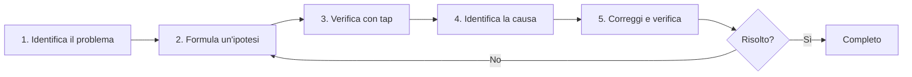

# Barriera del Debug

Quando affronti problemi in RxJS come **"i valori non fluiscono", "i valori sono diversi dal previsto", o "potrebbe esserci un memory leak"**, ci vuole tempo per risolvere senza conoscere i metodi di debug appropriati. Questa pagina spiega in modo completo le tecniche di debug specifiche di RxJS.

## Strategia Base di Debug RxJS

### 5 Passi del Debug



### Passo 1: Identifica il Problema

Prima di tutto, chiarisci **qual è il problema**.

| Sintomo | Possibili Cause |
|---|---|
| Nessun valore fluisce | Dimenticato subscribe, terminato prima di complete, escluso da filter |
| Il primo valore non appare | Condizione iniziale di combineLatest non soddisfatta, BehaviorSubject non impostato |
| L'ordine è sbagliato | Uso di mergeMap, timing asincrono |
| Valori duplicati appaiono | Subscribe multipli senza share, uso errato di shareReplay |
| Memory leak | Dimenticato unsubscribe, shareReplay refCount: false |
| Valori in ritardo | debounceTime, throttleTime, elaborazione asincrona |

### Passo 2: Formula un'Ipotesi

**Ipotizza** la causa del problema.

```typescript
// Esempio: problema "i valori non appaiono"
// Ipotesi 1: Non sottoscritto?
// Ipotesi 2: complete/error troppo presto?
// Ipotesi 3: Escluso da filter?
// Ipotesi 4: Sta richiedendo tempo per l'elaborazione asincrona?
```

### Passo 3: Verifica con tap

Inserisci `tap` in ogni fase per confermare **cosa sta realmente accadendo**.

```typescript
import { of } from 'rxjs';
import { map, filter, tap } from 'rxjs';

of(1, 2, 3, 4, 5).pipe(
  tap(v => console.log('🔵 Input:', v)),
  filter(x => x > 10), // ❌ Tutti esclusi
  tap(v => console.log('✅ Passato filter:', v)),
  map(x => x * 10),
  tap(v => console.log('🟢 Dopo map:', v))
).subscribe(result => {
  console.log('📦 Risultato:', result);
});

// Output:
// 🔵 Input: 1
// 🔵 Input: 2
// 🔵 Input: 3
// 🔵 Input: 4
// 🔵 Input: 5
// (Nessuno ha passato filter → filter è la causa)
```

## Scenari di Debug Comuni

### Scenario 1: I Valori Non Fluiscono

#### Problema 1-1: Dimenticato subscribe

#### ❌ Esempio Cattivo: Non sottoscritto
```typescript
import { of } from 'rxjs';
import { map } from 'rxjs';

const result$ = of(1, 2, 3).pipe(
  map(x => x * 10)
);

console.log('Completo'); // Output immediato
// Nessun valore fluisce a result$ (perché non sottoscritto)
```

#### ✅ Esempio Buono: Subscribe
```typescript
import { of } from 'rxjs';
import { map } from 'rxjs';

const result$ = of(1, 2, 3).pipe(
  map(x => x * 10)
);

result$.subscribe(value => {
  console.log('Valore:', value);
});

console.log('Completo');

// Output:
// Valore: 10
// Valore: 20
// Valore: 30
// Completo
```

> [!IMPORTANT] Checkpoint
> - Non succede nulla solo definendo un Observable
> - **Bisogna fare subscribe**
> - Non c'è bisogno di subscribe quando si usa async pipe (Angular, ecc.)

#### Problema 1-2: complete/error Troppo Presto

#### ❌ Esempio Cattivo: complete arriva prima
```typescript
import { EMPTY } from 'rxjs';
import { map } from 'rxjs';

EMPTY.pipe( // ❌ Completa immediatamente
  map(x => x * 10)
).subscribe({
  next: value => console.log('Valore:', value),
  complete: () => console.log('Completo')
});

// Output:
// Completo
// (Nessun valore fluisce)
```

#### ✅ Esempio Buono: Verifica con tap
```typescript
import { EMPTY } from 'rxjs';
import { map, tap } from 'rxjs';

EMPTY.pipe(
  tap(() => console.log('👁️ Valore arrivato')), // Questo non produce output
  map(x => x * 10)
).subscribe({
  next: value => console.log('Valore:', value),
  complete: () => console.log('Completo')
});

// Output:
// Completo
// (tap non eseguito → EMPTY è la causa)
```

#### Problema 1-3: Escluso da filter

#### ❌ Esempio Cattivo: Tutti esclusi inconsapevolmente
```typescript
import { of } from 'rxjs';
import { filter } from 'rxjs';

of(1, 2, 3, 4, 5).pipe(
  filter(x => x > 100) // ❌ Tutti esclusi
).subscribe(value => {
  console.log('Valore:', value); // Niente output
});
```

#### ✅ Esempio Buono: Verifica con tap
```typescript
import { of } from 'rxjs';
import { filter, tap } from 'rxjs';

of(1, 2, 3, 4, 5).pipe(
  tap(v => console.log('Prima di filter:', v)),
  filter(x => x > 100),
  tap(v => console.log('Dopo filter:', v)) // Nessun output
).subscribe(value => {
  console.log('Valore:', value);
});

// Output:
// Prima di filter: 1
// Prima di filter: 2
// Prima di filter: 3
// Prima di filter: 4
// Prima di filter: 5
// (Nessuno dopo filter → filter è troppo restrittivo)
```

### Scenario 2: Valori Diversi dal Previsto

#### Problema 2-1: Errore di Conversione Tipo

#### ❌ Esempio Cattivo: Confusione tra stringa e numero
```typescript
import { of } from 'rxjs';
import { map } from 'rxjs';

const input = '5'; // Stringa

of(input).pipe(
  map(x => x + 10) // ❌ '5' + 10 = '510' (concatenazione stringhe)
).subscribe(result => {
  console.log('Risultato:', result); // Risultato: 510
  console.log('Tipo:', typeof result); // Tipo: string
});
```

#### ✅ Esempio Buono: Verifica tipo con tap
```typescript
import { of } from 'rxjs';
import { map, tap } from 'rxjs';

const input = '5';

of(input).pipe(
  tap(x => console.log('Input:', x, typeof x)),
  map(x => Number(x)), // Converti a numero
  tap(x => console.log('Dopo conversione:', x, typeof x)),
  map(x => x + 10)
).subscribe(result => {
  console.log('Risultato:', result); // Risultato: 15
});
```

#### Problema 2-2: Ordine Asincrono

#### ❌ Esempio Cattivo: Ordine alterato con mergeMap
```typescript
import { of } from 'rxjs';
import { mergeMap, delay } from 'rxjs';

of(1, 2, 3).pipe(
  mergeMap(x =>
    of(x * 10).pipe(
      delay(Math.random() * 1000) // Delay casuale
    )
  )
).subscribe(value => {
  console.log('Valore:', value);
});

// Esempio output (ordine non garantito):
// Valore: 20
// Valore: 10
// Valore: 30
```

#### ✅ Esempio Buono: Garantisci ordine con concatMap
```typescript
import { of } from 'rxjs';
import { concatMap, delay, tap } from 'rxjs';

of(1, 2, 3).pipe(
  tap(x => console.log('Input:', x)),
  concatMap(x =>
    of(x * 10).pipe(
      delay(Math.random() * 1000),
      tap(v => console.log('Completo:', v))
    )
  )
).subscribe(value => {
  console.log('Valore:', value);
});

// Output (sempre questo ordine):
// Input: 1
// Completo: 10
// Valore: 10
// Input: 2
// Completo: 20
// Valore: 20
// Input: 3
// Completo: 30
// Valore: 30
```

### Scenario 3: Rilevamento Memory Leak

#### Problema 3-1: Dimenticato unsubscribe

#### ❌ Esempio Cattivo: Non fare unsubscribe
```typescript
import { interval } from 'rxjs';

class Component {
  ngOnInit() {
    interval(1000).subscribe(n => {
      console.log('Valore:', n); // Esegue per sempre
    });
  }

  ngOnDestroy() {
    // Non fare unsubscribe → Memory leak
  }
}
```

#### ✅ Esempio Buono: Rilascio automatico con takeUntil
```typescript
import { interval, Subject } from 'rxjs';
import { takeUntil } from 'rxjs';

class Component {
  private destroy$ = new Subject<void>();

  ngOnInit() {
    interval(1000).pipe(
      takeUntil(this.destroy$)
    ).subscribe(n => {
      console.log('Valore:', n);
    });
  }

  ngOnDestroy() {
    this.destroy$.next();
    this.destroy$.complete();
    console.log('Unsubscribe completato');
  }
}
```

#### Problema 3-2: Memory Leak con shareReplay

#### ❌ Esempio Cattivo: Leak con refCount: false
```typescript
import { interval } from 'rxjs';
import { shareReplay, take, tap } from 'rxjs';

const data$ = interval(1000).pipe(
  take(100),
  tap(n => console.log('Genera:', n)),
  shareReplay({ bufferSize: 1, refCount: false })
  // ❌ refCount: false → Esegue per sempre
);

const sub = data$.subscribe(n => console.log('Subscribe 1:', n));

setTimeout(() => {
  sub.unsubscribe();
  console.log('Unsubscribe ma internamente ancora in esecuzione');
}, 5000);
```

#### ✅ Esempio Buono: Stop automatico con refCount: true
```typescript
import { interval } from 'rxjs';
import { shareReplay, take, tap } from 'rxjs';

const data$ = interval(1000).pipe(
  take(100),
  tap(n => console.log('Genera:', n)),
  shareReplay({ bufferSize: 1, refCount: true })
  // ✅ refCount: true → Si ferma quando tutti fanno unsubscribe
);

const sub = data$.subscribe(n => console.log('Subscribe 1:', n));

setTimeout(() => {
  sub.unsubscribe();
  console.log('Unsubscribe → Stream si ferma anche');
}, 5000);
```

## Strumenti e Tecniche di Debug

### 1. Debug Passo Passo con tap

```typescript
import { of } from 'rxjs';
import { map, filter, tap } from 'rxjs';

const debugTap = <T>(label: string, color: string = '🔵') =>
  tap<T>({
    next: value => console.log(`${color} [${label}] next:`, value),
    error: error => console.error(`❌ [${label}] error:`, error),
    complete: () => console.log(`✅ [${label}] complete`)
  });

of(1, 2, 3, 4, 5).pipe(
  debugTap('Input'),
  filter(x => x % 2 === 0),
  debugTap('Dopo filter', '🟢'),
  map(x => x * 10),
  debugTap('Dopo map', '🟡')
).subscribe({
  next: value => console.log('📦 Risultato finale:', value),
  complete: () => console.log('🏁 Completo')
});
```

### 2. Operatore Debug Personalizzato

```typescript
import { tap, timestamp, map } from 'rxjs';
import { MonoTypeOperatorFunction } from 'rxjs';

interface DebugOptions {
  label: string;
  showTimestamp?: boolean;
  showDiff?: boolean;
}

let lastTimestamp = 0;

function debug<T>(options: DebugOptions): MonoTypeOperatorFunction<T> {
  const { label, showTimestamp = true, showDiff = true } = options;

  return source => source.pipe(
    timestamp(),
    tap(({ value, timestamp }) => {
      const parts = [`[${label}]`, value];

      if (showTimestamp) {
        parts.push(`@${new Date(timestamp).toISOString()}`);
      }

      if (showDiff && lastTimestamp > 0) {
        const diff = timestamp - lastTimestamp;
        parts.push(`(+${diff}ms)`);
      }

      console.log(...parts);
      lastTimestamp = timestamp;
    }),
    map(({ value }) => value)
  );
}

// Utilizzo
import { interval } from 'rxjs';
import { take } from 'rxjs';

interval(500).pipe(
  take(5),
  debug({ label: 'Timer' }),
  map(x => x * 10),
  debug({ label: 'Dopo conversione', showDiff: false })
).subscribe();
```

### 3. RxJS DevTools (Estensione Browser)

**Installazione:**
1. Cerca "RxJS DevTools" nel Chrome/Edge Web Store
2. Aggiungi estensione
3. Apri DevTools e clicca sulla tab "RxJS"

**Funzionalità Principali:**
- Monitora tutti gli Observable in tempo reale
- Visualizzazione con Marble Diagram
- Traccia subscribe/unsubscribe
- Analisi performance

**Esempio d'Uso:**
```typescript
import { interval } from 'rxjs';
import { map, take } from 'rxjs';

// Rilevato automaticamente da DevTools
const timer$ = interval(1000).pipe(
  take(10),
  map(x => x * 2)
);

timer$.subscribe(value => console.log(value));
```

### 4. Debug degli Errori

#### Identifica la Posizione dell'Errore

```typescript
import { of, throwError } from 'rxjs';
import { map, catchError, tap } from 'rxjs';

of(1, 2, 3).pipe(
  tap(v => console.log('1. Input:', v)),
  map(x => {
    if (x === 2) {
      throw new Error('Non si può usare 2');
    }
    return x * 10;
  }),
  tap(v => console.log('2. Dopo map:', v)), // Non eseguito in caso di errore
  catchError(error => {
    console.error('3. Errore catturato:', error.message);
    return of(-1); // Ritorna valore di default
  }),
  tap(v => console.log('4. Dopo catchError:', v))
).subscribe({
  next: value => console.log('5. Risultato:', value),
  error: error => console.error('Errore subscribe:', error),
  complete: () => console.log('6. Completo')
});

// Output:
// 1. Input: 1
// 2. Dopo map: 10
// 5. Risultato: 10
// 1. Input: 2
// 3. Errore catturato: Non si può usare 2
// 4. Dopo catchError: -1
// 5. Risultato: -1
// 6. Completo
```

## Debug delle Performance

### Problema 1: Ricalcolo Eccessivo

#### ❌ Esempio Cattivo: Ricalcolo frequente con combineLatest
```typescript
import { BehaviorSubject, combineLatest } from 'rxjs';
import { map } from 'rxjs';

const a$ = new BehaviorSubject(1);
const b$ = new BehaviorSubject(2);
const c$ = new BehaviorSubject(3);

combineLatest([a$, b$, c$]).pipe(
  map(([a, b, c]) => {
    console.log('Calcolo pesante eseguito'); // Eseguito frequentemente
    return a + b + c;
  })
).subscribe(result => console.log('Risultato:', result));

// Aggiornamenti frequenti
setInterval(() => {
  a$.next(Math.random());
}, 100);
```

#### ✅ Esempio Buono: Escludi duplicati con distinctUntilChanged
```typescript
import { BehaviorSubject, combineLatest } from 'rxjs';
import { map, distinctUntilChanged } from 'rxjs';

const a$ = new BehaviorSubject(1);
const b$ = new BehaviorSubject(2);
const c$ = new BehaviorSubject(3);

combineLatest([a$, b$, c$]).pipe(
  map(([a, b, c]) => Math.floor(a) + Math.floor(b) + Math.floor(c)),
  distinctUntilChanged(), // Passa solo quando il valore cambia
  map(sum => {
    console.log('Calcolo pesante eseguito'); // Solo quando il valore cambia
    return sum * 2;
  })
).subscribe(result => console.log('Risultato:', result));

setInterval(() => {
  a$.next(Math.random());
}, 100);
```

### Problema 2: Monitora Uso Memoria

```typescript
import { interval } from 'rxjs';
import { scan, tap } from 'rxjs';

let itemCount = 0;

interval(100).pipe(
  scan((acc, val) => {
    acc.push(val);
    itemCount = acc.length;
    return acc;
  }, [] as number[]),
  tap(() => {
    if (itemCount % 100 === 0) {
      console.log(`Conteggio elementi: ${itemCount}`);
      if (itemCount > 10000) {
        console.warn('⚠️ Uso memoria troppo alto');
      }
    }
  })
).subscribe();
```

### Problema 3: Monitora Conteggio Subscription

```typescript
import { Observable, Subject } from 'rxjs';

class MonitoredSubject<T> extends Subject<T> {
  private subscriptionCount = 0;

  subscribe(...args: any[]): any {
    this.subscriptionCount++;
    console.log(`Conteggio subscription: ${this.subscriptionCount}`);

    const subscription = super.subscribe(...args);

    const originalUnsubscribe = subscription.unsubscribe.bind(subscription);
    subscription.unsubscribe = () => {
      this.subscriptionCount--;
      console.log(`Conteggio subscription: ${this.subscriptionCount}`);
      originalUnsubscribe();
    };

    return subscription;
  }
}

// Utilizzo
const data$ = new MonitoredSubject<number>();

const sub1 = data$.subscribe(v => console.log('Subscribe 1:', v));
const sub2 = data$.subscribe(v => console.log('Subscribe 2:', v));

sub1.unsubscribe();
sub2.unsubscribe();

// Output:
// Conteggio subscription: 1
// Conteggio subscription: 2
// Conteggio subscription: 1
// Conteggio subscription: 0
```

## Checklist di Debug

Quando si verifica un problema, controlla quanto segue in ordine.

```markdown
## Controllo Base
- [ ] Stai chiamando `subscribe()`?
- [ ] `complete` o `error` non troppo presto?
- [ ] Valori non esclusi da `filter` o `take`?
- [ ] Stai aspettando il completamento dell'elaborazione asincrona?

## Controllo Timing
- [ ] Comprendi sincrono/asincrono?
- [ ] Confermato impatto di `delay`, `debounceTime`, `throttleTime`?
- [ ] Soddisfatta condizione di prima emissione di `combineLatest`?

## Controllo Memoria
- [ ] Stai usando `unsubscribe` o `takeUntil`?
- [ ] Impostato `refCount: true` per `shareReplay`?
- [ ] Observable infiniti adeguatamente limitati?

## Controllo Performance
- [ ] Non si verifica ricalcolo eccessivo? (considera `distinctUntilChanged`)
- [ ] Conteggio subscription non troppo alto?
- [ ] Elaborazione pesante resa asincrona con `observeOn(asyncScheduler)`?
```

## Checklist di Comprensione

Verifica se riesci a rispondere alle seguenti domande.

```markdown
## Debug Base
- [ ] So fare debug del flusso valori usando tap
- [ ] So identificare la posizione dell'errore
- [ ] So confermare timing complete/error

## Uso Strumenti
- [ ] Conosco uso base di RxJS DevTools
- [ ] So creare operatori debug personalizzati
- [ ] So misurare timing con timestamp

## Risoluzione Problemi
- [ ] So identificare cause dei valori che non fluiscono
- [ ] So trovare segni di memory leak
- [ ] So identificare problemi di performance

## Prevenzione
- [ ] Ho abitudine di debug passo passo con tap
- [ ] Implemento correttamente gestione errori
- [ ] Conosco contromisure per memory leak
```

## Prossimi Passi

Una volta comprese le tecniche di debug, integra tutte le conoscenze apprese e studia i **pattern pratici**.

→ **Capitolo 13: Pattern Pratici** (in preparazione) - Pattern per uso pratico

## Pagine Correlate

- **[Capitolo 8: Tecniche di Debug RxJS](/it/guide/debugging/)** - Tecniche di debug complessive
- **[Capitolo 9: Marble Testing](/it/guide/testing/marble-testing)** - Debug con TestScheduler
- **[Comprendere Timing e Ordine](/it/guide/overcoming-difficulties/timing-and-order)** - Debug con tap
- **[Capitolo 10: Errori Comuni e Soluzioni](/it/guide/anti-patterns/common-mistakes)** - Evitare anti-pattern

## 🎯 Esercizi

### Problema 1: Identificare Perché i Valori Non Fluiscono

Nel seguente codice, identifica perché i valori non vengono emessi.

```typescript
import { Subject, combineLatest } from 'rxjs';

const a$ = new Subject<number>();
const b$ = new Subject<number>();

combineLatest([a$, b$]).subscribe(([a, b]) => {
  console.log('Valori:', a, b);
});

a$.next(1);
console.log('Completo');
```

<details>
<summary>Soluzione</summary>

> [!NOTE] Causa
> `combineLatest` non emette finché tutti gli stream non hanno emesso almeno una volta
>
> Poiché `b$` non ha ancora emesso un valore, solo `a$.next(1)` non farà emettere.

#### Metodo di Correzione 1: Emetti valore anche a b$
```typescript
import { Subject, combineLatest } from 'rxjs';

const a$ = new Subject<number>();
const b$ = new Subject<number>();

combineLatest([a$, b$]).subscribe(([a, b]) => {
  console.log('Valori:', a, b);
});

a$.next(1);
b$.next(2); // ← Emette qui
console.log('Completo');

// Output:
// Valori: 1 2
// Completo
```

#### Metodo di Correzione 2: Usa BehaviorSubject
```typescript
import { BehaviorSubject, combineLatest } from 'rxjs';

const a$ = new BehaviorSubject<number>(0); // Valore iniziale
const b$ = new BehaviorSubject<number>(0);

combineLatest([a$, b$]).subscribe(([a, b]) => {
  console.log('Valori:', a, b);
});

// Output: Valori: 0 0 (emette immediatamente)

a$.next(1);
// Output: Valori: 1 0
```

> [!NOTE] Tecnica di Debug
> Usare tap per controllare i valori di ogni stream mostra dove è bloccato.
> ```typescript
> a$.pipe(tap(v => console.log('a$:', v)))
> b$.pipe(tap(v => console.log('b$:', v)))
> ```

</details>

### Problema 2: Correggere Memory Leak

Il seguente codice ha un memory leak. Correggilo.

```typescript
import { interval } from 'rxjs';
import { Component } from '@angular/core';

class MyComponent implements Component {
  ngOnInit() {
    interval(1000).subscribe(n => {
      console.log('Timer:', n);
    });
  }

  ngOnDestroy() {
    console.log('Destroy');
  }
}
```

<details>
<summary>Soluzione</summary>

> [!NOTE] Problema
> Non fare unsubscribe in `ngOnDestroy`, quindi interval continua anche dopo che il componente è distrutto

#### Metodo di Correzione 1: Salva Subscription e fai unsubscribe
```typescript
import { interval, Subscription } from 'rxjs';

class MyComponent {
  private subscription!: Subscription;

  ngOnInit() {
    this.subscription = interval(1000).subscribe(n => {
      console.log('Timer:', n);
    });
  }

  ngOnDestroy() {
    this.subscription.unsubscribe();
    console.log('Destroy & unsubscribe');
  }
}
```

#### Metodo di Correzione 2: Usa takeUntil (raccomandato)
```typescript
import { interval, Subject } from 'rxjs';
import { takeUntil } from 'rxjs';

class MyComponent {
  private destroy$ = new Subject<void>();

  ngOnInit() {
    interval(1000).pipe(
      takeUntil(this.destroy$)
    ).subscribe(n => {
      console.log('Timer:', n);
    });
  }

  ngOnDestroy() {
    this.destroy$.next();
    this.destroy$.complete();
    console.log('Destroy & unsubscribe');
  }
}
```

> [!IMPORTANT] Punti Chiave
> - Observable infiniti come interval richiedono sempre unsubscribe
> - Pattern takeUntil è raccomandato (può gestire subscription multiple in una volta)
> - In Angular, usare async pipe fa automaticamente unsubscribe

</details>

### Problema 3: Problema di Ordine

Nel seguente codice, spiega perché l'ordine non è garantito e correggilo.

```typescript
import { from, of } from 'rxjs';
import { mergeMap, delay } from 'rxjs';

from([1, 2, 3]).pipe(
  mergeMap(x =>
    of(x).pipe(
      delay(Math.random() * 1000)
    )
  )
).subscribe(value => console.log(value));

// Esempio output: 2, 1, 3 (ordine non garantito)
```

<details>
<summary>Soluzione</summary>

> [!NOTE] Problema
> `mergeMap` esegue in parallelo, quindi l'ordine di completamento dipende dal tempo di esecuzione

#### Metodo di Correzione: Usa concatMap
```typescript
import { from, of } from 'rxjs';
import { concatMap, delay, tap } from 'rxjs';

from([1, 2, 3]).pipe(
  tap(x => console.log('Inizio:', x)),
  concatMap(x =>
    of(x).pipe(
      delay(Math.random() * 1000),
      tap(v => console.log('Completo:', v))
    )
  )
).subscribe(value => console.log('Risultato:', value));

// Output (sempre questo ordine):
// Inizio: 1
// Completo: 1
// Risultato: 1
// Inizio: 2
// Completo: 2
// Risultato: 2
// Inizio: 3
// Completo: 3
// Risultato: 3
```

> [!NOTE] Motivo
> - **mergeMap**: Esecuzione parallela, ordine di completamento non garantito
> - **concatMap**: Esecuzione sequenziale, sempre output nello stesso ordine dell'input
> - **switchMap**: Solo l'ultimo, l'elaborazione vecchia viene cancellata
> - **exhaustMap**: Ignora nuova elaborazione mentre esegue

#### Confronto con Marble Diagram
```
Input:  --1--2--3----|

mergeMap:  --2--1--3--|  (ordine di completamento)
concatMap: --1--2--3-| (ordine di input)
```

</details>

### Problema 4: Miglioramento Performance

Il seguente codice ha ricalcolo frequente. Migliora le performance.

```typescript
import { fromEvent } from 'rxjs';
import { map } from 'rxjs';

const input = document.querySelector('input')!;

fromEvent(input, 'input').pipe(
  map(e => (e.target as HTMLInputElement).value),
  map(value => {
    console.log('Calcolo pesante eseguito');
    return value.toUpperCase();
  })
).subscribe(result => console.log(result));

// L'utente digita "hello"
// Calcolo pesante eseguito (h)
// Calcolo pesante eseguito (he)
// Calcolo pesante eseguito (hel)
// Calcolo pesante eseguito (hell)
// Calcolo pesante eseguito (hello)
```

<details>
<summary>Soluzione</summary>

#### Metodo di Miglioramento 1: Aspetta completamento input con debounceTime
```typescript
import { fromEvent } from 'rxjs';
import { map, debounceTime } from 'rxjs';

const input = document.querySelector('input')!;

fromEvent(input, 'input').pipe(
  debounceTime(300), // Esegui se nessun input per 300ms
  map(e => (e.target as HTMLInputElement).value),
  map(value => {
    console.log('Calcolo pesante eseguito');
    return value.toUpperCase();
  })
).subscribe(result => console.log(result));

// Digita "hello" e aspetta 300ms, esegue solo una volta
```

#### Metodo di Miglioramento 2: Escludi duplicati con distinctUntilChanged
```typescript
import { fromEvent } from 'rxjs';
import { map, debounceTime, distinctUntilChanged } from 'rxjs';

const input = document.querySelector('input')!;

fromEvent(input, 'input').pipe(
  debounceTime(300),
  map(e => (e.target as HTMLInputElement).value),
  distinctUntilChanged(), // Ignora se uguale al valore precedente
  map(value => {
    console.log('Calcolo pesante eseguito');
    return value.toUpperCase();
  })
).subscribe(result => console.log(result));
```

> [!TIP] Tecniche di Miglioramento Performance
> - **debounceTime**: Aspetta completamento input
> - **throttleTime**: Dirada a intervalli regolari
> - **distinctUntilChanged**: Escludi duplicati
> - **observeOn(asyncScheduler)**: Rendi elaborazione pesante asincrona
> - **shareReplay**: Cache risultati

</details>
