# Superare le difficoltà di RxJS

Anche gli sviluppatori con esperienza in TypeScript e lavoro aziendale affrontano molte difficoltà nella pratica di RxJS. Questa sezione spiega sistematicamente le sfide specifiche di RxJS e come superarle.

## Perché RxJS è difficile

La difficoltà di RxJS risiede nell'**alto livello di astrazione dei concetti** e nella **necessità di un cambio di paradigma**. Anche gli sviluppatori esperti sono confusi dal fatto che le loro conoscenze e i loro modelli di pensiero precedenti non funzionano. Vediamo i punti di difficoltà specifici qui sotto.

### Le conoscenze esistenti non funzionano

Gli sviluppatori abituati a Promise e Async/Await si confondono cercando di usare RxJS con la stessa sensazione.

```typescript
// ❌ Pensiero in stile Promise: voglio ottenere direttamente il valore
observable.subscribe(value => {
  const result = value * 2;
  return result; // questo non restituisce nulla
});

// ✅ Pensiero in stile RxJS: trasformare lo stream
const doubled$ = observable.pipe(
  map(value => value * 2)
);
```

> [!IMPORTANT] Problemi
> - Il pensiero di programmazione imperativa (then/await di Promise) non funziona
> - È necessario pensare alla "trasformazione dello stream" piuttosto che ai valori
> - Cercare di completare l'elaborazione all'interno di subscribe porta ad anti-pattern

### Viene aggiunto il concetto di asse temporale

La caratteristica più importante di RxJS è il concetto di "asse temporale". Promise restituisce un valore solo una volta, ma Observable può far scorrere più valori nel tempo.

```typescript
// Promise: il valore viene restituito solo una volta
const promise = fetch('/api/data');

// Observable: più valori scorrono lungo l'asse temporale
const clicks$ = fromEvent(button, 'click');
//                     asse temporale
// clicks$:  ------click----click--click---------->
```

> [!IMPORTANT] Problemi
> - È necessario essere sempre consapevoli di "quando scorreranno i valori"
> - La differenza tra sincrono/asincrono influisce sul comportamento
> - La lettura dei Marble Diagram diventa essenziale

### Scegliere tra più di 100 operatori

RxJS ha più di 100 operatori, e i principianti sono confusi nella scelta. Ci sono molti operatori con nomi simili, rendendo difficile giudicare quale usare.

> [!IMPORTANT] Dubbi comuni
> - "map, mergeMap, switchMap, concatMap... Non capisco le differenze"
> - "debounceTime e throttleTime, quale usare?"
> - "combineLatest e zip, qual è la differenza?"

→ Il Capitolo 11 fornisce **criteri di selezione pratici**.

### Panoramica completa delle difficoltà di RxJS

Il seguente diagramma mostra di quali elementi è composta la difficoltà di RxJS.

```mermaid
mindmap
  root((Difficoltà di RxJS))
    Livello di astrazione concettuale
      Valore vs Stream
      Imperativo vs Dichiarativo
      Concetto di asse temporale
    Cambio di paradigma
      Fuga dal pensiero in stile Promise
      Limiti del pensiero sincrono
      Da singolo valore a più valori
    Molte scelte
      Più di 100 operatori
      Operatori con nomi simili
      Complessità delle combinazioni
    Difficoltà di debug
      Tracciamento asincrono
      Visualizzazione dello stato
      Problemi di timing
```



## Elenco delle principali difficoltà

Le principali difficoltà incontrate nell'apprendimento e nella pratica di RxJS sono state classificate in 7 categorie. Ogni difficoltà ha una pagina dedicata che spiega in dettaglio i metodi di risoluzione specifici. Per prima cosa, identifica la difficoltà che stai affrontando dalla tabella seguente.

| Difficoltà | Contenuto | Sintomi comuni |
|---|---|---|
| **[Barriera della comprensione concettuale](/it/guide/overcoming-difficulties/conceptual-understanding)** | Observable vs Promise, Cold vs Hot | "Qual è la differenza con Promise?" |
| **[Gestione del ciclo di vita](/it/guide/overcoming-difficulties/lifecycle-management)** | subscribe/unsubscribe, memory leak | "Quando dovrei fare unsubscribe?" |
| **[Selezione dell'operatore](/it/guide/overcoming-difficulties/operator-selection)** | Criteri per scegliere tra più di 100 operatori | "Quale operatore dovrei usare?" |
| **[Tempistica e ordine](/it/guide/overcoming-difficulties/timing-and-order)** | Quando scorrono i valori, sincrono vs asincrono | "Perché non viene fuori il valore?" |
| **[Gestione dello stato](/it/guide/overcoming-difficulties/state-and-sharing)** | Subject, share/shareReplay | "Voglio condividere lo stato" |
| **[Combinazione di più stream](/it/guide/overcoming-difficulties/stream-combination)** | combineLatest, zip, withLatestFrom | "Voglio combinare i risultati di 2 API" |
| **[Debug](/it/guide/overcoming-difficulties/debugging-guide)** | I valori non scorrono, valori diversi da quelli attesi | "Non capisco cosa sta succedendo" |

### Relazione tra le difficoltà

Le difficoltà di RxJS non sono indipendenti, ma correlate tra loro. Il seguente diagramma di flusso mostra in quale ordine si incontrano le difficoltà nel processo di apprendimento e come si concatenano. Controlla in quale fase ti trovi attualmente.


## Come utilizzare ogni sezione

Gli articoli di questo Capitolo possono essere letti in modo indipendente. Inizia dalla sezione necessaria in base al contenuto con cui hai difficoltà. Di seguito viene spiegato come utilizzarli in modo efficace.

### 1. Identificare la propria difficoltà

Dalla tabella sopra, seleziona la sezione corrispondente alla **difficoltà attuale**. Puoi anche fare una ricerca inversa dai sintomi della difficoltà.

#### Esempio
- Non riesco a ottenere valori dalla chiamata API → [Tempistica e ordine](/it/guide/overcoming-difficulties/timing-and-order)
- Preoccupato per i memory leak → [Gestione del ciclo di vita](/it/guide/overcoming-difficulties/lifecycle-management)
- Confuso tra mergeMap e switchMap → [Selezione dell'operatore](/it/guide/overcoming-difficulties/operator-selection)
- Voglio condividere lo stato tra più componenti → [Gestione dello stato](/it/guide/overcoming-difficulties/state-and-sharing)
- Voglio combinare i risultati di 2 API → [Combinazione di più stream](/it/guide/overcoming-difficulties/stream-combination)
- Non so come fare il debug → [Debug](/it/guide/overcoming-difficulties/debugging-guide)

### 2. Capire con Esempio cattivo → Esempio buono

Ogni sezione è strutturata come segue.

```
❌ Esempio cattivo (pattern in cui è facile cadere)
↓
✅ Esempio buono (pattern consigliato)
↓
💡 Spiegazione (perché è cattivo, perché è buono)
↓
🎯 Esercizi (verifica della comprensione)
```

### 3. Sperimentare con lo Starter Kit

Tutti gli esempi di codice possono essere eseguiti effettivamente nell'[ambiente di esecuzione per l'apprendimento](/it/guide/starter-kid).

#### Flusso di apprendimento consigliato
1. Copia l'esempio cattivo ed eseguilo → Sperimenta il problema
2. Copia l'esempio buono ed eseguilo → Senti la differenza
3. Applica al tuo codice → Consolidamento

## Roadmap di apprendimento

Il modo di procedere nell'apprendimento varia a seconda del livello di competenza attuale e dell'obiettivo. Scegli la roadmap che si adatta a te tra i seguenti 3 pattern.

### Se stai imparando RxJS per la prima volta

Approccio sistematico che impara dalle basi in ordine e supera le difficoltà incontrate in ogni capitolo.


### Se hai compreso le basi ma hai difficoltà nella pratica

Se hai conoscenze di base ma affronti problemi in progetti reali, è più efficiente affrontare direttamente le difficoltà.

```mermaid
graph TD
    A[Identificare la difficoltà attuale] --> B{Quale difficoltà?}
    B -->|I valori non scorrono| C[Tempistica e ordine]
    B -->|Selezione operatore| D[Selezione operatore]
    B -->|Memory leak| E[Ciclo di vita]
    B -->|Condivisione stato| F[Gestione stato]
    B -->|API multiple| G[Combinazione stream]
    C --> H[Capitolo 13: Pattern pratici]
    D --> H
    E --> H
    F --> H
    G --> H
```



### Se sei caduto negli anti-pattern

Se stai già scrivendo codice RxJS ma sospetti di essere caduto negli anti-pattern, inizia identificando il problema nel Capitolo 10 e comprendendo la difficoltà che ha causato ciò.

```mermaid
graph TD
    A[Capitolo 10: Raccolta anti-pattern] --> B[Confermare il problema applicabile]
    B --> C{Perché è successo?}
    C -->|Fraintendimento concettuale| D[Comprensione concettuale]
    C -->|Errore selezione operatore| E[Selezione operatore]
    C -->|Subscribe hell| F[Capitolo 13: Pattern pratici]
    D --> G[Dopo la correzione, pratica al Capitolo 13]
    E --> G
    F --> G
```



## Sezioni correlate

Il Capitolo 11 (Superare le difficoltà di RxJS) lavora in sinergia con altri Capitoli per aumentare l'efficacia dell'apprendimento. È particolarmente correlato ai seguenti 3 Capitoli, e la lettura combinata approfondisce la comprensione.

- **[Capitolo 10: Raccolta anti-pattern RxJS](/it/guide/anti-patterns/)** - Imparare "cosa è sbagliato"
- **[Capitolo 13: Raccolta pattern pratici](/it/guide/)** - Imparare "come dovrebbe essere scritto" (in preparazione)
- **[Capitolo 8: Tecniche di debug RxJS](/it/guide/debugging/)** - Imparare "come trovare i problemi"

#### Flusso di apprendimento
1. **Capitolo 11 (questo capitolo)** - Comprendere le difficoltà di RxJS
2. **Capitolo 10** - Conoscere gli anti-pattern specifici
3. **Capitolo 13** - Acquisire i corretti pattern di implementazione

## Checklist di comprensione

Checklist per verificare la propria comprensione dopo l'apprendimento di ogni sezione. Se puoi spuntare tutto, hai raggiunto un livello in cui puoi utilizzare il contenuto di quella sezione nella pratica.

```markdown
## Comprensione concettuale
- [ ] Posso spiegare le differenze tra Observable e Promise
- [ ] Posso spiegare le differenze tra Cold e Hot con esempi reali
- [ ] Comprendo i vantaggi della programmazione dichiarativa

## Abilità pratiche
- [ ] Posso fare subscribe/unsubscribe al momento giusto
- [ ] Posso scegliere l'operatore appropriato per lo scopo
- [ ] Posso leggere i Marble Diagram e prevedere il comportamento

## Debug
- [ ] Posso fare il debug dello stream usando tap
- [ ] Posso identificare la causa quando i valori non scorrono
- [ ] Posso trovare i segni di memory leak
```

## Prossimi passi

Dopo aver compreso la panoramica completa delle difficoltà di RxJS in questa pagina, procedi all'apprendimento specifico.

**Pagina da leggere prima:**

→ **[Barriera della comprensione concettuale](/it/guide/overcoming-difficulties/conceptual-understanding)** - Comprendere l'essenza del pensiero di RxJS

Questa pagina si concentra sulla "comprensione concettuale" che è alla base di tutte le difficoltà. Iniziando da qui, potrai comprendere più facilmente anche gli altri punti di difficoltà. Dopo aver compreso i concetti, procedi alla pagina della difficoltà specifica che stai affrontando.
