# Barriere alla gestione del ciclo di vita

Una delle maggiori insidie di RxJS è la **gestione del ciclo di vita**. Errori nel "quando fare subscribe" e "quando fare unsubscribe" possono portare a perdite di memoria e bug.

## Quando fare subscribe

### Principio di base: Non fare subscribe fino all'ultimo momento

#### ❌ Cattivo esempio: Subscribe a metà strada

```typescript
import { interval } from 'rxjs';

function getEvenNumbers() {
  const numbers$ = interval(1000);

  // subscribe qui dentro
  numbers$.subscribe(n => {
    if (n % 2 === 0) {
      console.log(n); // come passiamo questo all'esterno?
    }
  });
}
```

#### ✅ Buon esempio: Restituire Observable, subscribe sul chiamante

```typescript
import { interval } from 'rxjs';
import { filter, take } from 'rxjs';

function getEvenNumbers() {
  return interval(1000).pipe(
    filter(n => n % 2 === 0),
    take(5)
  );
}

// subscribe sul lato di utilizzo
const subscription = getEvenNumbers().subscribe(n => {
  console.log(n);
});
```

::: tip 💡 Spiegazione
- **Esempio cattivo**: fare subscribe in una funzione fa perdere il controllo (non si può annullare, non si può comporre)
- **Esempio buono**: restituire Observable, il chiamante può controllare
:::

### Subscribe provoca "effetti collaterali"

#### ❌ Cattivo esempio: Effetti collaterali multipli in subscribe

```typescript
import { fromEvent } from 'rxjs';
import { map } from 'rxjs';

const button = document.querySelector('button')!;

fromEvent(button, 'click')
  .pipe(map(() => Math.random()))
  .subscribe(randomValue => {
    // Effetto collaterale 1: manipolazione DOM
    document.querySelector('#result')!.textContent = randomValue.toString();

    // Effetto collaterale 2: chiamata API
    fetch('/api/log', {
      method: 'POST',
      body: JSON.stringify({ value: randomValue })
    });

    // Effetto collaterale 3: Local storage
    localStorage.setItem('lastValue', randomValue.toString());
  });
```

#### ✅ Buon esempio: Isolare gli effetti collaterali e fare subscribe solo a ciò che serve

```typescript
import { fromEvent } from 'rxjs';
import { map } from 'rxjs';

const button = document.querySelector('button')!;

const randomClicks$ = fromEvent(button, 'click').pipe(
  map(() => Math.random())
);

// se servono solo aggiornamenti DOM
randomClicks$.subscribe(value => {
  document.querySelector('#result')!.textContent = value.toString();
});

// se serve solo il logging
randomClicks$.subscribe(value => {
  fetch('/api/log', {
    method: 'POST',
    body: JSON.stringify({ value })
  });
});
```

::: tip 💡 Spiegazione
- **subscribe = punto di esecuzione dell'effetto collaterale**
- **Se gli effetti collaterali sono indipendenti**: separare in più subscribe (possono essere controllati individualmente)
- **Se gli effetti collaterali sono sempre eseguiti come insieme**: OK raggrupparli in un solo subscribe
- **Se gli effetti collaterali sono necessari nella pipeline**: usare l'operatore `tap`
:::

### Quando fare subscribe: Diagramma di flusso decisionale

```mermaid
graph LR
    A[Vuoi eseguire processo Observable] --> B{Devi passare il valore all'esterno?}
    B -->|Sì| C[Restituisci Observable<br/>Non fare subscribe]
    B -->|No| D{Servono effetti collaterali?}
    D -->|Sì| E[Subscribe]
    D -->|No| F[Solo restituire Observable<br/>Usare/comporre dopo]

    C --> G[Subscribe sul chiamante]
    E --> H{Effetti collaterali multipli?}
    H -->|Sì| I[Separare con tap o<br/>subscribe multipli]
    H -->|No| J[Eseguire con un solo subscribe]
```



### L'intero ciclo di vita di una Subscription

Il seguente diagramma di transizione di stato mostra gli stati che una subscription Observable attraversa e in cui termina.


> [!IMPORTANT] Punti chiave per la gestione del ciclo di vita
> - **Subscribed**: Stato con rischio di perdita di memoria
> - **complete/error**: Pulizia automatica (unsubscribe non richiesto)
> - **unsubscribe**: Pulizia manuale richiesta (specialmente per stream infiniti)

## Quando fare unsubscribe?

### Principio di base: Fare sempre unsubscribe dopo subscribe

#### ❌ Cattivo esempio: Non fare unsubscribe → Perdita di memoria

```typescript
import { interval } from 'rxjs';

const button = document.querySelector('button')!;

function startTimer() {
  interval(1000).subscribe(n => {
    console.log(n);
  });
  // Questa subscription dura per sempre!
}

// viene aggiunta una nuova subscription ad ogni click
button.addEventListener('click', startTimer);
// 10 click = 10 subscription in esecuzione simultanea!
```

#### ✅ Buon esempio: Fare unsubscribe con unsubscribe

```typescript
import { interval } from 'rxjs';

function startTimer() {
  const subscription = interval(1000).subscribe(n => {
    console.log(n);
  });

  // Unsubscribe dopo 5 secondi
  setTimeout(() => {
    subscription.unsubscribe();
    console.log('Unsubscribed');
  }, 5000);
}
```

::: tip 💡 Spiegazione
- Gli **stream infiniti** (interval, fromEvent, ecc.) devono fare unsubscribe
- Se non si fa unsubscribe, perdita di memoria + elaborazione non necessaria continueranno
:::

### Casi in cui unsubscribe non è necessario

#### ✅ Observable che si completa automaticamente

```typescript
of(1, 2, 3).subscribe(n => console.log(n));
// pulizia automatica dopo complete

from([1, 2, 3]).subscribe(n => console.log(n));
// pulizia automatica dopo complete
```

#### ✅ Completamento garantito da take, ecc.

```typescript
interval(1000).pipe(
  take(5) // completa automaticamente dopo 5 valori
).subscribe(n => console.log(n));
```

#### ✅ Uscita con Error

```typescript
throwError(() => new Error('Error')).subscribe({
  error: err => console.error(err)
});
```

#### ✅ EMPTY (Completamento immediato)

```typescript
EMPTY.subscribe(() => console.log('non eseguito'));
```

> [!TIP] 💡 Spiegazione
> unsubscribe non è richiesto se:
> 1. **Observable** chiamato da **complete()** - pulizia automatica
> 2. **error() viene chiamato** - pulizia automatica anche in questo caso
> 3. **Completamento garantito da take(n), ecc.** - completamento esplicito
> > [!IMPORTANT] Importante
> > Gli stream infiniti (interval, fromEvent, Subject, ecc.) devono fare unsubscribe!

### Diagramma di flusso per determinare se unsubscribe è richiesto


**In caso di dubbio, è sicuro fare unsubscribe**!

## Pattern per prevenire le perdite di memoria

### Pattern 1: Gestito da oggetto Subscription

```typescript
import { interval, fromEvent } from 'rxjs';
import { Subscription } from 'rxjs';

class MyComponent {
  private subscription = new Subscription();

  ngOnInit() {
    // Aggiungere più subscription a una sola Subscription
    this.subscription.add(
      interval(1000).subscribe(n => console.log('Timer:', n))
    );

    this.subscription.add(
      fromEvent(document, 'click').subscribe(() => console.log('Click!'))
    );

    this.subscription.add(
      fromEvent(window, 'resize').subscribe(() => console.log('Resize!'))
    );
  }

  ngOnDestroy() {
    // Unsubscribe di tutte le subscription in una volta
    this.subscription.unsubscribe();
  }
}
```

#### 💡 Vantaggi

- Gestire più subscription con un solo oggetto
- Cancellazione in blocco con `ngOnDestroy`
- Facile da aggiungere e rimuovere

### Pattern 2: Gestione con Array

```typescript
import { interval, fromEvent } from 'rxjs';
import { Subscription } from 'rxjs';

class MyComponent {
  private subscriptions: Subscription[] = [];

  ngOnInit() {
    this.subscriptions.push(
      interval(1000).subscribe(n => console.log('Timer:', n))
    );

    this.subscriptions.push(
      fromEvent(document, 'click').subscribe(() => console.log('Click!'))
    );
  }

  ngOnDestroy() {
    this.subscriptions.forEach(sub => sub.unsubscribe());
    this.subscriptions = [];
  }
}
```

#### 💡 Vantaggi

- Gestione flessibile con operazioni su array
- Possibile disattivare anche individualmente
- Facile da debuggare (controllare l'array in console.log)

### Pattern 3: Pattern takeUntil (Consigliato)

```typescript
import { interval, fromEvent, Subject } from 'rxjs';
import { takeUntil } from 'rxjs';

class MyComponent {
  private destroy$ = new Subject<void>();

  ngOnInit() {
    // aggiungere takeUntil(this.destroy$) a tutte le subscription
    interval(1000).pipe(
      takeUntil(this.destroy$)
    ).subscribe(n => console.log('Timer:', n));

    fromEvent(document, 'click').pipe(
      takeUntil(this.destroy$)
    ).subscribe(() => console.log('Click!'));

    fromEvent(window, 'resize').pipe(
      takeUntil(this.destroy$)
    ).subscribe(() => console.log('Resize!'));
  }

  ngOnDestroy() {
    // Unsubscribe di tutto con un solo next()
    this.destroy$.next();
    this.destroy$.complete();
  }
}
```

#### 💡 Vantaggi

- **Più dichiarativo** - la pipeline rende esplicite le condizioni di completamento
- **Nessun oggetto Subscription richiesto** - efficiente in termini di memoria
- **Più facile da leggere** - il codice dice "completa con destroy$"

## Guida completa al pattern takeUntil

### Pattern di base

```typescript
import { interval, Subject } from 'rxjs';
import { takeUntil } from 'rxjs';

const destroy$ = new Subject<void>();

// questa subscription continua finché destroy$ non fa next()
interval(1000).pipe(
  takeUntil(destroy$)
).subscribe(n => console.log(n));

// Ferma tutte le subscription dopo 5 secondi
setTimeout(() => {
  destroy$.next();
  destroy$.complete();
}, 5000);
```

#### Marble Diagram

```
interval(1000):  --0--1--2--3--4--5--6--7-->
destroy$:        ----------X
                          ↑
                       chiamata next()

risultato takeUntil:   --0--1--2|
                          ↑
                       complete
```

### Applicare a più Observable

```typescript
import { interval, fromEvent, timer, Subject } from 'rxjs';
import { takeUntil, map } from 'rxjs';

const destroy$ = new Subject<void>();

// Pattern: usare lo stesso destroy$ per tutti gli stream
interval(1000).pipe(
  takeUntil(destroy$),
  map(n => `Timer: ${n}`)
).subscribe(console.log);

fromEvent(document, 'click').pipe(
  takeUntil(destroy$),
  map(() => 'Click!')
).subscribe(console.log);

timer(2000).pipe(
  takeUntil(destroy$),
  map(() => 'Timer terminato')
).subscribe(console.log);

// stop in blocco
function cleanup() {
  destroy$.next();
  destroy$.complete();
}

// Esempio: chiamare cleanup() alla transizione di pagina
window.addEventListener('beforeunload', cleanup);
```

## Errori comuni nel pattern takeUntil

### Errore 1: takeUntil nella posizione sbagliata

#### ❌ Cattivo esempio: map prima di takeUntil

```typescript
import { interval, Subject } from 'rxjs';
import { map, takeUntil } from 'rxjs';

const destroy$ = new Subject<void>();

interval(1000).pipe(
  takeUntil(destroy$),  // se completa qui...
  map(n => n * 2)       // map potrebbe essere eseguito
).subscribe(console.log);
```

#### ✅ Buon esempio: takeUntil posizionato per ultimo

```typescript
import { interval, Subject } from 'rxjs';
import { map, takeUntil } from 'rxjs';

const destroy$ = new Subject<void>();

interval(1000).pipe(
  map(n => n * 2),
  takeUntil(destroy$)  // dopo tutti gli operatori
).subscribe(console.log);
```

> [!TIP] 💡 Spiegazione
> - **takeUntil va posizionato per ultimo** quando possibile
> - Eccezione: a volte va posizionato prima di operatori multicast come shareReplay

### Errore 2: Non completare destroy$

#### ❌ Cattivo esempio: Non chiamare complete()

```typescript
import { Subject } from 'rxjs';

const destroy$ = new Subject<void>();

function cleanup() {
  destroy$.next();
  // ❌ non chiama complete()
}

// Problema: destroy$ stesso causa una perdita di memoria
```

#### ✅ Buon esempio: Chiamare sia next() che complete()

```typescript
import { Subject } from 'rxjs';

const destroy$ = new Subject<void>();

function cleanup() {
  destroy$.next();
  destroy$.complete();
}
```

> [!TIP] 💡 Spiegazione
> - Se si usa solo `next()`, destroy$ stesso rimane sottoscritto
> - **Chiamare sempre anche `complete()`**

### Errore 3: Tentare di riutilizzare

#### ❌ Cattivo esempio: Riutilizzare un Subject completato

```typescript
import { interval, Subject } from 'rxjs';
import { takeUntil } from 'rxjs';

const destroy$ = new Subject<void>();

function start() {
  interval(1000).pipe(
    takeUntil(destroy$)
  ).subscribe(console.log);
}

function stop() {
  destroy$.next();
  destroy$.complete();
}

start();
setTimeout(stop, 3000);

// ❌ Problema: destroy$ è già completo, quindi start() di nuovo terminerà immediatamente
setTimeout(start, 5000); // questo non funziona
```

#### ✅ Buon esempio: Rigenerare destroy$

```typescript
import { interval, Subject } from 'rxjs';
import { takeUntil } from 'rxjs';

class MyComponent {
  private destroy$ = new Subject<void>();

  start() {
    // rigenerare se già completato
    if (this.destroy$.closed) {
      this.destroy$ = new Subject<void>();
    }

    interval(1000).pipe(
      takeUntil(this.destroy$)
    ).subscribe(console.log);
  }

  stop() {
    this.destroy$.next();
    this.destroy$.complete();
  }
}
```

> [!TIP] 💡 Spiegazione
> - **Subject non può essere riutilizzato una volta completato**
> - Se deve essere riaperto, creare un nuovo Subject

## Best practice per la gestione delle Subscription

### Best Practice 1: Avere destroy$ per ogni Component/Class

```typescript
import { Subject } from 'rxjs';
import { takeUntil } from 'rxjs';

class UserProfileComponent {
  private destroy$ = new Subject<void>();

  constructor(private userService: UserService) {}

  ngOnInit() {
    this.userService.getUser().pipe(
      takeUntil(this.destroy$)
    ).subscribe(user => {
      console.log(user);
    });

    this.userService.getUserPosts().pipe(
      takeUntil(this.destroy$)
    ).subscribe(posts => {
      console.log(posts);
    });
  }

  ngOnDestroy() {
    this.destroy$.next();
    this.destroy$.complete();
  }
}
```

#### 💡 Vantaggi

- **Coerenza** - stesso pattern in tutti i componenti
- **Manutenibilità** - nessuna modifica a ngOnDestroy quando si aggiungono nuove subscription
- **Sicurezza** - nessuna perdita di unsubscribe

### Best Practice 2: Sfruttare AsyncPipe (per Angular)

```typescript
import { Component } from '@angular/core';
import { Observable } from 'rxjs';

@Component({
  selector: 'app-user-profile',
  template: `
    <!-- AsyncPipe fa automaticamente subscribe/unsubscribe -->
    <div *ngIf="user$ | async as user">
      <h1>{{ user.name }}</h1>
      <p>{{ user.email }}</p>
    </div>

    <ul>
      <li *ngFor="let post of posts$ | async">
        {{ post.title }}
      </li>
    </ul>
  `
})
export class UserProfileComponent {
  user$: Observable<User>;
  posts$: Observable<Post[]>;

  constructor(private userService: UserService) {
    // passare Observable direttamente al template
    this.user$ = this.userService.getUser();
    this.posts$ = this.userService.getUserPosts();

    // Non serve ngOnDestroy! AsyncPipe lo rilascerà automaticamente
  }
}
```

#### 💡 Vantaggi

- **Unsubscribe automatico** - fa automaticamente unsubscribe quando il componente viene distrutto
- **Supporto OnPush** - change detection ottimizzata
- **Semplicità del codice** - nessun boilerplate subscribe/unsubscribe

### Best Practice 3: Cambiare strategia in base a vita lunga vs breve

```typescript
import { Injectable } from '@angular/core';
import { BehaviorSubject, interval, fromEvent } from 'rxjs';
import { takeUntil } from 'rxjs';

@Injectable({ providedIn: 'root' })
export class DataService {
  // ✅ Stato condiviso tra servizi (vita lunga)
  // → Mantenere sottoscritto fino alla fine dell'applicazione
  private userState$ = new BehaviorSubject<User | null>(null);

  getUser() {
    return this.userState$.asObservable();
  }

  // ❌ non fare subscribe direttamente nel componente
  // ✅ fare subscribe tramite AsyncPipe o takeUntil
}

class MyComponent {
  private destroy$ = new Subject<void>();

  ngOnInit() {
    // ✅ Subscription legata al ciclo di vita del componente (vita breve)
    // → sempre rilasciata da ngOnDestroy
    interval(1000).pipe(
      takeUntil(this.destroy$)
    ).subscribe(n => console.log(n));

    fromEvent(window, 'resize').pipe(
      takeUntil(this.destroy$)
    ).subscribe(() => console.log('Resize'));
  }

  ngOnDestroy() {
    this.destroy$.next();
    this.destroy$.complete();
  }
}
```

> [!IMPORTANT] 💡 Principio
> | Tipo di Subscription | Ciclo di vita | Metodo di gestione |
> |---|---|---|
> | **Stato globale** | Intera applicazione | BehaviorSubject + AsyncPipe |
> | **Specifico di pagina/route** | Mentre la route è attiva | takeUntil(routeDestroy$) |
> | **Specifico del componente** | Mentre il componente esiste | takeUntil(destroy$) o AsyncPipe |
> | **Chiamata API una tantum** | Fino al completamento | take(1) o first() |

### Best Practice 4: Impostare condizioni di completamento esplicite

#### ❌ Cattivo esempio: Sconosciuto quando finirà

```typescript
import { fromEvent } from 'rxjs';

fromEvent(document, 'click').subscribe(() => {
  console.log('Click');
});
```

#### ✅ Buon esempio 1: Limite di frequenza

```typescript
import { fromEvent } from 'rxjs';
import { take } from 'rxjs';

fromEvent(document, 'click').pipe(
  take(5) // termina automaticamente dopo 5 valori
).subscribe(() => {
  console.log('Click (max 5 volte)');
});
```

#### ✅ Buon esempio 2: Limite di tempo

```typescript
import { fromEvent, timer } from 'rxjs';
import { takeUntil } from 'rxjs';

const timeout$ = timer(10000); // dopo 10 secondi
fromEvent(document, 'click').pipe(
  takeUntil(timeout$)
).subscribe(() => {
  console.log('Click (entro 10 secondi)');
});
```

#### ✅ Buon esempio 3: Condizioni di uscita multiple

```typescript
import { fromEvent, Subject, merge } from 'rxjs';
import { takeUntil, take } from 'rxjs';

const destroy$ = new Subject<void>();
const maxClicks$ = fromEvent(document, 'click').pipe(take(10));

fromEvent(document, 'mousemove').pipe(
  takeUntil(merge(destroy$, maxClicks$)) // termina con uno dei due
).subscribe(() => {
  console.log('Mouse move');
});
```

> [!IMPORTANT] 💡 Principi
> - **Dichiarare esplicitamente "quando finirà"** - Evitare stream infiniti
> - Impostare condizioni di completamento con take, first, takeWhile, takeUntil, ecc.
> - Legare a un ciclo di vita (destroy$, timeout$, ecc.)

## Checklist di comprensione

Verifica se puoi rispondere alle seguenti domande.

```markdown
## Comprensione di base
- [ ] Spiegare cosa succede quando fai subscribe a un Observable
- [ ] Distinguere tra casi in cui unsubscribe è necessario e quelli in cui non lo è
- [ ] Spiegare le cause delle perdite di memoria

## Applicazione dei pattern
- [ ] Gestire più subscription con l'oggetto Subscription
- [ ] Implementare il pattern takeUntil
- [ ] Posizionare destroy$ correttamente (ultimo operatore)

## Best practice
- [ ] Sapere quando usare AsyncPipe
- [ ] Saper distinguere e gestire subscription a vita lunga e breve
- [ ] Saper impostare condizioni di completamento esplicite

## Debug
- [ ] Sapere come rilevare le perdite di memoria
- [ ] Trovare le perdite di unsubscribe
- [ ] Poter controllare il conteggio delle subscription nei Browser DevTools
```

## Prossimi passi

Una volta compresa la gestione del ciclo di vita, il passo successivo è imparare la **Selezione degli operatori**.

→ **[Difficoltà nella selezione degli operatori](/it/guide/overcoming-difficulties/operator-selection)** - Criteri per scegliere quello giusto tra più di 100 operatori

## Pagine correlate

- **[Capitolo 2: Ciclo di vita Observable](/it/guide/observables/observable-lifecycle)** - Basi di subscribe/unsubscribe
- **[Capitolo 10: Errori comuni e soluzioni](/it/guide/anti-patterns/common-mistakes)** - Subscribe nidificati, perdite di memoria, ecc.
- **[Capitolo 13: Pattern di elaborazione form](/it/guide/)** - Uso pratico (in preparazione)
- **[Capitolo 8: Debug delle perdite di memoria](/it/guide/debugging/)** - Come fare debug

## 🎯 Esercizi

### Esercizio 1: Correggere una perdita di memoria

Il seguente codice ha una perdita di memoria. Correggilo.

```typescript
class ChatComponent {
  ngOnInit() {
    interval(5000).subscribe(() => {
      this.chatService.checkNewMessages().subscribe(messages => {
        console.log('New messages:', messages);
      });
    });
  }
}
```

<details>
<summary>Soluzione di esempio</summary>

```typescript
class ChatComponent {
  private destroy$ = new Subject<void>();

  ngOnInit() {
    interval(5000).pipe(
      takeUntil(this.destroy$),
      switchMap(() => this.chatService.checkNewMessages())
    ).subscribe(messages => {
      console.log('New messages:', messages);
    });
  }

  ngOnDestroy() {
    this.destroy$.next();
    this.destroy$.complete();
  }
}
```

> [!NOTE] Correzioni
> 1. Aggiungere Subject `destroy$`
> 2. Fermare interval con `takeUntil(this.destroy$)`
> 3. Risolvere subscribe nidificato con `switchMap`
> 4. Pulizia con `ngOnDestroy`

</details>

### Esercizio 2: Scegliere il pattern giusto

Nel seguente scenario, scegli il miglior pattern di gestione delle subscription.

1. Richiesta HTTP (una sola volta)
2. Connessione WebSocket (durante l'esistenza del componente)
3. Stato utente globale (intera applicazione)

<details>
<summary>Soluzione di esempio</summary>

**1. Richiesta HTTP (una sola volta)**
```typescript
// ✅ take(1) o first() - autocomplete una volta
this.http.get('/api/user').pipe(
  take(1)
).subscribe(user => console.log(user));

// oppure AsyncPipe (per Angular)
user$ = this.http.get('/api/user');
```

**2. Connessione WebSocket (durante l'esistenza del componente)**
```typescript
// ✅ pattern takeUntil - disconnette quando il componente viene distrutto
private destroy$ = new Subject<void>();

ngOnInit() {
  this.websocket.connect().pipe(
    takeUntil(this.destroy$)
  ).subscribe(message => console.log(message));
}

ngOnDestroy() {
  this.destroy$.next();
  this.destroy$.complete();
}
```

**3. Stato utente globale (intera applicazione)**
```typescript
// ✅ BehaviorSubject + AsyncPipe - non serve unsubscribe
@Injectable({ providedIn: 'root' })
class AuthService {
  private userState$ = new BehaviorSubject<User | null>(null);

  getUser() {
    return this.userState$.asObservable();
  }
}

// usato nel componente
user$ = this.authService.getUser(); // Subscribe con AsyncPipe
```

</details>
