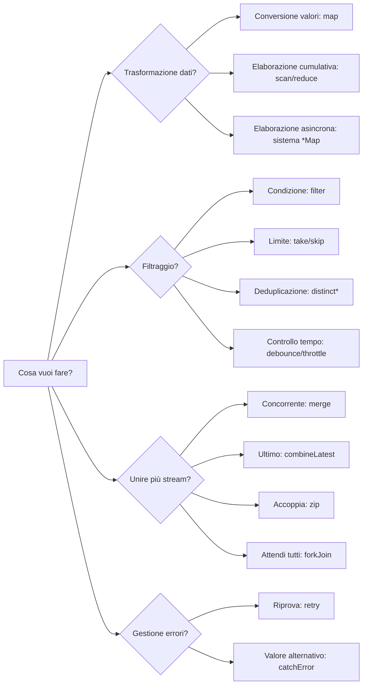
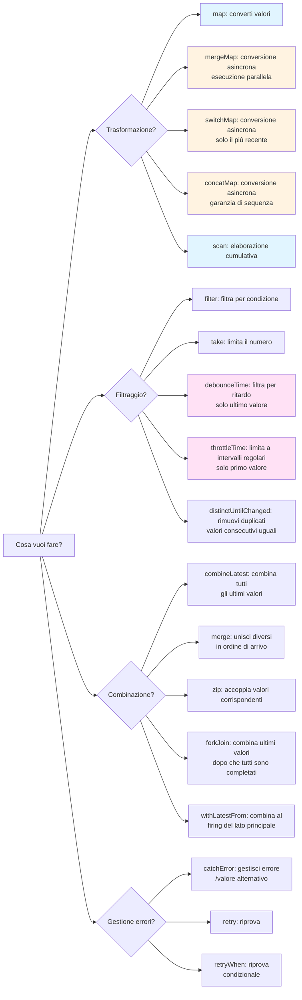
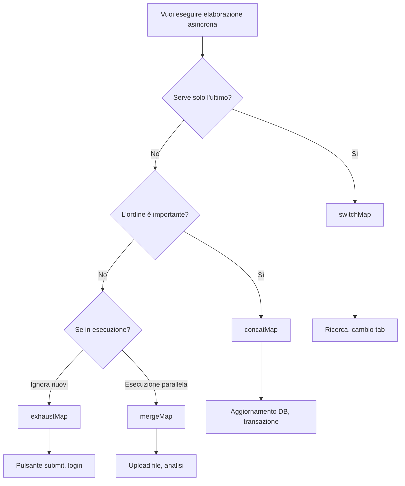

<style scoped>
.comparison-cards {
  display: grid;
  grid-template-columns: 1fr 1fr;
  gap: 1rem;
  margin-bottom: 2rem;
}

@media (max-width: 768px) {
  .comparison-cards {
    grid-template-columns: 1fr;
  }
}

/* Increase font size for title section */
.comparison-cards .tip .custom-block-title {
  font-size: 1.1rem;
  font-weight: 600;
}
</style>

# Confusione nella selezione degli operatori

Ci sono più di 100 operatori diversi in RxJS, e **confondersi** su quale usare è una difficoltà che tutti sperimentiamo. Questa pagina fornisce criteri pratici di selezione e un diagramma di flusso.

## Criteri per scegliere tra più di 100 operatori

### Problema: Troppe scelte

```typescript
// Voglio convertire un array... map? scan? reduce? toArray?
// Voglio chiamare più API... mergeMap? switchMap? concatMap? exhaustMap?
// Voglio filtrare valori... filter? take? first? distinctUntilChanged?
// Voglio combinare più stream... merge? combineLatest? zip? forkJoin?
```

### Soluzione: Filtrare per categoria + scopo



### Diagramma di flusso di selezione più dettagliato

Il seguente diagramma di flusso mostra la procedura per selezionare un operatore per uno scopo specifico.



## 1. Operatori di trasformazione

**Quando usarli?** Per cambiare la forma dei dati o per chiamare elaborazioni asincrone

| Operatore | Utilizzo | Casi d'uso comuni |
|---|---|---|
| **map** | Converti valori 1:1 | Acquisizione proprietà, calcolo, conversione tipo |
| **scan** | Elaborazione cumulativa (emette valori intermedi) | Contatore, somma, cronologia |
| **reduce** | Elaborazione cumulativa (solo valore finale) | Somma array, valore massimo |
| **mergeMap** | Elaborazione asincrona in parallelo | Chiamate API multiple in parallelo |
| **switchMap** | Cambia elaborazione asincrona | API di ricerca (solo l'ultima) |
| **concatMap** | Esegui elaborazione asincrona in sequenza | Elaborazione dove l'ordine è critico |
| **exhaustMap** | Ignora nuovi processi durante l'esecuzione | Prevenire click consecutivi (pulsante submit) |

### Esempio pratico: Selezione per caso d'uso

#### Caso d'uso 1: Ottenere proprietà

```typescript
import { of } from 'rxjs';
import { map } from 'rxjs';

interface User { id: number; name: string; }

of({ id: 1, name: 'Alice' }).pipe(
  map(user => user.name) // converti valori 1:1 → map
).subscribe(name => console.log(name)); // 'Alice'
```

#### Caso d'uso 2: Contatore

```typescript
import { fromEvent } from 'rxjs';
import { scan } from 'rxjs';

const button = document.querySelector('button')!;

fromEvent(button, 'click').pipe(
  scan(count => count + 1, 0) // elaborazione cumulativa → scan
).subscribe(count => console.log(`Conteggio click: ${count}`));
```

#### Caso d'uso 3: Chiamata API di ricerca

```typescript
import { fromEvent } from 'rxjs';
import { debounceTime, map, switchMap } from 'rxjs';

const searchInput = document.querySelector('input')!;

fromEvent(searchInput, 'input').pipe(
  debounceTime(300),
  map(e => (e.target as HTMLInputElement).value),
  switchMap(query => searchAPI(query)) // solo l'ultimo → switchMap
).subscribe(results => console.log(results));
```

## 2. Operatori di filtraggio

### Quando usarli?
Voglio scartare valori e controllare il timing

| Operatore | Utilizzo | Casi d'uso comuni |
|---|---|---|
| **filter** | Passa solo valori che corrispondono alla condizione | Solo numeri pari, solo valori non-null |
| **take** | Solo i primi N valori | Ottieni i primi 5 |
| **first** | Solo il primo | Ottieni valore iniziale |
| **distinctUntilChanged** | Solo valori diversi dall'ultimo | Escludi duplicati |
| **debounceTime** | Emette dopo che è passato un certo periodo | Input di ricerca (dopo che l'input è completato) |
| **throttleTime** | Limita a un certo intervallo | Evento di scroll |

### Esempio pratico: Selezione per caso d'uso

#### Caso d'uso 1: Recupera solo i numeri pari

```typescript
import { of } from 'rxjs';
import { filter } from 'rxjs';

of(1, 2, 3, 4, 5).pipe(
  filter(n => n % 2 === 0) // solo valori che corrispondono alla condizione → filter
).subscribe(console.log); // 2, 4
```

#### Caso d'uso 2: Ottimizzazione input di ricerca

```typescript
import { fromEvent } from 'rxjs';
import { debounceTime, distinctUntilChanged, map } from 'rxjs';

const input = document.querySelector('input')!;

fromEvent(input, 'input').pipe(
  debounceTime(300),              // attendi completamento input → debounceTime
  map(e => (e.target as HTMLInputElement).value),
  distinctUntilChanged()          // escludi duplicati → distinctUntilChanged
).subscribe(query => console.log('Ricerca:', query));
```

#### Caso d'uso 3: Riduzione eventi di scroll

```typescript
import { fromEvent } from 'rxjs';
import { throttleTime } from 'rxjs';

fromEvent(window, 'scroll').pipe(
  throttleTime(200) // solo una volta ogni 200ms → throttleTime
).subscribe(() => console.log('Posizione scroll:', window.scrollY));
```

## 3. Operatori di combinazione

### Quando usarli?
Voglio combinare più stream

| Operatore | Utilizzo | Casi d'uso comuni |
|---|---|---|
| **merge** | Più stream in parallelo | Monitoraggio eventi multipli |
| **combineLatest** | Combina tutti gli ultimi valori | Validazione form |
| **zip** | Accoppia valori corrispondenti | Mappa risultati di due API |
| **forkJoin** | Array dei risultati dopo che tutto è completato | Esecuzione parallela di API multiple |
| **withLatestFrom** | Stream principale + valore ausiliario | Evento + stato corrente |

### Esempio pratico: Selezione per caso d'uso

#### Caso d'uso 1: Monitorare eventi multipli

```typescript
import { fromEvent, merge } from 'rxjs';

const clicks$ = fromEvent(document, 'click');
const keypresses$ = fromEvent(document, 'keypress');

merge(clicks$, keypresses$).pipe() // monitoraggio concorrente → merge
  .subscribe(() => console.log('Si è verificato qualche evento'));
```

#### Caso d'uso 2: Validazione form

```typescript
import { combineLatest } from 'rxjs';
import { map } from 'rxjs';

const email$ = getFormControl('email');
const password$ = getFormControl('password');

combineLatest([email$, password$]).pipe( // tutti gli ultimi valori → combineLatest
  map(([email, password]) => email.length > 0 && password.length > 7)
).subscribe(isValid => console.log('Form valido:', isValid));
```

#### Caso d'uso 3: Esecuzione parallela di API multiple

```typescript
import { forkJoin } from 'rxjs';

forkJoin({
  user: getUserAPI(),
  posts: getPostsAPI(),
  comments: getCommentsAPI()
}).subscribe(({ user, posts, comments }) => { // attendi completamento di tutti → forkJoin
  console.log('Acquisizione dati completata', { user, posts, comments });
});
```

## I 20 operatori più usati

I seguenti sono gli operatori **più usati** nella pratica. Impara prima questi 20.

<div class="comparison-cards">

::: tip 🥇 Più frequenti (Obbligatori)
1. **map** - converti valori
2. **filter** - filtra per condizione
3. **switchMap** - ricerca, ecc., serve solo l'ultimo
4. **tap** - debug, effetti collaterali
5. **take** - primi N
6. **first** - il primo
7. **catchError** - gestione errori
8. **takeUntil** - unsubscribe
:::

::: tip 🥈 Usati spesso (Frequenti)
9. **mergeMap** - elaborazione asincrona parallela
10. **debounceTime** - attendi completamento input
11. **distinctUntilChanged** - de-duplica
12. **combineLatest** - combina valori multipli
13. **startWith** - imposta valore iniziale
14. **scan** - accumula
15. **shareReplay** - cache risultati
:::

::: tip 🥉 Usati frequentemente (Da conoscere)
16. **concatMap** - elaborazione iterativa
17. **throttleTime** - riduzione eventi
18. **withLatestFrom** - ottieni valori ausiliari
19. **forkJoin** - accodamento API multiple
20. **retry** - elaborazione retry
:::

</div>

## switchMap vs mergeMap vs concatMap vs exhaustMap

Questi quattro sono gli operatori **più confusi**. Comprendiamo chiaramente le differenze.

### Tabella di confronto

| Operatore | Metodo di esecuzione | Processo precedente | Nuovo processo | Utilizzo |
|---|---|---|---|---|
| **switchMap** | Cambia | **Cancella** | Inizia subito | Ricerca, autocomplete |
| **mergeMap** | Esecuzione parallela | Continua | Inizia subito | Upload file, analisi |
| **concatMap** | Esegui in sequenza | Attendi completamento | Inizia dopo **attesa** | Elaborazione dove l'ordine è critico |
| **exhaustMap** | Ignora durante esecuzione | Continua | **Ignora** | Prevenire click ripetuti |

### Confronto con Marble Diagram

```
Esterno: ----A----B----C----|

Interno: A → --1--2|
      B → --3--4|
      C → --5--6|

switchMap:  ----1--3--5--6|  (A cancellato prima di 2, B cancellato prima di 4)
mergeMap:   ----1-23-45-6|   (tutti eseguiti in parallelo)
concatMap:  ----1--2--3--4--5--6|  (esegui in sequenza)
exhaustMap: ----1--2|            (B e C ignorati)
```

### Esempio pratico: 4 differenze nello stesso processo

**Situazione**: API (impiega 1 secondo) viene chiamata ad ogni click del pulsante. L'utente clicca ogni 0.5 secondi.

#### switchMap - Ottimo per la ricerca

```typescript
import { fromEvent } from 'rxjs';
import { switchMap } from 'rxjs';

fromEvent(button, 'click').pipe(
  switchMap(() => searchAPI()) // esegui solo l'ultimo, cancella vecchie richieste
).subscribe(result => console.log(result));

// 0.0 sec: Click 1 → API1 inizia
// 0.5 sec: Click 2 → API1 cancellata, API2 iniziata
// 1.0 sec: Click 3 → API2 cancellata, API3 iniziata
// 2.0 sec: API3 completa → risultato visualizzato (solo API3)
```

::: tip 💡 Utilizzo
- **Ricerca/Autocomplete**: serve solo l'ultimo valore di input
- **Cambio tab**: servono solo i dati del tab attualmente visualizzato
- **Paginazione**: visualizza solo l'ultima pagina
:::

#### mergeMap - Ottimo per la concorrenza

```typescript
import { fromEvent } from 'rxjs';
import { mergeMap } from 'rxjs';

fromEvent(button, 'click').pipe(
  mergeMap(() => uploadFileAPI()) // tutti eseguiti in parallelo
).subscribe(result => console.log(result));

// 0.0 sec: Click 1 → API1 inizia
// 0.5 sec: Click 2 → API2 inizia (API1 continua)
// 1.0 sec: Click 3 → API3 inizia (API1, API2 continuano)
// 1.0 sec: API1 completa → Risultato visualizzato
// 1.5 sec: API2 completa → risultato visualizzato
// 2.0 sec: API3 completa → visualizza risultati
```

::: tip 💡 Utilizzo
- **Upload file**: Carica più file simultaneamente
- **Analisi e invio log**: Esecuzione parallela di processi indipendenti
- **Sistema di notifiche**: Elabora più notifiche simultaneamente
:::

#### concatMap - Ideale per elaborazioni dove l'ordine è critico

```typescript
import { fromEvent } from 'rxjs';
import { concatMap } from 'rxjs';

fromEvent(button, 'click').pipe(
  concatMap(() => updateDatabaseAPI()) // esegui in sequenza (attendi completamento precedente)
).subscribe(result => console.log(result));

// 0.0 sec: Click 1 → API1 inizia
// 0.5 sec: Click 2 → attendi (aggiungi alla coda)
// 1.0 sec: Click 3 → attendi (aggiungi alla coda)
// 1.0 sec: API1 completa → visualizza risultati, inizia API2
// 2.0 sec: API2 completa → visualizza risultati, inizia API3
// 3.0 sec: API3 completa → visualizza risultati
```

::: tip 💡 Utilizzo
- **Aggiornamento database**: processo di aggiornamento dove l'ordine è critico
- **Animazioni**: animazioni che vuoi eseguire in sequenza
- **Transazioni**: esegui una alla volta senza fallire
:::

#### exhaustMap - Ottimo per prevenire accumuli

```typescript
import { fromEvent } from 'rxjs';
import { exhaustMap } from 'rxjs';

fromEvent(button, 'click').pipe(
  exhaustMap(() => submitFormAPI()) // ignora nuovi click durante l'esecuzione
).subscribe(result => console.log(result));

// 0.0 secondi: Click 1 → API1 inizia
// 0.5 sec: Click 2 → ignorato (API1 in esecuzione)
// 1.0 sec: Click 3 → Ignorato (API1 in esecuzione)
// 1.0 sec: API1 completa → Risultato visualizzato
// 1.5 sec: Click 4 → API4 iniziata (ultima completata)
```

::: tip 💡 Utilizzo
- **Pulsante Submit**: Prevenire che gli invii del form vengano cliccati ripetutamente
- **Autenticazione**: Prevenire click consecutivi sul pulsante di login
- **Processo di fatturazione**: Prevenire doppia fatturazione
:::

### Diagramma di flusso di selezione



## Criteri nella pratica

### Passo 1: Chiarisci cosa vuoi ottenere

```typescript
// ❌ Cattivo esempio: usa mergeMap per ora
observable$.pipe(
  mergeMap(value => someAPI(value))
);

// ✅ Buon esempio: chiarisci lo scopo prima di scegliere
// Scopo: Per l'input di ricerca dell'utente, vogliamo visualizzare solo gli ultimi risultati
// → Le vecchie richieste dovrebbero essere cancellate → switchMap
searchInput$.pipe(
  switchMap(query => searchAPI(query))
);
```

### Passo 2: Considerazioni sulle prestazioni

#### Selezione debounceTime vs throttleTime

```typescript
// Input di ricerca: esegui dopo che l'utente "completa" l'input
searchInput$.pipe(
  debounceTime(300), // esegui se nessun input per 300ms
  switchMap(query => searchAPI(query))
);

// Scroll: esegui a intervalli regolari (per prevenire frequenza troppo alta)
scroll$.pipe(
  throttleTime(200), // esegui solo una volta ogni 200ms
  tap(() => loadMoreItems())
);
```

### Passo 3: Incorpora la gestione degli errori

```typescript
import { of } from 'rxjs';
import { catchError, retry, switchMap } from 'rxjs';

searchInput$.pipe(
  debounceTime(300),
  switchMap(query =>
    searchAPI(query).pipe(
      retry(2),                          // riprova fino a 2 volte
      catchError(err => {
        console.error('Errore ricerca:', err);
        return of([]);                   // restituisci array vuoto
      })
    )
  )
).subscribe(results => console.log(results));
```

### Passo 4: Prevenire perdite di memoria

```typescript
import { Subject } from 'rxjs';
import { switchMap, takeUntil } from 'rxjs';

class SearchComponent {
  private destroy$ = new Subject<void>();

  ngOnInit() {
    searchInput$.pipe(
      debounceTime(300),
      switchMap(query => searchAPI(query)),
      takeUntil(this.destroy$)           // rilascia quando il componente viene distrutto
    ).subscribe(results => console.log(results));
  }

  ngOnDestroy() {
    this.destroy$.next();
    this.destroy$.complete();
  }
}
```

## Checklist di comprensione

Assicurati di poter rispondere alle seguenti domande.

```markdown
## Comprensione di base
- [ ] Classificare gli operatori per categoria (trasforma, filtra, unisci)
- [ ] Descrivere almeno 10 dei 20 operatori più usati
- [ ] Spiegare la differenza tra switchMap, mergeMap, concatMap e exhaustMap

## Selezione pratica
- [ ] Selezionare l'operatore appropriato per la funzione di ricerca (switchMap + debounceTime)
- [ ] Scegliere un operatore adatto per chiamate parallele di API multiple (forkJoin o mergeMap)
- [ ] Selezionare operatori per la validazione form (combineLatest)

## Prestazioni
- [ ] Differenziare tra debounceTime e throttleTime
- [ ] Sapere come ottimizzare per eventi ad alta frequenza
- [ ] Poter implementare pattern per prevenire perdite di memoria

## Gestione errori
- [ ] Essere in grado di usare catchError e retry in combinazione
- [ ] Poter implementare gestione fallback sugli errori
- [ ] Fornire feedback all'utente sugli errori
```

## Prossimi passi

Una volta compresa la selezione degli operatori, il passo successivo è imparare **timing e sequenza**.

→ **[Comprendere timing e ordine](/it/guide/overcoming-difficulties/timing-and-order)** - capire quando fluiscono i valori, sincrono vs asincrono

## Pagine correlate

- **[Capitolo 4: Comprendere gli operatori](/it/guide/operators/)** - Dettagli di tutti gli operatori
- **[Capitolo 13: Pattern pratici](/it/guide/)** - Casi d'uso reali (in preparazione)
- **[Capitolo 10: Errori comuni e soluzioni](/it/guide/anti-patterns/common-mistakes)** - Anti-pattern per selezione impropria degli operatori

## 🎯 Esercizi

### Esercizio 1: Seleziona l'operatore appropriato

Scegli il miglior operatore per il seguente scenario.

1. L'utente digita nella casella di ricerca → chiamata API
2. Più file caricati al click di un pulsante
3. Determinare se tutti i campi del form sono validi
4. Prevenire click multipli del pulsante submit

<details>
<summary>Risposta di esempio</summary>

**1. Casella di ricerca → chiamata API**
```typescript
searchInput$.pipe(
  debounceTime(300),      // attendi completamento input
  distinctUntilChanged(), // rimuovi duplicati
  switchMap(query => searchAPI(query)) // solo l'ultimo
).subscribe(results => displayResults(results));
```
> [!NOTE] Motivazione
> La ricerca necessita solo degli ultimi risultati, quindi `switchMap`. `debounceTime` perché attende il completamento dell'input.

---

**2. Carica file multipli**
```typescript
fromEvent(uploadButton, 'click').pipe(
  mergeMap(() => {
    const files = getSelectedFiles();
    return forkJoin(files.map(file => uploadFileAPI(file)));
  })
).subscribe(results => console.log('Upload di tutti i file completato', results));
```
> [!NOTE] Motivazione
> `forkJoin` perché carica più file in parallelo. Oppure `mergeMap` dato che è un processo indipendente.

---

**3. Controllo validità di tutti i campi del form**
```typescript
combineLatest([
  emailField$,
  passwordField$,
  agreeTerms$
]).pipe(
  map(([email, password, agreed]) =>
    email.valid && password.valid && agreed
  )
).subscribe(isValid => submitButton.disabled = !isValid);
```

> [!NOTE] Motivazione
> `combineLatest` perché combina gli ultimi valori di tutti i campi.

---

**4. Prevenire click consecutivi del pulsante submit**
```typescript
fromEvent(submitButton, 'click').pipe(
  exhaustMap(() => submitFormAPI())
).subscribe(result => console.log('Submit completato', result));
```
> [!NOTE] Motivazione
> `exhaustMap` perché protegge il processo in esecuzione e ignora i nuovi click.

</details>

### Esercizio 2: Scegliere tra switchMap e mergeMap

Il seguente codice usa `mergeMap`, ma c'è un problema. Correggilo.

```typescript
searchInput$.pipe(
  debounceTime(300),
  mergeMap(query => searchAPI(query))
).subscribe(results => displayResults(results));
```

<details>
<summary>Soluzione di esempio</summary>

```typescript
searchInput$.pipe(
  debounceTime(300),
  switchMap(query => searchAPI(query)) // mergeMap → switchMap
).subscribe(results => displayResults(results));
```

> [!IMPORTANT] Problemi
> - Con `mergeMap`, tutte le richieste di ricerca vengono eseguite in parallelo
> - Se l'utente digita "a", poi "ab", poi "abc", tutte e tre le richieste verranno eseguite
> - Le richieste più vecchie (risultati per "a") potrebbero essere restituite dopo e sovrascrivere gli ultimi risultati

> [!NOTE] Motivazione della correzione
> - Con `switchMap`, le vecchie richieste vengono cancellate quando inizia una nuova ricerca
> - Vengono sempre visualizzati solo gli ultimi risultati di ricerca

</details>

### Esercizio 3: Scenario pratico

Scrivi un codice che soddisfi i seguenti requisiti.

> [!NOTE] Requisiti
> - L'utente clicca un pulsante
> - Ottieni 3 API (informazioni utente, lista post, lista commenti) in parallelo
> - Visualizza i dati quando tutti sono completati
> - Restituisci dati vuoti se si verifica un errore
> - Fai unsubscribe quando il componente viene distrutto

<details>
<summary>Soluzione di esempio</summary>

```typescript
import { fromEvent, forkJoin, of, Subject } from 'rxjs';
import { switchMap, catchError, takeUntil } from 'rxjs';

class DataComponent {
  private destroy$ = new Subject<void>();
  private button = document.querySelector('button')!;

  ngOnInit() {
    fromEvent(this.button, 'click').pipe(
      switchMap(() =>
        forkJoin({
          user: this.getUserAPI().pipe(
            catchError(() => of(null))
          ),
          posts: this.getPostsAPI().pipe(
            catchError(() => of([]))
          ),
          comments: this.getCommentsAPI().pipe(
            catchError(() => of([]))
          )
        })
      ),
      takeUntil(this.destroy$)
    ).subscribe(({ user, posts, comments }) => {
      console.log('Acquisizione dati completata', { user, posts, comments });
    });
  }

  ngOnDestroy() {
    this.destroy$.next();
    this.destroy$.complete();
  }

  private getUserAPI() { /* ... */ }
  private getPostsAPI() { /* ... */ }
  private getCommentsAPI() { /* ... */ }
}
```

> [!NOTE] Punti
> - Esegui 3 API in parallelo con `forkJoin` e attendi che tutti siano completati
> - Imposta valore fallback su errore con `catchError` per ogni API
> - Cambia a una nuova richiesta con ogni click del pulsante con `switchMap`
> - `takeUntil` per rilasciare automaticamente quando il componente viene distrutto

</details>
