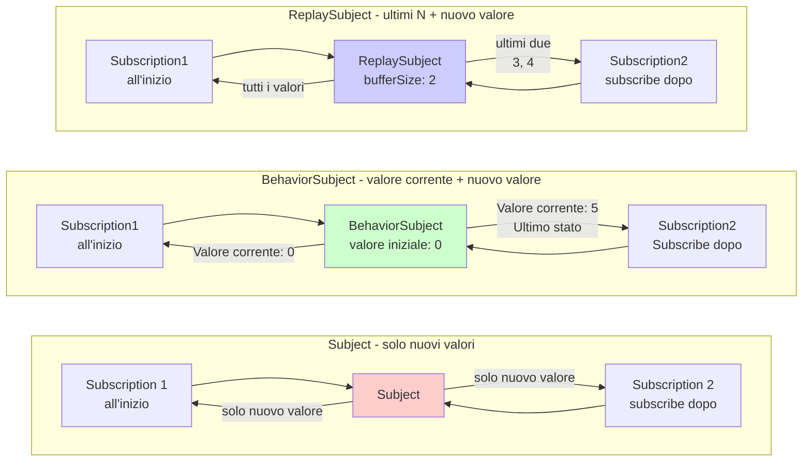

# Difficoltà nella gestione dello stato

In RxJS **"Voglio condividere lo stato con più componenti" e "Voglio memorizzare nella cache i risultati delle API"** sono requisiti molto comuni, ma scegliere il metodo giusto è difficile. Questa pagina descrive pattern pratici per la gestione dello stato e la condivisione degli stream.

## Subject vs BehaviorSubject vs ReplaySubject

### Tipi e caratteristiche dei Subject

| Subject | Valore iniziale | Comportamento alla subscription | Casi d'uso comuni |
|---|---|---|---|
| **Subject** | Nessuno | Riceve solo il valore dopo la subscription | Event Bus, Sistema di notifiche |
| **BehaviorSubject** | Richiesto | Riceve l'ultimo valore immediatamente | Stato corrente (login, elemento selezionato) |
| **ReplaySubject** | Nessuno | Riceve gli ultimi N valori | Cronologia, log, registro operazioni |
| **AsyncSubject** | Nessuno | Riceve solo l'ultimo valore al completamento | Singolo risultato asincrono (poco usato) |

### Visualizzare la differenza tra tipo di Subject e operazione

Il seguente diagramma mostra quale valore riceve ogni Subject alla subscription.



> [!TIP] Criteri di selezione
> - **Subject**: Notifica eventi (non serve il passato)
> - **BehaviorSubject**: Gestione stato (serve il valore corrente)
> - **ReplaySubject**: Gestione cronologia (servono gli ultimi N)

### Esempio pratico 1: Subject (Event Bus)

#### ❌ Cattivo esempio: nessun valore accettato prima della subscription
```typescript
import { Subject } from 'rxjs';

const notifications$ = new Subject<string>();

notifications$.next('Notifica 1'); // nessuno ha ancora fatto subscribe

notifications$.subscribe(msg => {
  console.log('Ricevuto:', msg);
});

notifications$.next('Notifica 2');
notifications$.next('Notifica 3');

// Output:
// Ricevuto: Notifica 2
// Ricevuto: Notifica 3
// ('Notifica 1' non viene ricevuta)
```

#### ✅ Buon esempio: usare come event bus (elaborare solo eventi dopo la subscription)
```typescript
import { filter, map, Subject } from 'rxjs';

class EventBus {
  private events$ = new Subject<{ type: string; payload: any }>();

  emit(type: string, payload: any) {
    this.events$.next({ type, payload });
  }

  on(type: string) {
    return this.events$.pipe(
      filter(event => event.type === type),
      map(event => event.payload)
    );
  }
}

const bus = new EventBus();

// inizia subscription
bus.on('userLogin').subscribe(user => {
  console.log('login:', user);
});

// evento emesso
bus.emit('userLogin', { id: 1, name: 'Alice' }); // ✅ Ricevuto
// login: {id: 1, name: 'Alice'}
```

> [!TIP] Uso di Subject
> - **Architettura event-driven**: Comunicazione debolmente accoppiata tra componenti
> - **Sistema di notifiche**: Consegna notifiche in tempo reale
> - **Quando i valori passati non servono**: Solo gli eventi post-subscription devono essere gestiti

### Esempio pratico 2: BehaviorSubject (Gestione stato)

#### ❌ Cattivo esempio: Subject non conosce lo stato corrente
```typescript
import { Subject } from 'rxjs';

const isLoggedIn$ = new Subject<boolean>();

// l'utente è loggato
isLoggedIn$.next(true);

// Componente che fa subscribe dopo
isLoggedIn$.subscribe(status => {
  console.log('stato login:', status); // niente viene emesso
});
```

#### ✅ Buon esempio: ottenere lo stato corrente immediatamente con BehaviorSubject
```typescript
import { BehaviorSubject } from 'rxjs';

class AuthService {
  private isLoggedIn$ = new BehaviorSubject<boolean>(false); // valore iniziale: false

  login(username: string, password: string) {
    // processo di login...
    this.isLoggedIn$.next(true);
  }

  logout() {
    this.isLoggedIn$.next(false);
  }

  // pubblica esternamente come sola lettura
  get isLoggedIn() {
    return this.isLoggedIn$.asObservable();
  }

  // Ottieni valore corrente sincronamente (usare solo per casi speciali)
  get currentStatus(): boolean {
    return this.isLoggedIn$.value;
  }
}

const auth = new AuthService();

auth.login('user', 'pass');

// Subscribe dopo e ottieni immediatamente lo stato corrente (true)
auth.isLoggedIn.subscribe(status => {
  console.log('stato login:', status); // stato login: true
});
```

> [!TIP] Dove usare BehaviorSubject
> - **Mantenere lo stato corrente**: Stato login, elementi selezionati, valori di configurazione
> - **Richiede valore immediato alla subscription**: Lo stato corrente è richiesto per la visualizzazione iniziale nella UI
> - **Monitorare cambiamenti di stato**: Aggiornare reattivamente quando lo stato cambia

### Esempio pratico 3: ReplaySubject (Gestione cronologia)

#### ✅ Buon esempio: Riprodurre gli ultimi N valori
```typescript
import { ReplaySubject } from 'rxjs';

class SearchHistoryService {
  // mantieni cronologia delle ultime 5 ricerche
  private history$ = new ReplaySubject<string>(5);

  addSearch(query: string) {
    this.history$.next(query);
  }

  getHistory() {
    return this.history$.asObservable();
  }
}

const searchHistory = new SearchHistoryService();

// Esegui ricerca
searchHistory.addSearch('TypeScript');
searchHistory.addSearch('RxJS');
searchHistory.addSearch('Angular');

// Gli ultimi 3 risultati possono essere recuperati istantaneamente, anche se fai subscribe dopo
searchHistory.getHistory().subscribe(query => {
  console.log('Cronologia ricerche:', query);
});

// Output:
// Cronologia ricerche: TypeScript
// Cronologia ricerche: RxJS
// Cronologia ricerche: Angular
```

> [!TIP] Uso di ReplaySubject
> - **Cronologia azioni**: Cronologia ricerche, cronologia modifiche, cronologia navigazione
> - **Log/Audit Trail**: Registro delle operazioni passate
> - **Supporto subscribe tardivo**: Se vuoi ricevere valori passati anche se la subscription inizia in ritardo

## Differenziare tra share e shareReplay

### Problema: Esecuzione duplicata di Cold Observable

#### ❌ Cattivo esempio: API viene chiamata più volte con subscribe multipli
```typescript
import { ajax } from 'rxjs/ajax';

const users$ = ajax.getJSON('/api/users');

// subscription1
users$.subscribe(users => {
  console.log('Componente A:', users);
});

// Subscription 2
users$.subscribe(users => {
  console.log('Componente B:', users);
});

// Problema: API viene chiamata due volte
// GET /api/users (1a volta)
// GET /api/users (2a volta)
```

#### ✅ Buon esempio: convertire in Hot con share (condividi esecuzione)
```typescript
import { ajax } from 'rxjs/ajax';
import { share } from 'rxjs';

const users$ = ajax.getJSON('/api/users').pipe(
  share() // condividi esecuzione
);

// subscribe1
users$.subscribe(users => {
  console.log('Componente A:', users);
});

// Subscription 2 (se fai subscribe immediatamente)
users$.subscribe(users => {
  console.log('Componente B:', users);
});

// ✅ API viene chiamata solo una volta
// GET /api/users (solo una volta)
```

> [!WARNING] Insidie di share
> `share()` resetta lo stream** quando l'**ultima subscription viene cancellata. Verrà eseguito di nuovo alla prossima subscription.
>
> ```typescript
> const data$ = fetchData().pipe(share());
>
> // subscription1
> const sub1 = data$.subscribe();
>
> // subscribe2
> const sub2 = data$.subscribe();
>
> sub1.unsubscribe();
> sub2.unsubscribe(); // tutti fanno unsubscribe → reset
>
> // resubscribe → fetchData() viene eseguito di nuovo
> data$.subscribe();
> ```

### shareReplay: Memorizza nella cache e riutilizza i risultati

#### ✅ Buon esempio: cache con shareReplay
```typescript
import { ajax } from 'rxjs/ajax';
import { shareReplay } from 'rxjs';

const users$ = ajax.getJSON('/api/users').pipe(
  shareReplay({ bufferSize: 1, refCount: true })
  // bufferSize: 1 → memorizza in cache l'ultimo singolo valore
  // refCount: true → la cache viene svuotata quando tutte le subscription vengono cancellate
);

// subscription1
users$.subscribe(users => {
  console.log('Componente A:', users);
});

// Subscribe 1 secondo dopo Subscribe 2 (subscription ritardata, ma comunque recuperata dalla cache)
setTimeout(() => {
  users$.subscribe(users => {
    console.log('Componente B:', users); // recupera immediatamente dalla cache
  });
}, 1000);

// ✅ API viene chiamata solo una volta, e il risultato viene memorizzato nella cache
```

### Confronto share vs shareReplay

| Funzionalità | share() | shareReplay(1) |
|---|---|---|
| **Nuova subscription mentre sottoscritto** | Condividi lo stesso stream | Condividi lo stesso stream |
| **Subscribe in ritardo** | Ricevi solo nuovi valori | Ricevi ultimi valori dalla cache |
| **Dopo che tutte le subscription vengono cancellate** | Resetta stream | Mantieni cache (se refCount: false) |
| **Memoria** | Non mantiene | Mantiene cache |
| **Caso d'uso** | Condivisione dati in tempo reale | Cache risultati API |

#### ✅ Buon esempio: configurazione corretta di shareReplay
```typescript
import { shareReplay } from 'rxjs';

// Pattern 1: cache persistente (non consigliato)
const data1$ = fetchData().pipe(
  shareReplay({ bufferSize: 1, refCount: false })
  // refCount: false → attenzione alla perdita di memoria
);

// Pattern 2: cache con pulizia automatica (consigliato)
const data2$ = fetchData().pipe(
  shareReplay({ bufferSize: 1, refCount: true })
  // refCount: true → Unsubscribe tutti e svuota cache
);

// Pattern 3: Cache con TTL (RxJS 7.4+)
const data3$ = fetchData().pipe(
  shareReplay({
    bufferSize: 1,
    refCount: true,
    windowTime: 5000 // scarta cache dopo 5 secondi
  })
);
```

> [!IMPORTANT] Attenzione alle perdite di memoria
> `shareReplay({ refCount: false })` può causare perdite di memoria perché la cache rimane persistente. Fondamentalmente, usa **refCount: true**.

## Uso pratico di Hot vs Cold

### Caratteristiche Cold: Esegui per ogni subscription

```typescript
import { Observable } from 'rxjs';

const cold$ = new Observable<number>(subscriber => {
  console.log('🔵 Esecuzione iniziata');
  subscriber.next(Math.random());
  subscriber.complete();
});

cold$.subscribe(v => console.log('Subscribe 1:', v));
cold$.subscribe(v => console.log('Subscription 2:', v));

// Output:
// 🔵 Esecuzione iniziata
// Subscribe 1: 0.123
// 🔵 Esecuzione iniziata
// Subscription 2: 0.456
// (due esecuzioni, valori diversi)
```

### Caratteristiche Hot: Esecuzione condivisa

```typescript
import { Subject } from 'rxjs';

const hot$ = new Subject<number>();

hot$.subscribe(v => console.log('Subscription 1:', v));
hot$.subscribe(v => console.log('Subscription 2:', v));

hot$.next(Math.random());

// Output:
// subscription1: 0.789
// Subscription 2: 0.789
// (condividono lo stesso valore)
```

### Criteri di utilizzo

| Requisiti | Cold | Hot |
|---|---|---|
| **Serve esecuzione indipendente** | ✅ | ❌ |
| **Vuoi condividere l'esecuzione** | ❌ | ✅ |
| **Valori diversi per subscriber diversi** | ✅ | ❌ |
| **Distribuzione dati in tempo reale** | ❌ | ✅ |
| **Condivisione chiamate API** | ❌ (converti con share) | ✅ |

#### ✅ Buon esempio: conversione corretta
```typescript
import { interval, fromEvent } from 'rxjs';
import { share, shareReplay } from 'rxjs';

// Cold: ogni subscriber è un timer indipendente
const coldTimer$ = interval(1000);

// Cold → Hot: condividi timer
const hotTimer$ = interval(1000).pipe(share());

// Cold: evento click (registrazione listener indipendente per ogni subscription)
const clicks$ = fromEvent(document, 'click');

// Cold → Hot: memorizza nella cache i risultati API
const cachedData$ = ajax.getJSON('/api/data').pipe(
  shareReplay({ bufferSize: 1, refCount: true })
);
```

## Pattern di gestione centralizzata dello stato

### Pattern 1: Gestione stato nella classe Service

```typescript
import { BehaviorSubject, Observable } from 'rxjs';
import { map } from 'rxjs';

interface User {
  id: number;
  name: string;
  email: string;
}

class UserStore {
  // BehaviorSubject privato
  private users$ = new BehaviorSubject<User[]>([]);

  // Observable in sola lettura per uso pubblico
  get users(): Observable<User[]> {
    return this.users$.asObservable();
  }

  // ottieni un utente specifico
  getUser(id: number): Observable<User | undefined> {
    return this.users.pipe(
      map(users => users.find(u => u.id === id))
    );
  }

  // aggiorna stato
  addUser(user: User) {
    const currentUsers = this.users$.value;
    this.users$.next([...currentUsers, user]);
  }

  updateUser(id: number, updates: Partial<User>) {
    const currentUsers = this.users$.value;
    const updatedUsers = currentUsers.map(u =>
      u.id === id ? { ...u, ...updates } : u
    );
    this.users$.next(updatedUsers);
  }

  removeUser(id: number) {
    const currentUsers = this.users$.value;
    this.users$.next(currentUsers.filter(u => u.id !== id));
  }
}

// Utilizzo
const store = new UserStore();

// Subscribe
store.users.subscribe(users => {
  console.log('Lista utenti:', users);
});

// aggiorna stato
store.addUser({ id: 1, name: 'Alice', email: 'alice@example.com' });
store.updateUser(1, { name: 'Alice Smith' });
```

### Pattern 2: Gestione stato usando Scan

```typescript
import { Subject } from 'rxjs';
import { scan, startWith } from 'rxjs';

interface State {
  count: number;
  items: string[];
}

type Action =
  | { type: 'INCREMENT' }
  | { type: 'DECREMENT' }
  | { type: 'ADD_ITEM'; payload: string }
  | { type: 'RESET' };

const actions$ = new Subject<Action>();

const initialState: State = {
  count: 0,
  items: []
};

const state$ = actions$.pipe(
  scan((state, action) => {
    switch (action.type) {
      case 'INCREMENT':
        return { ...state, count: state.count + 1 };
      case 'DECREMENT':
        return { ...state, count: state.count - 1 };
      case 'ADD_ITEM':
        return { ...state, items: [...state.items, action.payload] };
      case 'RESET':
        return initialState;
      default:
        return state;
    }
  }, initialState),
  startWith(initialState)
);

// Subscribe
state$.subscribe(state => {
  console.log('Stato corrente:', state);
});

// emetti action
actions$.next({ type: 'INCREMENT' });
actions$.next({ type: 'ADD_ITEM', payload: 'mela' });
actions$.next({ type: 'INCREMENT' });

// Output:
// stato corrente: { count: 0, items: [] }
// stato corrente: { count: 1, items: [] }
// stato corrente: { count: 1, items: ['mela'] }
// stato corrente: { count: 2, items: ['mela'] }
```

## Errori comuni

### Errore 1: Esposizione esterna del Subject

#### ❌ Cattivo esempio: pubblicare il Subject direttamente
```typescript
import { BehaviorSubject } from 'rxjs';

class BadService {
  // ❌ può essere modificato direttamente dall'esterno
  public state$ = new BehaviorSubject<number>(0);
}

const service = new BadService();

// può essere modificato dall'esterno senza permesso
service.state$.next(999); // ❌ incapsulamento rotto
```

#### ✅ Buon esempio: protetto da asObservable()
```typescript
import { BehaviorSubject } from 'rxjs';

class GoodService {
  private _state$ = new BehaviorSubject<number>(0);

  // pubblica come sola lettura
  get state() {
    return this._state$.asObservable();
  }

  // può essere modificato solo da metodi dedicati
  increment() {
    this._state$.next(this._state$.value + 1);
  }

  decrement() {
    this._state$.next(this._state$.value - 1);
  }
}

const service = new GoodService();

// ✅ sola lettura
service.state.subscribe(value => console.log(value));

// ✅ Le modifiche vengono fatte tramite metodi dedicati
service.increment();

// ❌ Non può essere modificato direttamente (errore di compilazione)
// service.state.next(999); // Errore: Property 'next' does not exist
```

### Errore 2: Perdita di memoria di shareReplay

#### ❌ Cattivo esempio: perdita di memoria con refCount: false
```typescript
import { interval } from 'rxjs';
import { shareReplay, take } from 'rxjs';

const data$ = interval(1000).pipe(
  take(100),
  shareReplay({ bufferSize: 1, refCount: false })
  // ❌ refCount: false → la cache rimane per sempre
);

// lo stream continua a funzionare internamente anche dopo subscribe e unsubscribe
const sub = data$.subscribe();
sub.unsubscribe();

// la cache rimane → perdita di memoria
```

#### ✅ Buon esempio: pulizia automatica con refCount: true
```typescript
import { interval } from 'rxjs';
import { shareReplay, take } from 'rxjs';

const data$ = interval(1000).pipe(
  take(100),
  shareReplay({ bufferSize: 1, refCount: true })
  // ✅ refCount: true → pulizia automatica con tutti gli unsubscribe
);

const sub1 = data$.subscribe();
const sub2 = data$.subscribe();

sub1.unsubscribe();
sub2.unsubscribe(); // unsubscribe di tutte le subscription → ferma stream, svuota cache
```

### Errore 3: Recupero valore sincrono

#### ❌ Cattivo esempio: troppo dipendente da value
```typescript
import { BehaviorSubject } from 'rxjs';

class CounterService {
  private count$ = new BehaviorSubject(0);

  increment() {
    // ❌ troppa dipendenza da value
    const current = this.count$.value;
    this.count$.next(current + 1);
  }

  // ❌ espone acquisizione sincrona
  getCurrentCount(): number {
    return this.count$.value;
  }
}
```

#### ✅ Buon esempio: mantenere reattivo
```typescript
import { BehaviorSubject } from 'rxjs';
import { map } from 'rxjs';

class CounterService {
  private count$ = new BehaviorSubject(0);

  get count() {
    return this.count$.asObservable();
  }

  increment() {
    // ✅ Va bene usare value internamente
    this.count$.next(this.count$.value + 1);
  }

  // ✅ Restituisci con Observable
  isPositive() {
    return this.count$.pipe(
      map(count => count > 0)
    );
  }
}
```

## Checklist di comprensione

Assicurati di poter rispondere alle seguenti domande.

```markdown
## Comprensione di base
- [ ] Spiegare la differenza tra Subject, BehaviorSubject e ReplaySubject
- [ ] Capire perché BehaviorSubject ha bisogno di un valore iniziale
- [ ] Capire il significato di bufferSize in ReplaySubject

## Hot/Cold
- [ ] Spiegare la differenza tra Cold Observable e Hot Observable
- [ ] Spiegare la differenza tra share e shareReplay
- [ ] Capire il ruolo dell'opzione refCount di shareReplay

## Gestione dello stato
- [ ] Poter proteggere il Subject con asObservable() senza esporlo all'esterno
- [ ] Implementare pattern di gestione stato usando BehaviorSubject
- [ ] Capire pattern di gestione stato usando scan

## Gestione della memoria
- [ ] Sapere come prevenire perdite di memoria in shareReplay
- [ ] Spiegare la differenza tra refCount: true e false
- [ ] Svuotare la cache al momento appropriato
```

## Prossimi passi

Una volta compresa la gestione dello stato e la condivisione, il passo successivo è imparare a **combinare più stream**.

→ **[Combinazione di stream multipli](/it/guide/overcoming-difficulties/stream-combination)** - Come usare combineLatest, zip, withLatestFrom

## Pagine correlate

- **[Capitolo 5: Cos'è Subject](/it/guide/subjects/what-is-subject)** - Basi di Subject
- **[Capitolo 5: Tipi di Subject](/it/guide/subjects/types-of-subject)** - Dettagli di BehaviorSubject e ReplaySubject
- **[Operatore share()](/it/guide/operators/multicasting/share)** - Spiegazione dettagliata di share
- **[Uso improprio di shareReplay](/it/guide/anti-patterns/common-mistakes#4-sharereplay-)** - Errori comuni
- **[Cold vs Hot Observable](/it/guide/observables/cold-and-hot-observables)** - Dettagli Cold/Hot

## 🎯 Esercizi

### Esercizio 1: Scegliere un Subject appropriato

Scegli il miglior Subject per il seguente scenario.

1. **Gestire lo stato di login dell'utente** (default: logout)
2. **Consegna di messaggi di notifica** (visualizzare solo messaggi dopo la subscription)
3. **Mantenere cronologia delle ultime 5 operazioni** (anche se fai subscribe in ritardo, le ultime 5 sono ancora visibili)

<details>
<summary>Esempio di soluzione</summary>

**1. Stato di login dell'utente**
```typescript
import { BehaviorSubject } from 'rxjs';

class AuthService {
  private isLoggedIn$ = new BehaviorSubject<boolean>(false);

  get loginStatus() {
    return this.isLoggedIn$.asObservable();
  }

  login() {
    this.isLoggedIn$.next(true);
  }

  logout() {
    this.isLoggedIn$.next(false);
  }
}
```

> [!NOTE] Motivo
> **BehaviorSubject** è la scelta migliore perché abbiamo bisogno dello stato corrente immediatamente alla subscription.

---

**2. Consegna messaggi di notifica**
```typescript
import { Subject } from 'rxjs';

class NotificationService {
  private notifications$ = new Subject<string>();

  get messages() {
    return this.notifications$.asObservable();
  }

  notify(message: string) {
    this.notifications$.next(message);
  }
}
```

> [!NOTE] Motivo
> **Subject** è sufficiente dato che dobbiamo solo visualizzare il messaggio dopo la subscription.

---

**3. Cronologia delle ultime 5 operazioni**
```typescript
import { ReplaySubject } from 'rxjs';

class HistoryService {
  private actions$ = new ReplaySubject<string>(5); // mantieni 5 azioni

  get history() {
    return this.actions$.asObservable();
  }

  addAction(action: string) {
    this.actions$.next(action);
  }
}
```

> [!NOTE] Motivo
> **ReplaySubject(5)** è il modo migliore per mantenere le ultime 5 e recuperarle anche se fai subscribe in ritardo.

</details>

### Esercizio 2: Scegliere tra share e shareReplay

Nel seguente codice, scegli l'operatore appropriato.

```typescript
import { ajax } from 'rxjs/ajax';

// Scenario 1: Dati in tempo reale da WebSocket
const realTimeData$ = webSocket('ws://example.com/stream');

// Scenario 2: Chiamata API per informazioni utente (vogliamo memorizzare nella cache i risultati)
const user$ = ajax.getJSON('/api/user/me');

// Cosa dovremmo usare per entrambi?
```

<details>
<summary>Risposta di esempio</summary>

**Scenario 1: Dati in tempo reale da WebSocket**
```typescript
import { share } from 'rxjs';

const realTimeData$ = webSocket('ws://example.com/stream').pipe(
  share() // non serve memorizzare nella cache dati in tempo reale
);
```

> [!NOTE] Motivo
> **share()** viene usato per dati in tempo reale come WebSocket, perché non serve memorizzare nella cache i valori passati. Se fai subscribe in ritardo, riceverai nuovi dati da quel momento.

---

**Scenario 2: Chiamata API per informazioni utente**
```typescript
import { shareReplay } from 'rxjs';

const user$ = ajax.getJSON('/api/user/me').pipe(
  shareReplay({ bufferSize: 1, refCount: true })
);
```

> [!NOTE] Motivo
> Usa **shareReplay()** per memorizzare nella cache i risultati API e condividerli tra più componenti. Usa `refCount: true` per prevenire perdite di memoria.

</details>

### Esercizio 3: Correggere perdite di memoria

Il seguente codice ha un problema di perdita di memoria. Correggilo.

```typescript
import { interval } from 'rxjs';
import { shareReplay } from 'rxjs';

const data$ = interval(1000).pipe(
  shareReplay(1) // problema: questo è uguale a shareReplay({ bufferSize: 1, refCount: false })
);

const sub = data$.subscribe(v => console.log(v));
sub.unsubscribe();

// interval continua a funzionare dopo questo → perdita di memoria
```

<details>
<summary>Soluzione di esempio</summary>

**Codice modificato:**
```typescript
import { interval } from 'rxjs';
import { shareReplay } from 'rxjs';

const data$ = interval(1000).pipe(
  shareReplay({ bufferSize: 1, refCount: true })
  // refCount: true → Lo stream si ferma quando tutte le subscription vengono cancellate
);

const sub = data$.subscribe(v => console.log(v));
sub.unsubscribe(); // lo stream viene fermato
```

> [!IMPORTANT] Problemi
> - `shareReplay(1)` è un'abbreviazione per `shareReplay({ bufferSize: 1, refCount: false })`
> - `refCount: false` significa che lo stream continua a funzionare anche dopo che tutte le subscription vengono cancellate
> - interval continua a funzionare per sempre, risultando in una perdita di memoria

> [!NOTE] Motivo della correzione
> Con `refCount: true`, lo stream si ferma anche quando l'ultima subscription viene cancellata e la cache viene svuotata.

</details>

### Esercizio 4: Implementazione della gestione dello stato

Implementa un TodoStore che soddisfi i seguenti requisiti.

> [!NOTE] Requisiti
> - Possibilità di aggiungere, completare ed eliminare elementi Todo
> - Possibilità di recuperare la lista todo esternamente in sola lettura
> - Possibilità di recuperare il numero di elementi Todo completati

<details>
<summary>Soluzione di esempio</summary>

```typescript
import { BehaviorSubject, Observable } from 'rxjs';
import { map } from 'rxjs';

interface Todo {
  id: number;
  text: string;
  completed: boolean;
}

class TodoStore {
  private todos$ = new BehaviorSubject<Todo[]>([]);
  private nextId = 1;

  // pubblica come sola lettura
  get todos(): Observable<Todo[]> {
    return this.todos$.asObservable();
  }

  // Numero di Todo completati
  get completedCount(): Observable<number> {
    return this.todos$.pipe(
      map(todos => todos.filter(t => t.completed).length)
    );
  }

  // aggiungi todo
  addTodo(text: string) {
    const currentTodos = this.todos$.value;
    const newTodo: Todo = {
      id: this.nextId++,
      text,
      completed: false
    };
    this.todos$.next([...currentTodos, newTodo]);
  }

  // Todo completato
  toggleTodo(id: number) {
    const currentTodos = this.todos$.value;
    const updatedTodos = currentTodos.map(todo =>
      todo.id === id ? { ...todo, completed: !todo.completed } : todo
    );
    this.todos$.next(updatedTodos);
  }

  // rimuovi todo
  removeTodo(id: number) {
    const currentTodos = this.todos$.value;
    this.todos$.next(currentTodos.filter(todo => todo.id !== id));
  }
}

// Utilizzo
const store = new TodoStore();

store.todos.subscribe(todos => {
  console.log('Lista Todo:', todos);
});

store.completedCount.subscribe(count => {
  console.log('Completati:', count);
});

store.addTodo('Imparare RxJS');
store.addTodo('Leggere documentazione');
store.toggleTodo(1);
```

> [!NOTE] Punti
> - Mantieni lo stato in `BehaviorSubject`
> - Esponi esternamente come sola lettura con `asObservable()`
> - Usa `value` per ottenere lo stato corrente e aggiornarlo
> - Usa `map` per calcolare lo stato derivato (completedCount)

</details>
