# Combinazione di Stream Multipli

Ci sono molti requisiti in RxJS come **"Voglio combinare i risultati di due API" o "Voglio monitorare tutti i campi di un form"**, ma scegliere l'operatore giusto è difficile. Questa pagina descrive pattern pratici per combinare stream multipli.

## combineLatest vs zip vs withLatestFrom vs forkJoin

### Confronto dei 4 Principali Operatori di Combinazione

| Operatore | Momento di Emissione | Come Combinare i Valori | Condizione di Completamento | Casi d'Uso Comuni |
|---|---|---|---|---|
| **combineLatest** | Quando uno qualsiasi cambia | Ultimo valore di ogni stream | Tutti gli stream completano | Validazione form, combinazione di impostazioni |
| **zip** | Tutti gli stream producono valori | Accoppia valori nelle posizioni corrispondenti | Uno qualsiasi completa | Paginazione, sincronizzazione elaborazione parallela |
| **withLatestFrom** | Lo stream principale cambia | Principale + ultimo valore ausiliario | Lo stream principale completa | Evento + stato corrente |
| **forkJoin** | Tutti gli stream completano | Ultimo valore di ogni stream | Tutti gli stream completano | Chiamate API multiple in parallelo |

### Confronto con Marble Diagram

```
A:  --1--2--------3----|
B:  ----a----b------c----|

combineLatest(A, B):
    ----[1,a]-[2,a]-[2,b]-[3,b]-[3,c]|
    (emette ogni volta che uno cambia)

zip(A, B):
    ----[1,a]----[2,b]----[3,c]|
    (accoppia nelle posizioni corrispondenti)

A.pipe(withLatestFrom(B)):
    ----[1,a]----[2,b]----[3,c]|
    (emette solo quando A cambia)

forkJoin({ a: A, b: B }):
    ---------------------------{ a: 3, b: c }|
    (emette dopo che entrambi completano)
```

### Visualizzazione del Momento di Emissione

Il seguente diagramma mostra quando ogni operatore di combinazione emette valori.

```mermaid
sequenceDiagram
    participant A as Stream A
    participant B as Stream B
    participant CL as combineLatest
    participant Z as zip
    participant WL as withLatestFrom
    participant FJ as forkJoin

    Note over A,FJ: Il tempo progredisce →

    A->>A: Emette valore 1
    Note over CL: Non ancora emesso<br/>(B non ha emesso)

    B->>B: Emette valore a
    A->>CL: [1, a]
    Note over Z: Non ancora emesso<br/>(Aspetta prossimo valore A)
    Note over FJ: Non ancora emesso<br/>(Non completo)

    A->>A: Emette valore 2
    A->>CL: [2, a]
    A->>WL: [2, a]
    Note over Z: Aspetta accoppiamento

    B->>B: Emette valore b
    B->>CL: [2, b]
    A->>Z: [1, a], [2, b]
    Note over FJ: Non ancora emesso<br/>(Non completo)

    A->>A: Emette valore 3
    A->>CL: [3, b]
    A->>WL: [3, b]

    B->>B: Emette valore c
    B->>CL: [3, c]
    A->>Z: [3, c]

    Note over A: Completo
    Note over B: Completo
    B->>FJ: {a: 3, b: c}

    Note right of CL: Emette ogni volta<br/>che uno cambia
    Note right of Z: Accoppia ed emette<br/>nelle posizioni corrispondenti
    Note right of WL: Emette solo<br/>quando A cambia
    Note right of FJ: Emette una volta<br/>dopo che entrambi completano
```



> [!TIP] Criteri di Selezione
> - **combineLatest**: Combinazione di stati reattivi (form, impostazioni)
> - **zip**: Accoppiamento di valori corrispondenti (paginazione, elaborazione parallela)
> - **withLatestFrom**: Evento + stato corrente (ottieni impostazioni al click)
> - **forkJoin**: Esegui processi asincroni multipli in parallelo e ottieni tutti i risultati (API multiple)

## combineLatest: Combina gli Ultimi Valori

### Caratteristiche
- **Dopo che tutti gli stream hanno emesso almeno una volta**, emette ogni volta che uno cambia
- Combina l'**ultimo valore** di ogni stream
- Continua fino a quando tutti gli stream completano

### Esempio Pratico 1: Validazione Form

#### ❌ Esempio Cattivo: Subscribe individualmente e combina manualmente
```typescript
import { BehaviorSubject } from 'rxjs';

const email$ = new BehaviorSubject('');
const password$ = new BehaviorSubject('');
let isValid = false;

email$.subscribe(email => {
  // Serve il valore di password$ ma non si può ottenere
  // Bisogna gestire con variabili globali
});

password$.subscribe(password => {
  // Stesso problema
});
```

#### ✅ Esempio Buono: Combina automaticamente con combineLatest
```typescript
import { BehaviorSubject, combineLatest } from 'rxjs';
import { map } from 'rxjs';

const email$ = new BehaviorSubject('');
const password$ = new BehaviorSubject('');

const isFormValid$ = combineLatest([email$, password$]).pipe(
  map(([email, password]) => {
    const emailValid = email.includes('@') && email.length > 3;
    const passwordValid = password.length >= 8;
    return emailValid && passwordValid;
  })
);

isFormValid$.subscribe(isValid => {
  console.log('Form valido:', isValid);
});

// Cambio valori
email$.next('user@example.com');  // Form valido: false (password troppo corta)
password$.next('pass1234');       // Form valido: true
```

### Esempio Pratico 2: Combinazione di Impostazioni Multiple

```typescript
import { BehaviorSubject, combineLatest } from 'rxjs';
import { map } from 'rxjs';

interface Config {
  theme: 'light' | 'dark';
  language: 'ja' | 'en';
  fontSize: number;
}

const theme$ = new BehaviorSubject<'light' | 'dark'>('light');
const language$ = new BehaviorSubject<'ja' | 'en'>('ja');
const fontSize$ = new BehaviorSubject<number>(14);

const config$ = combineLatest([theme$, language$, fontSize$]).pipe(
  map(([theme, language, fontSize]): Config => ({
    theme,
    language,
    fontSize
  }))
);

config$.subscribe(config => {
  console.log('Impostazioni aggiornate:', config);
  // Aggiorna UI
});

theme$.next('dark');      // Impostazioni aggiornate: { theme: 'dark', language: 'ja', fontSize: 14 }
fontSize$.next(16);       // Impostazioni aggiornate: { theme: 'dark', language: 'ja', fontSize: 16 }
```

> [!TIP] Quando Usare combineLatest
> - **Validazione form**: Combina gli ultimi valori di tutti i campi
> - **Monitoraggio impostazioni**: Reagisci quando cambiano elementi di impostazione multipli
> - **Visualizzazione dipendente**: Aggiorna UI in base a stati multipli
> - **Filtraggio**: Combina condizioni multiple

## zip: Accoppia nelle Posizioni Corrispondenti

### Caratteristiche
- Accoppia i **valori nelle posizioni corrispondenti** di ogni stream
- Aspetta fino a quando i valori sono disponibili da tutti gli stream
- Completa quando uno qualsiasi degli stream completa

### Esempio Pratico 1: Accoppia Dati e Metadati nella Paginazione

#### ❌ Esempio Cattivo: Il timing è disallineato
```typescript
import { interval } from 'rxjs';
import { map, take } from 'rxjs';

// Ottieni dati pagina (lento)
const pages$ = interval(1000).pipe(
  map(i => `Dati Pagina ${i + 1}`),
  take(3)
);

// Ottieni metadati (veloce)
const metadata$ = interval(100).pipe(
  map(i => `Metadati ${i + 1}`),
  take(3)
);

// Sottoscrivere individualmente rompe la corrispondenza
pages$.subscribe(page => console.log('Pagina:', page));
metadata$.subscribe(meta => console.log('Meta:', meta));

// Output:
// Meta: Metadati 1
// Meta: Metadati 2
// Meta: Metadati 3
// Pagina: Dati Pagina 1
// Pagina: Dati Pagina 2
// Pagina: Dati Pagina 3
// (La corrispondenza è confusa)
```

#### ✅ Esempio Buono: Accoppia posizioni corrispondenti con zip
```typescript
import { interval, zip } from 'rxjs';
import { map, take } from 'rxjs';

const pages$ = interval(1000).pipe(
  map(i => `Dati Pagina ${i + 1}`),
  take(3)
);

const metadata$ = interval(100).pipe(
  map(i => `Metadati ${i + 1}`),
  take(3)
);

zip(pages$, metadata$).subscribe(([page, meta]) => {
  console.log(`${page} - ${meta}`);
});

// Output (ogni secondo):
// Dati Pagina 1 - Metadati 1
// Dati Pagina 2 - Metadati 2
// Dati Pagina 3 - Metadati 3
```

### Esempio Pratico 2: Ottieni Risultati Elaborazione Parallela in Ordine

```typescript
import { of, zip } from 'rxjs';
import { delay, map } from 'rxjs';

// Chiama 3 API in parallelo, ma i tempi di completamento variano
const api1$ = of('Risultato 1').pipe(delay(300));
const api2$ = of('Risultato 2').pipe(delay(100)); // Il più veloce
const api3$ = of('Risultato 3').pipe(delay(200));

zip(api1$, api2$, api3$).pipe(
  map(([r1, r2, r3]) => ({ r1, r2, r3 }))
).subscribe(results => {
  console.log('Tutti i risultati:', results);
});

// Output (dopo 300ms, quando tutti sono pronti):
// Tutti i risultati: { r1: 'Risultato 1', r2: 'Risultato 2', r3: 'Risultato 3' }
```

> [!TIP] Quando Usare zip
> - **L'ordine conta**: Accoppia 1° con 1°, 2° con 2°
> - **Accoppiamento dati e metadati**: Dati pagina e numeri pagina
> - **Sincronizzazione elaborazione parallela**: Esegui processi multipli in parallelo e garantisci l'ordine

> [!WARNING] Precauzioni per zip
> - Aspetta gli stream lenti, quindi i **buffer possono accumularsi**
> - Con stream infiniti, quelli lenti possono causare memory leak

## withLatestFrom: Ottieni Valori Principale + Ausiliario

### Caratteristiche
- Emette solo **quando lo stream principale emette un valore**
- Ottiene e combina l'**ultimo valore** degli stream ausiliari
- Completa quando lo stream principale completa

### Esempio Pratico 1: Evento Click + Stato Corrente

#### ❌ Esempio Cattivo: combineLatest emette inutilmente
```typescript
import { fromEvent, BehaviorSubject, combineLatest } from 'rxjs';

const button = document.querySelector('button')!;
const clicks$ = fromEvent(button, 'click');
const counter$ = new BehaviorSubject(0);

// ❌ combineLatest emette anche quando counter$ cambia
combineLatest([clicks$, counter$]).subscribe(([event, count]) => {
  console.log('Conteggio al click:', count);
});

// Emette ogni volta che counter$ cambia
setInterval(() => {
  counter$.next(counter$.value + 1); // Emissione non necessaria
}, 1000);
```

#### ✅ Esempio Buono: Emetti solo al click con withLatestFrom
```typescript
import { fromEvent, BehaviorSubject } from 'rxjs';
import { withLatestFrom } from 'rxjs';

const button = document.querySelector('button')!;
const clicks$ = fromEvent(button, 'click');
const counter$ = new BehaviorSubject(0);

clicks$.pipe(
  withLatestFrom(counter$)
).subscribe(([event, count]) => {
  console.log('Conteggio al click:', count);
});

// Non emette quando counter$ cambia
setInterval(() => {
  counter$.next(counter$.value + 1); // ✅ Non emette
}, 1000);
```

### Esempio Pratico 2: Invio Form + Informazioni Utente Corrente

```typescript
import { fromEvent, BehaviorSubject } from 'rxjs';
import { withLatestFrom, map } from 'rxjs';

const submitButton = document.querySelector('#submit')!;
const submit$ = fromEvent(submitButton, 'click');

const currentUser$ = new BehaviorSubject({ id: 1, name: 'Alice' });
const formData$ = new BehaviorSubject({ title: '', content: '' });

submit$.pipe(
  withLatestFrom(currentUser$, formData$),
  map(([event, user, data]) => ({
    ...data,
    authorId: user.id,
    authorName: user.name,
    timestamp: Date.now()
  }))
).subscribe(payload => {
  console.log('Dati invio:', payload);
  // Invia all'API...
});
```

> [!TIP] Quando Usare withLatestFrom
> - **Evento + stato**: Ottieni stato corrente al click
> - **Elaborazione principale + dati ausiliari**: Informazioni utente all'invio form
> - **Trigger + impostazioni**: Valori impostazioni correnti al click del pulsante

## forkJoin: Aspetta Tutti i Completamenti

### Caratteristiche
- Aspetta fino a quando **tutti gli stream completano**
- Ottiene l'**ultimo valore** di ogni stream
- Equivalente a `Promise.all()` per le Promise

### Esempio Pratico 1: Chiamata Parallela di API Multiple

#### ❌ Esempio Cattivo: L'esecuzione sequenziale è lenta
```typescript
import { ajax } from 'rxjs/ajax';

ajax.getJSON('/api/user').subscribe(user => {
  console.log('Utente recuperato:', user);

  ajax.getJSON('/api/posts').subscribe(posts => {
    console.log('Post recuperati:', posts);

    ajax.getJSON('/api/comments').subscribe(comments => {
      console.log('Commenti recuperati:', comments);
      // Nesting profondo
    });
  });
});
```

#### ✅ Esempio Buono: Esecuzione parallela con forkJoin
```typescript
import { forkJoin } from 'rxjs';
import { ajax } from 'rxjs/ajax';

forkJoin({
  user: ajax.getJSON('/api/user'),
  posts: ajax.getJSON('/api/posts'),
  comments: ajax.getJSON('/api/comments')
}).subscribe(({ user, posts, comments }) => {
  console.log('Tutti i dati recuperati:', { user, posts, comments });
  // Tutte e 3 le API eseguono in parallelo
});
```

### Esempio Pratico 2: Upload di File Multipli

```typescript
import { forkJoin, Observable, of } from 'rxjs';
import { delay } from 'rxjs';

function uploadFile(file: File): Observable<string> {
  return of(`Upload ${file.name} completato`).pipe(
    delay(Math.random() * 2000)
  );
}

const files = [
  new File([''], 'file1.txt'),
  new File([''], 'file2.txt'),
  new File([''], 'file3.txt')
];

forkJoin(files.map(file => uploadFile(file))).subscribe(results => {
  console.log('Tutti i file caricati:', results);
  // Visualizza dopo che tutti gli upload completano
});
```

> [!TIP] Quando Usare forkJoin
> - **Chiamate API multiple in parallelo**: Recupero batch di dati iniziali
> - **Elaborazione batch**: Completa tutti i task
> - **Esecuzione parallela indipendente**: Quando ogni processo è indipendente

> [!WARNING] Precauzioni per forkJoin
> - **Non può essere usato con stream che non completano** (interval, ecc.)
> - Se uno qualsiasi ha errori, l'intero stream ha errore
> - Non può ottenere valori intermedi (solo valore finale)

## Diagramma di Flusso per la Selezione


## Pattern Pratici

### Pattern 1: Validazione Form

```typescript
import { BehaviorSubject, combineLatest } from 'rxjs';
import { map } from 'rxjs';

interface FormState {
  email: string;
  password: string;
  agreeToTerms: boolean;
}

class RegistrationForm {
  private email$ = new BehaviorSubject('');
  private password$ = new BehaviorSubject('');
  private agreeToTerms$ = new BehaviorSubject(false);

  readonly isValid$ = combineLatest([
    this.email$,
    this.password$,
    this.agreeToTerms$
  ]).pipe(
    map(([email, password, agreed]) => {
      const emailValid = /^[^\s@]+@[^\s@]+\.[^\s@]+$/.test(email);
      const passwordValid = password.length >= 8;
      return emailValid && passwordValid && agreed;
    })
  );

  readonly formState$ = combineLatest([
    this.email$,
    this.password$,
    this.agreeToTerms$
  ]).pipe(
    map(([email, password, agreeToTerms]): FormState => ({
      email,
      password,
      agreeToTerms
    }))
  );

  updateEmail(email: string) {
    this.email$.next(email);
  }

  updatePassword(password: string) {
    this.password$.next(password);
  }

  toggleTerms() {
    this.agreeToTerms$.next(!this.agreeToTerms$.value);
  }
}

// Utilizzo
const form = new RegistrationForm();

form.isValid$.subscribe(isValid => {
  console.log('Form valido:', isValid);
});

form.updateEmail('user@example.com');
form.updatePassword('password123');
form.toggleTerms();
```

### Pattern 2: Chiamate API Dipendenti

```typescript
import { forkJoin, of } from 'rxjs';
import { switchMap, map, catchError } from 'rxjs';
import { ajax } from 'rxjs/ajax';

interface User {
  id: number;
  name: string;
}

interface Post {
  id: number;
  userId: number;
  title: string;
}

interface Comment {
  id: number;
  postId: number;
  text: string;
}

// Ottieni post e commenti dell'utente in parallelo
function getUserData(userId: number) {
  return ajax.getJSON<User>(`/api/users/${userId}`).pipe(
    switchMap(user =>
      forkJoin({
        user: of(user),
        posts: ajax.getJSON<Post[]>(`/api/users/${userId}/posts`),
        comments: ajax.getJSON<Comment[]>(`/api/users/${userId}/comments`)
      })
    ),
    catchError(error => {
      console.error('Errore:', error);
      return of({
        user: null,
        posts: [],
        comments: []
      });
    })
  );
}

// Utilizzo
getUserData(1).subscribe(({ user, posts, comments }) => {
  console.log('Dati utente:', { user, posts, comments });
});
```

### Pattern 3: Filtraggio in Tempo Reale

```typescript
import { BehaviorSubject, combineLatest } from 'rxjs';
import { map } from 'rxjs';

interface Product {
  id: number;
  name: string;
  category: string;
  price: number;
}

class ProductFilter {
  private products$ = new BehaviorSubject<Product[]>([
    { id: 1, name: 'Laptop', category: 'electronics', price: 100000 },
    { id: 2, name: 'Mouse', category: 'electronics', price: 2000 },
    { id: 3, name: 'Libro', category: 'books', price: 1500 }
  ]);

  private searchQuery$ = new BehaviorSubject('');
  private categoryFilter$ = new BehaviorSubject<string | null>(null);
  private maxPrice$ = new BehaviorSubject<number>(Infinity);

  readonly filteredProducts$ = combineLatest([
    this.products$,
    this.searchQuery$,
    this.categoryFilter$,
    this.maxPrice$
  ]).pipe(
    map(([products, query, category, maxPrice]) => {
      return products.filter(p => {
        const matchesQuery = p.name.toLowerCase().includes(query.toLowerCase());
        const matchesCategory = !category || p.category === category;
        const matchesPrice = p.price <= maxPrice;
        return matchesQuery && matchesCategory && matchesPrice;
      });
    })
  );

  updateSearch(query: string) {
    this.searchQuery$.next(query);
  }

  updateCategory(category: string | null) {
    this.categoryFilter$.next(category);
  }

  updateMaxPrice(price: number) {
    this.maxPrice$.next(price);
  }
}

// Utilizzo
const filter = new ProductFilter();

filter.filteredProducts$.subscribe(products => {
  console.log('Prodotti filtrati:', products);
});

filter.updateSearch('Mouse');
filter.updateCategory('electronics');
filter.updateMaxPrice(50000);
```

## Insidie Comuni

### Insidia 1: Prima Emissione di combineLatest

#### ❌ Esempio Cattivo: Stream senza valori iniziali
```typescript
import { Subject, combineLatest } from 'rxjs';

const a$ = new Subject<number>();
const b$ = new Subject<number>();

combineLatest([a$, b$]).subscribe(([a, b]) => {
  console.log('Valori:', a, b);
});

a$.next(1); // Niente output (b$ non ha ancora emesso)
b$.next(2); // Ora output: Valori: 1 2
```

#### ✅ Esempio Buono: Imposta valori iniziali con BehaviorSubject
```typescript
import { BehaviorSubject, combineLatest } from 'rxjs';

const a$ = new BehaviorSubject<number>(0); // Valore iniziale
const b$ = new BehaviorSubject<number>(0);

combineLatest([a$, b$]).subscribe(([a, b]) => {
  console.log('Valori:', a, b);
});

// Output: Valori: 0 0 (emette immediatamente)

a$.next(1); // Output: Valori: 1 0
b$.next(2); // Output: Valori: 1 2
```

### Insidia 2: Accumulo Buffer in zip

#### ❌ Esempio Cattivo: Il buffer si accumula nello stream lento
```typescript
import { interval, zip } from 'rxjs';
import { take } from 'rxjs';

const fast$ = interval(100).pipe(take(100));  // Veloce
const slow$ = interval(1000).pipe(take(10));  // Lento

zip(fast$, slow$).subscribe(([f, s]) => {
  console.log('Coppia:', f, s);
});

// Problema: i valori di fast$ si accumulano nel buffer
// Finché slow$ emette 10, fast$ consuma memoria per 100 valori
```

#### ✅ Esempio Buono: Regola la velocità
```typescript
import { interval, combineLatest } from 'rxjs';
import { take } from 'rxjs';

const fast$ = interval(100).pipe(take(100));
const slow$ = interval(1000).pipe(take(10));

// Usa combineLatest invece di zip
combineLatest([fast$, slow$]).subscribe(([f, s]) => {
  console.log('Ultima combinazione:', f, s);
});

// O regola fast$ con throttleTime
```

### Insidia 3: Stream Infiniti con forkJoin

#### ❌ Esempio Cattivo: Stream che non completa
```typescript
import { interval, forkJoin } from 'rxjs';
import { ajax } from 'rxjs/ajax';

forkJoin({
  timer: interval(1000),  // ❌ Non completa mai
  user: ajax.getJSON('/api/user')
}).subscribe(result => {
  console.log(result); // Non viene mai eseguito
});
```

#### ✅ Esempio Buono: Limita con take
```typescript
import { interval, forkJoin } from 'rxjs';
import { ajax } from 'rxjs/ajax';
import { take } from 'rxjs';

forkJoin({
  timer: interval(1000).pipe(take(5)), // ✅ Completa dopo 5
  user: ajax.getJSON('/api/user')
}).subscribe(result => {
  console.log('Risultato:', result); // Esegue dopo 5 secondi
});
```

## Checklist di Comprensione

Verifica se riesci a rispondere alle seguenti domande.

```markdown
## Comprensione Base
- [ ] Spiega le differenze tra combineLatest, zip, withLatestFrom e forkJoin
- [ ] Comprendi il momento di emissione di ognuno
- [ ] Spiega quando ogni operatore completa

## Differenziazione
- [ ] Scegli l'operatore appropriato per la validazione form
- [ ] Scegli l'operatore appropriato per chiamate API multiple in parallelo
- [ ] Scegli l'operatore appropriato per combinare eventi + stato

## Precauzioni
- [ ] Comprendi la condizione della prima emissione di combineLatest
- [ ] Spiega il problema dell'accumulo buffer in zip
- [ ] Comprendi perché forkJoin non può essere usato con stream infiniti

## Pratica
- [ ] Implementa pattern di validazione form
- [ ] Implementa chiamate API multiple in parallelo
- [ ] Implementa filtraggio in tempo reale
```

## Prossimi Passi

Una volta compresa la combinazione di stream multipli, impara le **tecniche di debug** successivamente.

→ **[Tecniche di Debug](/it/guide/overcoming-difficulties/debugging-guide)** - Come debuggare stream complessi

## Pagine Correlate

- **[Capitolo 3: combineLatest](/it/guide/creation-functions/combination/combineLatest)** - Dettagli combineLatest
- **[Capitolo 3: zip](/it/guide/creation-functions/combination/zip)** - Dettagli zip
- **[Capitolo 3: forkJoin](/it/guide/creation-functions/combination/forkJoin)** - Dettagli forkJoin
- **[withLatestFrom](/it/guide/operators/combination/withLatestFrom)** - Dettagli withLatestFrom
- **[Capitolo 4: Selezione Operatori](/it/guide/overcoming-difficulties/operator-selection)** - Criteri selezione operatori

## 🎯 Esercizi

### Problema 1: Scegliere l'Operatore Giusto

Scegli il miglior operatore per i seguenti scenari.

1. **Abilita il pulsante submit quando sia username che email sono inseriti**
2. **Invia il contenuto corrente del carrello quando si clicca il pulsante**
3. **Chiama 3 API in parallelo e visualizza i dati quando tutti completano**
4. **Accoppia il numero di pagina con il numero di elementi per pagina**

<details>
<summary>Soluzioni di Esempio</summary>

**1. Abilita il pulsante submit quando sia username che email sono inseriti**
```typescript
import { BehaviorSubject, combineLatest } from 'rxjs';
import { map } from 'rxjs';

const username$ = new BehaviorSubject('');
const email$ = new BehaviorSubject('');

const isSubmitEnabled$ = combineLatest([username$, email$]).pipe(
  map(([username, email]) => username.length > 0 && email.length > 0)
);

isSubmitEnabled$.subscribe(enabled => {
  console.log('Submit abilitato:', enabled);
});
```

> [!NOTE] Motivo
> **combineLatest** è il migliore perché deve essere rivalutato quando uno dei due cambia.

---

**2. Invia il contenuto corrente del carrello quando si clicca il pulsante**
```typescript
import { fromEvent, BehaviorSubject } from 'rxjs';
import { withLatestFrom } from 'rxjs';

const submitButton = document.querySelector('#checkout')!;
const submit$ = fromEvent(submitButton, 'click');
const cart$ = new BehaviorSubject<string[]>([]);

submit$.pipe(
  withLatestFrom(cart$)
).subscribe(([event, cart]) => {
  console.log('Acquisto:', cart);
  // Invia all'API...
});
```

> [!NOTE] Motivo
> **withLatestFrom** è il migliore perché vogliamo emettere solo al click (stream principale) e ottenere l'ultimo valore del carrello.

---

**3. Chiama 3 API in parallelo e visualizza i dati quando tutti completano**
```typescript
import { forkJoin } from 'rxjs';
import { ajax } from 'rxjs/ajax';

forkJoin({
  users: ajax.getJSON('/api/users'),
  products: ajax.getJSON('/api/products'),
  orders: ajax.getJSON('/api/orders')
}).subscribe(({ users, products, orders }) => {
  console.log('Tutti i dati recuperati:', { users, products, orders });
});
```

> [!NOTE] Motivo
> **forkJoin** è il migliore per eseguire chiamate API multiple in parallelo e aspettare che tutte completino.

---

**4. Accoppia il numero di pagina con il numero di elementi per pagina**
```typescript
import { BehaviorSubject, zip } from 'rxjs';

const pageNumber$ = new BehaviorSubject(1);
const itemsPerPage$ = new BehaviorSubject(10);

zip(pageNumber$, itemsPerPage$).subscribe(([page, items]) => {
  console.log(`Pagina ${page}: ${items} elementi/pagina`);
});

pageNumber$.next(2);
itemsPerPage$.next(20);
```

> [!NOTE] Motivo
> **zip** è il migliore per accoppiare numero di pagina con conteggio elementi nelle posizioni corrispondenti.

</details>

### Problema 2: Prima Emissione di combineLatest

Nel seguente codice, quando viene emesso il primo valore?

```typescript
import { Subject, BehaviorSubject, combineLatest } from 'rxjs';

const a$ = new Subject<number>();
const b$ = new BehaviorSubject<number>(0);
const c$ = new Subject<number>();

combineLatest([a$, b$, c$]).subscribe(([a, b, c]) => {
  console.log('Valori:', a, b, c);
});

a$.next(1);
c$.next(3);
```

<details>
<summary>Soluzione</summary>

**Risposta: Quando `c$.next(3);` viene eseguito**

Output: `Valori: 1 0 3`

> [!NOTE] Motivo
> `combineLatest` emette **dopo che tutti gli stream hanno emesso almeno una volta**.
> - `a$` è `Subject` senza valore iniziale → `a$.next(1)` produce un valore
> - `b$` è `BehaviorSubject` con valore iniziale `0` → ha già un valore
> - `c$` è `Subject` senza valore iniziale → `c$.next(3)` produce un valore
>
> Solo dopo che `c$.next(3)` viene eseguito tutti gli stream hanno valori, quindi emette lì.

</details>

### Problema 3: Differenza tra zip e combineLatest

Nel seguente Marble Diagram, prevedi l'output di zip e combineLatest.

```
A:  --1--2----3----|
B:  ----a----b-----|

zip(A, B) output?
combineLatest(A, B) output?
```

<details>
<summary>Soluzione</summary>

**Output zip(A, B):**
```
----[1,a]----[2,b]-|
```

**Output combineLatest(A, B):**
```
----[1,a]-[2,a]-[2,b]-[3,b]|
```

> [!NOTE] Motivo
> - **zip**: Accoppia nelle posizioni corrispondenti
>   - 1 e a, 2 e b, 3 non ha coppia quindi completa
> - **combineLatest**: Emette l'ultima combinazione ogni volta che uno cambia
>   - a viene emesso → [1,a]
>   - 2 viene emesso → [2,a]
>   - b viene emesso → [2,b]
>   - 3 viene emesso → [3,b]

</details>

### Problema 4: forkJoin con Gestione Errori

Scrivi codice per chiamate API multiple dove alcune potrebbero fallire ma vuoi comunque recuperare gli altri dati.

<details>
<summary>Soluzione di Esempio</summary>

```typescript
import { forkJoin, of } from 'rxjs';
import { catchError } from 'rxjs';
import { ajax } from 'rxjs/ajax';

forkJoin({
  users: ajax.getJSON('/api/users').pipe(
    catchError(error => {
      console.error('Recupero utenti fallito:', error);
      return of([]); // Ritorna array vuoto
    })
  ),
  products: ajax.getJSON('/api/products').pipe(
    catchError(error => {
      console.error('Recupero prodotti fallito:', error);
      return of([]);
    })
  ),
  orders: ajax.getJSON('/api/orders').pipe(
    catchError(error => {
      console.error('Recupero ordini fallito:', error);
      return of([]);
    })
  )
}).subscribe(({ users, products, orders }) => {
  console.log('Dati recuperati:', { users, products, orders });
  // Le API fallite diventano array vuoti, ma gli altri dati sono recuperati
});
```

> [!IMPORTANT] Punti Chiave
> - Aggiungi `catchError` a ogni Observable
> - Ritorna valore di default (array vuoto, ecc.) in caso di errore
> - Questo permette all'insieme di completare anche se alcuni falliscono
> - Gli errori possono essere loggati e gli utenti notificati

</details>
