# Comprendere timing e sequenza

In RxJS **"Perché il valore non fluisce?" "L'ordine è sbagliato?"** sono problemi molto comuni da affrontare. Questa pagina descrive le conoscenze di base e le tecniche pratiche di debugging per comprendere correttamente timing e ordinamento.

## Quando fluiscono i valori?

### Problema: Pensi che il valore fluirà immediatamente dopo subscribe

Un malinteso in cui molti principianti cadono è pensare di ottenere il valore immediatamente dopo subscribe.

#### ❌ Cattivo esempio: aspettarsi di ottenere il valore immediatamente
```typescript
import { of } from 'rxjs';
import { delay } from 'rxjs';

let result: number | undefined;

of(42).pipe(
  delay(100)
).subscribe(value => {
  result = value;
});

console.log(result); // undefined (valore non ancora arrivato)
```

#### ✅ Buon esempio: elaborare all'interno di subscribe
```typescript
import { of } from 'rxjs';
import { delay } from 'rxjs';

of(42).pipe(
  delay(100)
).subscribe(value => {
  console.log(value); // 42 viene emesso dopo 100ms
});
```

> [!IMPORTANT] Principi importanti
> - Observable può essere **asincrono**
> - I processi che usano i valori dovrebbero essere fatti **in subscribe**
> - Non aspettarti valori fuori da subscribe

## Comprendere sincrono vs. asincrono

### Observable sincrono vs. Observable asincrono

RxJS ha sia Observable **sincroni** che **asincroni**.

#### Esempio di Observable sincrono

```typescript
import { of } from 'rxjs';

console.log('inizio');

of(1, 2, 3).subscribe(value => {
  console.log('valore:', value);
});

console.log('Fine');

// Output:
// inizio
// valore: 1
// valore: 2
// valore: 3
// Fine
```

#### Esempio di Observable asincrono

```typescript
import { interval } from 'rxjs';
import { take } from 'rxjs';

console.log('inizio');

interval(100).pipe(
  take(3)
).subscribe(value => {
  console.log('valore:', value);
});

console.log('Fine');

// Output:
// inizio
// Fine
// valore: 0  (dopo 100ms)
// valore: 1  (dopo 200ms)
// valore: 2  (dopo 300ms)
```

### Visualizzare il flusso di esecuzione sincrono vs. asincrono

Il seguente diagramma di sequenza illustra la differenza nel timing di esecuzione tra Observable sincrono e asincrono.


> [!TIP] Differenze di timing
> - **Observable sincrono**: completa l'elaborazione in subscribe prima di passare alla riga successiva
> - **Observable asincrono**: subscribe ritorna immediatamente, i valori fluiscono dopo

### Criteri per sincrono/asincrono

| Observable | Sincrono/Asincrono | Motivo |
|---|---|---|
| `of(1, 2, 3)` | Sincrono | Il valore è determinato immediatamente |
| `from([1, 2, 3])` | Sincrono | Immediatamente disponibile dall'array |
| `interval(1000)` | Asincrono | Il timer richiede tempo |
| `fromEvent(button, 'click')` | Asincrono | Attende l'interazione dell'utente |
| `ajax('/api/data')` | Asincrono | Attende la richiesta HTTP |
| `timer(1000)` | Asincrono | Emette dopo 1 secondo |
| `of(1).pipe(delay(100))` | Asincrono | Ritardato da delay |

### Problema comune: mescolare sincrono e asincrono

#### ❌ Cattivo esempio: ordine non garantito
```typescript
import { of } from 'rxjs';
import { delay } from 'rxjs';

console.log('1: inizio');

of('sincrono').subscribe(value => {
  console.log('2:', value);
});

of('asincrono').pipe(
  delay(0) // asincrono anche a 0ms
).subscribe(value => {
  console.log('3:', value);
});

console.log('4: fine');

// Output:
// 1: inizio
// 2: sincrono
// 4: fine
// 3: asincrono  ← delay(0) mette anche in coda asincronamente
```

#### ✅ Buon esempio: chiarire l'intento
```typescript
import { of, concat } from 'rxjs';
import { delay } from 'rxjs';

// Usa concat se vuoi garantire l'ordine
concat(
  of('primo'),
  of('successivo').pipe(delay(100)),
  of('ultimo')
).subscribe(value => {
  console.log(value);
});

// Output:
// primo
// successivo    (dopo 100ms)
// ultimo    (dopo 100ms)
```

## Come leggere un Marble Diagram

Il Marble Diagram è un diagramma che visualizza il comportamento di Observable su un **asse temporale**.

### Notazione di base

```
Asse temporale:  ------a----b----c----|
            ↑     ↑    ↑    ↑    ↑
            inizio valore a  valore b  valore c  complete

Significato dei simboli:
-  : Tempo trascorso (circa 10ms)
a  : valore emesso (next)
|  : completamento (complete)
#  : errore
() : emissione simultanea (a,b)
```

### Esempio pratico 1: operatore map

```
Input:  ----1----2----3----|
        map(x => x * 10)
Output: ----10---20---30---|
```

```typescript
import { of } from 'rxjs';
import { map, delay, concatMap } from 'rxjs';

of(1, 2, 3).pipe(
  concatMap(v => of(v).pipe(delay(100))), // emetti ogni 100ms
  map(x => x * 10)
).subscribe(value => console.log(value));

// 100ms: 10
// 200ms: 20
// 300ms: 30
```

### Esempio pratico 2: merge

```
A:     ----a----b----|
B:     --c----d----e----|
       merge(A, B)
Output:  --c-a--d-b--e----|
```

```typescript
import { interval, merge } from 'rxjs';
import { map, take } from 'rxjs';

const a$ = interval(200).pipe(
  map(i => `A${i}`),
  take(2)
);

const b$ = interval(150).pipe(
  map(i => `B${i}`),
  take(3)
);

merge(a$, b$).subscribe(value => console.log(value));

// 150ms: B0
// 200ms: A0
// 300ms: B1
// 400ms: A1
// 450ms: B2
```

### Esempio pratico 3: switchMap (cancellazione)

```
Esterno:  ----A------B----C----|
          switchMap(x => interno)
interno A:  ----1--2|  (cancella su B)
interno B:         ----3--4|  (cancellato da C)
interno C:              ----5--6|
Output:   ----1------3----5--6|
```

```typescript
import { fromEvent, interval } from 'rxjs';
import { switchMap, map, take } from 'rxjs';

const button = document.querySelector('button')!;

fromEvent(button, 'click').pipe(
  switchMap(() =>
    interval(100).pipe(
      map(i => `valore${i}`),
      take(3)
    )
  )
).subscribe(value => console.log(value));

// click 1 → valore 0 → valore 1 → (click 2 per cancellare il successivo)
// click 2 → valore 0 → valore 1 → valore 2 → fine
```

## Ruolo dello Scheduler

Lo Scheduler controlla **quando/come** l'Observable pubblica i valori.

### Tipi di Scheduler

| Scheduler | Utilizzo | Descrizione |
|---|---|---|
| **queueScheduler** | Elaborazione sincrona | Eseguito immediatamente nell'event loop corrente |
| **asapScheduler** | Microtask | Stesso timing di Promise.then() |
| **asyncScheduler** | Macro task | Stesso timing di setTimeout() |
| **animationFrameScheduler** | Animazione | Stesso timing di requestAnimationFrame() |

### Esempio pratico: controllare il timing con observeOn

#### ❌ Cattivo esempio: UI bloccata da processo sincrono
```typescript
import { range } from 'rxjs';
import { map } from 'rxjs';

console.log('inizio');

range(1, 1000000).pipe(
  map(x => x * x)
).subscribe(value => {
  // 1 milione di calcoli eseguiti sincronamente → UI si blocca
});

console.log('Fine'); // output dopo che il calcolo è finito
```

#### ✅ Buon esempio: asincrono con asyncScheduler
```typescript
import { range, asyncScheduler } from 'rxjs';
import { map, observeOn } from 'rxjs';

console.log('inizio');

range(1, 1000000).pipe(
  map(x => x * x),
  observeOn(asyncScheduler) // metti in coda asincrona
).subscribe(value => {
  // esegui in modo asincrono → UI non è bloccata
});

console.log('Fine'); // output immediato
```

> [!TIP] Dove usare lo Scheduler
> - **Elaborazione di calcoli pesanti**: asincronizza con asyncScheduler per evitare di bloccare la UI
> - **Animazione**: Disegno fluido con animationFrameScheduler
> - **Testing**: virtualizza il tempo con TestScheduler

Vedi **[Capitolo 7: Utilizzare lo Scheduler](/it/guide/schedulers/async-control)** per i dettagli.

## Problemi comuni e metodi di debugging

### Problema 1: I valori non fluiscono

#### Checklist

```mermaid
graph TD
    A[nessun valore fluisce] --> B{hai fatto subscribe?}
    B -->|No| C[niente succede se non fai subscribe]
    B -->|Sì| D{complete/error è arrivato prima?}
    D -->|Sì| E[nessun valore arriva dopo completion/error]
    D -->|No| F{Observable è asincrono?}
    F -->|Sì| G[Potrebbe richiedere tempo]
    F -->|No| H{Filtrato dall'operatore?}
    H -->|Sì| I[Escluso da filter, take, ecc.]
    H -->|No| J[debug con tap]
```



#### Tecnica di debugging: usare tap

```typescript
import { of } from 'rxjs';
import { map, filter, tap } from 'rxjs';

console.log('inizio');

of(1, 2, 3, 4, 5).pipe(
  tap(v => console.log('👁️ Valore originale:', v)),
  filter(x => x % 2 === 0),
  tap(v => console.log('✅ Passato filter:', v)),
  map(x => x * 10),
  tap(v => console.log('🔄 Dopo conversione da map:', v))
).subscribe(result => {
  console.log('📦 risultato finale:', result);
});

console.log('Fine');

// Output:
// inizio
// 👁️ Valore originale: 1
// 👁️ Valore originale: 2
// ✅ Passato filter: 2
// 🔄 Dopo conversione da map: 20
// 📦 risultato finale: 20
// 👁️ Valore originale: 3
// 👁️ Valore originale: 4
// ✅ Passato filter: 4
// 🔄 Dopo conversione da map: 40
// 📦 risultato finale: 40
// 👁️ Valore originale: 5
// Fine
```

> [!NOTE] Punto
> `of()` è un Observable sincrono, quindi "Fine" viene emesso dopo che tutta l'elaborazione in subscribe è completata. tap può essere inserito tra ogni passo per tracciare il flusso dei valori.

### Problema 2: L'ordine non è come previsto

#### ❌ Cattivo esempio: mergeMap confonde l'ordine
```typescript
import { of } from 'rxjs';
import { mergeMap, delay } from 'rxjs';

of(1, 2, 3).pipe(
  mergeMap(x =>
    of(x * 10).pipe(
      delay(Math.random() * 100) // ritardo casuale
    )
  )
).subscribe(value => console.log(value));

// Esempio output: 20, 10, 30 (ordine non garantito)
```

#### ✅ Buon esempio: ordine garantito con concatMap
```typescript
import { of } from 'rxjs';
import { concatMap, delay } from 'rxjs';

of(1, 2, 3).pipe(
  concatMap(x =>
    of(x * 10).pipe(
      delay(Math.random() * 100)
    )
  )
).subscribe(value => console.log(value));

// Output: 10, 20, 30 (sempre in quest'ordine)
```

### Problema 3: Nessun completamento (stream infinito)

#### ❌ Cattivo esempio: operatore bloccato in attesa di completamento
```typescript
import { interval } from 'rxjs';
import { reduce } from 'rxjs';

interval(1000).pipe(
  reduce((acc, val) => acc + val, 0) // non completa mai
).subscribe(total => {
  console.log(total); // questa riga non verrà eseguita
});
```

#### ✅ Buon esempio: separare con take
```typescript
import { interval } from 'rxjs';
import { reduce, take } from 'rxjs';

interval(1000).pipe(
  take(5),                            // prendi solo 5
  reduce((acc, val) => acc + val, 0)  // somma dopo completamento
).subscribe(total => {
  console.log('totale:', total); // emette "totale: 10" dopo 5 secondi
});
```

## Strumenti e tecniche di debugging

### 1. Output di log usando tap

```typescript
import { of } from 'rxjs';
import { map, filter, tap } from 'rxjs';

const debug = <T>(label: string) => tap<T>(value =>
  console.log(`[${label}]`, value)
);

of(1, 2, 3, 4, 5).pipe(
  debug('🔵 input'),
  filter(x => x > 2),
  debug('🟢 dopo filter'),
  map(x => x * 10),
  debug('🟡 dopo map')
).subscribe();

// [🔵 input] 1
// [🔵 input] 2
// [🔵 input] 3
// [🟢 dopo filter] 3
// [🟡 dopo map] 30
// [🔵 input] 4
// [🟢 dopo filter] 4
// [🟡 dopo map] 40
// [🔵 input] 5
// [🟢 dopo filter] 5
// [🟡 dopo map] 50
```

### 2. RxJS DevTools (estensione browser)

L'estensione Chrome/Edge "RxJS DevTools" ti permette di:

- Monitoraggio in tempo reale di tutti gli Observable
- Visualizzazione in Marble Diagram
- Tracciare subscribe/unsubscribe

#### Come installare
1. Cerca "RxJS DevTools" nel Chrome Web Store
2. Aggiungi l'estensione
3. Apri la scheda "RxJS" nei DevTools

### 3. Operatore di debug personalizzato

```typescript
import { interval, map, take, tap, timestamp } from "rxjs";
import { MonoTypeOperatorFunction } from 'rxjs';


function debugWithTime<T>(label: string): MonoTypeOperatorFunction<T> {
  return source => source.pipe(
    timestamp(),
    tap(({ value, timestamp }) => {
      console.log(`[${label}] ${new Date(timestamp).toISOString()}:`, value);
    }),
    map(({ value }) => value)
  );
}

// Utilizzo
interval(500).pipe(
  take(3),
  debugWithTime('⏰ timer'),
  map(x => x * 10),
  debugWithTime('🔄 dopo conversione')
).subscribe();

// [⏰ timer] 2025-10-19T10:20:59.467Z: 0
// [🔄 dopo conversione] 2025-10-19T10:20:59.467Z: 0
// [⏰ timer] 2025-10-19T10:20:59.967Z: 1
// [🔄 dopo conversione] 2025-10-19T10:20:59.967Z: 10
// [⏰ timer] 2025-10-19T10:21:00.467Z: 2
// [🔄 dopo conversione] 2025-10-19T10:21:00.468Z: 20
```

### 4. Marble Testing (verifica con test)

```typescript
import { TestScheduler } from 'rxjs/testing';
import { map } from 'rxjs';

describe('test del timing', () => {
  let scheduler: TestScheduler;

  beforeEach(() => {
    scheduler = new TestScheduler((actual, expected) => {
      expect(actual).toEqual(expected);
    });
  });

  it('map converte i valori', () => {
    scheduler.run(({ cold, expectObservable }) => {
      const input$  = cold('--a--b--c--|', { a: 1, b: 2, c: 3 });
      const expected =     '--x--y--z--|';
      const result$ = input$.pipe(map(v => v * 10));

      expectObservable(result$).toBe(expected, { x: 10, y: 20, z: 30 });
    });
  });
});
```

Vedi **[Capitolo 9: Marble Testing](/it/guide/testing/marble-testing)** per i dettagli.

## Checklist di comprensione

Verifica se puoi rispondere alle seguenti domande.

```markdown
## Comprensione di base
- [ ] Spiegare la differenza tra Observable sincrono e asincrono
- [ ] Leggere la notazione di base (-, a, |, #) nel Marble Diagram
- [ ] Capire che i valori non possono fluire senza subscribe

## Controllo del timing
- [ ] Spiegare la differenza tra delay, debounceTime e throttleTime
- [ ] Capire il ruolo dello Scheduler
- [ ] Spiegare la differenza tra observeOn e subscribeOn

## Debugging
- [ ] Debuggare il flusso dei valori usando tap
- [ ] Identificare perché i valori non fluiscono
- [ ] Sapere cosa fare se l'ordine è diverso da quello previsto

## Pratica
- [ ] Separare un Observable infinito con take
- [ ] Implementare la differenza di ordine tra mergeMap e concatMap
- [ ] Poter controllare il timing degli errori con catchError
```

## Prossimi passi

Una volta compresi timing e sequenza, il passo successivo è imparare la **gestione dello stato e condivisione**.

→ **[Difficoltà nella gestione dello stato](/it/guide/overcoming-difficulties/state-and-sharing)** - Utilizzo di Subject, share/shareReplay

## Pagine correlate

- **[Capitolo 7: Utilizzare lo Scheduler](/it/guide/schedulers/async-control)** - Dettagli dello Scheduler
- **[Capitolo 9: Marble Testing](/it/guide/testing/marble-testing)** - Testare il timing con TestScheduler
- **[Capitolo 8: Tecniche di debugging per RxJS](/it/guide/debugging/)** - Debugging in generale
- **[Dilemma della selezione degli operatori](/it/guide/overcoming-difficulties/operator-selection)** - Come scegliere l'operatore giusto

## 🎯 Esercizi

### Esercizio 1: Distinguere tra sincrono e asincrono

I seguenti Observable sono sincroni o asincroni?

```typescript
// A
of(1, 2, 3)

// B
from([1, 2, 3])

// C
of(1, 2, 3).pipe(delay(0))

// D
Promise.resolve(42)

// E
interval(1000).pipe(take(3))
```

<details>
<summary>Soluzione</summary>

- **A: Sincrono** - `of` pubblica il valore immediatamente
- **B: Sincrono** - `from` espande l'array immediatamente
- **C: Asincrono** - `delay(0)` mette anche in coda asincronamente
- **D: Asincrono** - Promise è sempre asincrono
- **E: Asincrono** - `interval` è basato su timer

> [!NOTE] Punto
> `delay(0)` e `Promise` sono trattati come asincroni anche se il ritardo è di 0 ms.

</details>

### Esercizio 2: Leggere un Marble Diagram

Prevedi l'output del seguente Marble Diagram.

```typescript
import { of, zip } from 'rxjs';
import { delay } from 'rxjs';

const a$ = of(1, 2, 3);
const b$ = of('A', 'B', 'C').pipe(delay(100));

zip(a$, b$).subscribe(console.log);
```

```
Marble Diagram:
a$:  (123)|
b$:  -----(ABC)|
     zip(a$, b$)
Output: ?
```

<details>
<summary>Soluzione</summary>

```typescript
// output tutto in una volta dopo 100ms:
[1, 'A']
[2, 'B']
[3, 'C']
```

> [!NOTE] Motivo
> `zip` attende finché i valori sono disponibili da entrambi gli stream, quindi non emetterà output finché delay(100) su `b$` non viene rilasciato. `a$` emette i valori sincronamente, ma attende `b$` prima di fare le coppie.

</details>

### Esercizio 3: Garanzia dell'ordine

Nel seguente codice, quale operatore dovrei usare se voglio garantire l'ordine dell'output?

```typescript
import { of } from 'rxjs';
import { mergeMap, delay } from 'rxjs';

of('A', 'B', 'C').pipe(
  mergeMap(letter =>
    of(`${letter} completato`).pipe(
      delay(Math.random() * 100)
    )
  )
).subscribe(console.log);

// output corrente: ordine casuale (es., B completato, A completato, C completato)
// output atteso: A completato, B completato, C completato
```

<details>
<summary>Soluzione</summary>

**Codice modificato:**
```typescript
import { of } from 'rxjs';
import { concatMap, delay } from 'rxjs';

of('A', 'B', 'C').pipe(
  concatMap(letter =>  // mergeMap → concatMap
    of(`${letter} completato`).pipe(
      delay(Math.random() * 100)
    )
  )
).subscribe(console.log);

// Output: A completato, B completato, C completato (sempre in quest'ordine)
```

> [!NOTE] Motivo
> - `mergeMap`: esecuzione parallela, quindi l'ordine di completamento non è garantito
> - `concatMap`: esecuzione sequenziale, output nello stesso ordine dell'input

</details>

### Esercizio 4: Gestire stream infiniti

Indica il problema nel seguente codice e correggilo.

```typescript
import { interval } from 'rxjs';
import { map, toArray } from 'rxjs';

interval(1000).pipe(
  map(x => x * 2),
  toArray()
).subscribe(arr => {
  console.log('Array:', arr); // questa riga verrà eseguita?
});
```

<details>
<summary>Soluzione</summary>

**Problema:**
- `interval` emette valori indefinitamente, quindi non completa mai
- `toArray()` attende il segnale di completamento, quindi nessun valore viene emesso per sempre

**Codice corretto:**
```typescript
import { interval } from 'rxjs';
import { map, take, toArray } from 'rxjs';

interval(1000).pipe(
  take(5),          // prendi solo 5 e completa
  map(x => x * 2),
  toArray()
).subscribe(arr => {
  console.log('Array:', arr); // [0, 2, 4, 6, 8]
});
```

> [!IMPORTANT] Punto
> Quando usi `reduce`, `toArray`, `last` o altri "operatori che attendono il completamento" per uno stream infinito, devi sempre separarli con `take`, `first`, `takeUntil`, ecc.

</details>
