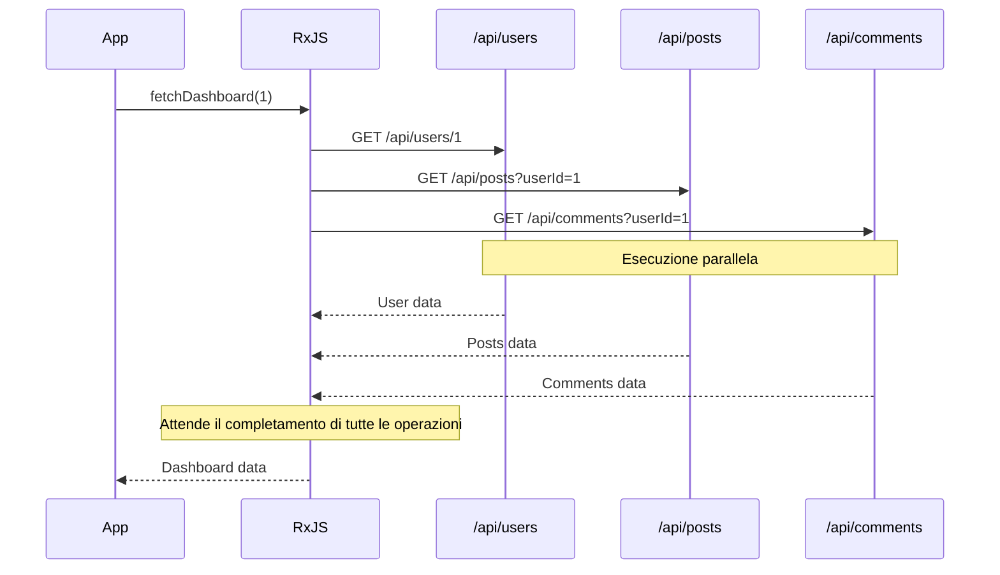
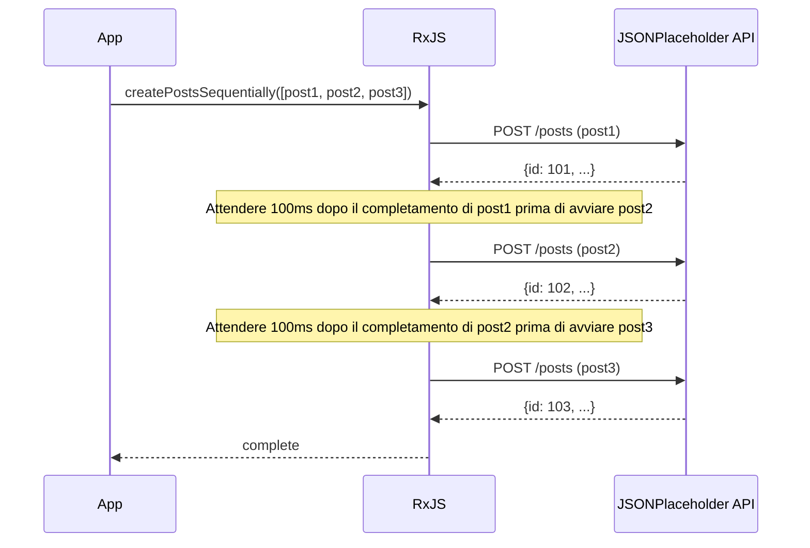
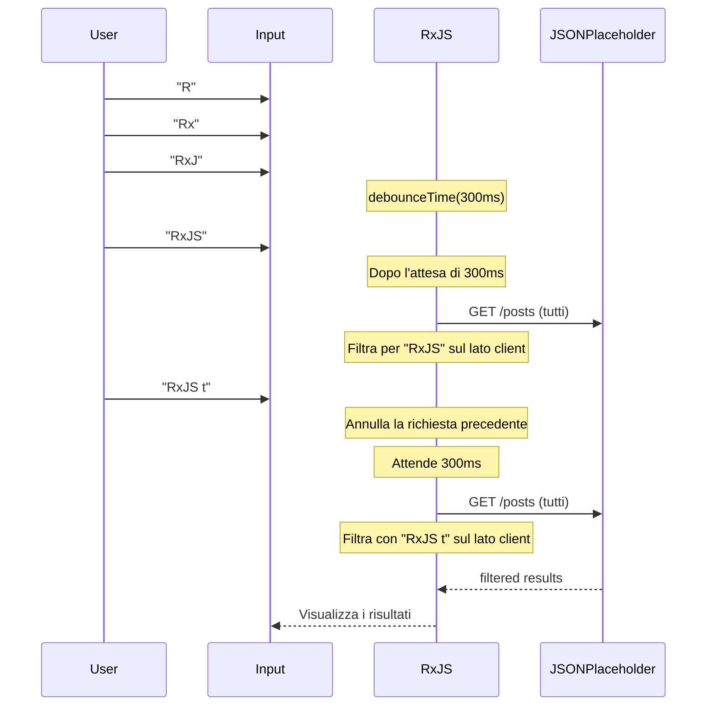

# Modelli di chiamata API

Le chiamate API sono uno dei processi più frequentemente implementati nello sviluppo web. Con RxJS è possibile implementare chiamate API asincrone complesse in modo dichiarativo e robusto.

Questo articolo descrive modelli di implementazione concreti per vari scenari di chiamate API che si incontrano nella pratica, tra cui la gestione degli errori e la gestione delle cancellazioni.

## Cosa imparerete in questo articolo

- Implementazione di base delle richieste GET/POST
- Invocazione parallela di più API (forkJoin)
- Richieste in serie che richiedono un'esecuzione sequenziale (concatMap)
- Concatenamento di richieste con dipendenze (switchMap)
- Gestione dei tentativi e degli errori
- Gestione dei timeout
- Cancellazione delle richieste

> [!TIP] Prerequisiti
> Questo articolo si basa sul [Capitolo 4: Operatori](../operators/index.md) e [Capitolo 6: Gestione degli errori](../error-handling/strategies.md).

## Chiamate API di base

### Problema: semplice richiesta GET

Il caso più elementare implementa una singola richiesta GET.

### Esempio di implementazione

```typescript
import { from, Observable, map, catchError, timeout } from 'rxjs';

// Tipo User dell'API JSONPlaceholder
// https://jsonplaceholder.typicode.com/users
interface User {
  id: number;
  name: string;
  username: string;
  email: string;
  address: {
    street: string;
    suite: string;
    city: string;
    zipcode: string;
    geo: {
      lat: string;
      lng: string;
    };
  };
  phone: string;
  website: string;
  company: {
    name: string;
    catchPhrase: string;
    bs: string;
  };
}

// Ottenere l'elenco degli utenti
function fetchUsers(): Observable<User[]> {
  return from(
    fetch('https://jsonplaceholder.typicode.com/users')
      .then(response => {
        if (!response.ok) {
          throw new Error(`HTTP error! status: ${response.status}`);
        }
        return response.json();
      })
  ).pipe(
    timeout(5000), // Timeout in 5 secondi
    catchError(err => {
      console.error('Errore nel recupero degli utenti:', err);
      throw err;
    })
  );
}

// Esempio di utilizzo
fetchUsers().subscribe({
  next: users => {
    console.log('Elenco utenti:', users);
    console.log('Primo utente:', users[0].name); // Es: "Leanne Graham"
  },
  error: err => console.error('Errore:', err)
});
```

> [!NOTE] from() vs ajax()
> Questo esempio utilizza il metodo standard `fetch` con `from()`, ma è possibile utilizzare anche `ajax()` ufficiale di RxJS. `ajax()` è più sofisticato e supporta la cancellazione delle richieste e il monitoraggio dei progressi.

### Richiesta POST

Schema per la creazione di nuovi dati.

```typescript
import { from, Observable, catchError } from 'rxjs';

// Tipo Post dell'API JSONPlaceholder
// https://jsonplaceholder.typicode.com/posts
interface Post {
  id: number;
  userId: number;
  title: string;
  body: string;
}

interface CreatePostRequest {
  userId: number;
  title: string;
  body: string;
}

function createPost(postData: CreatePostRequest): Observable<Post> {
  return from(
    fetch('https://jsonplaceholder.typicode.com/posts', {
      method: 'POST',
      headers: {
        'Content-Type': 'application/json',
      },
      body: JSON.stringify(postData)
    }).then(response => {
      if (!response.ok) {
        throw new Error(`HTTP error! status: ${response.status}`);
      }
      return response.json();
    })
  ).pipe(
    catchError(err => {
      console.error('Errore nella creazione del post:', err);
      throw err;
    })
  );
}

// Esempio di utilizzo
createPost({
  userId: 1,
  title: 'Apprendimento RxJS',
  body: 'Sto imparando i pattern di chiamata API con RxJS.'
}).subscribe({
  next: post => {
    console.log('Post creato:', post);
    console.log('ID del post:', post.id); // JSONPlaceholder assegna automaticamente un ID (es: 101)
  },
  error: err => console.error('Errore:', err)
});
```

> [!TIP] Consigli pratici
> - **Type safety**: definire chiaramente il tipo di risposta
> - **Gestione degli errori**: controllare correttamente i codici di stato HTTP
> - **Timeout**: evitare lunghe attese

## Richieste parallele (forkJoin)

### Problema: voglio chiamare più API contemporaneamente

È possibile che si vogliano chiamare diverse API indipendenti in parallelo e procedere solo dopo aver ricevuto tutte le risposte.

### Soluzione: utilizzare forkJoin

`forkJoin` attende che più Observable siano tutti completati e restituisce tutti i risultati in un array (equivalente a Promise.all).

```typescript
import { forkJoin, from, Observable, map } from 'rxjs';

// Tipo Comment dell'API JSONPlaceholder
// https://jsonplaceholder.typicode.com/comments
interface Comment {
  postId: number;
  id: number;
  name: string;
  email: string;
  body: string;
}
interface Post {
  id: number;
  userId: number;
  title: string;
  body: string;
}
interface User {
  id: number;
  name: string;
  username: string;
  email: string;
  address: {
    street: string;
    suite: string;
    city: string;
    zipcode: string;
    geo: {
      lat: string;
      lng: string;
    };
  };
  phone: string;
  website: string;
  company: {
    name: string;
    catchPhrase: string;
    bs: string;
  };
}
interface Dashboard {
  user: User;
  posts: Post[];
  comments: Comment[];
}

function fetchUserById(id: number): Observable<User> {
  return from(
    fetch(`https://jsonplaceholder.typicode.com/users/${id}`).then(r => r.json())
  );
}

function fetchPostsByUserId(userId: number): Observable<Post[]> {
  return from(
    fetch(`https://jsonplaceholder.typicode.com/posts?userId=${userId}`).then(r => r.json())
  );
}

function fetchCommentsByPostId(postId: number): Observable<Comment[]> {
  return from(
    fetch(`https://jsonplaceholder.typicode.com/comments?postId=${postId}`).then(r => r.json())
  );
}

// Recuperare i dati del dashboard in parallelo
function fetchDashboard(userId: number): Observable<Dashboard> {
  return forkJoin({
    user: fetchUserById(userId),
    posts: fetchPostsByUserId(userId),
    comments: fetchCommentsByPostId(1) // Ottiene i commenti del post ID=1
  }).pipe(
    map(({ user, posts, comments }) => ({
      user,
      posts,
      comments
    }))
  );
}

// Esempio di utilizzo
fetchDashboard(1).subscribe({
  next: dashboard => {
    console.log('Utente:', dashboard.user.name); // Es: "Leanne Graham"
    console.log('Numero di post:', dashboard.posts.length); // Es: 10
    console.log('Numero di commenti:', dashboard.comments.length); // Es: 5
  },
  error: err => console.error('Errore nel recupero del dashboard:', err)
});
```

#### Flusso di esecuzione



> [!IMPORTANT] Caratteristiche di forkJoin
> - Attende che tutti gli Observable siano completati
> - **Se uno di essi fallisce, l'intera operazione fallisce**
> - Tutti gli Observable devono emettere almeno un valore

### Gestione degli errori migliorata

Nelle richieste parallele, si potrebbe voler recuperare altri risultati anche se alcuni di essi falliscono.

```typescript
import { forkJoin, of, catchError } from 'rxjs';

function fetchDashboardWithFallback(userId: number): Observable<Dashboard> {
  return forkJoin({
    user: fetchUserById(userId).pipe(
      catchError(err => {
        console.error('Errore nel recupero dell\'utente:', err);
        return of(null); // Restituisce null in caso di errore
      })
    ),
    posts: fetchPostsByUserId(userId).pipe(
      catchError(err => {
        console.error('Errore nel recupero dei post:', err);
        return of([]); // Restituisce un array vuoto in caso di errore
      })
    ),
    comments: fetchCommentsByUserId(userId).pipe(
      catchError(err => {
        console.error('Errore nel recupero dei commenti:', err);
        return of([]); // Restituisce un array vuoto in caso di errore
      })
    )
  }).pipe(
    map(({ user, posts, comments }) => ({
      user: user || { id: userId, name: 'Unknown', email: '' },
      posts,
      comments
    }))
  );
}
```

> [!TIP] Gestione parziale degli errori
> Applicando `catchError` a ogni Observable, l'intero processo può continuare anche se una parte di esso fallisce.

## Richieste in serie (concatMap)

### Problema: voglio eseguire le API in sequenza

Si vuole eseguire la richiesta successiva dopo che la precedente è stata completata (ad esempio, il caricamento di più file in sequenza).

### Soluzione: utilizzare concatMap

`concatMap` esegue l'Observable successivo dopo che il precedente è stato completato.

```typescript
import { from, Observable, concatMap, tap, delay, catchError } from 'rxjs';

// Tipo Post dell'API JSONPlaceholder
// https://jsonplaceholder.typicode.com/posts
interface Post {
  id: number;
  userId: number;
  title: string;
  body: string;
}

interface CreatePostRequest {
  userId: number;
  title: string;
  body: string;
}

function createPost(postData: CreatePostRequest): Observable<Post> {
  return from(
    fetch('https://jsonplaceholder.typicode.com/posts', {
      method: 'POST',
      headers: {
        'Content-Type': 'application/json',
      },
      body: JSON.stringify(postData)
    }).then(response => {
      if (!response.ok) {
        throw new Error(`HTTP error! status: ${response.status}`);
      }
      return response.json();
    })
  ).pipe(
    catchError(err => {
      console.error('Errore nella creazione del post:', err);
      throw err;
    })
  );
}

// Creare più post in sequenza (tenendo conto del rate limiting dell'API)
function createPostsSequentially(posts: CreatePostRequest[]): Observable<Post> {
  return from(posts).pipe(
    concatMap((postData, index) =>
      createPost(postData).pipe(
        tap(result => console.log(`Creazione post ${index + 1} completata:`, result.title)),
        delay(100) // Attendere 100ms per tenere conto del rate limiting dell'API
      )
    )
  );
}

// Esempio di utilizzo
const postsToCreate: CreatePostRequest[] = [
  {
    userId: 1,
    title: 'Primo post',
    body: 'Questo è il primo post.'
  },
  {
    userId: 1,
    title: 'Secondo post',
    body: 'Questo è il secondo post.'
  },
  {
    userId: 1,
    title: 'Terzo post',
    body: 'Questo è il terzo post.'
  }
];

const results: Post[] = [];

createPostsSequentially(postsToCreate).subscribe({
  next: post => {
    results.push(post);
    console.log(`Progresso: ${results.length}/${postsToCreate.length}`);
  },
  complete: () => {
    console.log('Creazione di tutti i post completata:', results.length, 'elementi');
  },
  error: err => console.error('Errore nella creazione del post:', err)
});
```

#### Flusso di esecuzione



> [!NOTE] concatMap vs mergeMap
> - **concatMap**: esegue in sequenza (la precedente è stata completata, poi la successiva)
> - **mergeMap**: esecuzione parallela (sono possibili più esecuzioni simultanee)
>
> `concatMap` se la sequenzialità è importante, `mergeMap` se la sequenzialità non è necessaria e la velocità è prioritaria.

## Richieste con dipendenze (switchMap)

### Problema: chiamare l'API successiva usando la risposta dell'API precedente

Uno degli schemi più comuni è quello di usare il risultato della prima risposta API per chiamare l'API successiva.

### Soluzione: utilizzare switchMap

`switchMap` prende il valore dell'Observable precedente e lo converte in un nuovo Observable.

```typescript
import { from, Observable, switchMap, map } from 'rxjs';

interface UserProfile {
  user: User;
  posts: Post[];
}
interface Post {
  id: number;
  userId: number;
  title: string;
  body: string;
}
interface User {
  id: number;
  name: string;
  username: string;
  email: string;
  address: {
    street: string;
    suite: string;
    city: string;
    zipcode: string;
    geo: {
      lat: string;
      lng: string;
    };
  };
  phone: string;
  website: string;
  company: {
    name: string;
    catchPhrase: string;
    bs: string;
  };
}

function fetchUserById(id: number): Observable<User> {
  return from(
    fetch(`https://jsonplaceholder.typicode.com/users/${id}`).then(r => r.json())
  );
}

function fetchPostsByUserId(userId: number): Observable<Post[]> {
  return from(
    fetch(`https://jsonplaceholder.typicode.com/posts?userId=${userId}`).then(r => r.json())
  );
}

// Ottenere i dettagli dell'utente e i suoi post
function fetchUserProfile(userId: number): Observable<UserProfile> {
  return fetchUserById(userId).pipe(
    switchMap(user =>
      // Ottenere i dettagli dell'utente e poi i suoi post
      fetchPostsByUserId(user.id).pipe(
        map(posts => ({
          user,
          posts
        }))
      )
    )
  );
}

// Esempio di utilizzo
fetchUserProfile(1).subscribe({
  next: profile => {
    console.log('Utente:', profile.user.name);
    console.log('Post:', profile.posts);
  },
  error: err => console.error('Errore:', err)
});
```

### Esempio pratico: implementare una funzione di ricerca

Si tratta di uno schema frequentemente utilizzato nella pratica, in cui l'API viene chiamata in risposta all'input di ricerca dell'utente.

```typescript
import { from, fromEvent, Observable, of, map, debounceTime, distinctUntilChanged, switchMap, catchError } from 'rxjs';

// Usare Post di JSONPlaceholder come risultato della ricerca
interface SearchResult {
  id: number;
  userId: number;
  title: string;
  body: string;
}

function searchAPI(query: string): Observable<SearchResult[]> {
  return from(
    fetch('https://jsonplaceholder.typicode.com/posts')
      .then(response => {
        if (!response.ok) {
          throw new Error(`HTTP error! status: ${response.status}`);
        }
        return response.json();
      })
  ).pipe(
    // Filtraggio lato client per titolo
    map((posts: SearchResult[]) =>
      posts.filter(post =>
        post.title.toLowerCase().includes(query.toLowerCase())
      )
    )
  );
}

// Traditional approach (commented for reference)
// const searchInput = document.querySelector<HTMLInputElement>('#search');

// Self-contained: creates search input and results container dynamically
const searchInput = document.createElement('input');
searchInput.id = 'search';
searchInput.type = 'text';
searchInput.placeholder = 'Inserisci parole chiave di ricerca (almeno 2 caratteri)';
searchInput.style.padding = '10px';
searchInput.style.margin = '10px';
searchInput.style.width = '400px';
searchInput.style.fontSize = '16px';
searchInput.style.border = '2px solid #ccc';
searchInput.style.borderRadius = '4px';
searchInput.style.display = 'block';
document.body.appendChild(searchInput);

const resultsContainer = document.createElement('div');
resultsContainer.id = 'results';
resultsContainer.style.padding = '10px';
resultsContainer.style.margin = '10px';
resultsContainer.style.minHeight = '100px';
resultsContainer.style.border = '1px solid #ddd';
resultsContainer.style.borderRadius = '4px';
resultsContainer.style.backgroundColor = '#f9f9f9';
document.body.appendChild(resultsContainer);

const search$ = fromEvent(searchInput, 'input').pipe(
  map(event => (event.target as HTMLInputElement).value),
  debounceTime(300),           // Attendere 300ms dopo l'inserimento
  distinctUntilChanged(),      // Ignorare se il valore è lo stesso dell'ultima volta
  switchMap(query => {
    if (query.length < 2) {
      return of([]); // Array vuoto se meno di 2 caratteri
    }
    return searchAPI(query).pipe(
      catchError(err => {
        console.error('Errore di ricerca:', err);
        return of([]); // Array vuoto in caso di errore
      })
    );
  })
);

search$.subscribe(results => {
  console.log('Risultati della ricerca:', results);
  // Visualizzare i risultati nell'UI
  displayResults(results, resultsContainer);
});

function displayResults(results: SearchResult[], container: HTMLElement): void {
  // Processo per visualizzare i risultati nel DOM
  container.innerHTML = results
    .map(r => `<div style="padding: 8px; margin: 4px; border-bottom: 1px solid #eee;">${r.title}</div>`)
    .join('');

  if (results.length === 0) {
    container.innerHTML = '<div style="padding: 8px; color: #999;">Nessun risultato della ricerca</div>';
  }
}
```

> [!TIP] Filtraggio lato client
> Poiché l'API JSONPlaceholder non dispone di un endpoint di ricerca, tutti i post vengono recuperati e filtrati sul lato client. In pratica, questo schema viene utilizzato quando il back-end non dispone di una funzione di ricerca o quando la quantità di dati è ridotta.
>
> **Esempi di ricerca**:
> - Ricerca con "sunt" → trovati più post
> - Ricerca con "qui est esse" → risultati con titoli contenenti "qui est esse"
> - Ricerca con "zzz" → Nessun risultato (non trovato)

#### Flusso di esecuzione



> [!IMPORTANT] Importante proprietà di switchMap
> **Annulla automaticamente l'Observable precedente quando arriva un nuovo valore.**
> Questo assicura che le risposte alle richieste API più vecchie siano ignorate anche se arrivano più tardi (evita le Race Condition).

### switchMap vs mergeMap vs concatMap

L'uso di operatori di mapping di ordine superiore.

| Operatore | Comportamento | Caso d'uso |
|------------|------|-----------|
| `switchMap` | Annulla il precedente quando arriva un nuovo valore | **Ricerca, autocompletamento** (è necessario solo l'ultimo risultato) |
| `mergeMap` | Esegue tutto in parallelo | **Elaborazione parallela** (qualsiasi ordine, tutti i risultati necessari) |
| `concatMap` | Esegue in ordine (prima il precedente completato, poi il successivo) | **Processi in cui l'ordine è importante** (es. caricamento di file) |
| `exhaustMap` | Ignora i nuovi valori fino al completamento del precedente | **Previene i doppi invii** (contromisura contro la pressione consecutiva di pulsanti) |

```typescript
// switchMap: Visualizzare solo gli ultimi risultati della ricerca
searchInput$.pipe(
  switchMap(query => searchAPI(query))
);

// mergeMap: Caricare tutti i file in parallelo
from(files).pipe(
  mergeMap(file => uploadFile(file))
);

// concatMap: Caricare i file in sequenza
from(files).pipe(
  concatMap(file => uploadFile(file))
);

// exhaustMap: Impedire il doppio invio dei moduli
submitButton$.pipe(
  exhaustMap(() => submitForm())
);
```

## Retry e gestione degli errori

### Problema: voglio gestire gli errori temporanei della rete

In caso di errore di rete o di timeout, si può desiderare di riprovare automaticamente.

### Soluzione: usare retry e retryWhen

```typescript
import { from, Observable, timer } from 'rxjs';
import { retry, retryWhen, mergeMap, catchError, of, timeout } from 'rxjs';

// Tipo User dell'API JSONPlaceholder
// https://jsonplaceholder.typicode.com/users
interface User {
  id: number;
  name: string;
  username: string;
  email: string;
  address: {
    street: string;
    suite: string;
    city: string;
    zipcode: string;
    geo: {
      lat: string;
      lng: string;
    };
  };
  phone: string;
  website: string;
  company: {
    name: string;
    catchPhrase: string;
    bs: string;
  };
}

function fetchUsers(): Observable<User[]> {
  return from(
    fetch('https://jsonplaceholder.typicode.com/users')
      .then(response => {
        if (!response.ok) {
          throw new Error(`HTTP error! status: ${response.status}`);
        }
        return response.json();
      })
  ).pipe(
    timeout(5000), // Timeout in 5 secondi
    catchError(err => {
      console.error('Errore nel recupero degli utenti:', err);
      throw err;
    })
  );
}

// Retry semplice (fino a tre volte immediatamente)
function fetchWithSimpleRetry(): Observable<User[]> {
  return fetchUsers().pipe(
    retry(3), // Riprova fino a 3 volte in caso di errore
    catchError(err => {
      console.error('Ancora errore dopo il retry:', err);
      return of([]); // Restituisce un array vuoto se l'errore è definitivo
    })
  );
}

// Retry con backoff esponenziale
function fetchWithExponentialBackoff(): Observable<User[]> {
  return fetchUsers().pipe(
    retryWhen(errors =>
      errors.pipe(
        mergeMap((error, index) => {
          const retryAttempt = index + 1;

          // Riprova fino a 3 volte
          if (retryAttempt > 3) {
            throw error;
          }

          // Backoff esponenziale: 1 secondo, 2 secondi, 4 secondi
          const delayMs = Math.pow(2, index) * 1000;
          console.log(`Retry ${retryAttempt}/3 (dopo ${delayMs}ms)`);

          return timer(delayMs);
        })
      )
    ),
    catchError(err => {
      console.error('Ancora errore dopo il retry:', err);
      return of([]);
    })
  );
}

// Esempio di utilizzo
fetchWithExponentialBackoff().subscribe({
  next: users => console.log('Recupero utenti riuscito:', users),
  error: err => console.error('Errore finale:', err)
});
```

**Esempio di esecuzione del backoff esponenziale:**

```
1° tentativo: esecuzione immediata
↓ Errore
2° tentativo: esecuzione dopo 1 secondo di attesa
↓ Errore
3° tentativo: esecuzione dopo 2 secondi di attesa
↓ Errore
4° tentativo: esecuzione dopo 4 secondi di attesa
↓ Successo o errore finale
```

> [!TIP] Selezione della strategia di retry
> - **Retry immediato**: `retry(3)` - Semplice, utile per i guasti della rete
> - **Intervallo fisso**: `retryWhen` + `delay(1000)` - Tiene conto del carico del server
> - **Backoff esponenziale**: `retryWhen` + `timer` - Best practice per AWS ecc.

### Riprova solo su errori specifici

Non tutti gli errori devono essere ritentati (ad esempio, 401 Unauthorized non richiede un tentativo).

```typescript
import { throwError } from 'rxjs';

interface HttpError {
  status: number;
  message: string;
}

function shouldRetry(error: HttpError): boolean {
  // Codici di stato che dovrebbero essere ritentati
  const retryableStatuses = [408, 429, 500, 502, 503, 504];
  return retryableStatuses.includes(error.status);
}

function fetchWithConditionalRetry(): Observable<User[]> {
  return fetchUsers().pipe(
    retryWhen(errors =>
      errors.pipe(
        mergeMap((error: HttpError, index) => {
          const retryAttempt = index + 1;

          // Errore non ripetibile
          if (!shouldRetry(error)) {
            console.error('Errore non ripetibile:', error);
            return throwError(() => error);
          }

          // Massimo 3 tentativi
          if (retryAttempt > 3) {
            return throwError(() => error);
          }

          const delayMs = Math.pow(2, index) * 1000;
          console.log(`Retry ${retryAttempt}/3 (status: ${error.status})`);

          return timer(delayMs);
        })
      )
    ),
    catchError(err => {
      console.error('Errore finale:', err);
      return of([]);
    })
  );
}
```

> [!WARNING] Note sui retry
> - **Richiesta POST**: rischio di creare un duplicato in caso di mancata idempotenza
> - **Errore di autenticazione**: 401/403 non riprovare, richiedere un nuovo accesso
> - **Errore di validazione**: 400 non riprovare, chiedere all'utente di correggere

## Gestione del timeout

### Problema: voglio gestire le risposte lente delle API

Se la rete è lenta o il server non risponde, si vuole fare un timeout dopo un certo periodo di tempo.

### Soluzione: utilizzare l'operatore timeout

```typescript
import { timeout, catchError, of, from, Observable, throwError } from 'rxjs';

// Tipo User dell'API JSONPlaceholder
// https://jsonplaceholder.typicode.com/users
interface User {
  id: number;
  name: string;
  username: string;
  email: string;
  address: {
    street: string;
    suite: string;
    city: string;
    zipcode: string;
    geo: {
      lat: string;
      lng: string;
    };
  };
  phone: string;
  website: string;
  company: {
    name: string;
    catchPhrase: string;
    bs: string;
  };
}

function fetchUsers(): Observable<User[]> {
  return from(
    fetch('https://jsonplaceholder.typicode.com/users')
      .then(response => {
        if (!response.ok) {
          throw new Error(`HTTP error! status: ${response.status}`);
        }
        return response.json();
      })
  ).pipe(
    timeout(5000), // Timeout in 5 secondi
    catchError(err => {
      console.error('Errore nel recupero degli utenti:', err);
      throw err;
    })
  );
}

// Timeout in 5 secondi
function fetchWithTimeout(): Observable<User[]> {
  return fetchUsers().pipe(
    timeout(5000), // Errore se non c'è risposta entro 5 secondi
    catchError(err => {
      if (err.name === 'TimeoutError') {
        console.error('La richiesta è scaduta');
        // Elaborazione di ripiego in caso di timeout
        return of([]); // Restituisce un array vuoto
      }
      throw err; // Altri errori vengono rilanciati
    })
  );
}

// Messaggio di timeout personalizzato
function fetchWithCustomTimeout(): Observable<User[]> {
  return fetchUsers().pipe(
    timeout({
      each: 5000,
      with: () => throwError(() => new Error('Errore di timeout personalizzato'))
    }),
    catchError(err => {
      console.error('Errore:', err.message);
      return of([]);
    })
  );
}
```

### Combinazione di retry e timeout

In pratica, i timeout e i retry vengono utilizzati in combinazione.

```typescript
function fetchWithTimeoutAndRetry(): Observable<User[]> {
  return fetchUsers().pipe(
    timeout(5000),           // Timeout di 5 secondi per ogni tentativo
    retry(3),                // Riprova tre volte dopo il timeout
    catchError(err => {
      console.error('Errore dopo il timeout e il retry:', err);
      return of([]);
    })
  );
}
```

> [!TIP] Impostare il valore di timeout
> - **API normale**: 5 secondi - 10 secondi
> - **API veloce**: 2 secondi - 3 secondi
> - **Caricamento file**: 30-60 secondi
> - **Elaborazione in background**: più di 60 secondi
>
> Impostare per bilanciare l'esperienza dell'utente e il carico del server.

## Processo di cancellazione della richiesta

### Problema: voglio annullare le richieste API che non sono più necessarie

Voglio annullare una richiesta API in corso quando avviene una transizione di pagina o un componente viene distrutto.

### Soluzione: usare takeUntil

```typescript
import { Subject, takeUntil, from, timeout, catchError } from 'rxjs';

// Tipo User dell'API JSONPlaceholder
// https://jsonplaceholder.typicode.com/users
interface User {
  id: number;
  name: string;
  username: string;
  email: string;
  address: {
    street: string;
    suite: string;
    city: string;
    zipcode: string;
    geo: {
      lat: string;
      lng: string;
    };
  };
  phone: string;
  website: string;
  company: {
    name: string;
    catchPhrase: string;
    bs: string;
  };
}

class UserListManager {
  private destroy$ = new Subject<void>();
  private users: User[] = [];


   fetchUsers(): Observable<User[]> {
    return from(
      fetch('https://jsonplaceholder.typicode.com/users')
        .then(response => {
          if (!response.ok) {
            throw new Error(`HTTP error! status: ${response.status}`);
          }
          return response.json();
        })
    ).pipe(
      timeout(5000), // Timeout in 5 secondi
      catchError(err => {
        console.error('Errore nel recupero degli utenti:', err);
        throw err;
      })
    );
  }

  init(): void {
    // Ottenere l'elenco degli utenti all'inizializzazione
    this.fetchUsers().pipe(
      takeUntil(this.destroy$) // Annullamento automatico alla distruzione dell'istanza
    ).subscribe({
      next: (users: User[]) => {
        this.users = users;
        console.log('Recupero utenti completato:', users);
      },
      error: (err: any) => console.error('Errore:', err)
    });
  }

  destroy(): void {
    // Si attiva alla distruzione dell'istanza
    this.destroy$.next();
    this.destroy$.complete();
  }
}

// Esempio di utilizzo
const userList = new UserListManager();
userList.init();

// Quando è richiesta la pulizia
// userList.destroy();
```

### Cancellazione tramite azione dell'utente

Questo è un esempio di implementazione di un pulsante di cancellazione esplicito.

```typescript
// Traditional approach (commented for reference)
// const cancelButton = document.querySelector<HTMLButtonElement>('#cancel');
// const loadButton = document.querySelector<HTMLButtonElement>('#load');

// Self-contained: creates load and cancel buttons dynamically
const loadButton = document.createElement('button');
loadButton.id = 'load';
loadButton.textContent = 'Carica utenti';
loadButton.style.padding = '10px 20px';
loadButton.style.margin = '10px';
loadButton.style.fontSize = '16px';
loadButton.style.fontWeight = 'bold';
loadButton.style.color = '#fff';
loadButton.style.backgroundColor = '#4CAF50';
loadButton.style.border = 'none';
loadButton.style.borderRadius = '4px';
loadButton.style.cursor = 'pointer';
document.body.appendChild(loadButton);

const cancelButton = document.createElement('button');
cancelButton.id = 'cancel';
cancelButton.textContent = 'Annulla';
cancelButton.style.padding = '10px 20px';
cancelButton.style.margin = '10px';
cancelButton.style.fontSize = '16px';
cancelButton.style.fontWeight = 'bold';
cancelButton.style.color = '#fff';
cancelButton.style.backgroundColor = '#f44336';
cancelButton.style.border = 'none';
cancelButton.style.borderRadius = '4px';
cancelButton.style.cursor = 'pointer';
document.body.appendChild(cancelButton);

const statusDisplay = document.createElement('div');
statusDisplay.id = 'status';
statusDisplay.style.padding = '10px';
statusDisplay.style.margin = '10px';
statusDisplay.style.fontSize = '14px';
statusDisplay.style.minHeight = '20px';
document.body.appendChild(statusDisplay);

const cancel$ = fromEvent(cancelButton, 'click');

fromEvent(loadButton, 'click').pipe(
  switchMap(() => {
    statusDisplay.textContent = 'Caricamento...';
    statusDisplay.style.color = '#FF9800';
    return fetchUsers().pipe(
      takeUntil(cancel$) // Interrotto facendo clic sul pulsante di annullamento
    );
  })
).subscribe({
  next: users => {
    console.log('Recupero utenti completato:', users);
    statusDisplay.textContent = `Recupero utenti completato: ${users.length} elementi`;
    statusDisplay.style.color = '#4CAF50';
  },
  error: err => {
    if (err.name === 'AbortError') {
      console.log('La richiesta è stata annullata');
      statusDisplay.textContent = 'La richiesta è stata annullata';
      statusDisplay.style.color = '#999';
    } else {
      console.error('Errore:', err);
      statusDisplay.textContent = `Errore: ${err.message}`;
      statusDisplay.style.color = '#f44336';
    }
  }
});
```

> [!IMPORTANT] Best practice per la cancellazione
> - **Implementare sempre un processo di cancellazione** - evita perdite di memoria e sprechi di rete
> - **Utilizzare takeUntil** - più dichiarativo e meno dimenticabile di unsubscribe()
> - **Quando si distruggono i componenti** - attivare destroy$ per annullare tutte le sottoscrizioni

## Esempio pratico di classe di servizio

Questo è un esempio di classe di servizio completa che riassume i modelli precedenti e può essere utilizzata in pratica.

```typescript
import { Observable, Subject, throwError, timer, catchError, retryWhen, mergeMap, timeout, shareReplay, takeUntil, from } from 'rxjs';

// Tipo User dell'API JSONPlaceholder
// https://jsonplaceholder.typicode.com/users
interface User {
  id: number;
  name: string;
  username: string;
  email: string;
  address: {
    street: string;
    suite: string;
    city: string;
    zipcode: string;
    geo: {
      lat: string;
      lng: string;
    };
  };
  phone: string;
  website: string;
  company: {
    name: string;
    catchPhrase: string;
    bs: string;
  };
}
interface Post {
  id: number;
  userId: number;
  title: string;
  body: string;
}

export class ApiService {
  private destroy$ = new Subject<void>();
  private cache = new Map<string, Observable<any>>();

  /**
   * Richiesta GET di base
   */
  get<T>(url: string, options?: RequestOptions): Observable<T> {
    return this.request<T>('GET', url, options);
  }

  /**
   * Richiesta POST
   */
  post<T>(url: string, body: any, options?: RequestOptions): Observable<T> {
    return this.request<T>('POST', url, { ...options, body });
  }

  /**
   * Richiesta GET in cache
   */
  getWithCache<T>(url: string, options?: RequestOptions): Observable<T> {
    const cacheKey = url;

    if (this.cache.has(cacheKey)) {
      return this.cache.get(cacheKey) as Observable<T>;
    }

    const request$ = this.get<T>(url, options).pipe(
      shareReplay(1) // Cache del risultato
    );

    this.cache.set(cacheKey, request$);
    return request$;
  }

  /**
   * Cancellazione della cache
   */
  clearCache(url?: string): void {
    if (url) {
      this.cache.delete(url);
    } else {
      this.cache.clear();
    }
  }

  /**
   * Elaborazione della richiesta di base
   */
  private request<T>(
    method: string,
    url: string,
    options?: RequestOptions
  ): Observable<T> {
    const config: RequestInit = {
      method,
      headers: {
        'Content-Type': 'application/json',
        ...options?.headers
      },
      body: options?.body ? JSON.stringify(options.body) : undefined
    };

    return from(
      fetch(url, config).then(response => {
        if (!response.ok) {
          throw {
            status: response.status,
            message: response.statusText
          };
        }
        return response.json();
      })
    ).pipe(
      timeout(options?.timeout || 10000), // Predefinito 10 secondi
      this.retryStrategy(options?.retry),
      // API pubbliche come JSONPlaceholder restituiscono direttamente i dati,
      // Non è necessario decomprimere response.data
      catchError(err => this.handleError(err)),
      takeUntil(this.destroy$) // Cancellazione automatica quando il servizio viene distrutto
    );
  }

  /**
   * Strategia di retry
   */
  private retryStrategy(retryConfig?: RetryConfig) {
    return retryWhen<any>(errors =>
      errors.pipe(
        mergeMap((error, index) => {
          const retryAttempt = index + 1;
          const maxRetries = retryConfig?.maxRetries || 3;

          // Verificare se il retry è possibile
          if (!this.shouldRetry(error) || retryAttempt > maxRetries) {
            return throwError(() => error);
          }

          // Backoff esponenziale
          const delayMs = retryConfig?.useExponentialBackoff
            ? Math.pow(2, index) * 1000
            : (retryConfig?.delayMs || 1000);

          console.log(`Retry ${retryAttempt}/${maxRetries} (dopo ${delayMs}ms)`);
          return timer(delayMs);
        })
      )
    );
  }

  /**
   * Determinare se l'errore dovrebbe essere riprovato
   */
  private shouldRetry(error: any): boolean {
    if (error.name === 'TimeoutError') {
      return true; // Il timeout è da riprovare
    }

    // Codici di stato HTTP riprovabili
    const retryableStatuses = [408, 429, 500, 502, 503, 504];
    return retryableStatuses.includes(error.status);
  }

  /**
   * Gestione degli errori
   */
  private handleError(error: any): Observable<never> {
    let errorMessage = 'Si è verificato un errore API';

    if (error.name === 'TimeoutError') {
      errorMessage = 'La richiesta è scaduta';
    } else if (error.status) {
      errorMessage = `HTTP ${error.status}: ${error.message}`;
    }

    console.error(errorMessage, error);
    return throwError(() => new Error(errorMessage));
  }

  /**
   * Elaborazione quando il servizio viene distrutto
   */
  destroy(): void {
    this.destroy$.next();
    this.destroy$.complete();
    this.cache.clear();
  }
}

// Definizioni dei tipi
interface RequestOptions {
  headers?: Record<string, string>;
  body?: any;
  timeout?: number;
  retry?: RetryConfig;
}

interface RetryConfig {
  maxRetries?: number;
  delayMs?: number;
  useExponentialBackoff?: boolean;
}

// Nota: il tipo ApiResponse è usato quando la risposta dell'API è wrappata
// Le API pubbliche come JSONPlaceholder restituiscono direttamente i dati, quindi questo tipo non è necessario
// Utilizzato quando si usa il formato { data: T, status: number } per le API proprietarie
interface ApiResponse<T> {
  data: T;
  status: number;
}

// Esempio di utilizzo
const apiService = new ApiService();

// Semplice GET (utilizzando l'API JSONPlaceholder)
apiService.get<User[]>('https://jsonplaceholder.typicode.com/users').subscribe({
  next: users => console.log('Utenti:', users),
  error: err => console.error('Errore:', err)
});

// POST con impostazioni personalizzate (utilizzando l'API JSONPlaceholder)
apiService.post<Post>(
  'https://jsonplaceholder.typicode.com/posts',
  { userId: 1, title: 'Post di prova', body: 'Questo è un post di prova.' },
  {
    timeout: 5000,
    retry: {
      maxRetries: 3,
      useExponentialBackoff: true
    }
  }
).subscribe({
  next: post => console.log('Post creato:', post),
  error: err => console.error('Errore:', err)
});

// GET in cache
apiService.getWithCache<User[]>('https://jsonplaceholder.typicode.com/users').subscribe({
  next: users => console.log('Utenti (in cache):', users)
});

// Quando il servizio viene distrutto
// apiService.destroy();
```

> [!TIP] Progettazione pratica del servizio
> - **Configurabile**: configurazione flessibile di timeout, numero di retry, ecc.
> - **Funzionalità di cache**: prevenire le richieste duplicate
> - **Gestione degli errori**: gestione uniforme degli errori
> - **Pulizia automatica**: destroy() assicura il rilascio delle risorse

## Codice di test

Esempio di test per il modello di chiamata API.

```typescript
import { TestScheduler } from 'rxjs/testing';
import { of, throwError } from 'rxjs';

describe('ApiService', () => {
  let testScheduler: TestScheduler;
  let apiService: ApiService;

  beforeEach(() => {
    testScheduler = new TestScheduler((actual, expected) => {
      expect(actual).toEqual(expected);
    });
    apiService = new ApiService();
  });

  afterEach(() => {
    apiService.destroy();
  });

  it('should fetch users successfully', () => {
    testScheduler.run(({ expectObservable, cold }) => {
      const mockResponse = { data: [{ id: 1, name: 'Test User', email: 'test@example.com' }] };

      // Mock di fetch
      spyOn(window, 'fetch').and.returnValue(
        Promise.resolve({
          ok: true,
          json: () => Promise.resolve(mockResponse)
        } as Response)
      );

      const result$ = apiService.get<User[]>('/api/users');

      expectObservable(result$).toBe('(a|)', {
        a: mockResponse.data
      });
    });
  });

  it('should retry on timeout', () => {
    testScheduler.run(({ expectObservable, cold, flush }) => {
      let callCount = 0;

      spyOn(window, 'fetch').and.callFake(() => {
        callCount++;
        if (callCount < 3) {
          // I primi due tentativi vanno in timeout
          return new Promise(() => {}); // Promessa non risolta
        }
        // Il terzo tentativo ha successo
        return Promise.resolve({
          ok: true,
          json: () => Promise.resolve({ data: [] })
        } as Response);
      });

      const result$ = apiService.get<User[]>('/api/users', {
        timeout: 100,
        retry: { maxRetries: 3, delayMs: 100 }
      });

      // Verifica che i retry vengano eseguiti
      flush();
      expect(callCount).toBeGreaterThan(1);
    });
  });
});
```

## Riepilogo

Padroneggiando lo schema di chiamata API con RxJS, si possono costruire applicazioni robuste e manutenibili.

> [!IMPORTANT] Punti chiave
> - **forkJoin**: esegue più API in parallelo, attende il completamento di tutte
> - **concatMap**: esegue le API in ordine (la precedente è stata completata, poi la successiva)
> - **switchMap**: ideale per richieste dipendenti, funzioni di ricerca
> - **retry/retryWhen**: retry automatico in caso di errore, backoff esponenziale raccomandato
> - **timeout**: impostare sempre un timeout
> - **takeUntil**: cancellazione automatica alla distruzione del componente

> [!TIP] Best Practice
> - **Type safety**: definire i tipi per tutte le risposte API
> - **Gestione degli errori**: implementare `catchError` per tutte le richieste
> - **Gestione delle cancellazioni**: garantire la pulizia con `takeUntil`
> - **Strategia di retry**: riprovare in modo appropriato in base al codice di stato
> - **Caching**: prevenire le richieste duplicate con `shareReplay`

## Prossimi passi

Una volta acquisita la padronanza dello schema di chiamata API, si può passare agli schemi seguenti.

- [Gestione dei moduli](./form-handling.md) - Validazione in tempo reale, salvataggio automatico
- [Gestione degli eventi UI](./ui-events.md) - Integrazione di eventi UI e chiamate API
- [Elaborazione dei dati in tempo reale](./real-time-data.md) - WebSocket, SSE
- [Strategie di caching](./caching-strategies.md) - Caching delle risposte API
- Pratiche di gestione degli errori (in preparazione) - Strategie di gestione degli errori più avanzate

## Sezioni correlate

- [Capitolo 4: Operatori](../operators/index.md) - Approfondimenti su switchMap, mergeMap e concatMap
- [Capitolo 6: Gestione degli errori](../error-handling/strategies.md) - Nozioni di base su catchError e retry
- [Capitolo 2: Cold/Hot Observable](../observables/cold-and-hot-observables.md) - Comprendere shareReplay

## Risorse di riferimento

- [RxJS Ufficiale: ajax](https://rxjs.dev/api/ajax/ajax) - Approfondimento su ajax()
- [MDN: Fetch API](https://developer.mozilla.org/en-US/docs/Web/API/Fetch_API) - Come usare fetch()
- [Learn RxJS: Higher-order Observables](https://www.learnrxjs.io/learn-rxjs/operators) - Confronto tra switchMap ecc.
