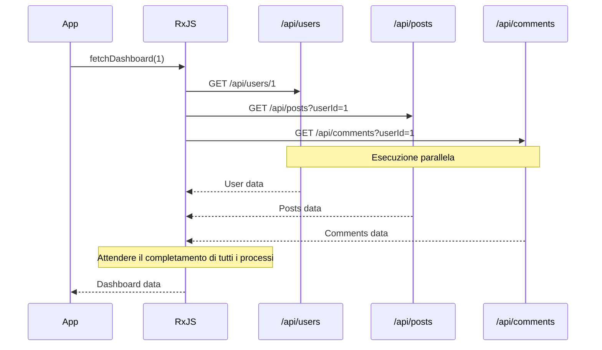
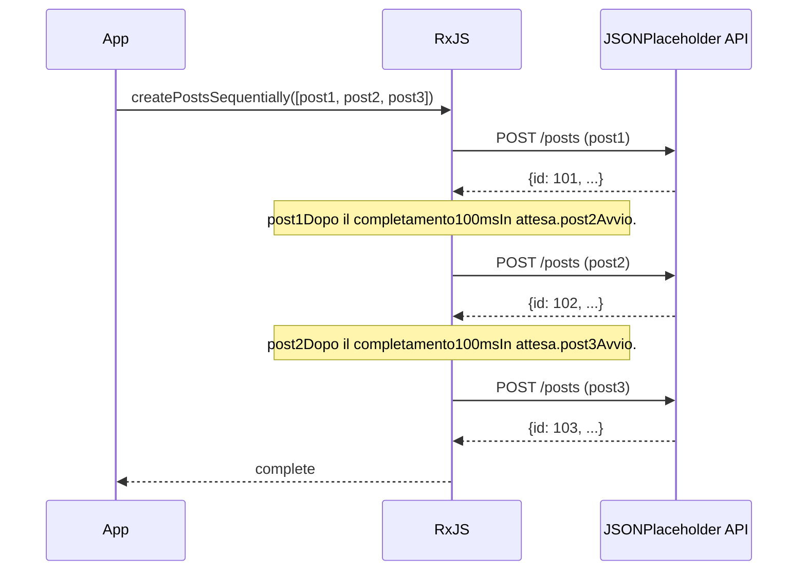

# Schema di chiamata API.

Le chiamate API sono uno dei processi più frequenti nello sviluppo web e RxJS consente di implementare chiamate API asincrone complesse in modo dichiarativo e robusto.

Questo articolo descrive modelli di implementazione concreti per vari scenari di chiamate API che si incontrano nella pratica, tra cui la gestione degli errori e la gestione delle cancellazioni.

## Cosa imparerete in questo articolo.

- Implementazione di base delle richieste GET/POST
- Invocazione parallela di più API (forkJoin)
- Richieste in serie che richiedono un'esecuzione sequenziale (concatMap)
- Concatenamento di richieste con dipendenze (switchMap)
- Gestione dei tentativi e degli errori
- Gestione dei timeout
- Cancellazione delle richieste

```typescript
import { from, Observable, catchError } from 'rxjs';

// JSONPlaceholder API(dopo un sostantivo) affidandosi a ...Posttipo
// https://jsonplaceholder.typicode.com/posts
interface Post {
  id: number;
  userId: number;
  title: string;
  body: string;
}

interface CreatePostRequest {
  userId: number;
  title: string;
  body: string;
}

function createPost(postData: CreatePostRequest): Observable<Post> {
  return from(
    fetch('https://jsonplaceholder.typicode.com/posts', {
      method: 'POST',
      headers: {
        'Content-Type': 'application/json',
      },
      body: JSON.stringify(postData)
    }).then(response => {
      if (!response.ok) {
        throw new Error(`HTTP error! status: ${response.status}`);
      }
      return response.json();
    })
  ).pipe(
    catchError((err: unknown) => {
      console.error('Errore nella creazione di un post:', err);
      throw err;
    })
  );
}

// Esempio di utilizzo
createPost({
  userId: 1,
  title: 'RxJSApprendimento di',
  body: 'RxJSutilizzando il metodoAPIImparare lo schema delle chiamate a'
}).subscribe({
  next: post => {
    console.log('Messaggi creati:', post);
    console.log('Un postID:', post.id); // JSONPlaceholdersono automaticamenteIDviene assegnato (ad es.: 101)
  },
  error: err => console.error('Errore:', err)
});
```

> Questo articolo fa parte del [Capitolo 4: Operatori](../operators/index.md) e [Capitolo 6: Gestione degli errori](../error-handling/strategies.md).

## Chiamate API di base.

### Problema: semplice richiesta GET.

Il caso più elementare implementa una singola richiesta GET.

### Esempio di implementazione.


```typescript
import { from, Observable, map, catchError, timeout } from 'rxjs';

// JSONPlaceholder API(dopo un sostantivo) affidandosi a ...Usertipo
// https://jsonplaceholder.typicode.com/users
interface User {
  id: number;
  name: string;
  username: string;
  email: string;
  address: {
    street: string;
    suite: string;
    city: string;
    zipcode: string;
    geo: {
      lat: string;
      lng: string;
    };
  };
  phone: string;
  website: string;
  company: {
    name: string;
    catchPhrase: string;
    bs: string;
  };
}

// Recupera l'elenco degli utenti
function fetchUsers(): Observable<User[]> {
  return from(
    fetch('https://jsonplaceholder.typicode.com/users')
      .then(response => {
        if (!response.ok) {
          throw new Error(`HTTP error! status: ${response.status}`);
        }
        return response.json();
      })
  ).pipe(
    timeout(5000), // 5Timeout in secondi
    catchError((err: unknown) => {
      console.error('Errore di acquisizione dell'utente:', err);
      throw err;
    })
  );
}

// Esempio di utilizzo
fetchUsers().subscribe({
  next: users => {
    console.log('Elenco utenti:', users);
    console.log('Primo utente:', users[0].name); // Esempio: "Leanne Graham"
  },
  error: err => console.error('Errore:', err)
});
```

```typescript
import { from, Observable, catchError } from 'rxjs';

// JSONPlaceholder API(dopo un sostantivo) affidandosi a ...Posttipo
// https://jsonplaceholder.typicode.com/posts
interface Post {
  id: number;
  userId: number;
  title: string;
  body: string;
}

interface CreatePostRequest {
  userId: number;
  title: string;
  body: string;
}

function createPost(postData: CreatePostRequest): Observable<Post> {
  return from(
    fetch('https://jsonplaceholder.typicode.com/posts', {
      method: 'POST',
      headers: {
        'Content-Type': 'application/json',
      },
      body: JSON.stringify(postData)
    }).then(response => {
      if (!response.ok) {
        throw new Error(`HTTP error! status: ${response.status}`);
      }
      return response.json();
    })
  ).pipe(
    catchError((err: unknown) => {
      console.error('Errore nella creazione di un post:', err);
      throw err;
    })
  );
}

// Esempio di utilizzo
createPost({
  userId: 1,
  title: 'RxJSApprendimento di',
  body: 'RxJSutilizzando il metodoAPIImparare lo schema delle chiamate a'
}).subscribe({
  next: post => {
    console.log('Messaggi creati:', post);
    console.log('Un postID:', post.id); // JSONPlaceholdersono automaticamenteIDviene assegnato (ad es.: 101)
  },
  error: err => console.error('Errore:', err)
});
```

> Questo esempio utilizza il metodo standard `fetch` con `from()`, ma si può anche utilizzare il metodo ufficiale ajax()` di RxJS. `ajax()` è più sofisticato e supporta la cancellazione della richiesta e il monitoraggio dell'avanzamento.

### Richiesta POST.

Schema per la creazione di nuovi dati.


```typescript
import { from, Observable, catchError } from 'rxjs';

// JSONPlaceholder API(dopo un sostantivo) affidandosi a ...Posttipo
// https://jsonplaceholder.typicode.com/posts
interface Post {
  id: number;
  userId: number;
  title: string;
  body: string;
}

interface CreatePostRequest {
  userId: number;
  title: string;
  body: string;
}

function createPost(postData: CreatePostRequest): Observable<Post> {
  return from(
    fetch('https://jsonplaceholder.typicode.com/posts', {
      method: 'POST',
      headers: {
        'Content-Type': 'application/json',
      },
      body: JSON.stringify(postData)
    }).then(response => {
      if (!response.ok) {
        throw new Error(`HTTP error! status: ${response.status}`);
      }
      return response.json();
    })
  ).pipe(
    catchError((err: unknown) => {
      console.error('Errore nella creazione di un post:', err);
      throw err;
    })
  );
}

// Esempio di utilizzo
createPost({
  userId: 1,
  title: 'RxJSApprendimento di',
  body: 'RxJSutilizzando il metodoAPIImparare lo schema delle chiamate a'
}).subscribe({
  next: post => {
    console.log('Messaggi creati:', post);
    console.log('Un postID:', post.id); // JSONPlaceholdersono automaticamenteIDviene assegnato (ad es.: 101)
  },
  error: err => console.error('Errore:', err)
});
```

> [!TIP] Consigli pratici

> - **Sicurezza del tipo**: definire chiaramente il tipo di risposta
> - **Gestione degli errori**: controllare correttamente i codici di stato HTTP
> - **Timeout**: evitare lunghe attese

## Richieste parallele (forkJoin)

### Problema: voglio chiamare più API contemporaneamente.

Si potrebbe voler chiamare diverse API indipendenti in parallelo e procedere solo dopo aver ricevuto tutte le risposte.

### Soluzione: utilizzare forkJoin.

forkJoin attende il completamento di più Observable e restituisce tutti i risultati in un array (equivalente a Promise.all).

```typescript
import { forkJoin, from, Observable, map } from 'rxjs';

// JSONPlaceholder API(dopo un sostantivo) affidandosi a ...Commenttipo
// https://jsonplaceholder.typicode.com/comments
interface Comment {
  postId: number;
  id: number;
  name: string;
  email: string;
  body: string;
}
interface Post {
  id: number;
  userId: number;
  title: string;
  body: string;
}
interface User {
  id: number;
  name: string;
  username: string;
  email: string;
  address: {
    street: string;
    suite: string;
    city: string;
    zipcode: string;
    geo: {
      lat: string;
      lng: string;
    };
  };
  phone: string;
  website: string;
  company: {
    name: string;
    catchPhrase: string;
    bs: string;
  };
}
interface Dashboard {
  user: User;
  posts: Post[];
  comments: Comment[];
}

function fetchUserById(id: number): Observable<User> {
  return from(
    fetch(`https://jsonplaceholder.typicode.com/users/${id}`).then(r => r.json())
  );
}

function fetchPostsByUserId(userId: number): Observable<Post[]> {
  return from(
    fetch(`https://jsonplaceholder.typicode.com/posts?userId=${userId}`).then(r => r.json())
  );
}

function fetchCommentsByPostId(postId: number): Observable<Comment[]> {
  return from(
    fetch(`https://jsonplaceholder.typicode.com/comments?postId=${postId}`).then(r => r.json())
  );
}

// Recupero parallelo dei dati della dashboard
function fetchDashboard(userId: number): Observable<Dashboard> {
  return forkJoin({
    user: fetchUserById(userId),
    posts: fetchPostsByUserId(userId),
    comments: fetchCommentsByPostId(1) // Un postID=1Recuperare i commenti di
  }).pipe(
    map(({ user, posts, comments }) => ({
      user,
      posts,
      comments
    }))
  );
}

// Esempio di utilizzo
fetchDashboard(1).subscribe({
  next: dashboard => {
    console.log('Utente:', dashboard.user.name); // Esempio: "Leanne Graham"
    console.log('Numero di messaggi:', dashboard.posts.length); // Esempio: 10Numero di messaggi
    console.log('Numero di commenti:', dashboard.comments.length); // Esempio: 5Numero di messaggi
  },
  error: err => console.error('Errore di acquisizione del cruscotto:', err)
});
```

#### Flusso di esecuzione


```mermaid
sequenceDiagram
    participant App
    participant RxJS
    participant API1 as /api/users
    participant API2 as /api/posts
    participant API3 as /api/comments

    App->>RxJS: fetchDashboard(1)
    RxJS->>API1: GET /api/users/1
    RxJS->>API2: GET /api/posts?userId=1
    RxJS->>API3: GET /api/comments?userId=1

    Note over API1,API3: Esecuzione parallela

    API1-->>RxJS: User data
    API2-->>RxJS: Posts data
    API3-->>RxJS: Comments data

    Note over RxJS: Attendere il completamento di tutti i processi

    RxJS-->>App: Dashboard data
```

```typescript
import { from, Observable, catchError } from 'rxjs';

// JSONPlaceholder API(dopo un sostantivo) affidandosi a ...Posttipo
// https://jsonplaceholder.typicode.com/posts
interface Post {
  id: number;
  userId: number;
  title: string;
  body: string;
}

interface CreatePostRequest {
  userId: number;
  title: string;
  body: string;
}

function createPost(postData: CreatePostRequest): Observable<Post> {
  return from(
    fetch('https://jsonplaceholder.typicode.com/posts', {
      method: 'POST',
      headers: {
        'Content-Type': 'application/json',
      },
      body: JSON.stringify(postData)
    }).then(response => {
      if (!response.ok) {
        throw new Error(`HTTP error! status: ${response.status}`);
      }
      return response.json();
    })
  ).pipe(
    catchError((err: unknown) => {
      console.error('Errore nella creazione di un post:', err);
      throw err;
    })
  );
}

// Esempio di utilizzo
createPost({
  userId: 1,
  title: 'RxJSApprendimento di',
  body: 'RxJSutilizzando il metodoAPIImparare lo schema delle chiamate a'
}).subscribe({
  next: post => {
    console.log('Messaggi creati:', post);
    console.log('Un postID:', post.id); // JSONPlaceholdersono automaticamenteIDviene assegnato (ad es.: 101)
  },
  error: err => console.error('Errore:', err)
});
```

> - Attendere che tutti gli Observable siano stati completati.
> - **Se uno di essi fallisce, l'insieme fallirà**
> - Tutti gli Observable devono emettere almeno un valore

### Gestione degli errori migliorata

Nelle richieste parallele, si potrebbe voler recuperare altri risultati anche se alcuni di essi falliscono.


```typescript
import { forkJoin, of, catchError } from 'rxjs';

function fetchDashboardWithFallback(userId: number): Observable<Dashboard> {
  return forkJoin({
    user: fetchUserById(userId).pipe(
      catchError((err: unknown) => {
        console.error('Errore di acquisizione dell'utente:', err);
        return of(null); // In caso di errore, restituiscenullRitorna
      })
    ),
    posts: fetchPostsByUserId(userId).pipe(
      catchError((err: unknown) => {
        console.error('Errore di post acquisizione:', err);
        return of([]); // Restituisce un array vuoto in caso di errore
      })
    ),
    comments: fetchCommentsByUserId(userId).pipe(
      catchError((err: unknown) => {
        console.error('Errore nel recupero del commento:', err);
        return of([]); // Restituisce un array vuoto in caso di errore
      })
    )
  }).pipe(
    map(({ user, posts, comments }) => ({
      user: user || { id: userId, name: 'Unknown', email: '' },
      posts,
      comments
    }))
  );
}
```

> [!TIP] 部分的なエラーハンドリング

> Applicando catchError a ogni Observable, l'intero processo può continuare anche se alcuni di essi falliscono.

## Richiesta di serie (concatMap)

### Problema: voglio eseguire le API in ordine.

Si vuole eseguire la richiesta successiva dopo che la precedente è stata completata (ad esempio, il caricamento di più file in sequenza).

### Soluzione: utilizzare concatMap.

concatMap esegue l'Observable successivo al termine di quello precedente.

```typescript
import { from, Observable, concatMap, tap, delay, catchError } from 'rxjs';

// JSONPlaceholder API(dopo un sostantivo) affidandosi a ...Posttipo
// https://jsonplaceholder.typicode.com/posts
interface Post {
  id: number;
  userId: number;
  title: string;
  body: string;
}

interface CreatePostRequest {
  userId: number;
  title: string;
  body: string;
}

function createPost(postData: CreatePostRequest): Observable<Post> {
  return from(
    fetch('https://jsonplaceholder.typicode.com/posts', {
      method: 'POST',
      headers: {
        'Content-Type': 'application/json',
      },
      body: JSON.stringify(postData)
    }).then(response => {
      if (!response.ok) {
        throw new Error(`HTTP error! status: ${response.status}`);
      }
      return response.json();
    })
  ).pipe(
    catchError((err: unknown) => {
      console.error('Errore nella creazione di un post:', err);
      throw err;
    })
  );
}

// Creare più post in sequenza (inAPILimitazione della velocità presa in considerazione)
function createPostsSequentially(posts: CreatePostRequest[]): Observable<Post> {
  return from(posts).pipe(
    concatMap((postData, index) =>
      createPost(postData).pipe(
        tap(result => console.log(`Un post${index + 1}Creazione completata:`, result.title)),
        delay(100) // APIConsiderando la limitazione della velocità100msIn attesa
      )
    )
  );
}

// Esempio di utilizzo
const postsToCreate: CreatePostRequest[] = [
  {
    userId: 1,
    title: '1Secondo messaggio',
    body: 'Questo è il1Il secondo post.'
  },
  {
    userId: 1,
    title: '2Secondo messaggio',
    body: 'Questo è il2Il secondo post.'
  },
  {
    userId: 1,
    title: '3Secondo messaggio',
    body: 'Questo è il3Il secondo post.'
  }
];

const results: Post[] = [];

createPostsSequentially(postsToCreate).subscribe({
  next: post => {
    results.push(post);
    console.log(`Progressi: ${results.length}/${postsToCreate.length}`);
  },
  complete: () => {
    console.log('Tutti i messaggi creati Completato:', results.length, 'Numero di messaggi');
  },
  error: err => console.error('Errore nella creazione di un post:', err)
});
```

#### Flusso di esecuzione


```mermaid
sequenceDiagram
    participant App
    participant RxJS
    participant API as JSONPlaceholder API

    App->>RxJS: createPostsSequentially([post1, post2, post3])

    RxJS->>API: POST /posts (post1)
    API-->>RxJS: {id: 101, ...}
    Note over RxJS: post1Dopo il completamento100msIn attesa.post2Avvio.

    RxJS->>API: POST /posts (post2)
    API-->>RxJS: {id: 102, ...}
    Note over RxJS: post2Dopo il completamento100msIn attesa.post3Avvio.

    RxJS->>API: POST /posts (post3)
    API-->>RxJS: {id: 103, ...}

    RxJS-->>App: complete
```

```typescript
import { from, Observable, catchError } from 'rxjs';

// JSONPlaceholder API(dopo un sostantivo) affidandosi a ...Posttipo
// https://jsonplaceholder.typicode.com/posts
interface Post {
  id: number;
  userId: number;
  title: string;
  body: string;
}

interface CreatePostRequest {
  userId: number;
  title: string;
  body: string;
}

function createPost(postData: CreatePostRequest): Observable<Post> {
  return from(
    fetch('https://jsonplaceholder.typicode.com/posts', {
      method: 'POST',
      headers: {
        'Content-Type': 'application/json',
      },
      body: JSON.stringify(postData)
    }).then(response => {
      if (!response.ok) {
        throw new Error(`HTTP error! status: ${response.status}`);
      }
      return response.json();
    })
  ).pipe(
    catchError((err: unknown) => {
      console.error('Errore nella creazione di un post:', err);
      throw err;
    })
  );
}

// Esempio di utilizzo
createPost({
  userId: 1,
  title: 'RxJSApprendimento di',
  body: 'RxJSutilizzando il metodoAPIImparare lo schema delle chiamate a'
}).subscribe({
  next: post => {
    console.log('Messaggi creati:', post);
    console.log('Un postID:', post.id); // JSONPlaceholdersono automaticamenteIDviene assegnato (ad es.: 101)
  },
  error: err => console.error('Errore:', err)
});
```

**concatMap**: esecuzione sequenziale (quella precedente è stata completata, poi la successiva).
> - **mergeMap**: esecuzione parallela (sono possibili più esecuzioni simultanee).
>
> - `concatMap` se l'ordine è importante, `mergeMap` se l'ordine non è richiesto e la velocità è una priorità.

## Richieste di dipendenza (switchMap)

### Problema: chiamare l'API successiva usando la risposta dell'API precedente.

Uno degli schemi più comuni, che utilizza il risultato della prima risposta API per chiamare l'API successiva.

### Soluzione: usare switchMap.

La switchMap prende il valore dell'Observable precedente e lo converte in un nuovo Observable.


```typescript
import { from, Observable, switchMap, map } from 'rxjs';

interface UserProfile {
  user: User;
  posts: Post[];
}
interface Post {
  id: number;
  userId: number;
  title: string;
  body: string;
}
interface User {
  id: number;
  name: string;
  username: string;
  email: string;
  address: {
    street: string;
    suite: string;
    city: string;
    zipcode: string;
    geo: {
      lat: string;
      lng: string;
    };
  };
  phone: string;
  website: string;
  company: {
    name: string;
    catchPhrase: string;
    bs: string;
  };
}

function fetchUserById(id: number): Observable<User> {
  return from(
    fetch(`https://jsonplaceholder.typicode.com/users/${id}`).then(r => r.json())
  );
}

function fetchPostsByUserId(userId: number): Observable<Post[]> {
  return from(
    fetch(`https://jsonplaceholder.typicode.com/posts?userId=${userId}`).then(r => r.json())
  );
}

// Recupero dei dati degli utenti e dei loro messaggi
function fetchUserProfile(userId: number): Observable<UserProfile> {
  return fetchUserById(userId).pipe(
    switchMap(user =>
      // Dopo aver recuperato i dettagli dell'utente e i suoi post
      fetchPostsByUserId(user.id).pipe(
        map(posts => ({
          user,
          posts
        }))
      )
    )
  );
}

// Esempio di utilizzo
fetchUserProfile(1).subscribe({
  next: profile => {
    console.log('Utente:', profile.user.name);
    console.log('Un post:', profile.posts);
  },
  error: err => console.error('Errore:', err)
});
```

### Esempio pratico: implementare una funzione di ricerca

Si tratta di uno schema frequentemente utilizzato nella pratica, in cui l'API viene chiamata in risposta all'input di ricerca dell'utente.

```typescript
import { from, fromEvent, Observable, of, map, debounceTime, distinctUntilChanged, switchMap, catchError } from 'rxjs';

// JSONPlaceholder (dopo un sostantivo) affidandosi a ... Post come risultati della ricerca.
interface SearchResult {
  id: number;
  userId: number;
  title: string;
  body: string;
}

function searchAPI(query: string): Observable<SearchResult[]> {
  return from(
    fetch('https://jsonplaceholder.typicode.com/posts')
      .then(response => {
        if (!response.ok) {
          throw new Error(`HTTP error! status: ${response.status}`);
        }
        return response.json();
      })
  ).pipe(
    // Filtraggio lato client per titolo
    map((posts: SearchResult[]) =>
      posts.filter(post =>
        post.title.toLowerCase().includes(query.toLowerCase())
      )
    )
  );
}

// Traditional approach (commented for reference)
// const searchInput = document.querySelector<HTMLInputElement>('#search');

// Self-contained: creates search input and results container dynamically
const searchInput = document.createElement('input');
searchInput.id = 'search';
searchInput.type = 'text';
searchInput.placeholder = 'Inserire parole chiave di ricerca (almeno2caratteri o più)';
searchInput.style.padding = '10px';
searchInput.style.margin = '10px';
searchInput.style.width = '400px';
searchInput.style.fontSize = '16px';
searchInput.style.border = '2px solid #ccc';
searchInput.style.borderRadius = '4px';
searchInput.style.display = 'block';
document.body.appendChild(searchInput);

const resultsContainer = document.createElement('div');
resultsContainer.id = 'results';
resultsContainer.style.padding = '10px';
resultsContainer.style.margin = '10px';
resultsContainer.style.minHeight = '100px';
resultsContainer.style.border = '1px solid #ddd';
resultsContainer.style.borderRadius = '4px';
resultsContainer.style.backgroundColor = '#f9f9f9';
document.body.appendChild(resultsContainer);

const search$ = fromEvent(searchInput, 'input').pipe(
  map(event => (event.target as HTMLInputElement).value),
  debounceTime(300),           // Dopo averle inserite300msAttendere
  distinctUntilChanged(),      // Ignorato se il valore è lo stesso dell'ultima volta
  switchMap(query => {
    if (query.length < 2) {
      return of([]); // 2Se meno di 1 carattere, array vuoto
    }
    return searchAPI(query).pipe(
      catchError((err: unknown) => {
        console.error('Errore di ricerca:', err);
        return of([]); // Array vuoto in caso di errore
      })
    );
  })
);

search$.subscribe(results => {
  console.log('Risultati della ricerca:', results);
  // UIVisualizza i risultati in
  displayResults(results, resultsContainer);
});

function displayResults(results: SearchResult[], container: HTMLElement): void {
  // Visualizza i risultati inDOMProcesso di visualizzazione dei risultati in
  container.innerHTML = results
    .map(r => `<div style="padding: 8px; margin: 4px; border-bottom: 1px solid #eee;">${r.title}</div>`)
    .join('');

  if (results.length === 0) {
    container.innerHTML = '<div style="padding: 8px; color: #999;">Nessun risultato di ricerca</div>';
  }
}
```

> [!TIP] クライアントサイドフィルタリング

> L'API JSONPlaceholder non ha un endpoint di ricerca, quindi tutti i post vengono recuperati e filtrati sul lato client. In pratica, questo schema viene utilizzato quando il back-end non ha una funzione di ricerca o quando la quantità di dati è piccola.
>
> **Esempio di ricerca**:
> - Ricerca di "sunt" → trovati più messaggi.
> - Ricerca con "qui est esse" → risultati con titoli contenenti "qui est esse".
> - Ricerca con "zzz" → Nessun risultato (non applicabile)

#### Flusso di esecuzione

```typescript
import { from, Observable, map, catchError, timeout } from 'rxjs';

// JSONPlaceholder API(dopo un sostantivo) affidandosi a ...Usertipo
// https://jsonplaceholder.typicode.com/users
interface User {
  id: number;
  name: string;
  username: string;
  email: string;
  address: {
    street: string;
    suite: string;
    city: string;
    zipcode: string;
    geo: {
      lat: string;
      lng: string;
    };
  };
  phone: string;
  website: string;
  company: {
    name: string;
    catchPhrase: string;
    bs: string;
  };
}

// Recupera l'elenco degli utenti
function fetchUsers(): Observable<User[]> {
  return from(
    fetch('https://jsonplaceholder.typicode.com/users')
      .then(response => {
        if (!response.ok) {
          throw new Error(`HTTP error! status: ${response.status}`);
        }
        return response.json();
      })
  ).pipe(
    timeout(5000), // 5Timeout in secondi
    catchError((err: unknown) => {
      console.error('Errore di acquisizione dell'utente:', err);
      throw err;
    })
  );
}

// Esempio di utilizzo
fetchUsers().subscribe({
  next: users => {
    console.log('Elenco utenti:', users);
    console.log('Primo utente:', users[0].name); // Esempio: "Leanne Graham"
  },
  error: err => console.error('Errore:', err)
});
```


```typescript
import { from, Observable, catchError } from 'rxjs';

// JSONPlaceholder API(dopo un sostantivo) affidandosi a ...Posttipo
// https://jsonplaceholder.typicode.com/posts
interface Post {
  id: number;
  userId: number;
  title: string;
  body: string;
}

interface CreatePostRequest {
  userId: number;
  title: string;
  body: string;
}

function createPost(postData: CreatePostRequest): Observable<Post> {
  return from(
    fetch('https://jsonplaceholder.typicode.com/posts', {
      method: 'POST',
      headers: {
        'Content-Type': 'application/json',
      },
      body: JSON.stringify(postData)
    }).then(response => {
      if (!response.ok) {
        throw new Error(`HTTP error! status: ${response.status}`);
      }
      return response.json();
    })
  ).pipe(
    catchError((err: unknown) => {
      console.error('Errore nella creazione di un post:', err);
      throw err;
    })
  );
}

// Esempio di utilizzo
createPost({
  userId: 1,
  title: 'RxJSApprendimento di',
  body: 'RxJSutilizzando il metodoAPIImparare lo schema delle chiamate a'
}).subscribe({
  next: post => {
    console.log('Messaggi creati:', post);
    console.log('Un postID:', post.id); // JSONPlaceholdersono automaticamenteIDviene assegnato (ad es.: 101)
  },
  error: err => console.error('Errore:', err)
});
```

> ** Annulla automaticamente l'Observable precedente quando arriva un nuovo valore. **
> Questo assicura che le risposte alle richieste API più vecchie siano ignorate anche se arrivano più tardi (evita le Race Condition).

### switchMap vs mergeMap vs concatMap

L'uso di operatori di mappatura di ordine superiore.


```typescript
import { from, Observable, catchError } from 'rxjs';

// JSONPlaceholder API(dopo un sostantivo) affidandosi a ...Posttipo
// https://jsonplaceholder.typicode.com/posts
interface Post {
  id: number;
  userId: number;
  title: string;
  body: string;
}

interface CreatePostRequest {
  userId: number;
  title: string;
  body: string;
}

function createPost(postData: CreatePostRequest): Observable<Post> {
  return from(
    fetch('https://jsonplaceholder.typicode.com/posts', {
      method: 'POST',
      headers: {
        'Content-Type': 'application/json',
      },
      body: JSON.stringify(postData)
    }).then(response => {
      if (!response.ok) {
        throw new Error(`HTTP error! status: ${response.status}`);
      }
      return response.json();
    })
  ).pipe(
    catchError((err: unknown) => {
      console.error('Errore nella creazione di un post:', err);
      throw err;
    })
  );
}

// Esempio di utilizzo
createPost({
  userId: 1,
  title: 'RxJSApprendimento di',
  body: 'RxJSutilizzando il metodoAPIImparare lo schema delle chiamate a'
}).subscribe({
  next: post => {
    console.log('Messaggi creati:', post);
    console.log('Un postID:', post.id); // JSONPlaceholdersono automaticamenteIDviene assegnato (ad es.: 101)
  },
  error: err => console.error('Errore:', err)
});
```


```typescript
import { from, Observable, map, catchError, timeout } from 'rxjs';

// JSONPlaceholder API(dopo un sostantivo) affidandosi a ...Usertipo
// https://jsonplaceholder.typicode.com/users
interface User {
  id: number;
  name: string;
  username: string;
  email: string;
  address: {
    street: string;
    suite: string;
    city: string;
    zipcode: string;
    geo: {
      lat: string;
      lng: string;
    };
  };
  phone: string;
  website: string;
  company: {
    name: string;
    catchPhrase: string;
    bs: string;
  };
}

// Recupera l'elenco degli utenti
function fetchUsers(): Observable<User[]> {
  return from(
    fetch('https://jsonplaceholder.typicode.com/users')
      .then(response => {
        if (!response.ok) {
          throw new Error(`HTTP error! status: ${response.status}`);
        }
        return response.json();
      })
  ).pipe(
    timeout(5000), // 5Timeout in secondi
    catchError((err: unknown) => {
      console.error('Errore di acquisizione dell'utente:', err);
      throw err;
    })
  );
}

// Esempio di utilizzo
fetchUsers().subscribe({
  next: users => {
    console.log('Elenco utenti:', users);
    console.log('Primo utente:', users[0].name); // Esempio: "Leanne Graham"
  },
  error: err => console.error('Errore:', err)
});
```

## Ripetizioni e gestione degli errori

### Problema: voglio gestire gli errori temporanei della rete

In caso di errore di rete o di timeout, si può desiderare di riprovare automaticamente.

### Soluzione: usare retry e retryWhen.


```typescript
import { from, Observable, map, catchError, timeout } from 'rxjs';

// JSONPlaceholder API(dopo un sostantivo) affidandosi a ...Usertipo
// https://jsonplaceholder.typicode.com/users
interface User {
  id: number;
  name: string;
  username: string;
  email: string;
  address: {
    street: string;
    suite: string;
    city: string;
    zipcode: string;
    geo: {
      lat: string;
      lng: string;
    };
  };
  phone: string;
  website: string;
  company: {
    name: string;
    catchPhrase: string;
    bs: string;
  };
}

// Recupera l'elenco degli utenti
function fetchUsers(): Observable<User[]> {
  return from(
    fetch('https://jsonplaceholder.typicode.com/users')
      .then(response => {
        if (!response.ok) {
          throw new Error(`HTTP error! status: ${response.status}`);
        }
        return response.json();
      })
  ).pipe(
    timeout(5000), // 5Timeout in secondi
    catchError((err: unknown) => {
      console.error('Errore di acquisizione dell'utente:', err);
      throw err;
    })
  );
}

// Esempio di utilizzo
fetchUsers().subscribe({
  next: users => {
    console.log('Elenco utenti:', users);
    console.log('Primo utente:', users[0].name); // Esempio: "Leanne Graham"
  },
  error: err => console.error('Errore:', err)
});
```

**Esempio di backoff esponenziale in azione:***


> [!TIP] リトライ戦略の選択

> - **Immediate retry**: `retry(3)` - semplice, utile per i guasti alla rete
> - **Intervallo fisso**: `retryWhen` + `delay(1000)` - tiene conto del carico del server
> - **Backoff esponenziale**: `retryWhen` + `timer` - migliore pratica per AWS ecc.

### Riprova solo su errori specifici

Non tutti gli errori devono essere ritentati (ad esempio, 401 Unauthorised non richiede un ritentamento).


```typescript
import { from, Observable, map, catchError, timeout } from 'rxjs';

// JSONPlaceholder API(dopo un sostantivo) affidandosi a ...Usertipo
// https://jsonplaceholder.typicode.com/users
interface User {
  id: number;
  name: string;
  username: string;
  email: string;
  address: {
    street: string;
    suite: string;
    city: string;
    zipcode: string;
    geo: {
      lat: string;
      lng: string;
    };
  };
  phone: string;
  website: string;
  company: {
    name: string;
    catchPhrase: string;
    bs: string;
  };
}

// Recupera l'elenco degli utenti
function fetchUsers(): Observable<User[]> {
  return from(
    fetch('https://jsonplaceholder.typicode.com/users')
      .then(response => {
        if (!response.ok) {
          throw new Error(`HTTP error! status: ${response.status}`);
        }
        return response.json();
      })
  ).pipe(
    timeout(5000), // 5Timeout in secondi
    catchError((err: unknown) => {
      console.error('Errore di acquisizione dell'utente:', err);
      throw err;
    })
  );
}

// Esempio di utilizzo
fetchUsers().subscribe({
  next: users => {
    console.log('Elenco utenti:', users);
    console.log('Primo utente:', users[0].name); // Esempio: "Leanne Graham"
  },
  error: err => console.error('Errore:', err)
});
```


```typescript
import { forkJoin, from, Observable, map } from 'rxjs';

// JSONPlaceholder API(dopo un sostantivo) affidandosi a ...Commenttipo
// https://jsonplaceholder.typicode.com/comments
interface Comment {
  postId: number;
  id: number;
  name: string;
  email: string;
  body: string;
}
interface Post {
  id: number;
  userId: number;
  title: string;
  body: string;
}
interface User {
  id: number;
  name: string;
  username: string;
  email: string;
  address: {
    street: string;
    suite: string;
    city: string;
    zipcode: string;
    geo: {
      lat: string;
      lng: string;
    };
  };
  phone: string;
  website: string;
  company: {
    name: string;
    catchPhrase: string;
    bs: string;
  };
}
interface Dashboard {
  user: User;
  posts: Post[];
  comments: Comment[];
}

function fetchUserById(id: number): Observable<User> {
  return from(
    fetch(`https://jsonplaceholder.typicode.com/users/${id}`).then(r => r.json())
  );
}

function fetchPostsByUserId(userId: number): Observable<Post[]> {
  return from(
    fetch(`https://jsonplaceholder.typicode.com/posts?userId=${userId}`).then(r => r.json())
  );
}

function fetchCommentsByPostId(postId: number): Observable<Comment[]> {
  return from(
    fetch(`https://jsonplaceholder.typicode.com/comments?postId=${postId}`).then(r => r.json())
  );
}

// Recupero parallelo dei dati della dashboard
function fetchDashboard(userId: number): Observable<Dashboard> {
  return forkJoin({
    user: fetchUserById(userId),
    posts: fetchPostsByUserId(userId),
    comments: fetchCommentsByPostId(1) // Un postID=1Recuperare i commenti di
  }).pipe(
    map(({ user, posts, comments }) => ({
      user,
      posts,
      comments
    }))
  );
}

// Esempio di utilizzo
fetchDashboard(1).subscribe({
  next: dashboard => {
    console.log('Utente:', dashboard.user.name); // Esempio: "Leanne Graham"
    console.log('Numero di messaggi:', dashboard.posts.length); // Esempio: 10Numero di messaggi
    console.log('Numero di commenti:', dashboard.comments.length); // Esempio: 5Numero di messaggi
  },
  error: err => console.error('Errore di acquisizione del cruscotto:', err)
});
```

> - **Richiesta POST**: rischio di creazione di duplicati in caso di mancata uguaglianza
> - **Errore di autenticazione**: 401/403 non riprovare, richiedere il re-login
> - **Errore di validazione**: 400 non riprovare, chiedere all'utente di correggere

## Gestione del timeout

### Problema: voglio gestire le risposte lente delle API

Se la rete è lenta o il server non risponde, si vuole fare un timeout dopo un certo periodo di tempo.

### Soluzione: utilizzare l'operatore timeout.


```typescript
import { from, Observable, map, catchError, timeout } from 'rxjs';

// JSONPlaceholder API(dopo un sostantivo) affidandosi a ...Usertipo
// https://jsonplaceholder.typicode.com/users
interface User {
  id: number;
  name: string;
  username: string;
  email: string;
  address: {
    street: string;
    suite: string;
    city: string;
    zipcode: string;
    geo: {
      lat: string;
      lng: string;
    };
  };
  phone: string;
  website: string;
  company: {
    name: string;
    catchPhrase: string;
    bs: string;
  };
}

// Recupera l'elenco degli utenti
function fetchUsers(): Observable<User[]> {
  return from(
    fetch('https://jsonplaceholder.typicode.com/users')
      .then(response => {
        if (!response.ok) {
          throw new Error(`HTTP error! status: ${response.status}`);
        }
        return response.json();
      })
  ).pipe(
    timeout(5000), // 5Timeout in secondi
    catchError((err: unknown) => {
      console.error('Errore di acquisizione dell'utente:', err);
      throw err;
    })
  );
}

// Esempio di utilizzo
fetchUsers().subscribe({
  next: users => {
    console.log('Elenco utenti:', users);
    console.log('Primo utente:', users[0].name); // Esempio: "Leanne Graham"
  },
  error: err => console.error('Errore:', err)
});
```

### Combinazione di retry e timeout

In pratica, timeout e retry vengono utilizzati in combinazione.


> [!TIP] タイムアウト値の設定

> - **Api normale**: 5 - 10 secondi
> - **Api veloce**: 2 - 3 secondi
> - **Caricamento file**: 30 - 60 secondi
> - **Elaborazione in background**: più di 60 sec.
>
> Impostare per bilanciare l'esperienza dell'utente e il carico del server.

## Processo di cancellazione della richiesta.

### Problema: voglio annullare le richieste API che non sono più necessarie.

Voglio annullare una richiesta API in corso quando una transizione di pagina o un componente viene distrutto.

### Soluzione: usare takeUntil.


```typescript
import { from, Observable, map, catchError, timeout } from 'rxjs';

// JSONPlaceholder API(dopo un sostantivo) affidandosi a ...Usertipo
// https://jsonplaceholder.typicode.com/users
interface User {
  id: number;
  name: string;
  username: string;
  email: string;
  address: {
    street: string;
    suite: string;
    city: string;
    zipcode: string;
    geo: {
      lat: string;
      lng: string;
    };
  };
  phone: string;
  website: string;
  company: {
    name: string;
    catchPhrase: string;
    bs: string;
  };
}

// Recupera l'elenco degli utenti
function fetchUsers(): Observable<User[]> {
  return from(
    fetch('https://jsonplaceholder.typicode.com/users')
      .then(response => {
        if (!response.ok) {
          throw new Error(`HTTP error! status: ${response.status}`);
        }
        return response.json();
      })
  ).pipe(
    timeout(5000), // 5Timeout in secondi
    catchError((err: unknown) => {
      console.error('Errore di acquisizione dell'utente:', err);
      throw err;
    })
  );
}

// Esempio di utilizzo
fetchUsers().subscribe({
  next: users => {
    console.log('Elenco utenti:', users);
    console.log('Primo utente:', users[0].name); // Esempio: "Leanne Graham"
  },
  error: err => console.error('Errore:', err)
});
```

### Cancellazione controllata dall'utente

Questo è un esempio di implementazione di un pulsante di cancellazione esplicito.


> [!IMPORTANT] キャンセルのベストプラクティス

> - **Implementare sempre un processo di cancellazione** - evita perdite di memoria e sprechi di rete
> - **Usare takeUntil** - più dichiarativo e meno dimenticabile di unsubscribe()
> - **Quando si distruggono i componenti** - lanciare destroy$ per annullare la sottoscrizione di tutti i componenti

## Esempi pratici di classi di servizio

Questo è un esempio di classe di servizio completa che riassume i modelli precedenti e può essere utilizzata in pratica.


```typescript
import { from, Observable, map, catchError, timeout } from 'rxjs';

// JSONPlaceholder API(dopo un sostantivo) affidandosi a ...Usertipo
// https://jsonplaceholder.typicode.com/users
interface User {
  id: number;
  name: string;
  username: string;
  email: string;
  address: {
    street: string;
    suite: string;
    city: string;
    zipcode: string;
    geo: {
      lat: string;
      lng: string;
    };
  };
  phone: string;
  website: string;
  company: {
    name: string;
    catchPhrase: string;
    bs: string;
  };
}

// Recupera l'elenco degli utenti
function fetchUsers(): Observable<User[]> {
  return from(
    fetch('https://jsonplaceholder.typicode.com/users')
      .then(response => {
        if (!response.ok) {
          throw new Error(`HTTP error! status: ${response.status}`);
        }
        return response.json();
      })
  ).pipe(
    timeout(5000), // 5Timeout in secondi
    catchError((err: unknown) => {
      console.error('Errore di acquisizione dell'utente:', err);
      throw err;
    })
  );
}

// Esempio di utilizzo
fetchUsers().subscribe({
  next: users => {
    console.log('Elenco utenti:', users);
    console.log('Primo utente:', users[0].name); // Esempio: "Leanne Graham"
  },
  error: err => console.error('Errore:', err)
});
```

> [!TIP] 実践的なサービス設計

> - **Configurabile**: configurazione flessibile dei timeout, dei conteggi dei tentativi, ecc.
> - **Funzionalità di cache**: impedisce le richieste duplicate
> - **Gestione degli errori**: gestione uniforme degli errori
> - **Pulizia automatica**: destroy() assicura il rilascio delle risorse

## Codice di prova

Esempio di test per il modello di invocazione API.


```typescript
import { from, Observable, catchError } from 'rxjs';

// JSONPlaceholder API(dopo un sostantivo) affidandosi a ...Posttipo
// https://jsonplaceholder.typicode.com/posts
interface Post {
  id: number;
  userId: number;
  title: string;
  body: string;
}

interface CreatePostRequest {
  userId: number;
  title: string;
  body: string;
}

function createPost(postData: CreatePostRequest): Observable<Post> {
  return from(
    fetch('https://jsonplaceholder.typicode.com/posts', {
      method: 'POST',
      headers: {
        'Content-Type': 'application/json',
      },
      body: JSON.stringify(postData)
    }).then(response => {
      if (!response.ok) {
        throw new Error(`HTTP error! status: ${response.status}`);
      }
      return response.json();
    })
  ).pipe(
    catchError((err: unknown) => {
      console.error('Errore nella creazione di un post:', err);
      throw err;
    })
  );
}

// Esempio di utilizzo
createPost({
  userId: 1,
  title: 'RxJSApprendimento di',
  body: 'RxJSutilizzando il metodoAPIImparare lo schema delle chiamate a'
}).subscribe({
  next: post => {
    console.log('Messaggi creati:', post);
    console.log('Un postID:', post.id); // JSONPlaceholdersono automaticamenteIDviene assegnato (ad es.: 101)
  },
  error: err => console.error('Errore:', err)
});
```

## Riepilogo.

Padroneggiando lo schema di invocazione delle API con RxJS, si possono costruire applicazioni robuste e manutenibili.


```typescript
import { forkJoin, from, Observable, map } from 'rxjs';

// JSONPlaceholder API(dopo un sostantivo) affidandosi a ...Commenttipo
// https://jsonplaceholder.typicode.com/comments
interface Comment {
  postId: number;
  id: number;
  name: string;
  email: string;
  body: string;
}
interface Post {
  id: number;
  userId: number;
  title: string;
  body: string;
}
interface User {
  id: number;
  name: string;
  username: string;
  email: string;
  address: {
    street: string;
    suite: string;
    city: string;
    zipcode: string;
    geo: {
      lat: string;
      lng: string;
    };
  };
  phone: string;
  website: string;
  company: {
    name: string;
    catchPhrase: string;
    bs: string;
  };
}
interface Dashboard {
  user: User;
  posts: Post[];
  comments: Comment[];
}

function fetchUserById(id: number): Observable<User> {
  return from(
    fetch(`https://jsonplaceholder.typicode.com/users/${id}`).then(r => r.json())
  );
}

function fetchPostsByUserId(userId: number): Observable<Post[]> {
  return from(
    fetch(`https://jsonplaceholder.typicode.com/posts?userId=${userId}`).then(r => r.json())
  );
}

function fetchCommentsByPostId(postId: number): Observable<Comment[]> {
  return from(
    fetch(`https://jsonplaceholder.typicode.com/comments?postId=${postId}`).then(r => r.json())
  );
}

// Recupero parallelo dei dati della dashboard
function fetchDashboard(userId: number): Observable<Dashboard> {
  return forkJoin({
    user: fetchUserById(userId),
    posts: fetchPostsByUserId(userId),
    comments: fetchCommentsByPostId(1) // Un postID=1Recuperare i commenti di
  }).pipe(
    map(({ user, posts, comments }) => ({
      user,
      posts,
      comments
    }))
  );
}

// Esempio di utilizzo
fetchDashboard(1).subscribe({
  next: dashboard => {
    console.log('Utente:', dashboard.user.name); // Esempio: "Leanne Graham"
    console.log('Numero di messaggi:', dashboard.posts.length); // Esempio: 10Numero di messaggi
    console.log('Numero di commenti:', dashboard.comments.length); // Esempio: 5Numero di messaggi
  },
  error: err => console.error('Errore di acquisizione del cruscotto:', err)
});
```

> - **forkJoin**: esegue più API in parallelo, tutte in attesa di completamento
> - **concatMap**: esegue le API in ordine (la precedente completata, poi la successiva)
> - **switchMap**: ideale per richieste dipendenti, funzioni di ricerca
> - **retry/retryWhen**: riprova automatica in caso di errore, consigliato il backoff esponenziale
> - **timeout**: imposta sempre un timeout
> - **takeUntil**: cancellazione automatica alla distruzione del componente


```typescript
import { forkJoin, from, Observable, map } from 'rxjs';

// JSONPlaceholder API(dopo un sostantivo) affidandosi a ...Commenttipo
// https://jsonplaceholder.typicode.com/comments
interface Comment {
  postId: number;
  id: number;
  name: string;
  email: string;
  body: string;
}
interface Post {
  id: number;
  userId: number;
  title: string;
  body: string;
}
interface User {
  id: number;
  name: string;
  username: string;
  email: string;
  address: {
    street: string;
    suite: string;
    city: string;
    zipcode: string;
    geo: {
      lat: string;
      lng: string;
    };
  };
  phone: string;
  website: string;
  company: {
    name: string;
    catchPhrase: string;
    bs: string;
  };
}
interface Dashboard {
  user: User;
  posts: Post[];
  comments: Comment[];
}

function fetchUserById(id: number): Observable<User> {
  return from(
    fetch(`https://jsonplaceholder.typicode.com/users/${id}`).then(r => r.json())
  );
}

function fetchPostsByUserId(userId: number): Observable<Post[]> {
  return from(
    fetch(`https://jsonplaceholder.typicode.com/posts?userId=${userId}`).then(r => r.json())
  );
}

function fetchCommentsByPostId(postId: number): Observable<Comment[]> {
  return from(
    fetch(`https://jsonplaceholder.typicode.com/comments?postId=${postId}`).then(r => r.json())
  );
}

// Recupero parallelo dei dati della dashboard
function fetchDashboard(userId: number): Observable<Dashboard> {
  return forkJoin({
    user: fetchUserById(userId),
    posts: fetchPostsByUserId(userId),
    comments: fetchCommentsByPostId(1) // Un postID=1Recuperare i commenti di
  }).pipe(
    map(({ user, posts, comments }) => ({
      user,
      posts,
      comments
    }))
  );
}

// Esempio di utilizzo
fetchDashboard(1).subscribe({
  next: dashboard => {
    console.log('Utente:', dashboard.user.name); // Esempio: "Leanne Graham"
    console.log('Numero di messaggi:', dashboard.posts.length); // Esempio: 10Numero di messaggi
    console.log('Numero di commenti:', dashboard.comments.length); // Esempio: 5Numero di messaggi
  },
  error: err => console.error('Errore di acquisizione del cruscotto:', err)
});
```

> - **Sicurezza dei tipi**: definire i tipi per tutte le risposte API.
> - **Gestione degli errori**: implementare catchError` per tutte le richieste.
> - **Gestione degli annullamenti**: garantire la pulizia con takeUntil`.
> - **Strategia di risposta**: riprovare in modo appropriato in base al codice di stato.
> - **Caching**: prevenire le richieste duplicate con shareReplay`.

## Prossimi passi.

Una volta acquisita la padronanza dello schema delle chiamate API, si può passare agli schemi seguenti.

- [form-handling](./form-handling.md) - validazione in tempo reale, salvataggio automatico.
- [Gestione degli eventi dell'interfaccia utente](./ui-events.md) - integrazione di eventi UI e chiamate API.
- [elaborazione dei dati in tempo reale](./real-time-data.md)) - WebSocket, SSE.
- [strategie di caching](./caching-strategies.md) - Caching delle risposte API.
- Pratiche di gestione degli errori (in preparazione) - Strategie di gestione degli errori più avanzate

## Sezioni correlate.

- Capitolo 4: Operatori](../operators/index.md) - approfondimenti su switchMap, mergeMap e concatMap.
- Capitolo 6: Gestione degli errori](../error-handling/strategies.md)) - nozioni di base su catchError e retry.
- [Capitolo 2: Observable freddi/caldi](../observables/cold-and-hot-observables.md)) - Comprensione di shareReplay

## Risorse di riferimento

- [RxJS Official: ajax](https://rxjs.dev/api/ajax/ajax) - Approfondimento su ajax().
- [MDN: Fetch API](https://developer.mozilla.org/ja/docs/Web/API/Fetch_API) - Come usare fetch()
- [Learn RxJS: Higher-order Observable](https://www.learnrxjs.io/learn-rxjs/operators) - Confronto tra switchMap ecc.
