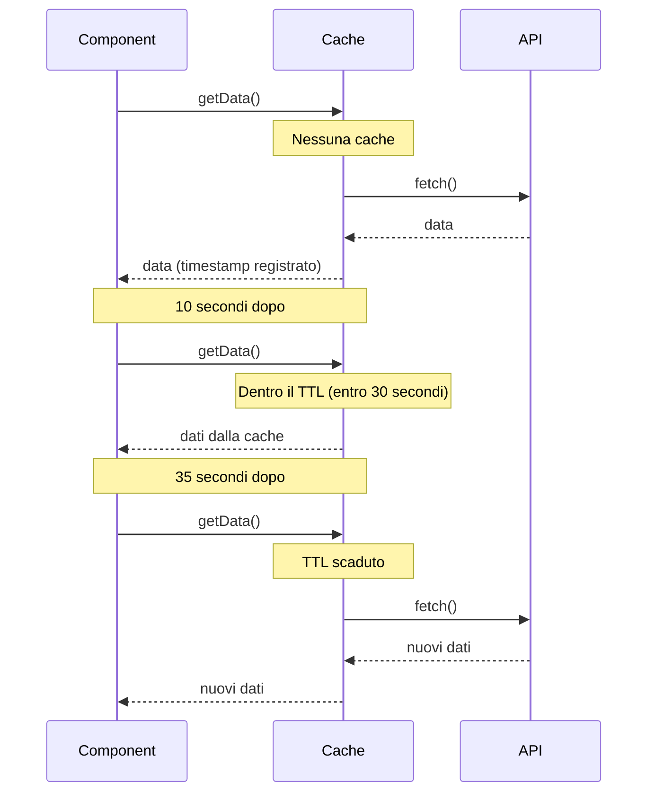
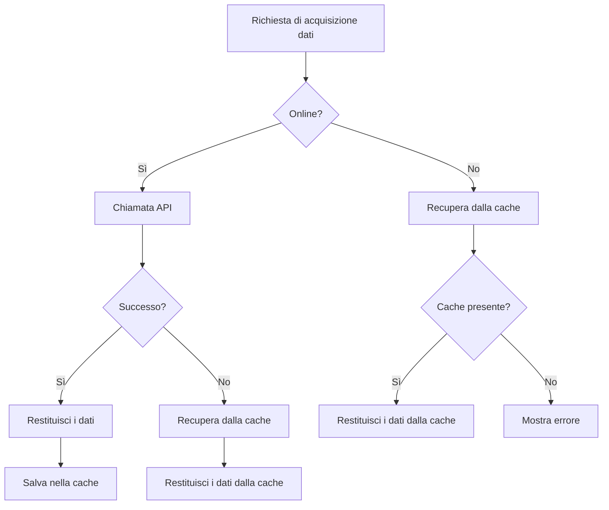

# Modelli di strategia di cache

La cache è una delle tecniche più importanti per l'ottimizzazione delle prestazioni e con RxJS è possibile implementare strategie di cache dichiarative e flessibili.

Questo articolo descrive modelli specifici di strategie di cache necessarie nella pratica, dalla cache di base con shareReplay alla cache con TTL, invalidazione della cache e cooperazione con lo storage locale.

## Cosa imparerete in questo articolo

- Caching di base con shareReplay
- Implementazione della cache con TTL (time-to-live)
- Aggiornamento manuale e invalidazione della cache
- Interfacciamento con lo storage locale
- Supporto offline e fallback della cache
- Monitoraggio e debug della cache

> [!TIP] Prerequisiti
> Questo articolo si basa su [Capitolo 2: Observable Cold/Hot](/it/guide/observables/cold-and-hot-observables.md) e [Capitolo 4: Operatori](/it/guide/operators/index.md). È particolarmente importante la comprensione di `shareReplay` e `share`.

## Cache di base (shareReplay)

### Problema: evitare di chiamare più volte la stessa API

Se diversi componenti hanno bisogno degli stessi dati API, vogliamo evitare richieste duplicate.

### Soluzione: cache con shareReplay

```typescript
import { Observable, of, shareReplay, catchError, tap } from 'rxjs';
interface User {
  id: number;
  name: string;
  email: string;
}

class UserService {
  private users$: Observable<User[]> | null = null;

  getUsers(): Observable<User[]> {
    // Ritorno dalla cache, se disponibile
    if (this.users$) {
      console.log('Ritornato dalla cache');
      return this.users$;
    }

    // Crea una nuova richiesta e la mette in cache
    console.log('Nuova richiesta eseguita');
    this.users$ = this.fetchUsersFromAPI().pipe(
      tap(() => console.log('Chiamata API completata')),
      shareReplay(1), // Memorizza nella cache l'ultimo valore
      catchError(err => {
        // Cancella la cache in caso di errore
        this.users$ = null;
        throw err;
      })
    );

    return this.users$;
  }

  clearCache(): void {
    this.users$ = null;
    console.log('Cache cancellata');
  }

  private fetchUsersFromAPI(): Observable<User[]> {
    return of([
      { id: 1, name: 'Mario Rossi', email: 'mario@example.com' },
      { id: 2, name: 'Laura Bianchi', email: 'laura@example.com' }
    ]);
  }
}

// Esempio di utilizzo
const userService = new UserService();

// Prima chiamata (esecuzione API)
userService.getUsers().subscribe(users => {
  console.log('Componente 1:', users);
});

// Seconda chiamata (dalla cache)
userService.getUsers().subscribe(users => {
  console.log('Componente 2:', users);
});

// Output:
// Nuova richiesta eseguita
// Chiamata API completata
// Componente 1: [...]
// Ritornato dalla cache
// Componente 2: [...]
```

> [!IMPORTANT] Note su shareReplay
> - **Memory leak**: mantiene viva la cache anche quando le sottoscrizioni vanno a 0
> - **Condivisione di tipo referenziale**: gli oggetti sono condivisi per riferimento, quindi le modifiche hanno effetto su tutti i sottoscrittori
> - **Gestione degli errori**: si raccomanda di cancellare la cache in caso di errore

### Opzioni di configurazione di shareReplay

```typescript
import { shareReplay } from 'rxjs';
// Utilizzo di base
source$.pipe(
  shareReplay(1) // Memorizza in cache l'ultimo valore
);

// Impostazioni avanzate
source$.pipe(
  shareReplay({
    bufferSize: 1,        // Numero di valori da mettere in cache
    refCount: true,       // Scarta la cache quando il numero di sottoscrittori raggiunge lo 0
    windowTime: 5000      // Distrugge la cache dopo 5 secondi (opzionale)
  })
);
```

> [!TIP] Come usare refCount
> - `refCount: true` - la cache viene distrutta quando il numero di sottoscrittori raggiunge lo 0 (efficiente in termini di memoria)
> - `refCount: false` (default) - cache persistente (buone prestazioni)
>
> Seleziona in base all'uso.

## Cache con TTL (time-to-live)

### Problema: voglio invalidare automaticamente le vecchie cache

Voglio distruggere automaticamente le cache dopo un certo periodo di tempo e recuperare nuovi dati.

### Soluzione: combinare timestamp e filter

```typescript
import { Observable, of, shareReplay, map, switchMap } from 'rxjs';
interface CachedData<T> {
  data: T;
  timestamp: number;
}

class TTLCacheService<T> {
  private cache$: Observable<CachedData<T>> | null = null;
  private ttl: number; // Time To Live (millisecondi)

  constructor(ttl: number = 60000) {
    this.ttl = ttl; // Default: 60 secondi
  }

  getData(fetchFn: () => Observable<T>): Observable<T> {
    if (this.cache$) {
      // Verifica se la cache è valida
      return this.cache$.pipe(
        switchMap(cached => {
          const age = Date.now() - cached.timestamp;
          if (age < this.ttl) {
            console.log(`Ritorno dalla cache (${(this.ttl - age) / 1000} secondi alla scadenza)`);
            return of(cached.data);
          } else {
            console.log('Cache scaduta - nuova acquisizione');
            this.cache$ = null;
            return this.getData(fetchFn);
          }
        })
      );
    }

    // Recuperare e mettere in cache i nuovi dati
    console.log('Nuova richiesta eseguita');
    this.cache$ = fetchFn().pipe(
      map(data => ({
        data,
        timestamp: Date.now()
      })),
      shareReplay(1)
    );

    return this.cache$.pipe(map(cached => cached.data));
  }

  clearCache(): void {
    this.cache$ = null;
    console.log('Cache cancellata');
  }

  getCacheAge(): number | null {
    // Ottenere il tempo trascorso nella cache (per il debug)
    if (!this.cache$) return null;

    let timestamp = 0;
    this.cache$.subscribe(cached => {
      timestamp = cached.timestamp;
    });

    return Date.now() - timestamp;
  }
}

// Esempio di utilizzo
interface Product {
  id: number;
  name: string;
  price: number;
}

const productCache = new TTLCacheService<Product[]>(30000); // 30 secondi TTL

function fetchProducts(): Observable<Product[]> {
  console.log('Chiamata API');
  return of([
    { id: 1, name: 'Prodotto A', price: 1000 },
    { id: 2, name: 'Prodotto B', price: 2000 }
  ]);
}

// 1a volta (nuova acquisizione)
productCache.getData(() => fetchProducts()).subscribe(products => {
  console.log('Acquisito:', products);
});

// 10 secondi dopo (dalla cache)
setTimeout(() => {
  productCache.getData(() => fetchProducts()).subscribe(products => {
    console.log('10 secondi dopo:', products);
    console.log('Tempo trascorso nella cache:', productCache.getCacheAge(), 'ms');
  });
}, 10000);

// 35 secondi dopo (scaduto, riacquisizione)
setTimeout(() => {
  productCache.getData(() => fetchProducts()).subscribe(products => {
    console.log('35 secondi dopo (scaduto):', products);
  });
}, 35000);
```

**Funzionamento della cache TTL:**



## Aggiornamento manuale e invalidazione della cache

### Problema: gli utenti vogliono aggiornare i dati in modo arbitrario

Quando si fa clic sul pulsante 'Aggiorna', voglio eliminare la cache e ottenere i dati più recenti.

### Soluzione: controllo con Subject e switch

```typescript
import { Observable, Subject, merge, of, switchMap, shareReplay, tap } from 'rxjs';
class RefreshableCacheService<T> {
  private refreshTrigger$ = new Subject<void>();
  private cache$: Observable<T>;

  constructor(fetchFn: () => Observable<T>) {
    this.cache$ = merge(
      this.refreshTrigger$.pipe(
        tap(() => console.log('Aggiornamento manuale'))
      ),
      // Per l'esecuzione iniziale
      of(undefined).pipe(tap(() => console.log('Caricamento iniziale')))
    ).pipe(
      switchMap(() => fetchFn()),
      tap(data => console.log('Acquisizione dati completata:', data)),
      shareReplay(1)
    );
  }

  getData(): Observable<T> {
    return this.cache$;
  }

  refresh(): void {
    this.refreshTrigger$.next();
  }
}

const refreshButton = document.createElement('button');
refreshButton.id = 'refresh-button';
refreshButton.textContent = 'Aggiorna notizie';
refreshButton.style.padding = '10px 20px';
refreshButton.style.margin = '10px';
refreshButton.style.fontSize = '16px';
refreshButton.style.fontWeight = 'bold';
refreshButton.style.color = '#fff';
refreshButton.style.backgroundColor = '#2196F3';
refreshButton.style.border = 'none';
refreshButton.style.borderRadius = '4px';
refreshButton.style.cursor = 'pointer';
document.body.appendChild(refreshButton);

const newsContainer = document.createElement('div');
newsContainer.id = 'news-container';
newsContainer.style.padding = '15px';
newsContainer.style.margin = '10px';
newsContainer.style.border = '2px solid #ccc';
newsContainer.style.borderRadius = '8px';
newsContainer.style.minHeight = '200px';
newsContainer.style.backgroundColor = '#f9f9f9';
document.body.appendChild(newsContainer);

const newsCache = new RefreshableCacheService<string[]>(() =>
  of(['Notizia 1', 'Notizia 2', 'Notizia 3'])
);

// Sottoscrivere i dati
newsCache.getData().subscribe(news => {
  console.log('Elenco notizie:', news);
  displayNews(news, newsContainer);
});

// Cliccando sul pulsante di aggiornamento
refreshButton.addEventListener('click', () => {
  console.log('L\'utente ha cliccato su refresh');
  refreshButton.textContent = 'Aggiornamento...';
  refreshButton.disabled = true;
  refreshButton.style.backgroundColor = '#999';
  newsCache.refresh();
  setTimeout(() => {
    refreshButton.textContent = 'Aggiorna notizie';
    refreshButton.disabled = false;
    refreshButton.style.backgroundColor = '#2196F3';
  }, 1000);
});

function displayNews(news: string[], container: HTMLElement): void {
  container.innerHTML = news
    .map(item => `<div style="padding: 10px; margin: 5px 0; border-bottom: 1px solid #ddd; font-size: 14px;">${item}</div>`)
    .join('');

  if (news.length === 0) {
    container.innerHTML = '<div style="padding: 20px; text-align: center; color: #999;">Nessuna notizia</div>';
  }
}
```

### Invalidazione condizionale della cache

```typescript
import { BehaviorSubject, Observable, switchMap, shareReplay, distinctUntilChanged, of } from 'rxjs';
interface CacheOptions {
  forceRefresh: boolean;
  userId?: number;
}

class ConditionalCacheService {
  private options$ = new BehaviorSubject<CacheOptions>({
    forceRefresh: false
  });

  data$ = this.options$.pipe(
    distinctUntilChanged((prev, curr) => {
      // Forzare l'aggiornamento o la riacquisizione se l'ID utente cambia
      return !curr.forceRefresh && prev.userId === curr.userId;
    }),
    switchMap(options => {
      console.log('Recupero dati:', options);
      return this.fetchData(options.userId);
    }),
    shareReplay(1)
  );

  getData(userId?: number): Observable<any> {
    this.options$.next({
      forceRefresh: false,
      userId
    });
    return this.data$;
  }

  refresh(userId?: number): void {
    this.options$.next({
      forceRefresh: true,
      userId
    });
  }

  private fetchData(userId?: number): Observable<any> {
    console.log('Chiamata API - userId:', userId);
    return of({ userId, data: 'sample data' });
  }
}

// Esempio di utilizzo
const conditionalCache = new ConditionalCacheService();

// Ottenere i dati dell'utente 1
conditionalCache.getData(1).subscribe(data => {
  console.log('Dati utente 1:', data);
});

// Dalla cache, poiché si tratta dello stesso utente
conditionalCache.getData(1).subscribe(data => {
  console.log('Dati utente 1 (cache):', data);
});

// Un altro utente, quindi riacquisire
conditionalCache.getData(2).subscribe(data => {
  console.log('Dati utente 2:', data);
});

// Aggiornamento manuale
conditionalCache.refresh(1);
```

## Lavorare con lo storage locale

### Problema: voglio mantenere la cache dopo il ricaricamento della pagina

Voglio implementare una cache persistente usando lo storage locale del browser.

### Soluzione: combinare con lo storage locale

```typescript
import { Observable, of, defer, tap, catchError } from 'rxjs';
interface StorageCacheOptions {
  key: string;
  ttl?: number; // millisecondi
}

interface CachedItem<T> {
  data: T;
  timestamp: number;
}

class LocalStorageCacheService {
  getOrFetch<T>(
    options: StorageCacheOptions,
    fetchFn: () => Observable<T>
  ): Observable<T> {
    return defer(() => {
      // Tentativo di recupero dallo storage locale
      const cached = this.getFromStorage<T>(options.key, options.ttl);

      if (cached) {
        console.log('Recupera dallo storage locale:', options.key);
        return of(cached);
      }

      // Nessuna cache, nuova acquisizione
      console.log('Nuova acquisizione:', options.key);
      return fetchFn().pipe(
        tap(data => {
          this.saveToStorage(options.key, data);
        }),
        catchError(err => {
          console.error('Errore di acquisizione:', err);
          throw err;
        })
      );
    });
  }

  private getFromStorage<T>(key: string, ttl?: number): T | null {
    try {
      const item = localStorage.getItem(key);
      if (!item) return null;

      const cached: CachedItem<T> = JSON.parse(item);

      // Controllo del TTL
      if (ttl) {
        const age = Date.now() - cached.timestamp;
        if (age > ttl) {
          console.log('Cache scaduta:', key);
          localStorage.removeItem(key);
          return null;
        }
      }

      return cached.data;
    } catch (error) {
      console.error('Errore di lettura della memoria locale:', error);
      return null;
    }
  }

  private saveToStorage<T>(key: string, data: T): void {
    try {
      const item: CachedItem<T> = {
        data,
        timestamp: Date.now()
      };
      localStorage.setItem(key, JSON.stringify(item));
      console.log('Salva nella memoria locale:', key);
    } catch (error) {
      console.error('Errore di salvataggio nella memoria locale:', error);
    }
  }

  clearCache(key?: string): void {
    if (key) {
      localStorage.removeItem(key);
      console.log('Cancella cache:', key);
    } else {
      localStorage.clear();
      console.log('Cancella tutta la cache');
    }
  }

  getCacheSize(): number {
    let size = 0;
    for (const key in localStorage) {
      if (localStorage.hasOwnProperty(key)) {
        size += localStorage[key].length;
      }
    }
    return size;
  }
}

// Esempio di utilizzo
interface Settings {
  theme: string;
  language: string;
  notifications: boolean;
}

const storageCache = new LocalStorageCacheService();

function fetchSettings(): Observable<Settings> {
  console.log('Recupero delle impostazioni dall\'API');
  return of({
    theme: 'dark',
    language: 'it',
    notifications: true
  });
}

// Recuperare la configurazione (storage locale o API)
storageCache.getOrFetch(
  { key: 'user-settings', ttl: 3600000 }, // TTL di 1 ora
  fetchSettings
).subscribe(settings => {
  console.log('Impostazioni:', settings);
  applySettings(settings);
});

// Gli stessi dati vengono recuperati dopo il ricaricamento della pagina (se entro il TTL)
// storageCache.getOrFetch(...) // dallo storage locale

function applySettings(settings: Settings): void {
  document.body.className = `theme-${settings.theme}`;
  console.log('Applica le impostazioni:', settings);
}
```

### Gestione delle dimensioni dello storage

```typescript
class ManagedStorageCacheService extends LocalStorageCacheService {
  private maxSize = 5 * 1024 * 1024; // 5MB

  saveWithLimit<T>(key: string, data: T): boolean {
    const item: CachedItem<T> = {
      data,
      timestamp: Date.now()
    };

    const itemString = JSON.stringify(item);
    const itemSize = new Blob([itemString]).size;

    // Se la dimensione attuale + la dimensione del nuovo elemento supera il limite
    if (this.getCacheSize() + itemSize > this.maxSize) {
      console.log('Spazio di archiviazione limitato - eliminare il vecchio elemento');
      this.removeOldestItem();
    }

    try {
      localStorage.setItem(key, itemString);
      return true;
    } catch (error) {
      console.error('Errore di salvataggio:', error);
      return false;
    }
  }

  private removeOldestItem(): void {
    let oldestKey: string | null = null;
    let oldestTimestamp = Date.now();

    for (const key in localStorage) {
      if (localStorage.hasOwnProperty(key)) {
        try {
          const item = JSON.parse(localStorage[key]);
          if (item.timestamp < oldestTimestamp) {
            oldestTimestamp = item.timestamp;
            oldestKey = key;
          }
        } catch (error) {
          // Ignora gli errori di parsing
        }
      }
    }

    if (oldestKey) {
      localStorage.removeItem(oldestKey);
      console.log('Elimina l\'elemento più vecchio:', oldestKey);
    }
  }
}
```

## Supporto offline

### Problema: voglio visualizzare i dati nella cache quando sono offline

Voglio visualizzare i dati nella cache per migliorare l'UX anche quando non c'è una connessione di rete.

### Soluzione: strategia cache-first

```typescript
import { Observable, of, throwError, fromEvent, merge, map, startWith, distinctUntilChanged, switchMap, catchError, tap } from 'rxjs';
class OfflineFirstCacheService {
  private onlineStatus$ = merge(
    fromEvent(window, 'online').pipe(map(() => true)),
    fromEvent(window, 'offline').pipe(map(() => false))
  ).pipe(
    startWith(navigator.onLine),
    distinctUntilChanged(),
    tap(online => console.log('Stato online:', online))
  );

  getData<T>(
    cacheKey: string,
    fetchFn: () => Observable<T>
  ): Observable<T> {
    return this.onlineStatus$.pipe(
      switchMap(online => {
        if (online) {
          // Online: recuperato dall'API e salvato in cache
          console.log('Online - recuperato da API');
          return fetchFn().pipe(
            tap(data => {
              this.saveToCache(cacheKey, data);
            }),
            catchError(err => {
              console.error('API fetch error - fallback to cache');
              return this.getFromCache<T>(cacheKey);
            })
          );
        } else {
          // Offline: recupero dalla cache
          console.log('Offline - recuperato dalla cache');
          return this.getFromCache<T>(cacheKey);
        }
      })
    );
  }

  private saveToCache<T>(key: string, data: T): void {
    try {
      localStorage.setItem(key, JSON.stringify(data));
      console.log('Salvataggio della cache:', key);
    } catch (error) {
      console.error('Errore nel salvataggio della cache:', error);
    }
  }

  private getFromCache<T>(key: string): Observable<T> {
    try {
      const cached = localStorage.getItem(key);
      if (cached) {
        const data = JSON.parse(cached);
        console.log('Recupera dalla cache:', key);
        return of(data);
      }
    } catch (error) {
      console.error('Errore di caricamento della cache:', error);
    }

    return throwError(() => new Error('Cache not found'));
  }
}

// Traditional approach (commented for reference)
// const container = document.querySelector('#articles');
// const message = document.querySelector('#offline-message');

// Self-contained: creates articles display dynamically
const articlesContainer = document.createElement('div');
articlesContainer.id = 'articles';
articlesContainer.style.padding = '15px';
articlesContainer.style.margin = '10px';
articlesContainer.style.border = '2px solid #ccc';
articlesContainer.style.borderRadius = '8px';
articlesContainer.style.backgroundColor = '#f9f9f9';
document.body.appendChild(articlesContainer);

const offlineMessage = document.createElement('div');
offlineMessage.id = 'offline-message';
offlineMessage.style.padding = '15px';
offlineMessage.style.margin = '10px';
offlineMessage.style.backgroundColor = '#f8d7da';
offlineMessage.style.color = '#721c24';
offlineMessage.style.border = '1px solid #f5c6cb';
offlineMessage.style.borderRadius = '4px';
offlineMessage.style.display = 'none';
offlineMessage.style.textAlign = 'center';
offlineMessage.style.fontWeight = 'bold';
document.body.appendChild(offlineMessage);

// Esempio di utilizzo
const offlineCache = new OfflineFirstCacheService();

function fetchArticles(): Observable<any[]> {
  return of([
    { id: 1, title: 'Articolo 1', content: 'Contenuto 1' },
    { id: 2, title: 'Articolo 2', content: 'Contenuto 2' }
  ]);
}

offlineCache.getData('articles', fetchArticles).subscribe({
  next: articles => {
    console.log('Articoli:', articles);
    displayArticles(articles, articlesContainer);
    offlineMessage.style.display = 'none';
  },
  error: err => {
    console.error('Errore nel recupero dei dati:', err);
    showOfflineMessage(offlineMessage);
  }
});

function displayArticles(articles: any[], container: HTMLElement): void {
  container.innerHTML = articles
    .map(a => `
      <article style="padding: 15px; margin: 10px 0; border-bottom: 2px solid #ddd;">
        <h2 style="margin: 0 0 10px 0; font-size: 18px; color: #333;">${a.title}</h2>
        <p style="margin: 0; font-size: 14px; color: #666;">${a.content}</p>
      </article>
    `)
    .join('');

  if (articles.length === 0) {
    container.innerHTML = '<div style="padding: 20px; text-align: center; color: #999;">Nessun articolo</div>';
  }
}

function showOfflineMessage(message: HTMLElement): void {
  message.textContent = 'Sei offline. Nessun dato nella cache.';
  message.style.display = 'block';
}
```

**Strategia per il supporto offline:**



## Monitoraggio e debug della cache

### Visualizzazione dello stato della cache

```typescript
import { BehaviorSubject, Observable, map } from 'rxjs';
interface CacheEntry {
  key: string;
  size: number;
  timestamp: number;
  hits: number;
}

interface CacheStats {
  entries: CacheEntry[];
  totalSize: number;
  hitRate: number;
}

class ObservableCacheService {
  private cacheEntries$ = new BehaviorSubject<Map<string, CacheEntry>>(new Map());
  private totalRequests = 0;
  private cacheHits = 0;

  stats$: Observable<CacheStats> = this.cacheEntries$.pipe(
    map(entries => {
      const entriesArray = Array.from(entries.values());
      const totalSize = entriesArray.reduce((sum, entry) => sum + entry.size, 0);
      const hitRate = this.totalRequests > 0
        ? (this.cacheHits / this.totalRequests) * 100
        : 0;

      return {
        entries: entriesArray,
        totalSize,
        hitRate
      };
    })
  );

  getData<T>(key: string, fetchFn: () => Observable<T>): Observable<T> {
    this.totalRequests++;

    const entries = this.cacheEntries$.value;
    const entry = entries.get(key);

    if (entry) {
      // Cache hit
      this.cacheHits++;
      entry.hits++;
      this.cacheEntries$.next(new Map(entries));
      console.log(`Cache hit: ${key} (${entry.hits} volte)`);
      // Logica di acquisizione dei dati effettivi
    } else {
      // Cache miss
      console.log(`Cache miss: ${key}`);
      // Nuova acquisizione e registrazione della cache
      const newEntry: CacheEntry = {
        key,
        size: 0, // Calcola la dimensione effettiva dei dati
        timestamp: Date.now(),
        hits: 1
      };
      entries.set(key, newEntry);
      this.cacheEntries$.next(new Map(entries));
    }

    return fetchFn();
  }

  clearStats(): void {
    this.totalRequests = 0;
    this.cacheHits = 0;
    this.cacheEntries$.next(new Map());
  }
}

// Traditional approach (commented for reference)
// const statsElement = document.querySelector('#cache-stats');

// Self-contained: creates cache stats element dynamically
const cacheStatsElement = document.createElement('div');
cacheStatsElement.id = 'cache-stats';
cacheStatsElement.style.padding = '20px';
cacheStatsElement.style.margin = '10px';
cacheStatsElement.style.border = '2px solid #ccc';
cacheStatsElement.style.borderRadius = '8px';
cacheStatsElement.style.backgroundColor = '#f9f9f9';
cacheStatsElement.style.fontFamily = 'monospace';
document.body.appendChild(cacheStatsElement);

// Esempio di utilizzo
const observableCache = new ObservableCacheService();

// Monitoraggio delle statistiche della cache
observableCache.stats$.subscribe(stats => {
  console.log('=== Statistiche Cache ===');
  console.log(`Numero di entry: ${stats.entries.length}`);
  console.log(`Dimensione totale: ${(stats.totalSize / 1024).toFixed(2)} KB`);
  console.log(`Hit rate: ${stats.hitRate.toFixed(1)}%`);

  // Aggiornamento UI
  updateCacheStatsUI(stats, cacheStatsElement);
});

function updateCacheStatsUI(stats: CacheStats, element: HTMLElement): void {
  element.innerHTML = `
    <div style="margin-bottom: 15px;">
      <h3 style="margin: 0 0 10px 0; color: #333;">Statistiche Cache</h3>
      <div style="padding: 10px; background-color: #fff; border-radius: 4px; margin: 5px 0;">
        <strong>Numero di entry:</strong> ${stats.entries.length}
      </div>
      <div style="padding: 10px; background-color: #fff; border-radius: 4px; margin: 5px 0;">
        <strong>Dimensione totale:</strong> ${(stats.totalSize / 1024).toFixed(2)} KB
      </div>
      <div style="padding: 10px; background-color: #fff; border-radius: 4px; margin: 5px 0;">
        <strong>Hit rate:</strong> ${stats.hitRate.toFixed(1)}%
      </div>
    </div>
    <div>
      <h4 style="margin: 10px 0; color: #666;">Elenco entry:</h4>
      ${stats.entries.map(e => `
        <div style="display: flex; justify-content: space-between; padding: 8px; margin: 5px 0; background-color: #fff; border-radius: 4px; border-left: 3px solid #2196F3;">
          <span style="font-weight: bold;">${e.key}</span>
          <span style="color: #2196F3;">${e.hits} hits</span>
        </div>
      `).join('')}
    </div>
  `;

  if (stats.entries.length === 0) {
    element.innerHTML = '<div style="padding: 20px; text-align: center; color: #999;">Nessuna entry nella cache</div>';
  }
}
```

## Riepilogo

La padronanza dei modelli di strategia di caching può migliorare significativamente le prestazioni e l'esperienza dell'utente.

> [!IMPORTANT] Punti chiave
> - **shareReplay**: ideale per la cache di base della memoria
> - **TTL**: invalidazione automatica dei vecchi dati
> - **Aggiornamento manuale**: aggiornamento avviato dall'utente
> - **Storage locale**: cache persistente
> - **Supporto offline**: strategia cache-first
> - **Monitoraggio**: visibilità di hit rate e dimensioni

> [!TIP] Best practice
> - **TTL appropriato**: impostare il tempo di scadenza in base alla natura dei dati
> - **Clear on error**: distruggere la cache in caso di errore
> - **Gestione delle dimensioni**: impostare i limiti di capacità di memorizzazione
> - **Usare refCount**: prevenire le perdite di memoria
> - **Chiave della cache**: utilizzare una chiave univoca e di facile comprensione

## Prossimi passi

Una volta acquisita la padronanza dello schema della strategia della cache, si può passare agli schemi seguenti.

- [Elaborazione dei dati in tempo reale](./real-time-data.md) - Cache dei dati in tempo reale
- [Chiamate API](./api-calls.md) - Cache delle risposte API
- [Elaborazione eventi UI](./ui-events.md) - Memorizza nella cache i dati degli eventi
- Pratica di gestione degli errori (in preparazione) - Gestione degli errori della cache

## Sezioni correlate

- [Capitolo 2: Observable Cold/Hot](/it/guide/observables/cold-and-hot-observables.md) - Dettagli su shareReplay
- [Capitolo 4: Operatori](/it/guide/operators/multicasting/shareReplay.md) - Come usare shareReplay
- [Capitolo 10: Anti-pattern](/it/guide/anti-patterns/common-mistakes.md) - Uso improprio di shareReplay

## Risorse di riferimento

- [RxJS official: shareReplay](https://rxjs.dev/api/operators/shareReplay) - Altro su shareReplay
- [MDN: Web Storage API](https://developer.mozilla.org/en-US/docs/Web/API/Web_Storage_API) - Come usare lo storage locale
- [Learn RxJS: Caching](https://www.learnrxjs.io/) - Esempi pratici di modelli di caching
