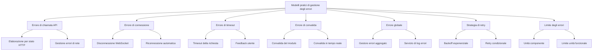

# Modelli pratici di gestione degli errori

Nelle applicazioni RxJS, una corretta gestione degli errori è alla base di un sistema affidabile. Questo articolo presenta sette modelli di gestione degli errori che possono essere utilizzati immediatamente nella pratica.

## Perché la gestione degli errori è importante?

In uno stream Observable, se si verifica un errore, lo stream termina e non fluisce più alcun valore. Se non si comprende questa caratteristica e si trascura la gestione degli errori, l'applicazione può arrestarsi inaspettatamente o non fornire un feedback adeguato all'utente.

**Tre obiettivi della gestione degli errori**:
1. **Assicurare la continuità** - consentire allo stream di continuare dopo un errore
2. **Migliorare l'esperienza dell'utente** - fornire messaggi di errore e mezzi di recupero adeguati
3. **Osservabilità del sistema** - rilevamento precoce dei problemi attraverso la registrazione e il monitoraggio degli errori

Questo articolo spiega come applicare le conoscenze di base apprese nel Capitolo 6, "[Gestione degli errori](/it/guide/error-handling/strategies.md)", a scenari pratici.

## Struttura di questo articolo



## Gestione degli errori nelle chiamate API

Le chiamate API sono l'area più soggetta a errori; è necessario gestire diversi scenari di errore, tra cui codici di stato HTTP, errori di rete e timeout.

### Gestione degli errori per stato HTTP

A seconda del codice di stato HTTP, viene eseguita la gestione degli errori appropriata.

```typescript
import { Observable, throwError, catchError, retry, tap } from 'rxjs';
import { ajax, AjaxError } from 'rxjs/ajax';

/**
 * Informazioni dettagliate sull'errore HTTP
 */
interface HttpErrorInfo {
  status: number;
  message: string;
  retryable: boolean;
  userMessage: string;
}

/**
 * Servizio di classificazione degli errori HTTP
 */
class HttpErrorClassifier {
  /**
   * Genera informazioni sull'errore dal codice di stato
   */
  classify(error: AjaxError): HttpErrorInfo {
    const status = error.status;

    // Errore client 4xx
    if (status >= 400 && status < 500) {
      return this.handleClientError(status, error);
    }

    // Errore server 5xx
    if (status >= 500) {
      return this.handleServerError(status, error);
    }

    // Errore di rete (status = 0)
    if (status === 0) {
      return {
        status: 0,
        message: 'Network error',
        retryable: true,
        userMessage: 'Impossibile connettersi alla rete. Controllare la connessione.'
      };
    }

    // Altri errori
    return {
      status,
      message: 'Unknown error',
      retryable: false,
      userMessage: 'Si è verificato un errore imprevisto.'
    };
  }

  private handleClientError(status: number, error: AjaxError): HttpErrorInfo {
    switch (status) {
      case 400:
        return {
          status,
          message: 'Bad Request',
          retryable: false,
          userMessage: 'Si è verificato un errore nei dati inseriti.'
        };

      case 401:
        return {
          status,
          message: 'Unauthorized',
          retryable: false,
          userMessage: 'È richiesta l\'autenticazione. Effettuare il login.'
        };

      case 403:
        return {
          status,
          message: 'Forbidden',
          retryable: false,
          userMessage: 'Non si dispone dei permessi per eseguire questa operazione.'
        };

      case 404:
        return {
          status,
          message: 'Not Found',
          retryable: false,
          userMessage: 'Dati non trovati.'
        };

      case 422:
        return {
          status,
          message: 'Unprocessable Entity',
          retryable: false,
          userMessage: 'Impossibile elaborare i dati inseriti.'
        };

      case 429:
        return {
          status,
          message: 'Too Many Requests',
          retryable: true, // Retry possibile (richiede tempo di attesa)
          userMessage: 'Troppe richieste. Attendere un momento e riprovare.'
        };

      default:
        return {
          status,
          message: `Client Error ${status}`,
          retryable: false,
          userMessage: 'Impossibile elaborare la richiesta.'
        };
    }
  }

  private handleServerError(status: number, error: AjaxError): HttpErrorInfo {
    switch (status) {
      case 500:
        return {
          status,
          message: 'Internal Server Error',
          retryable: true,
          userMessage: 'Si è verificato un errore del server. Attendere un momento e riprovare.'
        };

      case 502:
      case 503:
      case 504:
        return {
          status,
          message: 'Service Unavailable',
          retryable: true,
          userMessage: 'Il server è temporaneamente non disponibile. Attendere un momento e riprovare.'
        };

      default:
        return {
          status,
          message: `Server Error ${status}`,
          retryable: true,
          userMessage: 'Si è verificato un errore del server.'
        };
    }
  }
}

/**
 * Servizio client HTTP
 */
class HttpClientService {
  private errorClassifier = new HttpErrorClassifier();

  /**
   * Richiesta GET (con gestione degli errori)
   */
  get<T>(url: string): Observable<T> {
    return ajax.get<T>(url).pipe(
      tap(() => console.log(`GET ${url} - Success`)),
      catchError(error => this.handleError(error, url))
    );
  }

  /**
   * Richiesta POST (con gestione degli errori)
   */
  post<T>(url: string, body: any): Observable<T> {
    return ajax.post<T>(url, body).pipe(
      tap(() => console.log(`POST ${url} - Success`)),
      catchError(error => this.handleError(error, url))
    );
  }

  /**
   * Gestore errori unificato
   */
  private handleError(error: any, url: string): Observable<never> {
    console.error(`HTTP Error at ${url}:`, error);

    if (error instanceof AjaxError) {
      const errorInfo = this.errorClassifier.classify(error);

      // Registra le informazioni sull'errore
      this.logError(errorInfo, url);

      // Lancia un errore comprensibile all'utente
      return throwError(() => errorInfo);
    }

    // Errori diversi da AjaxError (es. errori di programmazione)
    return throwError(() => ({
      status: -1,
      message: error.message || 'Unknown error',
      retryable: false,
      userMessage: 'Si è verificato un errore imprevisto.'
    }));
  }

  private logError(errorInfo: HttpErrorInfo, url: string): void {
    // Invia al servizio di log errori (vedi sotto)
    console.error('HTTP Error:', {
      url,
      status: errorInfo.status,
      message: errorInfo.message,
      timestamp: new Date().toISOString()
    });
  }
}
```

> [!TIP] Criteri di classificazione degli errori HTTP
> - **4xx Errori client**: generalmente non ripetibili (richiede correzione dell'input)
> - **5xx Errori server**: ripetibili (problema temporaneo lato server)
> - **429 Too Many Requests**: ripetibile ma richiede tempo di attesa
> - **0 (Errore di rete)**: ripetibile (problema di connessione)

### Esempio di utilizzo: gestione degli errori per stato

```typescript
import { Component, OnInit } from '@angular/core';
import { Subject, takeUntil } from 'rxjs';

interface User {
  id: number;
  name: string;
  email: string;
}

class UserDetailManager {
  private destroy$ = new Subject<void>();
  private httpClient = new HttpClientService();

  user: User | null = null;
  loading = false;
  errorMessage = '';
  canRetry = false;

  // Callback per aggiornamenti UI (opzionale)
  onStateChange?: (state: { user: User | null; loading: boolean; errorMessage: string; canRetry: boolean }) => void;

  init(): void {
    this.loadUser();
  }

  loadUser(): void {
    this.loading = true;
    this.errorMessage = '';
    this.canRetry = false;
    this.updateUI();

    this.httpClient.get<User>('/api/users/1')
      .pipe(takeUntil(this.destroy$))
      .subscribe({
        next: user => {
          this.user = user;
          this.loading = false;
          this.updateUI();
        },
        error: (errorInfo: HttpErrorInfo) => {
          this.loading = false;
          this.errorMessage = errorInfo.userMessage;
          this.canRetry = errorInfo.retryable;
          this.updateUI();

          // Reindirizza alla schermata di login in caso di errore di autenticazione
          if (errorInfo.status === 401) {
            setTimeout(() => {
              window.location.href = '/login';
            }, 2000);
          }
        }
      });
  }

  private updateUI(): void {
    if (this.onStateChange) {
      this.onStateChange({
        user: this.user,
        loading: this.loading,
        errorMessage: this.errorMessage,
        canRetry: this.canRetry
      });
    }
  }

  destroy(): void {
    this.destroy$.next();
    this.destroy$.complete();
  }
}

// Esempio di utilizzo
const userDetail = new UserDetailManager();
userDetail.onStateChange = (state) => {
  console.log('State updated:', state);
  // Scrivi qui il processo di aggiornamento UI
};
userDetail.init();
```

> [!IMPORTANT] Considerazioni sull'esperienza utente
> - I messaggi di errore indicano **cosa l'utente deve fare dopo**, non dettagli tecnici
> - Gli errori ripetibili mostrano un **pulsante Riprova**
> - Gli errori di autenticazione **reindirizzano automaticamente alla schermata di login**

## Gestione degli errori di rete

Poiché gli errori di rete sono spesso problemi temporanei, implementiamo una strategia di retry appropriata.

```typescript
import { Observable, timer, throwError, retryWhen, mergeMap, tap } from 'rxjs';
/**
 * Configurazione retry dedicata agli errori di rete
 */
interface NetworkRetryConfig {
  maxRetries: number;
  initialDelay: number;
  maxDelay: number;
  backoffMultiplier: number;
}

/**
 * Operatore di retry di rete
 */
function retryWithBackoff(config: NetworkRetryConfig) {
  const {
    maxRetries = 3,
    initialDelay = 1000,
    maxDelay = 16000,
    backoffMultiplier = 2
  } = config;

  return <T>(source: Observable<T>) => source.pipe(
    retryWhen(errors => errors.pipe(
      mergeMap((error, index) => {
        const retryAttempt = index + 1;

        // Lancia un errore se si supera il numero massimo di tentativi
        if (retryAttempt > maxRetries) {
          return throwError(() => ({
            ...error,
            message: `Errore di rete: ${maxRetries} tentativi falliti`,
            userMessage: 'Impossibile connettersi alla rete. Attendere un momento e riprovare.'
          }));
        }

        // Calcola il tempo di ritardo con backoff esponenziale
        const delay = Math.min(
          initialDelay * Math.pow(backoffMultiplier, index),
          maxDelay
        );

        console.log(
          `Retry ${retryAttempt}/${maxRetries} - riprova dopo ${delay}ms...`
        );

        // Riprova dopo il ritardo
        return timer(delay).pipe(
          tap(() => console.log(`Retry ${retryAttempt} in esecuzione...`))
        );
      })
    ))
  );
}

/**
 * Client HTTP con supporto di rete
 */
class NetworkAwareHttpClient {
  private httpClient = new HttpClientService();
  private errorClassifier = new HttpErrorClassifier();

  /**
   * Richiesta GET con supporto errori di rete
   */
  get<T>(url: string, retryConfig?: Partial<NetworkRetryConfig>): Observable<T> {
    const defaultConfig: NetworkRetryConfig = {
      maxRetries: 3,
      initialDelay: 1000,
      maxDelay: 16000,
      backoffMultiplier: 2
    };

    const config = { ...defaultConfig, ...retryConfig };

    return this.httpClient.get<T>(url).pipe(
      catchError(error => {
        // Riprova solo in caso di errore di rete (status = 0)
        if (error.status === 0) {
          return throwError(() => error);
        }
        // Altri errori falliscono immediatamente senza retry
        return throwError(() => error);
      }),
      retryWithBackoff(config)
    );
  }
}
```

### Esempio di utilizzo: supporto offline

```typescript
import { fromEvent, merge, map, startWith, switchMap, of } from 'rxjs';

/**
 * Gestione dello stato online/offline
 */
class OnlineStatusService {
  /**
   * Observable dello stato online
   */
  online$ = merge(
    fromEvent(window, 'online').pipe(map(() => true)),
    fromEvent(window, 'offline').pipe(map(() => false))
  ).pipe(
    startWith(navigator.onLine)
  );
}

/**
 * Visualizzatore dati con supporto offline
 */
class DataViewerManager {
  private destroy$ = new Subject<void>();
  private networkClient = new NetworkAwareHttpClient();
  private onlineStatus = new OnlineStatusService();

  isOnline$ = this.onlineStatus.online$;
  data: any = null;
  loading = false;
  errorMessage = '';

  // Callback per aggiornamenti UI (opzionale)
  onStateChange?: (state: { isOnline: boolean; data: any; loading: boolean; errorMessage: string }) => void;

  init(): void {
    // Carica automaticamente i dati quando si è online
    this.isOnline$.pipe(
      switchMap(isOnline => {
        this.updateUI(isOnline);
        if (isOnline) {
          return this.loadData();
        }
        return of(null);
      }),
      takeUntil(this.destroy$)
    ).subscribe({
      next: data => {
        if (data) {
          this.data = data;
          this.loading = false;
          this.errorMessage = '';
        }
      },
      error: error => {
        this.loading = false;
        this.errorMessage = error.userMessage;
      }
    });
  }

  private loadData(): Observable<any> {
    this.loading = true;

    return this.networkClient.get('/api/data', {
      maxRetries: 5,
      initialDelay: 2000
    });
  }

  private updateUI(isOnline: boolean): void {
    if (this.onStateChange) {
      this.onStateChange({
        isOnline,
        data: this.data,
        loading: this.loading,
        errorMessage: this.errorMessage
      });
    }
  }

  destroy(): void {
    this.destroy$.next();
    this.destroy$.complete();
  }
}

// Esempio di utilizzo
const dataViewer = new DataViewerManager();
dataViewer.onStateChange = (state) => {
  if (!state.isOnline) {
    console.log('Sei offline. Controlla la connessione a Internet.');
  }
  console.log('State updated:', state);
};
dataViewer.init();
```

> [!TIP] Best practice per il supporto offline
> - **Monitora lo stato online** e riprova automaticamente quando la connessione viene ripristinata
> - **Rendi esplicito lo stato offline** agli utenti per ridurre la frustrazione
> - Combina con **cache locale** per fornire funzionalità parziali anche offline

## Gestione degli errori di timeout

Solleva un errore di timeout se non c'è risposta per un periodo prolungato e gestiscilo appropriatamente.

```typescript
import { timeout, catchError, throwError, Observable } from 'rxjs';

/**
 * Configurazione timeout
 */
interface TimeoutConfig {
  duration: number;
  message: string;
}

/**
 * Client HTTP con supporto timeout
 */
class TimeoutAwareHttpClient {
  private networkClient = new NetworkAwareHttpClient();

  /**
   * Richiesta GET con timeout
   */
  get<T>(
    url: string,
    timeoutConfig: TimeoutConfig = {
      duration: 30000,
      message: 'Richiesta scaduta'
    }
  ): Observable<T> {
    return this.networkClient.get<T>(url).pipe(
      timeout({
        each: timeoutConfig.duration,
        with: () => throwError(() => ({
          status: -2, // Stato personalizzato che indica il timeout
          message: 'Timeout',
          retryable: true,
          userMessage: timeoutConfig.message
        }))
      }),
      catchError(error => {
        if (error.status === -2) {
          console.error(`Timeout: ${url} (${timeoutConfig.duration}ms)`);
        }
        return throwError(() => error);
      })
    );
  }

  /**
   * Impostazioni di timeout appropriate per ogni tipo di operazione
   */
  getWithOperationType<T>(
    url: string,
    operationType: 'fast' | 'normal' | 'slow'
  ): Observable<T> {
    const timeoutConfigs = {
      fast: {
        duration: 5000,
        message: 'Richiesta scaduta (5 s)'
      },
      normal: {
        duration: 30000,
        message: 'Richiesta scaduta (30 s)'
      },
      slow: {
        duration: 60000,
        message: 'Richiesta scaduta (60 s)'
      }
    };

    return this.get<T>(url, timeoutConfigs[operationType]);
  }
}
```

### Caso d'uso: timeout con feedback utente

```typescript
import { Subject, interval, takeUntil, map, startWith } from 'rxjs';

/**
 * Manager per gestire operazioni che richiedono tempo
 */
class SlowOperationManager {
  private destroy$ = new Subject<void>();
  private timeoutClient = new TimeoutAwareHttpClient();

  loading = false;
  elapsedTime = 0;
  errorMessage = '';
  result: any = null;

  // Callback per aggiornamenti UI (opzionale)
  onStateChange?: (state: {
    loading: boolean;
    elapsedTime: number;
    errorMessage: string;
    result: any;
  }) => void;

  startOperation(): void {
    this.loading = true;
    this.errorMessage = '';
    this.result = null;
    this.updateUI();

    // Contatore tempo trascorso
    const timer$ = interval(1000).pipe(
      map(count => count + 1),
      startWith(0),
      takeUntil(this.destroy$)
    );

    timer$.subscribe(elapsed => {
      this.elapsedTime = elapsed;
      this.updateUI();
    });

    // Operazione che richiede tempo (timeout 60 s)
    this.timeoutClient.getWithOperationType('/api/slow-operation', 'slow')
      .pipe(takeUntil(this.destroy$))
      .subscribe({
        next: result => {
          this.result = result;
          this.loading = false;
          this.destroy$.next(); // Ferma il timer
          this.updateUI();
        },
        error: error => {
          this.errorMessage = error.userMessage;
          this.loading = false;
          this.destroy$.next(); // Ferma il timer

          // Mostra suggerimenti aggiuntivi in caso di timeout
          if (error.status === -2) {
            this.errorMessage += ' Il server potrebbe essere sovraccarico.';
          }
          this.updateUI();
        }
      });
  }

  retryOperation(): void {
    this.startOperation();
  }

  private updateUI(): void {
    if (this.onStateChange) {
      this.onStateChange({
        loading: this.loading,
        elapsedTime: this.elapsedTime,
        errorMessage: this.errorMessage,
        result: this.result
      });
    }
  }

  destroy(): void {
    this.destroy$.next();
    this.destroy$.complete();
  }
}

// Esempio di utilizzo
const slowOp = new SlowOperationManager();
slowOp.onStateChange = (state) => {
  if (state.loading) {
    console.log(`Elaborazione in corso... (${state.elapsedTime} secondi trascorsi)`);
    if (state.elapsedTime > 10) {
      console.log('L\'elaborazione sta richiedendo molto tempo. Attendere un momento.');
    }
  }
  if (state.errorMessage) {
    console.error(state.errorMessage);
  }
  if (state.result) {
    console.log('Elaborazione completata:', state.result);
  }
};
slowOp.startOperation();
```

> [!WARNING] Impostazione del valore di timeout
> - **Timeout troppo breve**: fa fallire anche processi normali
> - **Timeout troppo lungo**: fa attendere troppo l'utente
> - Imposta un **valore appropriato in base alla natura dell'operazione** e mostra il tempo trascorso all'utente

## Gestione globale degli errori

Gestione, registrazione e monitoraggio centralizzati degli errori che si verificano in tutta l'applicazione.

```typescript
import { Subject, Observable, share } from 'rxjs';
/**
 * Gravità dell'errore
 */
enum ErrorSeverity {
  Info = 'info',
  Warning = 'warning',
  Error = 'error',
  Critical = 'critical'
}

/**
 * Informazioni sull'errore dell'applicazione
 */
interface AppError {
  id: string;
  timestamp: Date;
  severity: ErrorSeverity;
  message: string;
  userMessage: string;
  context?: any;
  stack?: string;
}

/**
 * Servizio di gestione globale degli errori
 */
class GlobalErrorHandler {
  private errorSubject = new Subject<AppError>();

  /**
   * Stream di tutti gli errori
   */
  errors$: Observable<AppError> = this.errorSubject.asObservable().pipe(
    share()
  );

  /**
   * Registra l'errore
   */
  handleError(
    error: any,
    severity: ErrorSeverity = ErrorSeverity.Error,
    context?: any
  ): void {
    const appError: AppError = {
      id: this.generateErrorId(),
      timestamp: new Date(),
      severity,
      message: error.message || 'Unknown error',
      userMessage: error.userMessage || 'Si è verificato un errore',
      context,
      stack: error.stack
    };

    // Invia l'errore allo stream
    this.errorSubject.next(appError);

    // Log alla console
    this.logToConsole(appError);

    // Invia al servizio di log esterno per errori critici
    if (severity === ErrorSeverity.Critical || severity === ErrorSeverity.Error) {
      this.sendToLogService(appError);
    }
  }

  private generateErrorId(): string {
    return `err_${Date.now()}_${Math.random().toString(36).substr(2, 9)}`;
  }

  private logToConsole(error: AppError): void {
    const style = this.getConsoleStyle(error.severity);
    console.error(
      `%c[${error.severity.toUpperCase()}] ${error.message}`,
      style,
      {
        id: error.id,
        timestamp: error.timestamp.toISOString(),
        context: error.context,
        stack: error.stack
      }
    );
  }

  private getConsoleStyle(severity: ErrorSeverity): string {
    const styles = {
      [ErrorSeverity.Info]: 'color: #3498db',
      [ErrorSeverity.Warning]: 'color: #f39c12',
      [ErrorSeverity.Error]: 'color: #e74c3c',
      [ErrorSeverity.Critical]: 'color: #fff; background: #c0392b; font-weight: bold'
    };
    return styles[severity];
  }

  private sendToLogService(error: AppError): void {
    // Invia a un servizio di log esterno (Sentry, LogRocket, ecc.)
    // Esempio di implementazione:
    // Sentry.captureException(error);

    console.log('Invia errore al servizio di log esterno:', error.id);
  }
}

/**
 * Servizio di notifica degli errori
 */
class ErrorNotificationService {
  private notificationSubject = new Subject<{
    message: string;
    type: 'info' | 'warning' | 'error'
  }>();

  notifications$ = this.notificationSubject.asObservable();

  constructor(private globalErrorHandler: GlobalErrorHandler) {
    // Sottoscrivi gli errori globali e visualizza le notifiche
    this.globalErrorHandler.errors$.subscribe(error => {
      this.showNotification(error.userMessage, this.mapSeverityToType(error.severity));
    });
  }

  showNotification(
    message: string,
    type: 'info' | 'warning' | 'error' = 'info'
  ): void {
    this.notificationSubject.next({ message, type });
  }

  private mapSeverityToType(severity: ErrorSeverity): 'info' | 'warning' | 'error' {
    if (severity === ErrorSeverity.Info) return 'info';
    if (severity === ErrorSeverity.Warning) return 'warning';
    return 'error';
  }
}
```

### Caso d'uso: gestione degli errori a livello di applicazione

```typescript
import { Subject, Observable, of, switchMap, delay, startWith, catchError, throwError } from 'rxjs';

/**
 * Manager per la gestione degli errori a livello di applicazione
 */
class AppErrorManager {
  private destroy$ = new Subject<void>();
  currentNotification$: Observable<any>;

  constructor(
    private errorNotificationService: ErrorNotificationService,
    private globalErrorHandler: GlobalErrorHandler
  ) {
    this.currentNotification$ = this.errorNotificationService.notifications$.pipe(
      switchMap(notification =>
        // Scompare automaticamente dopo 5 secondi
        of(notification).pipe(
          delay(5000),
          startWith(notification)
        )
      )
    );
  }

  init(): void {
    // Cattura le Promise rejection non gestite
    window.addEventListener('unhandledrejection', event => {
      this.globalErrorHandler.handleError(
        { message: event.reason, userMessage: 'Si è verificato un errore imprevisto' },
        ErrorSeverity.Error,
        { type: 'unhandledRejection' }
      );
    });

    // Cattura gli errori JavaScript
    window.addEventListener('error', event => {
      this.globalErrorHandler.handleError(
        { message: event.message, stack: event.error?.stack },
        ErrorSeverity.Critical,
        { filename: event.filename, lineno: event.lineno }
      );
    });

    // Sottoscrivi le notifiche e aggiorna l'UI
    this.currentNotification$.subscribe(notification => {
      if (notification) {
        console.log(`[${notification.type}] ${notification.message}`);
      }
    });
  }

  dismissNotification(): void {
    // Chiudi la notifica (implementazione semplificata)
  }

  destroy(): void {
    this.destroy$.next();
    this.destroy$.complete();
  }
}

/**
 * Servizio per la gestione dei dati utente
 */
class UserService {
  constructor(
    private httpClient: HttpClientService,
    private globalErrorHandler: GlobalErrorHandler
  ) {}

  loadUser(userId: number): Observable<User> {
    return this.httpClient.get<User>(`/api/users/${userId}`).pipe(
      catchError(error => {
        // Registra nel gestore globale degli errori
        this.globalErrorHandler.handleError(
          error,
          ErrorSeverity.Error,
          { userId, operation: 'loadUser' }
        );

        // Rilancia l'errore (permette al chiamante di gestirlo)
        return throwError(() => error);
      })
    );
  }
}

// Esempio di utilizzo
const globalErrorHandler = new GlobalErrorHandler();
const errorNotificationService = new ErrorNotificationService(globalErrorHandler);
const appErrorManager = new AppErrorManager(errorNotificationService, globalErrorHandler);
appErrorManager.init();

const userService = new UserService(new HttpClientService(), globalErrorHandler);
```

> [!IMPORTANT] Vantaggi della gestione globale degli errori
> - **Gestione centralizzata**: registrazione e monitoraggio di tutti gli errori in un unico posto
> - **Migliore osservabilità**: sottoscrizione agli stream di errori per statistiche e dashboard
> - **Esperienza utente unificata**: UI di notifica errori coerente
> - **Debug più facile**: registrazione di ID errore, contesto e stack trace

## Implementazione delle strategie di retry

Implementiamo strategie di retry flessibili in base al tipo di errore e alla situazione.

```typescript
import { Observable, throwError, timer, range, retryWhen, mergeMap, tap, finalize } from 'rxjs';
/**
 * Tipi di strategie di retry
 */
enum RetryStrategy {
  Immediate = 'immediate',      // Retry immediato
  FixedDelay = 'fixed',        // Intervallo fisso
  ExponentialBackoff = 'exponential', // Backoff esponenziale
  LinearBackoff = 'linear'     // Backoff lineare
}

/**
 * Configurazione retry
 */
interface RetryConfig {
  strategy: RetryStrategy;
  maxRetries: number;
  initialDelay?: number;
  maxDelay?: number;
  shouldRetry?: (error: any) => boolean;
}

/**
 * Operatore di retry avanzato
 */
function advancedRetry(config: RetryConfig) {
  const {
    strategy,
    maxRetries,
    initialDelay = 1000,
    maxDelay = 32000,
    shouldRetry = () => true
  } = config;

  return <T>(source: Observable<T>) => source.pipe(
    retryWhen(errors => errors.pipe(
      mergeMap((error, index) => {
        const retryAttempt = index + 1;

        // Verifica se è possibile riprovare
        if (!shouldRetry(error)) {
          console.log('Errore non ripetibile:', error.message);
          return throwError(() => error);
        }

        // Verifica numero massimo di tentativi
        if (retryAttempt > maxRetries) {
          console.error(`Retry fallito: fallimento dopo ${maxRetries} tentativi`);
          return throwError(() => ({
            ...error,
            message: `${error.message} (${maxRetries} tentativi falliti)`,
            retriesExhausted: true
          }));
        }

        // Calcola il tempo di ritardo in base alla strategia di retry
        const delay = calculateDelay(strategy, index, initialDelay, maxDelay);

        console.log(
          `Strategia di retry: ${strategy} | ` +
          `Tentativo ${retryAttempt}/${maxRetries} | ` +
          `Riprova dopo ${delay}ms...`
        );

        return timer(delay);
      })
    ))
  );
}

/**
 * Calcolo del tempo di ritardo per strategia
 */
function calculateDelay(
  strategy: RetryStrategy,
  attemptIndex: number,
  initialDelay: number,
  maxDelay: number
): number {
  switch (strategy) {
    case RetryStrategy.Immediate:
      return 0;

    case RetryStrategy.FixedDelay:
      return initialDelay;

    case RetryStrategy.ExponentialBackoff:
      return Math.min(
        initialDelay * Math.pow(2, attemptIndex),
        maxDelay
      );

    case RetryStrategy.LinearBackoff:
      return Math.min(
        initialDelay * (attemptIndex + 1),
        maxDelay
      );

    default:
      return initialDelay;
  }
}

/**
 * Esempio di retry condizionale
 */
class SmartRetryHttpClient {
  private httpClient = new HttpClientService();

  /**
   * Retry in base al tipo di errore
   */
  getWithSmartRetry<T>(url: string): Observable<T> {
    return this.httpClient.get<T>(url).pipe(
      advancedRetry({
        strategy: RetryStrategy.ExponentialBackoff,
        maxRetries: 3,
        initialDelay: 1000,
        maxDelay: 16000,
        shouldRetry: (error) => {
          // Determina se l'errore deve essere riprovato

          // Errore di rete -> Riprova
          if (error.status === 0) return true;

          // Errore server 5xx -> Riprova
          if (error.status >= 500) return true;

          // 429 Too Many Requests -> Riprova
          if (error.status === 429) return true;

          // Errore client 4xx -> Non riprovare
          if (error.status >= 400 && error.status < 500) return false;

          // Altri -> Non riprovare
          return false;
        }
      }),
      tap({
        next: () => console.log('Richiesta riuscita'),
        error: error => {
          if (error.retriesExhausted) {
            console.error('Tutti i tentativi sono falliti');
          }
        }
      })
    );
  }
}
```

### Caso d'uso: confronto dei retry per strategia

```typescript
import { Observable, finalize } from 'rxjs';

/**
 * Manager che testa le strategie di retry
 */
class RetryTestManager {
  strategies = [
    { type: RetryStrategy.Immediate, name: 'Retry immediato' },
    { type: RetryStrategy.FixedDelay, name: 'Retry a intervallo fisso' },
    { type: RetryStrategy.ExponentialBackoff, name: 'Backoff esponenziale' },
    { type: RetryStrategy.LinearBackoff, name: 'Backoff lineare' }
  ];

  log = '';

  // Callback per aggiornamenti UI (opzionale)
  onLogUpdate?: (log: string) => void;

  testStrategy(strategy: RetryStrategy): void {
    this.log = `Avvio test strategia ${strategy}...\n`;
    this.updateLog();

    // Observable che fallisce sempre (per test)
    const failingRequest$ = new Observable(subscriber => {
      this.log += `Richiesta in esecuzione...\n`;
      this.updateLog();
      setTimeout(() => {
        subscriber.error({ status: 500, message: 'Test error' });
      }, 100);
    });

    const startTime = Date.now();

    failingRequest$.pipe(
      advancedRetry({
        strategy,
        maxRetries: 3,
        initialDelay: 1000,
        maxDelay: 8000
      }),
      finalize(() => {
        const elapsed = Date.now() - startTime;
        this.log += `Completato (tempo trascorso: ${elapsed}ms)\n`;
        this.updateLog();
      })
    ).subscribe({
      error: () => {
        this.log += 'Tutti i tentativi sono falliti\n';
        this.updateLog();
      }
    });
  }

  private updateLog(): void {
    if (this.onLogUpdate) {
      this.onLogUpdate(this.log);
    }
  }
}

// Esempio di utilizzo
const retryTest = new RetryTestManager();
retryTest.onLogUpdate = (log) => {
  console.log('Log:');
  console.log(log);
};
retryTest.testStrategy(RetryStrategy.ExponentialBackoff);
```

> [!TIP] Linee guida per la scelta delle strategie di retry
> - **Immediate**: ambiente di test o conflitto di lock temporaneo
> - **FixedDelay**: rate limiting (429) o carico del server
> - **ExponentialBackoff**: errore di rete o errore temporaneo del server (consigliato)
> - **LinearBackoff**: quando è previsto un recupero graduale

## Progettazione dei limiti degli errori

Isoliamo gli errori a livello di componente o modulo per garantire che i guasti parziali non si diffondano all'intera applicazione.

```typescript
import { Subject } from 'rxjs';

/**
 * Gestore dei limiti degli errori
 *
 * Cattura gli errori sezione per sezione
 * ed esegue l'elaborazione di fallback
 */
class ErrorBoundaryManager {
  fallbackTitle = 'Si è verificato un errore';
  fallbackMessage = 'Impossibile caricare questa sezione. Riprovare.';

  hasError = false;
  private destroy$ = new Subject<void>();
  private globalErrorHandler: GlobalErrorHandler;

  // Callback per aggiornamenti UI (opzionale)
  onStateChange?: (state: { hasError: boolean; fallbackTitle: string; fallbackMessage: string }) => void;
  onErrorOccurred?: (error: any) => void;

  constructor(globalErrorHandler: GlobalErrorHandler, options?: { fallbackTitle?: string; fallbackMessage?: string }) {
    this.globalErrorHandler = globalErrorHandler;
    if (options?.fallbackTitle) this.fallbackTitle = options.fallbackTitle;
    if (options?.fallbackMessage) this.fallbackMessage = options.fallbackMessage;
  }

  /**
   * Cattura l'errore
   */
  catchError(error: any, context?: any): void {
    this.hasError = true;

    // Registra nel gestore globale degli errori
    this.globalErrorHandler.handleError(
      error,
      ErrorSeverity.Warning,
      { ...context, boundaryLocation: 'ErrorBoundaryManager' }
    );

    // Notifica al genitore
    if (this.onErrorOccurred) {
      this.onErrorOccurred(error);
    }

    this.updateUI();
  }

  /**
   * Ripristina lo stato di errore
   */
  retry(): void {
    this.hasError = false;
    this.updateUI();
  }

  private updateUI(): void {
    if (this.onStateChange) {
      this.onStateChange({
        hasError: this.hasError,
        fallbackTitle: this.fallbackTitle,
        fallbackMessage: this.fallbackMessage
      });
    }
  }

  destroy(): void {
    this.destroy$.next();
    this.destroy$.complete();
  }
}

/**
 * Manager per gestire le sezioni della dashboard
 */
class DashboardManager {
  private userBoundary: ErrorBoundaryManager;
  private statisticsBoundary: ErrorBoundaryManager;
  private notificationsBoundary: ErrorBoundaryManager;

  constructor(globalErrorHandler: GlobalErrorHandler) {
    this.userBoundary = new ErrorBoundaryManager(
      globalErrorHandler,
      { fallbackTitle: 'Impossibile caricare le informazioni utente' }
    );
    this.statisticsBoundary = new ErrorBoundaryManager(
      globalErrorHandler,
      { fallbackTitle: 'Impossibile caricare le statistiche' }
    );
    this.notificationsBoundary = new ErrorBoundaryManager(
      globalErrorHandler,
      { fallbackTitle: 'Impossibile caricare le notifiche' }
    );

    // Gestione errori nella sezione utente
    this.userBoundary.onErrorOccurred = (error) => {
      console.log('Errore nella sezione utente:', error);
      // Carica dati alternativi se necessario
    };
  }

  getUserBoundary(): ErrorBoundaryManager {
    return this.userBoundary;
  }

  getStatisticsBoundary(): ErrorBoundaryManager {
    return this.statisticsBoundary;
  }

  getNotificationsBoundary(): ErrorBoundaryManager {
    return this.notificationsBoundary;
  }
}

/**
 * Manager per gestire le informazioni utente
 */
class UserInfoManager {
  private httpClient = new HttpClientService();
  private errorBoundary?: ErrorBoundaryManager;

  user: User | null = null;
  loading = false;

  // Callback per aggiornamenti UI (opzionale)
  onStateChange?: (state: { user: User | null; loading: boolean }) => void;

  constructor(errorBoundary?: ErrorBoundaryManager) {
    this.errorBoundary = errorBoundary;
  }

  init(): void {
    this.loadUser();
  }

  loadUser(): void {
    this.loading = true;
    this.updateUI();

    this.httpClient.get<User>('/api/user/me').subscribe({
      next: user => {
        this.user = user;
        this.loading = false;
        this.updateUI();
      },
      error: error => {
        this.loading = false;
        this.updateUI();

        // Propaga l'errore al limite degli errori
        if (this.errorBoundary) {
          this.errorBoundary.catchError(error, {
            component: 'UserInfoManager',
            operation: 'loadUser'
          });
        }
      }
    });
  }

  private updateUI(): void {
    if (this.onStateChange) {
      this.onStateChange({
        user: this.user,
        loading: this.loading
      });
    }
  }
}

// Esempio di utilizzo
const globalErrorHandler = new GlobalErrorHandler();
const dashboard = new DashboardManager(globalErrorHandler);

const userInfo = new UserInfoManager(dashboard.getUserBoundary());
userInfo.onStateChange = (state) => {
  if (state.loading) {
    console.log('Caricamento...');
  } else if (state.user) {
    console.log(`Utente: ${state.user.name} (${state.user.email})`);
  }
};
userInfo.init();
```

> [!IMPORTANT] Vantaggi dei limiti degli errori
> - **Localizzazione dei guasti**: gli errori in una sezione non influenzano le altre sezioni
> - **Migliore esperienza utente**: fornisce un'UI parzialmente funzionante
> - **Debug più facile**: è chiaro dove si verificano gli errori
> - **Recupero graduale**: i tentativi possono essere effettuati sezione per sezione

## Riepilogo

Questo articolo ha descritto sette modelli pratici di gestione degli errori nelle applicazioni RxJS.

### Punti chiave

> [!TIP] Principi di gestione degli errori
> 1. **Prevedere gli errori**: identificare in anticipo i possibili scenari di errore
> 2. **Categorizzare appropriatamente**: implementare l'elaborazione in base al tipo di errore
> 3. **Considerare l'utente**: indicare le azioni successive invece dei dettagli tecnici
> 4. **Assicurare l'osservabilità**: registrare tutti gli errori
> 5. **Stabilire i confini**: limitare l'ambito di impatto degli errori

### Checklist per l'applicazione dei modelli

- [ ] Classificare gli errori HTTP per codice di stato
- [ ] Implementare strategie di retry appropriate per gli errori di rete
- [ ] Impostare i valori di timeout in base alla natura dell'operazione
- [ ] Centralizzare la gestione con un gestore di errori globale
- [ ] Distinguere tra errori ripetibili e non ripetibili
- [ ] Isolare i guasti per componente con limiti degli errori
- [ ] Mostrare messaggi di errore comprensibili all'utente

### Sezioni correlate

- **[Gestione degli errori](/it/guide/error-handling/strategies.md)** - Strategie di base per la gestione degli errori
- **[Pattern di chiamata API](/it/guide/practical-patterns/api-calls.md)** - Pattern di base per la comunicazione API
- **[Elaborazione dati in tempo reale](/it/guide/practical-patterns/real-time-data.md)** - Gestione degli errori di connessione con WebSocket
- **[Anti-pattern](/it/guide/anti-patterns/)** - Errori comuni nella gestione degli errori

## Codice di test

Esempio di codice di test per verificare il comportamento della gestione degli errori.

```typescript
import { TestBed } from '@angular/core/testing';
import { of, throwError } from 'rxjs';

describe('HttpErrorClassifier', () => {
  let classifier: HttpErrorClassifier;

  beforeEach(() => {
    classifier = new HttpErrorClassifier();
  });

  it('should classify 404 as client error', () => {
    const error = { status: 404 } as AjaxError;
    const result = classifier.classify(error);

    expect(result.status).toBe(404);
    expect(result.retryable).toBe(false);
    expect(result.userMessage).toContain('non trovati');
  });

  it('should classify 500 as retryable server error', () => {
    const error = { status: 500 } as AjaxError;
    const result = classifier.classify(error);

    expect(result.status).toBe(500);
    expect(result.retryable).toBe(true);
    expect(result.userMessage).toContain('server');
  });

  it('should classify network error (status 0) as retryable', () => {
    const error = { status: 0 } as AjaxError;
    const result = classifier.classify(error);

    expect(result.status).toBe(0);
    expect(result.retryable).toBe(true);
    expect(result.userMessage).toContain('rete');
  });
});

describe('SmartRetryHttpClient', () => {
  let client: SmartRetryHttpClient;
  let httpClientSpy: jasmine.SpyObj<HttpClientService>;

  beforeEach(() => {
    httpClientSpy = jasmine.createSpyObj('HttpClientService', ['get']);
    client = new SmartRetryHttpClient();
    (client as any).httpClient = httpClientSpy;
  });

  it('should retry on 500 error', (done) => {
    let attempts = 0;
    httpClientSpy.get.and.callFake(() => {
      attempts++;
      if (attempts < 3) {
        return throwError(() => ({ status: 500 }));
      }
      return of({ data: 'success' });
    });

    client.getWithSmartRetry('/api/test').subscribe({
      next: result => {
        expect(attempts).toBe(3);
        expect(result).toEqual({ data: 'success' });
        done();
      }
    });
  });

  it('should not retry on 404 error', (done) => {
    let attempts = 0;
    httpClientSpy.get.and.callFake(() => {
      attempts++;
      return throwError(() => ({ status: 404 }));
    });

    client.getWithSmartRetry('/api/test').subscribe({
      error: () => {
        expect(attempts).toBe(1);
        done();
      }
    });
  });
});

describe('GlobalErrorHandler', () => {
  let handler: GlobalErrorHandler;
  let receivedErrors: AppError[];

  beforeEach(() => {
    handler = new GlobalErrorHandler();
    receivedErrors = [];

    handler.errors$.subscribe(error => {
      receivedErrors.push(error);
    });
  });

  it('should emit error to stream', () => {
    handler.handleError(
      { message: 'Test error' },
      ErrorSeverity.Error
    );

    expect(receivedErrors.length).toBe(1);
    expect(receivedErrors[0].message).toBe('Test error');
    expect(receivedErrors[0].severity).toBe(ErrorSeverity.Error);
  });

  it('should generate unique error IDs', () => {
    handler.handleError({ message: 'Error 1' });
    handler.handleError({ message: 'Error 2' });

    expect(receivedErrors[0].id).not.toBe(receivedErrors[1].id);
  });
});
```

## Risorse di riferimento

Risorse per approfondire la gestione degli errori.

- [Documentazione ufficiale RxJS - Error Handling](https://rxjs.dev/guide/error-handling) - La guida ufficiale alla gestione degli errori
- [Learn RxJS - catchError](https://www.learnrxjs.io/learn-rxjs/operators/error_handling/catch) - Dettagli sull'operatore catchError
- [Learn RxJS - retry / retryWhen](https://www.learnrxjs.io/learn-rxjs/operators/error_handling/retry) - Come usare gli operatori di retry
- [Angular Error Handling Best Practices](https://angular.io/guide/http#error-handling) - Gestione degli errori HTTP in Angular
