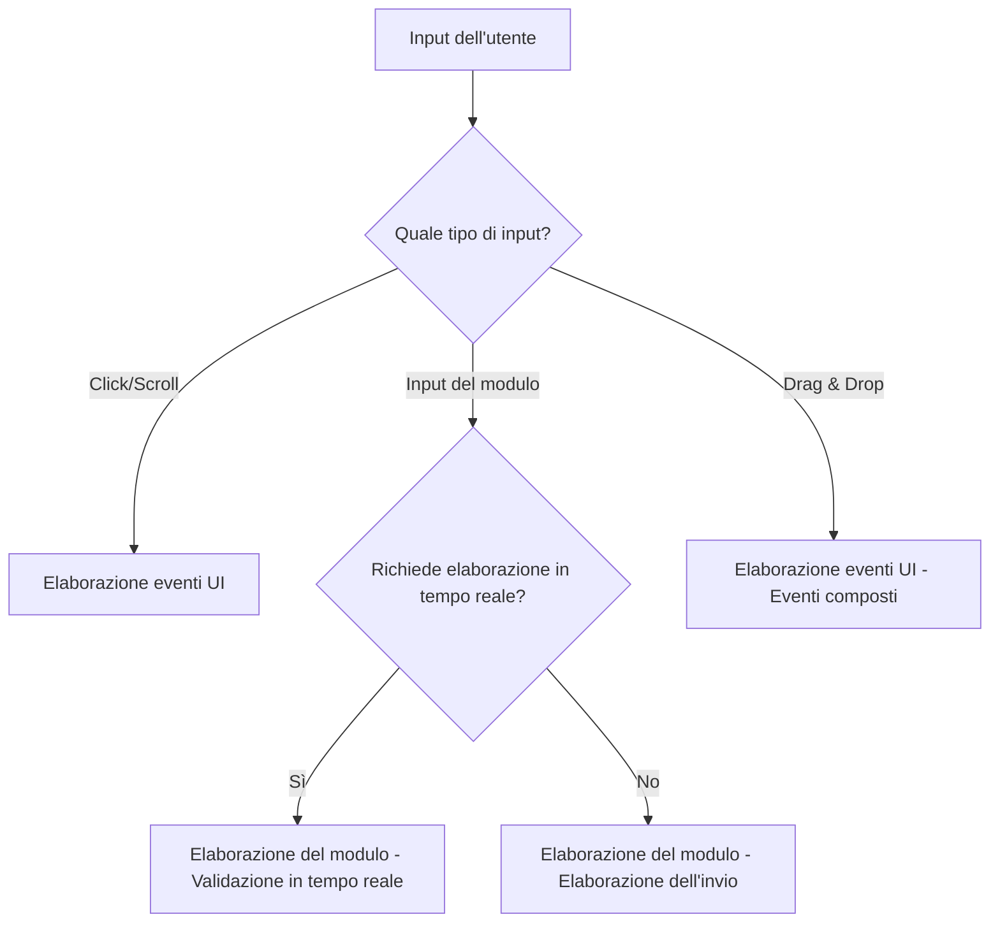
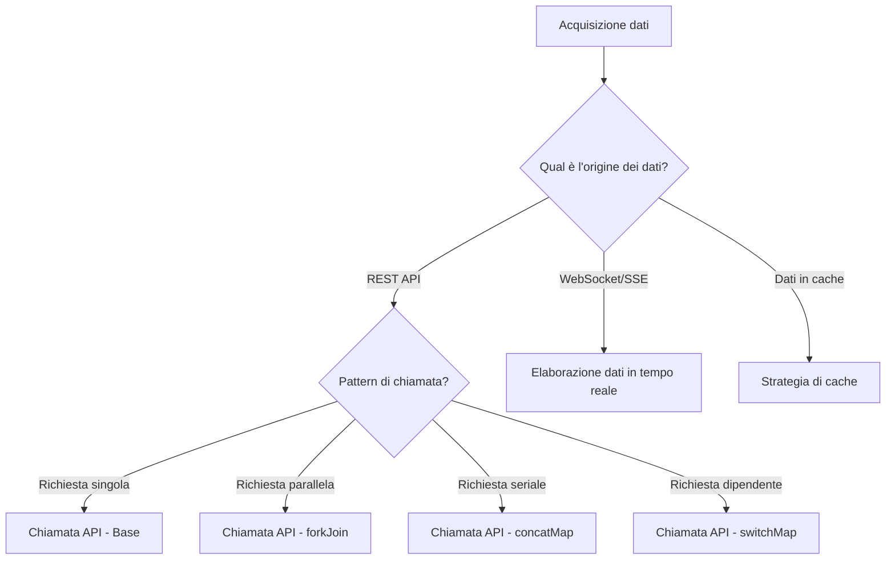
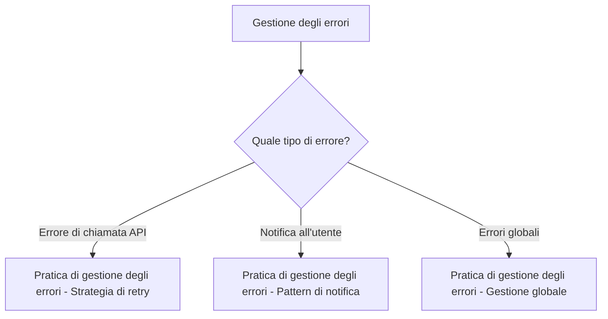

# Collezione di pattern pratici

Una volta acquisite le basi di RxJS, la domanda successiva è "come usarlo" nello sviluppo di applicazioni reali. Questo capitolo introduce pattern di implementazione concreti per gli scenari che si incontrano frequentemente nella pratica.

## Perché i pattern pratici sono importanti

Anche se si conoscono i singoli operatori di RxJS, è necessario avere esperienza e conoscenza dei pattern per combinarli e risolvere problemi reali. Imparando i pattern pratici:

- **Aumentare la velocità di sviluppo** - evitare di reinventare la ruota e applicare pattern collaudati
- **Migliorare la qualità** - imparare le best practice come la gestione degli errori e la prevenzione dei memory leak
- **Aumentare la manutenibilità** - pattern coerenti migliorano la leggibilità e la manutenibilità del codice
- **Risoluzione dei problemi** - identificare la causa dei problemi e selezionare le soluzioni appropriate

## Struttura di questo capitolo

I pattern pratici sono suddivisi in tre fasi in base alla difficoltà e alla frequenza d'uso.

### Pattern principali (più frequenti)

Questi sono i pattern di base più frequentemente utilizzati nella pratica. Imparate prima questi.

| Pattern | Contenuto | Argomenti principali |
|---------|------|---------|
| [Elaborazione degli eventi UI](./ui-events.md) | Operazioni dell'interfaccia utente come clic, scorrimento, drag & drop, ecc. | Frontend in generale |
| [Chiamate API](./api-calls.md) | Comunicazione HTTP, elaborazione parallela/seriale, gestione degli errori | Integrazione Web API |
| [Gestione dei moduli](./form-handling.md) | Validazione in tempo reale, salvataggio automatico, integrazione di campi multipli | Implementazione dei moduli |

### Pattern avanzati

Pattern avanzati per scenari più complessi.

| Pattern | Contenuto | Argomento principale |
|---------|------|---------|
| [Pattern avanzati di form](./advanced-form-patterns.md) | JSON Patch, salvataggio automatico di grandi moduli, Undo/Redo, editing collaborativo | Enterprise Forms |
| [Elaborazione dei dati in tempo reale](./real-time-data.md) | WebSocket, SSE, Polling, gestione delle connessioni | Comunicazione in tempo reale |
| [Strategie di caching](./caching-strategies.md) | Caching dei dati, TTL, invalidazione, supporto offline | Ottimizzazione delle prestazioni |

### Pattern specializzati

Pattern specializzati per problemi specifici.

| Pattern | Contenuto | Argomento principale |
|---------|------|---------|
| [Pratiche di gestione degli errori](./error-handling-patterns.md) | Errori di chiamata API, strategie di retry, gestione degli errori globali | Gestione degli errori |
| [Ramificazione condizionale all'interno di subscribe](./subscribe-branching.md) | Come evitare la ramificazione all'interno di subscribe, ramificazione all'interno della pipeline | Qualità del codice |

> [!TIP] Come procedere con l'apprendimento
> Per i principianti, si consiglia di iniziare con la **Fase 1** e procedere in quest'ordine. In particolare, le "chiamate API" e l'"elaborazione dei moduli" sono pattern essenziali nella pratica.

## Composizione del pattern

Ogni pagina del pattern è descritta nella seguente struttura:

1. **Descrizione del problema** - il problema che questo pattern risolve
2. **Implementazione di base** - l'esempio di implementazione più semplice
3. **Esempi pratici** - codice concreto che può essere utilizzato nella pratica
4. **Confronto Prima/Dopo** - confronto del codice prima e dopo i miglioramenti
5. **Avvertenze e best practice** - errori comuni e contromisure
6. **Definizioni dei tipi in TypeScript** - metodi di implementazione type-safe
7. **Codice di test** - come testare i pattern
8. **Considerazioni sulle prestazioni** - memory leak e ottimizzazione delle prestazioni

## Linee guida per la selezione dei pattern

Linee guida per la selezione del pattern appropriato in base alla funzionalità da implementare.

### Quando si gestisce l'input dell'utente



### Quando si gestisce l'acquisizione dei dati



### Per una migliore gestione degli errori



## Concetti di implementazione

Questa sezione introduce i concetti di base per l'implementazione dei pattern RxJS.

### 1. Pensare in modo dichiarativo

Esprimere "ciò che si vuole fare" in modo dichiarativo ed evitare il codice procedurale.

```ts
// ❌ Procedurale (imperativo)
let result = [];
source.subscribe(value => {
  if (value > 10) {
    const transformed = value * 2;
    result.push(transformed);
  }
});

// ✅ Dichiarativo
const result$ = source.pipe(
  filter(value => value > 10),
  map(value => value * 2)
);
```

### 2. Costruire il processo nella pipeline

Combinare piccoli operatori per costruire processi complessi.

```ts
const searchResults$ = searchInput$.pipe(
  debounceTime(300),           // Aspetta 300ms per l'input
  distinctUntilChanged(),      // Esclude i duplicati
  filter(query => query.length >= 2), // Ricerca con più di 2 caratteri
  switchMap(query => searchAPI(query)), // Chiamata API
  catchError(err => of([]))    // Array vuoto in caso di errore
);
```

### 3. Prevenire i memory leak

La gestione corretta delle sottoscrizioni è essenziale.

```ts
// ✅ Cancellazione automatica con takeUntil
private destroy$ = new Subject<void>();

ngOnInit() {
  this.data$.pipe(
    takeUntil(this.destroy$)
  ).subscribe(/*...*/);
}

ngOnDestroy() {
  this.destroy$.next();
  this.destroy$.complete();
}
```

### 4. Ricordare la gestione degli errori

Implementare la gestione degli errori per tutti i processi asincroni.

```ts
// ✅ catchError per una corretta gestione degli errori
apiCall$.pipe(
  retry(3),
  catchError(err => {
    console.error('API error:', err);
    return of(defaultValue);
  })
).subscribe(/*...*/);
```

### 5. Sfruttare la type safety

Sfruttare al massimo il sistema di tipi di TypeScript.

```ts
interface User {
  id: number;
  name: string;
  email: string;
}

// ✅ Definizione esplicita del tipo
const users$: Observable<User[]> = fetchUsers();
const activeUsers$: Observable<User[]> = users$.pipe(
  map(users => users.filter(u => u.isActive))
);
```

## Relazione con le conoscenze esistenti

I pattern di questo capitolo applicano nella pratica le conoscenze apprese nei capitoli precedenti.

| Pattern pratici | Capitoli correlati | Conoscenze da applicare |
|------------|-----------|------------|
| Elaborazione eventi UI | [Capitolo 4: Operatori](/it/guide/operators/index.md) | debounceTime, throttleTime, distinctUntilChanged |
| Chiamate API | [Capitolo 6: Gestione degli errori](/it/guide/error-handling/strategies.md) | catchError, retry, timeout |
| Elaborazione dei moduli | [Capitolo 3: Creation Functions](/it/guide/creation-functions/index.md) | combineLatest, withLatestFrom |
| Pattern di form avanzati | [Capitolo 4: Operatori di trasformazione](/it/guide/operators/transformation/pairwise.md) | pairwise, scan, bufferTime, concatMap |
| Dati in tempo reale | [Capitolo 5: Subject](/it/guide/subjects/what-is-subject.md) | Subject, BehaviorSubject, shareReplay |
| Strategia di cache | [Capitolo 2: Cold/Hot](/it/guide/observables/cold-and-hot-observables.md) | shareReplay, share |
| Gestione degli errori | [Capitolo 6: Gestione degli errori](/it/guide/error-handling/strategies.md) | catchError, retry, retryWhen |
| Ramificazione subscribe | [Capitolo 10: Anti-pattern](/it/guide/anti-patterns/index.md) | Evitare gli anti-pattern |

> [!NOTE] Quando ripassare
> Prima di studiare ogni pattern, si consiglia di rivedere i capitoli pertinenti per una migliore comprensione.

## Domande frequenti

### Q1: Da quale pattern dovrei iniziare?

**A:** Si consiglia di impararli nell'ordine di utilizzo più frequente nella pratica.

1. **Chiamate API** - le basi dello sviluppo web
2. **Elaborazione dei moduli** - elaborazione degli input dell'utente
3. **Gestione degli eventi UI** - interfaccia utente interattiva
4. **Gestione degli errori** - applicazioni robuste
5. Altri pattern - a seconda delle esigenze del progetto

### Q2: Posso usare il pattern così com'è?

**A:** Sì. I pattern di questo capitolo sono destinati all'uso pratico.
Tuttavia:

- Personalizzarli in base ai requisiti del progetto
- Tenere conto delle prestazioni e dell'utilizzo della memoria
- Seguire le convenzioni di codifica del team

### Q3: Posso usarlo con Angular/React/Vue?

**A:** Sì. I pattern di questo capitolo sono indipendenti dal framework.
Tuttavia:

- Per i metodi di integrazione specifici del framework, vedere il Capitolo 15: Integrazione del framework (in preparazione)
- La disiscrizione è necessaria per il ciclo di vita di ogni framework

## Riepilogo

La collezione di pattern pratici è una guida concreta all'uso di RxJS in progetti reali.

> [!IMPORTANT] Punti chiave
> - Apprendere in ordine i **pattern principali** nella Fase 1
> - Comprendere i miglioramenti con il **confronto Prima/Dopo**
> - Assicurarsi di implementare la **prevenzione dei memory leak**
> - Non dimenticare la **gestione degli errori**
> - Approfittare della **type safety**

> [!TIP] Suggerimenti per l'apprendimento
> - Fare pratica con il codice per comprenderlo meglio
> - Provare ad applicarli ai propri progetti
> - Combinare i pattern per costruire processi complessi
> - Imparare anche il codice di test

Come passo successivo, si consiglia di iniziare con il [pattern delle chiamate API](./api-calls.md) che è il più frequentemente utilizzato.

## Risorse di riferimento

- [Documentazione ufficiale RxJS](https://rxjs.dev/) - Riferimento ufficiale alle API
- [Learn RxJS](https://www.learnrxjs.io/) - Esempi pratici per operatore
- [RxJS Marbles](https://rxmarbles.com/) - Comprendere visivamente il comportamento degli operatori
- [Capitolo 11: Superare le difficoltà di RxJS](/it/guide/overcoming-difficulties/index.md) - Difficoltà comuni e come superarle
- [Capitolo 10: Anti-pattern](/it/guide/anti-patterns/index.md) - Pattern da evitare
