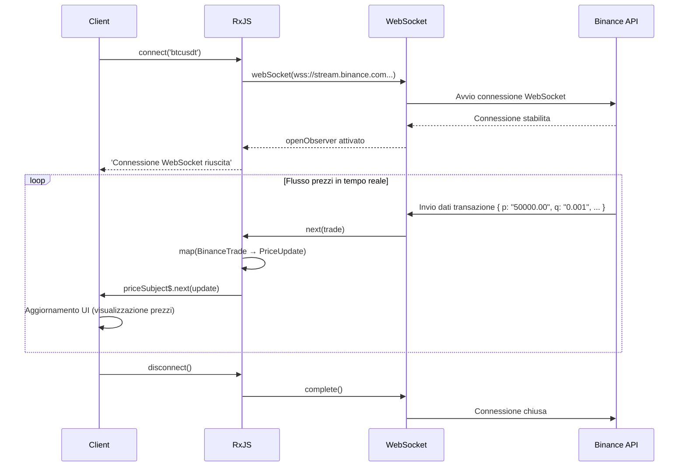

# Modelli di elaborazione dei dati in tempo reale

L'elaborazione dei dati in tempo reale è una caratteristica importante nelle moderne applicazioni web, come le chat, le notifiche, gli aggiornamenti delle azioni, il monitoraggio dei sensori IoT, ecc. Con RxJS, è possibile implementare complesse comunicazioni in tempo reale in modo dichiarativo e robusto.

Questo articolo descrive modelli specifici di elaborazione dei dati in tempo reale richiesti nella pratica, come WebSockets, Server-Sent Events (SSE) e Polling.

## Cosa imparerete in questo articolo

- Implementazione e gestione della comunicazione WebSocket
- Uso degli eventi inviati dal server (SSE)
- Aggiornamenti in tempo reale con il polling
- Gestione delle connessioni e riconnessione automatica
- Unione e aggiornamento dei dati
- Creazione di un sistema di notifica in tempo reale
- Gestione degli errori e dello stato della connessione

> [!TIP] Prerequisiti
> Questo articolo presuppone la conoscenza del [Capitolo 5: Subject](/it/guide/subjects/what-is-subject.md) e del [Capitolo 4: Operatori](/it/guide/operators/index.md). In particolare, è importante la comprensione di `Subject`, `shareReplay`, `retry` e `retryWhen`.

## Comunicazione WebSocket

### Problema: voglio implementare una comunicazione bidirezionale in tempo reale

I prezzi delle criptovalute, gli aggiornamenti dei prezzi delle azioni, le applicazioni di chat, ecc. richiedono una comunicazione bidirezionale in tempo reale tra server e client. Questo esempio utilizza un'API WebSocket pubblica e funzionante per monitorare i prezzi delle criptovalute in tempo reale.

### Soluzione: utilizzare RxJS webSocket

Utilizzare l'API WebSocket pubblica di **Binance** per recuperare i dati delle transazioni in bitcoin in tempo reale. Il codice è eseguibile così com'è e i dati sui prezzi effettivi fluiscono.

```typescript
import { EMPTY, Subject, retry, catchError, tap, map } from 'rxjs';
import { webSocket, WebSocketSubject } from 'rxjs/webSocket';

// Tipo di dati della transazione API Binance WebSocket
// https://binance-docs.github.io/apidocs/spot/en/#trade-streams
interface BinanceTrade {
  e: string;      // tipo di evento "trade"
  E: number;      // ora dell'evento
  s: string;      // simbolo "BTCUSDT"
  t: number;      // ID della transazione
  p: string;      // prezzo
  q: string;      // quantità
  T: number;      // ora della transazione
  m: boolean;     // se l'acquirente è un market maker
}

// tipo conciso per la visualizzazione
interface PriceUpdate {
  symbol: string;
  price: number;
  quantity: number;
  time: Date;
  isBuyerMaker: boolean;
}

class CryptoPriceService {
  private socket$: WebSocketSubject<BinanceTrade> | null = null;
  private priceSubject$ = new Subject<PriceUpdate>();

  public prices$ = this.priceSubject$.asObservable();

  /**
   * Connettersi all'API WebSocket pubblica di Binance
   * @param symbol coppia di criptovalute (es. "btcusdt", "ethusdt")
   */
  connect(symbol: string = 'btcusdt'): void {
    if (!this.socket$ || this.socket$.closed) {
      // API WebSocket pubblica di Binance (non è richiesta l'autenticazione)
      const url = `wss://stream.binance.com:9443/ws/${symbol}@trade`;

      this.socket$ = webSocket<BinanceTrade>({
        url,
        openObserver: {
          next: () => {
            console.log(`Connessione WebSocket riuscita: ${symbol.toUpperCase()}`);
          }
        },
        closeObserver: {
          next: () => {
            console.log('Connessione WebSocket terminata');
          }
        }
      });

      this.socket$.pipe(
        // Convertire i dati di Binance per la visualizzazione
        map(trade => ({
          symbol: trade.s,
          price: parseFloat(trade.p),
          quantity: parseFloat(trade.q),
          time: new Date(trade.T),
          isBuyerMaker: trade.m
        })),
        tap(update => console.log('Aggiornamento prezzo:', update.price)),
        retry({
          count: 5,
          delay: 1000
        }),
        catchError(err => {
          console.error('Errore WebSocket:', err);
          return EMPTY;
        })
      ).subscribe(priceUpdate => {
        this.priceSubject$.next(priceUpdate);
      });
    }
  }

  disconnect(): void {
    if (this.socket$) {
      this.socket$.complete();
      this.socket$ = null;
    }
  }
}

// Creare elementi dell'interfaccia utente in modo dinamico
const priceContainer = document.createElement('div');
priceContainer.id = 'price-display';
priceContainer.style.padding = '20px';
priceContainer.style.margin = '10px';
priceContainer.style.border = '2px solid #f0b90b'; // Colore di Binance
priceContainer.style.borderRadius = '8px';
priceContainer.style.backgroundColor = '#1e2329';
priceContainer.style.color = '#eaecef';
priceContainer.style.fontFamily = 'monospace';
document.body.appendChild(priceContainer);

const latestPriceDisplay = document.createElement('div');
latestPriceDisplay.style.fontSize = '32px';
latestPriceDisplay.style.fontWeight = 'bold';
latestPriceDisplay.style.marginBottom = '10px';
priceContainer.appendChild(latestPriceDisplay);

const tradesContainer = document.createElement('div');
tradesContainer.style.maxHeight = '400px';
tradesContainer.style.overflowY = 'auto';
tradesContainer.style.fontSize = '14px';
priceContainer.appendChild(tradesContainer);

// Esempio di utilizzo
const priceService = new CryptoPriceService();
priceService.connect('btcusdt'); // Dati delle transazioni Bitcoin/USDT

// Ricevere gli aggiornamenti dei prezzi
priceService.prices$.subscribe(update => {
  // Visualizzare l'ultimo prezzo in formato grande
  latestPriceDisplay.textContent = `${update.symbol}: $${update.price.toLocaleString('en-US', { minimumFractionDigits: 2 })}`;
  latestPriceDisplay.style.color = update.isBuyerMaker ? '#f6465d' : '#0ecb81'; // Colore codificato per vendita/acquisto

  // Visualizzazione della cronologia delle transazioni
  displayTrade(update, tradesContainer);
});

function displayTrade(update: PriceUpdate, container: HTMLElement): void {
  const tradeElement = document.createElement('div');
  tradeElement.style.padding = '5px';
  tradeElement.style.margin = '3px 0';
  tradeElement.style.borderBottom = '1px solid #2b3139';
  tradeElement.style.color = update.isBuyerMaker ? '#f6465d' : '#0ecb81';

  const timeStr = update.time.toLocaleTimeString('ja-JP');
  const side = update.isBuyerMaker ? 'Sell' : 'Buy';
  tradeElement.textContent = `[${timeStr}] ${side} $${update.price.toFixed(2)} × ${update.quantity.toFixed(4)}`;

  container.insertBefore(tradeElement, container.firstChild);

  // Conserva fino a 50 transazioni
  while (container.children.length > 50) {
    container.removeChild(container.lastChild!);
  }
}

// Esempio di pulizia
// priceService.disconnect();
```

> [!TIP] API WebSocket pubblica che potete provare
> Questo codice funziona **copia e incolla così com'è**. L'API WebSocket pubblica di Binance non richiede autenticazione e fornisce dati sulle transazioni di criptovalute in tempo reale.
>
> **Puoi provare anche altre coppie di criptovalute**:
> - `priceService.connect('ethusdt')` - Ethereum/USDT
> - `priceService.connect('bnbusdt')` - BNB/USDT
> - `priceService.connect('adausdt')` - Cardano/USDT
>
> Ulteriori informazioni: [Binance WebSocket API Docs](https://binance-docs.github.io/apidocs/spot/en/#websocket-market-streams)

**Flusso di comunicazione WebSocket:**



> [!IMPORTANT] Proprietà di WebSocket
> - **Comunicazione bidirezionale**: può essere inviata sia dal server che dal client (in questo esempio solo ricevuta)
> - **Real-time**: latenza inferiore a quella di HTTP, aggiornamenti dei prezzi in millisecondi
> - **Gestione dello stato**: necessità di gestire correttamente connessioni e disconnessioni
> - **Subject**: WebSocketSubject ha sia proprietà Subject che Observable
> - **Reconnect**: la riconnessione automatica in caso di disconnessione della rete è importante (spiegata nella prossima sezione)

### Implementazione della riconnessione automatica

Le connessioni WebSocket possono essere scollegate a causa di guasti alla rete o di riavvii del server. L'implementazione della riconnessione automatica migliora l'esperienza dell'utente.

**Importanza della riconnessione**:
- Frequenti disconnessioni temporanee della rete in ambienti mobili
- Ripristino automatico durante la manutenzione del server
- Elimina la necessità per gli utenti di riconnettersi manualmente

Di seguito è riportato un esempio di implementazione della riconnessione automatica utilizzando una strategia di back-off esponenziale.

```typescript
import { retryWhen, delay, tap, take } from 'rxjs';
import { webSocket, WebSocketSubject } from 'rxjs/webSocket';

class ReconnectingWebSocketService {
  private socket$: WebSocketSubject<any> | null = null;
  private reconnectAttempts = 0;
  private maxReconnectAttempts = 5;

  connect(url: string): WebSocketSubject<any> {
    if (!this.socket$ || this.socket$.closed) {
      this.socket$ = webSocket({
        url,
        openObserver: {
          next: () => {
            console.log('Connessione WebSocket riuscita');
            this.reconnectAttempts = 0; // Azzeramento del contatore in caso di connessione riuscita
          }
        },
        closeObserver: {
          next: (event) => {
            console.log('WebSocket disconnesso:', event);
            this.socket$ = null;
          }
        }
      });

      // Riconnessione automatica
      this.socket$.pipe(
        retryWhen(errors =>
          errors.pipe(
            tap(() => {
              this.reconnectAttempts++;
              console.log(`Tentativi di riconnessione ${this.reconnectAttempts}/${this.maxReconnectAttempts}`);
            }),
            delay(this.getReconnectDelay()),
            take(this.maxReconnectAttempts)
          )
        )
      ).subscribe({
        next: message => console.log('Received:', message),
        error: err => console.error('Tentativi massimi di riconnessione raggiunti:', err)
      });
    }

    return this.socket$;
  }

  private getReconnectDelay(): number {
    // Backoff esponenziale: 1, 2, 4, 8 o 16 secondi
    return Math.min(1000 * Math.pow(2, this.reconnectAttempts), 16000);
  }

  disconnect(): void {
    if (this.socket$) {
      this.socket$.complete();
      this.socket$ = null;
    }
  }
}
```

> [!TIP] Strategia di riconnessione
> - **Rallentamento esponenziale**: aumentare gradualmente l'intervallo di riconnessione (1 secondo, 2 secondi, 4 secondi...)
> - **Numero massimo di tentativi**: impedisce i loop infiniti
> - **Reset a connessione avvenuta**: azzeramento del contatore
> - **Notifica all'utente**: lo stato della connessione viene visualizzato nell'interfaccia utente

### Gestione dello stato di connessione

La **gestione esplicita** dello stato di connessione fornisce un feedback appropriato all'interfaccia utente. L'utente è sempre al corrente dello stato attuale della connessione (connesso, collegato, riconnesso, errore, ecc.).

**Benefici della gestione dello stato di connessione**:
- Controllo della visualizzazione del caricamento (visualizzazione dello spinner durante la connessione)
- Visualizzazione dei messaggi di errore (in caso di mancata connessione)
- Feedback appropriato per l'utente ("ricollegarsi..." ecc.)
- Facilità di debugging (le transizioni di stato possono essere tracciate)

L'esempio seguente utilizza `BehaviorSubject` per gestire in modo reattivo lo stato di connessione.

```typescript
import { BehaviorSubject, Observable } from 'rxjs';
import { webSocket, WebSocketSubject } from 'rxjs/webSocket';

enum ConnectionState {
  CONNECTING = 'connecting',
  CONNECTED = 'connected',
  DISCONNECTED = 'disconnected',
  RECONNECTING = 'reconnecting',
  FAILED = 'failed'
}

class WebSocketManager {
  private socket$: WebSocketSubject<any> | null = null;
  private connectionState$ = new BehaviorSubject<ConnectionState>(
    ConnectionState.DISCONNECTED
  );

  getConnectionState(): Observable<ConnectionState> {
    return this.connectionState$.asObservable();
  }

  connect(url: string): void {
    this.connectionState$.next(ConnectionState.CONNECTING);

    this.socket$ = webSocket({
      url,
      openObserver: {
        next: () => {
          console.log('Connessione riuscita');
          this.connectionState$.next(ConnectionState.CONNECTED);
        }
      },
      closeObserver: {
        next: () => {
          console.log('Connessione chiusa');
          this.connectionState$.next(ConnectionState.DISCONNECTED);
        }
      }
    });

    this.socket$.subscribe({
      next: message => this.handleMessage(message),
      error: err => {
        console.error('Errore:', err);
        this.connectionState$.next(ConnectionState.FAILED);
      }
    });
  }

  private handleMessage(message: any): void {
    console.log('Messaggio ricevuto:', message);
  }

  disconnect(): void {
    if (this.socket$) {
      this.socket$.complete();
      this.socket$ = null;
    }
  }
}

const statusElement = document.createElement('div');
statusElement.id = 'connection-status';
statusElement.style.padding = '10px 20px';
statusElement.style.margin = '10px';
statusElement.style.fontSize = '16px';
statusElement.style.fontWeight = 'bold';
statusElement.style.textAlign = 'center';
statusElement.style.borderRadius = '4px';
document.body.appendChild(statusElement);

// Esempio di utilizzo
const wsManager = new WebSocketManager();

// Monitoraggio dello stato di connessione
wsManager.getConnectionState().subscribe(state => {
  console.log('Stato connessione:', state);
  updateConnectionStatusUI(state, statusElement);
});

wsManager.connect('ws://localhost:8080');

function updateConnectionStatusUI(state: ConnectionState, element: HTMLElement): void {
  element.textContent = state;

  // Stile basato sullo stato della connessione
  switch (state) {
    case ConnectionState.CONNECTED:
      element.style.backgroundColor = '#d4edda';
      element.style.color = '#155724';
      element.style.border = '1px solid #c3e6cb';
      break;
    case ConnectionState.CONNECTING:
      element.style.backgroundColor = '#fff3cd';
      element.style.color = '#856404';
      element.style.border = '1px solid #ffeeba';
      break;
    case ConnectionState.DISCONNECTED:
      element.style.backgroundColor = '#f8d7da';
      element.style.color = '#721c24';
      element.style.border = '1px solid #f5c6cb';
      break;
    case ConnectionState.FAILED:
      element.style.backgroundColor = '#f8d7da';
      element.style.color = '#721c24';
      element.style.border = '2px solid #f44336';
      break;
  }
}
```

## Eventi inviati dal server (SSE)

### Problema: è richiesta una notifica push unidirezionale dal server

Vogliamo implementare notifiche unidirezionali dal server al client (aggiornamenti delle notizie, aggiornamenti delle azioni, aggiornamenti del cruscotto, ecc.)

#### Caratteristiche di SSE
- **Comunicazione unidirezionale**: solo da server a client (usare WebSockets se è richiesta la bidirezionalità)
- **Basato su HTTP/HTTPS**: funziona con l'infrastruttura esistente, supporto proxy/firewall
- **Auto-riconnessione**: il browser si riconnette automaticamente quando viene disconnesso
- **Classificazione degli eventi**: è possibile inviare più tipi di eventi (`message`, `notification`, `update`, ecc.)
- **Dati di testo**: binario non supportato (inviato come stringa JSON)

### Soluzione: combinare EventSource e RxJS

> [!NOTE] A proposito dell'API pubblica di SSE
> Purtroppo le API SSE pubbliche disponibili gratuitamente sono poche. I seguenti esempi di codice devono essere intesi come **modelli di implementazione**.
>
> **Come provarlo**:
> 1. **Server locale**: configurare un semplice server SSE utilizzando Node.js o simili (vedere sotto)
> 2. **Servizio SSE**: alcuni servizi cloud forniscono funzioni SSE
> 3. **Sito demo**: costruire un ambiente front-end + mock server con StackBlitz ecc.

```typescript
import { Observable, Subject, retry, share } from 'rxjs';
interface ServerEvent {
  type: string;
  data: any;
  timestamp: Date;
}

class SSEService {
  createEventSource(url: string): Observable<ServerEvent> {
    return new Observable<ServerEvent>(observer => {
      const eventSource = new EventSource(url);

      eventSource.onmessage = (event) => {
        observer.next({
          type: 'message',
          data: JSON.parse(event.data),
          timestamp: new Date()
        });
      };

      eventSource.onerror = (error) => {
        console.error('SSE error:', error);
        observer.error(error);
      };

      // Pulizia: chiudere EventSource in caso di annullamento dell'iscrizione
      return () => {
        eventSource.close();
      };
    }).pipe(
      retry({ count: 3, delay: 1000 }),
      share() // Condividere la connessione tra più sottoscrittori
    );
  }
}

// Esempio di utilizzo
const sseService = new SSEService();
const events$ = sseService.createEventSource('/api/events');

events$.subscribe(event => {
  console.log('Evento ricevuto:', event);
});
```

### Gestione degli eventi personalizzati

Oltre all'evento predefinito `message`, SSE consente di definire **tipi di eventi personalizzati**. Ciò consente di implementare processi diversi per ogni tipo di evento.

**Vantaggi degli eventi personalizzati**:
- Consente un'elaborazione diversa a seconda del tipo di evento
- Definire eventi per scopi diversi, come `message`, `notification`, `error`, ecc.
- Consente agli abbonati di monitorare solo gli eventi di cui hanno bisogno
- Migliore leggibilità e manutenibilità del codice

Sul lato server, il campo `event:` specifica il nome dell'evento:
```
event: notification
data: {"title": "Nuovo messaggio", "count": 3}
```

L'esempio seguente fornisce più tipi di eventi come flussi Observable separati.

```typescript
class AdvancedSSEService {
  createEventSource(url: string): {
    messages$: Observable<any>;
    notifications$: Observable<any>;
    errors$: Observable<any>;
  } {
    const messagesSubject = new Subject<any>();
    const notificationsSubject = new Subject<any>();
    const errorsSubject = new Subject<any>();

    const eventSource = new EventSource(url);

    // Messaggio normale
    eventSource.addEventListener('message', (event) => {
      messagesSubject.next(JSON.parse(event.data));
    });

    // Evento personalizzato: notifica
    eventSource.addEventListener('notification', (event) => {
      notificationsSubject.next(JSON.parse(event.data));
    });

    // Evento personalizzato: errore
    eventSource.addEventListener('error-event', (event) => {
      errorsSubject.next(JSON.parse(event.data));
    });

    // Errore di connessione
    eventSource.onerror = (error) => {
      console.error('Errore di connessione SSE:', error);
      if (eventSource.readyState === EventSource.CLOSED) {
        console.log('Connessione SSE chiusa');
      }
    };

    return {
      messages$: messagesSubject.asObservable(),
      notifications$: notificationsSubject.asObservable(),
      errors$: errorsSubject.asObservable()
    };
  }
}

// Esempio di utilizzo
const advancedSSE = new AdvancedSSEService();
const streams = advancedSSE.createEventSource('/api/events');

streams.messages$.subscribe(msg => {
  console.log('Messaggio:', msg);
});

streams.notifications$.subscribe(notification => {
  console.log('Notifica:', notification);
  showNotification(notification);
});

streams.errors$.subscribe(error => {
  console.error('Errore del server:', error);
  showErrorMessage(error);
});

function showNotification(notification: any): void {
  // Mostra la notifica
  console.log('Mostra notifica:', notification.message);
}

function showErrorMessage(error: any): void {
  // Mostra il messaggio di errore
  console.error('Visualizzazione errore:', error.message);
}
```

> [!NOTE] WebSocket vs SSE
> | Proprietà | WebSocket | Server-Sent Events |
> |------|-----------|-------------------|
> | **Direzione** | Bidirezionale | Unidirezionale (da server a client) |
> | **Protocollo** | Protocolli proprietari | HTTP |
> | **Supporto browser** | Ampio | Ampio (tranne IE) |
> | **Auto-riconnessione** | Nessuno (richiede un'implementazione) | Sì (il browser gestisce automaticamente) |
> | **Scenari d'uso** | chat, giochi | notifiche, aggiornamenti del cruscotto |
> | **Difficoltà di implementazione** | Un po' alta | Bassa (basata su HTTP) |
> | **Formato dei dati** | Testo/binario | Solo testo |

### Esempio di server semplice SSE (Node.js)

Questo è un esempio di implementazione di un semplice server SSE a scopo di apprendimento.

**server.js** (usando Express):

```javascript
const express = require('express');
const app = express();

// Supporto CORS
app.use((req, res, next) => {
  res.header('Access-Control-Allow-Origin', '*');
  res.header('Access-Control-Allow-Headers', 'Origin, X-Requested-With, Content-Type, Accept');
  next();
});

// Endpoint SSE
app.get('/api/events', (req, res) => {
  // Impostazioni dell'intestazione SSE
  res.writeHead(200, {
    'Content-Type': 'text/event-stream',
    'Cache-Control': 'no-cache',
    'Connection': 'keep-alive'
  });

  // Messaggi inviati ogni secondo
  const intervalId = setInterval(() => {
    const data = {
      timestamp: new Date().toISOString(),
      value: Math.random() * 100
    };

    res.write(`data: ${JSON.stringify(data)}\n\n`);
  }, 1000);

  // Pulizia alla disconnessione del client
  req.on('close', () => {
    clearInterval(intervalId);
    res.end();
  });
});

app.listen(3000, () => {
  console.log('SSE server started: http://localhost:3000');
});
```

**Come avviare**:
```bash
npm install express
node server.js
```

Ora è possibile ricevere SSE da `http://localhost:3000/api/events`.

## Schema di polling

### Problema: voglio aggiornamenti in tempo reale in un ambiente in cui WebSocket/SSE non è disponibile

Voglio chiamare periodicamente un'API per aggiornare i dati in un vecchio browser o in un ambiente firewall o su un server che non supporta WebSocket/SSE.

### Soluzione: combinare interval e switchMap

API **JSONPlaceholder** per interrogare periodicamente i dati inviati. Questo codice è eseguibile così com'è e consente di sperimentare il recupero effettivo dei dati.

```typescript
import { interval, from, of, switchMap, retry, catchError, startWith, tap } from 'rxjs';

// JSONPlaceholder API Tipo di invio
// https://jsonplaceholder.typicode.com/posts
interface Post {
  userId: number;
  id: number;
  title: string;
  body: string;
}

interface PollingResponse {
  posts: Post[];
  count: number;
  timestamp: Date;
  updatedAt: string;
}

/**
 * Implementazione di base del polling
 * @param fetchFn Funzione di fetch dei dati
 * @param intervalMs Intervallo di polling (millisecondi)
 */
function createPolling<T>(
  fetchFn: () => Promise<T>,
  intervalMs: number = 5000
) {
  return interval(intervalMs).pipe(
    startWith(0), // Eseguire immediatamente la prima richiesta
    switchMap(() =>
      from(fetchFn()).pipe(
        retry(3), // Esegue 3 tentativi in caso di errore
        catchError(err => {
          console.error('Errore di polling:', err);
          throw err; // Rilancia l'errore
        })
      )
    ),
    tap(() => console.log('Dati recuperati'))
  );
}

// Creare elementi dell'interfaccia utente in modo dinamico
const pollingContainer = document.createElement('div');
pollingContainer.id = 'polling-container';
pollingContainer.style.padding = '15px';
pollingContainer.style.margin = '10px';
pollingContainer.style.border = '2px solid #4CAF50';
pollingContainer.style.borderRadius = '8px';
pollingContainer.style.backgroundColor = '#f9f9f9';
document.body.appendChild(pollingContainer);

const statusDisplay = document.createElement('div');
statusDisplay.style.padding = '10px';
statusDisplay.style.marginBottom = '10px';
statusDisplay.style.fontWeight = 'bold';
statusDisplay.style.color = '#4CAF50';
pollingContainer.appendChild(statusDisplay);

const postsDisplay = document.createElement('div');
postsDisplay.style.maxHeight = '400px';
postsDisplay.style.overflowY = 'auto';
pollingContainer.appendChild(postsDisplay);

// Caso d'uso: polling dell'API JSONPlaceholder
const polling$ = createPolling<Post[]>(
  () => fetch('https://jsonplaceholder.typicode.com/posts')
    .then(response => {
      if (!response.ok) {
        throw new Error(`HTTP error! status: ${response.status}`);
      }
      return response.json();
    }),
  10000 // Polling ogni 10 secondi
);

polling$.subscribe({
  next: (posts) => {
    const now = new Date();
    statusDisplay.textContent = `Ultimo aggiornamento: ${now.toLocaleTimeString('it-IT')} | Numero di post: ${posts.length} post`;

    // Visualizzare solo gli ultimi 10 messaggi
    updatePostsUI(posts.slice(0, 10), postsDisplay);
  },
  error: (err) => {
    statusDisplay.textContent = `Errore: ${err.message}`;
    statusDisplay.style.color = '#f44336';
  }
});

function updatePostsUI(posts: Post[], container: HTMLElement): void {
  container.innerHTML = posts
    .map(post => `
      <div style="padding: 10px; margin: 5px 0; border-bottom: 1px solid #ddd; background: white; border-radius: 4px;">
        <div style="font-weight: bold; color: #333;">${post.title}</div>
        <div style="font-size: 12px; color: #666; margin-top: 4px;">ID post: ${post.id} | ID utente: ${post.userId}</div>
      </div>
    `)
    .join('');

  if (posts.length === 0) {
    container.innerHTML = '<div style="padding: 20px; text-align: center; color: #999;">Nessun dato</div>';
  }
}
```

> [!TIP] La praticità del polling
> Il polling funziona in modo affidabile anche in ambienti in cui WebSocket e SSE non sono disponibili.
>
> **Intervallo di polling indicativo**:
> - **Il tempo reale è importante**: 1-3 secondi (dashboard, schermate di monitoraggio)
> - **Aggiornamenti generali dei dati**: 5-10 secondi (feed di notizie, notifiche)
> - **Aggiornamenti in background**: 30-60 secondi (controllo della ricezione delle e-mail)
>
> **Nota**: evitare intervalli inutilmente brevi, tenendo conto del carico del server!

### Polling adattivo (Smart Polling)

**Se le modifiche ai dati sono piccole, il carico del server può essere ridotto aumentando gradualmente l'intervallo di polling.**

Utilizzare una strategia di back-off per implementare il "polling intelligente", che aumenta gradualmente l'intervallo di polling se i dati non cambiano e ripristina l'intervallo in caso di cambiamento.

```typescript
import { timer, defer, switchMap, expand, EMPTY, from } from 'rxjs';
/**
 * Impostazioni del polling adattivo
 */
interface PollingConfig {
  initialDelay: number;      // Intervallo di polling iniziale (millisecondi)
  maxDelay: number;          // Intervallo di polling massimo (millisecondi)
  backoffMultiplier: number; // Coefficiente di back-off (tasso di aumento dell'intervallo)
}

/**
 * Servizio di polling adattivo
 * Estende gradualmente l'intervallo di polling se le modifiche dei dati sono piccole
 */
class AdaptivePollingService {
  private config: PollingConfig = {
    initialDelay: 1000,    // Parte da 1 secondo
    maxDelay: 60000,       // Estende fino a 60 secondi
    backoffMultiplier: 1.5 // Rallenta di un fattore 1.5
  };

  /**
   * Avvio del polling adattivo
   * @param fetchFn Funzione di recupero dati
   * @param shouldContinue Condizione di continuità (il polling si interrompe se viene restituito false)
   */
  startPolling<T>(
    fetchFn: () => Promise<T>,
    shouldContinue: (data: T) => boolean
  ) {
    let currentDelay = this.config.initialDelay;

    return defer(() => from(fetchFn())).pipe(
      expand((data) => {
        // Verifica le condizioni di continuazione
        if (!shouldContinue(data)) {
          console.log('Condizione di fine polling soddisfatta');
          return EMPTY; // Interrompere il polling
        }

        // Calcolo del prossimo intervallo di polling (backoff esponenziale)
        currentDelay = Math.min(
          currentDelay * this.config.backoffMultiplier,
          this.config.maxDelay
        );

        console.log(`Prossimo polling: ${(currentDelay / 1000).toFixed(1)} secondi dopo`);

        // Esegue la richiesta successiva dopo il ritardo specificato
        return timer(currentDelay).pipe(
          switchMap(() => from(fetchFn()))
        );
      })
    );
  }
}

// Caso d'uso: polling per il completamento del lavoro
interface JobStatus {
  id: string;
  status: 'pending' | 'processing' | 'completed' | 'failed';
  progress: number;
}

const pollingService = new AdaptivePollingService();

// Polling dello stato del lavoro (continua fino al completamento o al fallimento)
pollingService.startPolling<JobStatus>(
  () => fetch('/api/job/123').then(r => r.json()),
  (job) => job.status !== 'completed' && job.status !== 'failed'
).subscribe({
  next: job => {
    console.log(`Stato del lavoro: ${job.status} (${job.progress}%)`);
    // Aggiorna l'interfaccia utente (ad esempio, la barra di avanzamento)
  },
  complete: () => {
    console.log('Lavoro completato! Il polling è terminato');
  },
  error: err => {
    console.error('Errore di polling:', err);
  }
});
```

**Immagine del polling adattivo in azione:**

La strategia di back-off esponenziale modifica l'intervallo di polling come segue:

| Numero di volte | Intervallo (secondi) | Tempo trascorso | Descrizione |
|------|-----------|----------|------|
| 1a volta | Immediato | 0 secondi | Prima volta immediatamente |
| 2a volta | 1.0 secondi | 1 secondo | initialDelay |
| 3a volta | 1.5 secondi | 2.5 secondi | 1.0 × 1.5 |
| 4a volta | 2.25 secondi | 4.75 secondi | 1.5 × 1.5 |
| 5a volta | 3.375 secondi | 8.125 secondi | 2.25 × 1.5 |
| ... | ... | ... | Intervalli gradualmente crescenti |
| Massimo | 60 secondi | - | maxDelay raggiunto |

**Beneficio**:
- Riduce **esponenzialmente** il carico del server quando i dati non cambiano
- Ideale per l'attesa di eventi come il completamento di un lavoro
- Interrompe automaticamente il polling quando le condizioni di completamento sono soddisfatte

> [!TIP] Migliori pratiche di polling
> **Differenze tra polling di base e polling adattivo**:
> - **Polling di base**: quando è necessario recuperare i dati a intervalli regolari (dashboard, feed di notizie)
> - **Polling adattivo**: quando si attende il completamento di un evento (completamento di un lavoro, processo di upload)
>
> **Note comuni**:
> - **Capping**: impostare gli intervalli massimi di polling per mantenere l'esperienza dell'utente
> - **Gestione degli errori**: implementare una strategia di ritentativo in caso di errori di rete
> - **Unsubscribe**: liberare risorse cancellando le iscrizioni quando non sono più necessarie
> - **Carico del server**: eseguire il polling con la frequenza necessaria

## Fusione e aggiornamento dei dati

### Problema: desidero unire i dati provenienti da più fonti in tempo reale

Nelle applicazioni reali, è possibile ricevere informazioni da **multiple fonti di dati**, come WebSockets, SSE e Polling. Si potrebbe volerle integrare e visualizzare in un unico cruscotto.

**Esempio di integrazione di più fonti**:
- Cruscotti: prezzi in tempo reale via WebSocket + conteggio delle scorte via Polling
- Sistema di monitoraggio: avvisi con SSE + stato del sistema con Polling
- App di chat: messaggi via WebSocket + stato dell'utente via Polling

### Soluzione: utilizzare merge e scan

Usare `merge` per combinare più flussi in uno e `scan` per accumulare lo stato e mantenere un set di dati aggiornato.

**Flusso delle operazioni**:
1. Combinare più fonti di dati con `merge`
2. Gestire lo stato accumulato con `scan` (sovrascrivere gli stessi ID, aggiungerne di nuovi)
3. Ordinare per timestamp
4. Visualizzazione nell'interfaccia utente

```typescript
import { merge, Subject, scan, map } from 'rxjs';
interface DataItem {
  id: string;
  value: number;
  source: 'websocket' | 'sse' | 'polling';
  timestamp: Date;
}

class DataAggregator {
  private websocketData$ = new Subject<DataItem>();
  private sseData$ = new Subject<DataItem>();
  private pollingData$ = new Subject<DataItem>();

  // Integrare i dati da tutte le fonti
  aggregatedData$ = merge(
    this.websocketData$,
    this.sseData$,
    this.pollingData$
  ).pipe(
    scan((acc, item) => {
      // Aggiornare i dati esistenti o aggiungerne di nuovi
      const index = acc.findIndex(i => i.id === item.id);
      if (index >= 0) {
        acc[index] = item;
      } else {
        acc.push(item);
      }
      return [...acc]; // Restituisce un nuovo array (Immutabile)
    }, [] as DataItem[]),
    map(items => items.sort((a, b) => b.timestamp.getTime() - a.timestamp.getTime()))
  );

  addWebSocketData(data: DataItem): void {
    this.websocketData$.next(data);
  }

  addSSEData(data: DataItem): void {
    this.sseData$.next(data);
  }

  addPollingData(data: DataItem): void {
    this.pollingData$.next(data);
  }
}

// Traditional approach (commented for reference)
// const dashboard = document.querySelector('#dashboard');

// Self-contained: creates dashboard element dynamically
const dashboard = document.createElement('div');
dashboard.id = 'dashboard';
dashboard.style.padding = '15px';
dashboard.style.margin = '10px';
dashboard.style.border = '2px solid #ccc';
dashboard.style.borderRadius = '8px';
dashboard.style.backgroundColor = '#f9f9f9';
document.body.appendChild(dashboard);

// Esempio di utilizzo
const aggregator = new DataAggregator();

aggregator.aggregatedData$.subscribe(items => {
  console.log('Dati aggregati:', items);
  updateDashboard(items, dashboard);
});

// Dati ricevuti da WebSocket
aggregator.addWebSocketData({
  id: '1',
  value: 100,
  source: 'websocket',
  timestamp: new Date()
});

// Dati ricevuti da SSE
aggregator.addSSEData({
  id: '2',
  value: 200,
  source: 'sse',
  timestamp: new Date()
});

function updateDashboard(items: DataItem[], container: HTMLElement): void {
  container.innerHTML = items
    .map(item => {
      const sourceColors: Record<string, string> = {
        websocket: '#4CAF50',
        sse: '#2196F3',
        polling: '#FF9800'
      };
      return `
        <div style="display: flex; justify-content: space-between; padding: 10px; margin: 5px 0; border-bottom: 1px solid #ddd;">
          <span style="font-weight: bold;">${item.id}</span>
          <span>${item.value}</span>
          <span style="color: ${sourceColors[item.source]}; font-weight: bold;">${item.source}</span>
        </div>
      `;
    })
    .join('');

  if (items.length === 0) {
    container.innerHTML = '<div style="padding: 20px; text-align: center; color: #999;">Nessun dato</div>';
  }
}
```

### Eliminazione dei dati duplicati

```typescript
import { merge, Subject, scan, distinctUntilChanged, map } from 'rxjs';
interface Message {
  id: string;
  content: string;
  timestamp: number;
}

class DeduplicatedMessageStream {
  private sources = {
    primary$: new Subject<Message>(),
    fallback$: new Subject<Message>()
  };

  messages$ = merge(
    this.sources.primary$,
    this.sources.fallback$
  ).pipe(
    // Eliminazione dei duplicati per ID messaggio
    scan((seenIds, message) => {
      if (seenIds.has(message.id)) {
        return seenIds; // Già ricevuto
      }
      seenIds.add(message.id);
      return seenIds;
    }, new Set<string>()),
    // Notifica solo i nuovi ID
    distinctUntilChanged((prev, curr) => prev.size === curr.size),
    map(seenIds => Array.from(seenIds))
  );

  addPrimaryMessage(message: Message): void {
    this.sources.primary$.next(message);
  }

  addFallbackMessage(message: Message): void {
    this.sources.fallback$.next(message);
  }
}
```

## Sistema di notifica in tempo reale

### Implementazione completa del sistema di notifica

Le notifiche in tempo reale sono una funzione essenziale per fornire agli utenti informazioni importanti in modo tempestivo. Vengono utilizzate in diverse situazioni, come ad esempio per i nuovi messaggi, gli avvisi di sistema e le notifiche di magazzino.

**Requisiti del sistema di notifica**:
- Visualizzazione delle notifiche in base alla loro priorità (urgente, alta, media, bassa)
- Gestione dello stato di lettura/non letto
- Aggiunta di notifiche, marcatura come letta, cancellazione in blocco
- Integrazione con le API di notifica del browser (opzionale)
- Persistenza delle notifiche (ad es. memorizzazione locale)

**Punti di implementazione**:
- Gestire lo stato dell'elenco delle notifiche con `scan`
- Aggiornamenti di stato in stile Redux con modelli di azione
- Visualizzazione con codice colore in base alla priorità

Quello che segue è un esempio di implementazione di un sistema di notifiche completo per uso pratico.

```typescript
import { Subject, merge, scan, map } from 'rxjs';
enum NotificationPriority {
  LOW = 'low',
  MEDIUM = 'medium',
  HIGH = 'high',
  URGENT = 'urgent'
}

interface Notification {
  id: string;
  title: string;
  message: string;
  priority: NotificationPriority;
  timestamp: Date;
  read: boolean;
}

class NotificationSystem {
  private notificationSubject$ = new Subject<Notification>();
  private readNotification$ = new Subject<string>(); // notification ID
  private clearAll$ = new Subject<void>();

  // Gestione dello stato delle notifiche
  notifications$ = merge(
    this.notificationSubject$.pipe(
      map(notification => ({ type: 'add' as const, notification }))
    ),
    this.readNotification$.pipe(
      map(id => ({ type: 'read' as const, id }))
    ),
    this.clearAll$.pipe(
      map(() => ({ type: 'clear' as const }))
    )
  ).pipe(
    scan((notifications, action) => {
      switch (action.type) {
        case 'add':
          return [action.notification, ...notifications];
        case 'read':
          return notifications.map(n =>
            n.id === action.id ? { ...n, read: true } : n
          );
        case 'clear':
          return [];
        default:
          return notifications;
      }
    }, [] as Notification[])
  );

  // Numero di notifiche non lette
  unreadCount$ = this.notifications$.pipe(
    map(notifications => notifications.filter(n => !n.read).length)
  );

  // Filtro per priorità
  urgentNotifications$ = this.notifications$.pipe(
    map(notifications =>
      notifications.filter(n => n.priority === NotificationPriority.URGENT && !n.read)
    )
  );

  addNotification(notification: Omit<Notification, 'id' | 'timestamp' | 'read'>): void {
    const fullNotification: Notification = {
      ...notification,
      id: `notif-${Date.now()}-${Math.random()}`,
      timestamp: new Date(),
      read: false
    };

    this.notificationSubject$.next(fullNotification);

    // Le notifiche urgenti mostrano anche gli avvisi
    if (notification.priority === NotificationPriority.URGENT) {
      this.showAlert(fullNotification);
    }
  }

  markAsRead(notificationId: string): void {
    this.readNotification$.next(notificationId);
  }

  clearAllNotifications(): void {
    this.clearAll$.next();
  }

  private showAlert(notification: Notification): void {
    // Mostra le notifiche del browser
    if ('Notification' in window && Notification.permission === 'granted') {
      new Notification(notification.title, {
        body: notification.message,
        icon: '/notification-icon.png'
      });
    }
  }
}

const notificationContainer = document.createElement('div');
notificationContainer.id = 'notifications';
notificationContainer.style.padding = '15px';
notificationContainer.style.margin = '10px';
notificationContainer.style.border = '2px solid #ccc';
notificationContainer.style.borderRadius = '8px';
notificationContainer.style.minHeight = '200px';
notificationContainer.style.maxHeight = '400px';
notificationContainer.style.overflowY = 'auto';
notificationContainer.style.backgroundColor = '#f9f9f9';
document.body.appendChild(notificationContainer);

const badgeContainer = document.createElement('div');
badgeContainer.style.position = 'fixed';
badgeContainer.style.top = '20px';
badgeContainer.style.right = '20px';
document.body.appendChild(badgeContainer);

const notificationBadge = document.createElement('span');
notificationBadge.id = 'notification-badge';
notificationBadge.style.display = 'none';
notificationBadge.style.padding = '5px 10px';
notificationBadge.style.backgroundColor = '#f44336';
notificationBadge.style.color = '#fff';
notificationBadge.style.borderRadius = '50%';
notificationBadge.style.fontSize = '14px';
notificationBadge.style.fontWeight = 'bold';
badgeContainer.appendChild(notificationBadge);

const urgentAlertContainer = document.createElement('div');
urgentAlertContainer.id = 'urgent-alert';
urgentAlertContainer.style.display = 'none';
urgentAlertContainer.style.position = 'fixed';
urgentAlertContainer.style.top = '60px';
urgentAlertContainer.style.right = '20px';
urgentAlertContainer.style.padding = '15px';
urgentAlertContainer.style.backgroundColor = '#f44336';
urgentAlertContainer.style.color = '#fff';
urgentAlertContainer.style.borderRadius = '8px';
urgentAlertContainer.style.maxWidth = '300px';
urgentAlertContainer.style.boxShadow = '0 4px 6px rgba(0,0,0,0.3)';
urgentAlertContainer.style.zIndex = '1000';
document.body.appendChild(urgentAlertContainer);

// Esempio di utilizzo
const notificationSystem = new NotificationSystem();

// Monitorare le notifiche
notificationSystem.notifications$.subscribe(notifications => {
  console.log('Tutte le notifiche:', notifications);
  updateNotificationUI(notifications, notificationContainer);
});

// Monitorare il numero di notifiche non lette
notificationSystem.unreadCount$.subscribe(count => {
  console.log('Conteggio non letto:', count);
  updateBadge(count, notificationBadge);
});

// Monitoraggio delle notifiche urgenti
notificationSystem.urgentNotifications$.subscribe(urgent => {
  if (urgent.length > 0) {
    console.log('Notifica urgente disponibile:', urgent);
    showUrgentAlert(urgent, urgentAlertContainer);
  } else {
    urgentAlertContainer.style.display = 'none';
  }
});

// Aggiungere una notifica
notificationSystem.addNotification({
  title: 'Nuovo messaggio',
  message: 'Hai ricevuto un messaggio da Yamada-san',
  priority: NotificationPriority.MEDIUM
});

// Notifica urgente
notificationSystem.addNotification({
  title: 'Avviso di sicurezza',
  message: 'È stato rilevato un tentativo di accesso non autorizzato',
  priority: NotificationPriority.URGENT
});

function updateNotificationUI(notifications: Notification[], container: HTMLElement): void {
  const priorityColors: Record<NotificationPriority, string> = {
    [NotificationPriority.LOW]: '#9E9E9E',
    [NotificationPriority.MEDIUM]: '#2196F3',
    [NotificationPriority.HIGH]: '#FF9800',
    [NotificationPriority.URGENT]: '#f44336'
  };

  container.innerHTML = notifications
    .map(n => {
      const bgColor = n.read ? '#f5f5f5' : '#fff';
      const borderColor = priorityColors[n.priority];
      return `
        <div style="padding: 10px; margin: 5px 0; background-color: ${bgColor}; border-left: 4px solid ${borderColor}; border-radius: 4px;">
          <h4 style="margin: 0 0 5px 0; font-size: 16px;">${n.title}</h4>
          <p style="margin: 0 0 5px 0; font-size: 14px;">${n.message}</p>
          <small style="color: #666;">${n.timestamp.toLocaleTimeString()}</small>
        </div>
      `;
    })
    .join('');

  if (notifications.length === 0) {
    container.innerHTML = '<div style="padding: 20px; text-align: center; color: #999;">Nessuna notifica</div>';
  }
}

function updateBadge(count: number, badge: HTMLElement): void {
  badge.textContent = count > 0 ? count.toString() : '';
  badge.style.display = count > 0 ? 'inline-block' : 'none';
}

function showUrgentAlert(notifications: Notification[], container: HTMLElement): void {
  container.style.display = 'block';
  container.innerHTML = notifications
    .map(n => `<div style="padding: 8px; border-bottom: 1px solid rgba(255,255,255,0.3);"><strong>${n.title}</strong>: ${n.message}</div>`)
    .join('');
}
```

## Controllo dello stato di salute della connessione

### Implementazione dell'Heartbeat

Quando si mantiene una connessione WebSocket per lunghi periodi di tempo, è necessario controllare regolarmente **se la connessione è effettivamente viva**. I timeout dei dispositivi di rete e le disconnessioni sul lato server possono essere rilevati tempestivamente.

**Scopo del battito cardiaco (Heartbeat / Ping-Pong)**:
- Verificare che la connessione sia effettivamente attiva
- Prevenire i timeout delle apparecchiature di rete (Keep-Alive)
- Rilevamento precoce della perdita di connessione sul lato server
- Attivazione della riconnessione automatica

**Meccanismo**:
1. Il client invia periodicamente un `ping` (ad esempio, ogni 30 secondi)
2. Il server restituisce un `pong`
3. Se non viene restituito alcun `pong` entro un certo periodo di tempo, la connessione viene considerata anormale
4. Viene eseguito il processo di riconnessione

Di seguito è riportato un esempio di monitoraggio della connessione che implementa l'heartbeat.

```typescript
import { interval, switchMap, timeout, catchError, retry } from 'rxjs';
import { webSocket } from 'rxjs/webSocket';

interface HeartbeatMessage {
  type: 'ping' | 'pong';
  timestamp: number;
}

class HealthCheckWebSocket {
  private socket$ = webSocket<any>('ws://localhost:8080');
  private heartbeatInterval = 30000; // 30 secondi
  private timeoutMs = 5000; // 5 secondi

  connect(): void {
    // Inviare periodicamente dei ping
    const heartbeat$ = interval(this.heartbeatInterval).pipe(
      switchMap(() => {
        console.log('Ping inviato');
        this.socket$.next({ type: 'ping', timestamp: Date.now() });

        // Attendere la ricezione di pong (con timeout)
        return this.socket$.pipe(
          timeout(this.timeoutMs),
          catchError(err => {
            console.error('Pong timeout - errore di connessione', err);
            throw err;
          })
        );
      }),
      retry({
        count: 3,
        delay: 1000
      })
    );

    heartbeat$.subscribe({
      next: message => {
        if (message.type === 'pong') {
          console.log('Pong ricevuto - connessione riuscita');
        }
      },
      error: err => {
        console.error('Errore Heartbeat:', err);
        // Processo di riconnessione
        this.reconnect();
      }
    });
  }

  private reconnect(): void {
    console.log('Tentativo di riconnessione...');
    // Logica di riconnessione
  }
}
```

## Codice di test

L'elaborazione dei dati in tempo reale è una parte difficile da testare, ma il `TestScheduler` di RxJS può essere usato per testare in modo affidabile i processi dipendenti dal tempo.

**Le sfide del test**:
- Difficile riprodurre le connessioni WebSocket
- Processi dipendenti dal tempo (riconnessioni, battiti cardiaci, ecc.)
- Verifica dell'elaborazione asincrona

**Vantaggi di TestScheduler**:
- Esecuzione in tempo virtuale (test senza attesa reale)
- Descrizione intuitiva dei test con diagrammi di marmo
- Verifica affidabile di riconnessioni, tentativi, ecc.

Di seguito è riportato un esempio di test di riconnessione e polling WebSocket.

```typescript
import { retry } from 'rxjs';
import { TestScheduler } from 'rxjs/testing';
import { webSocket } from 'rxjs/webSocket';

describe('Elaborazione dei dati in tempo reale', () => {
  let testScheduler: TestScheduler;

  beforeEach(() => {
    testScheduler = new TestScheduler((actual, expected) => {
      expect(actual).toEqual(expected);
    });
  });

  it('should handle WebSocket reconnection', () => {
    testScheduler.run(({ cold, expectObservable }) => {
      // Mock WebSocket (inizialmente errore, poi successo)
      const source$ = cold('--#--a-b-|', {
        a: { type: 'message', data: 'test1' },
        b: { type: 'message', data: 'test2' }
      });

      const result$ = source$.pipe(retry(1));

      expectObservable(result$).toBe('--#--a-b-|', {
        a: { type: 'message', data: 'test1' },
        b: { type: 'message', data: 'test2' }
      });
    });
  });
});
```

## Riepilogo

Padroneggiando i modelli di elaborazione dei dati in tempo reale, è possibile costruire applicazioni reattive e responsive.

> [!IMPORTANT] Punti chiave
> - **WebSocket**: ideale per la comunicazione bidirezionale in tempo reale
> - **SSE**: ideale per la comunicazione unidirezionale tra server e client
> - **Polling**: fallback in ambienti legacy
> - **Auto-Reconnect**: gestione robusta della connessione con backoff esponenziale
> - **Gestione dello stato**: monitoraggio dello stato della connessione con BehaviorSubject
> - **Integrazione dei dati**: merge e scan di più fonti

> [!TIP] Migliori pratiche
> - **Visualizzazione dello stato di connessione**: rendere esplicito all'utente lo stato di connessione
> - **Gestione degli errori**: fallback adeguato in caso di fallimento della connessione
> - **Gestione delle risorse**: garantire la chiusura delle connessioni indesiderate
> - **Polling adattivo**: regolare gli intervalli in base alla situazione
> - **Deduplicazione**: impedisce la ricezione duplicata degli stessi dati

## Prossimi passi

Una volta acquisita la padronanza dei modelli di elaborazione dei dati in tempo reale, è possibile passare ai modelli seguenti.

- [Strategie di caching](./caching-strategies.md) - Caching dei dati in tempo reale
- [Chiamate API](./api-calls.md) - Dati in tempo reale e integrazione di API
- [Gestione dei moduli](./form-handling.md) - Convalida in tempo reale
- Pratiche di gestione degli errori (in preparazione) - Gestione avanzata degli errori di connessione

## Sezioni correlate

- [Capitolo 5: Subject](/it/guide/subjects/what-is-subject.md) - Approfondimento su Subject, BehaviorSubject
- [Capitolo 4: Operatori](/it/guide/operators/index.md) - Dettagli su retry, retryWhen, switchMap
- [Capitolo 6: Gestione degli errori](/it/guide/error-handling/strategies.md) - Strategie di gestione degli errori

## Risorse di riferimento

- [RxJS Official: webSocket](https://rxjs.dev/api/webSocket/webSocket) - Ulteriori informazioni su webSocket()
- [MDN: EventSource](https://developer.mozilla.org/en-US/docs/Web/API/EventSource) - Come usare SSE
- [MDN: WebSocket](https://developer.mozilla.org/en-US/docs/Web/API/WebSocket) - Basi di WebSocket
