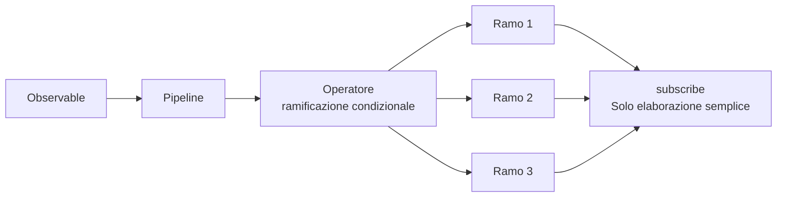
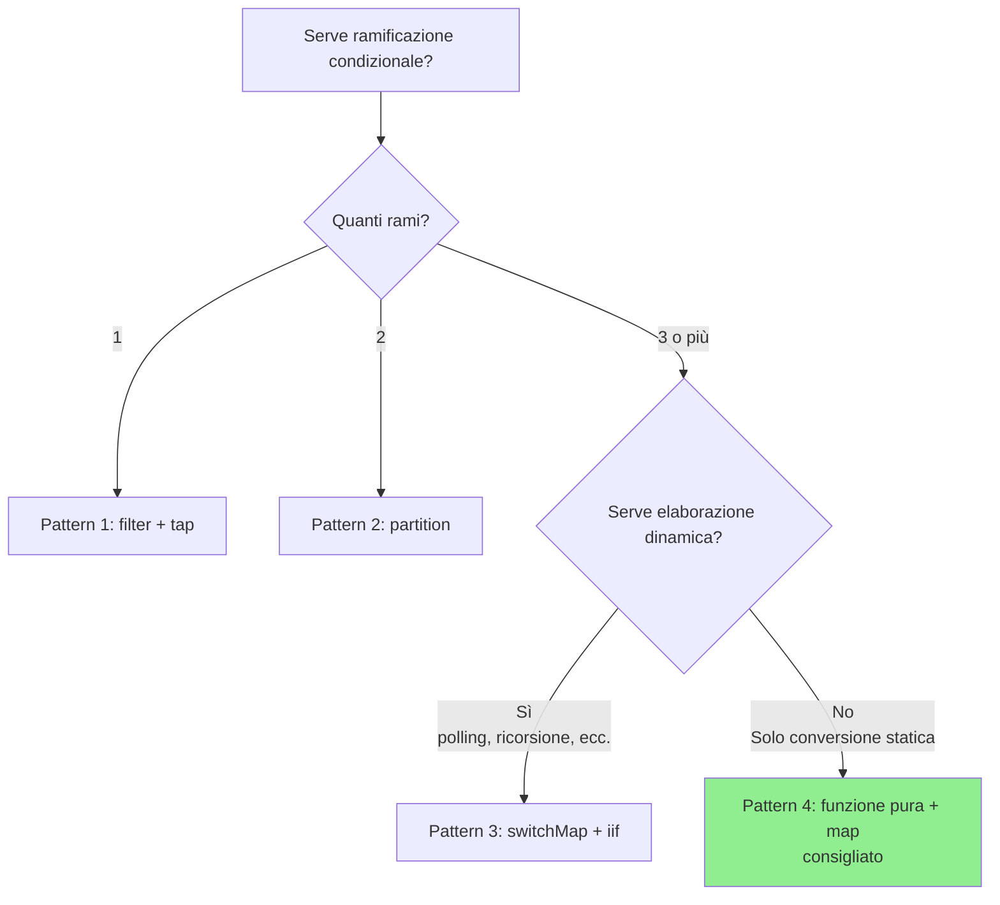

# Pattern di ramificazione condizionale in subscribe

Uno dei problemi più comuni in cui si imbattono gli sviluppatori che iniziano a usare RxJS è la complessa ramificazione condizionale all'interno del callback `subscribe()`. Questo articolo spiega perché questo è un problema e come migliorarlo, insieme a pattern pratici.

> [!NOTE] API pubbliche utilizzate in questo articolo
> Questo articolo utilizza un'API REST gratuita chiamata [JSONPlaceholder](https://jsonplaceholder.typicode.com/). Il codice funziona davvero, quindi potete copiarlo e incollarlo e provarlo nel browser.
>
> Vengono mostrati anche pattern di conversione in tipi di risposta API personalizzati (inclusi `status`, `errorCode`, ecc.) per aiutare nella conversione delle risposte API esterne in tipi interni nei progetti reali.

## Problema: ramificazione condizionale complessa in subscribe

La ramificazione condizionale all'interno di subscribe riduce la leggibilità del codice e lo rende difficile da testare. Prendiamo il seguente esempio.

### Preparazione: funzioni helper per wrappare l'API JSONPlaceholder

Prima di tutto, definiamo una funzione helper che converte la risposta dell'API JSONPlaceholder in un tipo personalizzato. Questo pattern può essere usato anche per convertire un'API esterna in un tipo interno in un progetto reale.

```typescript
import { Observable, from, of, map, catchError } from 'rxjs';

/**
 * Tipo di risposta dell'API JSONPlaceholder
 */
interface Post {
  userId: number;
  id: number;
  title: string;
  body: string;
}

/**
 * Tipo di risposta API personalizzato
 */
interface ApiResponse<T = any> {
  status: 'success' | 'error' | 'pending';
  data?: T;
  errorCode?: string;
  message?: string;
}

/**
 * Wrapper dell'API JSONPlaceholder con conversione in tipo di risposta API personalizzato
 *
 * Il pattern di conversione delle risposte API esterne in tipi interni è spesso usato nei progetti reali.
 * Questo consente di localizzare l'impatto delle modifiche alle API e di utilizzare tipi coerenti all'interno dell'applicazione.
 */
function fetchPost(postId: number = 1): Observable<ApiResponse<Post>> {
  return from(
    fetch(`https://jsonplaceholder.typicode.com/posts/${postId}`)
      .then(response => {
        if (!response.ok) {
          throw new Error(`HTTP error! status: ${response.status}`);
        }
        return response.json();
      })
  ).pipe(
    map((data: Post) => ({
      status: 'success' as const,
      data
    })),
    catchError(err => {
      // Converte l'errore in tipo di risposta personalizzato
      let errorCode = 'UNKNOWN_ERROR';

      if (err.message.includes('404')) {
        errorCode = 'NOT_FOUND';
      } else if (err.message.includes('500')) {
        errorCode = 'SERVER_ERROR';
      } else if (err.message.includes('Failed to fetch')) {
        errorCode = 'NETWORK_ERROR';
      }

      return of({
        status: 'error' as const,
        errorCode,
        message: err.message
      });
    })
  );
}
```

### Esempio di anti-pattern

L'esempio seguente utilizza la funzione helper sopra (`fetchPost`), ma esegue una complessa ramificazione condizionale all'interno di `subscribe()`.

```typescript
/**
 * ❌ Esempio di codice problematico
 * Ramificazione condizionale complessa all'interno di subscribe
 */
class BadExampleManager {
  loading = false;
  data: Post | null = null;
  errorMessage = '';
  successMessage = '';

  // Callback per aggiornamenti UI (opzionale)
  onStateChange?: (state: { loading: boolean; data: Post | null; errorMessage: string; successMessage: string }) => void;

  init(): void {
    this.fetchData();
  }

  fetchData(): void {
    this.loading = true;
    this.updateUI();

    // Ottiene i dati del post dall'API JSONPlaceholder
    fetchPost(1).subscribe({
      next: response => {
        this.loading = false;

        // ❌ Problema: ramificazione condizionale complessa in subscribe
        if (response.status === 'success') {
          if (response.data) {
            // Validazione dei dati
            if (response.data.title && response.data.body) {
              this.data = response.data;
              this.successMessage = `Post "${response.data.title}" caricato`;
            } else {
              this.errorMessage = 'Formato dei dati non valido';
            }
          } else {
            this.errorMessage = 'Nessun dato';
          }
        } else if (response.status === 'error') {
          if (response.errorCode === 'NOT_FOUND') {
            this.errorMessage = 'Dati non trovati (ID post inesistente)';
          } else if (response.errorCode === 'NETWORK_ERROR') {
            this.errorMessage = 'Errore di rete. Controllare la connessione.';
            // Retry
            setTimeout(() => this.fetchData(), 5000);
          } else if (response.errorCode === 'SERVER_ERROR') {
            this.errorMessage = 'Si è verificato un errore del server';
          } else {
            this.errorMessage = 'Si è verificato un errore';
          }
        } else if (response.status === 'pending') {
          this.errorMessage = 'Elaborazione in corso. Attendere un momento.';
          // Polling
          setTimeout(() => this.fetchData(), 3000);
        }
        this.updateUI();
      }
    });
  }

  private updateUI(): void {
    if (this.onStateChange) {
      this.onStateChange({
        loading: this.loading,
        data: this.data,
        errorMessage: this.errorMessage,
        successMessage: this.successMessage
      });
    }
  }
}

// Esempio di utilizzo (eseguibile nella console del browser)
const badExample = new BadExampleManager();
badExample.onStateChange = (state) => {
  if (state.loading) console.log('Caricamento...');
  if (state.errorMessage) console.error(state.errorMessage);
  if (state.successMessage) console.log(state.successMessage);
  if (state.data) console.log('Dati:', state.data);
};
badExample.init();

// Esempio di output:
// Caricamento...
// Post "sunt aut facere repellat provident occaecati excepturi optio reprehenderit" caricato
// Dati: {userId: 1, id: 1, title: "...", body: "..."}
```

### Problemi di questa implementazione

> [!WARNING] Problemi causati dalla ramificazione condizionale in subscribe
> 1. **Ridotta leggibilità** - l'annidamento profondo rende difficile seguire il flusso di elaborazione
> 2. **Difficoltà di test** - la logica in subscribe è difficile da testare unitariamente
> 3. **Mancanza di riusabilità** - la stessa logica non può essere usata altrove
> 4. **Non dichiarativo** - si discosta dallo stile dichiarativo di RxJS
> 5. **Gestione degli effetti collaterali** - i cambiamenti di stato multipli sono dispersi e difficili da tracciare

## Panoramica della soluzione

La ramificazione condizionale in subscribe viene gestita nella pipeline utilizzando gli operatori RxJS. Questo rende il codice dichiarativo e più facile da testare.



Questo articolo descrive quattro pattern:

1. **Pattern 1**: ramificazione con filter + tap
2. **Pattern 2**: ramificazione con partition
3. **Pattern 3**: ramificazione dinamica con switchMap + iif
4. **Pattern 4**: funzionalizzazione + trasformazione con map (consigliato)

## Pattern 1: ramificazione con filter + tap

Il modo più semplice è usare `filter` per passare solo i valori che soddisfano la condizione e `tap` per eseguire gli effetti collaterali.

### Esempio di implementazione

Questo esempio utilizza la funzione `fetchPost()` definita sopra per recuperare i dati dall'API JSONPlaceholder.

```typescript
class Pattern1Manager {
  private destroy$ = new Subject<void>();

  loading = false;
  data: Post | null = null;
  errorMessage = '';

  // Callback per aggiornamenti UI (opzionale)
  onStateChange?: (state: { loading: boolean; data: Post | null; errorMessage: string }) => void;

  init(): void {
    this.fetchData();
  }

  fetchData(): void {
    this.loading = true;
    this.updateUI();

    fetchPost(1).pipe(
      // ✅ Passa solo la risposta di successo
      filter(response => response.status === 'success'),

      // ✅ Validazione dei dati
      filter(response => response.data !== undefined),

      // ✅ Output log (effetto collaterale)
      tap(response => console.log('Acquisizione dati riuscita:', response.data)),

      // Gestione errori
      catchError(err => {
        console.error('Errore:', err);
        this.errorMessage = 'Impossibile acquisire i dati';
        this.loading = false;
        this.updateUI();
        return of(null);
      }),

      takeUntil(this.destroy$)
    ).subscribe({
      next: response => {
        this.loading = false;

        // ✅ Solo assegnazione semplice
        if (response) {
          this.data = response.data;
        }
        this.updateUI();
      }
    });
  }

  private updateUI(): void {
    if (this.onStateChange) {
      this.onStateChange({
        loading: this.loading,
        data: this.data,
        errorMessage: this.errorMessage
      });
    }
  }

  destroy(): void {
    this.destroy$.next();
    this.destroy$.complete();
  }
}

// Esempio di utilizzo (eseguibile nella console del browser)
const pattern1 = new Pattern1Manager();
pattern1.onStateChange = (state) => {
  if (state.loading) console.log('Caricamento...');
  if (state.errorMessage) console.error(state.errorMessage);
  if (state.data) console.log('Dati post:', state.data);
};
pattern1.init();

// Esempio di output:
// Caricamento...
// Acquisizione dati riuscita: {userId: 1, id: 1, title: "...", body: "..."}
// Dati post: {userId: 1, id: 1, title: "...", body: "..."}
```

### Vantaggi e svantaggi

> [!TIP] Caratteristiche del Pattern 1
> **Vantaggi:**
> - Semplice e facile da capire
> - Può filtrare passo dopo passo
> - Ogni passo è chiaro
>
> **Svantaggi:**
> - Non adatto a rami multipli (è necessario creare uno stream per ogni ramo)
> - I valori filtrati non possono essere usati nei passaggi successivi

## Pattern 2: ramificazione con partition

Usando `partition`, un Observable può essere diviso in due stream in base a una condizione.

### Esempio di implementazione

Questo esempio utilizza anche la funzione `fetchPost()` per recuperare i dati dall'API JSONPlaceholder.

```typescript
/**
 * Definizione del tipo di risultato dell'elaborazione
 */
interface ProcessedResult {
  type: 'success' | 'error';
  data?: Post;
  message: string;
}

class Pattern2Manager {
  private destroy$ = new Subject<void>();

  loading = false;
  result: ProcessedResult | null = null;

  // Callback per aggiornamenti UI (opzionale)
  onStateChange?: (state: { loading: boolean; result: ProcessedResult | null }) => void;

  init(): void {
    this.fetchData();
  }

  fetchData(): void {
    this.loading = true;
    this.updateUI();

    const response$ = fetchPost(1).pipe(
      catchError(err => {
        console.error('HTTP Error:', err);
        return EMPTY;
      })
    );

    // ✅ Divide per successo ed errore
    const [success$, error$] = partition(
      response$,
      response => response.status === 'success'
    );

    // Elaborazione dello stream di successo
    const successStream$ = success$.pipe(
      map(response => ({
        type: 'success' as const,
        data: response.data,
        message: 'Dati acquisiti'
      })),
      tap(() => console.log('Elaborazione Success completata'))
    );

    // Elaborazione dello stream di errore
    const errorStream$ = error$.pipe(
      map(response => ({
        type: 'error' as const,
        message: this.getErrorMessage(response.errorCode)
      })),
      tap(result => console.log('Elaborazione Error completata:', result.message))
    );

    // ✅ Unisce i due stream e sottoscrive
    merge(successStream$, errorStream$).pipe(
      takeUntil(this.destroy$)
    ).subscribe({
      next: result => {
        this.loading = false;
        this.result = result;

        // Elaborazione aggiuntiva in base a codici di errore specifici
        if (result.type === 'error') {
          this.handleError(result);
        }
        this.updateUI();
      }
    });
  }

  private getErrorMessage(errorCode?: string): string {
    const messages: Record<string, string> = {
      'NOT_FOUND': 'Dati non trovati (ID post inesistente)',
      'NETWORK_ERROR': 'Errore di rete. Controllare la connessione.',
      'SERVER_ERROR': 'Si è verificato un errore del server'
    };

    return messages[errorCode || ''] || 'Si è verificato un errore';
  }

  private handleError(result: ProcessedResult): void {
    // Elaborazione aggiuntiva a seconda del tipo di errore (es. redirect alla schermata di login)
  }

  private updateUI(): void {
    if (this.onStateChange) {
      this.onStateChange({
        loading: this.loading,
        result: this.result
      });
    }
  }

  destroy(): void {
    this.destroy$.next();
    this.destroy$.complete();
  }
}

// Esempio di utilizzo (eseguibile nella console del browser)
const pattern2 = new Pattern2Manager();
pattern2.onStateChange = (state) => {
  if (state.loading) console.log('Caricamento...');
  if (state.result) {
    console.log(`[${state.result.type}] ${state.result.message}`);
    if (state.result.data) console.log('Dati post:', state.result.data);
  }
};
pattern2.init();

// Esempio di output:
// Caricamento...
// Elaborazione Success completata
// [success] Dati acquisiti
// Dati post: {userId: 1, id: 1, title: "...", body: "..."}
```

### Vantaggi e svantaggi

> [!TIP] Caratteristiche del Pattern 2
> **Vantaggi:**
> - Due rami possono essere chiaramente separati
> - Ogni stream può essere elaborato indipendentemente
> - Facile da testare
>
> **Svantaggi:**
> - Limitato a due rami (non adatto a più di tre)
> - È necessario sottoscrivere entrambi gli stream

## Pattern 3: ramificazione dinamica con switchMap + iif

Con `iif` si può passare a Observable diversi a seconda della condizione.

### Esempio di implementazione

Questo esempio tenta un ID post inesistente (999) e mostra cosa succede in caso di errore.

```typescript
class Pattern3Manager {
  private destroy$ = new Subject<void>();

  loading = false;
  data: Post | null = null;
  statusMessage = '';

  // Callback per aggiornamenti UI (opzionale)
  onStateChange?: (state: { loading: boolean; data: Post | null; statusMessage: string }) => void;

  init(): void {
    // Prova un ID post inesistente (999)
    this.fetchData(999);
  }

  fetchData(postId: number = 1): void {
    this.loading = true;
    this.updateUI();

    fetchPost(postId).pipe(
      // ✅ Elaborazione ramificata in base allo status della risposta
      switchMap(response =>
        iif(
          // Condizione 1: successo
          () => response.status === 'success',
          // Elaborazione in caso di successo
          of(response).pipe(
            map(r => ({ type: 'success' as const, data: r.data })),
            tap(() => console.log('Acquisizione dati riuscita'))
          ),
          // Condizione 2: errore
          // Converte in stream di errore con throwError in caso di errore
          throwError(() => ({
            message: this.getErrorMessage(response.errorCode),
            errorCode: response.errorCode
          }))
        )
      ),
      retry({
        count: 2,
        delay: 1000 // Attende 1 secondo e riprova
      }),
      catchError(err => {
        console.error('Error:', err);
        this.statusMessage = err.message || 'Si è verificato un errore';
        this.loading = false;
        this.updateUI();
        return EMPTY;
      }),
      takeUntil(this.destroy$)
    ).subscribe({
      next: result => {
        this.loading = false;

        if (result.type === 'success') {
          this.data = result.data;
          this.statusMessage = '';
        }
        this.updateUI();
      }
    });
  }

  private getErrorMessage(errorCode?: string): string {
    const messages: Record<string, string> = {
      'NOT_FOUND': 'Dati non trovati (ID post inesistente)',
      'NETWORK_ERROR': 'Errore di rete. Controllare la connessione.',
      'SERVER_ERROR': 'Si è verificato un errore del server'
    };
    return messages[errorCode || ''] || 'Si è verificato un errore';
  }

  private updateUI(): void {
    if (this.onStateChange) {
      this.onStateChange({
        loading: this.loading,
        data: this.data,
        statusMessage: this.statusMessage
      });
    }
  }

  destroy(): void {
    this.destroy$.next();
    this.destroy$.complete();
  }
}

// Esempio di utilizzo (eseguibile nella console del browser)
const pattern3 = new Pattern3Manager();
pattern3.onStateChange = (state) => {
  if (state.loading) console.log('Caricamento...');
  if (state.statusMessage) console.log(state.statusMessage);
  if (state.data) console.log('Dati post:', state.data);
};
pattern3.init();

// Esempio di output (provando l'ID post inesistente 999):
// Caricamento...
// Error: {...}
// Dati non trovati (ID post inesistente)
//
// Se si specifica un ID post normale (1):
// pattern3.fetchData(1);
// Caricamento...
// Acquisizione dati riuscita
// Dati post: {userId: 1, id: 1, title: "...", body: "..."}
```

### Vantaggi e svantaggi

> [!TIP] Caratteristiche del Pattern 3
> **Vantaggi:**
> - Può passare a Observable diversi a seconda delle condizioni
> - Facile da combinare con l'elaborazione di retry
> - Adatto all'elaborazione dinamica (polling, chiamate ricorsive, ecc.)
>
> **Svantaggi:**
> - Possibile perdita di leggibilità con annidamento più profondo
> - Difficile da debuggare
> - Difficile da capire per i principianti
>
> **Nota:** Questo esempio mostra una semplice ramificazione successo/errore, ma in pratica può gestire elaborazioni dinamiche più complesse, come il polling per elaborazioni asincrone compresi gli stati pending.

## Pattern 4: funzionalizzazione + trasformazione con map (consigliato)

Il pattern più consigliato è estrarre la logica condizionale come funzione pura e trasformarla con l'operatore `map`.

### Esempio di implementazione

Questo esempio definisce una funzione pura che trasforma la risposta API restituita da `fetchPost()` in un ViewModel per la visualizzazione UI.

```typescript
/**
 * ViewModel per la visualizzazione UI
 */
interface ViewModel {
  loading: boolean;
  displayData: Post | null;
  messageType: 'success' | 'error' | 'info' | null;
  message: string;
  showRetryButton: boolean;
}

/**
 * ✅ Funzione pura: converte la risposta API in ViewModel
 * Facile da testare, riutilizzabile
 */
function mapResponseToViewModel(response: ApiResponse<Post>): ViewModel {
  // Elaborazione della risposta di successo
  if (response.status === 'success') {
    return {
      loading: false,
      displayData: response.data || null,
      messageType: 'success',
      message: `Post "${response.data?.title}" caricato`,
      showRetryButton: false
    };
  }

  // Elaborazione della risposta di errore
  if (response.status === 'error') {
    const errorMessages: Record<string, string> = {
      'NOT_FOUND': 'Dati non trovati (ID post inesistente)',
      'NETWORK_ERROR': 'Errore di rete. Controllare la connessione.',
      'SERVER_ERROR': 'Si è verificato un errore del server. Attendere un momento e riprovare.'
    };

    const message = errorMessages[response.errorCode || ''] ||
                    response.message ||
                    'Si è verificato un errore';

    return {
      loading: false,
      displayData: null,
      messageType: 'error',
      message,
      showRetryButton: isRetryableError(response.errorCode)
    };
  }

  // Elaborazione della risposta Pending (non generata dall'API JSONPlaceholder, ma per estensione futura)
  if (response.status === 'pending') {
    return {
      loading: true,
      displayData: null,
      messageType: 'info',
      message: 'Elaborazione in corso. Attendere un momento.',
      showRetryButton: false
    };
  }

  // Fallback
  return {
    loading: false,
    displayData: null,
    messageType: 'error',
    message: 'Risposta sconosciuta',
    showRetryButton: false
  };
}

/**
 * ✅ Funzione pura: determina se l'errore è ripetibile
 */
function isRetryableError(errorCode?: string): boolean {
  const retryableErrors = ['NETWORK_ERROR', 'SERVER_ERROR'];
  return retryableErrors.includes(errorCode || '');
}

/**
 * ✅ Funzione pura: restituisce effetti collaterali per errori specifici
 */
function getErrorSideEffect(errorCode?: string): (() => void) | null {
  const sideEffects: Record<string, () => void> = {
    'NETWORK_ERROR': () => {
      console.log('Errore di rete: controllare la connessione');
    },
    'SERVER_ERROR': () => {
      console.log('Errore del server: attendere un momento e riprovare');
    }
  };

  return sideEffects[errorCode || ''] || null;
}

class Pattern4Manager {
  private destroy$ = new Subject<void>();

  viewModel: ViewModel = {
    loading: false,
    displayData: null,
    messageType: null,
    message: '',
    showRetryButton: false
  };

  // Callback per aggiornamenti UI (opzionale)
  onStateChange?: (viewModel: ViewModel) => void;

  init(): void {
    this.fetchData();
  }

  fetchData(postId: number = 1): void {
    // Imposta lo stato di caricamento iniziale
    this.viewModel = {
      loading: true,
      displayData: null,
      messageType: null,
      message: '',
      showRetryButton: false
    };
    this.updateUI();

    fetchPost(postId).pipe(
      // ✅ Converte usando funzione pura nella pipeline
      map(response => mapResponseToViewModel(response)),

      // ✅ Effetti collaterali eseguiti con tap (separati dalla funzione pura)
      tap(viewModel => {
        console.log('ViewModel:', viewModel);
      }),

      // Gestione errori
      catchError(err => {
        console.error('HTTP Error:', err);

        const errorViewModel: ViewModel = {
          loading: false,
          displayData: null,
          messageType: 'error',
          message: 'Si è verificato un errore di rete',
          showRetryButton: true
        };

        return of(errorViewModel);
      }),

      takeUntil(this.destroy$)
    ).subscribe({
      next: viewModel => {
        // ✅ Solo assegnazione semplice in subscribe
        this.viewModel = viewModel;

        // Esegue effetti collaterali in base all'errore specifico
        if (viewModel.messageType === 'error') {
          const sideEffect = getErrorSideEffect(
            // Poiché l'errorCode originale non è mantenuto qui,
            // deve essere aggiunto al ViewModel
          );
          sideEffect?.();
        }
        this.updateUI();
      }
    });
  }

  private updateUI(): void {
    if (this.onStateChange) {
      this.onStateChange(this.viewModel);
    }
  }

  destroy(): void {
    this.destroy$.next();
    this.destroy$.complete();
  }
}

// Esempio di utilizzo (eseguibile nella console del browser)
const pattern4 = new Pattern4Manager();
pattern4.onStateChange = (viewModel) => {
  if (viewModel.loading) console.log('Caricamento...');
  if (viewModel.message) console.log(`[${viewModel.messageType}] ${viewModel.message}`);
  if (viewModel.displayData) console.log('Dati post:', viewModel.displayData);
  if (viewModel.showRetryButton) console.log('Mostra pulsante Riprova');
};
pattern4.init();

// Esempio di output:
// Caricamento...
// ViewModel: {loading: false, displayData: {...}, messageType: "success", message: "Post \"...\" caricato", showRetryButton: false}
// [success] Post "sunt aut facere repellat provident occaecati excepturi optio reprehenderit" caricato
// Dati post: {userId: 1, id: 1, title: "...", body: "..."}
```

### Ulteriore miglioramento: mantenere errorCode

Nell'esempio sopra, `errorCode` non è incluso nel ViewModel, quindi non è possibile determinare gli effetti collaterali. Ecco una versione migliorata.

```typescript
/**
 * ViewModel migliorato (mantiene errorCode)
 */
interface ImprovedViewModel {
  loading: boolean;
  displayData: Post | null;
  messageType: 'success' | 'error' | 'info' | null;
  message: string;
  showRetryButton: boolean;
  errorCode?: string; // ✅ Mantiene errorCode
}

/**
 * Funzione di mapping migliorata
 */
function mapResponseToImprovedViewModel(response: ApiResponse<Post>): ImprovedViewModel {
  if (response.status === 'success') {
    return {
      loading: false,
      displayData: response.data || null,
      messageType: 'success',
      message: `Post "${response.data?.title}" caricato`,
      showRetryButton: false
    };
  }

  if (response.status === 'error') {
    const errorMessages: Record<string, string> = {
      'NOT_FOUND': 'Dati non trovati (ID post inesistente)',
      'NETWORK_ERROR': 'Errore di rete. Controllare la connessione.',
      'SERVER_ERROR': 'Si è verificato un errore del server'
    };

    return {
      loading: false,
      displayData: null,
      messageType: 'error',
      message: errorMessages[response.errorCode || ''] || 'Si è verificato un errore',
      showRetryButton: isRetryableError(response.errorCode),
      errorCode: response.errorCode // ✅ Mantiene errorCode
    };
  }

  if (response.status === 'pending') {
    return {
      loading: true,
      displayData: null,
      messageType: 'info',
      message: 'Elaborazione in corso',
      showRetryButton: false
    };
  }

  return {
    loading: false,
    displayData: null,
    messageType: 'error',
    message: 'Risposta sconosciuta',
    showRetryButton: false
  };
}

class ImprovedPattern4Manager {
  private destroy$ = new Subject<void>();
  viewModel: ImprovedViewModel = {
    loading: false,
    displayData: null,
    messageType: null,
    message: '',
    showRetryButton: false
  };

  // Callback per aggiornamenti UI (opzionale)
  onStateChange?: (viewModel: ImprovedViewModel) => void;

  init(): void {
    this.fetchData();
  }

  fetchData(postId: number = 1): void {
    fetchPost(postId).pipe(
      map(response => mapResponseToImprovedViewModel(response)),
      tap(viewModel => console.log('ViewModel:', viewModel)),
      catchError(err => {
        console.error('HTTP Error:', err);
        return of({
          loading: false,
          displayData: null,
          messageType: 'error' as const,
          message: 'Errore di rete',
          showRetryButton: true
        });
      }),
      takeUntil(this.destroy$)
    ).subscribe({
      next: viewModel => {
        this.viewModel = viewModel;

        // ✅ Esegue effetti collaterali in base a errorCode
        if (viewModel.errorCode) {
          const sideEffect = getErrorSideEffect(viewModel.errorCode);
          sideEffect?.();
        }
        this.updateUI();
      }
    });
  }

  private updateUI(): void {
    if (this.onStateChange) {
      this.onStateChange(this.viewModel);
    }
  }

  destroy(): void {
    this.destroy$.next();
    this.destroy$.complete();
  }
}

// Esempio di utilizzo (eseguibile nella console del browser)
const improvedPattern4 = new ImprovedPattern4Manager();
improvedPattern4.onStateChange = (viewModel) => {
  if (viewModel.loading) console.log('Caricamento...');
  if (viewModel.message) console.log(`[${viewModel.messageType}] ${viewModel.message}`);
  if (viewModel.displayData) console.log('Dati post:', viewModel.displayData);
};
improvedPattern4.init();

// Esempio di output:
// ViewModel: {loading: false, displayData: {...}, messageType: "success", message: "...", showRetryButton: false}
// [success] Post "sunt aut facere repellat provident occaecati excepturi optio reprehenderit" caricato
// Dati post: {userId: 1, id: 1, title: "...", body: "..."}
```

### Vantaggi e svantaggi

> [!TIP] Caratteristiche del Pattern 4 (consigliato)
> **Vantaggi:**
> - **Facile da testare**: la funzione pura rende i test unitari semplici
> - **Riutilizzabile**: la stessa logica può essere usata in altri componenti
> - **Altamente leggibile**: chiara separazione della logica di trasformazione
> - **Type-safe**: l'inferenza dei tipi TypeScript funziona
> - **Altamente manutenibile**: chiaro ambito di impatto quando la logica cambia
>
> **Svantaggi:**
> - Più codice (ma in cambio di maggiore chiarezza)

## Esempio pratico: implementazione completa dell'elaborazione delle risposte API

Ecco un esempio di implementazione pratica che combina i pattern precedenti, utilizzando l'API JSONPlaceholder.

```typescript
/**
 * Definizione del tipo ViewModel
 */
interface DataViewModel<T = any> {
  loading: boolean;
  data: T | null;
  error: {
    message: string;
    code?: string;
    retryable: boolean;
  } | null;
  info: string | null;
}

/**
 * Servizio di acquisizione dati
 */
class DataService {

  /**
   * Acquisizione dati (con supporto auto-retry)
   */
  fetchData<T>(postId: number = 1): Observable<DataViewModel<T>> {
    return fetchPost(postId).pipe(

      // Converte la risposta in ViewModel
      map(response => this.mapToViewModel<T>(response)),

      // Gestione errori HTTP
      catchError((err: Error) =>
        of(this.createErrorViewModel<T>(err))
      ),

      // Gli errori ripetibili vengono ritentati automaticamente
      retry({
        count: 2,
        delay: 1000 // Attende 1 secondo e riprova
      })
    );
  }

  /**
   * Converte la risposta API in ViewModel (funzione pura)
   */
  private mapToViewModel<T>(response: ApiResponse<T>): DataViewModel<T> {
    if (response.status === 'success') {
      return {
        loading: false,
        data: response.data || null,
        error: null,
        info: null
      };
    }

    if (response.status === 'error') {
      return {
        loading: false,
        data: null,
        error: {
          message: this.getErrorMessage(response.errorCode, response.message),
          code: response.errorCode,
          retryable: this.isRetryableError(response.errorCode)
        },
        info: null
      };
    }

    // Pending (non generato dall'API JSONPlaceholder, ma per estensione futura)
    return {
      loading: true,
      data: null,
      error: null,
      info: 'Elaborazione in corso...'
    };
  }

  /**
   * Crea ViewModel da errore HTTP
   */
  private createErrorViewModel<T>(err: Error): DataViewModel<T> {
    return {
      loading: false,
      data: null,
      error: {
        message: err.message || 'Si è verificato un errore',
        code: 'FETCH_ERROR',
        retryable: true
      },
      info: null
    };
  }

  /**
   * Ottiene il messaggio di errore
   */
  private getErrorMessage(errorCode?: string, fallbackMessage?: string): string {
    const messages: Record<string, string> = {
      'NOT_FOUND': 'Dati non trovati (ID post inesistente)',
      'NETWORK_ERROR': 'Errore di rete. Controllare la connessione.',
      'SERVER_ERROR': 'Si è verificato un errore del server'
    };

    return messages[errorCode || ''] || fallbackMessage || 'Si è verificato un errore';
  }

  /**
   * Determina se l'errore è ripetibile
   */
  private isRetryableError(errorCode?: string): boolean {
    const retryable = ['NETWORK_ERROR', 'SERVER_ERROR'];
    return retryable.includes(errorCode || '');
  }
}

/**
 * Manager per la visualizzazione dati
 */
class DataDisplayManager {
  private destroy$ = new Subject<void>();
  private dataService = new DataService();

  viewModel: DataViewModel = {
    loading: false,
    data: null,
    error: null,
    info: null
  };

  // Callback per aggiornamenti UI (opzionale)
  onStateChange?: (viewModel: DataViewModel) => void;

  init(): void {
    this.loadData();
  }

  loadData(postId: number = 1): void {
    this.viewModel = {
      loading: true,
      data: null,
      error: null,
      info: null
    };
    this.updateUI();

    this.dataService.fetchData(postId).pipe(
      takeUntil(this.destroy$)
    ).subscribe({
      next: viewModel => {
        // ✅ Solo semplice assegnazione in subscribe
        this.viewModel = viewModel;
        this.updateUI();
      }
    });
  }

  private updateUI(): void {
    if (this.onStateChange) {
      this.onStateChange(this.viewModel);
    }
  }

  destroy(): void {
    this.destroy$.next();
    this.destroy$.complete();
  }
}

// Esempio di utilizzo (eseguibile nella console del browser)
const dataDisplay = new DataDisplayManager();
dataDisplay.onStateChange = (viewModel) => {
  if (viewModel.loading) console.log('Caricamento...');
  if (viewModel.error) {
    console.error(viewModel.error.message);
    if (viewModel.error.retryable) console.log('Retry disponibile');
  }
  if (viewModel.info) console.log(viewModel.info);
  if (viewModel.data) console.log('Dati post:', viewModel.data);
};
dataDisplay.init();

// Esempio di output:
// Caricamento...
// Dati post: {userId: 1, id: 1, title: "...", body: "..."}
//
// Esempio in caso di errore (specificando ID post inesistente 999):
// dataDisplay.loadData(999);
// Caricamento...
// Dati non trovati (ID post inesistente)
// Retry disponibile
```

> [!IMPORTANT] Punti chiave del pattern pratico
> 1. **Conversione a livello di servizio**: convertire la risposta API in ViewModel a livello di servizio
> 2. **Utilizzare funzioni pure**: estrarre la logica di ramificazione condizionale come funzioni pure
> 3. **Semplice in subscribe**: fare solo assegnazioni quando si sottoscrive
> 4. **Centralizzare la gestione errori**: completare la gestione errori nella pipeline
> 5. **Garantire la type safety**: garantire la sicurezza nelle definizioni dei tipi del ViewModel

## Linee guida per la selezione

Ecco alcune linee guida per scenario su quale pattern scegliere.



### Criteri di selezione del pattern

| Scenario | Pattern consigliato | Motivo |
|---------|------------|------|
| Filtraggio semplice | Pattern 1 (filter + tap) | Semplice e facile da capire |
| Due rami successo/fallimento | Pattern 2 (partition) | Possibile separazione netta |
| Polling e retry | Pattern 3 (switchMap + iif) | Supporta elaborazione dinamica |
| Ramificazione condizionale complessa | Pattern 4 (funzione pura + map) | Testabile, riutilizzabile |
| Richiede gestione stato | Pattern 4 (funzione pura + map) | Adatto ai pattern ViewModel |

> [!TIP] In caso di dubbio, scegli **Pattern 4 (funzione pura + map)**
> - Più manutenibile
> - Più facile da testare
> - Adatto allo sviluppo in team
> - Compatibile con il sistema di tipi TypeScript

## Riepilogo

Eseguire complesse ramificazioni condizionali all'interno di subscribe è uno degli anti-pattern di RxJS. Utilizzando i quattro pattern descritti in questo articolo, puoi scrivere codice dichiarativo e manutenibile.

### Principi chiave

> [!IMPORTANT] Principi per evitare la ramificazione condizionale in subscribe
> 1. **La logica è gestita nella pipeline** - completare la trasformazione prima di subscribe
> 2. **Utilizzare funzioni pure** - estrarre la logica di ramificazione condizionale come funzioni
> 3. **Adottare il pattern ViewModel** - convertire in un modello per la visualizzazione UI
> 4. **Separare gli effetti collaterali con tap** - separare chiaramente le trasformazioni pure dagli effetti collaterali
> 5. **Garantire la type safety** - sfruttare al meglio il sistema di tipi TypeScript

### Confronto Before / After

**Before (anti-pattern):**
```typescript
observable$.subscribe(value => {
  if (value.status === 'success') {
    if (value.data) {
      this.data = value.data;
    }
  } else if (value.status === 'error') {
    if (value.errorCode === 'AUTH_ERROR') {
      // ...
    } else if (value.errorCode === 'NOT_FOUND') {
      // ...
    }
  }
});
```

**After (pattern consigliato):**
```typescript
observable$.pipe(
  map(response => mapToViewModel(response)),
  tap(viewModel => console.log('Processed:', viewModel))
).subscribe(viewModel => {
  this.viewModel = viewModel;
});
```

### Sezioni correlate

- **[Anti-pattern RxJS](/it/guide/anti-patterns/)** - Errori comuni e soluzioni
- **[Gestione degli errori](/it/guide/error-handling/strategies.md)** - Basi della gestione degli errori
- **[Pattern di chiamata API](/it/guide/practical-patterns/api-calls.md)** - Pattern pratici per la comunicazione API
- **[Pattern di gestione form](/it/guide/practical-patterns/form-handling.md)** - Ramificazione condizionale nei form

## Codice di test

Ecco un esempio di test per il Pattern 4 (funzione pura + map).

```typescript
describe('mapResponseToViewModel', () => {
  it('should map success response correctly', () => {
    const response: ApiResponse = {
      status: 'success',
      data: { id: 1, name: 'Test' }
    };

    const result = mapResponseToViewModel(response);

    expect(result.loading).toBe(false);
    expect(result.displayData).toEqual({ id: 1, name: 'Test' });
    expect(result.messageType).toBe('success');
    expect(result.showRetryButton).toBe(false);
  });

  it('should map error response with retryable error', () => {
    const response: ApiResponse = {
      status: 'error',
      errorCode: 'RATE_LIMIT'
    };

    const result = mapResponseToViewModel(response);

    expect(result.loading).toBe(false);
    expect(result.displayData).toBeNull();
    expect(result.messageType).toBe('error');
    expect(result.showRetryButton).toBe(true); // RATE_LIMIT è ripetibile
  });

  it('should map error response with non-retryable error', () => {
    const response: ApiResponse = {
      status: 'error',
      errorCode: 'NOT_FOUND'
    };

    const result = mapResponseToViewModel(response);

    expect(result.showRetryButton).toBe(false); // NOT_FOUND non è ripetibile
  });

  it('should map pending response', () => {
    const response: ApiResponse = {
      status: 'pending'
    };

    const result = mapResponseToViewModel(response);

    expect(result.loading).toBe(true);
    expect(result.messageType).toBe('info');
  });
});

describe('isRetryableError', () => {
  it('should identify retryable errors', () => {
    expect(isRetryableError('RATE_LIMIT')).toBe(true);
    expect(isRetryableError('TIMEOUT')).toBe(true);
    expect(isRetryableError('SERVER_ERROR')).toBe(true);
  });

  it('should identify non-retryable errors', () => {
    expect(isRetryableError('NOT_FOUND')).toBe(false);
    expect(isRetryableError('AUTH_ERROR')).toBe(false);
    expect(isRetryableError('VALIDATION_ERROR')).toBe(false);
  });
});
```

> [!TIP] Perché le funzioni pure sono più facili da testare
> - Indipendenti dallo stato esterno
> - Lo stesso input restituisce sempre lo stesso output
> - Nessun effetto collaterale
> - Non servono mock o spy

## Risorse di riferimento

Ulteriori risorse di apprendimento per evitare la ramificazione condizionale in subscribe.

- [Documentazione ufficiale RxJS - Operators](https://rxjs.dev/guide/operators) - Come usare gli operatori
- [Learn RxJS - Transformation Operators](https://www.learnrxjs.io/learn-rxjs/operators/transformation) - Dettagli sugli operatori di trasformazione
- [Learn RxJS - partition](https://www.learnrxjs.io/learn-rxjs/operators/transformation/partition) - Esempi di utilizzo di partition
- [RxJS Best Practices](https://blog.angular-university.io/rxjs-best-practices/) - Best practice per RxJS
