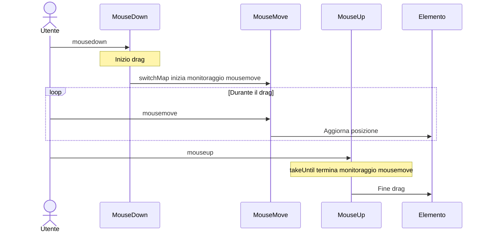

# Pattern di elaborazione degli eventi UI

La gestione degli eventi dell'interfaccia utente è una delle sfide più frequenti nello sviluppo front-end. Con RxJS è possibile implementare la gestione di eventi complessi in modo dichiarativo e intuitivo.

Questo articolo descrive pattern specifici di gestione degli eventi dell'interfaccia utente necessari nella pratica, come clic, scorrimento, drag & drop e input da tastiera.

## Cosa imparerete in questo articolo

- Controllo degli eventi click (throttle, debounce, distinct)
- Gestione efficiente degli eventi di scroll
- Implementazione del drag & drop
- Input da tastiera e completamento automatico
- Supporto multi-touch
- Combinazione di eventi compositi

> [!TIP] Prerequisiti
> Questo articolo presuppone la conoscenza del [Capitolo 4: Operatori](/it/guide/operators/index.md). In particolare, è importante la comprensione di `debounceTime`, `throttleTime` e `distinctUntilChanged`.

## Gestione degli eventi click

### Problema: esecuzione eccessiva a causa di clic ripetuti

I clic consecutivi su un pulsante possono provocare un'elaborazione ripetuta, causando problemi di prestazioni e bug.

### Soluzione 1: controllo con throttleTime

Elabora solo il primo clic entro un certo periodo di tempo.

```ts
import { fromEvent, throttleTime } from 'rxjs';
const button = document.createElement('button');
button.id = 'submit-button';
button.innerText = 'submit';
document.body.appendChild(button);

if (button) {
  fromEvent(button, 'click').pipe(
    throttleTime(1000) // Elabora solo una volta al secondo
  ).subscribe(() => {
    console.log('Esecuzione invio');
    submitForm();
  });
}

function submitForm(): void {
  console.log('Invio form in corso...');
  // Chiamata API, ecc.
}
```

#### Flusso di esecuzione

```
Clic dell'utente:    ●    ●●●        ●  ●●
                     |    |          |  |
throttleTime(1000):  ●              ●
                     |              |
                    Elabora       Elabora
```

> [!NOTE] Caratteristiche di throttleTime
> - Elabora il **primo evento** e ignora gli eventi successivi per un certo periodo
> - Adatto quando il tempo reale è importante (scroll, resize, ecc.)

### Soluzione 2: controllo con debounceTime

Elabora dopo un certo tempo dall'interruzione degli eventi.

```ts
import { fromEvent, debounceTime } from 'rxjs';

const searchInput = document.createElement('input');
searchInput.id = 'search';
searchInput.type = 'text';
searchInput.placeholder = 'Inserisci parola chiave...';
searchInput.style.padding = '8px';
searchInput.style.margin = '10px';
searchInput.style.width = '300px';
document.body.appendChild(searchInput);

fromEvent(searchInput, 'input').pipe(
  debounceTime(300) // Attendi 300ms dopo l'interruzione dell'input
).subscribe((event) => {
  const value = (event.target as HTMLInputElement).value;
  console.log('Esegui ricerca:', value);
  performSearch(value);
});

function performSearch(query: string): void {
  console.log('Ricerca in corso...', query);
  // Chiamata API di ricerca
}
```

#### Flusso di esecuzione

```
Input dell'utente:   ●●●●●     ●●        ●●●●
                          |            |      |
debounceTime(300):       300ms       300ms  300ms attesa
                          |            |      |
                        Elabora     Elabora  Elabora
```

> [!NOTE] Caratteristiche di debounceTime
> - Attende un certo tempo dopo l'**ultimo evento** prima di elaborare
> - Adatto per ricerca, autocompletamento, validazione in tempo reale

### throttleTime vs debounceTime: quando usarli

| Uso | Operatore da usare | Motivo |
|-----|-------------------|------|
| **Input di ricerca** | `debounceTime` | Voglio cercare dopo che l'input si è fermato |
| **Autocompletamento** | `debounceTime` | Mostrare i suggerimenti dopo l'interruzione dell'input |
| **Eventi di scroll** | `throttleTime` | Voglio elaborare periodicamente durante lo scroll |
| **Ridimensionamento finestra** | `throttleTime` o `debounceTime` | Dipende dai requisiti |
| **Prevenire clic ripetuti** | `throttleTime` o `exhaustMap` | Elaborare il primo clic immediatamente |

### Soluzione 3: deduplicazione con distinctUntilChanged

Confronta con il valore precedente e salta l'elaborazione se i valori consecutivi sono uguali.

```ts
import { fromEvent, map, debounceTime, distinctUntilChanged } from 'rxjs';
const searchInput = document.createElement('input');
searchInput.id = 'search';
searchInput.type = 'text';
searchInput.placeholder = 'Inserisci parola chiave...';
searchInput.style.padding = '8px';
searchInput.style.margin = '10px';
searchInput.style.width = '300px';
document.body.appendChild(searchInput);

fromEvent(searchInput, 'input').pipe(
  map(event => (event.target as HTMLInputElement).value.trim()),
  debounceTime(300),
  distinctUntilChanged() // Ignora se uguale al precedente
).subscribe(query => {
  console.log('Esegui ricerca:', query);
  performSearch(query);
});
```

#### Esempio di esecuzione

```ts
// Input utente: "RxJS" → Backspace → "RxJS"
// Senza distinctUntilChanged: ricerca eseguita 2 volte
// Con distinctUntilChanged: ricerca eseguita 1 volta (la seconda viene saltata perché è lo stesso valore)
```

> [!TIP] Best Practice
> Per l'implementazione di ricerca e autocompletamento, si raccomanda di usare questi 3 operatori insieme:
> 1. `debounceTime()` - Attendere l'interruzione dell'input
> 2. `distinctUntilChanged()` - Deduplicazione
> 3. `switchMap()` - Annullare le vecchie richieste

## Elaborazione eventi di scroll

### Problema: attivazione eccessiva degli eventi di scroll

Gli eventi di scroll si attivano molto frequentemente e possono causare problemi di prestazioni se elaborati direttamente.

### Soluzione: ridurre con throttleTime

```ts
import { fromEvent, throttleTime, map } from 'rxjs';
const scrollContainer = document.createElement('div');
scrollContainer.id = 'scroll-container';
scrollContainer.style.width = '400px';
scrollContainer.style.height = '300px';
scrollContainer.style.overflow = 'auto';
scrollContainer.style.border = '1px solid #ccc';
scrollContainer.style.margin = '10px';
scrollContainer.style.padding = '10px';

// Aggiungere contenuto per renderlo scrollabile
scrollContainer.innerHTML = Array.from({ length: 100 }, (_, i) =>
  `<p>Elemento ${i + 1}</p>`
).join('');

document.body.appendChild(scrollContainer);

fromEvent(scrollContainer, 'scroll').pipe(
  throttleTime(100), // Elabora solo una volta ogni 100ms
  map(() => ({
    scrollTop: scrollContainer.scrollTop,
    scrollHeight: scrollContainer.scrollHeight,
    clientHeight: scrollContainer.clientHeight
  }))
).subscribe(({ scrollTop, scrollHeight, clientHeight }) => {
  // Calcolo della posizione di scroll
  const scrollPercentage = (scrollTop / (scrollHeight - clientHeight)) * 100;
  console.log(`Posizione scroll: ${scrollPercentage.toFixed(1)}%`);

  // Scroll infinito: carica la pagina successiva quando lo scroll supera il 90%
  if (scrollPercentage > 90) {
    console.log('Caricamento pagina successiva...');
    loadMoreItems();
  }
});

function loadMoreItems(): void {
  console.log('Recupero dati aggiuntivi');
}
```

### Esempio pratico: rilevamento della direzione di scroll

```ts
import { fromEvent, BehaviorSubject, throttleTime, map, pairwise, distinctUntilChanged } from 'rxjs';
type ScrollDirection = 'up' | 'down' | 'none';

const scrollDirection$ = new BehaviorSubject<ScrollDirection>('none');

// Creare l'elemento header dinamicamente
const header = document.createElement('div');
header.id = 'header';
header.innerText = 'Header (mostra/nascondi con lo scroll)';
header.style.position = 'fixed';
header.style.top = '0';
header.style.left = '0';
header.style.width = '100%';
header.style.padding = '20px';
header.style.background = '#333';
header.style.color = '#fff';
header.style.transition = 'transform 0.3s';
document.body.appendChild(header);

// Aggiungere contenuto scrollabile
const scrollContent = document.createElement('div');
scrollContent.style.marginTop = '80px';
scrollContent.innerHTML = Array.from({ length: 100 }, (_, i) =>
  `<p>Contenuto ${i + 1}</p>`
).join('');
document.body.appendChild(scrollContent);

fromEvent(window, 'scroll').pipe(
  throttleTime(100),
  map(() => window.scrollY),
  pairwise(), // Ottieni i valori precedente e attuale come coppia
  map(([prev, curr]) => {
    if (curr > prev) return 'down';
    if (curr < prev) return 'up';
    return 'none';
  }),
  distinctUntilChanged() // Notifica solo quando la direzione cambia
).subscribe(direction => {
  scrollDirection$.next(direction);
  console.log('Direzione scroll:', direction);

  // Mostra/nascondi header
  if (direction === 'down') {
    header.style.transform = 'translateY(-100%)';
  } else if (direction === 'up') {
    header.style.transform = 'translateY(0)';
  }
});
```

> [!TIP] Utilizzo di pairwise
> `pairwise()` è un operatore conveniente che permette di ottenere i valori precedente e attuale come coppia. Può essere usato per determinare la direzione di scroll, l'aumento/diminuzione dei valori, calcolare differenze, ecc.

## Implementazione drag & drop

### Problema: combinazioni complesse di eventi del mouse

Il drag & drop è una combinazione complessa di eventi mousedown → mousemove → mouseup.

### Soluzione: combinare più Observable

```ts
import { fromEvent, merge, map, switchMap, takeUntil, tap } from 'rxjs';
interface Position {
  x: number;
  y: number;
}

const draggableElement = document.createElement('div');
draggableElement.id = 'draggable';
draggableElement.innerText = 'Trascinami';
draggableElement.style.position = 'absolute';
draggableElement.style.left = '100px';
draggableElement.style.top = '100px';
draggableElement.style.width = '150px';
draggableElement.style.height = '150px';
draggableElement.style.padding = '20px';
draggableElement.style.background = '#4CAF50';
draggableElement.style.color = '#fff';
draggableElement.style.cursor = 'move';
draggableElement.style.userSelect = 'none';
draggableElement.style.display = 'flex';
draggableElement.style.alignItems = 'center';
draggableElement.style.justifyContent = 'center';
document.body.appendChild(draggableElement);

const mouseDown$ = fromEvent<MouseEvent>(draggableElement, 'mousedown');
const mouseMove$ = fromEvent<MouseEvent>(document, 'mousemove');
const mouseUp$ = fromEvent<MouseEvent>(document, 'mouseup');

// Ottieni la posizione dell'elemento all'inizio del drag
let initialX = 0;
let initialY = 0;

mouseDown$.pipe(
  tap((event: MouseEvent) => {
    event.preventDefault();
    // Registra la posizione attuale dell'elemento
    const rect = draggableElement.getBoundingClientRect();
    initialX = rect.left;
    initialY = rect.top;

    // Differenza con la posizione del mouse all'inizio del drag
    initialX = rect.left - event.clientX;
    initialY = rect.top - event.clientY;

    draggableElement.style.opacity = '0.7';
  }),
  switchMap(() =>
    // Quando si verifica mousedown, inizia a monitorare mousemove
    mouseMove$.pipe(
      map((event: MouseEvent): Position => ({
        x: event.clientX + initialX,
        y: event.clientY + initialY
      })),
      // Termina il monitoraggio con mouseup o mouseleave
      takeUntil(
        merge(
          mouseUp$,
          fromEvent(document, 'mouseleave')
        ).pipe(
          tap(() => {
            draggableElement.style.opacity = '1';
          })
        )
      )
    )
  )
).subscribe((position: Position) => {
  // Sposta l'elemento
  draggableElement.style.left = `${position.x}px`;
  draggableElement.style.top = `${position.y}px`;
});
```

#### Flusso degli eventi



> [!IMPORTANT] Punti importanti per il drag & drop
> - `switchMap` per iniziare il monitoraggio mousedown → mousemove
> - `takeUntil` per terminare il monitoraggio al mouseup
> - `preventDefault()` per disabilitare il comportamento di drag predefinito
> - `classList.add/remove` per feedback visivo

### Supporto dispositivi touch

```ts
import { fromEvent, merge, map, switchMap, takeUntil, tap } from 'rxjs';
const draggableElement = document.createElement('div');
draggableElement.id = 'draggable';
draggableElement.innerText = 'Trascinami\n(mouse e touch)';
draggableElement.style.position = 'absolute';
draggableElement.style.left = '100px';
draggableElement.style.top = '100px';
draggableElement.style.width = '150px';
draggableElement.style.height = '150px';
draggableElement.style.padding = '20px';
draggableElement.style.background = '#2196F3';
draggableElement.style.color = '#fff';
draggableElement.style.cursor = 'move';
draggableElement.style.userSelect = 'none';
draggableElement.style.display = 'flex';
draggableElement.style.alignItems = 'center';
draggableElement.style.justifyContent = 'center';
draggableElement.style.textAlign = 'center';
draggableElement.style.whiteSpace = 'pre-line';
document.body.appendChild(draggableElement);

// Integrare eventi mouse e touch
const start$ = merge(
  fromEvent<MouseEvent>(draggableElement, 'mousedown').pipe(
    map(e => ({ x: e.clientX, y: e.clientY, event: e }))
  ),
  fromEvent<TouchEvent>(draggableElement, 'touchstart').pipe(
    map(e => ({
      x: e.touches[0].clientX,
      y: e.touches[0].clientY,
      event: e
    }))
  )
);

const move$ = merge(
  fromEvent<MouseEvent>(document, 'mousemove').pipe(
    map(e => ({ x: e.clientX, y: e.clientY }))
  ),
  fromEvent<TouchEvent>(document, 'touchmove').pipe(
    map(e => ({
      x: e.touches[0].clientX,
      y: e.touches[0].clientY
    }))
  )
);

const end$ = merge(
  fromEvent(document, 'mouseup'),
  fromEvent(document, 'touchend')
);

let initialOffsetX = 0;
let initialOffsetY = 0;

start$.pipe(
  tap(({ x, y, event }) => {
    event.preventDefault();
    const rect = draggableElement.getBoundingClientRect();
    initialOffsetX = rect.left - x;
    initialOffsetY = rect.top - y;
    draggableElement.style.opacity = '0.7';
  }),
  switchMap(() =>
    move$.pipe(
      map(({ x, y }) => ({
        x: x + initialOffsetX,
        y: y + initialOffsetY
      })),
      takeUntil(
        end$.pipe(
          tap(() => {
            draggableElement.style.opacity = '1';
          })
        )
      )
    )
  )
).subscribe(({ x, y }) => {
  draggableElement.style.left = `${x}px`;
  draggableElement.style.top = `${y}px`;
});
```

> [!TIP] Supporto multi-dispositivo
> Usando `merge` per integrare eventi mouse e touch, puoi implementare un drag & drop che funziona su PC/tablet/smartphone.

## Input da tastiera e autocompletamento

### Problema: chiamate API eccessive durante l'input

Quando le chiamate API vengono effettuate in risposta all'input da tastiera, come nella casella di ricerca, chiamarle ogni volta può causare problemi di prestazioni.

Ad esempio, quando l'utente digita "RxJS":
- `R` → Chiamata API
- `Rx` → Chiamata API
- `RxJ` → Chiamata API
- `RxJS` → Chiamata API

4 caratteri di input causano 4 chiamate API. Questo è uno spreco e carica anche il server.

### Soluzione: debounceTime + switchMap

Per implementare l'autocompletamento in modo efficiente, combina questi 3 operatori:

1. **debounceTime(300)** - Attendi 300ms dopo che l'utente ha smesso di digitare
2. **distinctUntilChanged()** - Ignora se il valore è uguale al precedente (previene richieste inutili)
3. **switchMap()** - Annulla la vecchia richiesta quando arriva un nuovo input

Con questa combinazione, l'API viene chiamata solo una volta dopo l'interruzione dell'input, anche se l'utente digita "RxJS" velocemente.

```ts
import { fromEvent, of, map, debounceTime, distinctUntilChanged, switchMap, catchError } from 'rxjs';
interface SearchResult {
  id: number;
  title: string;
  description: string;
}

const searchInput = document.createElement('input');
searchInput.id = 'search';
searchInput.type = 'text';
searchInput.placeholder = 'Ricerca con autocompletamento...';
searchInput.style.padding = '10px';
searchInput.style.margin = '10px';
searchInput.style.width = '400px';
searchInput.style.fontSize = '16px';
document.body.appendChild(searchInput);

const resultsContainer = document.createElement('div');
resultsContainer.id = 'results';
resultsContainer.style.margin = '10px';
resultsContainer.style.padding = '10px';
resultsContainer.style.border = '1px solid #ddd';
resultsContainer.style.width = '400px';
resultsContainer.style.minHeight = '100px';
document.body.appendChild(resultsContainer);

fromEvent(searchInput, 'input').pipe(
  map(event => (event.target as HTMLInputElement).value.trim()),
  debounceTime(300),           // Attendi 300ms dopo l'interruzione
  distinctUntilChanged(),      // Ignora se uguale al precedente
  switchMap(query => {
    if (query.length < 2) {
      return of([]); // Array vuoto se meno di 2 caratteri
    }

    console.log('Esegui ricerca:', query);
    return searchAPI(query).pipe(
      catchError(err => {
        console.error('Errore ricerca:', err);
        return of([]);
      })
    );
  })
).subscribe(results => {
  displayResults(results);
});

// API di ricerca (mock)
function searchAPI(query: string) {
  return of([
    { id: 1, title: `Risultato 1: ${query}`, description: 'Descrizione 1' },
    { id: 2, title: `Risultato 2: ${query}`, description: 'Descrizione 2' },
    { id: 3, title: `Risultato 3: ${query}`, description: 'Descrizione 3' }
  ]);
}

function displayResults(results: SearchResult[]): void {
  if (results.length === 0) {
    resultsContainer.innerHTML = '<p>Nessun risultato trovato</p>';
    return;
  }

  resultsContainer.innerHTML = results
    .map(
      r => `
      <div class="result-item" style="padding: 10px; border-bottom: 1px solid #eee;">
        <h3 style="margin: 0 0 5px 0;">${r.title}</h3>
        <p style="margin: 0; color: #666;">${r.description}</p>
      </div>
    `
    )
    .join('');
}
```

> [!IMPORTANT] Importanza di switchMap
> Se usi `mergeMap` invece di `switchMap`, le vecchie richieste continuano a essere eseguite. Di conseguenza, i risultati di richieste lente potrebbero essere visualizzati dopo, causando un comportamento UI innaturale.
>
> - ❌ **mergeMap**: "Rx"(lento) → "RxJS"(veloce) → Risultato "RxJS" → Risultato "Rx" (sovrascrive con vecchio risultato)
> - ✅ **switchMap**: "Rx"(annullato) → "RxJS"(eseguito) → Solo risultato "RxJS" visualizzato

### Esempio pratico: scorciatoie da tastiera

```ts
import { fromEvent, filter, map } from 'rxjs';
// Ctrl+S per salvare
fromEvent<KeyboardEvent>(document, 'keydown').pipe(
  filter(event => event.ctrlKey && event.key === 's'),
  map(event => {
    event.preventDefault();
    return event;
  })
).subscribe(() => {
  console.log('Esecuzione salvataggio');
  saveDocument();
});

// Ctrl+K per mostrare palette comandi
fromEvent<KeyboardEvent>(document, 'keydown').pipe(
  filter(event => event.ctrlKey && event.key === 'k'),
  map(event => {
    event.preventDefault();
    return event;
  })
).subscribe(() => {
  console.log('Mostra palette comandi');
  showCommandPalette();
});

function saveDocument(): void {
  console.log('Salvataggio documento...');
}

function showCommandPalette(): void {
  console.log('Visualizzazione palette comandi');
}
```

### Combinazione di tasti multipli

```ts
import { fromEvent, buffer, debounceTime, map, filter } from 'rxjs';
// Doppio Escape per chiudere il modal
const keydown$ = fromEvent<KeyboardEvent>(document, 'keydown');

keydown$.pipe(
  filter(event => event.key === 'Escape'),
  buffer(keydown$.pipe(debounceTime(300))), // Raggruppa input consecutivi entro 300ms
  filter(events => events.length >= 2), // Premuto 2 o più volte
  map(() => true)
).subscribe(() => {
  console.log('Chiudi modal (doppio Escape)');
  closeAllModals();
});

function closeAllModals(): void {
  console.log('Chiudi tutti i modal');
}
```

> [!TIP] Best practice per scorciatoie da tastiera
> - `preventDefault()` per prevenire il comportamento predefinito
> - `event.ctrlKey`, `event.shiftKey`, `event.altKey` per determinare i tasti modificatori
> - `filter` per elaborare solo tasti specifici
> - Dare priorità a scorciatoie familiari all'utente (Ctrl+S, ecc.)

## Supporto multi-touch

### Problema: pinch zoom e gesti multi-touch

Vogliamo implementare pinch zoom e gesti multi-touch su tablet e smartphone.

### Soluzione: monitorare gli eventi touch

```ts
import { fromEvent, map, pairwise } from 'rxjs';
const imageElement = document.createElement('img');
imageElement.id = 'zoomable-image';
imageElement.src = 'data:image/svg+xml,%3Csvg xmlns="http://www.w3.org/2000/svg" width="300" height="300"%3E%3Crect width="300" height="300" fill="%234CAF50"/%3E%3Ctext x="50%25" y="50%25" text-anchor="middle" dy=".3em" fill="white" font-size="20"%3EPinch Zoom%3C/text%3E%3C/svg%3E';
imageElement.style.width = '300px';
imageElement.style.height = '300px';
imageElement.style.margin = '20px';
imageElement.style.touchAction = 'none';
imageElement.style.userSelect = 'none';
imageElement.style.transition = 'transform 0.1s';
document.body.appendChild(imageElement);

let initialDistance = 0;
let currentScale = 1;

fromEvent<TouchEvent>(imageElement, 'touchstart').pipe(
  map(event => {
    if (event.touches.length === 2) {
      // Calcola la distanza tra 2 punti
      const touch1 = event.touches[0];
      const touch2 = event.touches[1];
      return getDistance(touch1, touch2);
    }
    return 0;
  })
).subscribe(distance => {
  initialDistance = distance;
});

fromEvent<TouchEvent>(imageElement, 'touchmove').pipe(
  map(event => {
    event.preventDefault();
    if (event.touches.length === 2) {
      const touch1 = event.touches[0];
      const touch2 = event.touches[1];
      return getDistance(touch1, touch2);
    }
    return 0;
  }),
  pairwise()
).subscribe(([prev, curr]) => {
  if (initialDistance > 0 && curr > 0) {
    // Cambia la scala in base alla quantità di pinch
    const scaleDelta = curr / initialDistance;
    const newScale = currentScale * scaleDelta;

    // Limita la scala (0.5x ~ 3x)
    const clampedScale = Math.max(0.5, Math.min(3, newScale));

    imageElement.style.transform = `scale(${clampedScale})`;
  }
});

fromEvent<TouchEvent>(imageElement, 'touchend').subscribe(() => {
  // Registra la scala corrente
  const transform = imageElement.style.transform;
  const match = transform.match(/scale\(([^)]+)\)/);
  if (match) {
    currentScale = parseFloat(match[1]);
  }
});

// Calcola la distanza tra 2 punti
function getDistance(touch1: Touch, touch2: Touch): number {
  const dx = touch2.clientX - touch1.clientX;
  const dy = touch2.clientY - touch1.clientY;
  return Math.sqrt(dx * dx + dy * dy);
}
```

> [!NOTE] Punti di implementazione del pinch zoom
> - `touches.length === 2` per determinare il tocco a due dita
> - `touchstart` per registrare la distanza iniziale
> - `touchmove` per calcolare la distanza corrente e aggiornare la scala
> - `pairwise()` per calcolare la differenza rispetto al precedente
> - Limitare l'intervallo della scala per migliorare l'usabilità

## Pattern di eventi compositi

### Esempio pratico: rilevamento pressione prolungata

```ts
import { fromEvent, race, timer, switchMap, takeUntil, tap } from 'rxjs';
const button = document.createElement('button');
button.id = 'long-press-button';
button.innerText = 'Tieni premuto';
button.style.padding = '15px 30px';
button.style.margin = '10px';
button.style.fontSize = '16px';
button.style.cursor = 'pointer';
document.body.appendChild(button);

const mouseDown$ = fromEvent(button, 'mousedown');
const mouseUp$ = fromEvent(document, 'mouseup');

mouseDown$.pipe(
  switchMap(() =>
    // Gara tra attendere 500ms e mouseup
    race(
      timer(500).pipe(
        tap(() => console.log('Pressione prolungata rilevata!'))
      ),
      mouseUp$.pipe(
        tap(() => console.log('Clic normale'))
      )
    ).pipe(
      takeUntil(mouseUp$)
    )
  )
).subscribe(() => {
  console.log('Evento completato');
});
```

### Esempio pratico: rilevamento doppio clic

```ts
import { fromEvent, buffer, debounceTime, map, filter } from 'rxjs';
const element = document.createElement('div');
element.id = 'double-click-target';
element.innerText = 'Doppio clic qui';
element.style.padding = '40px';
element.style.margin = '10px';
element.style.background = '#FF9800';
element.style.color = '#fff';
element.style.cursor = 'pointer';
element.style.userSelect = 'none';
element.style.display = 'inline-block';
document.body.appendChild(element);

const click$ = fromEvent(element, 'click');

click$.pipe(
  buffer(click$.pipe(debounceTime(250))), // Raggruppa clic entro 250ms
  map(clicks => clicks.length),
  filter(count => count === 2) // Solo doppio clic
).subscribe(() => {
  console.log('Doppio clic rilevato!');
  handleDoubleClick();
});

function handleDoubleClick(): void {
  console.log('Elaborazione doppio clic');
}
```

### Esempio pratico: visualizzazione ritardata su hover

```ts
import { fromEvent, timer, switchMap, takeUntil, mapTo } from 'rxjs';

const target = document.createElement('div');
target.id = 'hover-target';
target.innerText = 'Passa il mouse qui';
target.style.padding = '20px';
target.style.margin = '10px';
target.style.background = '#9C27B0';
target.style.color = '#fff';
target.style.display = 'inline-block';
target.style.cursor = 'pointer';
target.style.userSelect = 'none';
document.body.appendChild(target);

const tooltip = document.createElement('div');
tooltip.id = 'tooltip';
tooltip.innerText = 'Tooltip';
tooltip.style.position = 'absolute';
tooltip.style.padding = '10px';
tooltip.style.background = '#333';
tooltip.style.color = '#fff';
tooltip.style.borderRadius = '4px';
tooltip.style.display = 'none';
tooltip.style.pointerEvents = 'none';
tooltip.style.marginTop = '50px';
tooltip.style.marginLeft = '10px';
document.body.appendChild(tooltip);

const mouseEnter$ = fromEvent(target, 'mouseenter');
const mouseLeave$ = fromEvent(target, 'mouseleave');

mouseEnter$.pipe(
  switchMap(() =>
    // Attendi 500ms prima di mostrare il tooltip
    timer(500).pipe(
      mapTo(true),
      takeUntil(mouseLeave$) // Annulla se il mouse esce
    )
  )
).subscribe(() => {
  tooltip.style.display = 'block';
  console.log('Mostra tooltip');
});

mouseLeave$.subscribe(() => {
  tooltip.style.display = 'none';
  console.log('Nascondi tooltip');
});
```

## Pulizia degli eventi

### Problema: prevenire i memory leak

La mancata cancellazione appropriata delle sottoscrizioni agli eventi può causare memory leak.

### Soluzione: pulizia con takeUntil

```ts
import { fromEvent, Subject, throttleTime, takeUntil } from 'rxjs';
class ScrollTracker {
  private destroy$ = new Subject<void>();

  init(): void {
    fromEvent(window, 'scroll').pipe(
      throttleTime(100),
      takeUntil(this.destroy$) // Cancellazione automatica alla distruzione del componente
    ).subscribe(() => {
      console.log('Posizione scroll:', window.scrollY);
    });

    fromEvent(window, 'resize').pipe(
      throttleTime(100),
      takeUntil(this.destroy$)
    ).subscribe(() => {
      console.log('Dimensione finestra:', window.innerWidth, window.innerHeight);
    });
  }

  destroy(): void {
    this.destroy$.next();
    this.destroy$.complete();
    console.log('Tutti i listener di eventi sono stati rimossi');
  }
}

// Esempio di utilizzo
const tracker = new ScrollTracker();
tracker.init();

// Alla navigazione di pagina o distruzione del componente
// tracker.destroy();
```

> [!IMPORTANT] Prevenzione dei memory leak
> - **Applica `takeUntil` a tutte le sottoscrizioni di eventi**
> - **Emetti `destroy$` alla distruzione del componente**
> - **Gli eventi globali (window, document) richiedono particolare attenzione**
> - **Non dimenticare `unsubscribe()` quando gestisci le Subscription esplicitamente**

## Esempi pratici di componenti UI

### Implementazione scroll infinito

```ts
import { fromEvent, of, throttleTime, map, filter, exhaustMap, catchError } from 'rxjs';
interface Item {
  id: number;
  title: string;
  content: string;
}

class InfiniteScroll {
  private page = 1;
  private loading = false;
  private hasMore = true;

  init(container: HTMLElement, itemsContainer: HTMLElement): void {
    fromEvent(container, 'scroll').pipe(
      throttleTime(200),
      map(() => {
        const scrollTop = container.scrollTop;
        const scrollHeight = container.scrollHeight;
        const clientHeight = container.clientHeight;
        return (scrollTop + clientHeight) / scrollHeight;
      }),
      filter(ratio => ratio > 0.9 && !this.loading && this.hasMore),
      exhaustMap(() => {
        this.loading = true;
        console.log(`Caricamento pagina ${this.page}...`);

        return this.loadMoreItems(this.page).pipe(
          catchError(err => {
            console.error('Errore caricamento:', err);
            return of([]);
          })
        );
      })
    ).subscribe(items => {
      this.loading = false;

      if (items.length === 0) {
        this.hasMore = false;
        console.log('Caricamento di tutti gli elementi completato');
        return;
      }

      this.page++;
      this.appendItems(itemsContainer, items);
    });
  }

  private loadMoreItems(page: number) {
    // Simula chiamata API
    return of(
      Array.from({ length: 10 }, (_, i) => ({
        id: (page - 1) * 10 + i + 1,
        title: `Elemento ${(page - 1) * 10 + i + 1}`,
        content: `Questo è il contenuto dell'elemento ${(page - 1) * 10 + i + 1}`
      }))
    );
  }

  private appendItems(container: HTMLElement, items: Item[]): void {
    const html = items
      .map(
        item => `
        <div class="item">
          <h3>${item.title}</h3>
          <p>${item.content}</p>
        </div>
      `
      )
      .join('');

    container.insertAdjacentHTML('beforeend', html);
  }
}

// Esempio di utilizzo
const scrollContainer = document.createElement('div');
scrollContainer.id = 'scroll-container';
scrollContainer.style.width = '500px';
scrollContainer.style.height = '400px';
scrollContainer.style.overflow = 'auto';
scrollContainer.style.border = '2px solid #333';
scrollContainer.style.margin = '10px';
scrollContainer.style.padding = '10px';
document.body.appendChild(scrollContainer);

const itemsContainer = document.createElement('div');
itemsContainer.id = 'items';
scrollContainer.appendChild(itemsContainer);

// Aggiungi elementi iniziali
itemsContainer.innerHTML = Array.from({ length: 10 }, (_, i) => `
  <div class="item" style="padding: 15px; border-bottom: 1px solid #eee;">
    <h3 style="margin: 0 0 5px 0;">Elemento ${i + 1}</h3>
    <p style="margin: 0; color: #666;">Questo è il contenuto dell'elemento ${i + 1}</p>
  </div>
`).join('');

const infiniteScroll = new InfiniteScroll();
infiniteScroll.init(scrollContainer, itemsContainer);
```

> [!TIP] Utilizzo di exhaustMap
> Usando `exhaustMap`, le nuove richieste vengono ignorate fino al completamento della richiesta precedente. Questo previene richieste duplicate causate da scroll ripetuti.

## Codice di test

Esempio di test per l'elaborazione degli eventi UI.

```ts
import { debounceTime, map } from 'rxjs';
import { TestScheduler } from 'rxjs/testing';

describe('Elaborazione eventi UI', () => {
  let testScheduler: TestScheduler;

  beforeEach(() => {
    testScheduler = new TestScheduler((actual, expected) => {
      expect(actual).toEqual(expected);
    });
  });

  it('debounceTime should delay events', () => {
    testScheduler.run(({ cold, expectObservable }) => {
      const input$ = cold('a-b-c----|', {
        a: 'A',
        b: 'B',
        c: 'C'
      });

      const result$ = input$.pipe(debounceTime(20, testScheduler));

      expectObservable(result$).toBe('-----c----|', { c: 'C' });
    });
  });

  it('should handle search input with debounce', () => {
    testScheduler.run(({ cold, expectObservable }) => {
      const input$ = cold('a-bc---d--|', {
        a: 'R',
        b: 'Rx',
        c: 'RxJ',
        d: 'RxJS'
      });

      const result$ = input$.pipe(
        debounceTime(20, testScheduler),
        map(query => `Ricerca: ${query}`)
      );

      expectObservable(result$).toBe('------c---(d|)', {
        c: 'Ricerca: RxJ',
        d: 'Ricerca: RxJS'
      });
    });
  });
});
```

## Riepilogo

Padroneggiare i pattern di elaborazione degli eventi UI permette di fornire un'esperienza utente interattiva e piacevole.

> [!IMPORTANT] Punti chiave
> - **throttleTime**: elabora solo una volta in un certo periodo (scroll, resize)
> - **debounceTime**: elabora dopo l'interruzione dell'evento (ricerca, autocompletamento)
> - **distinctUntilChanged**: deduplicazione (ignora valori identici)
> - **switchMap**: catena di eventi complessa (drag & drop)
> - **takeUntil**: pulizia affidabile (prevenzione memory leak)

> [!TIP] Best Practice
> - **Prestazioni**: throttle/debounce per prevenire elaborazione eccessiva
> - **Usabilità**: impostare tempi di ritardo appropriati (300ms, ecc.)
> - **Accessibilità**: supportare anche l'uso da tastiera
> - **Multi-dispositivo**: supportare sia touch che mouse
> - **Pulizia**: `takeUntil` per rilascio memoria affidabile

## Prossimi passi

Dopo aver padroneggiato i pattern di elaborazione eventi UI, passa ai seguenti pattern:

- [Gestione form](./form-handling.md) - Validazione in tempo reale, integrazione campi multipli
- [Chiamate API](./api-calls.md) - Integrazione eventi UI e chiamate API
- [Elaborazione dati in tempo reale](./real-time-data.md) - WebSocket, SSE
- [Strategie di caching](./caching-strategies.md) - Caching dei dati degli eventi

## Sezioni correlate

- [Capitolo 4: Operatori di filtraggio](/it/guide/operators/filtering/) - Dettagli su debounceTime, throttleTime
- [Capitolo 4: Operatori di trasformazione](/it/guide/operators/transformation/) - Dettagli su switchMap, exhaustMap
- [Capitolo 2: Observable](/it/guide/observables/what-is-observable.md) - Basi di fromEvent

## Risorse di riferimento

- [RxJS ufficiale: fromEvent](https://rxjs.dev/api/index/function/fromEvent) - Dettagli su fromEvent()
- [MDN: Touch events](https://developer.mozilla.org/en-US/docs/Web/API/Touch_events) - Come usare gli eventi touch
- [Learn RxJS: debounceTime](https://www.learnrxjs.io/learn-rxjs/operators/filtering/debouncetime) - Esempi pratici di debounceTime
