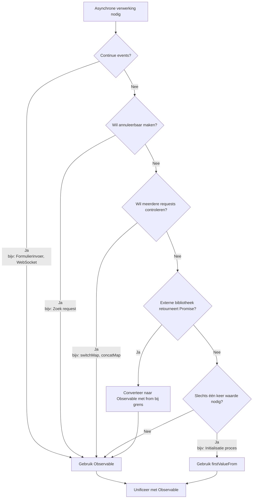

# Promise en Observable Vermenging Anti-patroon

Promise en Observable zijn beide mechanismen voor asynchrone verwerking, maar **als je ze vermengt zonder duidelijke ontwerpgrenzen, ontstaan verschillende problemen**. Deze pagina legt in detail anti-patronen door vermenging en juiste unificatiemethoden uit.

## Waarom Unificatie Belangrijk Is

Vermenging van Promise en Observable veroorzaakt de volgende problemen.

### 1. Niet Annuleerbaar

Observable kan verwerking onderbreken met `unsubscribe` / `takeUntil`, maar **Promise kan niet worden onderbroken zodra gestart**.

```ts
import { interval, Subject } from 'rxjs';
import { takeUntil } from 'rxjs';

const destroy$ = new Subject<void>();

// ✅ Observable: Annuleerbaar
interval(1000).pipe(
  takeUntil(destroy$)
).subscribe(n => console.log(n));

// Annuleer als gebruiker scherm verlaat
destroy$.next();
destroy$.complete();
```

```ts
// ❌ Promise: Niet annuleerbaar
async function fetchData() {
  const response = await fetch('/api/data');
  // fetch stopt niet zelfs als gebruiker scherm verlaat
  return response.json();
}
```

**Impact:** Verspilde requests bij route transitie, uitvoering van onnodige bijwerkingen

### 2. Moeilijkheid van Frequentiecontrole

Observable kan meerdere requests serialiseren, annuleren, of re-entry voorkomen met `switchMap`/`concatMap`/`exhaustMap`.

```ts
import { fromEvent } from 'rxjs';
import { switchMap, debounceTime } from 'rxjs';

const searchInput = document.getElementById('search-input')!;

// ✅ Observable: Verwerk alleen laatste request
fromEvent(searchInput, 'input').pipe(
  debounceTime(300),
  switchMap(event => searchAPI((event.target as HTMLInputElement).value))
  // Oude requests worden automatisch geannuleerd
).subscribe(results => displayResults(results));

function searchAPI(query: string) {
  return fetch(`/api/search?q=${query}`).then(r => r.json());
}

function displayResults(results: unknown) {
  console.log(results);
}
```

Met Promise moet je dergelijke controle handmatig implementeren, wat complex wordt.

### 3. Meerdere Event Responsiviteit

Observable is sterk in **verwerking waar waarden continu stromen** zoals formulierinvoer, WebSocket, events.

```ts
import { fromEvent } from 'rxjs';
import { map } from 'rxjs';

// ✅ Observable: Verwerk continue events
fromEvent(document, 'mousemove').pipe(
  map(event => ({ x: (event as MouseEvent).clientX, y: (event as MouseEvent).clientY }))
).subscribe(position => {
  console.log('Muispositie:', position);
});
```

Promise is gespecialiseerd in "eenmalige" verwerking en niet geschikt voor continue events.

### 4. Testbaarheid

Observable kan tijd en concurrency garanderen met marble tests.

```ts
import { TestScheduler } from 'rxjs/testing';

// ✅ Observable: Tijd controleerbaar met marble test
// ※ Deze code wordt uitgevoerd binnen test framework (Jasmine/Jest)
describe('Observable Test', () => {
  let scheduler: TestScheduler;

  beforeEach(() => {
    scheduler = new TestScheduler((actual, expected) => {
      expect(actual).toEqual(expected); // Gebruik expect van test framework
    });
  });

  it('should emit values over time', () => {
    scheduler.run(({ cold, expectObservable }) => {
      const source$ = cold('a-b-c|');
      expectObservable(source$).toBe('a-b-c|');
    });
  });
});
```

Promise-gebaseerde code heeft vaak complexe asynchrone tests. Zie [Testmethoden](/nl/guide/testing/unit-tests) voor details.


## Typische "Probleem" Patronen bij Vermenging (Te Vermijden)

Dit zijn probleempatronen die vaak worden gezien in daadwerkelijke projecten.

### ❌ Anti-patroon 1: Vermenging van async/await en pipe()

Als je `await` gebruikt tijdens Observable verwerking, of Promise en Observable verwerking vermengen, wordt het niet-annuleerbaar.

```ts
import { ajax } from 'rxjs/ajax';
import { firstValueFrom } from 'rxjs';

// ❌ Slecht voorbeeld: Observable → Promise → Promise vermenging
async function fetchUserData() {
  const user = await firstValueFrom(ajax.getJSON('/api/user'));

  // Na conversie naar Promise, niet meer annuleerbaar
  return fetch('/api/profile').then(response => response.json());
}
```

```ts
import { of } from 'rxjs';
import { map } from 'rxjs';

// ❌ Slecht voorbeeld: Probeer await te gebruiken binnen pipe() (werkt eigenlijk niet)
async function processData() {
  return of(1, 2, 3).pipe(
    map(async (value) => {
      const result = await someAsyncOperation(value);
      return result; // Wordt Observable<Promise<T>>
    })
  );
}

async function someAsyncOperation(value: number): Promise<number> {
  return value * 2;
}
```

#### Problemen
- Wordt niet-annuleerbaar
- Foutkanalen gescheiden (`error` niet maar naar `unhandledrejection` kant)
- Verantwoordelijkheid van Promise en Observable wordt vaag
- Type wordt `Observable<Promise<T>>`

### ❌ Anti-patroon 2: Gebruik van `toPromise()` (Afgeschaft)

```ts
import { interval } from 'rxjs';

// ❌ Slecht voorbeeld: toPromise() verwijderd in RxJS v8
interval(1000).toPromise().then(value => {
  console.log(value);
});
```

**Oplossing:** Gebruik `firstValueFrom` / `lastValueFrom` (later beschreven)

### ❌ Anti-patroon 3: `await` binnen `subscribe`

```ts
import { fromEvent } from 'rxjs';

const button = document.getElementById('btn') as HTMLButtonElement;

// ❌ Slecht voorbeeld
fromEvent(button, 'click').subscribe(async () => {
  const data = await fetch('/api/data').then(r => r.json());
  console.log(data);
  // Flow wordt onleesbaar, foutafhandeling moeilijk
});
```

#### Problemen
- Flow wordt onleesbaar
- Broedplaats voor dubbele requests
- Mogelijkheid van geheugenlekken

### ❌ Anti-patroon 4: Nesting van subscribe

```ts
import { ajax } from 'rxjs/ajax';

// ❌ Slecht voorbeeld
ajax.getJSON('/api/users').subscribe(users => {
  ajax.getJSON('/api/settings').subscribe(settings => {
    console.log(users, settings);
    // Callback hell
  });
});
```

#### Problemen
- Complexe foutafhandeling
- Beheer van unsubscribe moeilijk

### ❌ Anti-patroon 5: Parallelle Ophaling van Dezelfde Data met Promise en Observable

```ts
import { ajax } from 'rxjs/ajax';

// ❌ Slecht voorbeeld
async function loadData() {
  const userPromise = fetch('/api/user').then(r => r.json());
  const user$ = ajax.getJSON('/api/user');

  // Dezelfde data twee keer ophalen
}
```

#### Problemen
- Dubbele uitvoering
- Volgorde conflict

### ❌ Anti-patroon 6: Promise Retourneren binnen Observable

Als je `async/await` gebruikt binnen Observable constructor, wordt foutafhandeling moeilijk.

```ts
import { Observable } from 'rxjs';

// ❌ Slecht voorbeeld: async function gebruiken binnen Observable
const data$ = new Observable(subscriber => {
  async function fetchData() {
    const response = await fetch('/api/data');
    const data = await response.json();
    subscriber.next(data);
    subscriber.complete();
  }

  fetchData(); // Promise wordt geretourneerd maar fout kan niet worden gevangen
  // Als fetchData() rejected, wordt subscriber.error() niet aangeroepen
});
```

```ts
import { Observable } from 'rxjs';

// ❌ Slecht voorbeeld: Promise doorgeven aan subscriber.next()
const data$ = new Observable(subscriber => {
  const promise = fetch('/api/data').then(r => r.json());
  subscriber.next(promise); // Promise object stroomt door
  subscriber.complete();
});

// Subscribe kant ontvangt Promise
data$.subscribe(value => {
  console.log(value); // Promise { <pending> } wordt getoond
});
```

#### Problemen
- Promise fout stroomt niet naar Observable foutkanaal
- Mogelijkheid van `unhandledrejection`
- Promise object wordt doorgegeven aan subscriber.next()
- Abonnee moet Promise unwrappen

#### Oplossing

```ts
import { from, defer } from 'rxjs';

// ✅ Goed voorbeeld: Converteer Promise naar Observable met from()
const data$ = from(fetch('/api/data').then(r => r.json()));

// ✅ Goed voorbeeld: Uitgestelde evaluatie met defer()
const data$ = defer(() => fetch('/api/data').then(r => r.json()));
```


## Praktische Gids: Nette Conversie bij Grenzen

Omdat vermenging volledig vermijden moeilijk is, is **juiste conversie bij ontwerp grenzen** best practice.

### Patroon 1: Promise → Observable (Externe SDK etc. retourneert Promise)

Als externe bibliotheek of legacy code Promise retourneert, **converteer eenmalig naar Observable bij grens**.

```ts
import { from } from 'rxjs';
import { switchMap } from 'rxjs';

// Externe SDK retourneert Promise
async function externalSDK(): Promise<{ userId: string }> {
  return { userId: '123' };
}

// ✅ Goed voorbeeld: Converteer bij grens en unificeer daarna met Observable
const user$ = from(externalSDK());

user$.pipe(
  switchMap(user => from(fetchProfile(user.userId)))
).subscribe(profile => {
  console.log(profile);
});

async function fetchProfile(userId: string): Promise<{ name: string }> {
  return { name: 'John' };
}
```

### Patroon 2: Observable → Promise ("wil slechts 1 keer" synchrone context)

Bij initialisatieprocessen of guard functies, **als je slechts één keer waarde nodig hebt** gebruik `firstValueFrom` / `lastValueFrom`.

```ts
import { ajax } from 'rxjs/ajax';
import { firstValueFrom, shareReplay } from 'rxjs';

// ✅ Goed voorbeeld: Cache bij meerdere awaits
const config$ = ajax.getJSON('/api/config').pipe(
  shareReplay({ bufferSize: 1, refCount: true })
);

async function initialize() {
  const config = await firstValueFrom(config$);
  console.log('Config geladen:', config);
}

async function validate() {
  const config = await firstValueFrom(config$); // Haal op uit cache
  console.log('Valideren met config:', config);
}
```

**⚠️ Waarschuwing:** `firstValueFrom` haalt alleen **eerste item** op. Gebruik **absoluut niet** voor continue events (valueChanges, WebSocket etc.).

```ts
import { interval } from 'rxjs';
import { firstValueFrom } from 'rxjs';

// ❌ Slecht voorbeeld: firstValueFrom op oneindige stream
const value = await firstValueFrom(interval(1000));
// Haalt slechts één keer waarde op en eindigt (onbedoeld gedrag)
```

### Patroon 3: Unificatie van Foutafhandeling

Let op dat foutafhandelingskanalen niet scheiden tussen Promise en Observable.

```ts
import { from } from 'rxjs';
import { catchError } from 'rxjs';
import { of } from 'rxjs';

async function riskyOperation(): Promise<string> {
  throw new Error('Er ging iets mis');
}

// ✅ Goed voorbeeld: Unificeer met Observable foutafhandeling
from(riskyOperation()).pipe(
  catchError(error => {
    console.error('Fout gevangen in Observable pipeline:', error);
    return of('fallback waarde');
  })
).subscribe(result => {
  console.log(result); // 'fallback waarde'
});
```


## Veelvoorkomende Vervanging bij Vermenging

### Voorbeeld 1: Promise-isatie Onderweg → then

#### ❌ Slecht Voorbeeld

```ts
import { ajax } from 'rxjs/ajax';
import { firstValueFrom } from 'rxjs';

async function loadUser() {
  const user = await firstValueFrom(ajax.getJSON('/api/user'));

  // Val terug naar Promise en vervolg met then
  return fetch('/api/profile')
    .then(response => response.json())
    .then(profile => {
      console.log(user, profile);
    });
}
```

#### ✅ Goed Voorbeeld A: Consistent Observable

```ts
import { ajax } from 'rxjs/ajax';
import { switchMap } from 'rxjs';

// Verwerk met Observable
ajax.getJSON('/api/user').pipe(
  switchMap(user => ajax.getJSON('/api/profile').pipe(
    // Combineer user en profile
  ))
).subscribe(profile => {
  console.log(profile);
});
```

#### ✅ Goed Voorbeeld B: Context waar eenmalig await nodig is

```ts
import { ajax } from 'rxjs/ajax';
import { shareReplay, firstValueFrom } from 'rxjs';

const user$ = ajax.getJSON('/api/user').pipe(
  shareReplay({ bufferSize: 1, refCount: true })
);

async function loadUserOnce() {
  const user = await firstValueFrom(user$);
  console.log('Gebruiker eenmalig geladen:', user);
}
```


### Voorbeeld 2: await binnen subscribe

#### ❌ Slecht Voorbeeld

```ts
import { fromEvent } from 'rxjs';

const button = document.getElementById('search-btn') as HTMLButtonElement;

fromEvent(button, 'click').subscribe(async () => {
  const results = await fetch('/api/search').then(r => r.json());
  console.log(results);
});
```

#### ✅ Goed Voorbeeld

```ts
import { fromEvent, from } from 'rxjs';
import { switchMap } from 'rxjs';

const button = document.getElementById('search-btn') as HTMLButtonElement;

fromEvent(button, 'click').pipe(
  switchMap(() => from(fetch('/api/search').then(r => r.json())))
).subscribe(results => {
  console.log(results);
});
```


## Beoordelingsstroomdiagram (Gemakkelijk te Onthouden Richtlijn)

Richtlijn voor wanneer je twijfelt welke van Promise of Observable te gebruiken in je project.



### Specifieke Beoordelingscriteria

| Voorwaarde | Aanbevolen | Reden |
|---|---|---|
| **Continue events** (Formulierinvoer, WebSocket) | Observable | Promise kan slechts één keer waarde retourneren |
| **Wil annuleerbaar maken** (Zoek request) | Observable | Promise niet annuleerbaar |
| **Controleer meerdere requests** (switchMap, concatMap) | Observable | Controle moeilijk met Promise |
| **Externe bibliotheek retourneert Promise** | Converteer met `from()` | Converteer eenmalig bij grens |
| **Slechts één keer waarde nodig** (Initialisatie proces) | `firstValueFrom` | Combineer met `shareReplay(1)` indien nodig |


## Samenvatting

- **Vermenging zelf is niet slecht**, maar het is correct om **"grenzen" van ontwerp duidelijk te maken** en naar één kant te neigen
- **Unificeer met Observable als standaard** en converteer alleen op minimaal noodzakelijke plaatsen met **`firstValueFrom`/`from()`**, waardoor problemen minimaal zijn en test, leesbaarheid, annuleerbaarheid gegarandeerd zijn
- **Maak continue events (formulier, WebSocket) absoluut niet tot Promise**

## Gerelateerde Gedeelten

- **[Verschil tussen Promise en RxJS](/nl/guide/basics/promise-vs-rxjs)** - Basis conversiemethoden
- **[Foutafhandeling](/nl/guide/error-handling/strategies)** - Observable foutafhandelingsstrategieën
- **[Veelvoorkomende Fouten en Oplossingen](/nl/guide/anti-patterns/common-mistakes)** - Andere anti-patronen

## Volgende Stappen

1. Identificeer plaatsen in bestaande code waar Promise en Observable vermengd zijn
2. Maak grenzen duidelijk en unificeer met Observable
3. Voeg `takeUntil` toe aan plaatsen waar annuleringsverwerking nodig is
