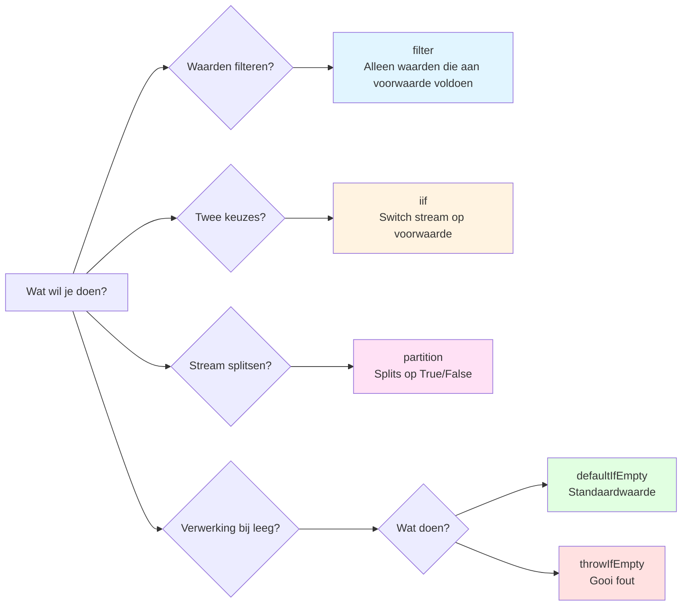

# if-statement Nesting Hell in subscribe

## Waarom Dit een Anti-patroon Is

"Complexe voorwaardelijke vertakkingen binnen subscribe" is een **duidelijk anti-patroon** in RxJS. Het wordt erkend als implementatiepatroon dat moet worden vermeden om de volgende redenen.

### 1. Gaat in Tegen RxJS Ontwerpfilosofie

RxJS bevordert **declaratief programmeren**. "Wat te doen" moet worden uitgedrukt in de pipeline, "hoe te doen" details moeten niet binnen subscribe worden geschreven.

```typescript
// ❌ Anti-patroon: Imperatief programmeren (procedureel)
userService.getUser(id).subscribe(user => {
  if (user.isActive) {
    if (user.role === 'admin') {
      console.log('Admin gebruiker');
    }
  }
});

// ✅ RxJS-stijl: Declaratief programmeren
userService.getUser(id).pipe(
  filter(user => user.isActive),
  filter(user => user.role === 'admin'),
  tap(user => console.log('Admin gebruiker'))
).subscribe();
```

### 2. Problemen op Hetzelfde Niveau als Bestaande Anti-patronen

Net als andere anti-patronen behandeld in Chapter 10, veroorzaakt dit de volgende problemen:

| Anti-patroon | Hoofdprobleem |
|---------------|---------|
| **Geheugenlekken** | unsubscribe vergeten |
| **subscribe hell** | Geneste subscribe |
| **if hell binnen subscribe** ← Deze pagina | Complexe voorwaardelijke vertakkingen |

### 3. Specifieke Problemen

1. **Lage leesbaarheid** - Diepe nesting, onduidelijke code intentie
2. **Moeilijk te testen** - Te veel voorwaardelijke vertakkingen, testcases exploderen
3. **Niet herbruikbaar** - Logica opgesloten binnen subscribe, niet elders bruikbaar
4. **Moeilijk te debuggen** - Waardestroom moeilijk te volgen, tijdrovend om probleemlocatie te identificeren
5. **Complexe foutafhandeling** - Moeilijk te traceren waar fouten optraden

### 4. Acceptabel Bereik en Te Vermijden Bereik

```typescript
// ✅ Acceptabel bereik: Eenvoudige vertakking (1-2 if-statements)
subscribe(user => {
  if (user.isAdmin) {
    console.log('Admin gebruiker');
  } else {
    console.log('Reguliere gebruiker');
  }
});

// ⚠️ Vereist aandacht: 2-3 niveaus nesting
subscribe(user => {
  if (user) {
    if (user.isActive) {
      console.log('Actieve gebruiker');
    }
  }
});

// ❌ Anti-patroon: 3 of meer niveaus nesting
subscribe(user => {
  if (user) {
    if (user.isActive) {
      if (user.role === 'admin') {
        if (user.permissions.includes('write')) {
          // Dit is duidelijk een anti-patroon
        }
      }
    }
  }
});
```

> [!IMPORTANT] Beoordelingscriteria
> - **1-2 if-statements**: Acceptabel bereik (hoewel operators wenselijker zijn)
> - **3 of meer niveaus nesting**: Duidelijk anti-patroon (moet absoluut worden gerefactord)
> - **Geneste asynchrone verwerking**: Onmiddellijke refactoring noodzakelijk


## Veelvoorkomende Slechte Patronen

### Patroon 1: Complexe Voorwaardelijke Vertakkingen binnen subscribe

```typescript
// ❌ Slecht voorbeeld: if-statement nesting binnen subscribe
userService.getUser(id).subscribe(user => {
  if (user) {
    if (user.isActive) {
      if (user.role === 'admin') {
        // Admin verwerking
        console.log('Admin gebruiker:', user.name);
        adminService.loadAdminData().subscribe(adminData => {
          if (adminData) {
            // Nog diepere nesting...
          }
        });
      } else {
        // Reguliere gebruiker verwerking
        console.log('Reguliere gebruiker:', user.name);
      }
    } else {
      // Inactieve gebruiker
      console.log('Inactieve gebruiker');
    }
  } else {
    // Gebruiker niet gevonden
    console.log('Gebruiker niet gevonden');
  }
});
```

### Problemen van Deze Code
1. **5 niveaus nesting** - Leesbaarheid aanzienlijk verminderd
2. **subscribe binnen subscribe** - Geheugenlek risico
3. **Geen foutafhandeling** - Onduidelijk waar fouten optreden
4. **Niet testbaar** - Moeilijk om alle paden te testen
5. **Logica niet herbruikbaar** - Niet bruikbaar op andere plaatsen


## Oplossingen met RxJS Voorwaardelijke Operators

### Oplossing 1: Voorwaardelijke Vertakking met filter

**Wanneer gebruiken?**: Waarden filteren, onnodige waarden uitsluiten

```typescript
import { filter, tap, switchMap } from 'rxjs';

// ✅ Goed voorbeeld: Schei voorwaarden met filter
userService.getUser(id).pipe(
  filter(user => user !== null),           // null check
  filter(user => user.isActive),           // Actief check
  filter(user => user.role === 'admin'),   // Rol bevestiging
  tap(user => console.log('Admin gebruiker:', user.name)),
  switchMap(user => adminService.loadAdminData())
).subscribe({
  next: adminData => console.log('Admin data geladen', adminData),
  error: err => console.error('Fout:', err)
});
```

> [!NOTE] Voordelen
> - ✅ Elke voorwaarde is onafhankelijk (leesbaar)
> - ✅ Volgorde duidelijk in pipeline
> - ✅ Gecentraliseerde foutafhandeling

### Oplossing 2: Tweekeuze Vertakking met iif

**Wanneer gebruiken?**: Verschillende Observable uitvoeren afhankelijk van voorwaarde

```typescript
import { iif, of, switchMap } from 'rxjs';

// ✅ Goed voorbeeld: Switch stream met iif op basis van voorwaarde
userService.getUser(id).pipe(
  switchMap(user =>
    iif(
      () => user.role === 'admin',
      adminService.loadAdminData(),    // Admin geval
      userService.loadUserData()       // Reguliere gebruiker geval
    )
  )
).subscribe(data => console.log('Data:', data));
```

> [!NOTE] Voordelen
> - ✅ Tweekeuze vertakking duidelijk
> - ✅ Elke verwerking onafhankelijke Observable
> - ✅ Gemakkelijk te testen

### Oplossing 3: Vertakkingsverwerking met partition

**Wanneer gebruiken?**: Stream splitsen in twee en apart verwerken

```typescript
import { partition, merge, tap, switchMap, map } from 'rxjs';

// ✅ Goed voorbeeld: Splits stream in twee met partition
const [activeUsers$, inactiveUsers$] = partition(
  userService.getUsers(),
  user => user.isActive
);

// Actieve gebruikers verwerking
const processedActive$ = activeUsers$.pipe(
  tap(user => console.log('Actief:', user.name)),
  switchMap(user => userService.loadProfile(user.id))
);

// Inactieve gebruikers verwerking
const processedInactive$ = inactiveUsers$.pipe(
  tap(user => console.log('Inactief:', user.name)),
  map(user => ({ ...user, status: 'archived' }))
);

// Integreer twee streams
merge(processedActive$, processedInactive$).subscribe(
  result => console.log('Verwerkt:', result)
);
```

> [!NOTE] Voordelen
> - ✅ Actief/Inactief volledig gescheiden
> - ✅ Elk onafhankelijk verwerkbaar
> - ✅ Gemakkelijk uitbreidbaar

### Oplossing 4: Standaardwaarde met defaultIfEmpty

**Wanneer gebruiken?**: Standaardwaarde bieden bij leeg

```typescript
import { defaultIfEmpty, filter } from 'rxjs';

// ✅ Goed voorbeeld: Bied standaardwaarde bij leeg
userService.getUser(id).pipe(
  filter(user => user !== null),
  defaultIfEmpty({ id: 0, name: 'Gast', role: 'guest' })
).subscribe(user => {
  console.log('Gebruiker:', user.name);
});
```

> [!NOTE] Voordelen
> - ✅ null check niet nodig
> - ✅ Standaardwaarde duidelijk
> - ✅ Vertakking binnen subscribe niet nodig

### Oplossing 5: Foutafhandeling met throwIfEmpty

**Wanneer gebruiken?**: Behandel als fout bij leeg

```typescript
import { throwIfEmpty, catchError, filter } from 'rxjs';
import { of } from 'rxjs';

// ✅ Goed voorbeeld: Gooi fout bij leeg
userService.getUser(id).pipe(
  filter(user => user !== null),
  throwIfEmpty(() => new Error('Gebruiker niet gevonden')),
  catchError(err => {
    console.error('Fout:', err.message);
    return of(null);
  })
).subscribe(user => {
  if (user) {
    console.log('Gebruiker gevonden:', user.name);
  }
});
```

> [!NOTE] Voordelen
> - ✅ Foutafhandeling duidelijk
> - ✅ Voltooid binnen pipeline
> - ✅ subscribe alleen succesverwerking


## Praktisch Voorbeeld: Refactoring van Complexe Voorwaardelijke Logica

### Before: if Hell binnen subscribe

```typescript
// ❌ Slecht voorbeeld: Complexe voorwaardelijke logica (6 niveaus nesting)
apiService.fetchData().subscribe(data => {
  if (data) {
    if (data.status === 'success') {
      if (data.result) {
        if (data.result.items.length > 0) {
          data.result.items.forEach(item => {
            if (item.isValid) {
              if (item.price > 0) {
                // Verwerking...
                console.log('Geldig item:', item);
              }
            }
          });
        } else {
          console.log('Geen items gevonden');
        }
      }
    } else {
      console.log('Request mislukt');
    }
  }
});
```

> [!WARNING] Problemen
> - 6 niveaus nesting
> - Nog meer voorwaardelijke vertakkingen binnen forEach
> - Geen foutafhandeling
> - Niet testbaar
> - Inefficiënte array verwerking

### After: Gestructureerd met Operators

```typescript
import { filter, map, defaultIfEmpty, switchMap, tap } from 'rxjs';
import { from } from 'rxjs';

// ✅ Goed voorbeeld: Organiseer voorwaarden met operators
apiService.fetchData().pipe(
  // 1. Data bestaanscontrole
  filter(data => data !== null),

  // 2. Status bevestiging
  filter(data => data.status === 'success'),

  // 3. Resultaat bestaanscontrole
  filter(data => data.result !== null),

  // 4. Uitvouwen array
  map(data => data.result.items),
  defaultIfEmpty([]),  // Standaard bij lege array

  // 5. Elk item individueel verwerken
  switchMap(items => from(items)),

  // 6. Alleen geldige items
  filter(item => item.isValid),

  // 7. Prijs check
  filter(item => item.price > 0),

  // 8. Debug log
  tap(item => console.log('Geldig item:', item))

).subscribe({
  next: item => console.log('Verwerken:', item),
  error: err => console.error('Fout:', err),
  complete: () => console.log('Alle items verwerkt')
});
```

> [!TIP] Verbeteringen
> - ✅ Nesting 0 (alles plat)
> - ✅ Elke voorwaarde onafhankelijk en leesbaar
> - ✅ Foutafhandeling toegevoegd
> - ✅ Gemakkelijk te testen (elke operator individueel testbaar)
> - ✅ Efficiënte array verwerking (gestroomd met from())


## Voorwaardelijke Operator Selectie Gids

Met het volgende stroomdiagram kun je bepalen welke operator te gebruiken.



| Voorwaarde | Operator te Gebruiken | Reden |
|-----|----------------|------|
| Waarden filteren | `filter()` | Laat alleen waarden door die aan voorwaarde voldoen |
| Kies uit 2 opties | `iif()` | Switch stream op basis van voorwaarde |
| Splits stream in twee | `partition()` | Splits in twee streams op True/False |
| Standaard bij leeg | `defaultIfEmpty()` | Gebruik standaardwaarde als geen waarde |
| Fout bij leeg | `throwIfEmpty()` | Gooi fout als geen waarde |
| Meerdere opties (3+) | Custom operator | Bij 3 of meer vertakkingen nodig |


## Refactoring Stappen

### Step 1: Identificeer Voorwaarden
Lijst alle if-statements binnen subscribe

```typescript
// Voorbeeld: Volgende voorwaarden bestaan
if (data)                        // ← Voorwaarde 1
if (data.status === 'success')   // ← Voorwaarde 2
if (data.result)                 // ← Voorwaarde 3
if (item.isValid)                // ← Voorwaarde 4
if (item.price > 0)              // ← Voorwaarde 5
```

### Step 2: Classificeer Voorwaarden
- **Filter voorwaarden** → `filter()`
- **Tweekeuze vertakking** → `iif()`
- **Stream splitsing** → `partition()`
- **Standaardwaarde** → `defaultIfEmpty()`
- **Fout voorwaarde** → `throwIfEmpty()`

### Step 3: Converteer naar Pipeline
Vervang voorwaarden door operators binnen pipe

```typescript
.pipe(
  filter(data => data !== null),              // Voorwaarde 1
  filter(data => data.status === 'success'),  // Voorwaarde 2
  filter(data => data.result !== null),       // Voorwaarde 3
  switchMap(data => from(data.result.items)),
  filter(item => item.isValid),               // Voorwaarde 4
  filter(item => item.price > 0)              // Voorwaarde 5
)
```

### Step 4: Vereenvoudig subscribe
subscribe alleen voor bijwerkingen (log output, DOM manipulatie etc.)

```typescript
.subscribe({
  next: item => console.log('Geldig item:', item),
  error: err => console.error('Fout:', err),
  complete: () => console.log('Voltooid')
});
```

### Step 5: Schrijf Tests
Bevestig dat elke operator werkt zoals verwacht

```typescript
// Voorbeeld: filter test
it('should filter out null values', () => {
  const source$ = of(null, { id: 1 }, null);
  const result$ = source$.pipe(
    filter(data => data !== null)
  );

  result$.subscribe(data => {
    expect(data).not.toBeNull();
  });
});
```


## Hergebruik met Custom Operator

Complexe voorwaardelijke logica kan herbruikbaar worden gemaakt door extractie naar custom operator.

```typescript
import { pipe } from 'rxjs';
import { filter } from 'rxjs';

// Custom operator: Alleen actieve admin gebruikers
function filterActiveAdmins<T extends { isActive: boolean; role: string }>() {
  return pipe(
    filter((user: T) => user.isActive),
    filter((user: T) => user.role === 'admin')
  );
}

// Gebruiksvoorbeeld
userService.getUsers().pipe(
  filterActiveAdmins(),
  tap(user => console.log('Actieve admin:', user.name))
).subscribe();
```

> [!NOTE] Voordelen
> - ✅ Herbruikbaar
> - ✅ Gemakkelijk te testen
> - ✅ Intentie duidelijk door naam


## Gerelateerde Leerbronnen

Om dit anti-patroon te begrijpen, raadpleeg ook de volgende gedeelten.

- **[Chapter 4: Voorwaardelijke Operators](/nl/guide/operators/conditional/)** - Details van filter, iif, defaultIfEmpty
- **[Chapter 10: Anti-patronen](/nl/guide/anti-patterns/)** - Andere anti-patronen
- **[Chapter 11: Conceptuele Begrip Barrière](/nl/guide/overcoming-difficulties/conceptual-understanding)** - Begrip van declaratief programmeren
- **[Chapter 11: Operator Selectie](/nl/guide/overcoming-difficulties/operator-selection)** - Hoe juiste operators te kiezen


## Anti-patroon Preventie Checklist

Controleer je eigen code.

```markdown
- [ ] Niet 3 of meer geneste if-statements binnen subscribe
- [ ] Voorwaardelijke vertakkingen verwerkt met operators binnen pipe
- [ ] subscribe voert alleen bijwerkingen uit (log, DOM manipulatie)
- [ ] Gebruik filter om onnodige waarden uit te sluiten
- [ ] Behandel lege gevallen met defaultIfEmpty of throwIfEmpty
- [ ] Extraheer complexe voorwaarden naar custom operator
- [ ] Foutafhandeling gedaan met catchError
- [ ] Geen verder geneste subscribe binnen subscribe
```

## Volgende Stappen

Na begrip van dit anti-patroon, leer praktische patronen op de volgende pagina's.

1. **[Veelvoorkomende Fouten en Oplossingen](/nl/guide/anti-patterns/common-mistakes)** - Leer andere anti-patronen
2. **[Chapter 11: Moeilijkheden Overwinnen](/nl/guide/overcoming-difficulties/)** - Overwin RxJS-specifieke moeilijkheden
3. **[Chapter 13: Praktische Patronen](/nl/guide/)** - Verwerf juiste implementatiepatronen (in voorbereiding)

> [!TIP] Belangrijk Punt
> Complexe voorwaardelijke vertakkingen binnen subscribe gaan in tegen RxJS declaratieve programmeringfilosofie en zijn duidelijk een anti-patroon. Verwerk voorwaarden binnen pipeline met operators zoals filter, iif, en partition.
