# De Relatie tussen Embedded Development en Reactief Programmeren

Dit hoofdstuk legt uit hoe reactief programmeren, met name asynchrone stream processing zoals RxJS, kan worden toegepast in embedded systemen, inclusief de mogelijkheden en beperkingen.

## Wat is Reactief Programmeren

Reactief programmeren is een **declaratieve methode voor het omgaan met asynchrone datastromen op de tijdsas**. Het behandelt de stroom van gebeurtenissen en data als "waarden die in de loop van de tijd veranderen" en voert transformatie, combinatie en filtering uit.

In traditioneel imperatief programmeren moet je expliciet beschrijven "wanneer" en "hoe" te verwerken, maar in reactief programmeren beschrijf je declaratief "wat" te verwerken.

```ts
// Traditionele imperatieve benadering
let sensorValue = 0;
setInterval(() => {
  sensorValue = readSensor();
  if (sensorValue > threshold) {
    handleAlert(sensorValue);
  }
}, 100);

// Reactieve benadering
sensorStream$
  .pipe(
    filter(value => value > threshold)
  )
  .subscribe(value => handleAlert(value));
```

In de reactieve benadering zijn de datastroom en de verwerkingslogica duidelijk gescheiden, wat de leesbaarheid en onderhoudbaarheid verbetert.

## Uitdagingen in Embedded Development

De reden waarom reactief programmeren niet breed is verspreid in embedded systemen is vanwege de volgende beperkingen.

### 1. Prestatiebeperkingen

Veel embedded systemen vereisen **reactietijden in de orde van microseconden**.

```ts
// ❌ Ongepast voor control layer in embedded
motorControl$
  .pipe(
    map(signal => processSignal(signal)),  // Moet binnen tientallen μs compleet zijn
    filter(value => value > threshold)
  )
  .subscribe(value => actuateMotor(value));
```

::: warning Uitdagingen
- RxJS operator chains hebben grote overhead
- Garbage collection kan optreden
- Moeilijk om reactietijden te voorspellen

:::

### 2. Geheugenbeperkingen

Embedded systemen werken met beperkt geheugen (enkele KB tot enkele MB).

::: warning Uitdagingen
- Dynamische geheugentoewijzing is vaak verboden
- Observable's interne status verbruikt geheugen
- Buffering operators (`buffer`, `window`) gebruiken vooral veel geheugen

:::

### 3. Hoog Abstractieniveau

Reactief programmeren heeft een hoog abstractieniveau en is niet geschikt voor hardware-level control.

::: warning Uitdagingen
- Niet geschikt voor register manipulatie of DMA control
- Ongepast voor fijne bit-level control
- Debugging is complex (moeilijk om asynchrone streams te traceren)

:::

### 4. Compatibiliteit met RTOS

Real-Time Operating System (RTOS) gebruikt priority-based task scheduling, maar RxJS is event loop-based.

::: warning Uitdagingen
- Priority inversion kan optreden
- Moeilijk om task execution timing te voorspellen
- Moeilijk om real-time garanties te bieden

:::

## Optimale toepassingslaag: Event Integration Layer

In embedded systemen is de **"Event Integration Layer"** waar reactief programmeren het meest effectief is.

### De positie waar het reactieve model het meest nuttig is: de "ontvanger-kant" van sensor input

In embedded systemen toont reactief programmeren zijn ware waarde aan de **data ontvangst kant (sensor input)**.

#### Sterke punten van het reactieve model aan de ontvanger-kant (sensor input)
- Integratie van asynchrone data van meerdere sensoren
- Declaratieve beschrijving van correlaties op de tijdsas
- Event-driven processing kan natuurlijk worden uitgedrukt
- State management en filtering zijn gemakkelijk

#### Uitdagingen van het reactieve model aan de zender-kant (control output)
- Moeilijk om real-time garanties te bieden (microseconde reactie nodig)
- Overhead is niet acceptabel
- Te hoog abstractieniveau voor directe hardware control

### Kenmerken en voordelen van sensor input streams

| Kenmerk | Traditionele imperatieve benadering | Reactieve benadering | Voordeel |
|------|---------------------|---------------------|------|
| **Integratie van meerdere sensoren** | Pollen van elke sensor, handmatig synchroniseren | Declaratief integreren met `combineLatest`, `merge` | Beknopte code, duidelijke intentie |
| **Aggregatie in tijdvenster** | Handmatig beheren van timer en buffer | Automatiseren met `bufferTime`, `windowTime` | Minder implementatiefouten, betere onderhoudbaarheid |
| **Ruisonderdrukking** | Moving average implementeren met loops en array operaties | Declaratief beschrijven met `scan` + `map` | Hoge leesbaarheid, herbruikbaar |
| **Anomalie detectie** | Complexe nesting van flags en conditionals | Duidelijk uitdrukken met `pairwise` + `filter` | Logica is makkelijker te volgen |
| **Gebeurteniscorrelatie** | Events traceren met state variabelen, handmatige bepaling | Patroondetectie met `merge` + `bufferTime` | Declaratief, gemakkelijk uit te breiden |
| **Unsubscribe** | Handmatig flag management, vatbaar voor leaks | Automatisch opheffen met `takeUntil` | Voorkomt memory leaks |

### Verschil met control kant (zender-kant)

Het is belangrijk om het verschil te begrijpen tussen de kenmerken van de "ontvanger-kant" en "zender-kant" in embedded systemen.

| Gezichtspunt | Ontvanger-kant (Sensor input) | Zender-kant (Control output) |
|------|---------------------|------------------|
| **Real-time** | Milliseconden (relatief soepel) | Microseconden (streng) |
| **Aard van processing** | Asynchroon, event-driven | Synchroon, periodieke uitvoering |
| **Complexiteit** | Integratie van meerdere bronnen, state management | Simpele output, focus op snelheid |
| **RxJS geschiktheid** | ✅ **Optimaal** - Sterk in event integratie | ❌ **Ongeschikt** - Grote overhead |
| **Hoofdprocessing** | Filtering, smoothing, correlatie detectie | PWM control, motor aansturing, DMA transfer |

::: tip Specialiseer in de "ontvanger-kant" van sensor input
Reactief programmeren is het meest effectief bij **integratie en evaluatie van meerdere asynchrone gebeurtenissen op de tijdsas**. Gebruik het specifiek voor de "ontvanger-kant" van sensor input, niet voor de "zender-kant" zoals control output.
:::

### Laagverdeling van systeemarchitectuur

```mermaid
flowchart TB
    app["<b>Applicatielaag</b><br/>(Ontvanger-kant sensor input)"]
    event["<b>Event Integration Layer ★</b><br/>(Integratie & evaluatie van meerdere inputs)"]
    control["<b>Control Layer</b><br/>(Motor, Actuator)"]
    hw["<b>Hardware Access Layer</b><br/>(Register, DMA, interrupts)"]

    noteApp["RxJS optimaal"]
    noteEvent["RxJS optimaal"]
    noteControl["RxJS ongeschikt"]
    noteHw["RxJS ongeschikt"]

    app --> event
    event --> control
    control --> hw

    app -.-> noteApp
    event -.-> noteEvent
    control -.-> noteControl
    hw -.-> noteHw

    classDef optimal fill:#c8e6c9,stroke:#2e7d32,stroke-width:2px,color:#333,font-size: 0.9rm
    classDef unsuitable fill:#ffcdd2,stroke:#c62828,stroke-width:2px,color:#333
    classDef note fill:#fff9c4,stroke:#f57f17,stroke-width:1px,stroke-dasharray: 5 5,color:#333

    class app,event optimal
    class control,hw unsuitable
    class noteApp,noteEvent,noteControl,noteHw note
```



#### Kenmerken van Event Integration Layer
- Integreert input van meerdere sensoren en event bronnen
- Evalueert correlaties op de tijdsas
- Real-time vereisten zijn relatief soepel (milliseconde orde)
- Focus op state management en conditie evaluatie

## Praktische toepassingsvoorbeelden

### 1. Smoothing van sensorwaarden

Smoothing van input van meerdere sensoren en verwijdering van ruis.

```ts
import { interval, combineLatest } from 'rxjs';
import { map, scan, share } from 'rxjs';

// Simulatie van sensor streams
const temperatureSensor$ = interval(100).pipe(
  map(() => 25 + Math.random() * 5), // 25-30℃
  share()
);

const humiditySensor$ = interval(100).pipe(
  map(() => 50 + Math.random() * 10), // 50-60%
  share()
);

// Smoothing met moving average
function movingAverage(windowSize: number) {
  return scan<number, number[]>((acc, value) => {
    const newWindow = [...acc, value];
    if (newWindow.length > windowSize) {
      newWindow.shift();
    }
    return newWindow;
  }, []).pipe(
    map(window => window.reduce((sum, val) => sum + val, 0) / window.length)
  );
}

const smoothedTemperature$ = temperatureSensor$.pipe(
  movingAverage(5),
  map(value => Math.round(value * 10) / 10)
);

const smoothedHumidity$ = humiditySensor$.pipe(
  movingAverage(5),
  map(value => Math.round(value * 10) / 10)
);

// Geïntegreerde omgevingsdata
combineLatest([smoothedTemperature$, smoothedHumidity$])
  .pipe(
    map(([temp, humidity]) => ({
      temperature: temp,
      humidity: humidity,
      heatIndex: calculateHeatIndex(temp, humidity),
      timestamp: Date.now()
    }))
  )
  .subscribe(data => {
    console.log('Omgevingsdata:', data);
  });

function calculateHeatIndex(temp: number, humidity: number): number {
  // Vereenvoudigde berekening van gevoelstemperatuur
  return temp + (0.5555 * (6.11 * Math.exp(5417.753 * ((1/273.16) - (1/(273.15 + temp)))) - 10));
}
```

> [!NOTE] Voordelen van sensorintegratie
> - Verwerking van waarden van meerdere sensoren gesynchroniseerd op tijdsas
> - Verwijdering van ruis met moving average
> - Declaratieve afleiding van berekende waarden (zoals gevoelstemperatuur)

### 2. Gebeurteniscorrelatie detectie

Detectie wanneer meerdere gebeurtenissen binnen een specifiek tijdvenster plaatsvinden.

```ts
import { Subject, merge } from 'rxjs';
import { filter, bufferTime, map } from 'rxjs';

// Event streams
const motionDetected$ = new Subject<{ sensor: string; timestamp: number }>();
const doorOpened$ = new Subject<{ door: string; timestamp: number }>();
const lightOn$ = new Subject<{ room: string; timestamp: number }>();

// Integratie van alle gebeurtenissen
const allEvents$ = merge(
  motionDetected$.pipe(map(e => ({ type: 'motion', ...e }))),
  doorOpened$.pipe(map(e => ({ type: 'door', ...e }))),
  lightOn$.pipe(map(e => ({ type: 'light', ...e })))
);

// Aggregatie van gebeurtenissen in tijdvenster van 1 seconde
allEvents$
  .pipe(
    bufferTime(1000),
    filter(events => events.length > 0),
    map(events => {
      const hasMotion = events.some(e => e.type === 'motion');
      const hasDoor = events.some(e => e.type === 'door');
      const hasLight = events.some(e => e.type === 'light');

      return {
        timestamp: Date.now(),
        events,
        pattern: {
          hasMotion,
          hasDoor,
          hasLight
        }
      };
    }),
    filter(result =>
      // Detectie van patroon waarbij persoon binnenkomt
      result.pattern.hasMotion && result.pattern.hasDoor
    )
  )
  .subscribe(result => {
    console.log('Binnenkomst gedetecteerd:', result);
    // Automatisch inschakelen van verlichting indien niet aan
    if (!result.pattern.hasLight) {
      console.log('→ Verlichting automatisch inschakelen');
    }
  });

// Simulatie van gebeurtenissen
setTimeout(() => motionDetected$.next({ sensor: 'entry', timestamp: Date.now() }), 100);
setTimeout(() => doorOpened$.next({ door: 'front', timestamp: Date.now() }), 200);
```

> [!TIP] Toepassing van gebeurteniscorrelatie
> - Situatie inschatten uit meerdere gebeurtenissen binnen tijdvenster
> - Anomalie detectie in beveiligingssystemen
> - Automatiseringslogica voor smart home

### 3. Anomalie detectie

Detectie van abnormale patronen in sensorwaarden.

```ts
import { interval } from 'rxjs';
import { map, pairwise, filter, share } from 'rxjs';

// Simulatie van vibratiesensor
const vibrationSensor$ = interval(50).pipe(
  map(() => {
    // Normaal 0-10, abnormaal 50 of hoger
    const normal = Math.random() * 10;
    const isAbnormal = Math.random() < 0.05; // 5% kans op abnormaliteit
    return isAbnormal ? 50 + Math.random() * 20 : normal;
  }),
  share()
);

// Anomalie detectie logica
vibrationSensor$
  .pipe(
    pairwise(), // Maak paar van twee opeenvolgende waarden
    map(([prev, current]) => ({
      prev,
      current,
      delta: Math.abs(current - prev),
      timestamp: Date.now()
    })),
    filter(data =>
      // Overschrijding drempelwaarde of plotselinge verandering
      data.current > 30 || data.delta > 20
    )
  )
  .subscribe(data => {
    console.log('⚠️ Anomalie gedetecteerd:', {
      huidigeWaarde: data.current.toFixed(2),
      verandering: data.delta.toFixed(2),
      tijd: new Date(data.timestamp).toISOString()
    });
  });
```

> [!WARNING] Aandachtspunten voor anomalie detectie
> - Aanpassing van drempelwaarden is belangrijk (afhankelijk van omgeving en apparaat)
> - Filtering nodig om valse positieven te verminderen
> - Effectieve oplossing: alleen alarm bij opeenvolgende anomalieën gedurende bepaald aantal keren

### 4. State schatting

Schatting van apparaatstatus op basis van waarden van meerdere sensoren.

```ts
import { combineLatest, interval } from 'rxjs';
import { map, distinctUntilChanged, share } from 'rxjs';

// Sensor streams
const current$ = interval(100).pipe(
  map(() => 1.5 + Math.random() * 0.5), // Stroomwaarde 1.5-2.0A
  share()
);

const temperature$ = interval(100).pipe(
  map(() => 40 + Math.random() * 10), // Temperatuur 40-50℃
  share()
);

const vibration$ = interval(100).pipe(
  map(() => 5 + Math.random() * 5), // Vibratiewaarde 5-10
  share()
);

// State definitie
type MachineState = 'idle' | 'running' | 'overload' | 'warning';

interface MachineStatus {
  state: MachineState;
  current: number;
  temperature: number;
  vibration: number;
  timestamp: number;
}

// State schatting logica
combineLatest([current$, temperature$, vibration$])
  .pipe(
    map(([current, temperature, vibration]): MachineStatus => {
      let state: MachineState = 'idle';

      // State bepaling logica
      if (current > 1.8 && temperature > 45 && vibration > 8) {
        state = 'overload';
      } else if (temperature > 48 || vibration > 9) {
        state = 'warning';
      } else if (current > 1.6) {
        state = 'running';
      }

      return {
        state,
        current: Math.round(current * 100) / 100,
        temperature: Math.round(temperature * 10) / 10,
        vibration: Math.round(vibration * 10) / 10,
        timestamp: Date.now()
      };
    }),
    distinctUntilChanged((prev, curr) => prev.state === curr.state) // Alleen notificatie bij state wijziging
  )
  .subscribe(status => {
    console.log(`Apparaatstatus: ${status.state}`, {
      stroom: `${status.current}A`,
      temperatuur: `${status.temperature}℃`,
      vibratie: status.vibration
    });

    // Verwerking volgens status
    switch (status.state) {
      case 'overload':
        console.log('🔴 Overbelasting gedetecteerd - Apparaat wordt gestopt');
        break;
      case 'warning':
        console.log('🟡 Waarschuwing - Monitoring wordt geïntensiveerd');
        break;
    }
  });
```

> [!IMPORTANT] Belangrijke punten voor state schatting
> - State bepalen door combinatie van waarden van meerdere sensoren
> - Alleen verwerken bij state wijziging met `distinctUntilChanged`
> - Begin met eenvoudige drempelwaarde-gebaseerde regels, integreer machine learning indien nodig

## Best Practices

### 1. Selectie van toepassingslaag

```ts
// ✅ Goed voorbeeld: gebruik in event integration layer
const userActivity$ = merge(
  buttonClick$,
  sensorInput$,
  timerEvent$
).pipe(
  debounceTime(100),
  map(event => processEvent(event))
);

// ❌ Slecht voorbeeld: gebruik in control layer
const motorControl$ = interval(10).pipe(  // 10ms is te traag voor control layer
  map(() => readEncoder()),
  map(value => calculatePID(value))
);
```

### 2. Geheugenbeheer

```ts
// ✅ Zorg voor betrouwbare unsubscribe
import { Subject } from 'rxjs';
import { takeUntil } from 'rxjs';

class SensorManager {
  private destroy$ = new Subject<void>();

  start() {
    sensorStream$
      .pipe(
        takeUntil(this.destroy$)
      )
      .subscribe(data => this.process(data));
  }

  stop() {
    this.destroy$.next();
    this.destroy$.complete();
  }

  private process(data: any) {
    // Verwerking
  }
}
```

### 3. Beperking van buffer grootte

```ts
// ✅ Beperk buffer grootte expliciet
import { bufferTime } from 'rxjs';

sensorStream$
  .pipe(
    bufferTime(1000, null, 100) // Maximum 100 items
  )
  .subscribe(batch => processBatch(batch));

// ❌ Vermijd onbeperkte buffers
sensorStream$
  .pipe(
    bufferTime(10000) // 10 seconden buffering → gevaar voor geheugentekort
  )
  .subscribe(batch => processBatch(batch));
```

### 4. Error handling

```ts
import { catchError, retry } from 'rxjs';
import { of } from 'rxjs';

sensorStream$
  .pipe(
    retry({ count: 3, delay: 1000 }),
    catchError(error => {
      console.error('Sensor fout:', error);
      // Retourneer standaardwaarde of fallback verwerking
      return of({ value: 0, error: true });
    })
  )
  .subscribe(data => {
    if (data.error) {
      handleSensorFailure();
    } else {
      processNormalData(data);
    }
  });
```

## Samenvatting

Belangrijke punten voor toepassing van reactief programmeren in embedded development

### Toepasselijke gebieden
- ✅ **Event Integration Layer** - Integratie van sensor input, gebeurteniscorrelatie detectie
- ✅ **Applicatielaag** - State schatting, anomalie detectie, data visualisatie
- ❌ **Control Layer** - Motor control, actuator (real-time vereist)
- ❌ **Hardware Access Layer** - Register manipulatie, DMA, interrupt verwerking

### Effectieve toepassingsvoorbeelden
- ✅ Smoothing en integratie van sensorwaarden
- ✅ Gebeurteniscorrelatie detectie op tijdsas
- ✅ Detectie van abnormale patronen
- ✅ State schatting uit meerdere sensoren

### Aandachtspunten
- ⚠️ Monitoring en beperking van geheugengebruik
- ⚠️ Betrouwbare uitvoering van unsubscribe
- ⚠️ Expliciete beperking van buffer grootte
- ⚠️ Juiste error handling

Reactief programmeren is niet toepasbaar op "alle lagen" van embedded systemen, maar is zeer effectief in de **Event Integration Layer**. Door het toe te passen in de juiste laag kunt u de leesbaarheid en onderhoudbaarheid van code aanzienlijk verbeteren.

## Toekomstperspectief: Reactief wordt ook in embedded onvermijdelijk

Embedded systemen blijven evolueren, en het belang van reactief programmeren zal in de toekomst verder toenemen.

### Explosieve toename van aantal sensoren

In moderne embedded systemen, vooral IoT-apparaten en smart systemen, neemt het aantal te verwerken sensoren explosief toe.

#### Complexiteit van sensorintegratie
- Auto's: tientallen tot honderden sensoren (ADAS, autonome rijden)
- Smart home: temperatuur, vochtigheid, beweging, deur, raam, camera etc.
- Industriële apparatuur: vibratie, temperatuur, stroom, druk, positie etc. gecombineerde monitoring
- Wearable apparaten: hartslag, versnelling, gyroscoop, GPS, luchtdruk etc.

#### Beperkingen van traditionele imperatieve benadering
```ts
// ❌ Imperatieve integratie van 10+ sensoren breekt
let temp1, temp2, temp3, humidity1, humidity2, motion1, motion2;
let lastUpdate1, lastUpdate2, lastUpdate3;
// ... variabelen vermenigvuldigen zich eindeloos

setInterval(() => {
  temp1 = readSensor1();
  temp2 = readSensor2();
  // ... polling code wordt enorm

  if (temp1 > threshold1 && humidity1 > threshold2 && ...) {
    // ... conditionals worden complex
  }
}, 100);
```

#### Noodzaak van reactieve benadering
```ts
// ✅ Ook wanneer sensoren toenemen, declaratief beschrijfbaar
const allSensors$ = combineLatest({
  temp1: temperatureSensor1$,
  temp2: temperatureSensor2$,
  temp3: temperatureSensor3$,
  humidity1: humiditySensor1$,
  humidity2: humiditySensor2$,
  motion1: motionSensor1$,
  motion2: motionSensor2$,
  // Gewoon regels toevoegen wanneer sensoren toenemen
});

allSensors$
  .pipe(
    map(sensors => evaluateConditions(sensors)),
    filter(result => result.shouldAlert)
  )
  .subscribe(result => handleAlert(result));
```

### Opkomst van Edge Computing

Het verminderen van afhankelijkheid van cloud en data processing op edge apparaten wordt belangrijk.

#### Vereisten op Edge
- Real-time data processing van meerdere sensoren
- Lokale anomalie detectie en patroonherkenning
- Uitvoering van lichtgewicht machine learning modellen
- Autonome werking bij netwerkuitval

Deze vereisten zijn compatibel met **asynchrone stream processing** en reactief programmeren wordt een natuurlijke keuze.

### Hardware evolutie

Door verbeteringen in embedded processor prestaties wordt de overhead van reactief programmeren acceptabel.

| Periode | Processor prestaties | Geheugen | Toepasbaarheid reactief |
|------|-------------|--------|-------------------|
| 2000s | enkele MHz, 8bit | enkele KB | ❌ Moeilijk - grote overhead |
| 2010s | tientallen~honderden MHz, 32bit | tientallen KB~enkele MB | △ Beperkt - alleen event layer |
| 2020s en later | GHz-klasse, 64bit, multi-core | honderden MB~GB | ✅ **Praktisch** - toepasbaar in veel lagen |

#### Voorbeelden van moderne embedded processors
- Raspberry Pi 4: 1.5GHz quad-core, tot 8GB RAM
- ESP32: 240MHz dual-core, 520KB SRAM
- STM32H7: 480MHz, 1MB RAM

Op deze hardware is de overhead van RxJS ruim binnen acceptabele grenzen.

### Noodzaak van reactief programmeren

Om de volgende redenen wordt reactief programmeren in embedded systemen **geen keuze maar een noodzaak**.

::: info Redenen waarom reactief programmeren onvermijdelijk wordt

1. **Toename van aantal sensoren** - Beheer van tientallen tot honderden sensoren met imperatief programmeren bereikt limiet
2. **Belang van correlatie detectie op tijdsas** - Patroonherkenning van gebeurtenissen is essentieel
3. **Opkomst van Edge AI** - Optimaal voor voorverwerking van sensor data
4. **Code onderhoudbaarheid** - Noodzaak om complexe systemen declaratief te beschrijven
5. **Hardware evolutie** - Overhead wordt acceptabel

:::

### Praktische migratiestrategie

Strategie voor introductie van reactief programmeren in bestaande embedded systemen

#### Gefaseerde introductie
1. **Fase 1**: Experimentele introductie van reactief in nieuwe functies (sensor integratie laag)
2. **Fase 2**: Event processing delen vervangen door reactief
3. **Fase 3**: Gehele applicatielaag maken reactief
4. **Control layer behouden traditioneel** - Geen wijziging in delen die real-time vereisen

**Hybride benadering:**
```ts
// Control layer: traditioneel imperatief (microseconde reactie)
function controlMotor(speed: number) {
  // Directe register manipulatie, snelle verwerking
  writeRegister(MOTOR_CONTROL_REG, speed);
}

// Event integration layer: reactief (milliseconde reactie)
const motorSpeedCommand$ = combineLatest([
  targetSpeed$,
  currentLoad$,
  temperatureLimit$
]).pipe(
  map(([target, load, tempLimit]) => calculateOptimalSpeed(target, load, tempLimit))
);

motorSpeedCommand$.subscribe(speed => {
  // Geef reactief bepaalde waarde door aan traditionele control functie
  controlMotor(speed);
});
```

Op deze manier kunt u de voordelen van beide benutten door **reactief programmeren (ontvanger-kant)** en **traditionele imperatieve control (zender-kant)** op gepaste wijze te combineren.

## Gerelateerde pagina's

- [RxJS Introductie](/nl/guide/introduction) - RxJS basis concepten
- [Observable Creatiemethoden](/nl/guide/observables/creation) - Creatie van sensor streams
- [Combination Operators](/nl/guide/operators/combination/) - Details van combineLatest, merge
- [Filtering Operators](/nl/guide/operators/filtering/) - Toepassing van filter, debounceTime
- [Error Handling](/nl/guide/error-handling/strategies) - Verwerking van sensor fouten
- [Performance Debugging](/nl/guide/debugging/performance) - Monitoring van geheugengebruik

## Referenties

- [GitHub Discussions - De relatie tussen embedded development en reactief programmeren](https://github.com/shuji-bonji/RxJS-with-TypeScript/discussions/13)
- [RxJS Officiële Documentatie](https://rxjs.dev/)
