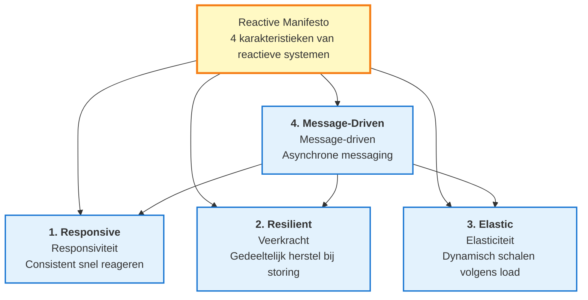
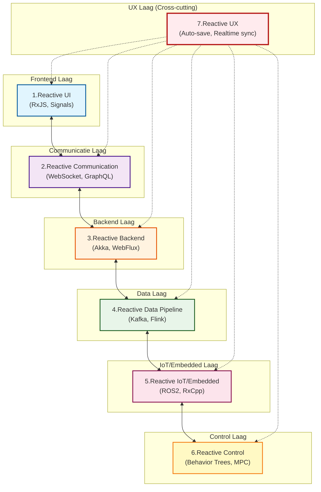
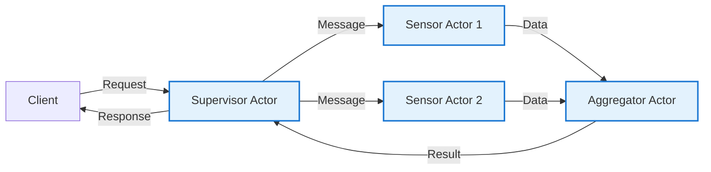
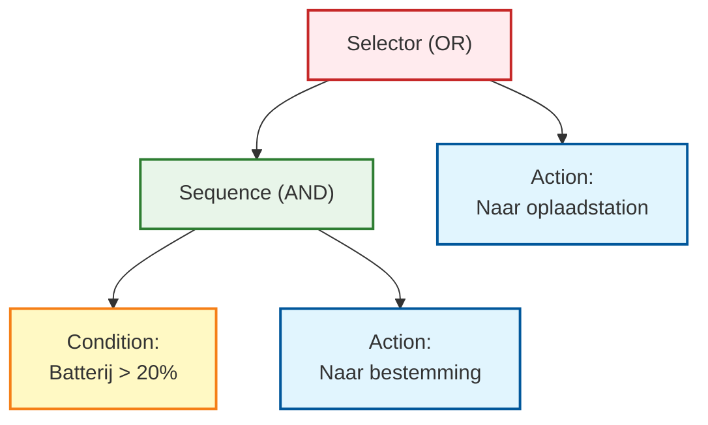
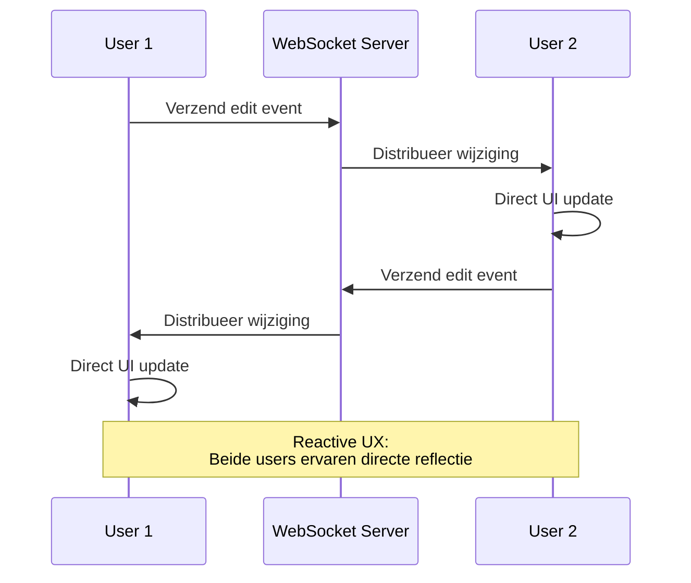
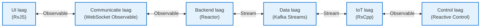

# Reactieve Architectuur Totaalkaart

Reactief programmeren overstijgt het kader van losse libraries en frameworks en evolueert naar een **systeembrede architectuurfilosofie**.

Deze pagina legt systematisch **het totaalbeeld van reactieve architectuur** uit in 7 lagen, van UI tot backend, data pipeline, IoT en control systemen.

## Wat is Reactieve Architectuur

Reactieve architectuur is een benadering van systeemontwerp die **tijdvariërende waarden (Time-Varying Values)** centraal stelt.

#### Centrale gedachte
> Van UI clicks tot IoT sensoren, datastreams, robot control, alles **reageert op waarden die in de tijd veranderen**

Om deze gedachte te realiseren definieert het [Reactive Manifesto](https://www.reactivemanifesto.org/) (Reactieve Verklaring) vier belangrijke karakteristieken.

## De 4 Karakteristieken van Reactive Manifesto

Het Reactive Manifesto definieert vier karakteristieken die reactieve systemen moeten hebben.



### 1. Responsive (Responsiviteit)

Systeem **reageert consistent en snel** op user input en omgevingsveranderingen.

::: tip Concrete voorbeelden
- Directe feedback op UI operaties
- Voorspelbaarheid van API responstijd
- Realtime data updates
:::

### 2. Resilient (Veerkracht)

Ook bij storing **gedeeltelijk herstellen** zonder dat het hele systeem stopt.

::: tip Concrete voorbeelden
- Error handling en fallback
- Service isolatie (microservices)
- Automatische retry en circuit breaker
:::

### 3. Elastic (Elasticiteit)

**Dynamisch aanpassen van resources** volgens load en efficiënt schalen.

::: tip Concrete voorbeelden
- Auto-scaling
- Load balancing
- Backpressure controle
:::

### 4. Message-Driven (Message-driven)

Componenten communiceren via **asynchrone berichten** en realiseren loose coupling.

::: tip Concrete voorbeelden
- Event bus
- Message queues (Kafka, RabbitMQ)
- Observable/Subscriber patroon
:::

::: info Belang van Reactive Manifesto
Deze 4 karakteristieken zijn de **theoretische basis** van reactieve architectuur. RxJS en ReactiveX zijn slechts één van de tools om deze karakteristieken te realiseren.
:::

## 7 Lagen van Reactieve Architectuur

Reactieve architectuur bestaat uit de volgende 7 lagen.

| # | Laag | Overzicht | Representatieve technologieën |
|---|---|------|------------|
| 1 | **Reactive UI** | UI die direct reageert op user input | RxJS, Angular Signals, Svelte Runes, React Hooks |
| 2 | **Reactive Communication** | Stream communicatie tussen client/server | WebSocket, SSE, GraphQL Subscriptions |
| 3 | **Reactive Backend** | Event-driven, non-blocking server | Akka, Spring WebFlux, Vert.x, Node.js Streams |
| 4 | **Reactive Data Pipeline** | Event streams als first-class data model | Kafka, Flink, Apache Beam, Reactor |
| 5 | **Reactive IoT/Embedded** | Integratie en fusie van sensor streams | ROS2, RxCpp, RxRust, Zephyr |
| 6 | **Reactive Control** | Feedback loop van sensor naar control | Behavior Trees, Digital Twin, MPC |
| 7 | **Reactive UX** | Closed-loop UX over alle lagen | Auto-save, realtime collaborative editing |

### Totaal Architectuur Diagram



## 1. Reactive UI (Frontend)

Laag die **realtime scherm updates** uitvoert in reactie op user input en asynchrone operaties.

### Centrale gedachte

> UI is een "projectie van state die in de tijd verandert"

### Representatieve Technology Stack

- **RxJS** - Stream processing met Observable/Operator
- **Angular Signals** - Reactive primitives in Angular 19+
- **Svelte Runes** - Svelte 5's $state, $derived
- **React Hooks** - State management met useState, useEffect
- **Vue Reactivity** - Reactiviteit met ref, reactive, computed
- **SolidJS** - Fijnmazige reactiviteit gebaseerd op Signal

### Implementatievoorbeeld (RxJS)

```typescript
import { fromEvent } from 'rxjs';
import { debounceTime, distinctUntilChanged, map } from 'rxjs';

// Reactive UI van zoekbox
const searchInput = document.querySelector<HTMLInputElement>('#search');
const resultsDiv = document.querySelector<HTMLDivElement>('#results');

const input$ = fromEvent(searchInput!, 'input').pipe(
  map(event => (event.target as HTMLInputElement).value),
  debounceTime(300),                    // Wacht 300ms (wacht op einde typen)
  distinctUntilChanged()                // Negeer als zelfde waarde als vorige
);

input$.subscribe(async searchTerm => {
  if (searchTerm.length === 0) {
    resultsDiv!.innerHTML = '';
    return;
  }

  // API call
  const results = await fetch(`/api/search?q=${encodeURIComponent(searchTerm)}`)
    .then(res => res.json());

  // Direct UI update
  resultsDiv!.innerHTML = results
    .map((r: any) => `<div class="result">${r.title}</div>`)
    .join('');
});
```

::: tip Voordelen van Reactive UI
- Reductie van onnodige API calls door debounce/throttle
- Verbeterde leesbaarheid door declaratieve beschrijving
- Gemakkelijke integratie van meerdere asynchrone verwerkingen
:::

## 2. Reactive Communication (Communicatie Laag)

Laag die **bidirectionele data streaming** realiseert tussen client/server.

### Representatieve Technology Stack

- **WebSocket** - Full-duplex communicatieprotocol
- **Server-Sent Events (SSE)** - Unidirectionele stream van server naar client
- **GraphQL Subscriptions** - GraphQL realtime subscription functie
- **tRPC** - Type-safe RPC framework
- **RxDB** - Reactive database (offline support)

### Implementatievoorbeeld (WebSocket + RxJS)

```typescript
import { webSocket } from 'rxjs/webSocket';
import { retry, catchError } from 'rxjs';
import { of } from 'rxjs';

// Behandel WebSocket als Observable
const socket$ = webSocket<{ type: string; data: any }>({
  url: 'wss://example.com/socket',
  openObserver: {
    next: () => console.log('✅ WebSocket verbinding geslaagd')
  },
  closeObserver: {
    next: () => console.log('❌ WebSocket verbroken')
  }
});

// Realtime data ontvangst
socket$
  .pipe(
    retry({ count: 3, delay: 1000 }),  // Automatische herverbinding
    catchError(error => {
      console.error('WebSocket fout:', error);
      return of({ type: 'error', data: error });
    })
  )
  .subscribe(message => {
    switch (message.type) {
      case 'stock_price':
        updateStockChart(message.data);
        break;
      case 'notification':
        showNotification(message.data);
        break;
      // ... andere berichttypes
    }
  });

// Bericht verzenden naar server
socket$.next({ type: 'subscribe', data: { symbol: 'AAPL' } });
```

::: info WebSocket en Observable affiniteit
WebSocket's `onmessage` event is het Observable patroon zelf. RxJS's webSocket functie abstraheert dit en maakt retry en error handling gemakkelijk.
:::

## 3. Reactive Backend (Backend)

Laag die schaalbare serverarchitectuur realiseert met **event-driven, non-blocking I/O**.

### Representatieve Technology Stack

- **Akka (Scala/Java)** - Actor model gebaseerd framework
- **Vert.x (JVM)** - Polyglot reactive toolkit
- **Spring WebFlux (Java)** - Non-blocking web framework gebaseerd op Project Reactor
- **Node.js Streams** - Stream-gebaseerde I/O verwerking
- **Elixir/Phoenix LiveView** - Realtime framework op BEAM VM

### Actor Model Concept

Actor model is een concurrent processing model dat **Isolation** combineert met **asynchrone message passing**.



### Implementatievoorbeeld (Akka - Scala)

```scala
import akka.actor.{Actor, ActorRef, Props}

// Sensor Actor
class SensorActor extends Actor {
  def receive: Receive = {
    case SensorData(value) =>
      // Data verwerken
      val processed = transform(value)
      // Verzenden naar parent Actor
      context.parent ! ProcessedData(processed)

    case ErrorOccurred(error) =>
      // Error handling
      context.parent ! FailureReport(error)
  }

  private def transform(value: Double): Double = {
    // Data transformatie logica
    value * 2.0
  }
}

// Supervisor Actor
class SupervisorActor extends Actor {
  val sensor1: ActorRef = context.actorOf(Props[SensorActor], "sensor1")
  val sensor2: ActorRef = context.actorOf(Props[SensorActor], "sensor2")

  def receive: Receive = {
    case StartMonitoring =>
      sensor1 ! SensorData(10.5)
      sensor2 ! SensorData(20.3)

    case ProcessedData(value) =>
      println(s"Ontvangen data: $value")
      // Aggregatie processing etc.
  }
}

// Message definitie
case class SensorData(value: Double)
case class ProcessedData(value: Double)
case object StartMonitoring
case class ErrorOccurred(error: Throwable)
case class FailureReport(error: Throwable)
```

::: tip Voordelen Actor Model
- **Failure isolatie** - Als één Actor faalt, worden anderen niet beïnvloed
- **Schaalbaarheid** - Actors zijn lichtgewicht, miljoenen kunnen draaien
- **Message-driven** - Voldoet aan Reactive Manifesto principes
:::

## 4. Reactive Data Pipeline (Data Pipeline)

Laag die **event streams als first-class data model** behandelt.

### Centrale gedachte

> "Event Stream is the new Database" (Event stream is de nieuwe database)

Paradigma shift van traditionele database-centrische architectuur naar **event stream-centrische architectuur**.

### Representatieve Technology Stack

- **Apache Kafka** - Distributed event streaming platform
- **Apache Flink** - Stream processing engine
- **Apache Beam** - Unified batch/stream processing model
- **Apache NiFi** - Dataflow automatisering
- **Project Reactor** - Reactive library op JVM
- **Reactive Streams API** - JVM stream processing standaard

### Data Pipeline Patroon

```
Event Source → Parse → Validate → Enrich → Aggregate → Store/Forward
```

### Implementatievoorbeeld (Pseudo-code)

```typescript
// Kafka + Flink-achtige stream pipeline
stream
  .map(event => parseJSON(event))           // Parse
  .filter(data => isValid(data))            // Validatie
  .map(data => enrichWithMetadata(data))    // Metadata toevoegen
  .groupBy(data => data.sensorId)           // Groeperen per sensor ID
  .window(10.seconds)                       // Window per 10 seconden
  .reduce((acc, value) => aggregate(acc, value))  // Aggregatie
  .sink(database)                           // Opslaan in database
```

### Overeenkomstige RxJS expressie

```typescript
import { interval } from 'rxjs';
import { map, filter, groupBy, bufferTime, mergeMap } from 'rxjs';

interface SensorEvent {
  sensorId: string;
  value: number;
  timestamp: number;
}

// Simulatie event stream
const eventStream$ = interval(100).pipe(
  map((): SensorEvent => ({
    sensorId: `sensor-${Math.floor(Math.random() * 3)}`,
    value: Math.random() * 100,
    timestamp: Date.now()
  }))
);

// Data pipeline
eventStream$
  .pipe(
    // Validatie
    filter(event => event.value >= 0 && event.value <= 100),

    // Groeperen per sensor ID
    groupBy(event => event.sensorId),

    // Bufferen per groep elke 10 seconden
    mergeMap(group$ =>
      group$.pipe(
        bufferTime(10000),
        filter(events => events.length > 0),
        map(events => ({
          sensorId: events[0].sensorId,
          avgValue: events.reduce((sum, e) => sum + e.value, 0) / events.length,
          count: events.length,
          timestamp: Date.now()
        }))
      )
    )
  )
  .subscribe(aggregated => {
    console.log('Geaggregeerde data:', aggregated);
    // Opslaan in database
    saveToDatabase(aggregated);
  });

function saveToDatabase(data: any): void {
  // Database opslaglogica
}
```

::: warning Relatie met Event Sourcing
Event Sourcing is een ontwerppatroon dat systeemstatus registreert als geschiedenis van gebeurtenissen. In combinatie met event streaming platforms zoals Kafka kan een krachtige reactieve data pipeline worden gebouwd.
:::

## 5. Reactive IoT/Embedded (IoT & Embedded)

Laag die realtime integratie en fusie van sensor streams realiseert.

### Representatieve Technology Stack

- **ROS2 (Robot Operating System 2)** - Robot ontwikkelingsplatform
- **RxCpp** - C++ versie ReactiveX
- **RxRust** - Rust versie ReactiveX
- **Zephyr RTOS** - IoT real-time OS
- **TinyOS** - Sensor netwerk OS

### Verschil met UI

| Gezichtspunt | Reactive UI | Reactive IoT |
|------|------------|--------------|
| **Reactiviteitsonderwerp** | User input, API response | Sensorwaarden, control signalen |
| **Real-time** | Milliseconde orde (UX focus) | Microseconde orde (control focus) |
| **Hoofdverwerking** | Display, validatie | Filtering, fusie, control |

### Implementatievoorbeeld (ROS2 - Python)

```python
import rclpy
from rclpy.node import Node
from sensor_msgs.msg import LaserScan
from geometry_msgs.msg import Twist

class ObstacleAvoidance(Node):
    def __init__(self):
        super().__init__('obstacle_avoidance')

        # Subscriben op LiDAR sensor data
        self.subscription = self.create_subscription(
            LaserScan,
            '/scan',
            self.laser_callback,
            10
        )

        # Publiceren snelheidscommando
        self.velocity_publisher = self.create_publisher(
            Twist,
            '/cmd_vel',
            10
        )

    def laser_callback(self, msg: LaserScan):
        # Sensor data verwerking (reactief)
        min_distance = min(msg.ranges)

        # Reactie op obstakel detectie
        if min_distance < 0.5:  # Binnen 50cm obstakel
            self.get_logger().warn(f'⚠️ Obstakel gedetecteerd: {min_distance:.2f}m')
            self.stop_robot()
        else:
            self.move_forward()

    def stop_robot(self):
        twist = Twist()
        twist.linear.x = 0.0
        twist.angular.z = 0.0
        self.velocity_publisher.publish(twist)

    def move_forward(self):
        twist = Twist()
        twist.linear.x = 0.3  # 0.3 m/s vooruit
        twist.angular.z = 0.0
        self.velocity_publisher.publish(twist)

def main(args=None):
    rclpy.init(args=args)
    node = ObstacleAvoidance()
    rclpy.spin(node)
    rclpy.shutdown()

if __name__ == '__main__':
    main()
```

::: info Sensor Fusion en Reactief
"Sensor fusion" dat data van meerdere sensoren (LiDAR, camera, IMU, GPS) integreert, is hetzelfde concept als RxJS's `combineLatest` en `merge`.
:::

## 6. Reactive Control (Control Systemen)

Laag die feedback loop van sensor naar control realiseert.

### Representatieve Technology Stack

- **Behavior Trees** - Gedragsselectie voor robots en game AI
- **Digital Twin** - Digitale replica van fysiek systeem
- **Model Predictive Control (MPC)** - Predictive control
- **Cyber-Physical Systems (CPS)** - Cyber-physical systemen

### Behavior Tree Structuur



**Werking:**
1. Batterij > 20% → Naar bestemming
2. Batterij < 20% → Naar oplaadstation

### Reactieve expressie van state transitie

State transitie van Behavior Tree kan worden uitgedrukt met RxJS's `scan` en `switchMap`.

```typescript
import { interval, Subject } from 'rxjs';
import { map, scan, switchMap } from 'rxjs';

type BatteryLevel = number; // 0-100
type RobotState = 'IDLE' | 'MOVING_TO_GOAL' | 'MOVING_TO_CHARGER' | 'CHARGING';

interface RobotStatus {
  state: RobotState;
  batteryLevel: BatteryLevel;
}

// Simulatie batterijniveau
const batteryLevel$ = interval(1000).pipe(
  scan((level, _) => Math.max(0, level - 1), 100) // Elke seconde 1% afname
);

// Behavior Tree logica
const robotState$ = batteryLevel$.pipe(
  map((batteryLevel): RobotStatus => {
    // Selector (OR) logica
    if (batteryLevel > 20) {
      // Sequence (AND) conditie voldaan
      return { state: 'MOVING_TO_GOAL', batteryLevel };
    } else {
      // Opladen nodig
      return { state: 'MOVING_TO_CHARGER', batteryLevel };
    }
  })
);

robotState$.subscribe(status => {
  console.log(`State: ${status.state}, Battery: ${status.batteryLevel}%`);

  switch (status.state) {
    case 'MOVING_TO_GOAL':
      console.log('→ Naar bestemming');
      break;
    case 'MOVING_TO_CHARGER':
      console.log('⚠️ Batterij laag! Naar oplaadstation');
      break;
  }
});
```

::: tip Control systemen en reactiviteit
"Feedback loop" in control engineering is in essentie hetzelfde als "event-driven" in reactief programmeren. Control commando's dynamisch wijzigen volgens veranderingen in sensorwaarden.
:::

## 7. Reactive UX (Closed-loop UX)

De hoogste laag die **closed-loop UX** over alle lagen realiseert.

### Centrale gedachte

> Responsiviteit van het hele systeem creëert consistente gebruikerservaring

### Representatieve voorbeelden

| Service | Kenmerken Reactive UX |
|---------|-------------------|
| **Google Docs** | Auto-save, realtime collaborative editing |
| **Figma** | Multi-user live collaboration |
| **Firebase** | Realtime data synchronisatie |
| **Slack** | Directe levering en weergave berichten |
| **Notion** | Offline editing en naadloze synchronisatie |

### Implementatievoorbeeld: Auto-save functie

```typescript
import { fromEvent, Subject } from 'rxjs';
import { debounceTime, distinctUntilChanged, switchMap, catchError } from 'rxjs';
import { of } from 'rxjs';

// Editor inhoud wijziging event
const editor = document.querySelector<HTMLTextAreaElement>('#editor');
const statusDiv = document.querySelector<HTMLDivElement>('#status');

const editorChange$ = fromEvent(editor!, 'input').pipe(
  map(event => (event.target as HTMLTextAreaElement).value)
);

// Auto-save logica
const autoSave$ = editorChange$.pipe(
  debounceTime(2000),                    // Wacht 2 seconden zonder input
  distinctUntilChanged(),                // Niet opslaan als zelfde inhoud als vorige
  switchMap(content => {
    // Weergave tijdens opslaan
    statusDiv!.textContent = '💾 Opslaan...';

    // API call
    return fetch('/api/save', {
      method: 'POST',
      headers: { 'Content-Type': 'application/json' },
      body: JSON.stringify({ content })
    }).then(res => {
      if (!res.ok) throw new Error('Opslaan mislukt');
      return res.json();
    });
  }),
  catchError(error => {
    statusDiv!.textContent = '❌ Opslaan mislukt';
    return of(null);
  })
);

autoSave$.subscribe(result => {
  if (result) {
    statusDiv!.textContent = '✅ Opslaan voltooid';
    setTimeout(() => {
      statusDiv!.textContent = '';
    }, 2000);
  }
});
```

### Mechanisme van realtime collaborative editing



::: info Essentie van Reactive UX
Reactive UX wordt gerealiseerd doordat UI → Communicatie → Backend → Data pipeline → IoT → Control **alle lagen consistent reactief zijn**. Als slechts één laag reactief is, kan echte Reactive UX niet worden bereikt.
:::

## Integratie tussen lagen en rol van ReactiveX

De 7 lagen lijken onafhankelijk, maar worden naadloos geïntegreerd doordat **ReactiveX als gemeenschappelijke taal** functioneert.

### Integratie door ReactiveX



**Gemeenschappelijke concepten:**
- **Observable/Stream** - Waarden die in de tijd veranderen
- **Operator/Transformation** - Data transformatie en filtering
- **Subscribe/Consume** - Event consumptie
- **Backpressure** - Load control
- **Error Handling** - Error propagatie en verwerking

::: tip Waarde van ReactiveX
ReactiveX maakt het mogelijk om van UI click events tot IoT sensoren, datastreams, robot control **alles met hetzelfde concept (Observable) te behandelen**. Hierdoor kunnen fullstack engineers het hele systeem ontwerpen met een consistent denkmodel.
:::

## Voordelen van Reactieve Architectuur

### 1. Consistent conceptueel model

In verschillende domeinen (UI, backend, data, IoT) kan **hetzelfde concept** worden gebruikt.

**Traditioneel:**
- UI: Event listeners
- Backend: Callbacks
- Data: Batch processing
- IoT: Polling

**Reactief:**
- Alles: **Observable/Stream**

### 2. Uniforme behandeling van asynchrone verwerking

Promise, callbacks, events, streams kunnen worden **verenigd in Observable**.

```typescript
import { from, fromEvent, ajax } from 'rxjs';

// Promise naar stream
const promise$ = from(fetch('/api/data'));

// Event naar stream
const click$ = fromEvent(button, 'click');

// Ajax call naar stream
const api$ = ajax('/api/endpoint');

// Alles kan op dezelfde manier worden behandeld
promise$.subscribe(/*...*/);
click$.subscribe(/*...*/);
api$.subscribe(/*...*/);
```

### 3. Schaalbaarheid en fault tolerance

Door de 4 karakteristieken van Reactive Manifesto
- **Responsive** - Consistente responstijd
- **Resilient** - Failure isolatie en herstel
- **Elastic** - Dynamisch schalen volgens load
- **Message-Driven** - Loosely coupled componenten

### 4. Verbeterde real-time

Door event-driven architectuur kunnen **data wijzigingen direct worden gepropageerd**.

**Traditioneel (Polling):**
```
Client → [Periodiek request] → Server
```

**Reactief (Push):**
```
Client ← [Direct notificatie bij wijziging] ← Server
```

### 5. Verbeterde developer experience

Door declaratieve beschrijving wordt **code intentie duidelijk**.

```typescript
// ❌ Imperatief: intentie moeilijk te lezen
let lastValue = '';
input.addEventListener('input', (e) => {
  const value = e.target.value;
  if (value !== lastValue) {
    setTimeout(() => {
      if (value.length > 0) {
        fetch(`/api/search?q=${value}`)
          .then(/*...*/);
      }
    }, 300);
    lastValue = value;
  }
});

// ✅ Declaratief: intentie in één oogopslag duidelijk
fromEvent(input, 'input')
  .pipe(
    map(e => e.target.value),
    debounceTime(300),
    distinctUntilChanged(),
    filter(value => value.length > 0),
    switchMap(value => ajax(`/api/search?q=${value}`))
  )
  .subscribe(/*...*/);
```

## Samenvatting

Reactieve architectuur is een ontwerpfilosofie die **waarden die in de tijd veranderen** centraal stelt.

### Rol van 7 lagen

| Laag | Rol | Gebruik ReactiveX |
|----|------|----------------|
| **1. Reactive UI** | Directe reactie op user input | RxJS, Signals |
| **2. Reactive Communication** | Client/server streaming | WebSocket Observable |
| **3. Reactive Backend** | Event-driven server | Akka, Reactor |
| **4. Reactive Data Pipeline** | Event stream processing | Kafka, Flink |
| **5. Reactive IoT/Embedded** | Sensor stream integratie | RxCpp, ROS2 |
| **6. Reactive Control** | Feedback loop control | Behavior Trees |
| **7. Reactive UX** | Consistente ervaring over alle lagen | Integratie van alles hierboven |

### Belang van Reactive Manifesto

::: info 4 Karakteristieken

1. **Responsive (Responsiviteit)** - Consistent snel reageren
2. **Resilient (Veerkracht)** - Gedeeltelijk herstel bij storing
3. **Elastic (Elasticiteit)** - Dynamisch schalen volgens load
4. **Message-Driven (Message-driven)** - Asynchrone messaging

:::

### Essentie van ReactiveX

ReactiveX is een **gemeenschappelijke taal** die deze lagen cross-cutting behandelt.

> Van UI clicks tot IoT sensoren, datastreams, robot control, alles **reageert op waarden die in de tijd veranderen**

Door dit uniforme concept kunnen fullstack engineers het hele systeem ontwerpen met een consistent denkmodel.

### Volgende stappen

Om begrip van reactieve architectuur te verdiepen

1. **Begin klein** - Praktiseer eerst in één laag (Reactive UI)
2. **Breid geleidelijk uit** - Breid uit naar communicatie laag, backend laag
3. **Leer van echte services** - Observeer werking van Google Docs, Figma etc.
4. **Lees Reactive Manifesto** - Begrijp theoretische basis

## Gerelateerde pagina's

- [Embedded Development en Reactief Programmeren](/nl/guide/appendix/embedded-reactive-programming) - Details van IoT/embedded laag
- [Reactieve Methoden Buiten ReactiveX](/nl/guide/appendix/reactive-patterns-beyond-rxjs) - Concrete implementatiemethoden voor elke laag
- [RxJS Introductie](/nl/guide/introduction) - RxJS basis concepten
- [Wat is Observable](/nl/guide/observables/what-is-observable) - Observable basis
- [Combination Operators](/nl/guide/operators/combination/) - Integratie van meerdere streams

## Referenties

- [GitHub Discussions - Reactieve Architectuur Totaalkaart](https://github.com/shuji-bonji/RxJS-with-TypeScript/discussions/15)
- [Reactive Manifesto](https://www.reactivemanifesto.org/) - Definitie van reactieve systemen
- [RxJS Officiële Documentatie](https://rxjs.dev/)
- [Akka Officiële Documentatie](https://doc.akka.io/)
- [Apache Kafka Officiële Documentatie](https://kafka.apache.org/documentation/)
- [ROS2 Officiële Documentatie](https://docs.ros.org/)
