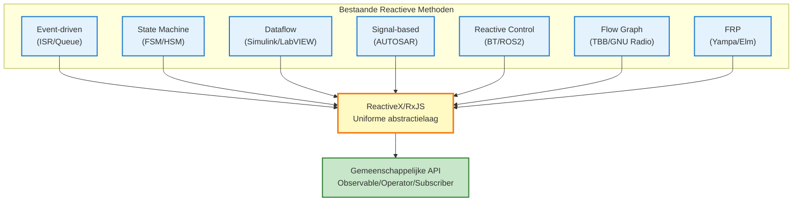

# Reactieve Methoden Buiten ReactiveX (Embedded Perspectief)

De gedachte van reactief programmeren is al sinds voor de komst van ReactiveX (RxJS) breed in praktijk gebracht in embedded systemen en control engineering.

Deze pagina organiseert systematisch **methoden die de principes van reactief programmeren realiseren zonder ReactiveX te gebruiken** en verduidelijkt de relatie met RxJS.

## Essentie van Reactief Programmeren

De kern van reactief programmeren ligt in de volgende 3 principes.

1. **Data Flow** - Data wordt behandeld als stream die in de tijd verandert
2. **Event-Driven** - Verwerking wordt automatisch uitgevoerd bij event
3. **Declarative** - Beschrijft "wat te doen", "wanneer en hoe" is geabstraheerd

Deze principes worden ook gerealiseerd in veel methoden buiten ReactiveX.

::: info Essentie van ReactiveX
ReactiveX heeft reactiviteit niet **uitgevonden**, maar bestaande practices **gestandaardiseerd in een uniforme abstractielaag**.
:::

## Reactieve methoden buiten ReactiveX

Introductie van 7 representatieve reactieve methoden gebruikt in embedded systemen en control engineering.

| # | Methode | Overzicht | Representatieve tools/frameworks |
|---|------|------|--------------------------|
| 1 | **Event-Driven Architectuur** | Asynchrone event verwerking met ISR/queue | RTOS (FreeRTOS, Zephyr) |
| 2 | **State Machine (FSM/HSM)** | State transitie volgens event | QPC, SCXML, Yakindu |
| 3 | **Dataflow Programming** | Node activatie volgens datastroom | Simulink, LabVIEW, SCADE |
| 4 | **Signal-Based Control** | Waarde update propagatie door hele systeem | AUTOSAR COM Stack, Simulink |
| 5 | **Reactive Control Systems** | Gedragsselectie volgens omgevingsverandering | Behavior Tree, ROS2 |
| 6 | **Flow Graph Libraries** | Parallelle verwerking met expliciete data afhankelijkheid | Intel TBB, GNU Radio, StreamIt |
| 7 | **Functional Reactive Programming** | Functionele behandeling van tijdveranderende waarden | Haskell Yampa, Elm, Dunai |

## 1. Event-Driven Architectuur

Structuur waarbij Interrupt Service Routine (ISR) events vastlegt en via message queue aan tasks notificeert.

### Implementatievoorbeeld in C

```c
// Event queue (global)
typedef struct {
    EventType type;
    void* data;
} Event;

Event eventQueue[EVENT_QUEUE_SIZE];
int queueHead = 0;
int queueTail = 0;

// Interrupt Service Routine (ISR)
void ISR_SensorUpdate() {
    // Data lezen van sensor
    SensorData* data = readSensor();

    // Pushen naar event queue
    Event e = { EVENT_SENSOR_NEW_DATA, data };
    EventQueue_push(e);
}

// Main task
void Task_MainLoop() {
    Event e;
    while (1) {
        if (EventQueue_pop(&e)) {
            switch (e.type) {
                case EVENT_SENSOR_NEW_DATA:
                    processSensorData((SensorData*)e.data);
                    break;
                case EVENT_TIMER_EXPIRED:
                    handleTimeout();
                    break;
                // ... andere event verwerking
            }
        }
    }
}
```

### Correspondentie met RxJS

| Event-driven model | RxJS |
|-----------------|------|
| `EventQueue` | `Observable` |
| `Task_MainLoop` | `subscribe()` |
| `ISR_SensorUpdate` | `next()` |
| Event type | Stream waarde type |

::: tip Kenmerken Event-driven
- Breed geadopteerd in RTOS (Real-Time Operating System)
- Duidelijke scheiding tussen interrupt en task verwerking
- Asynchrone verwerking door queuing
:::

## 2. State Machine (FSM / HSM)

Finite State Machine (FSM) of Hierarchical State Machine (HSM) is een patroon dat state transities uitvoert gebaseerd op event input.

### State Machine voorbeeld (C)

```c
typedef enum {
    STATE_IDLE,
    STATE_RUNNING,
    STATE_ERROR,
    STATE_SHUTDOWN
} State;

typedef enum {
    EVENT_START,
    EVENT_STOP,
    EVENT_ERROR_DETECTED,
    EVENT_RESET
} Event;

State currentState = STATE_IDLE;

void stateMachine(Event event) {
    switch (currentState) {
        case STATE_IDLE:
            if (event == EVENT_START) {
                currentState = STATE_RUNNING;
                startOperation();
            }
            break;

        case STATE_RUNNING:
            if (event == EVENT_STOP) {
                currentState = STATE_IDLE;
                stopOperation();
            } else if (event == EVENT_ERROR_DETECTED) {
                currentState = STATE_ERROR;
                handleError();
            }
            break;

        case STATE_ERROR:
            if (event == EVENT_RESET) {
                currentState = STATE_IDLE;
                resetSystem();
            }
            break;

        // ... andere states
    }
}
```

### Representatieve tools
- **QPC (Quantum Platform)** - Hierarchical state machine framework
- **SCXML (State Chart XML)** - W3C standaard state machine beschrijvingstaal
- **Yakindu Statechart Tools** - State chart modeling tool

### Corresponderende expressie in RxJS

```typescript
import { Subject, scan } from 'rxjs';

type State = 'IDLE' | 'RUNNING' | 'ERROR' | 'SHUTDOWN';
type Event = 'START' | 'STOP' | 'ERROR_DETECTED' | 'RESET';

const events$ = new Subject<Event>();

const state$ = events$.pipe(
  scan((state: State, event: Event): State => {
    switch (state) {
      case 'IDLE':
        return event === 'START' ? 'RUNNING' : state;
      case 'RUNNING':
        if (event === 'STOP') return 'IDLE';
        if (event === 'ERROR_DETECTED') return 'ERROR';
        return state;
      case 'ERROR':
        return event === 'RESET' ? 'IDLE' : state;
      default:
        return state;
    }
  }, 'IDLE' as State)
);

state$.subscribe(state => console.log('Current state:', state));

// Event firing
events$.next('START');   // → RUNNING
events$.next('STOP');    // → IDLE
```

::: info Voordelen Hierarchical State Machine (HSM)
HSM kan meerdere states groeperen en heeft structuur vergelijkbaar met RxJS's `share` en `shareReplay` die "meerdere subscriptions samenvoegen".
:::

## 3. Dataflow Programming

Visuele programmeersmethode die nodes activeert volgens datastroom.

### Representatieve tools
- **MATLAB Simulink** - Control systeemontwerp en simulatie
- **LabVIEW (National Instruments)** - Meetinstrumentatie en control systeemontwikkeling
- **SCADE (Esterel Technologies)** - Veiligheid-kritische systemen (lucht-/ruimtevaart, spoorwegen)

### Simulink Dataflow Image

```
[Sensor] → [Low-Pass Filter] → [Threshold] → [Condition] → [Actuator]
   ↓              ↓                 ↓              ↓             ↓
  Ruw        Smoothed           Judgment        True/False     Output
```

### Corresponderende expressie in RxJS

```typescript
import { interval } from 'rxjs';
import { map, filter, tap } from 'rxjs';

// Sensor stream
const sensor$ = interval(100).pipe(
  map(() => Math.random() * 100) // Sensor waarde simulatie
);

// Dataflow pipeline
sensor$
  .pipe(
    map(value => lowPassFilter(value)),        // Low-pass filter
    map(value => value > 50 ? value : 0),      // Threshold verwerking
    filter(value => value > 0),                // Conditie bepaling
    tap(value => actuate(value))               // Actuator activatie
  )
  .subscribe();

function lowPassFilter(value: number): number {
  // Vereenvoudigd low-pass filter (moving average)
  return value * 0.3 + previousValue * 0.7;
}

function actuate(value: number): void {
  console.log('Actuator output:', value);
}
```

::: tip Kenmerken Dataflow Programming
- Visueel begrijpen van datastroom
- Breed geadopteerd in control engineering en signaalverwerking
- Structuur sterk vergelijkbaar met RxJS pipeline (`.pipe()`)
:::

## 4. Signal-Based Control

Patroon dat waarde updates door het hele systeem propageert. Representatieve voorbeelden zijn AUTOSAR COM Stack en Simulink, gestandaardiseerd in de auto-industrie.

### AUTOSAR COM Stack Image

```c
// Signal definitie
typedef struct {
    uint16_t speed;        // Snelheid [km/h]
    uint8_t temperature;   // Temperatuur [℃]
    bool doorOpen;         // Deur open/dicht status
} VehicleSignals;

VehicleSignals currentSignals;

// Signal update
void updateSpeed(uint16_t newSpeed) {
    currentSignals.speed = newSpeed;
    // COM Stack notificeert subscribers
    Com_SendSignal(SIGNAL_ID_SPEED, &currentSignals.speed);
}

// Signal subscription
void speedMonitor() {
    uint16_t speed;
    Com_ReceiveSignal(SIGNAL_ID_SPEED, &speed);

    if (speed > 120) {
        triggerSpeedWarning();
    }
}
```

### RxJS correspondentie (BehaviorSubject)

```typescript
import { BehaviorSubject } from 'rxjs';

interface VehicleSignals {
  speed: number;
  temperature: number;
  doorOpen: boolean;
}

// BehaviorSubject - behoudt huidige waarde
const vehicleSignals$ = new BehaviorSubject<VehicleSignals>({
  speed: 0,
  temperature: 20,
  doorOpen: false
});

// Signal update
function updateSpeed(newSpeed: number) {
  const current = vehicleSignals$.value;
  vehicleSignals$.next({ ...current, speed: newSpeed });
}

// Signal subscription
vehicleSignals$.subscribe(signals => {
  if (signals.speed > 120) {
    console.log('⚠️ Snelheidsoverschrijding waarschuwing');
  }
});

updateSpeed(130); // → Waarschuwing wordt geactiveerd
```

::: info Kenmerken Signal-Based Control
- **Behoudt altijd huidige waarde** - Zelfde karakteristiek als BehaviorSubject
- Breed geadopteerd in AUTOSAR (auto-industrie standaard)
- Gebruikt voor communicatie tussen ECU (Electronic Control Unit)
:::

## 5. Reactive Control Systems

Methode voor implementatie van gedragsselectie volgens omgevingsverandering, voor robotica en autonome rijden.

### Representatieve frameworks
- **Behavior Tree (BT)** - Game AI, robot control
- **ROS2 (Robot Operating System 2)** - Robot ontwikkelingsplatform

### Behavior Tree Structuur

```
Selector (OR)
├─ Sequence (AND)
│  ├─ Condition: Batterij > 20%
│  └─ Action: Naar bestemming
└─ Action: Naar oplaadstation
```

### ROS2 Reactief Patroon (Python)

```python
import rclpy
from rclpy.node import Node
from sensor_msgs.msg import LaserScan

class ObstacleDetector(Node):
    def __init__(self):
        super().__init__('obstacle_detector')
        # Subscriben op LiDAR sensor data
        self.subscription = self.create_subscription(
            LaserScan,
            '/scan',
            self.laser_callback,
            10
        )

    def laser_callback(self, msg):
        # Minimale afstand ophalen
        min_distance = min(msg.ranges)

        # Reactie op obstakel detectie
        if min_distance < 0.5:  # Binnen 50cm
            self.get_logger().warn('Obstakel gedetecteerd! Stoppen')
            self.stop_robot()
```

### Corresponderende expressie in RxJS

```typescript
import { fromEvent } from 'rxjs';
import { map, filter } from 'rxjs';

// LiDAR sensor data stream
const lidarData$ = fromEvent<LaserScan>(lidarSensor, 'scan');

lidarData$
  .pipe(
    map(scan => Math.min(...scan.ranges)),  // Minimale afstand ophalen
    filter(minDistance => minDistance < 0.5) // Binnen 50cm
  )
  .subscribe(() => {
    console.warn('⚠️ Obstakel gedetecteerd! Stoppen');
    stopRobot();
  });
```

::: tip Toepassingsgebieden Reactive Control
- Obstakel vermijding in autonome voertuigen
- Autonome vlucht van drones
- Veiligheidscontrole van industriële robots
:::

## 6. Flow Graph Libraries

Libraries die data afhankelijkheden expliciet verwerken in multi-threaded omgevingen.

### Representatieve libraries
- **Intel TBB (Threading Building Blocks) Flow Graph**
- **GNU Radio** - Software Defined Radio (SDR)
- **StreamIt (MIT)** - Stream processing taal

### Intel TBB Flow Graph voorbeeld (C++)

```cpp
#include <tbb/flow_graph.h>
#include <iostream>

int main() {
    tbb::flow::graph g;

    // Broadcast node (Observable-achtige rol)
    tbb::flow::broadcast_node<int> source(g);

    // Transformatie node (map-achtige rol)
    tbb::flow::function_node<int, int> multiply(
        g,
        tbb::flow::unlimited,
        [](int x) { return x * 2; }
    );

    tbb::flow::function_node<int, int> add(
        g,
        tbb::flow::unlimited,
        [](int x) { return x + 10; }
    );

    // Output node (subscribe-achtige rol)
    tbb::flow::function_node<int> output(
        g,
        tbb::flow::unlimited,
        [](int x) { std::cout << "Result: " << x << std::endl; }
    );

    // Edge connecties
    tbb::flow::make_edge(source, multiply);
    tbb::flow::make_edge(multiply, add);
    tbb::flow::make_edge(add, output);

    // Data invoeren
    source.try_put(5);  // → Result: 20 (5 * 2 + 10)
    g.wait_for_all();

    return 0;
}
```

### Corresponderende expressie in RxJS

```typescript
import { of } from 'rxjs';
import { map } from 'rxjs';

of(5)
  .pipe(
    map(x => x * 2),      // multiply
    map(x => x + 10)      // add
  )
  .subscribe(result => {
    console.log('Result:', result); // → Result: 20
  });
```

::: info Kenmerken Flow Graph
- **Parallelle uitvoering optimalisatie** - Expliciet beheer van data afhankelijkheden
- Efficiënt gebruik van CPU multi-cores
- Breed geadopteerd in signaalverwerking, beeldverwerking, communicatiesystemen
:::

## 7. Functional Reactive Programming (FRP)

Functional Reactive Programming (FRP) is de theoretische basis van reactief programmeren.

### Representatieve talen/libraries
- **Haskell Yampa** - Game ontwikkeling, robotica
- **Elm** - Web frontend (type-safe React-achtig framework)
- **Dunai** - General-purpose FRP library

### Haskell Yampa voorbeeld

```haskell
import FRP.Yampa

-- Signal Function (SF) definitie
-- Tijdsafhankelijke transformatie Input → Output
simpleSF :: SF Double Double
simpleSF = arr (\x -> x * 2)       -- Waarde verdubbelen
       >>> integral                -- Integraal (accumulatie in tijd)
       >>> arr (\x -> x + 10)      -- 10 optellen

-- Uitvoeringsvoorbeeld
-- Input: waarde die in tijd verandert (bijv. sensorwaarde)
-- Output: stream van getransformeerde waarden
```

### Corresponderende expressie in RxJS

```typescript
import { interval } from 'rxjs';
import { map, scan } from 'rxjs';

const simpleSF$ = interval(100).pipe(
  map(x => x * 2),                         // arr (\x -> x * 2)
  scan((acc, value) => acc + value, 0),    // integral (integraal = accumulatie)
  map(x => x + 10)                         // arr (\x -> x + 10)
);

simpleSF$.subscribe(result => console.log(result));
```

### Hoofdconcepten FRP

| FRP Concept | Beschrijving | RxJS correspondentie |
|--------|------|----------|
| **Signal** | Waarde die in tijd verandert | `Observable` |
| **Event** | Discrete gebeurtenis | `Subject` |
| **Signal Function (SF)** | Signaal transformatiefunctie | `pipe()` + operators |
| **Behavior** | Tijdsverandering die altijd waarde heeft | `BehaviorSubject` |

::: info Belang van FRP
FRP is de **theoretische basis** van ReactiveX. Concepten ontwikkeld in pure functionele talen zoals Haskell zijn overgeërfd in RxJS en ReactiveX.
:::

## Positionering van ReactiveX

De essentie van ReactiveX wordt duidelijk tegen de achtergrond van deze 7 methoden.

### Rol van ReactiveX



ReactiveX functioneert als **gemeenschappelijke taal** die deze bestaande methoden cross-cutting behandelt.

### Voordelen van ReactiveX

| Gezichtspunt | Traditionele methoden | ReactiveX/RxJS |
|------|-----------|---------------|
| **Leercost** | Verschillende concepten en tools per domein | Uniforme API (Observable/Operator) |
| **Portabiliteit** | Sterke platformafhankelijkheid | Concepten gemeenschappelijk tussen talen (RxJava, RxSwift etc.) |
| **Composeerbaarheid** | Moeilijk combineren tussen methoden | Flexibel composeren met operators |
| **Debugging** | Domein-specifieke tools nodig | Gemeenschappelijke tools zoals RxJS DevTools, tap |
| **Testing** | Complex testen van asynchrone verwerking | TestScheduler, Marble Testing |

::: tip Essentie van ReactiveX
ReactiveX is **geen uitvinding maar integratie**. Het is belangrijk om bestaande reactieve methoden te leren en te begrijpen als abstractielaag die ze uniform behandelt.
:::

## Onderscheid in praktijk

Elke methode heeft geschikte toepassingsgebieden.

### Vergelijking toepassingsgebieden

| Methode | Optimaal gebruik | Leercost | Portabiliteit |
|------|----------|-----------|--------|
| **Event-driven (ISR/Queue)** | RTOS-gebaseerde embedded control | Laag | Laag (platformafhankelijk) |
| **State Machine (FSM/HSM)** | Control met complexe state transities | Middel | Middel (abstracteerbaar met QPC etc.) |
| **Dataflow (Simulink)** | Control systeemontwerp en simulatie | Hoog | Laag (toolafhankelijk) |
| **Signal-based (AUTOSAR)** | Auto ECU communicatie | Hoog | Laag (industrie standaard maar gespecialiseerd) |
| **Reactive Control (ROS2)** | Robotica, autonome rijden | Middel | Middel (ROS2 ecosysteem) |
| **Flow Graph (TBB)** | Parallelle verwerking, signaalverwerking | Middel | Middel (C++ omgeving) |
| **FRP (Haskell)** | Type safety focus, academisch onderzoek | Hoog | Laag (functionele taal) |
| **ReactiveX (RxJS)** | Web apps, IoT edge verwerking, algemeen | Middel | **Hoog (multi-taal support)** |

### Selectie richtlijnen

::: warning Hard real-time control (microseconde orde)
→ **Event-driven (ISR/Queue)** of **Dedicated RTOS**

ReactiveX is ongeschikt (grote overhead)
:::

::: tip Soft real-time control (milliseconde orde)
→ **ReactiveX/RxJS** is optimaal

Sensorintegratie, gebeurteniscorrelatie detectie, anomalie detectie etc.
:::

::: info Bij bestaande toolchain
→ **Prioriteer standaard tools van dat domein**

Bijv: Auto-industrie → AUTOSAR, Robotica → ROS2
:::

## Samenvatting

De gedachte van reactief programmeren is al voor de komst van ReactiveX in veel domeinen in praktijk gebracht.

### Belangrijke punten

1. **ReactiveX is integrator** - Gemeenschappelijke taal die bestaande methoden cross-cutting behandelt
2. **Optimale oplossing per domein** - Elke methode heeft geschikte toepassingsgebieden
3. **Gemeenschappelijkheid concepten** - Event-driven, dataflow, declaratieve beschrijving zijn gemeenschappelijk
4. **Synergie in leren** - Als je één methode diep begrijpt, worden andere methoden ook gemakkelijker te begrijpen

### Betekenis van ReactiveX leren

::: info Wat je krijgt door ReactiveX te leren

1. **Cross-cutting begrip** - Gemeenschappelijk concept in embedded, web, mobile
2. **Overdraagbare vaardigheden** - Multi-taal support zoals RxJava, RxSwift, RxKotlin
3. **Uniforme debugging en testmethoden** - RxJS DevTools, Marble Testing
4. **Essentieel begrip bestaande methoden** - Theoretische basis van event-driven, state machines etc.

:::

Of het nu embedded systemen of web applicaties zijn, **de essentie van reactief programmeren verandert niet**. ReactiveX is een krachtige tool die deze inzichten integreert en moderne abstractie biedt.

## Gerelateerde pagina's

- [Embedded Development en Reactief Programmeren](/nl/guide/appendix/embedded-reactive-programming) - Gebruik van RxJS in embedded systemen
- [RxJS Introductie](/nl/guide/introduction) - RxJS basis concepten
- [Wat is Observable](/nl/guide/observables/what-is-observable) - Observable basis
- [Wat is Subject](/nl/guide/subjects/what-is-subject) - Details van BehaviorSubject etc.
- [Operator Overzicht](/nl/guide/operators/) - Data transformatie en filtering

## Referenties

- [GitHub Discussions - Reactieve Methoden Buiten ReactiveX (Embedded Perspectief)](https://github.com/shuji-bonji/RxJS-with-TypeScript/discussions/14)
- [QPC (Quantum Platform)](https://www.state-machine.com/qpc/) - Hierarchical state machine framework
- [Intel TBB Flow Graph](https://www.intel.com/content/www/us/en/docs/onetbb/developer-guide-api-reference/2021-14/flow-graph.html)
- [ROS2 Documentatie](https://docs.ros.org/en/rolling/)
- [AUTOSAR Classic Platform](https://www.autosar.org/standards/classic-platform/)
- [Functional Reactive Programming (FRP)](https://wiki.haskell.org/Functional_Reactive_Programming)
