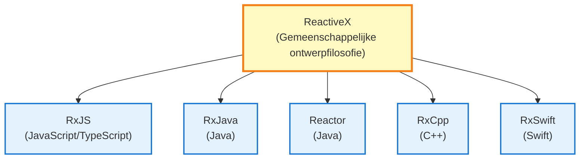
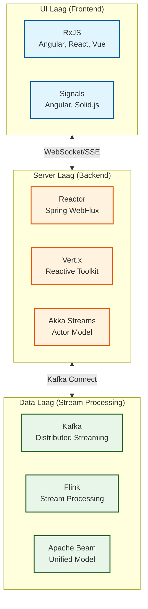
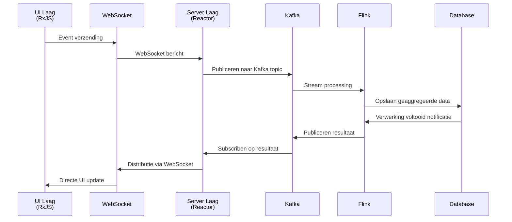

# RxJS en Reactive Streams

Wanneer je RxJS leert, hebben veel ontwikkelaars de vraag "Hoe is RxJS gepositioneerd binnen het totale beeld van Reactive Programming?"

Deze pagina legt uit **het verschil tussen RxJS en Reactive Streams standaard**, **het totaaloverzicht van technology stack van UI-laag tot data-laag**, en **methoden voor integratie tussen verschillende technologieën**.

## Positionering van RxJS

### Wat is RxJS

**RxJS** (Reactive Extensions for JavaScript) is de primaire implementatie van Reactive Programming in **browser en Node.js omgeving**.



::: info Kenmerken van RxJS
- Werkt in browser en Node.js
- UI responsiviteit als hoogste prioriteit
- Lichtgewicht en snel
- Backpressure is impliciet
:::


## RxJS vs Reactive Streams Standaard

Binnen Reactive Programming zijn er twee grote stromingen: **RxJS** en **Reactive Streams standaard**.

### Wat is Reactive Streams Standaard

[Reactive Streams](https://www.reactive-streams.org/) is een standaard specificatie voor stream processing op JVM.

**Belangrijkste implementaties:**
- **Project Reactor** (Spring WebFlux)
- **RxJava 3**
- **Akka Streams**
- **Mutiny** (Quarkus)

**4 gestandaardiseerde interfaces:**
```java
public interface Publisher<T> {
    void subscribe(Subscriber<? super T> s);
}

public interface Subscriber<T> {
    void onSubscribe(Subscription s);
    void onNext(T t);
    void onError(Throwable t);
    void onComplete();
}

public interface Subscription {
    void request(long n);  // Backpressure controle
    void cancel();
}

public interface Processor<T, R> extends Subscriber<T>, Publisher<R> {}
```

### Belangrijkste verschil: Backpressure controle

| Gezichtspunt | RxJS | Reactive Streams Standaard |
|------|------|---------------------|
| **Platform** | JavaScript/TypeScript (browser, Node.js) | JVM (Java, Scala, Kotlin) |
| **Backpressure** | Impliciet (operator niveau) | Expliciet (`request(n)` methode) |
| **Prioriteit** | UI responsiviteit | Server throughput |
| **Standaardisatie** | ReactiveX gemeenschappelijke API | Reactive Streams specificatie |

#### RxJS Backpressure (Impliciet)

```typescript
import { interval } from 'rxjs';
import { bufferTime, take } from 'rxjs';

// Backpressure wordt gecontroleerd door operators
interval(10)  // Emit waarde elke 10ms
  .pipe(
    bufferTime(1000),  // Buffer elke seconde (impliciete controle)
    take(5)
  )
  .subscribe(batch => console.log('Batch:', batch.length));
```

#### Reactive Streams Backpressure (Expliciet)

```java
// Project Reactor (Java)
Flux.range(1, 1000)
    .subscribe(new BaseSubscriber<Integer>() {
        @Override
        protected void hookOnSubscribe(Subscription subscription) {
            request(10);  // Vraag eerst 10 items aan (expliciet)
        }

        @Override
        protected void hookOnNext(Integer value) {
            System.out.println("Verwerking: " + value);
            request(1);  // Vraag volgende 1 item na verwerking (expliciet)
        }
    });
```

> [!IMPORTANT]
> **Backpressure verschil**
>
> - **RxJS**: Impliciete controle met operators (`bufferTime`, `throttleTime`, `debounceTime`)
> - **Reactive Streams**: Expliciete controle met `request(n)` methode
>
> Dit verschil weerspiegelt het verschil in vereisten tussen UI (RxJS) en server (Reactive Streams).

## Technology Stack per Laag

Reactive Programming vormt een technology stack die meerdere lagen overspant, van UI-laag tot data-laag.

### Totale Architectuur



### 1. UI Laag (Frontend)

**Belangrijkste technologieën: RxJS, Signals**

```typescript
// RxJS (UI laag standaard)
import { fromEvent } from 'rxjs';
import { debounceTime, distinctUntilChanged, switchMap } from 'rxjs';

const searchInput$ = fromEvent(input, 'input').pipe(
  map(event => (event.target as HTMLInputElement).value),
  debounceTime(300),
  distinctUntilChanged(),
  switchMap(query => fetch(`/api/search?q=${query}`).then(r => r.json()))
);

searchInput$.subscribe(results => updateUI(results));
```

::: info Kenmerken:
- Werkt in browser omgeving
- UI responsiviteit als hoogste prioriteit
- Uniforme behandeling van user input, DOM events, HTTP communicatie
:::

### 2. Server Laag (Backend)

**Belangrijkste technologieën: Project Reactor, Vert.x, Akka Streams**

#### Project Reactor (Spring WebFlux)

```java
// Project Reactor (server laag standaard)
@RestController
public class UserController {

    @GetMapping("/users")
    public Flux<User> getUsers() {
        return userRepository.findAll()  // Reactive Repository
            .filter(user -> user.isActive())
            .map(user -> enrichUserData(user))
            .onErrorResume(error -> Flux.empty());
    }

    @GetMapping("/users/{id}")
    public Mono<User> getUser(@PathVariable String id) {
        return userRepository.findById(id)
            .switchIfEmpty(Mono.error(new UserNotFoundException(id)));
    }
}
```


::: info Kenmerken:
- Voldoet aan Reactive Streams standaard
- Non-blocking I/O
- Hoge throughput
- Expliciete backpressure controle
:::

#### Akka Streams (Actor Model)

```scala
// Akka Streams (voor gedistribueerde systemen)
val source = Source(1 to 100)
val flow = Flow[Int].map(_ * 2)
val sink = Sink.foreach[Int](println)

source.via(flow).to(sink).run()
```


::: info Kenmerken:
- Actor model gebaseerd
- Optimaal voor gedistribueerde systemen
- Failure isolatie en herstel
:::

### 3. Data Laag (Stream Processing)

**Belangrijkste technologieën: Kafka, Flink, Apache Beam**

#### Apache Kafka (Event Streaming)

```java
// Kafka Streams (data pipeline)
StreamsBuilder builder = new StreamsBuilder();

KStream<String, String> source = builder.stream("input-topic");

source
    .filter((key, value) -> value.length() > 10)
    .mapValues(value -> value.toUpperCase())
    .to("output-topic");

KafkaStreams streams = new KafkaStreams(builder.build(), config);
streams.start();
```


::: info Kenmerken:
- Gedistribueerd event streaming platform
- Hoge throughput, lage latency
- Basis voor Event Sourcing, CQRS patronen
:::

#### Apache Flink (Stream Processing)

```java
// Flink (realtime stream processing)
StreamExecutionEnvironment env = StreamExecutionEnvironment.getExecutionEnvironment();

DataStream<Event> events = env.addSource(new KafkaSource<>());

events
    .filter(event -> event.getValue() > threshold)
    .keyBy(Event::getSensorId)
    .timeWindow(Time.seconds(10))
    .reduce((e1, e2) -> new Event(e1.getSensorId(), e1.getValue() + e2.getValue()))
    .addSink(new DatabaseSink());

env.execute("Stream Processing Job");
```


::: info Kenmerken:
- Realtime stream processing engine
- Exactly-once garantie
- Event time processing en watermarks
:::

## Bridging Technologieën: Integratie van verschillende lagen

Hoe verschillende technology stacks te integreren?

### 1. UI Laag ⇄ Server Laag: WebSocket / SSE

#### WebSocket (Bidirectionele communicatie)

**Frontend (RxJS):**
```typescript
import { webSocket } from 'rxjs/webSocket';

const socket$ = webSocket<Message>('wss://example.com/ws');

// Ontvangst
socket$.subscribe(message => console.log('Ontvangen:', message));

// Verzending
socket$.next({ type: 'subscribe', channel: 'notifications' });
```

**Backend (Spring WebFlux):**
```java
@Configuration
@EnableWebSocketMessageBroker
public class WebSocketConfig implements WebSocketMessageBrokerConfigurer {

    @Override
    public void configureMessageBroker(MessageBrokerRegistry config) {
        config.enableSimpleBroker("/topic");
        config.setApplicationDestinationPrefixes("/app");
    }

    @Override
    public void registerStompEndpoints(StompEndpointRegistry registry) {
        registry.addEndpoint("/ws").withSockJS();
    }
}

@Controller
public class NotificationController {

    @MessageMapping("/subscribe")
    public Flux<Notification> subscribe(@Payload SubscribeRequest request) {
        return notificationService.getNotificationStream(request.getChannel());
    }
}
```

#### Server-Sent Events (Server → Client)

**Frontend (RxJS):**
```typescript
import { Observable } from 'rxjs';

function fromSSE<T>(url: string): Observable<T> {
  return new Observable(subscriber => {
    const eventSource = new EventSource(url);

    eventSource.onmessage = event => {
      subscriber.next(JSON.parse(event.data));
    };

    eventSource.onerror = error => {
      subscriber.error(error);
    };

    return () => eventSource.close();
  });
}

const notifications$ = fromSSE<Notification>('/api/notifications/stream');
notifications$.subscribe(n => console.log('Notificatie:', n));
```

**Backend (Spring WebFlux):**
```java
@GetMapping(value = "/notifications/stream", produces = MediaType.TEXT_EVENT_STREAM_VALUE)
public Flux<Notification> streamNotifications() {
    return notificationService.getNotificationStream()
        .delayElements(Duration.ofSeconds(1));
}
```

### 2. Server Laag ⇄ Data Laag: Kafka Connect

**Van server laag (Reactor) naar Kafka:**
```java
// Spring WebFlux + Kafka
@Service
public class EventPublisher {

    private final KafkaTemplate<String, Event> kafkaTemplate;

    public Mono<Void> publishEvent(Event event) {
        return Mono.fromFuture(
            kafkaTemplate.send("events-topic", event.getId(), event)
                .completable()
        ).then();
    }
}
```

**Van Kafka naar server laag (Reactor):**
```java
// Kafka Consumer (Reactive)
@Service
public class EventConsumer {

    @KafkaListener(topics = "events-topic")
    public Mono<Void> consume(Event event) {
        return processEvent(event)
            .then();
    }

    private Mono<Void> processEvent(Event event) {
        return Mono.fromRunnable(() -> {
            System.out.println("Event verwerking: " + event);
        });
    }
}
```

### 3. End-to-end reactieve pipeline



## Richtlijnen voor technologie selectie

Welke technologie gebruiken in welke laag?

### Selectie voor UI laag (Frontend)

| Vereiste | Aanbevolen technologie | Reden |
|------|---------|------|
| Complexe asynchrone flows | **RxJS** | Rijke operators, uniforme API |
| Eenvoudige reactiviteit | **Angular Signals** / **Solid.js** | Lage leercost, intuïtief |
| Framework standaard | **React Hooks** / **Vue Composition API** | Integratie met framework |

```typescript
// Kies RxJS: complexe asynchrone flow
combineLatest([
  userInput$,
  apiStatus$,
  validation$
]).pipe(
  debounceTime(300),
  distinctUntilChanged(),
  switchMap(([input, status, isValid]) =>
    isValid ? submitData(input) : of(null)
  )
).subscribe(/*...*/);

// Kies Signals: eenvoudige state management
const count = signal(0);
const doubled = computed(() => count() * 2);
```

### Selectie voor Server laag (Backend)

| Vereiste | Aanbevolen technologie | Reden |
|------|---------|------|
| Hoge throughput API | **Spring WebFlux** (Reactor) | JVM ecosysteem, rijke libraries |
| Microservices | **Vert.x** / **Quarkus** (Mutiny) | Lichtgewicht, snelle opstart |
| Gedistribueerde systemen | **Akka Streams** | Actor Model, failure isolatie |
| Node.js omgeving | **RxJS** / **Node.js Streams** | JavaScript unified |

```java
// Spring WebFlux (hoge throughput API)
@GetMapping("/users")
public Flux<User> getUsers() {
    return userRepository.findAll()
        .filter(User::isActive)
        .map(this::enrichData);
}
```

### Selectie voor Data laag (Stream Processing)

| Vereiste | Aanbevolen technologie | Reden |
|------|---------|------|
| Event streaming | **Apache Kafka** | Hoge throughput, distributed, persistent |
| Realtime processing | **Apache Flink** | Lage latency, state management |
| Batch + stream integratie | **Apache Beam** | Unified API model |
| IoT data processing | **Kafka + Flink** | Schaalbaarheid, betrouwbaarheid |

```java
// Kafka + Flink (IoT data processing)
StreamExecutionEnvironment env = StreamExecutionEnvironment.getExecutionEnvironment();

DataStream<SensorReading> sensorData = env
    .addSource(new FlinkKafkaConsumer<>("sensors", deserializer, properties));

sensorData
    .keyBy(SensorReading::getSensorId)
    .timeWindow(Time.minutes(5))
    .aggregate(new AverageAggregator())
    .addSink(new FlinkKafkaProducer<>("aggregated-data", serializer, properties));
```

## Gemeenschappelijkheid en verschillen in operator syntax

RxJS, Reactor, Kafka Streams hebben **vergelijkbare syntax** maar **verschillende semantiek**.

### Gemeenschappelijkheid: Declaratieve pipelines

**RxJS (UI laag):**
```typescript
source$
  .pipe(
    filter(x => x > 10),
    map(x => x * 2),
    take(5)
  )
  .subscribe(console.log);
```

**Reactor (Server laag):**
```java
source
    .filter(x -> x > 10)
    .map(x -> x * 2)
    .take(5)
    .subscribe(System.out::println);
```

**Kafka Streams (Data laag):**
```java
stream
    .filter((key, value) -> value > 10)
    .mapValues(value -> value * 2)
    .to("output-topic");
```

### Verschil: Execution model en semantiek

| Gezichtspunt | RxJS | Reactor | Kafka Streams |
|------|------|---------|---------------|
| **Execution omgeving** | Single-thread (event loop) | Multi-thread mogelijk | Distributed processing |
| **Scheduling** | Impliciet (standaard synchroon) | Expliciet (Schedulers) | Automatische distributie |
| **Error handling** | `catchError` | `onErrorResume` | Exactly-once garantie |
| **Backpressure** | Operator niveau | `request(n)` | Automatische controle |

> [!WARNING]
> **Alleen omdat operator syntax lijkt, betekent niet dat ze hetzelfde werken.** Het is belangrijk om het execution model en semantiek van elke technologie te begrijpen.

## Sterke punten en toepassingsgebieden van RxJS

### Gebieden waar RxJS het sterkst is

1. **Browser UI verwerking**
   - Uniforme verwerking van user input, DOM events, HTTP communicatie

2. **Node.js asynchrone I/O**
   - Streaming van bestandsoperaties, netwerkcommunicatie

3. **Integratie van meerdere asynchrone verwerkingen**
   - Complexe flows met `combineLatest`, `merge`, `switchMap` etc.

### Beperkingen van RxJS

1. **Hoge throughput server verwerking**
   - JVM-gebaseerde Reactor, Akka Streams zijn voordeliger

2. **Gedistribueerde stream processing**
   - Kafka, Flink zijn geschikter

3. **Strikte backpressure controle**
   - Expliciete `request(n)` van Reactive Streams standaard nodig

> [!TIP]
> **RxJS is het sterkst in UI laag, maar in server laag en data laag zijn andere technologieën vaak geschikter.** Het is niet nodig om RxJS in alle lagen te gebruiken.

## Samenvatting

### Positionering van RxJS

> [!IMPORTANT]
> RxJS is de primaire implementatie van Reactive Programming **in browser en Node.js omgeving**. Het geeft prioriteit aan UI responsiviteit en hanteert impliciete backpressure controle.

### Totaaloverzicht Reactive Streams Ecosysteem

```
UI laag         : RxJS, Signals
Communicatie laag : WebSocket, SSE
Server laag     : Reactor, Vert.x, Akka Streams
Data laag       : Kafka, Flink, Apache Beam
```

### Richtlijnen voor technologie selectie

| Laag | Aanbevolen technologie | Reden |
|----|---------|------|
| **UI laag** | RxJS, Signals | UI responsiviteit, rijke operators |
| **Server laag** | Reactor, Vert.x | Hoge throughput, Reactive Streams standaard |
| **Data laag** | Kafka, Flink | Distributed processing, schaalbaarheid |

### Bridging technologieën

- **UI ⇄ Server**: WebSocket, SSE
- **Server ⇄ Data**: Kafka Connect, Reactive Kafka

### Gemeenschappelijkheid operator syntax

RxJS, Reactor, Kafka Streams hebben vergelijkbare syntax, maar **execution model en semantiek verschillen**. Het is belangrijk om karakteristieken van elke technologie te begrijpen en onderscheid te maken.

> [!TIP]
> **Het is niet nodig om alle lagen met RxJS te unificeren.** Door optimale technologie voor elke laag te selecteren en te integreren met bridging technologieën, kunt u een end-to-end reactief systeem bouwen.

## Gerelateerde pagina's

- [Reactieve Architectuur Totaalkaart](/nl/guide/appendix/reactive-architecture-map) - Details van 7 lagen
- [Reactive Programming Reconsidered](/nl/guide/appendix/reactive-programming-reconsidered) - Sterke punten en beperkingen van RP
- [Combination Operators](/nl/guide/operators/combination/) - Integratie van meerdere streams
- [Error Handling](/nl/guide/error-handling/strategies) - RxJS error handling

## Referenties

- [GitHub Discussion #16 - Reactive Streams Ecosystem and RxJS Positioning](https://github.com/shuji-bonji/RxJS-with-TypeScript/discussions/16)
- [Reactive Streams Officiële Website](https://www.reactive-streams.org/)
- [Project Reactor Officiële Documentatie](https://projectreactor.io/docs)
- [Apache Kafka Officiële Documentatie](https://kafka.apache.org/documentation/)
- [Apache Flink Officiële Documentatie](https://flink.apache.org/docs/)
- [RxJS Officiële Documentatie](https://rxjs.dev/)
