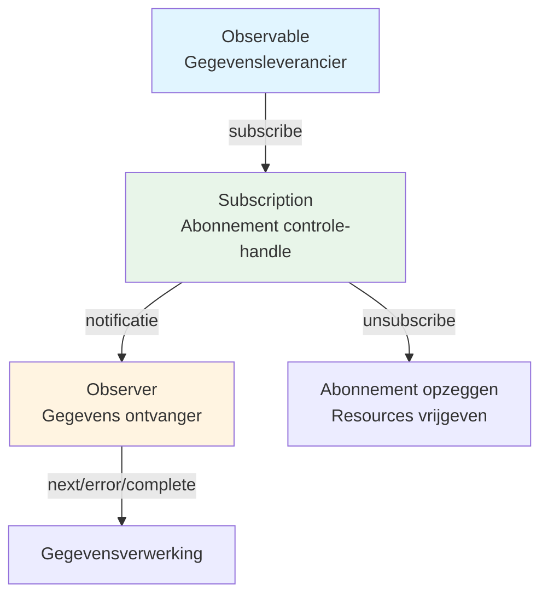

# Wat is een Stream?

## Definitie van stream

Een "stream" verwijst naar **een gegevensstroom die geleidelijk optreedt in de loop van de tijd**. Dit kan worden gezien als een verzameling gegevens die in een bepaalde volgorde achter elkaar verschijnen.

### Voorbeelden van typische streams in traditionele programmering
- Bestandsleesgegevens (bijvoorbeeld: Node.js ReadableStream)
- Netwerkcommunicatie (HTTP-responses, etc.)
- Gebruikersinvoer en events (muisbewegingen, klikken, toetsenbordinvoer)

## Streams in RxJS

In RxJS worden dergelijke gegevens die in de loop van de tijd optreden, als streams behandeld met behulp van **Observable**. Observable is een mechanisme om asynchrone gegevens, synchrone gegevens, events en tijdgebaseerde verwerking allemaal te abstraheren als "streams".

### Voordelen van Observable
- Kan typeveilig worden geschreven (compatibiliteit met TypeScript)
- Kan de gegevensstroom declaratief uitdrukken
- Operatieketens mogelijk via `pipe()`
- Expliciet subscriben via `subscribe()`
- Annuleerbaar via `unsubscribe()`

## Vergelijking met traditionele streams

| Eigenschap | Traditionele streams | RxJS Observable |
|------|------------------|-------------------|
| Doelwit | Vaak beperkt tot bestanden/netwerk etc. | Willekeurige async/events/statusveranderingen |
| Event-ondersteuning | Verwerking per keer met event listeners | Gestroomlijnd met `fromEvent` |
| Annuleren | Methoden variëren | Uniform beheer met `unsubscribe()` |
| Compositie/transformatie | Individuele implementatie met procedurele code | Beknopt geschreven met operators (`map`, `filter`, etc.) |

## Relatie met Observer & Subscription

- **Observable**: De gegevensleverancier (de bron van de stream)
- **Observer**: De ontvanger van gegevens (heeft next, error, complete)
- **Subscription**: Het controle-handle voor abonnementen (abonneren, afmelden, resourcebeheer)

Observable en Observer zijn verbonden via callbacks en worden beheerd door Subscription.

### Basisrelatiediagram

## Samenvatting

Het "stream"-concept dat de kern vormt van RxJS is een krachtig wapen bij het omgaan met asynchrone verwerking. Door Observable te gebruiken, kun je verschillende gegevensbronnen uniform behandelen en de dataflow declaratief en flexibel beschrijven.

## Relatie met event-afhandeling

In RxJS kunnen DOM-events ook als streams worden behandeld met `fromEvent`.
Door het verschil met traditionele event listeners te vergelijken, wordt het stream-concept duidelijker.

> [!TIP]
> Voor een vergelijking van traditionele event-afhandeling en RxJS met daadwerkelijke code, zie [Streamificatie van events](/nl/guide/observables/events.md#vergelijking-tussen-traditionele-event-afhandeling-en-rxjs).
