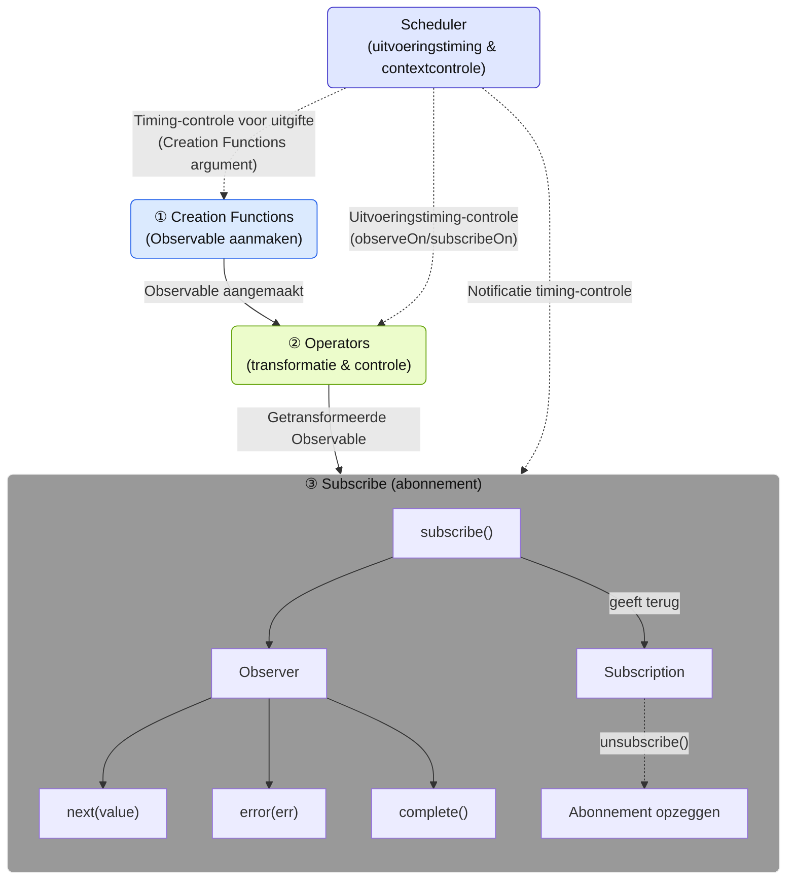
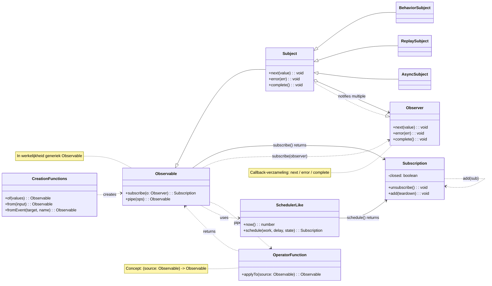

# Wat is RxJS?

## Overzicht
[RxJS (Reactive Extensions for JavaScript)](https://rxjs.dev) is een bibliotheek voor het uitvoeren van "reactief programmeren" in JavaScript.

> ### Wat is reactief programmeren?
> Reactief programmeren is een manier om programma's te maken die automatisch worden bijgewerkt in reactie op veranderingen in gegevens.
> Het is een vorm van event-driven programmeren, met name gericht op het omgaan met asynchrone datastreams. Het bouwt programma's door te denken vanuit de gegevensstroom (stream) en te reageren op die stroom.

Met andere woorden, RxJS is een bibliotheek voor het omgaan met gebeurtenissen en asynchrone gegevensstromen (streams) in een functionele stijl. Het maakt gebruik van het Observable-patroon om krachtige tools te bieden voor het werken met asynchrone datastreams.

> Observable is een kerncomponent van RxJS die de stroom van gebeurtenissen of asynchrone gegevens (stream) vertegenwoordigt. Het is de bron waar waarden "uit stromen" en je kunt waarden ontvangen door te subscriben. Een Observable is een "gegevensstroom (stream)" die waarden uitzendt in de loop van de tijd. Door te subscriben (subscribe) kun je die waarden ontvangen.


> [!TIP]
> Als je je afvraagt "Wat is eigenlijk een stream?", kijk dan ook eens naar [Wat is een Stream?](/nl/guide/basics/what-is-a-stream)


## Eenvoudig gebruiksvoorbeeld

```ts
import { fromEvent } from 'rxjs';

fromEvent(document, 'click').subscribe(event => {
  console.log('Er is geklikt:', event);
});
```

## Basiselementen van RxJS

Om RxJS effectief te gebruiken, is het belangrijk om de volgende kernelementen te begrijpen.

| Element | Overzicht |
|------|------|
| [`Observable`](../observables/what-is-observable.md) | De bron van een stream die asynchrone of tijdgebonden gegevens vertegenwoordigt. |
| [`Observer`](../observables/observable-lifecycle.md#observer)[^observer]| De entiteit die zich abonneert op en gegevens ontvangt van een Observable. |
| [`Subscription`](../observables/observable-lifecycle.md#subscription) | Beheert het subscriben op en afmelden van een Observable. |
| [`Creation Functions`](../creation-functions/index.md) | Een verzameling functies voor het maken en combineren van Observables. |
| [`Operator`](../operators/index.md) | Een verzameling functies voor het transformeren en beheersen van Observables. |
| [`Subject`](../subjects/what-is-subject.md)[^1] | Een relay die zowel de eigenschappen van Observable als Observer heeft. |
| [`Scheduler`](../schedulers/async-control.md)[^2]| Een mechanisme om de uitvoeringstiming van Observables te beheersen. |

[^observer]: Als implementatie wordt de Subscriber-klasse gebruikt. Zie [Verschil tussen Observer en Subscriber](../observables/observer-vs-subscriber.md) voor details.
[^1]: Subject is een speciale entiteit die zich zowel gedraagt als een Observable die waarden uitzendt, als een Observer die waarden ontvangt.
[^2]: Scheduler wordt gebruikt om de timing en context van asynchrone verwerking te beheersen en is ook nuttig voor debugging en prestatiebeheer.

Deze elementen hebben elk hun eigen functionaliteit, maar werken samen.
Bijvoorbeeld: Creation Functions maken en combineren Observables, Operators transformeren en beheersen ze, Observer abonneert zich erop, en Scheduler regelt de uitvoeringstiming - samen vormen ze de streamverwerking.

#### RxJS-componenten en dataflow


※ Het gedetailleerde gebruik en voorbeelden van elk element worden afzonderlijk uitgelegd in hun respectieve hoofdstukken.

### Component klassediagram



## Voordelen van RxJS

| Voordeel | Inhoud |
|---|---|
| Declaratieve code[^3] | Met `map`, `filter` etc. beschrijf je "wat je wilt doen" en vermijd je procedurele beschrijvingen zoals for-loops |
| Vereenvoudiging van asynchrone verwerking | Vermijd geneste `Promise` en callbacks, schrijf met een intuïtieve flow |
| Foutafhandeling | Uniform afhandelen van fouten in streams met `.pipe(catchError(...))` etc. |
| Annuleerbaar | Stream kan worden onderbroken met `Subscription.unsubscribe()` |
| Diverse operators | Vele operators zoals `debounceTime`, `mergeMap`, `combineLatest` voor transformatie en compositie |

[^3]: > - Declaratieve code: Code die rechtstreeks schrijft "welk resultaat je wilt"
      > - Procedurele code: Code die schrijft "welke berekeningen moeten worden uitgevoerd om het gewenste resultaat te verkrijgen"


## Use cases

RxJS blinkt uit in elke situatie waar je "gegevens die veranderen in de loop van de tijd" moet verwerken. Hieronder introduceren we de belangrijkste toepassingsgebieden.

### Realtime communicatie & streaming

Bij realtime communicatie zoals WebSocket en Server-Sent Events (SSE) is RxJS bijzonder krachtig.

| Toepassing | Beschrijving | Belangrijke operators |
|------|------|-------------------|
| WebSocket-communicatie | Chat, notificaties, koersupdates etc. | [`webSocket`](../observables/creation.md#websocket), [`filter`](../operators/filtering/filter.md), [`map`](../operators/transformation/map.md) |
| Server-Sent Events | Push-notificaties van server | [`fromEvent`](../observables/events.md), [`retry`](../operators/utility/retry.md) |
| IoT sensor monitoring | Verwerking van continue sensorgegevens | [`debounceTime`](../operators/filtering/debounceTime.md), [`distinctUntilChanged`](../operators/filtering/distinctUntilChanged.md) |

#### Eenvoudig voorbeeld
```ts
import { webSocket } from 'rxjs/webSocket';
import { filter } from 'rxjs';

const socket$ = webSocket('wss://example.com/chat');

socket$.pipe(
  filter(msg => msg.type === 'message')
).subscribe(msg => console.log('Nieuw bericht:', msg.text));
```

### UI/statusbeheer & formuliercontrole

Je kunt gebruikersinvoer en statusveranderingen reactief afhandelen.

> [!NOTE] Relatie met frameworks
> Moderne frontend frameworks (Angular Signals, React hooks, Vue Composition API, Svelte Runes, etc.) bieden elk hun eigen reactieve systeem. RxJS is een framework-onafhankelijke bibliotheek en kan naast deze worden gebruikt of ermee worden gecombineerd. De integratie van RxJS met framework-specifieke mechanismen wordt uitgebreid besproken in Hoofdstuk 15 "Integratie met Frameworks" (in voorbereiding).

| Toepassing | Beschrijving | Belangrijke operators |
|------|------|-------------------|
| Invoerformuliercontrole | Zoeksuggesties, realtime validatie | [`debounceTime`](../operators/filtering/debounceTime.md), [`distinctUntilChanged`](../operators/filtering/distinctUntilChanged.md), [`switchMap`](../operators/transformation/switchMap.md) |
| Koppeling van meerdere formuliervelden | Bijwerken van afhankelijke invoervelden | [`combineLatest`](../creation-functions/combination/combineLatest.md), [`withLatestFrom`](../operators/combination/withLatestFrom.md) |
| Communicatie tussen componenten | Event bus of aangepast statusbeheer | [`Subject`](../subjects/what-is-subject.md), [`share`](../operators/multicasting/share.md) |
| UI-eventafhandeling | Klikken, scrollen, drag & drop | [`fromEvent`](../observables/events.md), [`takeUntil`](../operators/utility/takeUntil.md) |

#### Eenvoudig voorbeeld
```ts
import { fromEvent, combineLatest } from 'rxjs';
import { debounceTime, map, switchMap } from 'rxjs';

const searchInput = document.querySelector('#search') as HTMLInputElement;
const sortSelect = document.querySelector('#sort') as HTMLInputElement;

const search$ = fromEvent(searchInput, 'input').pipe(
  map(e => (e.target as HTMLInputElement).value)
);

const sort$ = fromEvent(sortSelect, 'change').pipe(
  map(e => (e.target as HTMLSelectElement).value)
);

combineLatest([search$, sort$]).pipe(
  debounceTime(300),
  switchMap(([query, order]) =>
    fetch(`/api/search?q=${query}&sort=${order}`).then(r => r.json())
  )
).subscribe(results => console.log(results));
```

### Offline-ondersteuning & PWA

Kan worden gebruikt voor offline-ondersteuning en netwerkstatusbeheer in Progressive Web Apps (PWA).

| Toepassing | Beschrijving | Belangrijke operators |
|------|------|-------------------|
| Netwerkstatusmonitoring | Online/offline detectie | [`fromEvent`](../observables/events.md), [`merge`](../creation-functions/combination/merge.md) |
| Opnieuw proberen bij offline | Automatische hersynchronisatie bij verbindingsherstel | [`retry`](../operators/utility/retry.md), [`retryWhen`](../error-handling/retry-catch.md) |
| Cache-controle | Integratie met Service Worker | [`switchMap`](../operators/transformation/switchMap.md), [`catchError`](../error-handling/retry-catch.md) |

#### Eenvoudig voorbeeld
```ts
import { fromEvent, merge } from 'rxjs';
import { map, startWith } from 'rxjs';

const online$ = fromEvent(window, 'online').pipe(map(() => true));
const offline$ = fromEvent(window, 'offline').pipe(map(() => false));

merge(online$, offline$).pipe(
  startWith(navigator.onLine)
).subscribe(isOnline => {
  console.log(isOnline ? 'Online' : 'Offline');
});
```

### AI/Streaming-API's

Ook ideaal voor het werken met streaming API-responses zoals OpenAI.

| Toepassing | Beschrijving | Belangrijke operators |
|------|------|-------------------|
| Token-voor-token uitvoer | Realtime weergave van AI-responses | [`concatMap`](../operators/transformation/concatMap.md), [`scan`](../operators/transformation/scan.md) |
| Streamingverwerking | Verwerking van Server-Sent Events | [`fromEvent`](../observables/events.md), [`map`](../operators/transformation/map.md) |
| Backend-integratie | Gebruik in NestJS (standaard met RxJS) | Diverse operators |

### HTTP-communicatie en foutafhandeling

Je kunt asynchrone HTTP-communicatie elegant afhandelen.

| Toepassing | Beschrijving | Belangrijke operators |
|------|------|-------------------|
| API-verzoeken | Communicatie met RESTful API's | [`switchMap`](../operators/transformation/switchMap.md), [`mergeMap`](../operators/transformation/mergeMap.md) |
| Foutafhandeling | Opnieuw proberen of fallback | [`catchError`](../error-handling/retry-catch.md), [`retry`](../operators/utility/retry.md) |
| Timeout-controle | Beperking van responstijd | [`timeout`](../operators/utility/timeout.md) |
| Annuleren | Onderbreken van onnodige verzoeken | [`takeUntil`](../operators/utility/takeUntil.md), `unsubscribe()` |

### Statusbeheer & architectuur

Kan ook worden gebruikt voor het ontwerpen van de architectuur van de gehele applicatie.

| Toepassing | Beschrijving | Belangrijke operators |
|------|------|-------------------|
| Statusbeheerbibliotheken | NgRx, Redux-Observable, etc. | [`scan`](../operators/transformation/scan.md), [`share`](../operators/multicasting/share.md) |
| Event flow beheer | Gebruik in DDD (Domain-Driven Design) | [`Subject`](../subjects/what-is-subject.md), [`shareReplay`](../operators/multicasting/shareReplay.md) |
| Datalaag scheiding | Clean Architecture | Diverse operators |

---

> [!TIP]
> Zie ook [Verschil tussen Promise en RxJS](./promise-vs-rxjs.md) voor het kiezen tussen Promise en RxJS.

## Samenvatting

RxJS biedt een krachtige benadering van asynchrone en event-based programmering. Het concept van datastreams gecentreerd rond Observable is bijzonder nuttig bij het omgaan met complexe asynchrone verwerking.
