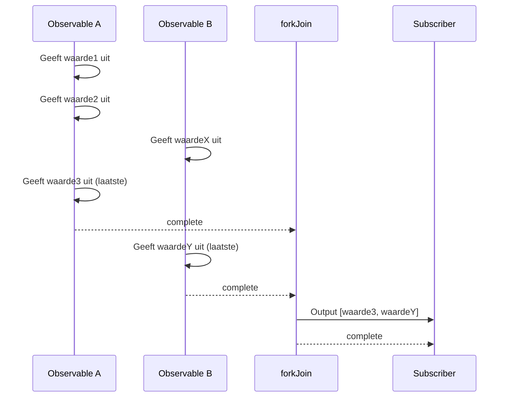
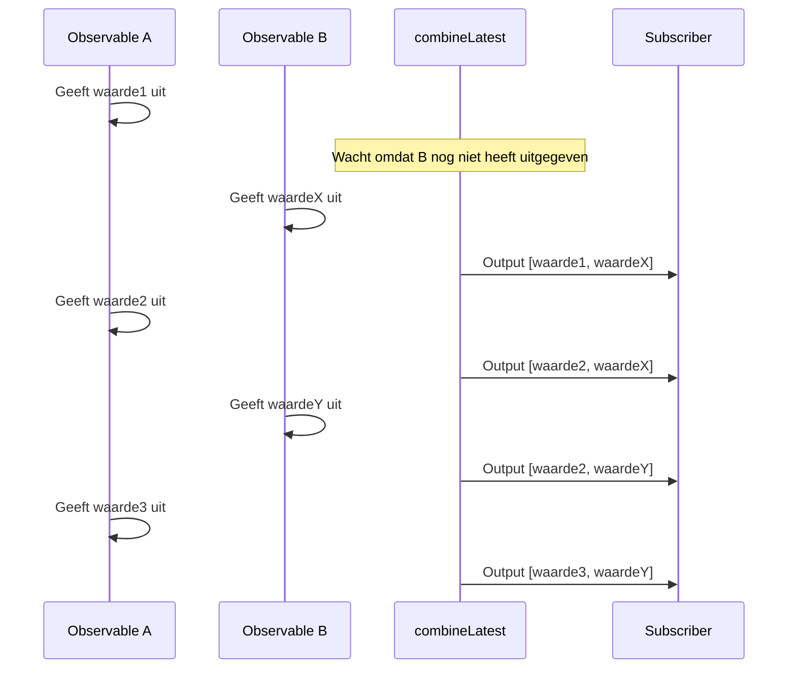

# Verschil tussen forkJoin en combineLatest

Bij het combineren van meerdere Observables in RxJS zijn `forkJoin` en `combineLatest` de meest gebruikte Creation Functions. Deze twee hebben echter **aanzienlijk verschillend gedrag**, en bij verkeerd gebruik worden niet de verwachte resultaten geproduceerd.

Deze pagina vergelijkt beide grondig met diagrammen en praktische voorbeelden, en maakt duidelijk "welke te gebruiken."

## Conclusie: Verschil tussen forkJoin en combineLatest

| Kenmerk | forkJoin | combineLatest |
|---------|----------|---------------|
| **Output timing** | **Eenmaal** nadat alles voltooid is | **Elke keer** dat een waarde wordt bijgewerkt |
| **Output waarde** | **Laatste waarde** van elke Observable | **Nieuwste waarde** van elke Observable |
| **Voltooiingsvoorwaarde** | Alle Observables voltooien | Alle Observables voltooien |
| **Belangrijkste use cases** | Parallelle API-aanroepen, initiële data load | Formulier monitoring, real-time sync |
| **Oneindige streams** | ❌ Kan niet gebruiken | ✅ Kan gebruiken (zendt waarden uit zelfs zonder voltooiing) |

> [!TIP]
> **Makkelijke manier om te onthouden**
> - `forkJoin` = "Zodra iedereen klaar is, **eenmaal vertrekken**" (vergelijkbaar met Promise.all)
> - `combineLatest` = "**De laatste status rapporteren** elke keer als iemand beweegt"

## Gedragsverschillen begrijpen met diagrammen

### forkJoin Gedrag

### combineLatest Gedrag

## Wanneer welke gebruiken (Case-by-case gids)

### Cases voor forkJoin

- **Parallelle API-aanroepen**: Wanneer u alleen wilt verwerken nadat alle data klaar is
- **Initiële data load**: Alle benodigde masterdata ophalen bij app-start

> [!WARNING]
> `forkJoin` kan niet worden gebruikt met **Observables die nooit voltooien** (`interval`, WebSocket, event streams, etc.).

### Cases voor combineLatest

- **Real-time formulierinvoer monitoring**: Meerdere invoerwaarden combineren voor validatie
- **Real-time sync van meerdere streams**: Geïntegreerde weergave van sensordata
- **Filtervoorwaarden combineren**: Zoeken uitvoeren wanneer een voorwaarde verandert

## Samenvatting

| Selectiecriterium | forkJoin | combineLatest |
|-------------------|----------|---------------|
| Eenmaal verwerken wanneer alles klaar is | ✅ | ❌ |
| Verwerken bij elke waardeverandering | ❌ | ✅ |
| Niet-voltooiende streams | ❌ | ✅ |
| Promise.all-achtig gebruik | ✅ | ❌ |
| Real-time synchronisatie | ❌ | ✅ |

## Gerelateerde pagina's

- **[forkJoin](/nl/guide/creation-functions/combination/forkJoin)** - Gedetailleerde uitleg van forkJoin
- **[combineLatest](/nl/guide/creation-functions/combination/combineLatest)** - Gedetailleerde uitleg van combineLatest
- **[zip](/nl/guide/creation-functions/combination/zip)** - Overeenkomstige waarden koppelen
- **[merge](/nl/guide/creation-functions/combination/merge)** - Meerdere Observables parallel uitvoeren
