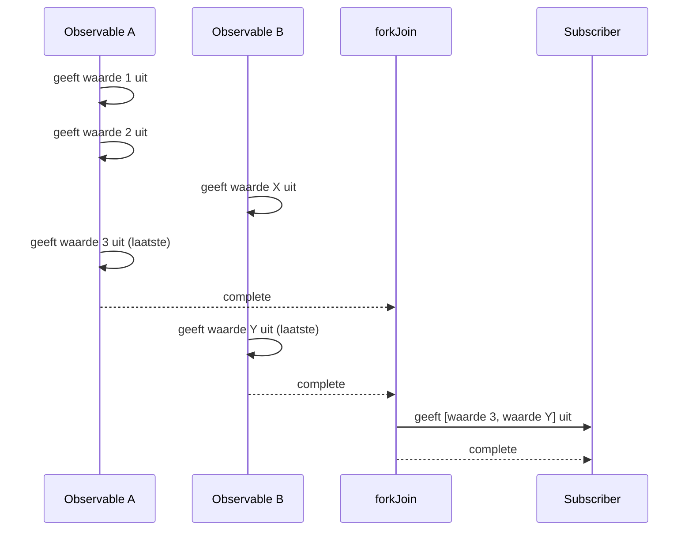
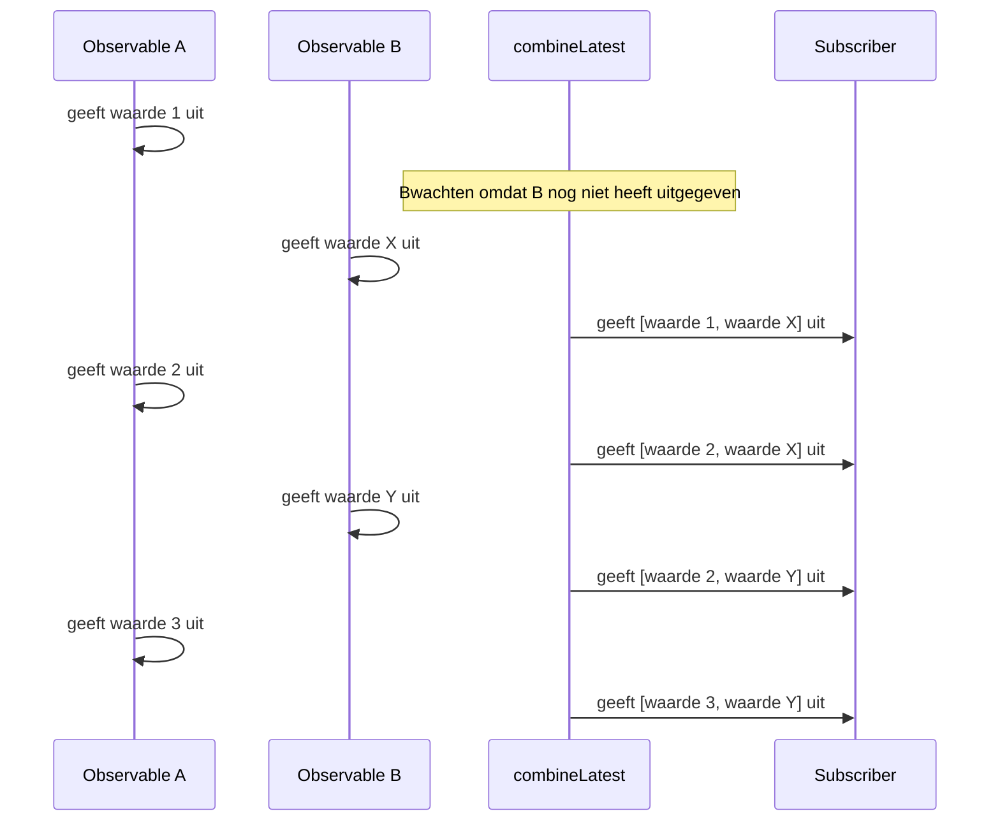
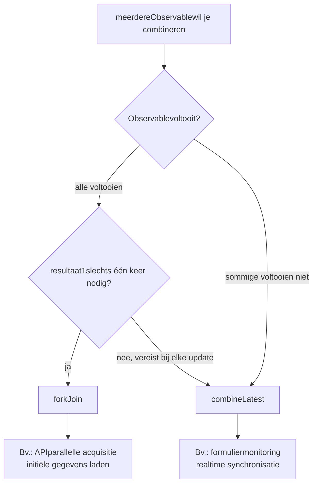

# Verschil tussen forkJoin en combineLatest

Bij het combineren van meerdere Observables in RxJS zijn `forkJoin` en `combineLatest` de meest gebruikte Creation Functions. De twee **gedragen zich echter heel verschillend** en als ze niet correct worden gebruikt, zullen ze niet de verwachte resultaten opleveren.

Deze pagina vergelijkt de verschillen tussen de twee grondig met illustraties en praktische voorbeelden om duidelijk te maken welke je het beste kunt gebruiken.

## Conclusie: het verschil tussen forkJoin en combineLatest

| Kenmerk | forkJoin | combineLatest |
|---|---|---|
| **Emissie-timing** | **Slechts één keer** na voltooiing van alle | **Bij elke update** van een waarde |
| **Geëmitteerde waarde** | De **laatste waarde** van elke Observable | De **meest recente waarde** van elke Observable |
| **Voltooiingsvoorwaarde** | Alle Observables voltooid | Alle Observables voltooid |
| **Hoofdgebruik** | Parallelle API-acquisitie, initiële laden | Formuliermonitoring, realtime synchronisatie |
| **Oneindige stream** | ❌ Niet bruikbaar (wordt niet voltooid) | ✅ Bruikbaar (emitteert waarden zonder voltooiing) |

> [!TIP]

> **Makkelijk te onthouden**
> - `forkJoin` = «vertrek **slechts één keer** als iedereen aanwezig is» (vergelijkbaar met Promise.all)
> - `combineLatest` = «**meld de laatste status** elke keer als iemand beweegt»

## De verschillen in gedrag met illustraties begrijpen

### Gedrag van forkJoin


```mermaid
sequenceDiagram
    participant A as Observable A
    participant B as Observable B
    participant F as forkJoin
    participant S as Subscriber

    A->>A: geeft waarde 1 uit
    A->>A: geeft waarde 2 uit
    B->>B: geeft waarde X uit
    A->>A: geeft waarde 3 uit (laatste)
    A-->>F: complete
    B->>B: geeft waarde Y uit (laatste)
    B-->>F: complete
    F->>S: geeft [waarde 3, waarde Y] uit
    F-->>S: complete
```

**Punt**: wacht tot alle Observables `complete` zijn en geef **alleen de laatste waarde** eenmaal uit.

### Gedrag van combineLatest


```mermaid
sequenceDiagram
    participant A as Observable A
    participant B as Observable B
    participant C as combineLatest
    participant S as Subscriber

    A->>A: geeft waarde 1 uit
    Note over C: Bwachten omdat B nog niet heeft uitgegeven
    B->>B: geeft waarde X uit
    C->>S: geeft [waarde 1, waarde X] uit
    A->>A: geeft waarde 2 uit
    C->>S: geeft [waarde 2, waarde X] uit
    B->>B: geeft waarde Y uit
    C->>S: geeft [waarde 2, waarde Y] uit
    A->>A: geeft waarde 3 uit
    C->>S: geeft [waarde 3, waarde Y] uit
```

**Punt**: nadat alle Observables hun eerste waarde hebben uitgegeven, blijven ze de meest recente combinatie uitgeven **elke keer dat een van hen wordt bijgewerkt**.

## Verschillen in de tijdlijn


```mermaid
gantt
    title forkJoin vs Uitgifte-timing van combineLatest
    dateFormat X
    axisFormat %s

    section Observable A
    waarde1 :a1, 0, 1
    waarde2 :a2, 2, 1
    waarde3 :a3, 4, 1
    complete :milestone, a_done, 5, 0

    section Observable B
    waardeX :b1, 1, 1
    waardeY :b2, 3, 1
    complete :milestone, b_done, 4, 0

    section forkJoinuitgifte
    [waarde3,waardeY] :crit, fork_out, 5, 1

    section combineLatestuitgifte
    [waarde1,waardeX] :c1, 1, 1
    [waarde2,waardeX] :c2, 2, 1
    [waarde2,waardeY] :c3, 3, 1
    [waarde3,waardeY] :c4, 4, 1
```

## Praktische vergelijking: controleer gedrag met dezelfde gegevensbron

Pas `forkJoin` en `combineLatest` toe op dezelfde Observable en controleer de verschillen in uitvoer.

```ts
import { forkJoin, combineLatest, interval, take, map } from 'rxjs';

// uitvoergebied aanmaken
const output = document.createElement('div');
output.innerHTML = '<h3>Vergelijking forkJoin vs combineLatest:</h3>';
document.body.appendChild(output);

// Maak 2 Observables aan
const obs1$ = interval(1000).pipe(
  take(3),
  map(i => `A${i}`)
);

const obs2$ = interval(1500).pipe(
  take(2),
  map(i => `B${i}`)
);

// Resultaatweergavegebied voor forkJoin
const forkJoinResult = document.createElement('div');
forkJoinResult.innerHTML = '<h4>forkJoin:</h4><div id="forkjoin-output">wachten...</div>';
output.appendChild(forkJoinResult);

// Resultaatweergavegebied voor combineLatest
const combineLatestResult = document.createElement('div');
combineLatestResult.innerHTML = '<h4>combineLatest:</h4><div id="combinelatest-output"></div>';
output.appendChild(combineLatestResult);

// forkJoin：na voltooiing van alle1geeft slechts één keer uit
forkJoin([obs1$, obs2$]).subscribe(result => {
  const el = document.getElementById('forkjoin-output');
  if (el) {
    el.textContent = `uitgifte: [${result.join(', ')}]`;
    el.style.color = 'green';
    el.style.fontWeight = 'bold';
  }
});

// combineLatest：geeft uit bij elke waarde-update
const combineOutput = document.getElementById('combinelatest-output');
combineLatest([obs1$, obs2$]).subscribe(result => {
  if (combineOutput) {
    const item = document.createElement('div');
    item.textContent = `uitgifte: [${result.join(', ')}]`;
    combineOutput.appendChild(item);
  }
});
```

**Uitvoerresultaat**:
- `forkJoin`: geeft `[A2, B1]` **slechts één keer** uit na ongeveer 3 seconden
- `combineLatest`: geeft **4 keer** uit vanaf ongeveer 1,5 s (bijv. `[A0, B0]` → `[A1, B0]` → `[A2, B0]` → `[A2, B1]`)

> [!NOTE]

> De volgorde van uitgifte van `combineLatest` hangt af van de planning van de timer en kan variëren afhankelijk van de omgeving. Belangrijk is dat «een waarde wordt uitgegeven elke keer dat een van hen wordt bijgewerkt». In het bovenstaande voorbeeld wordt 4 keer uitgegeven, maar de volgorde kan veranderen, bijvoorbeeld `[A1, B0]` → `[A1, B1]`.

## Welke moet worden gebruikt (gevalspecifieke gids)

### Gevallen waarin forkJoin moet worden gebruikt

#### 1. Parallelle acquisitie van meerdere API's

Wanneer je de gegevens wilt verwerken nadat alle gegevens beschikbaar zijn.

```ts
import { forkJoin } from 'rxjs';
import { ajax } from 'rxjs/ajax';

// gelijktijdig gebruikersinfo en instellingen ophalen
forkJoin({
  user: ajax.getJSON('/api/user/123'),
  settings: ajax.getJSON('/api/settings'),
  notifications: ajax.getJSON('/api/notifications')
}).subscribe(({ user, settings, notifications }) => {
  // scherm renderen nadat alle gegevens klaar zijn
  renderDashboard(user, settings, notifications);
});
```

#### 2. Batchgegevensverzameling bij initiële laden

Verzamel alle benodigde stamgegevens in één keer bij de start van de toepassing.

```ts
import { forkJoin } from 'rxjs';
import { ajax } from 'rxjs/ajax';

function loadInitialData() {
  return forkJoin({
    categories: ajax.getJSON('/api/categories'),
    countries: ajax.getJSON('/api/countries'),
    currencies: ajax.getJSON('/api/currencies')
  });
}
```

> [!WARNING]

> `forkJoin` kan niet worden gebruikt met **Observables die niet voltooid worden** (bijv. `interval`, WebSocket, event streams). Als het niet voltooid wordt, blijft het wachten.

### Gevallen waarin combineLatest moet worden gebruikt

#### 1. Realtime monitoring van formulierinvoer

Combineer meerdere invoerwaarden om validatie en weergave bij te werken.

```ts
import { combineLatest, fromEvent } from 'rxjs';
import { map, startWith } from 'rxjs';

const name$ = fromEvent(nameInput, 'input').pipe(
  map(e => (e.target as HTMLInputElement).value),
  startWith('')
);

const email$ = fromEvent(emailInput, 'input').pipe(
  map(e => (e.target as HTMLInputElement).value),
  startWith('')
);

const age$ = fromEvent(ageInput, 'input').pipe(
  map(e => parseInt((e.target as HTMLInputElement).value) || 0),
  startWith(0)
);

// validatie uitvoeren bij elke invoerverandering
combineLatest([name$, email$, age$]).subscribe(([name, email, age]) => {
  const isValid = name.length > 0 && email.includes('@') && age >= 18;
  submitButton.disabled = !isValid;
});
```

#### 2. Realtime synchronisatie van meerdere streams

Geïntegreerde weergave van sensorgegevens en status.

```ts
import { combineLatest, interval } from 'rxjs';
import { map } from 'rxjs';

const temperature$ = interval(2000).pipe(map(() => 20 + Math.random() * 10));
const humidity$ = interval(3000).pipe(map(() => 40 + Math.random() * 30));
const pressure$ = interval(2500).pipe(map(() => 1000 + Math.random() * 50));

combineLatest([temperature$, humidity$, pressure$]).subscribe(
  ([temp, humidity, pressure]) => {
    updateDashboard({ temp, humidity, pressure });
  }
);
```

#### 3. Combinatie van filtervoorwaarden

Voer een zoekopdracht uit elke keer dat meerdere filtervoorwaarden veranderen.

```ts
import { combineLatest, BehaviorSubject } from 'rxjs';
import { debounceTime, switchMap } from 'rxjs';

const searchText$ = new BehaviorSubject('');
const category$ = new BehaviorSubject('all');
const sortOrder$ = new BehaviorSubject('asc');

combineLatest([searchText$, category$, sortOrder$]).pipe(
  debounceTime(300),
  switchMap(([text, category, sort]) =>
    fetchProducts({ text, category, sort })
  )
).subscribe(products => {
  renderProductList(products);
});
```

## Stroomdiagram voor gebruik


```mermaid
flowchart TD
    A[meerdereObservablewil je combineren] --> B{Observablevoltooit?}
    B -->|alle voltooien| C{resultaat1slechts één keer nodig?}
    B -->|sommige voltooien niet| D[combineLatest]
    C -->|ja| E[forkJoin]
    C -->|nee, vereist bij elke update| D

    E --> E1[Bv.: APIparallelle acquisitie<br>initiële gegevens laden]
    D --> D1[Bv.: formuliermonitoring<br>realtime synchronisatie]
```

## Veelvoorkomende fouten en oplossingen

### Fout 1: forkJoin gebruiken voor een Observable die niet voltooid wordt

```ts
// ❌ dit wordt nooit uitgegeven
forkJoin([
  interval(1000),  // voltooit niet
  ajax.getJSON('/api/data')
]).subscribe(console.log);

// ✅ takevoltooien met combineLatestgebruiken
forkJoin([
  interval(1000).pipe(take(5)),  // 5voltooit in
  ajax.getJSON('/api/data')
]).subscribe(console.log);
```

### Fout 2: geen initiële waarde in combineLatest

```ts
// ❌ name$tot B voor het eerst uitgeeftemail$zelfs met waarden wordt niets uitgegeven
combineLatest([name$, email$]).subscribe(console.log);

// ✅ startWithstel initiële waarde in met
combineLatest([
  name$.pipe(startWith('')),
  email$.pipe(startWith(''))
]).subscribe(console.log);
```

## Samenvatting

| Selectiecriterium | forkJoin | combineLatest |
|---|---|---|
| Eenmalige verwerking wanneer alle klaar zijn | ✅ | ❌ |
| Verwerking bij elke waardeverandering | ❌ | ✅ |
| Stream die niet voltooid wordt | ❌ | ✅ |
| Promise.all-achtig gebruik | ✅ | ❌ |
| Realtime synchronisatie | ❌ | ✅ |

> [!IMPORTANT]

> **Gebruiksprincipe**
> - **forkJoin**: «slechts één keer wanneer iedereen aanwezig is» → parallelle API-acquisitie, initiële laden
> - **combineLatest**: «update elke keer als iemand beweegt» → formuliermonitoring, realtime UI

## Gerelateerde pagina's

- **[forkJoin](/nl/guide/creation-functions/combination/forkJoin)** - Gedetailleerde uitleg over forkJoin
- **[combineLatest](/nl/guide/creation-functions/combination/combineLatest)** - Gedetailleerde uitleg over combineLatest
- **[zip](/nl/guide/creation-functions/combination/zip)** - Overeenkomstige waarden paren
- **[merge](/nl/guide/creation-functions/combination/merge)** - Meerdere Observables parallel uitvoeren
- **[withLatestFrom](/nl/guide/operators/combination/withLatestFrom)** - Alleen de hoofdstream is trigger
