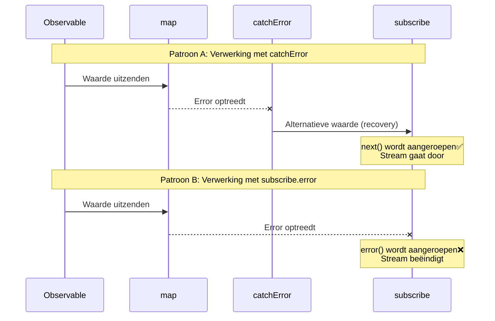
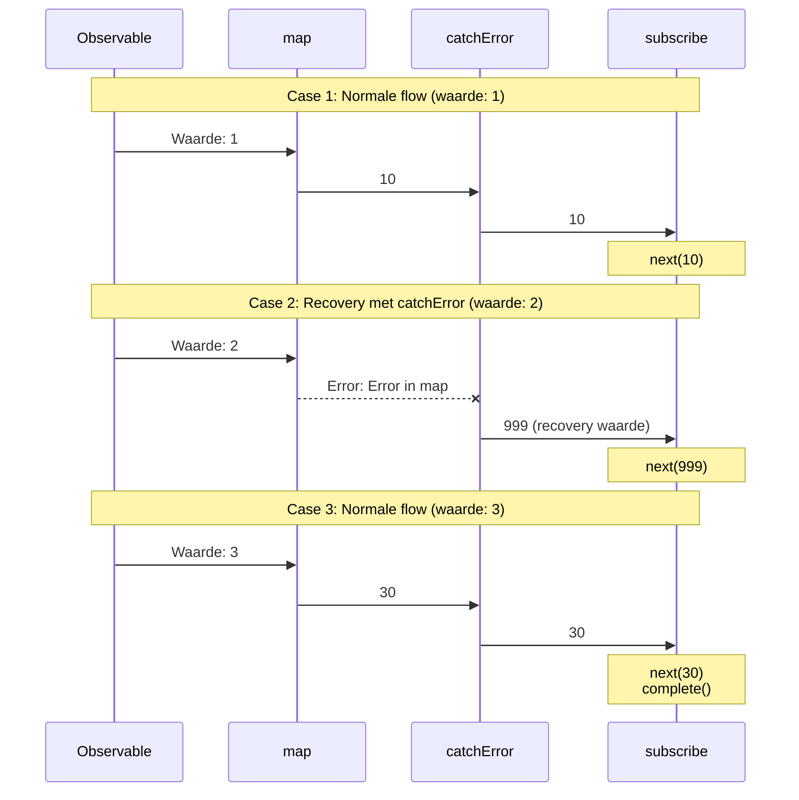
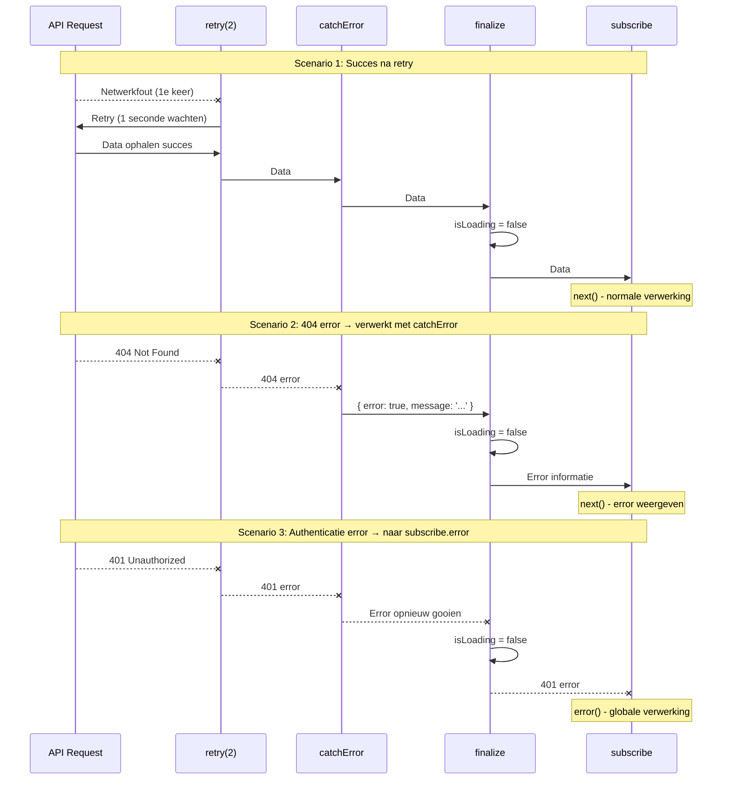
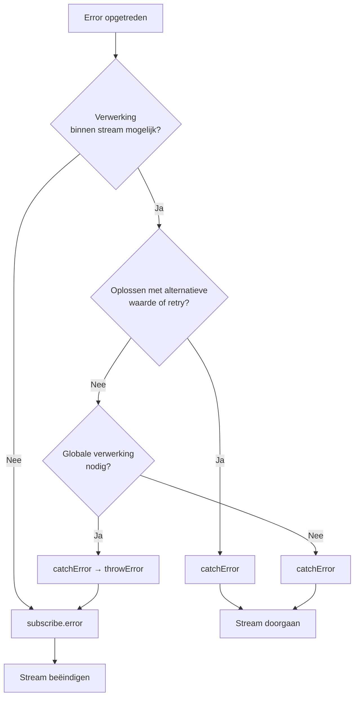

# Twee locaties voor error handling

Bij error verwerking in RxJS is "waar" je de error opvangt een belangrijke ontwerpbeslissing. RxJS heeft twee primaire locaties voor error handling: de `catchError` operator in de pipeline en de `error` callback in de finale `subscribe`. Deze pagina legt het verschil tussen beide uit en het juiste gebruik.

## Twee locaties voor error handling

RxJS error handling heeft de volgende twee primaire locaties.

1. **In pipeline** - `.pipe(catchError(...))`
2. **Bij subscribe** - `subscribe({ error: ... })`

Door dit verschil te begrijpen kun je robuuste en onderhoudbare error handling strategieën bouwen.

## Vergelijkingstabel: catchError vs subscribe.error

De volgende tabel vat de belangrijkste verschillen tussen beide benaderingen samen.

| Item | `.pipe(catchError(...))` | `subscribe({ error: ... })` |
|------|-------------------------|----------------------------|
| **Verwerkingstiming** | In pipeline (tussenverwerking) | Bij finale subscribe (eindpunt) |
| **Error type** | Errors opgetreden in stream | Niet-opgevangen errors |
| **Hoofdgebruik** | Error recovery, transformatie, retry | Finale error notificatie, logging |
| **Stream continuering** | Kan doorgaan met alternatieve Observable | Stream beëindigt (geen verdere waarden) |
| **Recovery mogelijkheid** | ✅ Mogelijk (alternatieve waarde of retry) | ❌ Onmogelijk (beëindiging) |
| **Meerdere plaatsing** | ✅ Mogelijk (meerdere in pipeline) | ⚠️ Eén per subscribe |
| **Type retourneren** | Moet `Observable<T>` retourneren | `void` (retourneert niets) |

### Sequence diagram: Verschil tussen catchError en subscribe.error

Het volgende diagram toont visueel het verschil tussen verwerking met `catchError` en `subscribe.error`.



#### Belangrijke punten uit dit diagram

**Patroon A (catchError gebruiken):**
- Zelfs als error optreedt, retourneert `catchError` alternatieve waarde, dus `next()` van `subscribe` wordt aangeroepen
- Stream gaat door en latere waarden kunnen ook verwerkt worden
- "Herstelt" error en keert terug naar normale stream

**Patroon B (subscribe.error gebruiken):**
- Als error `subscribe` bereikt, wordt `error()` callback aangeroepen
- Stream beëindigt, geen verdere waarden
- "Notificeert" error en beëindigt stream

## Error flow begrijpen

Laten we met een praktisch codevoorbeeld zien hoe errors stromen.

```typescript
import { of, map, catchError } from 'rxjs';
of(1, 2, 3).pipe(
  map(x => {
    if (x === 2) throw new Error('Error in map');  // ①
    return x * 10;
  }),
  catchError(err => {
    console.log('Opgevangen in catchError:', err.message);  // ②
    return of(999); // Recovery
  })
).subscribe({
  next: val => console.log('Waarde:', val),
  error: err => console.log('Opgevangen in subscribe.error:', err), // ③
  complete: () => console.log('Voltooid')
});

// Output:
// Waarde: 10
// Opgevangen in catchError: Error in map (← Verwerkt bij ②)
// Waarde: 999 (← Recovery succesvol)
// Waarde: 30
// Voltooid
```

In dit voorbeeld:
1. Error optreedt in `map` (①)
2. `catchError` vangt error op en herstelt (②)
3. `subscribe.error` wordt niet aangeroepen (error is verwerkt)

> [!TIP] Error flow
> Errors verwerkt door `catchError` bereiken `subscribe.error` niet. `catchError` heeft de rol om "error te verwerken en terug te keren naar normale stream".

### Sequence diagram: Error flow (3 cases)

Het volgende diagram toont hoe errors propageren in drie cases.



#### Zoals uit dit diagram blijkt
- **Case 1・3**: Zonder error stromen waarden van `map` → `catchError` → `subscribe` in volgorde
- **Case 2**: Bij error in `map` vangt `catchError` op en retourneert recovery waarde (999)
- Errors verwerkt door `catchError` bereiken `subscribe.error` niet

## Errors opgevangen door catchError

`catchError` in de pipeline kan de volgende errors opvangen.

| Error locatie | Voorbeeld | Verwerking met catchError mogelijk |
|----------------|-----|---------------------|
| throw in operator | `map(x => { throw new Error() })` | ✅ |
| HTTP error | `ajax.get('/api').pipe(catchError(...))` | ✅ |
| Error in switchMap | `switchMap(() => throwError(...))` | ✅ |
| Custom Observable | `new Observable(sub => sub.error(...))` | ✅ |
| Promise reject | `from(Promise.reject(...))` | ✅ |

### Praktijkvoorbeeld: Gefaseerde API error verwerking

```typescript
import { of, throwError, catchError, switchMap } from 'rxjs';
import { ajax } from 'rxjs/ajax';

// API error verwerken met catchError
ajax.get('/api/user/123').pipe(
  catchError(err => {
    if (err.status === 404) {
      // 404 error → standaard gebruiker retourneren
      return of({ id: 123, name: 'Standaard gebruiker' });
    }
    // Andere errors opnieuw gooien (naar subscribe.error)
    return throwError(() => err);
  }),
  switchMap(user => {
    // Na gebruiker ophalen, profiel ophalen
    return ajax.get(`/api/profile/${user.id}`);
  }),
  catchError(err => {
    console.log('Profiel ophalen error:', err);
    // Doorgaan zonder profiel
    return of(null);
  })
).subscribe({
  next: profile => console.log('Profiel:', profile),
  error: err => console.log('Finale error:', err) // Alleen niet door catchError verwerkte errors
});
```

> [!IMPORTANT] Meerdere catchError plaatsen
> Door meerdere `catchError` in pipeline te plaatsen kun je errors op verschillende fasen individueel verwerken. Dit maakt fijnmazige error handling mogelijk.

## Errors opgevangen door subscribe.error

De `error` callback van `subscribe` vangt de volgende errors op.

| Error type | Beschrijving | Voorbeeld |
|------------|------|-----|
| **Niet-verwerkte errors door catchError** | Errors niet verwerkt in pipeline | Error direct propageren |
| **Opnieuw gegooid na catchError** | Expliciet opnieuw gegooid in catchError | `catchError(e => throwError(() => e))` |

### Praktijkvoorbeeld: Gefaseerde error verwerking en opnieuw gooien

```typescript
import { of, throwError, map, catchError } from 'rxjs';
// Patroon 1: Niet-verwerkte error door catchError
throwError(() => new Error('Niet-verwerkte error')).subscribe({
  next: val => console.log('Waarde:', val),
  error: err => console.log('subscribe.error:', err.message)
  // Output: subscribe.error: Niet-verwerkte error
});

// Patroon 2: Opnieuw gooien in catchError
of(1).pipe(
  map(() => { throw new Error('Error in map'); }),
  catchError(err => {
    console.log('Opgevangen in catchError:', err.message);
    // Na logging, error opnieuw gooien
    return throwError(() => new Error('Opnieuw gegooid error'));
  })
).subscribe({
  next: val => console.log('Waarde:', val),
  error: err => console.log('subscribe.error:', err.message)
  // Output:
  // Opgevangen in catchError: Error in map
  // subscribe.error: Opnieuw gegooid error
});
```

> [!WARNING] Over errors in subscribe
> Het is **niet aanbevolen** om in de `next`, `complete` callbacks van `subscribe` te `throw`en. Error handling moet altijd in pipeline (`catchError`) gebeuren. throw in subscribe kan leiden tot ongedefinieerd gedrag.

## Gebruik criteria

Welke te gebruiken hangt af van "waar je de error wilt verwerken".

### Wanneer catchError te gebruiken

Gebruik `catchError` wanneer aan de volgende voorwaarden wordt voldaan.

- ✅ **Wil verwerking binnen stream voltooien**
- ✅ **Kan alternatieve waarde of fallback data bieden**
- ✅ **Mogelijk op te lossen met retry**
- ✅ **Wil error transformeren en overschakelen naar andere Observable**
- ✅ **Wil latere verwerking voortzetten**

#### Patroon 1: Uniform formaat voor succes en error

```typescript
import { of, throwError, catchError, map } from 'rxjs';
interface User {
  id: number;
  name: string;
}

interface ApiResult {
  success: boolean;
  data?: User[];
  error?: string;
}

// API aanroep simuleren (voorbeeld met error)
function fetchUsers(shouldFail: boolean) {
  if (shouldFail) {
    return throwError(() => new Error('Netwerkfout'));
  }
  return of<User[]>([
    { id: 1, name: 'Yamada Taro' },
    { id: 2, name: 'Sato Hanako' }
  ]);
}

fetchUsers(true).pipe(
  // Bij succes: transformeren naar { success: true, data: [...] }
  map(users => ({ success: true, data: users } as ApiResult)),
  // Bij error: transformeren naar { success: false, error: '...' }
  catchError(err => {
    return of<ApiResult>({
      success: false,
      error: 'Gebruikers ophalen mislukt'
    });
  })
).subscribe(result => {
  // Beide succes en error in hetzelfde formaat verwerken
  if (result.success) {
    console.log('Gebruikers:', result.data);
  } else {
    console.log('Error opgetreden:', result.error);
  }
});

// Output: Error opgetreden: Gebruikers ophalen mislukt
```

#### Patroon 2: Simpel standaardwaarde retourneren

```typescript
import { of, throwError, catchError } from 'rxjs';
interface User {
  id: number;
  name: string;
}

// API aanroep simuleren (voorbeeld met error)
function fetchUsers(shouldFail: boolean) {
  if (shouldFail) {
    return throwError(() => new Error('Netwerkfout'));
  }
  return of<User[]>([
    { id: 1, name: 'Yamada Taro' },
    { id: 2, name: 'Sato Hanako' }
  ]);
}

fetchUsers(true).pipe(
  catchError(err => {
    console.error('Error opgetreden:', err.message);
    // Lege array retourneren als standaardwaarde
    return of<User[]>([]);
  })
).subscribe(users => {
  if (users.length === 0) {
    console.log('Geen gebruikers gevonden');
  } else {
    console.log('Gebruikers:', users);
  }
});

// Output:
// Error opgetreden: Netwerkfout
// Geen gebruikers gevonden
```

### Wanneer subscribe.error te gebruiken

Gebruik `subscribe.error` wanneer aan de volgende voorwaarden wordt voldaan.

- ✅ **Wil verwerken met globale error handler**
- ✅ **Verwerking nodig die hele applicatie beïnvloedt**
- ✅ **Wil error logs naar server sturen**
- ✅ **Wil stream beëindigen**
- ✅ **Als laatste verdedigingslinie voor error verwerking**

```typescript
import { throwError, catchError, retry } from 'rxjs';
import { ajax } from 'rxjs/ajax';

ajax.getJSON('/api/critical-data').pipe(
  retry(2),
  catchError(err => {
    if (err.status === 401) {
      // Authenticatie error opnieuw gooien (globaal verwerken)
      return throwError(() => err);
    }
    // Rest verwerken
    return throwError(() => new Error('Data ophalen mislukt'));
  })
).subscribe({
  next: data => console.log('Data:', data),
  error: err => {
    // Globale error handler
    globalErrorHandler.handle(err);
    // Naar error pagina navigeren
    router.navigate(['/error']);
  }
});
```

## Praktisch patroon: Hiërarchische error handling

In de praktijk is hiërarchische error handling die `catchError` en `subscribe.error` combineert effectief.

```typescript
import { of, throwError, catchError, retry, finalize } from 'rxjs';
import { ajax } from 'rxjs/ajax';

function fetchUserData(userId: string) {
  let isLoading = true;

  return ajax.getJSON(`/api/users/${userId}`).pipe(
    // Level 1: Herstartbare netwerkfouten
    retry({ count: 2, delay: 1000 }),

    // Level 2: Herstelbare errors
    catchError((error) => {
      if (error.status === 404) {
        // 404 → doorgaan met standaarddata
        return of({
          error: true,
          message: 'Gebruiker niet gevonden',
          data: null
        });
      } else if (error.status >= 500) {
        // 500 reeks → doorgaan met error bericht
        return of({
          error: true,
          message: 'Serverfout opgetreden',
          data: null
        });
      }
      // Andere errors opnieuw gooien (naar subscribe.error)
      return throwError(() => error);
    }),

    // Level 3: Altijd uitvoeren cleanup
    finalize(() => {
      isLoading = false;
      console.log('Loading voltooid');
    })
  );
}

// Gebruiksvoorbeeld
fetchUserData('123').subscribe({
  next: (result) => {
    if (result.error) {
      // Error verwerkt door catchError (weergeven in UI)
      console.error('Gebruiker error:', result.message);
      showUserFriendlyError(result.message);
    } else {
      // Normale data
      console.log('Gebruikersdata:', result.data);
      displayUserData(result.data);
    }
  },
  error: (err) => {
    // Kritieke errors niet verwerkt door catchError
    console.error('Kritieke error:', err);
    // Notificeren naar globale error handler
    globalErrorHandler.handle(err);
    // Navigeren naar error pagina
    navigateToErrorPage();
  },
  complete: () => console.log('Verwerking voltooid')
});

// Helper functies
function showUserFriendlyError(message: string) {
  console.log('Error weergeven in UI:', message);
}
function displayUserData(data: any) {
  console.log('Data weergeven in UI:', data);
}
function navigateToErrorPage() {
  console.log('Navigeren naar error pagina');
}

// Globale error handler
const globalErrorHandler = {
  handle(err: any) {
    console.error('Globale error:', err);
    // Error log naar server sturen
    // sendErrorLog(err);
  }
};
```

> [!TIP] Voordelen van hiërarchische error handling
> - **Level 1 (retry)**: Tijdelijke netwerkfouten automatisch herstellen
> - **Level 2 (catchError)**: Gebruiksvriendelijke error berichten bieden
> - **Level 3 (subscribe.error)**: Onverwachte errors in laatste verdedigingslinie verwerken
> - **finalize**: Resources altijd opruimen

### Sequence diagram: Hiërarchische error handling flow

Het volgende diagram toont de hiërarchische error handling flow: retry → catchError → finalize → subscribe.



#### Zoals uit dit diagram blijkt
- **Scenario 1**: Tijdelijke errors herstellen met `retry` en data normaal ophalen
- **Scenario 2**: 404 error opgevangen met `catchError` en transformeren naar gebruiksvriendelijk bericht
- **Scenario 3**: Authenticatie errors opnieuw gooien in `catchError` en centraal beheren in `subscribe.error`
- **Alle scenario's gemeenschappelijk**: `finalize` wordt altijd uitgevoerd en reset loading status

## Selectie gids per scenario

Richtlijnen voor welke te gebruiken per praktisch scenario.

| Scenario | Aanbevolen | Reden |
|---------|------|------|
| 404 Not Found → standaardwaarde weergeven | `catchError` | Kan alternatieve waarde retourneren binnen stream |
| Tijdelijke netwerkfout → retry | `catchError` | Verwerking voortzetten ook na retry |
| Authenticatie error (401) → login scherm | Beide mogelijk | Redirect met catchError mogelijk, centraal beheer met subscribe.error ook mogelijk |
| Server 500 error → error pagina | Beide mogelijk | Als retry catchError, als onmiddellijke beëindiging subscribe.error |
| Validatie error → weergeven in formulier | `catchError` | Error informatie doorgeven aan UI voor weergave |
| Onverwachte error → log verzenden | `subscribe.error` | Log opnemen als laatste verdedigingslinie |

### Flexibele authenticatie error verwerking voorbeeld

Authenticatie error (401) maakt beide benaderingen mogelijk afhankelijk van ontwerp.

```typescript
import { throwError, EMPTY, catchError } from 'rxjs';
import { ajax } from 'rxjs/ajax';

// Benadering 1: Redirect met catchError (voltooien binnen stream)
ajax.getJSON('/api/protected-data').pipe(
  catchError(err => {
    if (err.status === 401) {
      // Authenticatie error verwerken met catchError
      router.navigate(['/login']);
      return EMPTY; // Stream leeg maken en beëindigen
    }
    return throwError(() => err);
  })
).subscribe({
  next: data => console.log('Data:', data)
});

// Benadering 2: Centraal beheer met subscribe.error
ajax.getJSON('/api/protected-data').pipe(
  catchError(err => {
    // Authenticatie error opnieuw gooien (globaal verwerken)
    if (err.status === 401) {
      return throwError(() => err);
    }
    // Rest verwerken
    return throwError(() => err);
  })
).subscribe({
  next: data => console.log('Data:', data),
  error: err => {
    if (err.status === 401) {
      // Globale authenticatie handler
      authService.handleUnauthorized();
    }
  }
});
```

> [!NOTE] Ontwerpkeuze
> Voor errors zoals authenticatie die hele applicatie beïnvloeden, bepaal je verwerkingslocatie op basis van projectontwerp.
> - **Gedistribueerde verwerking**: Individueel verwerken per API aanroep (catchError)
> - **Centraal beheer**: Uniforme verwerking met globale error handler (subscribe.error)

## Flowchart: Error handling selectie



## Best practices

### 1. Vroeg opvangen, laat opnieuw gooien van errors

```typescript
import { throwError, catchError, map } from 'rxjs';
import { ajax } from 'rxjs/ajax';

ajax.getJSON('/api/data').pipe(
  // Vroeg opvangen
  catchError(err => {
    console.log('Error loggen:', err);
    // Als niet verwerken mogelijk opnieuw gooien
    return throwError(() => err);
  }),
  map(data => transformData(data)),
  // Ook transformatie errors opvangen
  catchError(err => {
    console.log('Transformatie error:', err);
    return throwError(() => err);
  })
).subscribe({
  next: data => console.log('Data:', data),
  error: err => {
    // Definitieve error handler
    globalErrorHandler.handle(err);
  }
});

function transformData(data: any) {
  return data;
}
```

### 2. Error types duidelijk onderscheiden

```typescript
import { of, throwError, catchError } from 'rxjs';
import { ajax } from 'rxjs/ajax';

// Custom error types
class RecoverableError extends Error {
  constructor(message: string) {
    super(message);
    this.name = 'RecoverableError';
  }
}

class FatalError extends Error {
  constructor(message: string) {
    super(message);
    this.name = 'FatalError';
  }
}

ajax.getJSON('/api/data').pipe(
  catchError(err => {
    if (err.status === 404 || err.status === 500) {
      // Herstelbaar
      return throwError(() => new RecoverableError(err.message));
    }
    // Kritieke error
    return throwError(() => new FatalError(err.message));
  })
).subscribe({
  next: data => console.log('Data:', data),
  error: err => {
    if (err instanceof RecoverableError) {
      // Recovery verwerking
      console.log('Herstelbare error:', err.message);
    } else if (err instanceof FatalError) {
      // Kritieke error verwerking
      console.error('Kritieke error:', err.message);
    }
  }
});
```

### 3. Zeker cleanup met finalize

```typescript
import { of, catchError, finalize } from 'rxjs';
import { ajax } from 'rxjs/ajax';

let isLoading = true;
let resourceHandle: any = null;

ajax.getJSON('/api/data').pipe(
  catchError(err => {
    console.log('Error verwerking:', err);
    return of(null);
  }),
  finalize(() => {
    // Altijd uitvoeren ongeacht succes of fout
    isLoading = false;
    if (resourceHandle) {
      resourceHandle.release();
      resourceHandle = null;
    }
    console.log('Cleanup voltooid');
  })
).subscribe({
  next: data => console.log('Data:', data),
  error: err => console.error('Error:', err)
});
```
## Veelgestelde vragen

::: info **Q: Is het nodig om beide catchError en subscribe.error te schrijven?**
A: Ja, beide schrijven wordt aanbevolen.
`catchError` is voor "verwerkbare errors",
`subscribe.error` fungeert als "laatste verdedigingslinie voor onverwachte errors".
:::

::: info **Q: Als ik throwError() in catchError doe, waar gaat het heen?**
A: Als er een volgende `catchError` is wordt het daar opgevangen, anders bereikt het `subscribe.error`.
:::


::: info **Q: Kan ik meerdere catchError plaatsen?**
A: Ja, je kunt meerdere in pipeline plaatsen. Je kunt verschillende errors per fase verwerken.
:::

::: info **Q: Wat gebeurt er als ik subscribe.error weglaat?**
A: Bij error wordt `"Unhandled error"` in console weergegeven en applicatie kan onverwacht gedrag vertonen. Het wordt aanbevolen om het altijd te schrijven.
:::

::: info **Q: Wat gebeurt er als ik EMPTY retourneer in catchError?**
A: Stream wordt onmiddellijk voltooid. `complete()` wordt aangeroepen zonder waarde uit te zenden. Gebruik dit als je error wilt negeren.
```typescript
import { EMPTY, catchError } from 'rxjs';
source$.pipe(
  catchError(() => EMPTY) // Error negeren en voltooien
).subscribe({
  next: val => console.log(val),
  complete: () => console.log('Voltooid') // Dit wordt aangeroepen
});
```
:::

::: info **Q: Eindigt stream altijd als error optreedt?**
A: Nee. Als je verwerkt met `catchError` gaat stream door. Alleen als het `subscribe.error` bereikt eindigt het.
:::

::: info **Q: Voor of na catchError finalize plaatsen?**
A: Normaal **na catchError** plaatsen. Zo wordt cleanup zeker uitgevoerd ook na error verwerking.
```typescript
source$.pipe(
  retry(2),
  catchError(err => of(defaultValue)),
  finalize(() => cleanup()) // Na catchError
)
```
:::

::: info **Q: Wat is het verschil tussen catchError en try-catch?**
A: `try-catch` vangt alleen **synchrone errors** op, maar `catchError` vangt alle errors in stream op inclusief **asynchrone errors** (HTTP verzoeken, timers etc.).
:::

## Samenvatting

Door de twee locaties voor RxJS error handling te begrijpen kun je effectieve error handling strategieën bouwen.

### Belangrijke punten

- **catchError**: Herstel error binnen stream en laat verwerking doorgaan
- **subscribe.error**: Als laatste verdedigingslinie niet-verwerkte errors opvangen
- **Hiërarchische verwerking**: Combinatie retry → catchError → finalize → subscribe.error is effectief
- **Duidelijk onderscheid**: Beoordelen of voltooiing binnen stream mogelijk is

> [!IMPORTANT] Error handling ontwerpprincipes
> 1. **Vroeg opvangen errors, opnieuw gooien indien nodig**
> 2. **Herstelbare errors verwerken met catchError**
> 3. **Applicatie niveau errors verwerken met subscribe.error**
> 4. **Resources zeker opruimen met finalize**
> 5. **Error types duidelijk onderscheiden en verwerken**

## Gerelateerde secties

- **[Error handling strategieën](/nl/guide/error-handling/strategies)** - Uitgebreide RxJS error handling strategieën
- **[retry en catchError](/nl/guide/error-handling/retry-catch)** - Details van retry en error opvang
- **[finalize en complete](/nl/guide/error-handling/finalize)** - Resource vrijgave en stream completion verwerking
- **[Veelvoorkomende fouten en oplossingen](/nl/guide/anti-patterns/common-mistakes#9-error-onderdrukking)** - Error handling anti-patronen

## Referentie bronnen

- [RxJS Officiële Documentatie - catchError](https://rxjs.dev/api/index/function/catchError)
- [RxJS Officiële Documentatie - retry](https://rxjs.dev/api/index/function/retry)
- [Learn RxJS - Error Handling](https://www.learnrxjs.io/learn-rxjs/operators/error_handling)
