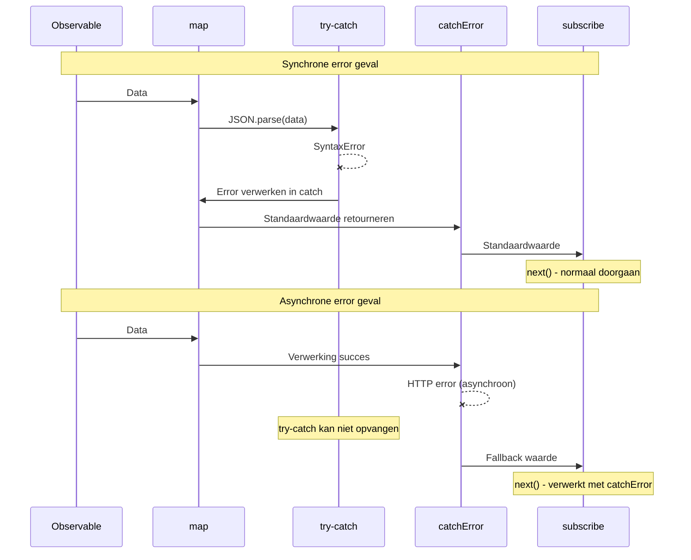

# try-catch en RxJS integratie

JavaScript heeft `try-catch` als standaard error handling, maar RxJS heeft eigen error handling mechanismen zoals `catchError` en `subscribe.error`. Deze pagina legt het verschil tussen beide uit en juiste gecombineerd gebruik.

## try-catch vs RxJS error handling

### Basaal verschil

| Item | try-catch | catchError / subscribe.error |
|------|-----------|------------------------------|
| **Toepassing** | Synchrone code | Asynchrone streams |
| **Error type** | JavaScript exceptions | Alle errors binnen Observable |
| **Toepassing bereik** | Alleen binnen try-catch blok | Hele pipeline |
| **Asynchrone ondersteuning** | ❌ Kan asynchrone errors niet opvangen | ✅ Kan ook asynchrone errors opvangen |
| **Stream voortzetting** | - | ✅ Voortzetting mogelijk met catchError |

### Errors die try-catch niet kan opvangen

Asynchrone errors zoals de volgende kunnen niet opgevangen worden met `try-catch`.

```typescript
import { timer, throwError, mergeMap, catchError } from 'rxjs';
// ❌ try-catch kan asynchrone errors niet opvangen
try {
  setTimeout(() => {
    throw new Error('Asynchrone error');
  }, 1000);
} catch (error) {
  // Wordt niet uitgevoerd
  console.error('Opgevangen:', error);
}

// ✅ RxJS kan ook asynchrone errors opvangen

timer(1000).pipe(
  mergeMap(() => throwError(() => new Error('Asynchrone error'))),
  catchError(error => {
    console.error('Opgevangen:', error.message); // ✅ Wordt uitgevoerd
    return of('Standaardwaarde');
  })
).subscribe();
```

> [!IMPORTANT] try-catch beperking
> `try-catch` richt zich alleen op **synchrone code**. Het kan errors in asynchrone verwerking zoals setTimeout, HTTP verzoeken, Promise, Observable niet opvangen.

## Wanneer try-catch te gebruiken

Zelfs bij RxJS gebruik is `try-catch` in de volgende gevallen nodig.

### 1. Error handling bij resource cleanup

Gebruik `try-catch` om errors op te vangen bij resource vrijgave binnen `finalize` of `using`.

```typescript
import { interval, take, finalize } from 'rxjs';
let ws: WebSocket | null = null;

interval(1000).pipe(
  take(5),
  finalize(() => {
    // Error bij resource vrijgave verwerken met try-catch
    try {
      if (ws) {
        ws.close();
        console.log('WebSocket normaal beëindigd');
      }
    } catch (error) {
      // Applicatie voortzetten ook als sluiten mislukt
      console.error('WebSocket sluit error:', error);
    }
  })
).subscribe({
  next: val => console.log('Waarde:', val)
});
```

**Reden**: Omdat je vaak wilt dat applicatie doorgaat ook als resource vrijgave verwerking mislukt.

### 2. Synchrone error handling binnen custom Observable

Wanneer je binnen `new Observable()` synchrone errors naar RxJS errors transformeert.

```typescript
import { Observable } from 'rxjs';

interface User {
  id: number;
  name: string;
}

function parseUserData(json: string): Observable<User> {
  return new Observable<User>(subscriber => {
    try {
      // JSON.parse is synchrone verwerking dus opvangen met try-catch
      const data = JSON.parse(json);

      // Validatie
      if (!data.id || !data.name) {
        throw new Error('Ongeldige gebruikersdata');
      }

      subscriber.next(data);
      subscriber.complete();
    } catch (error) {
      // Synchrone error transformeren naar RxJS error
      subscriber.error(error);
    }
  });
}

// Gebruiksvoorbeeld
parseUserData('{"id": 1, "name": "Taro"}').subscribe({
  next: user => console.log('Gebruiker:', user),
  error: err => console.error('Error:', err.message)
});

// Ongeldige JSON
parseUserData('invalid json').subscribe({
  next: user => console.log('Gebruiker:', user),
  error: err => console.error('Error:', err.message) // JSON.parse error opvangen
});
```

**Reden**: Om errors die optreden bij synchrone verwerking (JSON.parse, validatie etc.) als Observable errors te propageren.

### 3. Samenwerking met externe libraries

Error handling bij gebruik van externe libraries die geen RxJS gebruiken.

```typescript
import { of, map, catchError } from 'rxjs';
// Externe library (voorbeeld: beeldverwerkings library)
declare const ExternalImageLib: {
  process(data: string): string;
};

of('image-data-1', 'image-data-2', 'invalid-data').pipe(
  map(imageData => {
    try {
      // Externe library kan exception gooien
      const processed = ExternalImageLib.process(imageData);
      return { success: true, data: processed };
    } catch (error) {
      // Synchrone error opvangen en als waarde met error info retourneren
      console.error('Beeldverwerking error:', error);
      return { success: false, error: (error as Error).message };
    }
  })
).subscribe({
  next: result => {
    if (result.success) {
      console.log('Verwerking succes:', result.data);
    } else {
      console.log('Verwerking mislukt:', result.error);
    }
  }
});
```

**Reden**: Om errors van externe library veilig binnen stream te verwerken en stream voort te zetten.

### 4. Synchrone verwerking binnen operators

Bij synchrone verwerking binnen operators zoals `map`, `tap`.

```typescript
import { of, map } from 'rxjs';
interface Config {
  apiUrl: string;
  timeout: number;
}

of('{"apiUrl": "https://api.example.com", "timeout": 5000}').pipe(
  map(jsonString => {
    try {
      const config: Config = JSON.parse(jsonString);

      // Configuratie waarde validatie
      if (config.timeout < 0) {
        throw new Error('Timeout moet positief getal zijn');
      }

      return config;
    } catch (error) {
      console.error('Configuratie parse error:', error);
      // Standaard configuratie retourneren
      return { apiUrl: 'https://default.example.com', timeout: 3000 };
    }
  })
).subscribe({
  next: config => console.log('Configuratie:', config)
});
```

**Reden**: Om synchrone errors binnen operator te verwerken en standaardwaarde te retourneren zonder stream te onderbreken.

## Praktische gecombineerde patronen

### Patroon 1: Hiërarchische error handling

Hiërarchische benadering waarbij synchrone errors met `try-catch` en asynchrone errors met `catchError` verwerkt worden.

```typescript
import { of, map, catchError, finalize } from 'rxjs';
import { ajax } from 'rxjs/ajax';

interface ApiResponse {
  data: string;
  timestamp: number;
}

let connection: any = null;

ajax.getJSON<ApiResponse>('https://api.example.com/data').pipe(
  // Level 1: Synchrone verwerking errors verwerken met try-catch
  map(response => {
    try {
      // Data transformatie (synchrone verwerking)
      const decoded = atob(response.data);
      return { decoded, timestamp: response.timestamp };
    } catch (error) {
      console.error('Decodeer error:', error);
      throw new Error('Data transformatie mislukt');
    }
  }),
  // Level 2: Asynchrone errors verwerken met catchError
  catchError(error => {
    console.error('API aanroep error:', error);
    return of({ decoded: '', timestamp: Date.now() });
  }),
  // Level 3: Resource cleanup beschermen met try-catch
  finalize(() => {
    try {
      if (connection) {
        connection.close();
        console.log('Verbinding gesloten');
      }
    } catch (error) {
      console.error('Sluit error:', error);
    }
  })
).subscribe({
  next: result => console.log('Resultaat:', result),
  error: err => console.error('Finale error:', err)
});
```

### Patroon 2: Resource beheer met using()

```typescript
import { using, interval, take } from 'rxjs';
interface ManagedResource {
  id: string;
  close: () => void;
}

function createManagedStream(resource: ManagedResource) {
  return using(
    // Resource factory
    () => {
      console.log('Resource aanmaken:', resource.id);

      return {
        unsubscribe: () => {
          // Error bij resource vrijgave verwerken met try-catch
          try {
            resource.close();
            console.log('Resource vrijgave succes:', resource.id);
          } catch (error) {
            console.error('Resource vrijgave error:', resource.id, error);
            // Applicatie gaat door ook als error optreedt
          }
        }
      };
    },
    // Observable factory
    () => interval(1000).pipe(take(3))
  );
}

// Gebruiksvoorbeeld
const resource: ManagedResource = {
  id: 'resource-1',
  close: () => {
    // Sluit verwerking kan mislukken
    if (Math.random() > 0.5) {
      throw new Error('Sluiten mislukt');
    }
  }
};

createManagedStream(resource).subscribe({
  next: val => console.log('Waarde:', val),
  complete: () => console.log('Voltooid')
});
```

### Patroon 3: Custom error transformatie

Externe API errors transformeren naar applicatie-specifieke errors.

```typescript
import { Observable, throwError, catchError, map } from 'rxjs';
import { ajax } from 'rxjs/ajax';

// Custom error classes
class ValidationError extends Error {
  constructor(message: string, public field: string) {
    super(message);
    this.name = 'ValidationError';
  }
}

class NetworkError extends Error {
  constructor(message: string, public statusCode: number) {
    super(message);
    this.name = 'NetworkError';
  }
}

interface UserData {
  email: string;
  age: number;
}

function validateAndFetchUser(userId: string): Observable<UserData> {
  return ajax.getJSON<UserData>(`https://api.example.com/users/${userId}`).pipe(
    map(user => {
      try {
        // Synchrone validatie
        if (!user.email || !user.email.includes('@')) {
          throw new ValidationError('Ongeldig email adres', 'email');
        }
        if (user.age < 0 || user.age > 150) {
          throw new ValidationError('Ongeldige leeftijd', 'age');
        }
        return user;
      } catch (error) {
        if (error instanceof ValidationError) {
          // Validatie error opnieuw gooien als RxJS error
          throw error;
        }
        throw new Error('Data validatie error');
      }
    }),
    catchError(error => {
      // Asynchrone errors verwerken (HTTP errors etc.)
      if (error.status) {
        const networkError = new NetworkError(
          `HTTP ${error.status}: ${error.message}`,
          error.status
        );
        return throwError(() => networkError);
      }
      return throwError(() => error);
    })
  );
}

// Gebruiksvoorbeeld
validateAndFetchUser('123').subscribe({
  next: user => console.log('Gebruiker:', user),
  error: err => {
    if (err instanceof ValidationError) {
      console.error(`Validatie error (${err.field}):`, err.message);
    } else if (err instanceof NetworkError) {
      console.error(`Netwerkfout (${err.statusCode}):`, err.message);
    } else {
      console.error('Onverwachte error:', err);
    }
  }
});
```

## Sequence diagram: try-catch en catchError samenwerking



#### Zoals uit dit diagram blijkt
- **Synchrone error**: Opvangen met `try-catch` → verwerken → stream doorgaan
- **Asynchrone error**: `try-catch` overslaan → opvangen met `catchError`

## Anti-patronen

### ❌ Anti-patroon 1: Proberen asynchrone errors met try-catch op te vangen

```typescript
// ❌ Slecht voorbeeld: Asynchrone errors kunnen niet opgevangen worden
import { ajax } from 'rxjs/ajax';

try {
  ajax.getJSON('https://api.example.com/data').subscribe({
    next: data => console.log(data)
  });
} catch (error) {
  // HTTP errors worden hier niet opgevangen
  console.error('Error:', error);
}
```

```typescript
import { of, catchError } from 'rxjs';
// ✅ Goed voorbeeld: Verwerken met catchError of subscribe.error
import { ajax } from 'rxjs/ajax';

ajax.getJSON('https://api.example.com/data').pipe(
  catchError(error => {
    console.error('HTTP error:', error);
    return of(null);
  })
).subscribe({
  next: data => console.log(data)
});
```

### ❌ Anti-patroon 2: Errors onderdrukken met try-catch

```typescript
import { of, map } from 'rxjs';
// ❌ Slecht voorbeeld: Error alleen loggen en onderdrukken

of('invalid-json').pipe(
  map(json => {
    try {
      return JSON.parse(json);
    } catch (error) {
      console.error('Error:', error);
      return null; // Error informatie gaat verloren
    }
  })
).subscribe({
  next: data => {
    // Merkt niet dat data null is
    console.log(data);
  }
});
```

```typescript
import { of, map } from 'rxjs';
// ✅ Goed voorbeeld: Error informatie behouden

interface ParseResult {
  success: boolean;
  data?: any;
  error?: string;
}

of('invalid-json').pipe(
  map(json => {
    try {
      const data = JSON.parse(json);
      return { success: true, data } as ParseResult;
    } catch (error) {
      return {
        success: false,
        error: (error as Error).message
      } as ParseResult;
    }
  })
).subscribe({
  next: result => {
    if (result.success) {
      console.log('Data:', result.data);
    } else {
      console.error('Parse error:', result.error);
    }
  }
});
```

### ❌ Anti-patroon 3: Onnodig try-catch misbruik

```typescript
import { of, map } from 'rxjs';
// ❌ Slecht voorbeeld: RxJS verwerkbare errors met try-catch inpakken

of(1, 2, 3).pipe(
  map(x => {
    try {
      return x * 10;
    } catch (error) {
      // Deze code gooit geen error dus onnodig
      return 0;
    }
  })
).subscribe();
```

```typescript
import { of, map } from 'rxjs';
// ✅ Goed voorbeeld: Alleen noodzakelijke plaatsen try-catch gebruiken

of('{"value": 1}', 'invalid', '{"value": 2}').pipe(
  map(json => {
    try {
      // JSON.parse kan exception gooien dus try-catch nodig
      return JSON.parse(json);
    } catch (error) {
      console.error('JSON parse error:', error);
      return { value: 0 };
    }
  })
).subscribe({
  next: data => console.log('Data:', data)
});
```

## Best practices

### 1. Onderscheid gebruiken naar error type

```typescript
import { of, map, catchError, finalize } from 'rxjs';
import { ajax } from 'rxjs/ajax';

// Duidelijk onderscheid gebruiken
ajax.getJSON<{ data: string }>('https://api.example.com/data').pipe(
  // Synchrone verwerking errors → try-catch
  map(response => {
    try {
      return JSON.parse(response.data);
    } catch (error) {
      console.error('Parse error:', error);
      return {};
    }
  }),
  // Asynchrone errors → catchError
  catchError(error => {
    console.error('API error:', error);
    return of({});
  }),
  // Cleanup errors → try-catch
  finalize(() => {
    try {
      // Resource vrijgave verwerking
    } catch (error) {
      console.error('Cleanup error:', error);
    }
  })
).subscribe();
```

### 2. Error informatie behouden

```typescript
import { of, map } from 'rxjs';
interface Result<T> {
  success: boolean;
  value?: T;
  error?: string;
}

function safeParse<T>(json: string): Result<T> {
  try {
    const value = JSON.parse(json);
    return { success: true, value };
  } catch (error) {
    return {
      success: false,
      error: error instanceof Error ? error.message : String(error)
    };
  }
}

of('{"name": "Taro"}', 'invalid').pipe(
  map(json => safeParse(json))
).subscribe({
  next: result => {
    if (result.success) {
      console.log('Succes:', result.value);
    } else {
      console.error('Mislukt:', result.error);
    }
  }
});
```

### 3. Gedetailleerde informatie bieden met custom errors

```typescript
import { of, map } from 'rxjs';
// Custom error class
class DataProcessingError extends Error {
  constructor(
    message: string,
    public readonly data: unknown,
    public readonly step: string
  ) {
    super(message);
    this.name = 'DataProcessingError';
  }
}


of({ raw: 'some-data' }).pipe(
  map(input => {
    try {
      // Complexe verwerking
      const processed = processData(input.raw);
      return processed;
    } catch (error) {
      throw new DataProcessingError(
        'Data verwerking mislukt',
        input,
        'processing'
      );
    }
  })
).subscribe({
  next: data => console.log('Verwerkt:', data),
  error: (err: DataProcessingError) => {
    console.error(`Error (${err.step}):`, err.message);
    console.error('Input data:', err.data);
  }
});

function processData(raw: string): any {
  return raw;
}
```

### 4. Logging en monitoring

```typescript
import { of, map, catchError, tap } from 'rxjs';
import { ajax } from 'rxjs/ajax';

// Error monitoring functie
function logError(context: string, error: Error): void {
  console.error(`[${context}]`, error.message);
  // In productie verzenden naar error monitoring service
  // errorMonitoringService.captureException(error, { context });
}

ajax.getJSON('https://api.example.com/data').pipe(
  tap(data => console.log('Ontvangen:', data)),
  map(data => {
    try {
      // Data transformatie
      return transformData(data);
    } catch (error) {
      logError('Data Transformation', error as Error);
      throw error; // Propageren naar catchError
    }
  }),
  catchError(error => {
    logError('API Request', error);
    return of(null);
  })
).subscribe();

function transformData(data: any): any {
  return data;
}
```

## Veelgestelde vragen

::: info **Q: Is het nodig om zowel try-catch als catchError te gebruiken?**
A: Ja, onderscheid is nodig.
- **try-catch**: Synchrone verwerking errors (JSON.parse, validatie etc.)
- **catchError**: Asynchrone errors (HTTP, timers, Promise etc.)
:::

::: info **Q: Wat is beter, throwen in map of verwerken met try-catch?**
A: Hangt af van situatie.
- **throwen**: Wanneer je error wilt propageren naar hele stream
- **verwerken met try-catch**: Wanneer je ter plaatse wilt herstellen en stream wilt voortzetten
```typescript
// throwen voorbeeld
map(x => {
  if (x < 0) throw new Error('Negatief getal');
  return x;
})

// verwerken met try-catch voorbeeld
map(x => {
  try {
    return riskyOperation(x);
  } catch (error) {
    return defaultValue; // Ter plaatse herstellen
  }
})
```
:::

::: info **Q: Wat gebeurt er als error optreedt in finalize?**
A: Als error optreedt in `finalize`, propageert die error niet naar `subscribe.error` maar wordt weergegeven als `Uncaught Error` in console. Daarom moet je errors binnen `finalize` altijd opvangen met `try-catch`.
:::

::: info **Q: Kan ik combinatie van async/await en try-catch gebruiken?**
A: Ja, effectief bij Promise behandeling.
```typescript
import { from, mergeMap } from 'rxjs';
async function fetchData(id: string): Promise<any> {
  try {
    const response = await fetch(`/api/data/${id}`);
    return await response.json();
  } catch (error) {
    console.error('Fetch error:', error);
    throw error;
  }
}

from([1, 2, 3]).pipe(
  mergeMap(id => from(fetchData(String(id))))
).subscribe({
  next: data => console.log('Data:', data),
  error: err => console.error('Error:', err)
});
```
:::

::: info **Q: Moet ik subscriber.error() aanroepen of throwen in custom Observable?**
A: Gebruik binnen `new Observable()` **subscriber.error()**.
```typescript
// ✅ Correct
new Observable(subscriber => {
  try {
    const data = riskyOperation();
    subscriber.next(data);
  } catch (error) {
    subscriber.error(error); // Propageren als RxJS error
  }
})

// ❌ Fout (throwen in Observable constructor kan tot onverwacht gedrag leiden)
new Observable(subscriber => {
  const data = riskyOperation(); // Error kan niet opgevangen worden
  subscriber.next(data);
})
```
:::

## Samenvatting

`try-catch` en RxJS error handling hebben elk verschillende rollen, en door ze te combineren kun je robuuste error handling realiseren.

### Gebruik principes

| Scenario | Aanbevolen | Reden |
|---------|------|------|
| Synchrone verwerking (JSON.parse, validatie) | try-catch | Onmiddellijk synchrone errors opvangen |
| Asynchrone verwerking (HTTP, timers) | catchError | Asynchrone errors opvangen |
| Resource vrijgave (finalize, using) | try-catch | Vrijgave falen veilig verwerken |
| Binnen custom Observable | try-catch + subscriber.error() | Synchrone errors transformeren naar RxJS errors |
| Externe library samenwerking | try-catch | Library errors veilig verwerken |

> [!IMPORTANT] Belangrijke principes
> 1. **Synchrone verwerking try-catch, asynchrone verwerking catchError/subscribe.error**
> 2. **Binnen finalize altijd errors opvangen met try-catch**
> 3. **Error informatie niet onderdrukken, correct propageren of loggen**
> 4. **Gedetailleerde informatie bieden met custom error classes**
> 5. **Geen onnodige try-catch gebruiken (code wordt complex)**

## Gerelateerde secties

- **[Twee locaties voor error handling](/nl/guide/error-handling/error-handling-locations)** - Verschil tussen catchError en subscribe.error
- **[Error handling strategieën](/nl/guide/error-handling/strategies)** - Uitgebreide RxJS error handling strategieën
- **[using()](/nl/guide/creation-functions/control/using)** - Resource beheer en try-catch gecombineerd gebruik voorbeeld
- **[finalize en complete](/nl/guide/error-handling/finalize)** - Error handling bij resource vrijgave

## Referentie bronnen

- [RxJS Officiële Documentatie - catchError](https://rxjs.dev/api/index/function/catchError)
- [MDN - try...catch](https://developer.mozilla.org/nl/docs/Web/JavaScript/Reference/Statements/try...catch)
- [RxJS Officiële Documentatie - Error Handling](https://rxjs.dev/guide/error-handling)
