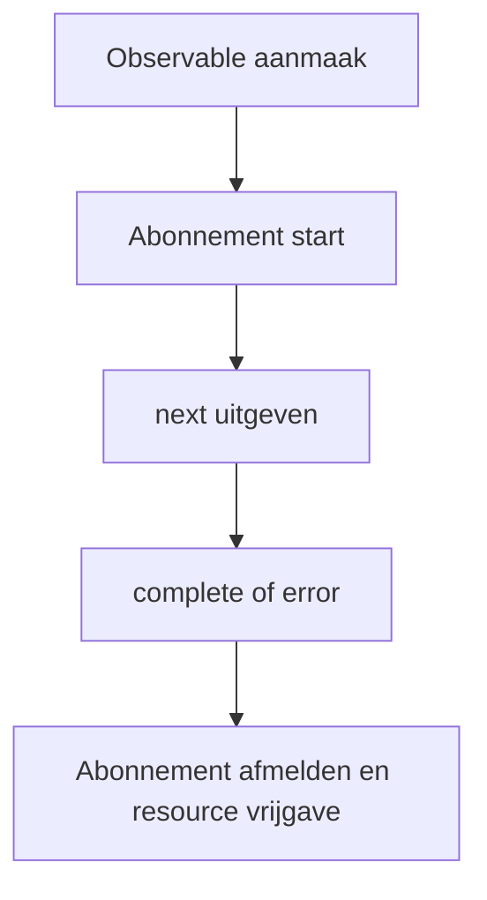

# Lifecycle van Observable

Hier leggen we de lifecycle van Observable in RxJS stap voor stap uit, van aanmaak tot abonnement, data-uitgifte, voltooiings- en foutnotificatie, afmelding van abonnement en resource management.
Het begrijpen van deze lifecycle vormt de basis voor effectief gebruik van RxJS.

## Overzicht van Observable lifecycle

De lifecycle van Observable verwijst naar de volledige stroom van hoe Observable wordt gegenereerd, op welk moment data wordt uitgegeven, hoe voltooiings- en foutnotificaties worden uitgevoerd, en uiteindelijk resources worden vrijgegeven. Door dit te begrijpen, kun je het gedrag van RxJS correct begrijpen en abonnementen op het beoogde moment afmelden, bijeffecten controleren en error handling uitvoeren.

### 🔄 Observable Lifecycle Diagram (Status transitie)




## Samenstelling van Observable lifecycle
De lifecycle van Observable bestaat uit de volgende fasen.

|Volgorde|Fase|Inhoud|
|---|---|---|
|1|Aanmaak (Creation)|Aanmaken van Observable instantie|
|2|Abonnement (Subscription)|Start van abonnement via `subscribe()` methode|
|3|Uitvoering (Execution)|<li>`next()`: Data-uitgifte</li><li>`error()`: Foutnotificatie</li><li>`complete()`: Voltooiingsnotificatie</li>|
|4|Afmelding (Disposal)|Afmelden van abonnement via `unsubscribe()` methode|

Observable is "lazy" en de stream wordt niet uitgegeven tot `subscribe()` wordt aangeroepen. Ook eindigt de stream wanneer `complete()` of `error()` wordt aangeroepen, en verdere `next()` aanroepen worden genegeerd.

> [!CAUTION]
> Het betekent niet dat direct enige "processing" wordt uitgevoerd door `subscribe()`.
> Vaak wordt de uitdrukking gebruikt 『Het wordt niet uitgevoerd tot `subscribe()` wordt aangeroepen.』,
> maar preciezer gezegd wordt "de interne logica van Observable (notificatie processing)" voor het eerst getriggerd door `subscribe()`.
>
> Operators zoals `pipe()` bouwen alleen evaluatieketens op, en de uitvoering wordt gestart door callbacks van Observer.

### Voorbeeld van Observable lifecycle
```ts
import { Observable } from 'rxjs';

// 1. Observable aanmaak
const observable$ = new Observable<number>(subscriber => {
  console.log('Observable uitvoering start');

  // 3. Uitvoering: Data-uitgifte
  subscriber.next(1);
  subscriber.next(2);

  // Timer setup
  const timerId = setTimeout(() => {
    subscriber.next(3);
    subscriber.complete(); // 3. Uitvoering: Voltooiingsnotificatie
    console.log('Observable voltooid');
  }, 1000);

  // Retourneer cleanup functie (wordt aangeroepen bij unsubscribe)
  return () => {
    console.log('Cleanup uitgevoerd');
    clearTimeout(timerId);
  };
});

// 2. Abonnement
const subscription = observable$.subscribe({
  next: value => console.log('Volgende waarde:', value),
  error: err => console.error('Fout:', err),
  complete: () => console.log('Voltooiingsnotificatie ontvangen')
});

// 4. Afmelding van abonnement (handmatig of bij voltooiing)
setTimeout(() => {
  console.log('Handmatig abonnement afmelden');
  subscription.unsubscribe();
}, 500); // Afmelden na 500ms (voor voltooiingsnotificatie)

// Verwerkingsresultaat:
// Observable uitvoering start
// Volgende waarde: 1
// Volgende waarde: 2
// Handmatig abonnement afmelden
// Cleanup uitgevoerd
```

## Observer (オブザーバー)　 {#observer}

Observer is een object dat verantwoordelijk is voor het ontvangen van notificaties van Observable aan de ontvangstzijde. Door bij het abonneren (subscribe) op Observable een Observer door te geven, kun je uitgegeven data, fouten en voltooiingsnotificaties verwerken.

### 3 callback functies van Observer
Observer is een interface voor het ontvangen van notificaties van Observable.
Het heeft 3 callback functies.
- `next`: Data-uitgifte
- `error`: Foutnotificatie
- `complete`: Voltooiingsnotificatie

#### Voorbeeld
```ts
import { Observer, of } from 'rxjs';

// Volledig Observer object
const observer: Observer<number> = {
  next: value => console.log('Waarde:', value),// Data-uitgifte
  error: err => console.error('Fout:', err), // Foutnotificatie
  complete: () => console.log('Voltooid') // Voltooiingsnotificatie
};

const observable$ = of(1, 2, 3); // Eenvoudig Observable aanmaken

// Gebruik van Observer object
observable$.subscribe(observer);

// Gedeeltelijke Observer is ook mogelijk
observable$.subscribe({
  next: value => console.log('Alleen waarde verwerken:', value)
});

// Object vorm (aanbevolen)
observable$.subscribe({
  next: value => console.log('Waarde::', value),
  error: err => console.error('Fout:', err),
  complete: () => console.log('Voltooid::')
});

// Verwerkingsresultaat:
// Waarde: 1
// Waarde: 2
// Waarde: 3
// Voltooid
// Alleen waarde verwerken: 1
// Alleen waarde verwerken: 2
// Alleen waarde verwerken: 3
// Waarde:: 1
// Waarde:: 2
// Waarde:: 3
// Voltooid::
```

## Subscription (サブスクリプション)  {#subscription}

Subscription vertegenwoordigt de uitvoering van Observable en wordt hoofdzakelijk gebruikt voor afmelding van abonnement `unsubscribe()`.

#### Voorbeeld
```ts
import { interval } from 'rxjs';
import { take } from 'rxjs';

const numbers$ = interval(1000).pipe(take(5));

// Subscription bewaren
const subscription = numbers$.subscribe({
  next: value => console.log('Waarde:', value),
  complete: () => console.log('Voltooid')
});

// Handmatig abonnement afmelden na 3 seconden
setTimeout(() => {
  subscription.unsubscribe(); // Abonnement afmelden
  console.log('Abonnement afgemeld');
}, 3000);

// Verwerkingsresultaat:
// Waarde: 0
// Waarde: 1
// Waarde: 2
// Abonnement afgemeld
```


## Error handling

In de lifecycle van Observable eindigt de stream onmiddellijk wanneer `error()` wordt aangeroepen, en `complete()` wordt niet aangeroepen. Daarom zijn het gebruik van `catchError` en het ontwerp van `retry` belangrijk.

#### Voorbeeld
```ts
import { Observable, of } from 'rxjs';
import { catchError, retry } from 'rxjs';

// Observable die een fout veroorzaakt
const failingObservable$ = new Observable<number>(subscriber => {
  subscriber.next(1);
  subscriber.next(2);
  subscriber.error(new Error('Opzettelijke fout'));
  // Let op dat complete niet wordt aangeroepen na fout
});

// Voorbeeld van error handling
failingObservable$.pipe(
  // Bij fout, 3 keer opnieuw proberen
  retry(3),
  // Als het dan nog steeds een fout is, overschakelen naar alternatieve Observable
  catchError(error => {
    console.error('Fout gevangen:', error.message);
    return of('Alternatieve waarde na fout');
  })
).subscribe({
  next: value => console.log('Waarde:', value),
  error: err => console.error('Niet afgehandelde fout:', err),
  complete: () => console.log('Voltooid')
});

// Verwerkingsresultaat:
// Waarde: 1
// Waarde: 2
// Waarde: 1
// Waarde: 2
// Waarde: 1
// Waarde: 2
// Waarde: 1
// Waarde: 2
// Fout gevangen: Opzettelijke fout
// Waarde: Alternatieve waarde na fout
// Voltooid
```

## Voltooiings lifecycle

Voltooiing van Observable vindt plaats wanneer `complete()` expliciet wordt aangeroepen, of wanneer een eindige stream eindigt.

#### Voorbeeld
```ts
import { of, interval, Observable } from 'rxjs';
import { take } from 'rxjs';

// Eindige Observable (voltooit automatisch)
const finite$ = of(1, 2, 3);
finite$.subscribe({
  next: value => console.log('Eindige waarde:', value),
  complete: () => console.log('Eindige Observable voltooid')
});

// Oneindige Observable omzetten naar eindig
const limited$ = interval(1000).pipe(take(3));
limited$.subscribe({
  next: value => console.log('Beperkte waarde:', value),
  complete: () => console.log('Beperkte Observable voltooid')
});

// Handmatig voltooien van Observable
const manual$ = new Observable<number>(subscriber => {
  subscriber.next(1);

  setTimeout(() => {
    subscriber.next(2);
    subscriber.complete(); // Expliciet voltooien
  }, 2000);
});

manual$.subscribe({
  next: value => console.log('Handmatige waarde:', value),
  complete: () => console.log('Handmatige Observable voltooid')
});

// Verwerkingsresultaat:
// Eindige waarde: 1
// Eindige waarde: 2
// Eindige waarde: 3
// Eindige Observable voltooid
// Handmatige waarde: 1
// Beperkte waarde: 0
// Beperkte waarde: 1
// Handmatige waarde: 2
// Handmatige Observable voltooid
// Beperkte waarde: 2
// Beperkte Observable voltooid
```

## Resource management en voorkomen van geheugen leaks

Afmelden van abonnementen op het passende moment is belangrijk om geheugen leaks te voorkomen.

#### Voorbeeld
```ts
import { interval, Subject } from 'rxjs';
import { takeUntil } from 'rxjs';

// Imiteren van component lifecycle
class Component {
  private destroy$ = new Subject<void>();

  constructor() {
    // Interval van elke seconde (potentiële oorzaak van geheugen leak)
    interval(1000).pipe(
      // Automatisch abonnement afmelden bij component vernietiging
      takeUntil(this.destroy$)
    ).subscribe(value => {
      console.log('Waarde binnen component:', value);
    });
  }

  // Component vernietiging
  ngOnDestroy() {
    console.log('Component vernietiging');
    this.destroy$.next();
    this.destroy$.complete();
  }
}

// Gebruiksvoorbeeld
const component = new Component();

// Component vernietigen na 5 seconden
setTimeout(() => {
  (component as any).ngOnDestroy();
}, 5000);

// Verwerkingsresultaat:
// Waarde binnen component: 0
// Waarde binnen component: 1
// Waarde binnen component: 2
// Waarde binnen component: 3
// Waarde binnen component: 4
// Component vernietiging
```

## Samenvatting

Door de lifecycle van Observable te begrijpen, wordt het volgende mogelijk.

- Resource vrijgave op het passende moment
- Implementatie van error handling en herstelstrategieën
- Onderscheid tussen Cold Observable en Hot Observable
- Beheer van bijeffecten

Met name in component-gebaseerde frameworks zoals Angular en React is abonnementbeheer volgens de lifecycle nodig met gebruik van `takeUntil`, `unsubscribe`, `finalize` etc.
