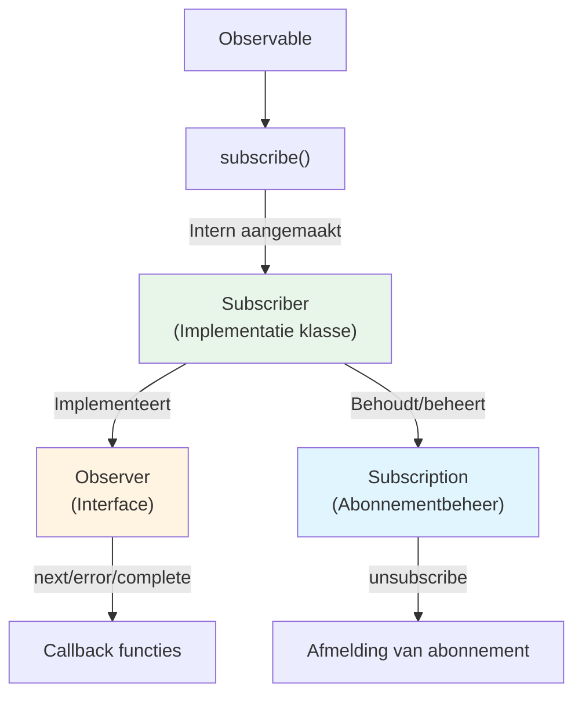
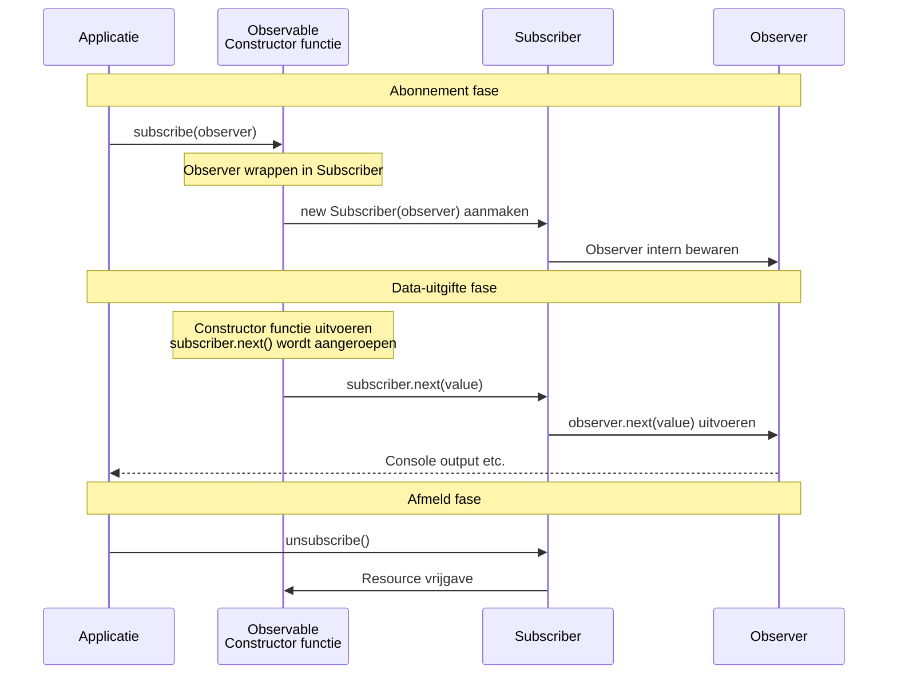

# Verschil tussen Observer en Subscriber

## Waarom worden ze verward

Bij het leren van RxJS komen de termen "Observer" en "Subscriber" voor, wat verwarrend kan zijn. Deze twee zijn nauw verwant, maar hebben duidelijk verschillende rollen.

## Wat is Observer

**Observer (オブザーバー)** is een **interface** voor het ontvangen van data.

### Definitie van Observer

```typescript
interface Observer<T> {
  next: (value: T) => void;       // Waarde ontvangen
  error?: (err: any) => void;     // Fout ontvangen
  complete?: () => void;          // Voltooiing ontvangen
}
```

### Rol van Observer
- Definieert de "manier van ontvangen" van data
- Heeft 3 callback functies
- Beschrijft **wat te doen**

## Wat is Subscriber

**Subscriber (サブスクライバー)** is een **klasse** die Observer implementeert en daadwerkelijk abonnementprocessing uitvoert.

### Rol van Subscriber
- Voert callbacks van Observer uit
- Houdt Subscription (abonnementbeheer) vast
- Beheert afmeldprocessing
- Controleert **hoe uit te voeren**

## Twee situaties waarin Subscriber voorkomt

Subscriber komt eigenlijk voor in **twee verschillende situaties**. Echter, **het is in beide gevallen hetzelfde Subscriber object**. Het begrijpen van dit verschil is de sleutel tot het vermijden van verwarring.

### Situatie 1: Bij aanmaken Observable (ontvangen als parameter)

Bij het aanmaken van Observable met `new Observable()`, wordt `subscriber` als parameter doorgegeven aan de constructor functie.

```typescript
import { Observable } from 'rxjs';

// Waarden uitgeven met subscriber (type is Subscriber<number>)
const observable$ = new Observable<number>(subscriber => {
  subscriber.next(1);      // Waarde uitgeven
  subscriber.next(2);
  subscriber.complete();   // Voltooiing notificeren
});
```

::: tip Type van subscriber in deze situatie
- Type: `Subscriber<number>`
- Rol: Gebruikt binnen Observable om data uit te geven
- Ontwikkelaar gebruikt direct (`next()`, `error()`, `complete()` aanroepen)
:::

### Situatie 2: Bij subscribe() aanroep (Observer → Subscriber conversie)

Bij het aanroepen van `subscribe()` op Observable, wordt **de door de ontwikkelaar doorgegeven Observer intern geconverteerd naar Subscriber**.

```typescript
// Ontwikkelaar geeft Observer interface door
observable$.subscribe({
  next: value => console.log('Volgende waarde:', value),
  error: err => console.error('Fout:', err),
  complete: () => console.log('Voltooid')
});

// ↑ RxJS maakt intern als volgt Subscriber
// const subscriber = new Subscriber(observer);
// En deze subscriber wordt als parameter doorgegeven in situatie 1
```

::: tip Processing in deze situatie
1. Ontwikkelaar geeft `Observer` interface door
2. RxJS wrapt `Observer` intern in `Subscriber`
3. Die `Subscriber` wordt doorgegeven aan de constructor functie van Observable (= `subscriber` in situatie 1)
:::

### Belangrijk: Beide zijn hetzelfde Subscriber object

> [!IMPORTANT] `Subscriber` in situatie 1 en 2 is hetzelfde object
>
> ```typescript
> const observable$ = new Observable(subscriber => {
>   // Deze subscriber is het Subscriber object dat werd aangemaakt
>   // toen subscribe() werd aangeroepen
>   subscriber.next(1);
> });
>
> observable$.subscribe({
>   // Deze Observer wordt gewrapt in Subscriber,
>   // en doorgegeven aan bovenstaande constructor functie
>   next: v => console.log(v)
> });
> ```
>
> **Dat wil zeggen:**
> - Ontwikkelaar roept `subscribe(observer)` aan
> - RxJS maakt `new Subscriber(observer)` aan
> - Die Subscriber wordt het argument van de constructor functie van Observable
> - Daarom, `subscriber` in situatie 1 = `Subscriber` aangemaakt in situatie 2

## Relatiediagram



## Verschil zien in code

### Volledig voorbeeld: Van Observable aanmaak tot abonnement

```typescript
import { Observable } from 'rxjs';

// 1. Bij Observable aanmaak: waarden uitgeven met subscriber
const observable$ = new Observable<number>(subscriber => {
  console.log('Abonnement start');
  subscriber.next(1);
  subscriber.next(2);
  subscriber.next(3);
  subscriber.complete();
});

// 2. Bij abonnement: Observer doorgeven (intern wordt Subscriber aangemaakt)
observable$.subscribe({
  next: value => console.log('Volgende waarde:', value),
  error: err => console.error('Fout:', err),
  complete: () => console.log('Voltooid')
});

// Output:
// Abonnement start
// Volgende waarde: 1
// Volgende waarde: 2
// Volgende waarde: 3
// Voltooid
```

#### In dit voorbeeld
- **`subscriber` bij aanmaak**: Gebruikt binnen Observable om data uit te geven
- **`Observer` bij abonnement**: Definieert processing om uitgegeven data te ontvangen

### Observer doorgeven

```typescript
import { interval } from 'rxjs';

const observer = {
  next: (value: number) => console.log(value),
  error: (err: any) => console.error(err),
  complete: () => console.log('Voltooid')
};

// Observer doorgeven aan subscribe
const subscription = interval(1000).subscribe(observer);
// Intern wordt Subscriber aangemaakt en worden callbacks van observer uitgevoerd
```

### Directe callbacks doorgeven (verkorte notatie)

```typescript
// Ook hierbij wordt intern Subscriber aangemaakt
const subscription = interval(1000).subscribe(
  value => console.log(value),  // next
  err => console.error(err),    // error
  () => console.log('Voltooid')     // complete
);
```

## Daadwerkelijke werkingsflow

Het volgende sequencediagram toont de stroom van Observable aanmaak tot abonnement en data-uitgifte.



**Belangrijke punten in deze flow:**
1. Bij aanroepen van `subscribe(observer)` wordt `new Subscriber(observer)` aangemaakt
2. Die Subscriber wordt als parameter doorgegeven aan de constructor functie van Observable
3. Wanneer in de constructor functie `subscriber.next()` wordt aangeroepen, wordt intern `observer.next()` uitgevoerd
4. Dat wil zeggen, **`Subscriber` gebruikt in beide situaties is hetzelfde object**

## Belangrijke punten

> [!IMPORTANT] Observer is "blauwdruk", Subscriber is "uitvoerder"
> - **Observer**: Interface die de manier van data ontvangen **definieert**
> - **Subscriber**: Klasse die Observer **implementeert** en daadwerkelijk abonnement **uitvoert**
> - Subscriber komt voor in twee situaties

> [!TIP] Begrijp de situaties waarin Subscriber wordt gebruikt
> - **Bij Observable aanmaak**: Direct gebruiken van `subscriber` parameter in `new Observable(subscriber => {...})`
> - **Bij abonnement**: Bij aanroepen van `subscribe(observer)` wordt intern automatisch Subscriber aangemaakt
>
> In beide situaties is Subscriber hetzelfde object met `next()`, `error()`, `complete()` methoden.

## Veel voorkomende verwarringspatronen

### ❌ Verkeerd begrip patroon 1

"De `subscriber` bij Observable aanmaak en de `observer` bij abonnement zijn verschillende dingen"

### ❌ Verkeerd begrip patroon 2

"Subscriber is interne implementatie, dus ontwikkelaar raakt het niet aan"

### ✅ Correct begrip

**Belangrijk feit:**
- De **Observer** die ontwikkelaar doorgeeft bij `subscribe(observer)` wordt intern gewrapt in **Subscriber**
- Die **Subscriber** wordt als parameter doorgegeven aan de constructor functie bij Observable aanmaak
- Dat wil zeggen, **`subscriber` in situatie 1 = `Subscriber` aangemaakt in situatie 2 (hetzelfde object)**

### Volledig begrip met voorbeeld

```typescript
import { Observable } from 'rxjs';

// 1. Observable aanmaken (op dit moment wordt nog niets uitgevoerd)
const observable$ = new Observable<number>(subscriber => {
  console.log('Constructor functie uitgevoerd!');
  subscriber.next(1);
  subscriber.next(2);
  subscriber.complete();
});

// 2. Abonneren (op dit moment wordt constructor functie voor het eerst uitgevoerd)
observable$.subscribe({
  next: v => console.log('Ontvangen:', v),
  complete: () => console.log('Voltooid')
});

// Output:
// Constructor functie uitgevoerd!
// Ontvangen: 1
// Ontvangen: 2
// Voltooid
```

**Flow in dit voorbeeld:**
1. `observable$.subscribe({...})` wordt aangeroepen
2. RxJS maakt `new Subscriber({next: ..., complete: ...})` aan
3. Die `Subscriber` wordt als parameter doorgegeven en constructor functie `(subscriber => {...})` wordt uitgevoerd
4. `subscriber.next(1)` binnen constructor functie wordt aangeroepen
5. Intern wordt `observer.next(1)` uitgevoerd, "Ontvangen: 1" wordt geoutput

**Dat wil zeggen:**
- `subscriber` in situatie 1 ← Dit
- `Subscriber` aangemaakt in situatie 2 ← Dit
- **Hetzelfde object!**

## Samenvatting

### Vergelijking Observer en Subscriber

| | Observer | Subscriber |
|---|----------|------------|
| **Type** | Interface | Klasse (implementeert Observer) |
| **Rol** | Definieert manier van data ontvangen | Voert daadwerkelijke abonnementprocessing uit |
| **Inhoud** | next/error/complete callbacks | Observer + Subscription beheer |
| **Situatie waarin het voorkomt** | Alleen bij abonnement | Bij Observable aanmaak & bij abonnement |

### Belangrijk: Relatie in twee situaties

| Situatie | Wat ontwikkelaar behandelt | Daadwerkelijk type | Relatie |
|------|------------------|----------|--------|
| **Bij Observable aanmaak** | `new Observable(subscriber => {...})` parameter | `Subscriber<T>` | Ontwikkelaar gebruikt direct |
| **Bij abonnement** | Object doorgegeven aan `subscribe(observer)` | `Observer<T>` → Intern geconverteerd naar `Subscriber<T>` | RxJS converteert automatisch |

> [!IMPORTANT] Kernpunt
> - De `Observer` die ontwikkelaar doorgeeft bij `subscribe(observer)` wordt intern gewrapt in `Subscriber`
> - Die `Subscriber` wordt als parameter doorgegeven aan de constructor functie van Observable
> - Daarom, **`Subscriber` gebruikt in beide situaties is hetzelfde object**

## Volgende stappen

Nadat je het verschil tussen Observer en Subscriber hebt begrepen, leer je over daadwerkelijk abonnementbeheer.

- [Lifecycle van Observable](/nl/guide/observables/observable-lifecycle) - Stroom van start tot einde abonnement
- [Beheer van Subscription](/nl/guide/observables/observable-lifecycle#subscription-の管理) - Afmelding van abonnement en resource beheer

## Referentiebronnen

- [RxJS Officiële Documentatie - Observer](https://rxjs.dev/guide/observer) - Gedetailleerde specificaties van Observer
- [RxJS Officiële Documentatie - Subscription](https://rxjs.dev/guide/subscription) - Gedetailleerde specificaties van Subscription
- [Understanding the Difference Between Observer and Subscriber in RxJS](https://www.codingscenes.com/posts/92/Understanding-the-Difference-Between-Observer-and-Subscriber-in-RxJS) - Uitbreidingsfuncties van Subscriber en praktische voorbeelden (Engels)
