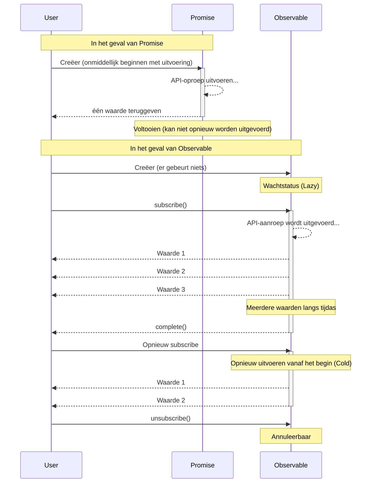

# Belemmeringen voor conceptueel begrip

De eerste barrière voor RxJS is **het begrijpen van concepten**. Vooral voor ontwikkelaars die gewend zijn aan Promise, kan het gedrag van Observable contra-intuïtief zijn.

## Essentiële verschillen tussen Observable vs Promise

### Promise: eenmalige asynchrone verwerking

```typescript
// Promise: waarde slechts eenmaal retourneren
const userPromise = fetch('/api/user/1').then(res => res.json());

userPromise.then(user => console.log(user)); // informatie over gebruiker slechts eenmaal ophalen
userPromise.then(user => console.log(user)); // zelfde resultaat in cache opgeslagen
```

> [!TIP] Kenmerken
> - **Eager (onmiddellijke uitvoering)** - verwerking begint op het moment dat de Promise wordt aangemaakt
> - **Voltooit slechts eenmaal** - slechts eenmaal, succes of mislukking
> - **Niet annuleerbaar** - eenmaal gestart, kan niet worden gestopt
> - **Altijd Hot** - meerdere then delen hetzelfde resultaat

### Observable: Stream (gegevensstroom met tijdas)

```typescript
import { Observable } from 'rxjs';

// Observable: meerdere waarden die langs een tijdas stromen
const user$ = new Observable<User>(subscriber => {
  console.log('Observable uitvoering gestart!');
  fetch('/api/user/1')
    .then(res => res.json())
    .then(user => {
      subscriber.next(user);
      subscriber.complete();
    });
});

// ❌ Er gebeurt nu nog niets (Lazy)
console.log('Observable creatie voltooid');

// ✅ Pas na subscribe wordt het uitgevoerd
user$.subscribe(user => console.log('Subscribe 1:', user));
user$.subscribe(user => console.log('Subscribe 2:', user));
// → API-aanroep wordt twee keer uitgevoerd (Cold Observable)
```

#### Uitvoer
```
Observable creatie voltooid
Observable uitvoering gestart!
Subscribe 1: { id: 1, name: 'Alice' }
Observable uitvoering gestart!
Subscribe 2: { id: 1, name: 'Alice' }
```

> [!TIP] Kenmerken
> - **Lazy (vertraagde uitvoering)** - er gebeurt niets tot subscribe
> - **Meerdere waarden kunnen worden doorgegeven** - next() kan meerdere keren worden aangeroepen
> - **Annuleerbaar** - kan worden gestopt door unsubscribe
> - **Cold of Hot** - kan kiezen om per abonnement uit te voeren of te delen

### Vergelijkingstabel

| Eigenschap | Promise | Observable |
|---|---|---|
| **Uitvoertiming** | Onmiddellijk (Eager) | Bij subscribe (Lazy) |
| **Aantal waarden** | Eenmalig | 0 of meer (meerdere) |
| **Annuleren** | Niet toegestaan | Mogelijk (unsubscribe) |
| **Hergebruik** | Gecachte resultaten | Opnieuw uitvoeren per abonnement (Cold) |
| **Na fout** | Beëindigd | Beëindigd (retry mogelijk) |

### Verschillen in gedrag visualiseren

Het volgende sequentiediagram toont het verschil in uitvoeringsstroom tussen Promise en Observable.



### Vaak voorkomende misvattingen

#### ❌ Misvatting 1: "Observable is alleen asynchroon"

```typescript
// Observable kan ook synchrone verwerking aan
import { of } from 'rxjs';

const sync$ = of(1, 2, 3);

console.log('Before subscribe');
sync$.subscribe(value => console.log(value));
console.log('After subscribe');

// Uitvoer (synchroon uitgevoerd):
// Before subscribe
// 1
// 2
// 3
// After subscribe
```

#### ❌ Misvatting 2: "subscribe retourneert een waarde"

```typescript
import { map, of } from "rxjs";

const observable$ = of(1, 2, 3);

// ❌ Slecht voorbeeld: Promise-achtig denken
const value = observable$.subscribe(x => x); // value is Subscription-object
console.log(value); // Subscription { ... } ← niet de verwachte waarde

// ✅ Goed voorbeeld: Observable-achtig denken
observable$.pipe(
  map(x => x * 2)
).subscribe(value => {
  console.log(value); // waarde hier gebruiken
});
```

## Intuïtief begrip van Cold vs Hot

### Cold Observable: Onafhankelijke stromen per abonnement

```typescript
import { interval } from 'rxjs';
import { take } from 'rxjs';

// Cold: elke abonnee heeft een onafhankelijke timer
const cold$ = interval(1000).pipe(take(3));

console.log('Abonnement 1 gestart');
cold$.subscribe(x => console.log('Abonnement 1:', x));

setTimeout(() => {
  console.log('Abonnement 2 gestart (2 seconden later)');
  cold$.subscribe(x => console.log('Abonnement 2:', x));
}, 2000);

// Uitvoer:
// Abonnement 1 gestart
// Abonnement 1: 0        (na 1 seconde)
// Abonnement 1: 1        (na 2 seconden)
// Abonnement 2 gestart (na 2 seconden)
// Abonnement 1: 2        (na 3 seconden)
// Abonnement 2: 0        (na 3 seconden) ← Abonnement 2 start vanaf het begin
// Abonnement 2: 1        (na 4 seconden)
// Abonnement 2: 2        (na 5 seconden)
```

> [!TIP] Cold kenmerken
> - **Onafhankelijke uitvoering** per abonnement
> - Bewaart een "blauwdruk" van de gegevens
> - Voorbeelden: HTTP API-aanroepen, timers, lezen van bestanden

### Hot Observable: Alle abonnees delen dezelfde stroom

```typescript
import { interval } from 'rxjs';
import { take, share } from 'rxjs';

// Hot: gedeeld door share()
const hot$ = interval(1000).pipe(
  take(3),
  share() // dit maakt het Hot
);

console.log('Abonnement 1 gestart');
hot$.subscribe(x => console.log('Subscribe 1:', x));

setTimeout(() => {
  console.log('Abonnement 2 gestart (2 seconden later)');
  hot$.subscribe(x => console.log('Subscribe 2:', x));
}, 2000);

// Uitvoer:
// Abonnement 1 gestart
// Subscribe 1: 0        (na 1 seconde)
// Subscribe 1: 1        (na 2 seconden)
// Abonnement 2 gestart (2 seconden later)
// Subscribe 1: 2        (na 3 seconden)
// Subscribe 2: 2        (na 3 seconden) ← Abonnement 2 sluit zich halverwege aan
```

> [!TIP] Hot kenmerken
> - Alle abonnees **delen** dezelfde uitvoering
> - Gegevens worden "uitgezonden"
> - Voorbeelden: Click Event, WebSocket, Subject

### Hoe Cold/Hot identificeren

```typescript
import { fromEvent, interval, of, Subject } from 'rxjs';
import { share } from 'rxjs';

// Cold (onafhankelijke uitvoering per abonnement)
const cold1$ = of(1, 2, 3);
const cold2$ = interval(1000);
const cold3$ = ajax('/api/data');
const cold4$ = fromEvent(button, 'click'); // Cold maar speciaal

// Hot (gedeeld onder abonnees)
const hot1$ = new Subject<number>();
const hot2$ = interval(1000).pipe(share()); // zet Cold om in Hot
```

> [!IMPORTANT] Hoe ze uit elkaar te houden
> - **Creatiefuncties (of, from, fromEvent, interval, ajax, enz.)** → Cold
> - **Subject-gebaseerd** → Hot
> - **share(), shareReplay() gebruiken** → Cold omzetten in Hot

## Verschuiving in denken naar declaratief programmeren

### Imperatief vs. Declaratief

RxJS is een paradigma van **declaratief programmeren**.

#### ❌ Imperatief denken (Promise/async-await)

```typescript
// Imperatief: beschrijf "hoe" te verwerken
async function processUsers() {
  const response = await fetch('/api/users');
  const users = await response.json();

  const activeUsers = [];
  for (const user of users) {
    if (user.isActive) {
      activeUsers.push(user);
    }
  }

  const userNames = [];
  for (const user of activeUsers) {
    userNames.push(user.name.toUpperCase());
  }

  return userNames;
}
```

#### ✅ Declaratief denken (RxJS)

```typescript
import { from } from 'rxjs';
import { mergeMap, filter, map, toArray } from 'rxjs';

// Declaratief: beschrijf "wat" te converteren
const processUsers$ = from(fetch('/api/users')).pipe(
  mergeMap(res => res.json()),
  mergeMap(users => users), // array uitbreiden
  filter(user => user.isActive),
  map(user => user.name.toUpperCase()),
  toArray()
);

processUsers$.subscribe(userNames => console.log(userNames));
```

::: tip Verschillen
- **Imperatief**: Beschrijft een procedure (lus, voorwaardelijke vertakking, variabele toewijzing)
- **Declaratief**: Beschrijft een pijplijn van conversies (gegevensstroom)
:::

### Belangrijkste punten van gedachtetransformatie

#### Punt 1: Geen gegevensverwerking binnen subscribe

Gegevenstransformatie moet binnen pipe worden gedaan en subscribe mag alleen neveneffecten hebben.

```typescript
import { filter, map, of } from "rxjs";

const observable$ = of(1, 2, 3);
// ❌ Slecht voorbeeld: verwerking in subscribe
observable$.subscribe(value => {
  const doubled = value * 2;           // 👈 berekenen binnen subscribe
  const filtered = doubled > 4 ? doubled : null;  // 👈 voorwaardelijk in subscribe
  if (filtered) {                      // 👈 if statement binnen subscribe
    console.log(filtered);
  }
});

// ✅ Goed voorbeeld: conversie binnen pipe
observable$.pipe(
  map(value => value * 2),       // berekening wordt gedaan in pipe
  filter(value => value > 4)     // filteren gebeurt ook in pipe
).subscribe(value => console.log(value));  // subscribe is slechts een neveneffect
```

#### Punt 2: Gebruik geen tussenliggende variabelen

```typescript
import { filter, map, Observable, of } from "rxjs";

const source$ = of(1, 2, 3, 4, 5);

// ❌ Slecht voorbeeld: opslaan in tussenliggende variabele
let doubled$: Observable<number>;      // 👈 Tussenvariabele declareren
let filtered$: Observable<number>;     // 👈 declareer tussenvariabele

doubled$ = source$.pipe(map(x => x * 2));    // 👈 toekennen aan tussenliggende variabele
filtered$ = doubled$.pipe(filter(x => x > 5)); // 👈 toekennen aan tussenliggende variabele
filtered$.subscribe(console.log);

// ✅ Goed voorbeeld: verbinden met pijplijn
source$.pipe(
  map(x => x * 2),      // pijplijn direct
  filter(x => x > 5)    // pijplijn direct
).subscribe(console.log);
```

#### Punt 3: Vermijd geneste subscribe

```typescript
// ❌ Slecht voorbeeld: geneste subscribe
getUser$(userId).subscribe(user => {
  getOrders$(user.id).subscribe(orders => {  // 👈 meer subscribe in subscribe (genest)
    console.log(user, orders);
  });  // 👈 Uitschrijven wordt ingewikkelder
});

// ✅ Goed voorbeeld: afvlakken met mergeMap
getUser$(userId).pipe(
  mergeMap(user =>                // binnenste Observable afvlakken met mergeMap
    getOrders$(user.id).pipe(
      map(orders => ({ user, orders }))
    )
  )
).subscribe(({ user, orders }) => console.log(user, orders));  // slechts één subscribe locatie
```

#### Punt 4: Organiseer in 3-stappen-scheidingssyntaxis

Een belangrijke techniek die de leesbaarheid en onderhoudbaarheid van RxJS-code sterk verbetert, is de **fasescheidingssyntaxis**.

```typescript
// ❌ Slecht voorbeeld: een one-liner met alles door elkaar
fromEvent(document, 'click').pipe(
  map(event => (event as MouseEvent).clientX),
  filter(x => x > 100),
  throttleTime(200)
).subscribe({
  next: x => console.log('Click positie:', x),
  error: err => console.error(err)
});
```

> [!IMPORTANT] Problemen
> - Gemengde streamdefinities, conversies en abonnementen
> - Moeilijk te debuggen (niet zeker waar het probleem zich voordoet)
> - Moeilijk te testen
> - Niet herbruikbaar

```typescript
// ✅ Goed voorbeeld: scheiding in 3 fasen

import { filter, fromEvent, map, throttleTime } from "rxjs";

// 1. Observable definitie (bron van stream)
const clicks$ = fromEvent(document, 'click');

// 2. Pijplijndefinitie (gegevensconversieproces)
const processed$ = clicks$.pipe(
  map(event => (event as MouseEvent).clientX),
  filter(x => x > 100),
  throttleTime(200)
);

// 3. Subscribe verwerking (uitvoeren van neveneffecten)
const subscription = processed$.subscribe({
  next: x => console.log('Click positie:', x),
  error: err => console.error(err),
  complete: () => console.log('voltooid')
});
```

#### Voordelen
- **Makkelijk debuggen** - kan `console.log` en `tap` invoegen bij elke stap
- **Testbaar** - `processed$` kan onafhankelijk getest worden
- **Herbruikbaarheid** - gebruik `clicks$` en `processed$` elders
- **Verbeterde leesbaarheid** - code intentie is duidelijk

**De fasescheidingssyntaxis is een van de meest praktische manieren om de problemen met RxJS op te lossen.**

Zie **[Hoofdstuk 10: One-Liner Hell en Fasescheidingssyntaxis](/nl/guide/anti-patterns/one-liner-hell)** voor meer informatie.

## Experimenteren en begrijpen (Starter Kit gebruiken)

### Experiment 1: Verschil tussen Lazy en Eager

```typescript
import { Observable } from 'rxjs';

console.log('=== Promise (Eager) ===');
const promise = new Promise((resolve) => {
  console.log('Promise uitgevoerd!');
  resolve(42);
});
console.log('Promise aanmaak voltooid');
promise.then(value => console.log('Promise resultaat:', value));

console.log('\n=== Observable (Lazy) ===');
const observable$ = new Observable(subscriber => {
  console.log('Observable uitgevoerd!');
  subscriber.next(42);
  subscriber.complete();
});
console.log('Observable creatie voltooid');
observable$.subscribe(value => console.log('Observable resultaat:', value));

// Uitvoer:
// === Promise (Eager) ===
// Promise uitgevoerd!
// Promise aanmaak voltooid
// Promise resultaat: 42
//
// === Observable (Lazy) ===
// Observable creatie voltooid
// Observable uitgevoerd!
// Observable resultaat: 42
```

### Experiment 2: Verschil tussen Cold en Hot

```typescript
import { interval } from 'rxjs';
import { take, share } from 'rxjs';

// Cold: onafhankelijk per abonnement
const cold$ = interval(1000).pipe(take(3));

console.log('Cold Observable:');
cold$.subscribe(x => console.log('Cold Subscribe 1:', x));
setTimeout(() => {
  cold$.subscribe(x => console.log('Cold Subscribe 2:', x));
}, 2000);

// Hot: gedeeld
const hot$ = interval(1000).pipe(take(3), share());

setTimeout(() => {
  console.log('\nHot Observable:');
  hot$.subscribe(x => console.log('Hot Subscribe 1:', x));
  setTimeout(() => {
    hot$.subscribe(x => console.log('Hot Subscribe 2:', x));
  }, 2000);
}, 6000);
```

**[Voer het uit in de leeromgeving](/nl/guide/starter-kid) om het verschil te ervaren.**

### Experiment 3: Declaratief vs. Imperatief

```typescript
import { of } from 'rxjs';
import { map, filter } from 'rxjs';

const numbers = [1, 2, 3, 4, 5, 6, 7, 8, 9, 10];

// Imperatief
console.log('=== Imperatief ===');
const result1: number[] = [];
for (const num of numbers) {
  const doubled = num * 2;
  if (doubled > 10) {
    result1.push(doubled);
  }
}
console.log(result1);

// Declaratief
console.log('\n=== Declaratief ===');
of(...numbers).pipe(
  map(num => num * 2),
  filter(num => num > 10)
).subscribe(num => console.log(num));
```

## Begripscontrole

Kijk of je de volgende vragen kunt beantwoorden.

```markdown
## Basisconcepten
- [ ] Noem drie verschillen tussen Promise en Observable
- [ ] Leg het verschil uit tussen Lazy en Eager
- [ ] Leg het verschil uit tussen Cold en Hot met voorbeelden

## Praktijk
- [ ] Leg uit waarom verwerking niet voltooid mag worden binnen een subscribe
- [ ] Begrijp hoe geneste subscribe aan te passen
- [ ] Weet hoe je Cold Observable omzet in Hot

## Debuggen
- [ ] Identificeer de oorzaak wanneer een Observable niet wordt uitgevoerd
- [ ] Begrijp wat de oorzaak is dat een abonnement meerdere keren wordt uitgevoerd
```

## Volgende stappen

Als je eenmaal een conceptueel begrip hebt, gaan we verder met de praktische uitdagingen.

- **Lifecycle Management** - wanneer subscribe/unsubscribe
- **Operator Selectie** - Criteria om te kiezen uit 100+ operatoren

## Gerelateerde secties

- **[Wat is RxJS](/nl/guide/basics/what-is-rxjs)** - Basisconcepten van RxJS
- **[Verschil tussen Promise en RxJS](/nl/guide/basics/promise-vs-rxjs)** - Promise vs Observable
- **[Cold en Hot Observables](/nl/guide/observables/cold-and-hot-observables)** - Gedetailleerde uitleg van Cold/Hot
