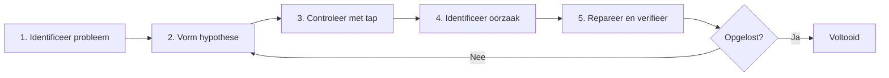

# Debugging-barrière

Wanneer je problemen tegenkomt in RxJS zoals **"waarden stromen niet", "waarden zijn anders dan verwacht", of "er kan een geheugenlek zijn"**, kost het tijd om deze op te lossen zonder de juiste debugging-methoden te kennen. Deze pagina legt uitgebreid RxJS-specifieke debugging-technieken uit.

## Basis RxJS Debugging-strategie

### 5 Stappen van Debugging



### Stap 1: Identificeer het Probleem

Verduidelijk eerst **wat het probleem is**.

| Symptoom | Mogelijke Oorzaken |
|---|---|
| Geen waarden stromen überhaupt | subscribe vergeten, geëindigd voor complete, uitgesloten door filter |
| Eerste waarde verschijnt niet | combineLatest initiële voorwaarde niet voldaan, BehaviorSubject niet ingesteld |
| Volgorde is verkeerd | mergeMap gebruiken, asynchrone timing |
| Dubbele waarden verschijnen | Meerdere subscribes zonder share, shareReplay misbruik |
| Geheugenlek | unsubscribe vergeten, shareReplay refCount: false |
| Waarden zijn vertraagd | debounceTime, throttleTime, asynchrone verwerking |

### Stap 2: Vorm een Hypothese

**Raad** de oorzaak van het probleem.

```typescript
// Voorbeeld: "waarden verschijnen niet" probleem
// Hypothese 1: Niet gesubscribed?
// Hypothese 2: complete/error te vroeg?
// Hypothese 3: Uitgesloten door filter?
// Hypothese 4: Duurt lang vanwege async?
```

### Stap 3: Controleer met tap

Voeg `tap` in bij elke fase om te bevestigen **wat er daadwerkelijk gebeurt**.

```typescript
import { of } from 'rxjs';
import { map, filter, tap } from 'rxjs';

of(1, 2, 3, 4, 5).pipe(
  tap(v => console.log('🔵 Invoer:', v)),
  filter(x => x > 10), // ❌ Allemaal uitgesloten
  tap(v => console.log('✅ Filter gepasseerd:', v)),
  map(x => x * 10),
  tap(v => console.log('🟢 Na map:', v))
).subscribe(result => {
  console.log('📦 Resultaat:', result);
});

// Output:
// 🔵 Invoer: 1
// 🔵 Invoer: 2
// 🔵 Invoer: 3
// 🔵 Invoer: 4
// 🔵 Invoer: 5
// (Geen filter gepasseerd → filter is de oorzaak)
```

## Veelvoorkomende Debugging-scenario's

### Scenario 1: Waarden Stromen Niet

#### Probleem 1-1: subscribe Vergeten

#### ❌ Slecht Voorbeeld: Niet gesubscribed
```typescript
import { of } from 'rxjs';
import { map } from 'rxjs';

const result$ = of(1, 2, 3).pipe(
  map(x => x * 10)
);

console.log('Voltooid'); // Output direct
// Geen waarden stromen naar result$ (omdat niet gesubscribed)
```

#### ✅ Goed Voorbeeld: Subscribe
```typescript
import { of } from 'rxjs';
import { map } from 'rxjs';

const result$ = of(1, 2, 3).pipe(
  map(x => x * 10)
);

result$.subscribe(value => {
  console.log('Waarde:', value);
});

console.log('Voltooid');

// Output:
// Waarde: 10
// Waarde: 20
// Waarde: 30
// Voltooid
```

> [!IMPORTANT] Controlepunt
> - Niets gebeurt alleen door een Observable te definiëren
> - **Moet subscriben**
> - Geen subscribe nodig bij gebruik van async pipe (Angular, etc.)

#### Probleem 1-2: complete/error Te Vroeg

#### ❌ Slecht Voorbeeld: complete komt eerst
```typescript
import { EMPTY } from 'rxjs';
import { map } from 'rxjs';

EMPTY.pipe( // ❌ Voltooit direct
  map(x => x * 10)
).subscribe({
  next: value => console.log('Waarde:', value),
  complete: () => console.log('Voltooid')
});

// Output:
// Voltooid
// (Geen waarden stromen)
```

#### ✅ Goed Voorbeeld: Controleer met tap
```typescript
import { EMPTY } from 'rxjs';
import { map, tap } from 'rxjs';

EMPTY.pipe(
  tap(() => console.log('👁️ Waarde aangekomen')), // Dit geeft geen output
  map(x => x * 10)
).subscribe({
  next: value => console.log('Waarde:', value),
  complete: () => console.log('Voltooid')
});

// Output:
// Voltooid
// (tap ook niet uitgevoerd → EMPTY is de oorzaak)
```

#### Probleem 1-3: Uitgesloten door filter

#### ❌ Slecht Voorbeeld: Allemaal onbewust uitgesloten
```typescript
import { of } from 'rxjs';
import { filter } from 'rxjs';

of(1, 2, 3, 4, 5).pipe(
  filter(x => x > 100) // ❌ Allemaal uitgesloten
).subscribe(value => {
  console.log('Waarde:', value); // Geen output
});
```

#### ✅ Goed Voorbeeld: Controleer met tap
```typescript
import { of } from 'rxjs';
import { filter, tap } from 'rxjs';

of(1, 2, 3, 4, 5).pipe(
  tap(v => console.log('Voor filter:', v)),
  filter(x => x > 100),
  tap(v => console.log('Na filter:', v)) // Geen output
).subscribe(value => {
  console.log('Waarde:', value);
});

// Output:
// Voor filter: 1
// Voor filter: 2
// Voor filter: 3
// Voor filter: 4
// Voor filter: 5
// (Geen na filter → filter is te streng)
```

### Scenario 2: Waarden Anders Dan Verwacht

#### Probleem 2-1: Typeconversie Fout

#### ❌ Slecht Voorbeeld: String en number verwarring
```typescript
import { of } from 'rxjs';
import { map } from 'rxjs';

const input = '5'; // String

of(input).pipe(
  map(x => x + 10) // ❌ '5' + 10 = '510' (string concatenatie)
).subscribe(result => {
  console.log('Resultaat:', result); // Resultaat: 510
  console.log('Type:', typeof result); // Type: string
});
```

#### ✅ Goed Voorbeeld: Controleer type met tap
```typescript
import { of } from 'rxjs';
import { map, tap } from 'rxjs';

const input = '5';

of(input).pipe(
  tap(x => console.log('Invoer:', x, typeof x)),
  map(x => Number(x)), // Converteer naar number
  tap(x => console.log('Na conversie:', x, typeof x)),
  map(x => x + 10)
).subscribe(result => {
  console.log('Resultaat:', result); // Resultaat: 15
});
```

#### Probleem 2-2: Asynchrone Volgorde

#### ❌ Slecht Voorbeeld: Volgorde verstoord met mergeMap
```typescript
import { of } from 'rxjs';
import { mergeMap, delay } from 'rxjs';

of(1, 2, 3).pipe(
  mergeMap(x =>
    of(x * 10).pipe(
      delay(Math.random() * 1000) // Willekeurige vertraging
    )
  )
).subscribe(value => {
  console.log('Waarde:', value);
});

// Voorbeeld output (volgorde niet gegarandeerd):
// Waarde: 20
// Waarde: 10
// Waarde: 30
```

#### ✅ Goed Voorbeeld: Garandeer volgorde met concatMap
```typescript
import { of } from 'rxjs';
import { concatMap, delay, tap } from 'rxjs';

of(1, 2, 3).pipe(
  tap(x => console.log('Invoer:', x)),
  concatMap(x =>
    of(x * 10).pipe(
      delay(Math.random() * 1000),
      tap(v => console.log('Voltooid:', v))
    )
  )
).subscribe(value => {
  console.log('Waarde:', value);
});

// Output (altijd deze volgorde):
// Invoer: 1
// Voltooid: 10
// Waarde: 10
// Invoer: 2
// Voltooid: 20
// Waarde: 20
// Invoer: 3
// Voltooid: 30
// Waarde: 30
```

### Scenario 3: Geheugenlekken Detecteren

#### Probleem 3-1: unsubscribe Vergeten

#### ❌ Slecht Voorbeeld: Niet unsubscriben
```typescript
import { interval } from 'rxjs';

class Component {
  ngOnInit() {
    interval(1000).subscribe(n => {
      console.log('Waarde:', n); // Loopt voor altijd
    });
  }

  ngOnDestroy() {
    // Niet unsubscriben → Geheugenlek
  }
}
```

#### ✅ Goed Voorbeeld: Automatisch vrijgeven met takeUntil
```typescript
import { interval, Subject } from 'rxjs';
import { takeUntil } from 'rxjs';

class Component {
  private destroy$ = new Subject<void>();

  ngOnInit() {
    interval(1000).pipe(
      takeUntil(this.destroy$)
    ).subscribe(n => {
      console.log('Waarde:', n);
    });
  }

  ngOnDestroy() {
    this.destroy$.next();
    this.destroy$.complete();
    console.log('Unsubscribe voltooid');
  }
}
```

#### Probleem 3-2: shareReplay Geheugenlek

#### ❌ Slecht Voorbeeld: Lek met refCount: false
```typescript
import { interval } from 'rxjs';
import { shareReplay, take, tap } from 'rxjs';

const data$ = interval(1000).pipe(
  take(100),
  tap(n => console.log('Genereer:', n)),
  shareReplay({ bufferSize: 1, refCount: false })
  // ❌ refCount: false → Loopt voor altijd
);

const sub = data$.subscribe(n => console.log('Subscribe 1:', n));

setTimeout(() => {
  sub.unsubscribe();
  console.log('Unsubscribed maar intern nog steeds aan het draaien');
}, 5000);
```

#### ✅ Goed Voorbeeld: Automatisch stoppen met refCount: true
```typescript
import { interval } from 'rxjs';
import { shareReplay, take, tap } from 'rxjs';

const data$ = interval(1000).pipe(
  take(100),
  tap(n => console.log('Genereer:', n)),
  shareReplay({ bufferSize: 1, refCount: true })
  // ✅ refCount: true → Stopt wanneer alle unsubscriben
);

const sub = data$.subscribe(n => console.log('Subscribe 1:', n));

setTimeout(() => {
  sub.unsubscribe();
  console.log('Unsubscribe → Stream stopt ook');
}, 5000);
```

## Debugging-tools en Technieken

### 1. Stapsgewijze Debugging met tap

```typescript
import { of } from 'rxjs';
import { map, filter, tap } from 'rxjs';

const debugTap = <T>(label: string, color: string = '🔵') =>
  tap<T>({
    next: value => console.log(`${color} [${label}] next:`, value),
    error: error => console.error(`❌ [${label}] error:`, error),
    complete: () => console.log(`✅ [${label}] complete`)
  });

of(1, 2, 3, 4, 5).pipe(
  debugTap('Invoer'),
  filter(x => x % 2 === 0),
  debugTap('Na filter', '🟢'),
  map(x => x * 10),
  debugTap('Na map', '🟡')
).subscribe({
  next: value => console.log('📦 Eindresultaat:', value),
  complete: () => console.log('🏁 Voltooid')
});
```

### 2. Aangepaste Debug Operator

```typescript
import { tap, timestamp, map } from 'rxjs';
import { MonoTypeOperatorFunction } from 'rxjs';

interface DebugOptions {
  label: string;
  showTimestamp?: boolean;
  showDiff?: boolean;
}

let lastTimestamp = 0;

function debug<T>(options: DebugOptions): MonoTypeOperatorFunction<T> {
  const { label, showTimestamp = true, showDiff = true } = options;

  return source => source.pipe(
    timestamp(),
    tap(({ value, timestamp }) => {
      const parts = [`[${label}]`, value];

      if (showTimestamp) {
        parts.push(`@${new Date(timestamp).toISOString()}`);
      }

      if (showDiff && lastTimestamp > 0) {
        const diff = timestamp - lastTimestamp;
        parts.push(`(+${diff}ms)`);
      }

      console.log(...parts);
      lastTimestamp = timestamp;
    }),
    map(({ value }) => value)
  );
}

// Gebruik
import { interval } from 'rxjs';
import { take } from 'rxjs';

interval(500).pipe(
  take(5),
  debug({ label: 'Timer' }),
  map(x => x * 10),
  debug({ label: 'Na conversie', showDiff: false })
).subscribe();
```

### 3. RxJS DevTools (Browser Extensie)

**Installatie:**
1. Zoek "RxJS DevTools" in Chrome/Edge Web Store
2. Voeg extensie toe
3. Open DevTools en klik op "RxJS" tab

**Belangrijkste Functies:**
- Monitor alle Observables in real-time
- Visualisatie met Marble Diagrams
- Volg subscribe/unsubscribe
- Prestatieanalyse

**Gebruiksvoorbeeld:**
```typescript
import { interval } from 'rxjs';
import { map, take } from 'rxjs';

// Automatisch gedetecteerd door DevTools
const timer$ = interval(1000).pipe(
  take(10),
  map(x => x * 2)
);

timer$.subscribe(value => console.log(value));
```

### 4. Fouten Debuggen

#### Identificeer Foutlocatie

```typescript
import { of, throwError } from 'rxjs';
import { map, catchError, tap } from 'rxjs';

of(1, 2, 3).pipe(
  tap(v => console.log('1. Invoer:', v)),
  map(x => {
    if (x === 2) {
      throw new Error('Kan 2 niet gebruiken');
    }
    return x * 10;
  }),
  tap(v => console.log('2. Na map:', v)), // Niet uitgevoerd bij fout
  catchError(error => {
    console.error('3. Fout opgevangen:', error.message);
    return of(-1); // Retourneer standaardwaarde
  }),
  tap(v => console.log('4. Na catchError:', v))
).subscribe({
  next: value => console.log('5. Resultaat:', value),
  error: error => console.error('Subscribe fout:', error),
  complete: () => console.log('6. Voltooid')
});

// Output:
// 1. Invoer: 1
// 2. Na map: 10
// 5. Resultaat: 10
// 1. Invoer: 2
// 3. Fout opgevangen: Kan 2 niet gebruiken
// 4. Na catchError: -1
// 5. Resultaat: -1
// 6. Voltooid
```

## Prestatie Debugging

### Probleem 1: Overmatige Herberekening

#### ❌ Slecht Voorbeeld: Frequente herberekening met combineLatest
```typescript
import { BehaviorSubject, combineLatest } from 'rxjs';
import { map } from 'rxjs';

const a$ = new BehaviorSubject(1);
const b$ = new BehaviorSubject(2);
const c$ = new BehaviorSubject(3);

combineLatest([a$, b$, c$]).pipe(
  map(([a, b, c]) => {
    console.log('Zware berekening uitgevoerd'); // Frequent uitgevoerd
    return a + b + c;
  })
).subscribe(result => console.log('Resultaat:', result));

// Frequente updates
setInterval(() => {
  a$.next(Math.random());
}, 100);
```

#### ✅ Goed Voorbeeld: Sluit duplicaten uit met distinctUntilChanged
```typescript
import { BehaviorSubject, combineLatest } from 'rxjs';
import { map, distinctUntilChanged } from 'rxjs';

const a$ = new BehaviorSubject(1);
const b$ = new BehaviorSubject(2);
const c$ = new BehaviorSubject(3);

combineLatest([a$, b$, c$]).pipe(
  map(([a, b, c]) => Math.floor(a) + Math.floor(b) + Math.floor(c)),
  distinctUntilChanged(), // Geef alleen door wanneer waarde verandert
  map(sum => {
    console.log('Zware berekening uitgevoerd'); // Alleen bij waardenverandering
    return sum * 2;
  })
).subscribe(result => console.log('Resultaat:', result));

setInterval(() => {
  a$.next(Math.random());
}, 100);
```

### Probleem 2: Monitor Geheugengebruik

```typescript
import { interval } from 'rxjs';
import { scan, tap } from 'rxjs';

let itemCount = 0;

interval(100).pipe(
  scan((acc, val) => {
    acc.push(val);
    itemCount = acc.length;
    return acc;
  }, [] as number[]),
  tap(() => {
    if (itemCount % 100 === 0) {
      console.log(`Aantal items: ${itemCount}`);
      if (itemCount > 10000) {
        console.warn('⚠️ Geheugengebruik te hoog');
      }
    }
  })
).subscribe();
```

### Probleem 3: Monitor Subscription Aantal

```typescript
import { Observable, Subject } from 'rxjs';

class MonitoredSubject<T> extends Subject<T> {
  private subscriptionCount = 0;

  subscribe(...args: any[]): any {
    this.subscriptionCount++;
    console.log(`Subscription aantal: ${this.subscriptionCount}`);

    const subscription = super.subscribe(...args);

    const originalUnsubscribe = subscription.unsubscribe.bind(subscription);
    subscription.unsubscribe = () => {
      this.subscriptionCount--;
      console.log(`Subscription aantal: ${this.subscriptionCount}`);
      originalUnsubscribe();
    };

    return subscription;
  }
}

// Gebruik
const data$ = new MonitoredSubject<number>();

const sub1 = data$.subscribe(v => console.log('Subscribe 1:', v));
const sub2 = data$.subscribe(v => console.log('Subscribe 2:', v));

sub1.unsubscribe();
sub2.unsubscribe();

// Output:
// Subscription aantal: 1
// Subscription aantal: 2
// Subscription aantal: 1
// Subscription aantal: 0
```

## Debugging Checklist

Wanneer een probleem optreedt, controleer het volgende in volgorde.

```markdown
## Basiscontrole
- [ ] `subscribe()` aanroepen?
- [ ] `complete` of `error` niet te vroeg?
- [ ] Waarden niet uitgesloten door `filter` of `take`?
- [ ] Wachten op voltooiing asynchrone verwerking?

## Timing Controle
- [ ] Begrip van synchroon/asynchroon?
- [ ] Impact van `delay`, `debounceTime`, `throttleTime` bevestigd?
- [ ] `combineLatest` initiële vuringvoorwaarde voldaan?

## Geheugen Controle
- [ ] `unsubscribe` of `takeUntil` gebruiken?
- [ ] `refCount: true` ingesteld voor `shareReplay`?
- [ ] Oneindige Observables correct begrensd?

## Prestatie Controle
- [ ] Overmatige herberekening niet aan het plaatsvinden? (overweeg `distinctUntilChanged`)
- [ ] Subscription aantal niet te hoog?
- [ ] Zware verwerking asynchroon gemaakt met `observeOn(asyncScheduler)`?
```

## Begrip Checklist

Controleer of je de volgende vragen kunt beantwoorden.

```markdown
## Basis Debugging
- [ ] Kan waardenstroom debuggen met tap
- [ ] Kan foutlocatie identificeren
- [ ] Kan complete/error timing bevestigen

## Tool Gebruik
- [ ] Ken basis RxJS DevTools gebruik
- [ ] Kan aangepaste debug operators maken
- [ ] Kan timing meten met timestamp

## Probleemoplossing
- [ ] Kan oorzaken identificeren van niet-stromende waarden
- [ ] Kan tekenen van geheugenlekken vinden
- [ ] Kan prestatieproblemen identificeren

## Preventie
- [ ] Heb gewoonte van stapsgewijze debugging met tap
- [ ] Implementeer correct foutafhandeling
- [ ] Ken maatregelen tegen geheugenlekken
```

## Volgende Stappen

Zodra je debugging-technieken begrijpt, integreer alle kennis die je hebt geleerd en bestudeer **praktische patronen**.

→ **Hoofdstuk 13: Praktische Patronen** (in voorbereiding) - Patronen voor praktisch gebruik

## Gerelateerde Pagina's

- **[Hoofdstuk 8: RxJS Debugging-technieken](/nl/guide/debugging/)** - Algemene debugging-technieken
- **[Hoofdstuk 9: Marble Testing](/nl/guide/testing/marble-testing)** - Debuggen met TestScheduler
- **[Begrip van Timing en Volgorde](/nl/guide/overcoming-difficulties/timing-and-order)** - Debuggen met tap
- **[Hoofdstuk 10: Veelgemaakte Fouten en Oplossingen](/nl/guide/anti-patterns/common-mistakes)** - Vermijden van anti-patronen

## 🎯 Oefeningen

### Probleem 1: Identificeren Waarom Waarden Niet Stromen

In de volgende code, identificeer waarom waarden niet worden uitgevoerd.

```typescript
import { Subject, combineLatest } from 'rxjs';

const a$ = new Subject<number>();
const b$ = new Subject<number>();

combineLatest([a$, b$]).subscribe(([a, b]) => {
  console.log('Waarden:', a, b);
});

a$.next(1);
console.log('Voltooid');
```

<details>
<summary>Oplossing</summary>

> [!NOTE] Oorzaak
> `combineLatest` vuurt niet totdat alle streams minstens één keer hebben uitgezonden
>
> Omdat `b$` nog geen waarde heeft uitgezonden, zal alleen `a$.next(1)` niet vuren.

#### Oplossingsmethode 1: Zend ook waarde naar b$
```typescript
import { Subject, combineLatest } from 'rxjs';

const a$ = new Subject<number>();
const b$ = new Subject<number>();

combineLatest([a$, b$]).subscribe(([a, b]) => {
  console.log('Waarden:', a, b);
});

a$.next(1);
b$.next(2); // ← Vuurt hier
console.log('Voltooid');

// Output:
// Waarden: 1 2
// Voltooid
```

#### Oplossingsmethode 2: Gebruik BehaviorSubject
```typescript
import { BehaviorSubject, combineLatest } from 'rxjs';

const a$ = new BehaviorSubject<number>(0); // Initiële waarde
const b$ = new BehaviorSubject<number>(0);

combineLatest([a$, b$]).subscribe(([a, b]) => {
  console.log('Waarden:', a, b);
});

// Output: Waarden: 0 0 (vuurt direct)

a$.next(1);
// Output: Waarden: 1 0
```

> [!NOTE] Debugging-techniek
> Het gebruik van tap om de waarden van elke stream te controleren toont waar het vastloopt.
> ```typescript
> a$.pipe(tap(v => console.log('a$:', v)))
> b$.pipe(tap(v => console.log('b$:', v)))
> ```

</details>

### Probleem 2: Geheugenlek Repareren

De volgende code heeft een geheugenlek. Repareer het.

```typescript
import { interval } from 'rxjs';
import { Component } from '@angular/core';

class MyComponent implements Component {
  ngOnInit() {
    interval(1000).subscribe(n => {
      console.log('Timer:', n);
    });
  }

  ngOnDestroy() {
    console.log('Destroy');
  }
}
```

<details>
<summary>Oplossing</summary>

> [!NOTE] Probleem
> Niet unsubscriben in `ngOnDestroy`, dus interval gaat door zelfs na vernietiging component

#### Oplossingsmethode 1: Bewaar Subscription en unsubscribe
```typescript
import { interval, Subscription } from 'rxjs';

class MyComponent {
  private subscription!: Subscription;

  ngOnInit() {
    this.subscription = interval(1000).subscribe(n => {
      console.log('Timer:', n);
    });
  }

  ngOnDestroy() {
    this.subscription.unsubscribe();
    console.log('Destroy & unsubscribe');
  }
}
```

#### Oplossingsmethode 2: Gebruik takeUntil (aanbevolen)
```typescript
import { interval, Subject } from 'rxjs';
import { takeUntil } from 'rxjs';

class MyComponent {
  private destroy$ = new Subject<void>();

  ngOnInit() {
    interval(1000).pipe(
      takeUntil(this.destroy$)
    ).subscribe(n => {
      console.log('Timer:', n);
    });
  }

  ngOnDestroy() {
    this.destroy$.next();
    this.destroy$.complete();
    console.log('Destroy & unsubscribe');
  }
}
```

> [!IMPORTANT] Belangrijke Punten
> - Oneindige Observables zoals interval vereisen altijd unsubscribe
> - takeUntil patroon wordt aanbevolen (kan meerdere subscriptions tegelijk beheren)
> - In Angular, zorgt gebruik van async pipe automatisch voor unsubscribe

</details>

### Probleem 3: Volgordeprobleem

In de volgende code, leg uit waarom volgorde niet gegarandeerd is en repareer het.

```typescript
import { from, of } from 'rxjs';
import { mergeMap, delay } from 'rxjs';

from([1, 2, 3]).pipe(
  mergeMap(x =>
    of(x).pipe(
      delay(Math.random() * 1000)
    )
  )
).subscribe(value => console.log(value));

// Voorbeeld output: 2, 1, 3 (volgorde niet gegarandeerd)
```

<details>
<summary>Oplossing</summary>

> [!NOTE] Probleem
> `mergeMap` voert parallel uit, dus voltooiingsvolgorde hangt af van uitvoertijd

#### Oplossingsmethode: Gebruik concatMap
```typescript
import { from, of } from 'rxjs';
import { concatMap, delay, tap } from 'rxjs';

from([1, 2, 3]).pipe(
  tap(x => console.log('Start:', x)),
  concatMap(x =>
    of(x).pipe(
      delay(Math.random() * 1000),
      tap(v => console.log('Voltooid:', v))
    )
  )
).subscribe(value => console.log('Resultaat:', value));

// Output (altijd deze volgorde):
// Start: 1
// Voltooid: 1
// Resultaat: 1
// Start: 2
// Voltooid: 2
// Resultaat: 2
// Start: 3
// Voltooid: 3
// Resultaat: 3
```

> [!NOTE] Reden
> - **mergeMap**: Parallelle uitvoering, voltooiingsvolgorde niet gegarandeerd
> - **concatMap**: Sequentiële uitvoering, altijd output in dezelfde volgorde als invoer
> - **switchMap**: Alleen laatste, oude verwerking wordt geannuleerd
> - **exhaustMap**: Negeer nieuwe verwerking tijdens uitvoering

#### Vergelijking met Marble Diagram
```
Invoer:  --1--2--3----|

mergeMap:  --2--1--3--|  (voltooiingsvolgorde)
concatMap: --1--2--3-| (invoervolgorde)
```

</details>

### Probleem 4: Prestatieverbetering

De volgende code heeft frequente herberekening. Verbeter de prestatie.

```typescript
import { fromEvent } from 'rxjs';
import { map } from 'rxjs';

const input = document.querySelector('input')!;

fromEvent(input, 'input').pipe(
  map(e => (e.target as HTMLInputElement).value),
  map(value => {
    console.log('Zware berekening uitgevoerd');
    return value.toUpperCase();
  })
).subscribe(result => console.log(result));

// Gebruiker typt "hello"
// Zware berekening uitgevoerd (h)
// Zware berekening uitgevoerd (he)
// Zware berekening uitgevoerd (hel)
// Zware berekening uitgevoerd (hell)
// Zware berekening uitgevoerd (hello)
```

<details>
<summary>Oplossing</summary>

#### Verbeteringsmethode 1: Wacht op invoervoltooiing met debounceTime
```typescript
import { fromEvent } from 'rxjs';
import { map, debounceTime } from 'rxjs';

const input = document.querySelector('input')!;

fromEvent(input, 'input').pipe(
  debounceTime(300), // Voer uit als geen invoer voor 300ms
  map(e => (e.target as HTMLInputElement).value),
  map(value => {
    console.log('Zware berekening uitgevoerd');
    return value.toUpperCase();
  })
).subscribe(result => console.log(result));

// Typ "hello" en wacht 300ms, voert slechts één keer uit
```

#### Verbeteringsmethode 2: Sluit duplicaten uit met distinctUntilChanged
```typescript
import { fromEvent } from 'rxjs';
import { map, debounceTime, distinctUntilChanged } from 'rxjs';

const input = document.querySelector('input')!;

fromEvent(input, 'input').pipe(
  debounceTime(300),
  map(e => (e.target as HTMLInputElement).value),
  distinctUntilChanged(), // Negeer als hetzelfde als vorige waarde
  map(value => {
    console.log('Zware berekening uitgevoerd');
    return value.toUpperCase();
  })
).subscribe(result => console.log(result));
```

> [!TIP] Prestatieverbetering Technieken
> - **debounceTime**: Wacht op invoervoltooiing
> - **throttleTime**: Dun uit met regelmatige intervallen
> - **distinctUntilChanged**: Sluit duplicaten uit
> - **observeOn(asyncScheduler)**: Maak zware verwerking asynchroon
> - **shareReplay**: Cache resultaten

</details>
