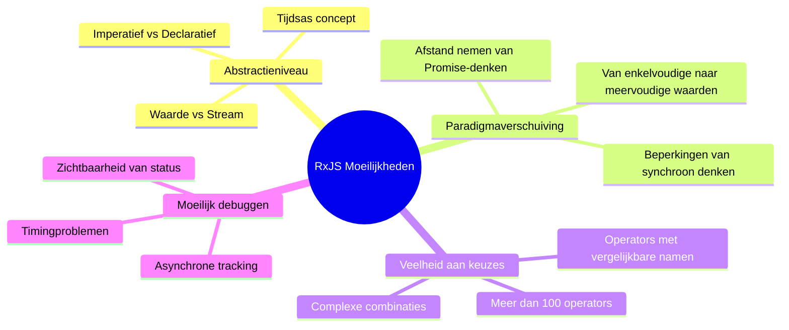
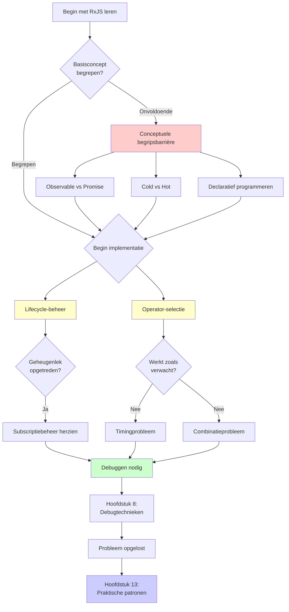
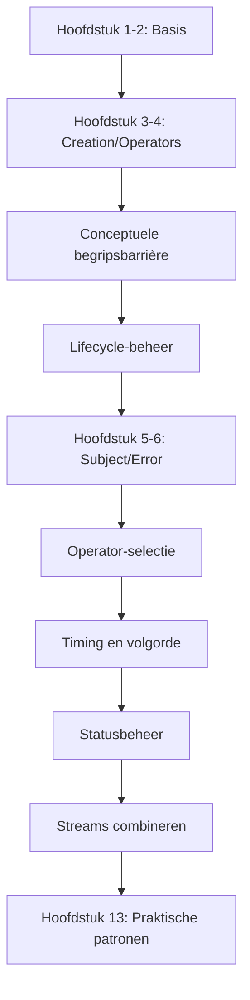
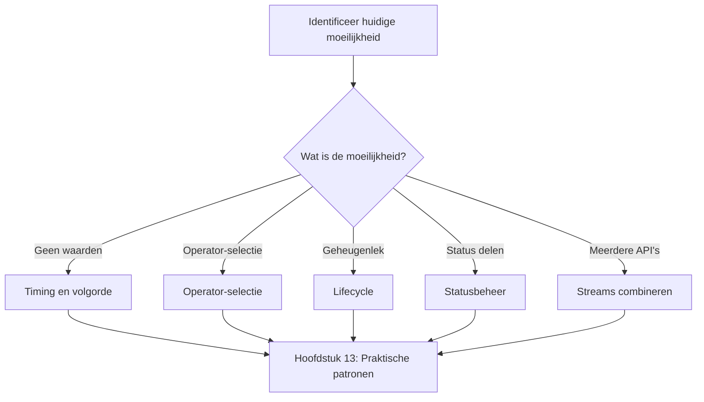
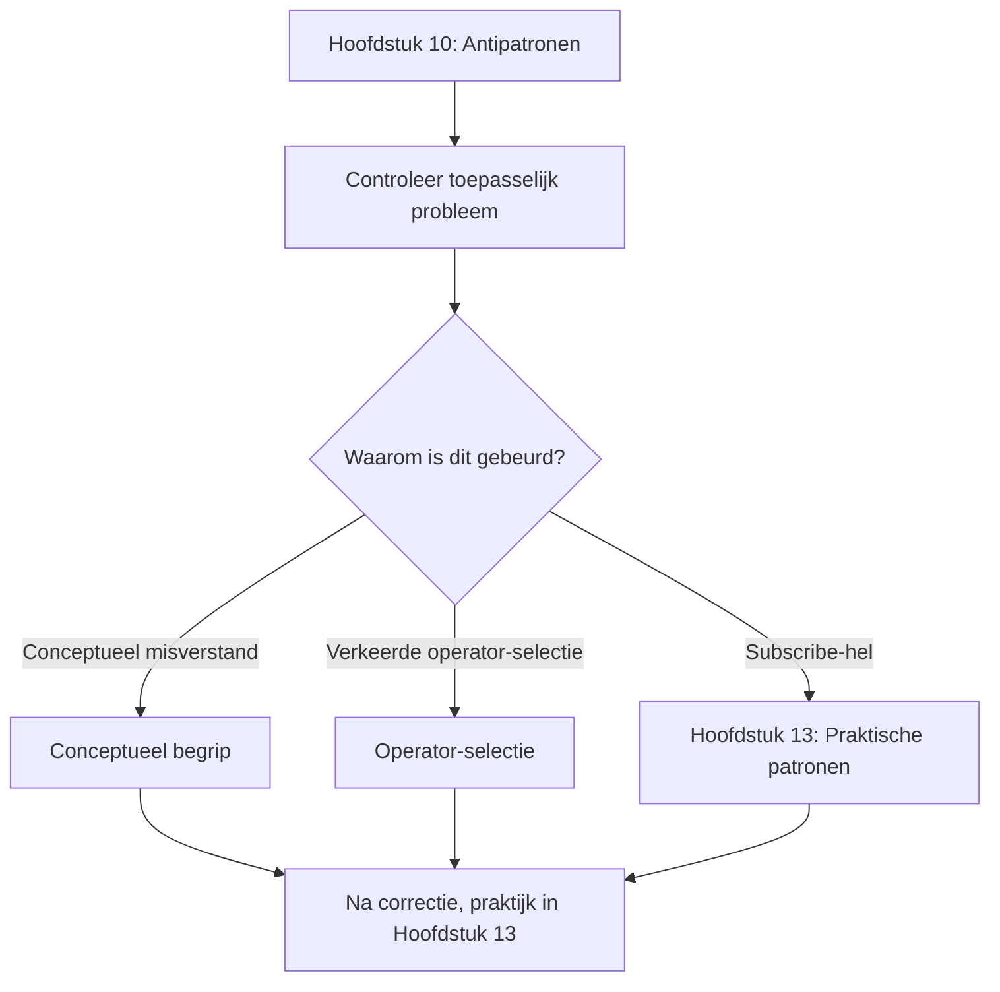

# RxJS Moeilijkheden Overwinnen

Zelfs ontwikkelaars met TypeScript en professionele ervaring ervaring stuiten op veel moeilijkheden bij het praktisch toepassen van RxJS. In dit gedeelte worden RxJS-specifieke uitdagingen en hoe deze te overwinnen systematisch uitgelegd.

## Waarom is RxJS moeilijk?

De moeilijkheid van RxJS ligt in de **hoge mate van abstractie van concepten** en de **noodzaak van een paradigmaverschuiving**. Zelfs ervaren ontwikkelaars raken in verwarring wanneer hun bestaande kennis en denkpatronen niet meer werken. Laten we de specifieke moeilijkheidspunten bekijken.

### Bestaande kennis werkt niet

Ontwikkelaars die gewend zijn aan Promise of Async/Await raken in de war wanneer ze RxJS op dezelfde manier proberen te gebruiken.

```typescript
// ❌ Promise-achtig denken: waarde direct ophalen
observable.subscribe(value => {
  const result = value * 2;
  return result; // Dit retourneert niets
});

// ✅ RxJS-achtig denken: stream transformeren
const doubled$ = observable.pipe(
  map(value => value * 2)
);
```

> [!IMPORTANT] Probleem
> - Imperatief programmeerdenken (Promise then/await) werkt niet
> - Je moet denken in "streamtransformatie" in plaats van waarden
> - Als je de verwerking binnen subscribe probeert af te ronden, kom je in een antipatroon terecht

### Tijdsas concept wordt toegevoegd

Het belangrijkste kenmerk van RxJS is het concept van een "tijdsas". Promise retourneert slechts één keer een waarde, maar Observable kan meerdere waarden laten stromen over tijd.

```typescript
// Promise: retourneert slechts één keer een waarde
const promise = fetch('/api/data');

// Observable: meerdere waarden stromen langs de tijdsas
const clicks$ = fromEvent(button, 'click');
//                     tijdsas
// clicks$:  ------click----click--click---------->
```

> [!IMPORTANT] Probleem
> - Je moet constant bewust zijn van "wanneer waarden stromen"
> - Synchrone/asynchrone verschillen beïnvloeden het gedrag
> - Marble Diagram lezen wordt essentieel

### Kiezen uit meer dan 100 operators

RxJS heeft meer dan 100 operators, en beginners twijfelen bij het kiezen. Er zijn veel operators met vergelijkbare namen, waardoor het moeilijk is om te bepalen welke je moet gebruiken.

> [!IMPORTANT] Veelvoorkomende zorgen
> - "map, mergeMap, switchMap, concatMap... Ik begrijp het verschil niet"
> - "debounceTime of throttleTime, welke moet ik gebruiken?"
> - "combineLatest en zip, wat is het verschil?"

→ Hoofdstuk 11 biedt **praktische selectiecriteria**.

### Het complete beeld van RxJS moeilijkheden

Het volgende diagram toont uit welke elementen de moeilijkheid van RxJS bestaat.



## Overzicht van belangrijkste moeilijkheden

We hebben de belangrijkste moeilijkheden in RxJS leren en praktijk geclassificeerd in 7 categorieën. Elke moeilijkheid heeft een eigen pagina met gedetailleerde uitleg over specifieke oplossingen. Identificeer eerst de moeilijkheid waarmee je wordt geconfronteerd in de onderstaande tabel.

| Moeilijkheid | Inhoud | Veelvoorkomende symptomen |
|---|---|---|
| **[Conceptueel begrip](/nl/guide/overcoming-difficulties/conceptual-understanding)** | Observable vs Promise, Cold vs Hot | "Wat is het verschil met Promise?" |
| **[Lifecycle-beheer](/nl/guide/overcoming-difficulties/lifecycle-management)** | subscribe/unsubscribe, geheugenlekken | "Wanneer moet ik unsubscribe doen?" |
| **[Operator-selectie](/nl/guide/overcoming-difficulties/operator-selection)** | Criteria om te kiezen uit 100+ operators | "Welke operator moet ik gebruiken?" |
| **[Timing en volgorde](/nl/guide/overcoming-difficulties/timing-and-order)** | Wanneer waarden stromen, synchroon vs asynchroon | "Waarom komt er geen waarde uit?" |
| **[Statusbeheer](/nl/guide/overcoming-difficulties/state-and-sharing)** | Subject, share/shareReplay | "Ik wil status delen" |
| **[Meerdere streams combineren](/nl/guide/overcoming-difficulties/stream-combination)** | combineLatest, zip, withLatestFrom | "Ik wil de resultaten van twee API's combineren" |
| **[Debuggen](/nl/guide/overcoming-difficulties/debugging-guide)** | Geen waarden, onverwachte waarden | "Ik begrijp niet wat er gebeurt" |

### Relaties tussen moeilijkheden

RxJS moeilijkheden zijn niet onafhankelijk, maar onderling gerelateerd. Het volgende flowchart toont in welke volgorde je moeilijkheden tegenkomt tijdens het leerproces en hoe deze met elkaar verbonden zijn. Controleer in welke fase je je nu bevindt.



## Hoe de secties te gebruiken

De artikelen in dit hoofdstuk kunnen onafhankelijk worden gelezen. Begin met de sectie die je nodig hebt, afhankelijk van de inhoud waarmee je worstelt. Hieronder wordt uitgelegd hoe je deze effectief kunt gebruiken.

### 1. Identificeer je moeilijkheid

Selecteer uit de bovenstaande tabel de sectie die overeenkomt met de **moeilijkheid waarmee je momenteel wordt geconfronteerd**. Je kunt ook omgekeerd zoeken op basis van de symptomen van de moeilijkheid.

#### Voorbeelden
- Geen waarde krijgen van API-aanroep → [Timing en volgorde](/nl/guide/overcoming-difficulties/timing-and-order)
- Zorgen over geheugenlekken → [Lifecycle-beheer](/nl/guide/overcoming-difficulties/lifecycle-management)
- Twijfelen tussen mergeMap en switchMap → [Operator-selectie](/nl/guide/overcoming-difficulties/operator-selection)
- Status delen tussen meerdere componenten → [Statusbeheer](/nl/guide/overcoming-difficulties/state-and-sharing)
- Resultaten van twee API's combineren → [Meerdere streams combineren](/nl/guide/overcoming-difficulties/stream-combination)
- Weet niet hoe te debuggen → [Debuggen](/nl/guide/overcoming-difficulties/debugging-guide)

### 2. Begrijpen via slecht voorbeeld → goed voorbeeld

Elke sectie heeft de volgende structuur.

```
❌ Slecht voorbeeld (veelvoorkomend patroon)
↓
✅ Goed voorbeeld (aanbevolen patroon)
↓
💡 Uitleg (waarom slecht, waarom goed)
↓
🎯 Oefeningen (begripscontrole)
```

### 3. Experimenteren met Starter Kit

Alle codevoorbeelden kunnen worden uitgevoerd in de [leeromgeving](/nl/guide/starter-kid).

#### Aanbevolen leerproces
1. Kopieer het slechte voorbeeld en voer het uit → Ervaar het probleem
2. Kopieer het goede voorbeeld en voer het uit → Voel het verschil
3. Pas toe op je eigen code → Consolidatie

## Leerwegwijzer

De manier van leren verschilt afhankelijk van je huidige vaardigheidsniveau en doel. Kies uit de volgende 3 patronen de wegwijzer die bij je past.

### RxJS voor het eerst leren

Een systematische aanpak waarbij je vanaf de basis leert en de moeilijkheden overwint die je in elk hoofdstuk tegenkomt.



### Basis begrepen maar problemen in de praktijk

Als je basiskennis hebt maar problemen ondervindt in echte projecten, is het efficiënter om direct naar de moeilijkheden te gaan.



### In antipatroon gevallen

Als je al RxJS-code schrijft maar vermoedt dat je in een antipatroon bent gevallen, begin dan met het identificeren van het probleem in Hoofdstuk 10 en begrijp de moeilijkheid die de oorzaak was.



## Gerelateerde secties

Hoofdstuk 11 (RxJS Moeilijkheden Overwinnen) werkt samen met andere hoofdstukken om het leereffect te vergroten. Vooral de volgende 3 hoofdstukken zijn nauw verwant, en het samen lezen verdiept het begrip.

- **[Hoofdstuk 10: RxJS Antipatronen](/nl/guide/anti-patterns/)** - Leer "wat is slecht"
- **[Hoofdstuk 13: Praktische patronen](/nl/guide/)** - Leer "hoe het moet" (in voorbereiding)
- **[Hoofdstuk 8: RxJS Debugtechnieken](/nl/guide/debugging/)** - Leer "hoe problemen te vinden"

#### Leerproces
1. **Hoofdstuk 11 (dit hoofdstuk)** - Begrijp RxJS moeilijkheden
2. **Hoofdstuk 10** - Ken specifieke antipatronen
3. **Hoofdstuk 13** - Beheers correcte implementatiepatronen

## Begripschecklist

Een checklist om je begrip te controleren na het leren van elke sectie. Als je alle items kunt afvinken, heb je het niveau bereikt om de inhoud van die sectie in de praktijk te kunnen toepassen.

```markdown
## Conceptueel begrip
- [ ] Kan het verschil tussen Observable en Promise uitleggen
- [ ] Kan het verschil tussen Cold en Hot uitleggen met voorbeelden
- [ ] Begrijpt de voordelen van declaratief programmeren

## Praktische vaardigheden
- [ ] Kan subscribe/unsubscribe op het juiste moment doen
- [ ] Kan een operator selecteren die past bij het doel
- [ ] Kan Marble Diagram lezen en gedrag voorspellen

## Debuggen
- [ ] Kan streams debuggen met tap
- [ ] Kan de oorzaak van geen waarden identificeren
- [ ] Kan tekenen van geheugenlekken vinden
```

## Volgende stappen

Nu je het complete beeld van RxJS moeilijkheden hebt begrepen, ga dan naar specifiek leren.

**Eerste te lezen pagina:**

→ **[Conceptuele begripsbarrière](/nl/guide/overcoming-difficulties/conceptual-understanding)** - Begrijp de essentie van RxJS denken

Deze pagina richt zich op "conceptueel begrip" dat aan de basis ligt van alle moeilijkheden. Door hier te beginnen, kun je andere moeilijkheden soepel begrijpen. Na het begrijpen van het concept, ga je naar de pagina van de specifieke moeilijkheid waarmee je wordt geconfronteerd.
