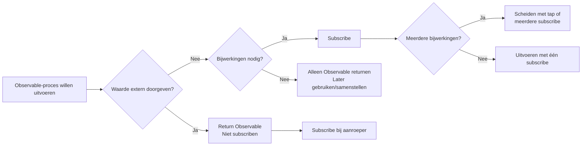
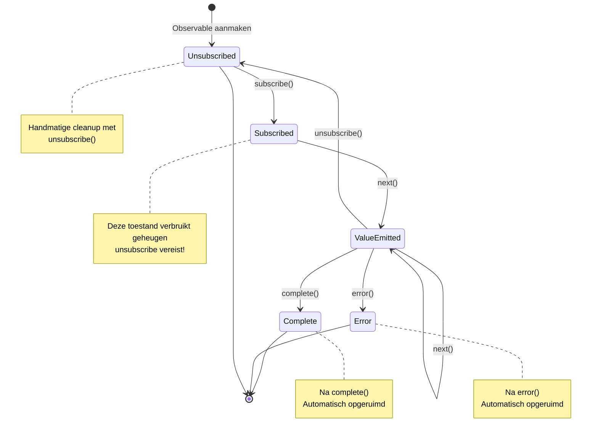
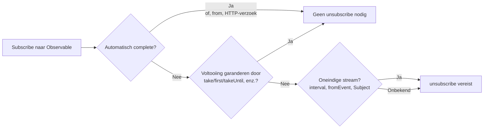

# Barrières voor Lifecycle Management

Een van de grootste valkuilen van RxJS is **Lifecycle Management**. Fouten in "wanneer te subscriben" en "wanneer te unsubscriben" kunnen leiden tot geheugenlekken en bugs.

## Wanneer te Subscriben

### Basisprincipe: Subscribe Pas op het Laatste Moment

#### ❌ Slecht Voorbeeld: Subscribe in het Midden

```typescript
import { interval } from 'rxjs';

function getEvenNumbers() {
  const numbers$ = interval(1000);

  // subscribe hier
  numbers$.subscribe(n => {
    if (n % 2 === 0) {
      console.log(n); // hoe geven we dit extern door?
    }
  });
}
```

#### ✅ Goed Voorbeeld: Return Observable, Subscribe bij Aanroeper

```typescript
import { interval } from 'rxjs';
import { filter, take } from 'rxjs';

function getEvenNumbers() {
  return interval(1000).pipe(
    filter(n => n % 2 === 0),
    take(5)
  );
}

// subscribe aan de gebruikerskant
const subscription = getEvenNumbers().subscribe(n => {
  console.log(n);
});
```

::: tip 💡 Uitleg
- **Slecht voorbeeld**: subscribe in een functie verliest controle (kan niet annuleren, kan niet samenstellen)
- **Goed voorbeeld**: return Observable, aanroeper kan controleren
:::

### Subscribe Triggert "Bijwerkingen"

#### ❌ Slecht Voorbeeld: Meerdere Bijwerkingen in Subscribe

```typescript
import { fromEvent } from 'rxjs';
import { map } from 'rxjs';

const button = document.querySelector('button')!;

fromEvent(button, 'click')
  .pipe(map(() => Math.random()))
  .subscribe(randomValue => {
    // Bijwerking 1: DOM-manipulatie
    document.querySelector('#result')!.textContent = randomValue.toString();

    // Bijwerking 2: API-aanroep
    fetch('/api/log', {
      method: 'POST',
      body: JSON.stringify({ value: randomValue })
    });

    // Bijwerking 3: Lokale opslag
    localStorage.setItem('lastValue', randomValue.toString());
  });
```

#### ✅ Goed Voorbeeld: Isoleer Bijwerkingen en Subscribe Alleen naar Wat U Nodig Hebt

```typescript
import { fromEvent } from 'rxjs';
import { map } from 'rxjs';

const button = document.querySelector('button')!;

const randomClicks$ = fromEvent(button, 'click').pipe(
  map(() => Math.random())
);

// als alleen DOM-updates nodig zijn
randomClicks$.subscribe(value => {
  document.querySelector('#result')!.textContent = value.toString();
});

// Als alleen logging vereist is
randomClicks$.subscribe(value => {
  fetch('/api/log', {
    method: 'POST',
    body: JSON.stringify({ value })
  });
});
```

::: tip 💡 Uitleg
- **subscribe = uitvoeringspunt van bijwerking**
- **Als bijwerkingen onafhankelijk zijn**: splits in meerdere subscribe (kunnen individueel worden gecontroleerd)
- **Als bijwerkingen altijd als set worden uitgevoerd**: OK om ze samen te groeperen in één subscribe
- **Als bijwerkingen nodig zijn in de pipeline**: gebruik `tap` operator
:::

### Wanneer te Subscriben: Beslissingsstroomdiagram



### De Volledige Lifecycle van een Subscription

Het volgende toestandsovergangsdiagram toont de toestanden die een Observable subscription doorloopt en waarin het eindigt.



> [!IMPORTANT] Belangrijke Punten voor Lifecycle Management
> - **Subscribed**: Toestand met risico op geheugenlek
> - **complete/error**: Automatische cleanup (geen unsubscribe vereist)
> - **unsubscribe**: Handmatige cleanup vereist (vooral voor oneindige streams)

## Wanneer Moet Ik Unsubscriben?

### Basisprincipe: Altijd Unsubscriben Nadat U Hebt Gesubscribed

#### ❌ Slecht Voorbeeld: Niet Unsubscriben → Geheugenlek

```typescript
import { interval } from 'rxjs';

const button = document.querySelector('button')!;

function startTimer() {
  interval(1000).subscribe(n => {
    console.log(n);
  });
  // Deze subscription duurt voor altijd!
}

// bij elke knopclik wordt een nieuwe subscription toegevoegd
button.addEventListener('click', startTimer);
// 10 kliks = 10 subscriptions die tegelijkertijd draaien!
```

#### ✅ Goed Voorbeeld: Unsubscribe met unsubscribe

```typescript
import { interval } from 'rxjs';

function startTimer() {
  const subscription = interval(1000).subscribe(n => {
    console.log(n);
  });

  // Unsubscribe na 5 seconden
  setTimeout(() => {
    subscription.unsubscribe();
    console.log('Unsubscribed');
  }, 5000);
}
```

::: tip 💡 Uitleg
- **Oneindige streams** (interval, fromEvent, enz.) moeten unsubscribe
- Als niet unsubscribe, gaan geheugenlekkage + onnodige verwerking door
:::

### Gevallen Waarin Unsubscribe Niet Nodig Is

#### ✅ Observable die Automatisch Complete

```typescript
of(1, 2, 3).subscribe(n => console.log(n));
// automatisch opgeruimd na complete

from([1, 2, 3]).subscribe(n => console.log(n));
// automatisch opgeruimd na complete
```

#### ✅ Voltooiing Gegarandeerd door take, enz.

```typescript
interval(1000).pipe(
  take(5) // automatisch complete na 5 keer
).subscribe(n => console.log(n));
```

#### ✅ Afsluiten met Error

```typescript
throwError(() => new Error('Error')).subscribe({
  error: err => console.error(err)
});
```

#### ✅ EMPTY (Onmiddellijk Complete)

```typescript
EMPTY.subscribe(() => console.log('not executed'));
```

> [!TIP] 💡 Uitleg
> unsubscribe is niet vereist als:
> 1. **Observable** aangeroepen door **complete()** - automatisch opgeruimd
> 2. **error() wordt aangeroepen** - ook automatisch opgeruimd
> 3. **Gegarandeerde voltooiing door take(n), enz.** - expliciet complete
> > [!IMPORTANT] Belangrijk
> > Oneindige streams (interval, fromEvent, Subject, enz.) moeten unsubscribe!

### Stroomdiagram voor het Bepalen of Unsubscribe Vereist Is



**Bij twijfel is het veilig om te unsubscriben**!

## Patronen om Geheugenlekken te Voorkomen

### Patroon 1: Beheerd door Subscription Object

```typescript
import { interval, fromEvent } from 'rxjs';
import { Subscription } from 'rxjs';

class MyComponent {
  private subscription = new Subscription();

  ngOnInit() {
    // Voeg meerdere subscriptions toe aan één Subscription
    this.subscription.add(
      interval(1000).subscribe(n => console.log('Timer:', n))
    );

    this.subscription.add(
      fromEvent(document, 'click').subscribe(() => console.log('Click!'))
    );

    this.subscription.add(
      fromEvent(window, 'resize').subscribe(() => console.log('Resize!'))
    );
  }

  ngOnDestroy() {
    // Unsubscribe alle subscriptions in één keer
    this.subscription.unsubscribe();
  }
}
```

#### 💡 Voordelen

- Beheer meerdere subscriptions met één object
- Bulkannulering met `ngOnDestroy`
- Gemakkelijk toe te voegen en te verwijderen

### Patroon 2: Beheer via Array

```typescript
import { interval, fromEvent } from 'rxjs';
import { Subscription } from 'rxjs';

class MyComponent {
  private subscriptions: Subscription[] = [];

  ngOnInit() {
    this.subscriptions.push(
      interval(1000).subscribe(n => console.log('Timer:', n))
    );

    this.subscriptions.push(
      fromEvent(document, 'click').subscribe(() => console.log('Click!'))
    );
  }

  ngOnDestroy() {
    this.subscriptions.forEach(sub => sub.unsubscribe());
    this.subscriptions = [];
  }
}
```

#### 💡 Voordelen

- Flexibel beheer met array-bewerkingen
- Kan ook individueel worden gedeactiveerd
- Gemakkelijk te debuggen (controleer array in console.log)

### Patroon 3: takeUntil Patroon (Aanbevolen)

```typescript
import { interval, fromEvent, Subject } from 'rxjs';
import { takeUntil } from 'rxjs';

class MyComponent {
  private destroy$ = new Subject<void>();

  ngOnInit() {
    // voeg takeUntil(this.destroy$) toe aan alle subscriptions
    interval(1000).pipe(
      takeUntil(this.destroy$)
    ).subscribe(n => console.log('Timer:', n));

    fromEvent(document, 'click').pipe(
      takeUntil(this.destroy$)
    ).subscribe(() => console.log('Click!'));

    fromEvent(window, 'resize').pipe(
      takeUntil(this.destroy$)
    ).subscribe(() => console.log('Resize!'));
  }

  ngOnDestroy() {
    // Unsubscribe alles in één next()
    this.destroy$.next();
    this.destroy$.complete();
  }
}
```

#### 💡 Voordelen

- **Meest declaratief** - pipeline maakt voltooiingsvoorwaarden expliciet
- **Geen Subscription object vereist** - geheugenefficiënt
- **Gemakkelijkst te lezen** - code zegt "complete met destroy$"

## Volledige Gids voor het takeUntil Patroon

### Basispatroon

```typescript
import { interval, Subject } from 'rxjs';
import { takeUntil } from 'rxjs';

const destroy$ = new Subject<void>();

// deze subscription gaat door totdat destroy$ next() doet
interval(1000).pipe(
  takeUntil(destroy$)
).subscribe(n => console.log(n));

// Stop alle subscriptions na 5 seconden
setTimeout(() => {
  destroy$.next();
  destroy$.complete();
}, 5000);
```

#### Marble Diagram

```
interval(1000):  --0--1--2--3--4--5--6--7-->
destroy$:        ----------X
                          ↑
                       next() aanroep

takeUntil resultaat:   --0--1--2|
                          ↑
                       complete
```

### Toepassen op Meerdere Observables

```typescript
import { interval, fromEvent, timer, Subject } from 'rxjs';
import { takeUntil, map } from 'rxjs';

const destroy$ = new Subject<void>();

// Patroon: gebruik dezelfde destroy$ voor alle streams
interval(1000).pipe(
  takeUntil(destroy$),
  map(n => `Timer: ${n}`)
).subscribe(console.log);

fromEvent(document, 'click').pipe(
  takeUntil(destroy$),
  map(() => 'Click!')
).subscribe(console.log);

timer(2000).pipe(
  takeUntil(destroy$),
  map(() => 'Timer voltooid')
).subscribe(console.log);

// batch stop
function cleanup() {
  destroy$.next();
  destroy$.complete();
}

// Voorbeeld: roep cleanup() aan bij paginaovergang
window.addEventListener('beforeunload', cleanup);
```

## Veelgemaakte Fouten in het takeUntil Patroon

### Fout 1: takeUntil Staat op de Verkeerde Positie

#### ❌ Slecht Voorbeeld: map Vóór takeUntil

```typescript
import { interval, Subject } from 'rxjs';
import { map, takeUntil } from 'rxjs';

const destroy$ = new Subject<void>();

interval(1000).pipe(
  takeUntil(destroy$),  // als complete hier...
  map(n => n * 2)       // map kan worden uitgevoerd
).subscribe(console.log);
```

#### ✅ Goed Voorbeeld: takeUntil Als Laatste Geplaatst

```typescript
import { interval, Subject } from 'rxjs';
import { map, takeUntil } from 'rxjs';

const destroy$ = new Subject<void>();

interval(1000).pipe(
  map(n => n * 2),
  takeUntil(destroy$)  // na alle operators
).subscribe(console.log);
```

> [!TIP] 💡 Uitleg
> - **takeUntil wordt als laatste** geplaatst indien mogelijk
> - Uitzondering: soms geplaatst vóór multicast operators zoals shareReplay

### Fout 2: Destroy$ Niet Completen

#### ❌ Slecht Voorbeeld: complete() Niet Aanroepen

```typescript
import { Subject } from 'rxjs';

const destroy$ = new Subject<void>();

function cleanup() {
  destroy$.next();
  // ❌ roep complete() niet aan
}

// Probleem: destroy$ zelf veroorzaakt een geheugenlek
```

#### ✅ Goed Voorbeeld: Roep Zowel next() als complete() Aan

```typescript
import { Subject } from 'rxjs';

const destroy$ = new Subject<void>();

function cleanup() {
  destroy$.next();
  destroy$.complete();
}
```

> [!TIP] 💡 Uitleg
> - Als alleen `next()` wordt gebruikt, blijft destroy$ zelf gesubscribed
> - **Roep altijd ook `complete()` aan**

### Fout 3: Proberen te Hergebruiken

#### ❌ Slecht Voorbeeld: Een Voltooid Subject Hergebruiken

```typescript
import { interval, Subject } from 'rxjs';
import { takeUntil } from 'rxjs';

const destroy$ = new Subject<void>();

function start() {
  interval(1000).pipe(
    takeUntil(destroy$)
  ).subscribe(console.log);
}

function stop() {
  destroy$.next();
  destroy$.complete();
}

start();
setTimeout(stop, 3000);

// ❌ Probleem: destroy$ is al complete, dus start() opnieuw zal onmiddellijk eindigen
setTimeout(start, 5000); // dit werkt niet
```

#### ✅ Goed Voorbeeld: Regenereer destroy$

```typescript
import { interval, Subject } from 'rxjs';
import { takeUntil } from 'rxjs';

class MyComponent {
  private destroy$ = new Subject<void>();

  start() {
    // regenereer als al voltooid
    if (this.destroy$.closed) {
      this.destroy$ = new Subject<void>();
    }

    interval(1000).pipe(
      takeUntil(this.destroy$)
    ).subscribe(console.log);
  }

  stop() {
    this.destroy$.next();
    this.destroy$.complete();
  }
}
```

> [!TIP] 💡 Uitleg
> - **Subject kan niet worden hergebruikt zodra complete**
> - Als het opnieuw moet worden geopend, maak een nieuw Subject aan

## Best Practices voor Subscription Management

### Best Practice 1: Heb destroy$ Per Component/Class

```typescript
import { Subject } from 'rxjs';
import { takeUntil } from 'rxjs';

class UserProfileComponent {
  private destroy$ = new Subject<void>();

  constructor(private userService: UserService) {}

  ngOnInit() {
    this.userService.getUser().pipe(
      takeUntil(this.destroy$)
    ).subscribe(user => {
      console.log(user);
    });

    this.userService.getUserPosts().pipe(
      takeUntil(this.destroy$)
    ).subscribe(posts => {
      console.log(posts);
    });
  }

  ngOnDestroy() {
    this.destroy$.next();
    this.destroy$.complete();
  }
}
```

#### 💡 Voordelen

- **Consistentie** - zelfde patroon in alle componenten
- **Onderhoudbaarheid** - geen ngOnDestroy-wijzigingen bij toevoegen van nieuwe subscriptions
- **Veiligheid** - geen unsubscribe-lekken

### Best Practice 2: Maak Gebruik van AsyncPipe (voor Angular)

```typescript
import { Component } from '@angular/core';
import { Observable } from 'rxjs';

@Component({
  selector: 'app-user-profile',
  template: `
    <!-- AsyncPipe subscribe/unsubscribe automatisch -->
    <div *ngIf="user$ | async as user">
      <h1>{{ user.name }}</h1>
      <p>{{ user.email }}</p>
    </div>

    <ul>
      <li *ngFor="let post of posts$ | async">
        {{ post.title }}
      </li>
    </ul>
  `
})
export class UserProfileComponent {
  user$: Observable<User>;
  posts$: Observable<Post[]>;

  constructor(private userService: UserService) {
    // geef de Observable direct door aan de template
    this.user$ = this.userService.getUser();
    this.posts$ = this.userService.getUserPosts();

    // Geen ngOnDestroy vereist! AsyncPipe zal het automatisch vrijgeven
  }
}
```

#### 💡 Voordelen

- **Automatisch unsubscriben** - unsubscribet automatisch wanneer component wordt vernietigd
- **OnPush-ondersteuning** - geoptimaliseerde change detection
- **Code-eenvoud** - geen boilerplate subscribe/unsubscribe

### Best Practice 3: Verander Strategie op Basis van Lange vs. Korte Levensduur

```typescript
import { Injectable } from '@angular/core';
import { BehaviorSubject, interval, fromEvent } from 'rxjs';
import { takeUntil } from 'rxjs';

@Injectable({ providedIn: 'root' })
export class DataService {
  // ✅ Toestand gedeeld over services (langlevend)
  // → Blijf gesubscribed tot de applicatie eindigt
  private userState$ = new BehaviorSubject<User | null>(null);

  getUser() {
    return this.userState$.asObservable();
  }

  // ❌ subscribe niet direct in de component
  // ✅ subscribe via AsyncPipe of takeUntil
}

class MyComponent {
  private destroy$ = new Subject<void>();

  ngOnInit() {
    // ✅ Subscription gekoppeld aan component lifecycle (kortlevend)
    // → altijd uitschakelen door ngOnDestroy
    interval(1000).pipe(
      takeUntil(this.destroy$)
    ).subscribe(n => console.log(n));

    fromEvent(window, 'resize').pipe(
      takeUntil(this.destroy$)
    ).subscribe(() => console.log('Resize'));
  }

  ngOnDestroy() {
    this.destroy$.next();
    this.destroy$.complete();
  }
}
```

> [!IMPORTANT] 💡 Principe
> | Subscription Type | Lifecycle | Beheermethode |
> |---|---|---|
> | **Globale toestand** | Applicatiebreed | BehaviorSubject + AsyncPipe |
> | **Pagina/Route Specifiek** | Terwijl route actief is | takeUntil(routeDestroy$) |
> | **Component specifiek** | Terwijl component bestaat | takeUntil(destroy$) of AsyncPipe |
> | **Eenmalige API-aanroep** | Tot voltooiing | take(1) of first() |

### Best Practice 4: Stel Expliciete Voltooiingsvoorwaarden In

#### ❌ Slecht Voorbeeld: Onbekend Wanneer Het Zal Eindigen

```typescript
import { fromEvent } from 'rxjs';

fromEvent(document, 'click').subscribe(() => {
  console.log('Click');
});
```

#### ✅ Goed Voorbeeld 1: Frequentielimiet

```typescript
import { fromEvent } from 'rxjs';
import { take } from 'rxjs';

fromEvent(document, 'click').pipe(
  take(5) // eindigt automatisch na 5 keer
).subscribe(() => {
  console.log('Click (max 5 keer)');
});
```

#### ✅ Goed Voorbeeld 2: Tijdslimiet

```typescript
import { fromEvent, timer } from 'rxjs';
import { takeUntil } from 'rxjs';

const timeout$ = timer(10000); // na 10 seconden
fromEvent(document, 'click').pipe(
  takeUntil(timeout$)
).subscribe(() => {
  console.log('Click (binnen 10 seconden)');
});
```

#### ✅ Goed Voorbeeld 3: Meerdere Uitgangsvoorwaarden

```typescript
import { fromEvent, Subject, merge } from 'rxjs';
import { takeUntil, take } from 'rxjs';

const destroy$ = new Subject<void>();
const maxClicks$ = fromEvent(document, 'click').pipe(take(10));

fromEvent(document, 'mousemove').pipe(
  takeUntil(merge(destroy$, maxClicks$)) // eindig met een van beide
).subscribe(() => {
  console.log('Mouse move');
});
```

> [!IMPORTANT] 💡 Principes
> - **Vermeld expliciet "wanneer het zal eindigen"** - Vermijd oneindige streams
> - Stel voltooiingsvoorwaarden in met take, first, takeWhile, takeUntil, enz.
> - Koppel het aan een lifecycle (destroy$, timeout$, enz.)

## Begripscontrolelijst

Controleer of u de volgende vragen kunt beantwoorden.

```markdown
## Basiskennis
- [ ] Leg uit wat er gebeurt wanneer u subscribet naar een Observable
- [ ] Onderscheid tussen gevallen waarin unsubscribe noodzakelijk is en gevallen waarin het niet nodig is
- [ ] Leg de oorzaken van geheugenlekken uit

## Patronen Toepassen
- [ ] Beheer meerdere subscriptions met het Subscription object
- [ ] Implementeer het takeUntil patroon
- [ ] Plaats destroy$ correct (laatste operator)

## Best Practices
- [ ] Weet wanneer AsyncPipe te gebruiken
- [ ] Kan onderscheid maken tussen en beheren van langlevende en kortlevende subscriptions
- [ ] Kan expliciete voltooiingsvoorwaarden instellen

## Debugging
- [ ] Weet hoe geheugenlekken te detecteren
- [ ] Vind unsubscribe-lekken
- [ ] Kan subscription count controleren in Browser DevTools
```

## Volgende Stappen

Zodra u lifecycle management begrijpt, is de volgende stap het leren over **Operator Selectie**.

→ **[Moeilijkheden bij Operator Selectie](/nl/guide/overcoming-difficulties/operator-selection)** - Criteria voor het kiezen van de juiste uit meer dan 100 operators

## Gerelateerde Pagina's

- **[Hoofdstuk 2: Observable Lifecycle](/nl/guide/observables/observable-lifecycle)** - Basis van subscribe/unsubscribe
- **[Hoofdstuk 10: Veelgemaakte Fouten en Oplossingen](/nl/guide/anti-patterns/common-mistakes)** - Geneste subscribe, geheugenlekken, enz.
- **[Hoofdstuk 13: Formulierverwerkingspatronen](/nl/guide/)** - Praktisch gebruik (in voorbereiding)
- **[Hoofdstuk 8: Debuggen van Geheugenlekken](/nl/guide/debugging/)** - Hoe te debuggen

## 🎯 Oefeningen

### Oefening 1: Repareer een Geheugenlek

De volgende code heeft een geheugenlek. Repareer het alstublieft.

```typescript
class ChatComponent {
  ngOnInit() {
    interval(5000).subscribe(() => {
      this.chatService.checkNewMessages().subscribe(messages => {
        console.log('Nieuwe berichten:', messages);
      });
    });
  }
}
```

<details>
<summary>Voorbeeldoplossing</summary>

```typescript
class ChatComponent {
  private destroy$ = new Subject<void>();

  ngOnInit() {
    interval(5000).pipe(
      takeUntil(this.destroy$),
      switchMap(() => this.chatService.checkNewMessages())
    ).subscribe(messages => {
      console.log('Nieuwe berichten:', messages);
    });
  }

  ngOnDestroy() {
    this.destroy$.next();
    this.destroy$.complete();
  }
}
```

> [!NOTE] Reparaties
> 1. Voeg `destroy$` Subject toe
> 2. Stop interval met `takeUntil(this.destroy$)`
> 3. Los geneste subscribe op met `switchMap`
> 4. Cleanup met `ngOnDestroy`

</details>

### Oefening 2: Het Juiste Patroon Kiezen

Kies in het volgende scenario het beste subscription management patroon.

1. HTTP-verzoek (eenmalig)
2. WebSocket-verbinding (tijdens het bestaan van de component)
3. Globale gebruikerstoestand (applicatiebreed)

<details>
<summary>Voorbeeldoplossing</summary>

**1. HTTP-verzoek (eenmalig)**
```typescript
// ✅ take(1) of first() - autocomplete eenmaal
this.http.get('/api/user').pipe(
  take(1)
).subscribe(user => console.log(user));

// of AsyncPipe (voor Angular)
user$ = this.http.get('/api/user');
```

**2. WebSocket-verbinding (in aanwezigheid van een component)**
```typescript
// ✅ takeUntil patroon - verbreek verbinding wanneer component wordt vernietigd
private destroy$ = new Subject<void>();

ngOnInit() {
  this.websocket.connect().pipe(
    takeUntil(this.destroy$)
  ).subscribe(message => console.log(message));
}

ngOnDestroy() {
  this.destroy$.next();
  this.destroy$.complete();
}
```

**3. Globale gebruikerstoestand (applicatiebreed)**
```typescript
// ✅ BehaviorSubject + AsyncPipe - geen unsubscribe vereist
@Injectable({ providedIn: 'root' })
class AuthService {
  private userState$ = new BehaviorSubject<User | null>(null);

  getUser() {
    return this.userState$.asObservable();
  }
}

// gebruikt in component
user$ = this.authService.getUser(); // Subscribe met AsyncPipe
```

</details>
