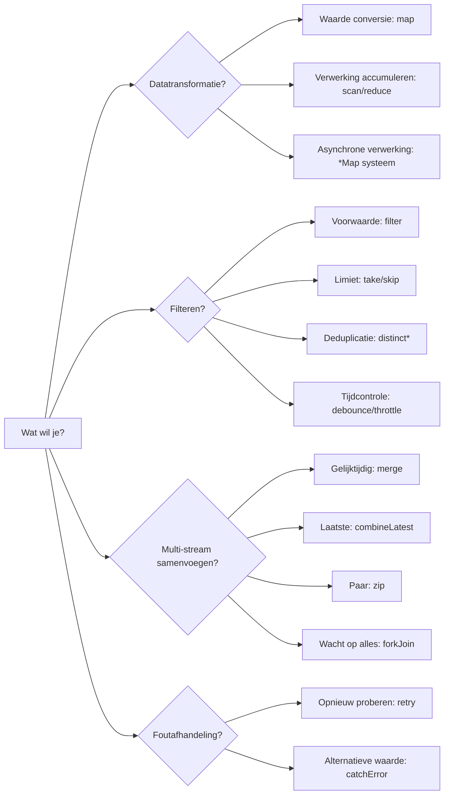
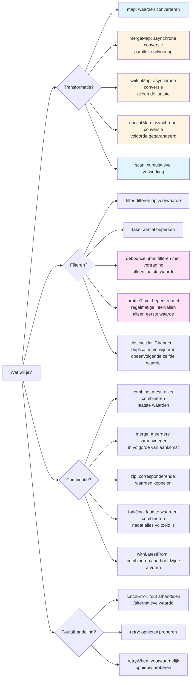
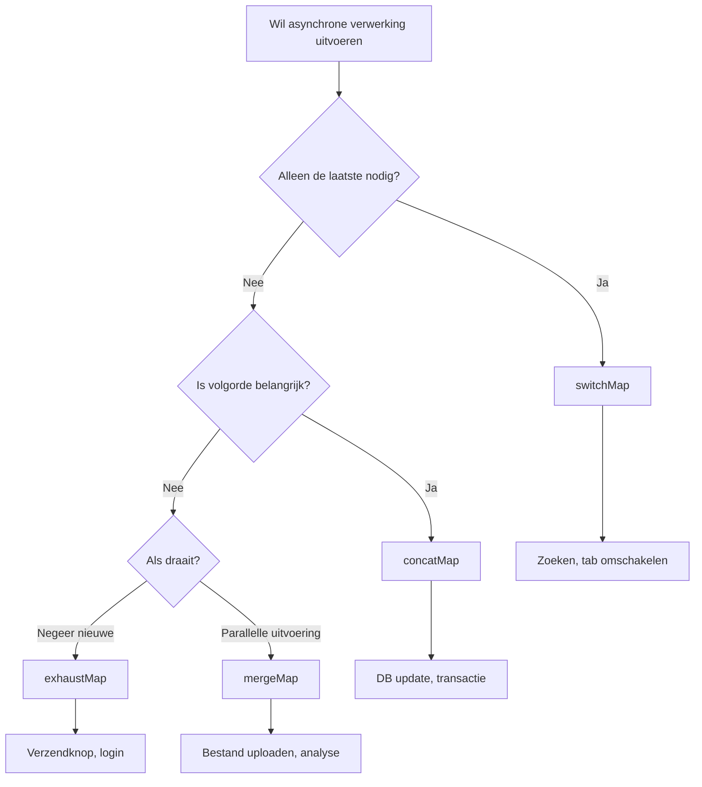

<style scoped>
.comparison-cards {
  display: grid;
  grid-template-columns: 1fr 1fr;
  gap: 1rem;
  margin-bottom: 2rem;
}

@media (max-width: 768px) {
  .comparison-cards {
    grid-template-columns: 1fr;
  }
}

/* Increase font size for title section */
.comparison-cards .tip .custom-block-title {
  font-size: 1.1rem;
  font-weight: 600;
}
</style>

# Verwarring bij het selecteren van operators

Er zijn meer dan 100 verschillende operators in RxJS, en **verward raken** over welke te gebruiken is een moeilijkheid die we allemaal ervaren. Deze pagina biedt praktische selectiecriteria en een stroomdiagram.

## Criteria voor het kiezen uit meer dan 100 operators

### Probleem: Te veel keuzes

```typescript
// Ik wil een array omzetten... map? scan? reduce? toArray?
// Ik wil meerdere API's aanroepen... mergeMap? switchMap? concatMap? exhaustMap?
// Ik wil waarden filteren... filter? take? first? distinctUntilChanged?
// Ik wil meerdere streams combineren... merge? combineLatest? zip? forkJoin?
```

### Oplossing: Filteren op categorie + doel



### Gedetailleerder selectiestroomdiagram

Het volgende stroomdiagram toont de procedure voor het selecteren van een operator voor een specifiek doel.



## 1. Transformatie operators

**Wanneer gebruiken?** Om de vorm van data te veranderen of om asynchrone verwerking aan te roepen

| Operator | Gebruik | Veelvoorkomende use cases |
|---|---|---|
| **map** | Waarden 1:1 converteren | Eigenschap ophalen, berekening, typeconversie |
| **scan** | Cumulatieve verwerking (stroom tussenwaarden) | Teller, som, geschiedenis |
| **reduce** | Cumulatieve verwerking (alleen eindwaarde) | Array som, maximale waarde |
| **mergeMap** | Asynchrone verwerking parallel | Meerdere API parallelle aanroep |
| **switchMap** | Asynchrone verwerking omschakelen | Zoek API (alleen laatste) |
| **concatMap** | Asynchrone verwerking sequentieel uitvoeren | Volgorde-kritische verwerking |
| **exhaustMap** | Nieuwe processen negeren tijdens uitvoering | Opeenvolgende hits voorkomen (verzendknop) |

### Praktisch voorbeeld: Selectie per use case

#### Use case 1: Eigenschappen ophalen

```typescript
import { of } from 'rxjs';
import { map } from 'rxjs';

interface User { id: number; name: string; }

of({ id: 1, name: 'Alice' }).pipe(
  map(user => user.name) // waarden 1:1 converteren → map
).subscribe(name => console.log(name)); // 'Alice'
```

#### Use case 2: Teller

```typescript
import { fromEvent } from 'rxjs';
import { scan } from 'rxjs';

const button = document.querySelector('button')!;

fromEvent(button, 'click').pipe(
  scan(count => count + 1, 0) // cumulatieve verwerking → scan
).subscribe(count => console.log(`Klik aantal: ${count}`));
```

#### Use case 3: Zoek API aanroep

```typescript
import { fromEvent } from 'rxjs';
import { debounceTime, map, switchMap } from 'rxjs';

const searchInput = document.querySelector('input')!;

fromEvent(searchInput, 'input').pipe(
  debounceTime(300),
  map(e => (e.target as HTMLInputElement).value),
  switchMap(query => searchAPI(query)) // alleen de laatste → switchMap
).subscribe(results => console.log(results));
```

## 2. Filter operators

### Wanneer gebruiken?
Ik wil waarden verwijderen en timing controleren

| Operator | Gebruik | Veelvoorkomende use cases |
|---|---|---|
| **filter** | Alleen waarden doorlaten die aan voorwaarden voldoen | Alleen even getallen, alleen niet-null waarden |
| **take** | Alleen de eerste N waarden | Haal eerste 5 op |
| **first** | Alleen de eerste | Haal initiële waarde op |
| **distinctUntilChanged** | Alleen waarden die verschillen van de laatste keer | Duplicaten uitsluiten |
| **debounceTime** | Vuurt na een bepaalde tijdsperiode | Zoekinvoer (na voltooiing invoer) |
| **throttleTime** | Beperken met bepaald interval | Scroll gebeurtenis |

### Praktisch voorbeeld: Selectie per use case

#### Use case 1: Alleen even getallen ophalen

```typescript
import { of } from 'rxjs';
import { filter } from 'rxjs';

of(1, 2, 3, 4, 5).pipe(
  filter(n => n % 2 === 0) // alleen waarden die aan voorwaarde voldoen → filter
).subscribe(console.log); // 2, 4
```

#### Use case 2: Zoekinvoer optimalisatie

```typescript
import { fromEvent } from 'rxjs';
import { debounceTime, distinctUntilChanged, map } from 'rxjs';

const input = document.querySelector('input')!;

fromEvent(input, 'input').pipe(
  debounceTime(300),              // wacht op voltooiing invoer → debounceTime
  map(e => (e.target as HTMLInputElement).value),
  distinctUntilChanged()          // duplicaten uitsluiten → distinctUntilChanged
).subscribe(query => console.log('Zoeken:', query));
```

#### Use case 3: Scroll gebeurtenis verdunnen

```typescript
import { fromEvent } from 'rxjs';
import { throttleTime } from 'rxjs';

fromEvent(window, 'scroll').pipe(
  throttleTime(200) // slechts één keer per 200ms → throttleTime
).subscribe(() => console.log('Scroll positie:', window.scrollY));
```

## 3. Combinatie operators

### Wanneer gebruiken?
Ik wil meerdere streams combineren

| Operator | Gebruik | Veelvoorkomende use cases |
|---|---|---|
| **merge** | Meerdere streams parallel | Meerdere gebeurtenissen monitoren |
| **combineLatest** | Alle laatste waarden combineren | Formulier validatie |
| **zip** | Corresponderende waarden koppelen | Resultaten van twee API's in kaart brengen |
| **forkJoin** | Resultaten in array na voltooiing alles | Parallelle uitvoering van meerdere API's |
| **withLatestFrom** | Hoofdstream + hulpwaarde | Gebeurtenis + huidige status |

### Praktisch voorbeeld: Selectie per use case

#### Use case 1: Meerdere gebeurtenissen monitoren

```typescript
import { fromEvent, merge } from 'rxjs';

const clicks$ = fromEvent(document, 'click');
const keypresses$ = fromEvent(document, 'keypress');

merge(clicks$, keypresses$).pipe() // gelijktijdige monitoring → merge
  .subscribe(() => console.log('Een gebeurtenis vond plaats'));
```

#### Use case 2: Formulier validatie

```typescript
import { combineLatest } from 'rxjs';
import { map } from 'rxjs';

const email$ = getFormControl('email');
const password$ = getFormControl('password');

combineLatest([email$, password$]).pipe( // alle laatste waarden → combineLatest
  map(([email, password]) => email.length > 0 && password.length > 7)
).subscribe(isValid => console.log('Formulier geldig:', isValid));
```

#### Use case 3: Parallelle uitvoering van meerdere API's

```typescript
import { forkJoin } from 'rxjs';

forkJoin({
  user: getUserAPI(),
  posts: getPostsAPI(),
  comments: getCommentsAPI()
}).subscribe(({ user, posts, comments }) => { // wacht op voltooiing alles → forkJoin
  console.log('Alle gegevens ophalen voltooid', { user, posts, comments });
});
```

## 20 meest gebruikte operators

De volgende zijn de **meest gebruikte** operators in de praktijk. Leer eerst deze 20.

<div class="comparison-cards">

::: tip 🥇 Meest frequent (vereist)
1. **map** - waarden converteren
2. **filter** - filteren op voorwaarde
3. **switchMap** - zoeken, etc., alleen nodig voor nieuwste
4. **tap** - debug, bijwerkingen
5. **take** - eerste N
6. **first** - eerste
7. **catchError** - foutafhandeling
8. **takeUntil** - uitschrijven
:::

::: tip 🥈 Vaak gebruikt (vaak)
9. **mergeMap** - parallelle asynchrone verwerking
10. **debounceTime** - wacht op voltooiing invoer
11. **distinctUntilChanged** - dedupliceren
12. **combineLatest** - meerdere waarden combineren
13. **startWith** - initiële waarde instellen
14. **scan** - accumuleren
15. **shareReplay** - resultaten cachen
:::

::: tip 🥉 Vaak gebruikt (moet weten)
16. **concatMap** - iteratieve verwerking
17. **throttleTime** - gebeurtenis verdunnen
18. **withLatestFrom** - hulpwaarden ophalen
19. **forkJoin** - meerdere API's in wachtrij
20. **retry** - verwerking opnieuw proberen
:::

</div>

## switchMap vs mergeMap vs concatMap vs exhaustMap

Deze vier zijn de **meest verwarrende** operators. Laten we de verschillen duidelijk begrijpen.

### Vergelijkingstabel

| Operator | Uitvoeringsmethode | Vorig proces | Nieuw proces | Gebruik |
|---|---|---|---|---|
| **switchMap** | Omschakelen | **Annuleren** | Direct starten | Zoeken, automatisch aanvullen |
| **mergeMap** | Parallelle uitvoering | Doorgaan | Direct starten | Bestand uploaden, analyse |
| **concatMap** | Sequentieel uitvoeren | Wacht op voltooiing | Start na **wachten** | Volgorde-kritische verwerking |
| **exhaustMap** | Negeren tijdens uitvoering | Doorgaan | **Negeren** | Knop mashingvoorkomen |

### Vergelijking met Marble diagram

```
Buiten: ----A----B----C----|

Binnen: A → --1--2|
      B → --3--4|
      C → --5--6|

switchMap:  ----1--3--5--6|  (A annuleert vóór 2, B annuleert vóór 4)
mergeMap:   ----1-23-45-6|   (alles parallel uitgevoerd)
concatMap:  ----1--2--3--4--5--6|  (sequentieel uitvoeren)
exhaustMap: ----1--2|            (B en C worden genegeerd)
```

### Praktisch voorbeeld: 4 verschillen in hetzelfde proces

**Situatie**: API (duurt 1 seconde) wordt aangeroepen voor elke klik op de knop. Gebruiker klikt elke 0,5 seconden.

#### switchMap - Geweldig voor zoeken

```typescript
import { fromEvent } from 'rxjs';
import { switchMap } from 'rxjs';

fromEvent(button, 'click').pipe(
  switchMap(() => searchAPI()) // alleen de laatste uitvoeren, oude verzoeken annuleren
).subscribe(result => console.log(result));

// 0.0 sec: Klik 1 → API1 start
// 0.5 sec: Klik 2 → API1 geannuleerd, API2 gestart
// 1.0 sec: Klik 3 → API2 geannuleerd, API3 gestart
// 2.0 sec: API3 voltooid → resultaat weergegeven (alleen API3)
```

::: tip 💡 Gebruik
- **Zoeken/Automatisch aanvullen**: alleen de laatste invoerwaarde is nodig
- **Tab omschakelen**: alleen de gegevens van het momenteel weergegeven tabblad zijn nodig
- **Paginering**: toon alleen de laatste pagina
:::

#### mergeMap - Geweldig voor gelijktijdigheid

```typescript
import { fromEvent } from 'rxjs';
import { mergeMap } from 'rxjs';

fromEvent(button, 'click').pipe(
  mergeMap(() => uploadFileAPI()) // alles parallel uitgevoerd
).subscribe(result => console.log(result));

// 0.0 sec: Klik 1 → API1 start
// 0.5 sec: Klik 2 → API2 start (API1 gaat door)
// 1.0 sec: Klik 3 → API3 start (API1, API2 gaan door)
// 1.0 sec: API1 voltooid → Resultaat weergegeven
// 1.5 sec: API2 voltooid → resultaat weergegeven
// 2.0 sec: API3 voltooid → resultaten weergeven
```

::: tip 💡 Gebruik
- **Bestand uploaden**: Meerdere bestanden tegelijkertijd uploaden
- **Analyse en log verzenden**: Parallelle uitvoering van onafhankelijke processen
- **Notificatiesysteem**: Meerdere notificaties tegelijkertijd verwerken
:::

#### concatMap - Ideaal voor volgorde-kritische verwerking

```typescript
import { fromEvent } from 'rxjs';
import { concatMap } from 'rxjs';

fromEvent(button, 'click').pipe(
  concatMap(() => updateDatabaseAPI()) // sequentieel uitvoeren (wachten op vorige voltooiing)
).subscribe(result => console.log(result));

// 0.0 sec: Klik 1 → API1 start
// 0.5 sec: Klik 2 → wachten (toevoegen aan wachtrij)
// 1.0 sec: Klik 3 → wachten (toevoegen aan wachtrij)
// 1.0 sec: API1 voltooid → resultaten weergeven, start API2
// 2.0 sec: API2 voltooid → resultaten weergeven, start API3
// 3.0 sec: API3 voltooid → resultaten weergeven
```

::: tip 💡 Gebruik
- **Database update**: volgorde-kritisch updateproces
- **Animaties**: animaties die u in volgorde wilt uitvoeren
- **Transacties**: één tegelijk uitvoeren zonder falen
:::

#### exhaustMap - Geweldig voor voorkomen stapelen

```typescript
import { fromEvent } from 'rxjs';
import { exhaustMap } from 'rxjs';

fromEvent(button, 'click').pipe(
  exhaustMap(() => submitFormAPI()) // nieuwe klikken negeren tijdens uitvoering
).subscribe(result => console.log(result));

// 0.0 seconden: Klik 1 → API1 start
// 0.5 sec: Klik 2 → genegeerd (API1 draait)
// 1.0 sec: Klik 3 → genegeerd (API1 draait)
// 1.0 sec: API1 voltooid → Resultaat weergegeven
// 1.5 sec: Klik 4 → API4 gestart (laatste keer voltooid)
```

::: tip 💡 Gebruik
- **Verzendknop**: Voorkomen dat formulierverzendingen herhaaldelijk worden aangeklikt
- **Authenticatie**: Voorkomen van opeenvolgende hits op de loginknop
- **Factureringsproces**: Dubbele facturering voorkomen
:::

### Selectie stroomdiagram



## Criteria in de praktijk

### Stap 1: Verduidelijk wat u wilt bereiken

```typescript
// ❌ Slecht voorbeeld: gebruik mergeMap voor nu
observable$.pipe(
  mergeMap(value => someAPI(value))
);

// ✅ Goed voorbeeld: verduidelijk doel voordat u kiest
// Doel: Voor zoekinvoer van een gebruiker willen we alleen de laatste resultaten weergeven
// → Oude verzoeken moeten worden geannuleerd → switchMap
searchInput$.pipe(
  switchMap(query => searchAPI(query))
);
```

### Stap 2: Prestatieoverwegingen

#### debounceTime vs throttleTime selectie

```typescript
// Zoekinvoer: uitvoeren nadat gebruiker invoer "voltooit"
searchInput$.pipe(
  debounceTime(300), // uitvoeren als geen invoer gedurende 300ms
  switchMap(query => searchAPI(query))
);

// Scrollen: uitvoeren met regelmatige intervallen (om te hoge frequentie te voorkomen)
scroll$.pipe(
  throttleTime(200), // alleen één keer per 200ms uitvoeren
  tap(() => loadMoreItems())
);
```

### Stap 3: Foutafhandeling opnemen

```typescript
import { of } from 'rxjs';
import { catchError, retry, switchMap } from 'rxjs';

searchInput$.pipe(
  debounceTime(300),
  switchMap(query =>
    searchAPI(query).pipe(
      retry(2),                          // tot 2 keer opnieuw proberen
      catchError(err => {
        console.error('Zoekfout:', err);
        return of([]);                   // lege array retourneren
      })
    )
  )
).subscribe(results => console.log(results));
```

### Stap 4: Geheugenlekken voorkomen

```typescript
import { Subject } from 'rxjs';
import { switchMap, takeUntil } from 'rxjs';

class SearchComponent {
  private destroy$ = new Subject<void>();

  ngOnInit() {
    searchInput$.pipe(
      debounceTime(300),
      switchMap(query => searchAPI(query)),
      takeUntil(this.destroy$)           // vrijgeven wanneer component wordt vernietigd
    ).subscribe(results => console.log(results));
  }

  ngOnDestroy() {
    this.destroy$.next();
    this.destroy$.complete();
  }
}
```

## Begrip checklist

Zorg ervoor dat u de volgende vragen kunt beantwoorden.

```markdown
## Basiskennis
- [ ] Operators classificeren per categorie (transformeren, filteren, samenvoegen)
- [ ] Beschrijf ten minste 10 van de 20 meest gebruikte operators
- [ ] Leg het verschil uit tussen switchMap, mergeMap, concatMap en exhaustMap

## Praktische selectie
- [ ] Selecteer de juiste operator voor de zoekfunctie (switchMap + debounceTime)
- [ ] Kies een operator geschikt voor parallelle aanroep van meerdere API's (forkJoin of mergeMap)
- [ ] Selecteer operators voor formulier validatie (combineLatest)

## Prestaties
- [ ] Onderscheid tussen debounceTime en throttleTime
- [ ] Weet hoe te optimaliseren voor hoogfrequente gebeurtenissen
- [ ] Kan patronen implementeren om geheugenlekken te voorkomen

## Foutafhandeling
- [ ] Kan catchError en retry in combinatie gebruiken
- [ ] Kan fallback-afhandeling implementeren bij fouten
- [ ] Feedback geven aan de gebruiker bij fouten
```

## Volgende stappen

Zodra u operator selectie begrijpt, is de volgende stap om **timing en volgorde** te leren.

→ **Begrijp timing en volgorde** (in voorbereiding) - begrijp wanneer waarden stromen, synchroon vs. asynchroon

## Gerelateerde pagina's

- **[Hoofdstuk 4: Operators begrijpen](/nl/guide/operators/)** - Details van alle operators
- **[Hoofdstuk 13: Praktische patronen](/nl/guide/)** - Werkelijke use cases (in voorbereiding)
- **[Hoofdstuk 10: Veelgemaakte fouten en oplossingen](/nl/guide/anti-patterns/common-mistakes)** - Anti-patronen voor onjuiste operator selectie

## 🎯 Oefeningen

### Oefening 1: Selecteer de juiste operator

Kies de beste operator voor het volgende scenario.

1. Gebruiker typt in zoekvak → API aanroep
2. Meerdere bestanden geüpload bij het klikken op een knop
3. Bepaal of alle velden in het formulier geldig zijn
4. Voorkomen van meerdere klikken op de verzendknop

<details>
<summary>Voorbeeldantwoord</summary>

**1. Zoekvak → API aanroep**
```typescript
searchInput$.pipe(
  debounceTime(300),      // wacht op voltooiing invoer
  distinctUntilChanged(), // duplicaten verwijderen
  switchMap(query => searchAPI(query)) // alleen de laatste
).subscribe(results => displayResults(results));
```
> [!NOTE] Reden
> Zoeken heeft alleen de laatste resultaten nodig, dus `switchMap`. `debounceTime` omdat het wacht op voltooiing invoer.

---

**2. Meerdere bestanden uploaden**
```typescript
fromEvent(uploadButton, 'click').pipe(
  mergeMap(() => {
    const files = getSelectedFiles();
    return forkJoin(files.map(file => uploadFileAPI(file)));
  })
).subscribe(results => console.log('Alle bestandsuploads voltooid', results));
```
> [!NOTE] Reden
> `forkJoin` omdat het meerdere bestanden parallel uploadt. Of `mergeMap` omdat het een onafhankelijk proces is.

---

**3. Geldigheidscontrole van alle formuliervelden**
```typescript
combineLatest([
  emailField$,
  passwordField$,
  agreeTerms$
]).pipe(
  map(([email, password, agreed]) =>
    email.valid && password.valid && agreed
  )
).subscribe(isValid => submitButton.disabled = !isValid);
```

> [!NOTE] Reden
> `combineLatest` omdat het de laatste waarden van alle velden combineert.

---

**4. Opeenvolgende hit van verzendknop voorkomen**
```typescript
fromEvent(submitButton, 'click').pipe(
  exhaustMap(() => submitFormAPI())
).subscribe(result => console.log('Verzenden voltooid', result));
```
> [!NOTE] Reden
> `exhaustMap` omdat het het lopende proces beschermt en nieuwe klikken negeert.

</details>

### Oefening 2: Kiezen tussen switchMap en mergeMap

De volgende code gebruikt `mergeMap`, maar er is een probleem. Repareer het alstublieft.

```typescript
searchInput$.pipe(
  debounceTime(300),
  mergeMap(query => searchAPI(query))
).subscribe(results => displayResults(results));
```

<details>
<summary>Voorbeeldoplossing</summary>

```typescript
searchInput$.pipe(
  debounceTime(300),
  switchMap(query => searchAPI(query)) // mergeMap → switchMap
).subscribe(results => displayResults(results));
```

> [!IMPORTANT] Problemen
> - Met `mergeMap` worden alle zoekverzoeken parallel uitgevoerd
> - Als de gebruiker "a" typt, dan "ab", dan "abc", worden alle drie de verzoeken uitgevoerd
> - Oudere verzoeken (resultaten voor "a") kunnen later worden geretourneerd en de laatste resultaten overschrijven

> [!NOTE] Reden voor reparatie
> - Met `switchMap` worden oude verzoeken geannuleerd wanneer een nieuwe zoekopdracht wordt gestart
> - Alleen de laatste zoekresultaten worden altijd weergegeven

</details>

### Oefening 3: Praktisch scenario

Schrijf een code die aan de volgende vereisten voldoet.

> [!NOTE] Vereisten
> - Gebruiker klikt op een knop
> - Haal 3 API's parallel op (gebruikersinformatie, berichtenlijst, commentaarlijst)
> - Gegevens weergeven wanneer alles voltooid is
> - Lege gegevens retourneren als er een fout optreedt
> - Uitschrijven wanneer component wordt vernietigd

<details>
<summary>Voorbeeldoplossing</summary>

```typescript
import { fromEvent, forkJoin, of, Subject } from 'rxjs';
import { switchMap, catchError, takeUntil } from 'rxjs';

class DataComponent {
  private destroy$ = new Subject<void>();
  private button = document.querySelector('button')!;

  ngOnInit() {
    fromEvent(this.button, 'click').pipe(
      switchMap(() =>
        forkJoin({
          user: this.getUserAPI().pipe(
            catchError(() => of(null))
          ),
          posts: this.getPostsAPI().pipe(
            catchError(() => of([]))
          ),
          comments: this.getCommentsAPI().pipe(
            catchError(() => of([]))
          )
        })
      ),
      takeUntil(this.destroy$)
    ).subscribe(({ user, posts, comments }) => {
      console.log('Gegevens ophalen voltooid', { user, posts, comments });
    });
  }

  ngOnDestroy() {
    this.destroy$.next();
    this.destroy$.complete();
  }

  private getUserAPI() { /* ... */ }
  private getPostsAPI() { /* ... */ }
  private getCommentsAPI() { /* ... */ }
}
```

> [!NOTE] Punten
> - Voer 3 API's parallel uit met `forkJoin` en wacht tot alles voltooid is
> - Stel fallback-waarde in bij fout met `catchError` voor elke API
> - Schakel over naar een nieuw verzoek bij elke klik op de knop met `switchMap`
> - `takeUntil` om automatisch vrij te geven wanneer component wordt vernietigd

</details>
