# Moeilijkheden in Statusbeheer

In RxJS zijn **"Ik wil status delen met meerdere componenten"** en **"Ik wil API-resultaten cachen"** zeer gebruikelijke vereisten, maar het kiezen van de juiste methode is moeilijk. Deze pagina beschrijft praktische patronen voor statusbeheer en stream-deling.

## Subject vs BehaviorSubject vs ReplaySubject

### Typen en Kenmerken van Subject

| Subject | Initiële waarde | Gedrag bij abonnement | Veelvoorkomende use cases |
|---|---|---|---|
| **Subject** | Geen | Ontvang alleen de waarde na abonnement | Event Bus, Notificatiesysteem |
| **BehaviorSubject** | Vereist | Ontvang laatste waarde onmiddellijk | Huidige status (ingelogd, geselecteerd item) |
| **ReplaySubject** | Geen | Ontvang laatste N waarden | Geschiedenis, log, bewerkingsrecord |
| **AsyncSubject** | Geen | Ontvang alleen de laatste waarde bij voltooiing | Enkel asynchroon resultaat (wordt niet veel gebruikt) |

### Visualiseer het Verschil Tussen Subject-type en Werking

Het volgende diagram toont welke waarde elk Subject ontvangt bij abonnement.

```mermaid
graph LR
    subgraph Subject[Subject - alleen nieuwe waarden]
        direction LR
        S1[Abonnement 1<br/>aan het begin]
        S2[Abonnement 2<br/>later abonneren]
        S[Subject]
        S1 --> S
        S2 --> S
        S --> |alleen nieuwe waarde| S1
        S --> |alleen nieuwe waarde| S2
        style S fill:#ffcccc,color:#333
    end

    subgraph BehaviorSubject[BehaviorSubject - huidige waarde + nieuwe waarde]
        direction LR
        B1[Abonnement1<br/>aan het begin]
        B2[Abonnement2<br/>Later abonneren]
        B[BehaviorSubject<br/>initiële waarde: 0]
        B1 --> B
        B2 --> B
        B --> |Huidige waarde: 0| B1
        B --> |Huidige waarde: 5<br/>Laatste status| B2
        style B fill:#ccffcc,color:#333
    end

    subgraph ReplaySubject[ReplaySubject - verleden N + nieuwe waarde]
        direction LR
        R1[Abonnement1<br/>aan het begin]
        R2[Abonnement2<br/>later abonneren]
        R[ReplaySubject<br/>bufferSize: 2]
        R1 --> R
        R2 --> R
        R --> |alle waarden| R1
        R --> |meest recente twee<br/>3, 4| R2
        style R fill:#ccccff,color:#333
    end
```



> [!TIP] Selectiecriteria
> - **Subject**: Eventnotificatie (verleden niet nodig)
> - **BehaviorSubject**: Statusbeheer (huidige waarde nodig)
> - **ReplaySubject**: Geschiedenisbeheer (verleden N vereist)

### Praktisch Voorbeeld 1: Subject (Event Bus)

#### ❌ Slecht voorbeeld: geen waarden worden geaccepteerd vóór abonnement
```typescript
import { Subject } from 'rxjs';

const notifications$ = new Subject<string>();

notifications$.next('Notificatie 1'); // niemand is nog geabonneerd

notifications$.subscribe(msg => {
  console.log('Ontvangen:', msg);
});

notifications$.next('Notificatie 2');
notifications$.next('Notificatie 3');

// Output:
// Ontvangen: Notificatie 2
// Ontvangen: Notificatie 3
// ('Notificatie 1' wordt niet ontvangen)
```

#### ✅ Goed voorbeeld: gebruik als event bus (alleen events na abonnement verwerken)
```typescript
import { filter, map, Subject } from 'rxjs';

class EventBus {
  private events$ = new Subject<{ type: string; payload: any }>();

  emit(type: string, payload: any) {
    this.events$.next({ type, payload });
  }

  on(type: string) {
    return this.events$.pipe(
      filter(event => event.type === type),
      map(event => event.payload)
    );
  }
}

const bus = new EventBus();

// start abonnement
bus.on('userLogin').subscribe(user => {
  console.log('login:', user);
});

// event uitgegeven
bus.emit('userLogin', { id: 1, name: 'Alice' }); // ✅ Ontvangen
// login: {id: 1, name: 'Alice'}
```

> [!TIP] Subject Gebruik
> - **Event-driven architectuur**: Losjes gekoppelde communicatie tussen componenten
> - **Notificatiesysteem**: Real-time notificatielevering
> - **Wanneer waarden uit het verleden niet nodig zijn**: Alleen post-abonnement events moeten worden verwerkt

### Praktisch Voorbeeld 2: BehaviorSubject (Statusbeheer)

#### ❌ Slecht voorbeeld: Subject kent huidige status niet
```typescript
import { Subject } from 'rxjs';

const isLoggedIn$ = new Subject<boolean>();

// gebruiker is ingelogd
isLoggedIn$.next(true);

// Component abonneert zich daarna
isLoggedIn$.subscribe(status => {
  console.log('login status:', status); // niets wordt uitgevoerd
});
```

#### ✅ Goed voorbeeld: krijg huidige status onmiddellijk met BehaviorSubject
```typescript
import { BehaviorSubject } from 'rxjs';

class AuthService {
  private isLoggedIn$ = new BehaviorSubject<boolean>(false); // initiële waarde: false

  login(username: string, password: string) {
    // login proces...
    this.isLoggedIn$.next(true);
  }

  logout() {
    this.isLoggedIn$.next(false);
  }

  // extern publiceren als alleen-lezen
  get isLoggedIn() {
    return this.isLoggedIn$.asObservable();
  }

  // Krijg huidige waarde synchroon (alleen gebruikt voor speciale gevallen)
  get currentStatus(): boolean {
    return this.isLoggedIn$.value;
  }
}

const auth = new AuthService();

auth.login('user', 'pass');

// Abonneer later en krijg onmiddellijk de huidige status (true)
auth.isLoggedIn.subscribe(status => {
  console.log('login status:', status); // login status: true
});
```

> [!TIP] Waar BehaviorSubject te Gebruiken
> - **Behoud huidige status**: Loginstatus, geselecteerde items, configuratiewaarden
> - **Vereist onmiddellijke waarde bij abonnement**: Huidige status is vereist voor initiële weergave in UI
> - **Monitor statuswijzigingen**: Reactief updaten wanneer status verandert

### Praktisch Voorbeeld 3: ReplaySubject (Geschiedenisbeheer)

#### ✅ Goed voorbeeld: Herhaal de afgelopen N waarden
```typescript
import { ReplaySubject } from 'rxjs';

class SearchHistoryService {
  // behoud geschiedenis van laatste 5 zoekopdrachten
  private history$ = new ReplaySubject<string>(5);

  addSearch(query: string) {
    this.history$.next(query);
  }

  getHistory() {
    return this.history$.asObservable();
  }
}

const searchHistory = new SearchHistoryService();

// Voer zoekopdracht uit
searchHistory.addSearch('TypeScript');
searchHistory.addSearch('RxJS');
searchHistory.addSearch('Angular');

// De laatste 3 resultaten kunnen direct worden opgehaald, zelfs als je later abonneert
searchHistory.getHistory().subscribe(query => {
  console.log('Zoekgeschiedenis:', query);
});

// Output:
// Zoekgeschiedenis: TypeScript
// Zoekgeschiedenis: RxJS
// Zoekgeschiedenis: Angular
```

> [!TIP] ReplaySubject Gebruik
> - **Actiegeschiedenis**: Zoekgeschiedenis, bewerkingsgeschiedenis, navigatiegeschiedenis
> - **Log/Audit Trail**: Record van eerdere bewerkingen
> - **Late Abonnementondersteuning**: Als je waarden uit het verleden wilt ontvangen zelfs als je abonnement laat start

## Onderscheid Tussen share en shareReplay

### Probleem: Dubbele Uitvoering van Cold Observable

#### ❌ Slecht voorbeeld: API wordt meerdere keren aangeroepen met meerdere subscribe
```typescript
import { ajax } from 'rxjs/ajax';

const users$ = ajax.getJSON('/api/users');

// abonnement1
users$.subscribe(users => {
  console.log('Component A:', users);
});

// Abonnement 2
users$.subscribe(users => {
  console.log('Component B:', users);
});

// Probleem: API wordt twee keer aangeroepen
// GET /api/users (1e keer)
// GET /api/users (2e keer)
```

#### ✅ Goed voorbeeld: converteer naar Hot met share (deel uitvoering)
```typescript
import { ajax } from 'rxjs/ajax';
import { share } from 'rxjs';

const users$ = ajax.getJSON('/api/users').pipe(
  share() // deel uitvoering
);

// abonnement1
users$.subscribe(users => {
  console.log('Component A:', users);
});

// Abonnement 2 (als je onmiddellijk abonneert)
users$.subscribe(users => {
  console.log('Component B:', users);
});

// ✅ API wordt slechts één keer aangeroepen
// GET /api/users (slechts één keer)
```

> [!WARNING] share Valkuilen
> `share()` reset de stream** wanneer het **laatste abonnement wordt beëindigd. Het zal opnieuw worden uitgevoerd de volgende keer dat je abonneert.
>
> ```typescript
> const data$ = fetchData().pipe(share());
>
> // abonnement1
> const sub1 = data$.subscribe();
>
> // abonnement2
> const sub2 = data$.subscribe();
>
> sub1.unsubscribe();
> sub2.unsubscribe(); // iedereen beëindigt abonnement → reset
>
> // opnieuw abonneren → fetchData() wordt opnieuw uitgevoerd
> data$.subscribe();
> ```

### shareReplay: Cache en Hergebruik Resultaten

#### ✅ Goed voorbeeld: cache met shareReplay
```typescript
import { ajax } from 'rxjs/ajax';
import { shareReplay } from 'rxjs';

const users$ = ajax.getJSON('/api/users').pipe(
  shareReplay({ bufferSize: 1, refCount: true })
  // bufferSize: 1 → cache de laatste enkele waarde
  // refCount: true → cache wordt gewist wanneer alle abonnementen worden beëindigd
);

// abonnement1
users$.subscribe(users => {
  console.log('Component A:', users);
});

// Abonneer 1 seconde later Abonnement 2 (vertraagd abonnement, maar nog steeds opgehaald uit cache)
setTimeout(() => {
  users$.subscribe(users => {
    console.log('Component B:', users); // onmiddellijk ophalen uit cache
  });
}, 1000);

// ✅ API wordt slechts één keer aangeroepen, en het resultaat wordt gecachet
```

### share vs shareReplay Vergelijking

| Functie | share() | shareReplay(1) |
|---|---|---|
| **Nieuw abonnement tijdens abonnement** | Deel dezelfde stream | Deel dezelfde stream |
| **Abonneer laat** | Ontvang alleen nieuwe waarden | Ontvang laatste gecachte waarden |
| **Na alle abonnementen worden beëindigd** | Reset stream | Behoud cache (als refCount: false) |
| **Geheugen** | Niet behouden | Behoud cache |
| **Use case** | Real-time gegevensdeling | Cache API-resultaten |

#### ✅ Goed voorbeeld: juiste configuratie van shareReplay
```typescript
import { shareReplay } from 'rxjs';

// Patroon 1: persistente cache (niet aanbevolen)
const data1$ = fetchData().pipe(
  shareReplay({ bufferSize: 1, refCount: false })
  // refCount: false → geheugenlek waarschuwing
);

// Patroon 2: cache met automatische opruiming (aanbevolen)
const data2$ = fetchData().pipe(
  shareReplay({ bufferSize: 1, refCount: true })
  // refCount: true → Beëindig alle abonnementen en wis cache
);

// Patroon 3: Cache met TTL (RxJS 7.4+)
const data3$ = fetchData().pipe(
  shareReplay({
    bufferSize: 1,
    refCount: true,
    windowTime: 5000 // gooi cache weg na 5 seconden
  })
);
```

> [!IMPORTANT] Geheugenlek Waarschuwing
> `shareReplay({ refCount: false })` kan geheugenlekken veroorzaken omdat de cache persistent blijft. Gebruik in principe **refCount: true**.

## Praktisch Gebruik van Hot vs Cold

### Cold Kenmerken: Uitvoeren Per Abonnement

```typescript
import { Observable } from 'rxjs';

const cold$ = new Observable<number>(subscriber => {
  console.log('🔵 Uitvoering gestart');
  subscriber.next(Math.random());
  subscriber.complete();
});

cold$.subscribe(v => console.log('Abonnement 1:', v));
cold$.subscribe(v => console.log('Abonnement 2:', v));

// Output:
// 🔵 Start Uitvoering
// Abonnement 1: 0.123
// 🔵 Start Uitvoering
// Abonnement 2: 0.456
// (twee uitvoeringen, verschillende waarden)
```

### Hot Kenmerken: Gedeelde Uitvoering

```typescript
import { Subject } from 'rxjs';

const hot$ = new Subject<number>();

hot$.subscribe(v => console.log('Abonnement 1:', v));
hot$.subscribe(v => console.log('Abonnement 2:', v));

hot$.next(Math.random());

// Output:
// abonnement1: 0.789
// Abonnement 2: 0.789
// (delen dezelfde waarde)
```

### Gebruikscriteria

| Vereisten | Cold | Hot |
|---|---|---|
| **Onafhankelijke uitvoering nodig** | ✅ | ❌ |
| **Wil uitvoering delen** | ❌ | ✅ |
| **Verschillende waarden voor verschillende abonnees** | ✅ | ❌ |
| **Real-time gegevensdistributie** | ❌ | ✅ |
| **Delen van API-aanroepen** | ❌ (converteer met share) | ✅ |

#### ✅ Goed voorbeeld: juiste conversie
```typescript
import { interval, fromEvent } from 'rxjs';
import { share, shareReplay } from 'rxjs';

// Cold: elke abonnee is een onafhankelijke timer
const coldTimer$ = interval(1000);

// Cold → Hot: deel timer
const hotTimer$ = interval(1000).pipe(share());

// Cold: klik event (onafhankelijke listener registratie voor elk abonnement)
const clicks$ = fromEvent(document, 'click');

// Cold → Hot: cache API-resultaten
const cachedData$ = ajax.getJSON('/api/data').pipe(
  shareReplay({ bufferSize: 1, refCount: true })
);
```

## Gecentraliseerd Statusbeheerpatroon

### Patroon 1: Statusbeheer in de Service Class

```typescript
import { BehaviorSubject, Observable } from 'rxjs';
import { map } from 'rxjs';

interface User {
  id: number;
  name: string;
  email: string;
}

class UserStore {
  // privé BehaviorSubject
  private users$ = new BehaviorSubject<User[]>([]);

  // alleen-lezen Observable voor openbaar gebruik
  get users(): Observable<User[]> {
    return this.users$.asObservable();
  }

  // krijg een specifieke gebruiker
  getUser(id: number): Observable<User | undefined> {
    return this.users.pipe(
      map(users => users.find(u => u.id === id))
    );
  }

  // update status
  addUser(user: User) {
    const currentUsers = this.users$.value;
    this.users$.next([...currentUsers, user]);
  }

  updateUser(id: number, updates: Partial<User>) {
    const currentUsers = this.users$.value;
    const updatedUsers = currentUsers.map(u =>
      u.id === id ? { ...u, ...updates } : u
    );
    this.users$.next(updatedUsers);
  }

  removeUser(id: number) {
    const currentUsers = this.users$.value;
    this.users$.next(currentUsers.filter(u => u.id !== id));
  }
}

// Gebruik
const store = new UserStore();

// Abonneer
store.users.subscribe(users => {
  console.log('Gebruikerslijst:', users);
});

// update status
store.addUser({ id: 1, name: 'Alice', email: 'alice@example.com' });
store.updateUser(1, { name: 'Alice Smith' });
```

### Patroon 2: Statusbeheer met Scan

```typescript
import { Subject } from 'rxjs';
import { scan, startWith } from 'rxjs';

interface State {
  count: number;
  items: string[];
}

type Action =
  | { type: 'INCREMENT' }
  | { type: 'DECREMENT' }
  | { type: 'ADD_ITEM'; payload: string }
  | { type: 'RESET' };

const actions$ = new Subject<Action>();

const initialState: State = {
  count: 0,
  items: []
};

const state$ = actions$.pipe(
  scan((state, action) => {
    switch (action.type) {
      case 'INCREMENT':
        return { ...state, count: state.count + 1 };
      case 'DECREMENT':
        return { ...state, count: state.count - 1 };
      case 'ADD_ITEM':
        return { ...state, items: [...state.items, action.payload] };
      case 'RESET':
        return initialState;
      default:
        return state;
    }
  }, initialState),
  startWith(initialState)
);

// Abonneer
state$.subscribe(state => {
  console.log('Huidige status:', state);
});

// geef actie uit
actions$.next({ type: 'INCREMENT' });
actions$.next({ type: 'ADD_ITEM', payload: 'appel' });
actions$.next({ type: 'INCREMENT' });

// Output:
// huidige status: { count: 0, items: [] }
// huidige status: { count: 1, items: [] }
// huidige status: { count: 1, items: ['appel'] }
// huidige status: { count: 2, items: ['appel'] }
```

## Veelvoorkomende Valkuilen

### Valkuil 1: Externe Blootstelling van Subject

#### ❌ Slecht voorbeeld: publiceren van de Subject direct
```typescript
import { BehaviorSubject } from 'rxjs';

class BadService {
  // ❌ kan direct van buitenaf worden gewijzigd
  public state$ = new BehaviorSubject<number>(0);
}

const service = new BadService();

// kan van buitenaf zonder toestemming worden gewijzigd
service.state$.next(999); // ❌ encapsulatie is verbroken
```

#### ✅ Goed voorbeeld: beschermd door asObservable()
```typescript
import { BehaviorSubject } from 'rxjs';

class GoodService {
  private _state$ = new BehaviorSubject<number>(0);

  // publiceer als alleen-lezen
  get state() {
    return this._state$.asObservable();
  }

  // kan alleen worden gewijzigd door toegewijde methoden
  increment() {
    this._state$.next(this._state$.value + 1);
  }

  decrement() {
    this._state$.next(this._state$.value - 1);
  }
}

const service = new GoodService();

// ✅ alleen-lezen
service.state.subscribe(value => console.log(value));

// ✅ Wijzigingen worden gedaan via toegewijde methoden
service.increment();

// ❌ Kan niet direct worden gewijzigd (compile fout)
// service.state.next(999); // Fout: Property 'next' does not exist
```

### Valkuil 2: shareReplay Geheugenlek

#### ❌ Slecht voorbeeld: geheugenlek met refCount: false
```typescript
import { interval } from 'rxjs';
import { shareReplay, take } from 'rxjs';

const data$ = interval(1000).pipe(
  take(100),
  shareReplay({ bufferSize: 1, refCount: false })
  // ❌ refCount: false → cache blijft voor altijd
);

// de stream blijft intern actief zelfs na abonneren en beëindigen van abonnement
const sub = data$.subscribe();
sub.unsubscribe();

// cache blijft → geheugenlek
```

#### ✅ Goed voorbeeld: automatische opruiming met refCount: true
```typescript
import { interval } from 'rxjs';
import { shareReplay, take } from 'rxjs';

const data$ = interval(1000).pipe(
  take(100),
  shareReplay({ bufferSize: 1, refCount: true })
  // ✅ refCount: true → automatische opruiming met alle beëindigingen van abonnementen
);

const sub1 = data$.subscribe();
const sub2 = data$.subscribe();

sub1.unsubscribe();
sub2.unsubscribe(); // beëindig alle abonnementen → stop stream, wis cache
```

### Valkuil 3: Synchrone Waarde Ophalen

#### ❌ Slecht voorbeeld: te afhankelijk van value
```typescript
import { BehaviorSubject } from 'rxjs';

class CounterService {
  private count$ = new BehaviorSubject(0);

  increment() {
    // ❌ te veel vertrouwen op value
    const current = this.count$.value;
    this.count$.next(current + 1);
  }

  // ❌ stelt synchrone acquisitie bloot
  getCurrentCount(): number {
    return this.count$.value;
  }
}
```

#### ✅ Goed voorbeeld: houd het reactief
```typescript
import { BehaviorSubject } from 'rxjs';
import { map } from 'rxjs';

class CounterService {
  private count$ = new BehaviorSubject(0);

  get count() {
    return this.count$.asObservable();
  }

  increment() {
    // ✅ Het is OK om value intern te gebruiken
    this.count$.next(this.count$.value + 1);
  }

  // ✅ Retourneer met Observable
  isPositive() {
    return this.count$.pipe(
      map(count => count > 0)
    );
  }
}
```

## Begrip Checklist

Zorg ervoor dat je de volgende vragen kunt beantwoorden.

```markdown
## Basisbegrip
- [ ] Leg het verschil uit tussen Subject, BehaviorSubject en ReplaySubject
- [ ] Begrijp waarom BehaviorSubject een initiële waarde nodig heeft
- [ ] Begrijp de betekenis van bufferSize in ReplaySubject

## Hot/Cold
- [ ] Leg het verschil uit tussen Cold Observable en Hot Observable
- [ ] Leg het verschil uit tussen share en shareReplay
- [ ] Begrijp de rol van shareReplay's refCount optie

## Statusbeheer
- [ ] Kan de Subject beschermen met asObservable() zonder het naar buiten bloot te stellen
- [ ] Implementeer statusbeheerpatronen met BehaviorSubject
- [ ] Begrijp statusbeheerpatronen met scan

## Geheugenbeheer
- [ ] Weet hoe je geheugenlekken in shareReplay voorkomt
- [ ] Leg het verschil uit tussen refCount: true en false
- [ ] Wis de cache op het juiste moment
```

## Volgende Stappen

Zodra je statusbeheer en delen begrijpt, is de volgende stap om te leren hoe je **meerdere streams combineert**.

→ **[Meerdere stream combinatie](/nl/guide/overcoming-difficulties/stream-combination)** - Hoe combineLatest, zip, withLatestFrom te gebruiken

## Gerelateerde Pagina's

- **[Hoofdstuk 5: Wat is Subject](/nl/guide/subjects/what-is-subject)** - Basis van Subject
- **[Hoofdstuk 5: Typen van Subject](/nl/guide/subjects/types-of-subject)** - Details van BehaviorSubject en ReplaySubject
- **[share() operator](/nl/guide/operators/multicasting/share)** - Gedetailleerde uitleg van share
- **[Misbruik van shareReplay](/nl/guide/anti-patterns/common-mistakes#4-sharereplay-)** - Veelvoorkomende fouten
- **[Cold vs Hot Observable](/nl/guide/observables/cold-and-hot-observables)** - Cold/Hot details

## 🎯 Oefenproblemen

### Probleem 1: Kiezen van een Geschikte Subject

Kies de beste Subject voor het volgende scenario.

1. **Beheer gebruikersloginstatus** (standaard: uitgelogd)
2. **Levering van notificatieberichten** (alleen berichten weergeven na abonnement)
3. **Behoud geschiedenis van de laatste 5 bewerkingen** (zelfs als laat geabonneerd, zijn de laatste 5 nog steeds zichtbaar)

<details>
<summary>Voorbeeld van oplossing</summary>

**1. Gebruikersloginstatus**
```typescript
import { BehaviorSubject } from 'rxjs';

class AuthService {
  private isLoggedIn$ = new BehaviorSubject<boolean>(false);

  get loginStatus() {
    return this.isLoggedIn$.asObservable();
  }

  login() {
    this.isLoggedIn$.next(true);
  }

  logout() {
    this.isLoggedIn$.next(false);
  }
}
```

> [!NOTE] Reden
> **BehaviorSubject** is de beste keuze omdat we de huidige status onmiddellijk bij abonnement nodig hebben.

---

**2. Notificatieberichtlevering**
```typescript
import { Subject } from 'rxjs';

class NotificationService {
  private notifications$ = new Subject<string>();

  get messages() {
    return this.notifications$.asObservable();
  }

  notify(message: string) {
    this.notifications$.next(message);
  }
}
```

> [!NOTE] Reden
> **Subject** is voldoende omdat we het bericht alleen na abonnement hoeven weer te geven.

---

**3. Laatste 5 bewerkingen geschiedenis**
```typescript
import { ReplaySubject } from 'rxjs';

class HistoryService {
  private actions$ = new ReplaySubject<string>(5); // houd 5 acties bij

  get history() {
    return this.actions$.asObservable();
  }

  addAction(action: string) {
    this.actions$.next(action);
  }
}
```

> [!NOTE] Reden
> **ReplaySubject(5)** is de beste manier om de laatste 5 bij te houden en ze op te halen zelfs als je laat abonneert.

</details>

### Probleem 2: Kiezen Tussen share en shareReplay

In de volgende code, kies de juiste operator.

```typescript
import { ajax } from 'rxjs/ajax';

// Scenario 1: Real-time gegevens van WebSocket
const realTimeData$ = webSocket('ws://example.com/stream');

// Scenario 2: API-aanroep voor gebruikersinformatie (we willen de resultaten cachen)
const user$ = ajax.getJSON('/api/user/me');

// Wat moeten we voor beide gebruiken?
```

<details>
<summary>Voorbeeldantwoord</summary>

**Scenario 1: Real-time gegevens van WebSocket**
```typescript
import { share } from 'rxjs';

const realTimeData$ = webSocket('ws://example.com/stream').pipe(
  share() // geen behoefte om real-time gegevens te cachen
);
```

> [!NOTE] Reden
> **share()** wordt gebruikt voor real-time gegevens zoals WebSocket, omdat er geen behoefte is om waarden uit het verleden te cachen. Als je laat abonneert, ontvang je nieuwe gegevens vanaf dat moment.

---

**Scenario 2: API-aanroep voor gebruikersinformatie**
```typescript
import { shareReplay } from 'rxjs';

const user$ = ajax.getJSON('/api/user/me').pipe(
  shareReplay({ bufferSize: 1, refCount: true })
);
```

> [!NOTE] Reden
> Gebruik **shareReplay()** om API-resultaten te cachen en te delen tussen meerdere componenten. Gebruik `refCount: true` om geheugenlekken te voorkomen.

</details>

### Probleem 3: Geheugenlekken Oplossen

De volgende code heeft een geheugenlek probleem. Los het alstublieft op.

```typescript
import { interval } from 'rxjs';
import { shareReplay } from 'rxjs';

const data$ = interval(1000).pipe(
  shareReplay(1) // probleem: dit is hetzelfde als shareReplay({ bufferSize: 1, refCount: false })
);

const sub = data$.subscribe(v => console.log(v));
sub.unsubscribe();

// interval blijft actief na dit → geheugenlek
```

<details>
<summary>Voorbeeldoplossing</summary>

**Aangepaste code:**
```typescript
import { interval } from 'rxjs';
import { shareReplay } from 'rxjs';

const data$ = interval(1000).pipe(
  shareReplay({ bufferSize: 1, refCount: true })
  // refCount: true → Stream stopt wanneer alle abonnementen worden beëindigd
);

const sub = data$.subscribe(v => console.log(v));
sub.unsubscribe(); // stream wordt gestopt
```

> [!IMPORTANT] Problemen
> - `shareReplay(1)` is een afkorting voor `shareReplay({ bufferSize: 1, refCount: false })`
> - `refCount: false` betekent dat de stream actief blijft zelfs nadat alle abonnementen zijn beëindigd
> - interval blijft voor altijd actief, wat resulteert in een geheugenlek

> [!NOTE] Reden voor fix
> Met `refCount: true`, stopt de stream ook wanneer het laatste abonnement wordt beëindigd en wordt de cache gewist.

</details>

### Probleem 4: Implementatie van Statusbeheer

Implementeer een TodoStore die voldoet aan de volgende vereisten.

> [!NOTE] Vereisten
> - In staat om Todo-items toe te voegen, te voltooien en te verwijderen
> - Mogelijkheid om todo-lijsten extern op te halen in alleen-lezen modus
> - Mogelijkheid om het aantal voltooide Todo-items op te halen

<details>
<summary>Voorbeeldoplossing</summary>

```typescript
import { BehaviorSubject, Observable } from 'rxjs';
import { map } from 'rxjs';

interface Todo {
  id: number;
  text: string;
  completed: boolean;
}

class TodoStore {
  private todos$ = new BehaviorSubject<Todo[]>([]);
  private nextId = 1;

  // publiceer als alleen-lezen
  get todos(): Observable<Todo[]> {
    return this.todos$.asObservable();
  }

  // Aantal voltooide Todos
  get completedCount(): Observable<number> {
    return this.todos$.pipe(
      map(todos => todos.filter(t => t.completed).length)
    );
  }

  // voeg todo toe
  addTodo(text: string) {
    const currentTodos = this.todos$.value;
    const newTodo: Todo = {
      id: this.nextId++,
      text,
      completed: false
    };
    this.todos$.next([...currentTodos, newTodo]);
  }

  // Todo voltooid
  toggleTodo(id: number) {
    const currentTodos = this.todos$.value;
    const updatedTodos = currentTodos.map(todo =>
      todo.id === id ? { ...todo, completed: !todo.completed } : todo
    );
    this.todos$.next(updatedTodos);
  }

  // verwijder todo
  removeTodo(id: number) {
    const currentTodos = this.todos$.value;
    this.todos$.next(currentTodos.filter(todo => todo.id !== id));
  }
}

// Gebruik
const store = new TodoStore();

store.todos.subscribe(todos => {
  console.log('Todo lijst:', todos);
});

store.completedCount.subscribe(count => {
  console.log('Voltooid:', count);
});

store.addTodo('Leer RxJS');
store.addTodo('Lees documentatie');
store.toggleTodo(1);
```

> [!NOTE] Punten
> - Behoud status in `BehaviorSubject`
> - Stel het extern bloot als alleen-lezen met `asObservable()`
> - Gebruik `value` om huidige status te krijgen en bij te werken
> - Gebruik `map` om afgeleide status te berekenen (completedCount)

</details>
