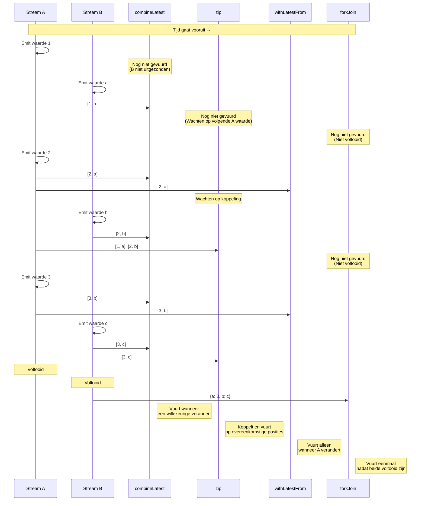
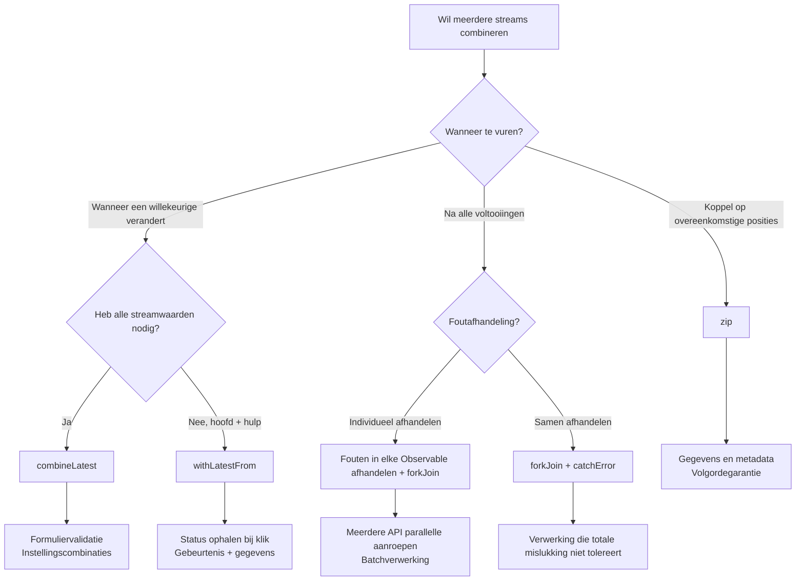

# Meerdere Streams Combineren

Er zijn veel vereisten in RxJS zoals **"Ik wil de resultaten van twee APIs combineren" of "Ik wil alle velden van een formulier monitoren"**, maar het kiezen van de juiste operator is moeilijk. Deze pagina beschrijft praktische patronen voor het combineren van meerdere streams.

## combineLatest vs zip vs withLatestFrom vs forkJoin

### Vergelijking van de 4 Belangrijkste Combinatie-Operators

| Operator | Vuur Timing | Hoe Waarden te Combineren | Voltooiingsvoorwaarde | Veelvoorkomende Gebruikssituaties |
|---|---|---|---|---|
| **combineLatest** | Wanneer een willekeurige verandert | Nieuwste waarde van elke stream | Alle streams voltooien | Formuliervalidatie, combinatie van instellingen |
| **zip** | Alle streams produceren waarden | Koppel waarden op overeenkomstige posities | Een voltooiing | Paginering, parallelle verwerkingssynchronisatie |
| **withLatestFrom** | Hoofdstream verandert | Hoofd + hulp nieuwste waarde | Hoofdstream voltooit | Gebeurtenis + huidige status |
| **forkJoin** | Alle streams voltooien | Laatste waarde van elke stream | Alle streams voltooien | Meerdere API parallelle aanroep |

### Vergelijking met Marble Diagram

```
A:  --1--2--------3----|
B:  ----a----b------c----|

combineLatest(A, B):
    ----[1,a]-[2,a]-[2,b]-[3,b]-[3,c]|
    (vuurt wanneer een willekeurige verandert)

zip(A, B):
    ----[1,a]----[2,b]----[3,c]|
    (koppelt op overeenkomstige posities)

A.pipe(withLatestFrom(B)):
    ----[1,a]----[2,b]----[3,c]|
    (vuurt alleen wanneer A verandert)

forkJoin({ a: A, b: B }):
    ---------------------------{ a: 3, b: c }|
    (vuurt nadat beide zijn voltooid)
```

### Visualisatie van Vuur Timing

Het volgende diagram toont wanneer elke combinatie-operator waarden vuurt.



> [!TIP] Selectiecriteria
> - **combineLatest**: Combinatie van reactieve staten (formulieren, instellingen)
> - **zip**: Koppeling van overeenkomstige waarden (paginering, parallelle verwerking)
> - **withLatestFrom**: Gebeurtenis + huidige status (instellingen ophalen bij klik)
> - **forkJoin**: Meerdere asynchrone processen parallel uitvoeren en alle resultaten ophalen (meerdere APIs)

## combineLatest: Combineer Nieuwste Waarden

### Kenmerken
- **Nadat alle streams minstens één keer hebben uitgezonden**, vuurt wanneer een willekeurige verandert
- Combineert de **nieuwste waarde** van elke stream
- Gaat door totdat alle streams voltooien

### Praktijkvoorbeeld 1: Formuliervalidatie

#### ❌ Slecht Voorbeeld: Individueel abonneren en handmatig combineren
```typescript
import { BehaviorSubject } from 'rxjs';

const email$ = new BehaviorSubject('');
const password$ = new BehaviorSubject('');
let isValid = false;

email$.subscribe(email => {
  // Heb password$ waarde nodig maar kan deze niet krijgen
  // Moet beheren met globale variabelen
});

password$.subscribe(password => {
  // Hetzelfde probleem
});
```

#### ✅ Goed Voorbeeld: Automatisch combineren met combineLatest
```typescript
import { BehaviorSubject, combineLatest } from 'rxjs';
import { map } from 'rxjs';

const email$ = new BehaviorSubject('');
const password$ = new BehaviorSubject('');

const isFormValid$ = combineLatest([email$, password$]).pipe(
  map(([email, password]) => {
    const emailValid = email.includes('@') && email.length > 3;
    const passwordValid = password.length >= 8;
    return emailValid && passwordValid;
  })
);

isFormValid$.subscribe(isValid => {
  console.log('Formulier geldig:', isValid);
});

// Waardewijzigingen
email$.next('gebruiker@voorbeeld.nl');  // Formulier geldig: false (wachtwoord te kort)
password$.next('wacht1234');            // Formulier geldig: true
```

### Praktijkvoorbeeld 2: Meerdere Instellingen Combineren

```typescript
import { BehaviorSubject, combineLatest } from 'rxjs';
import { map } from 'rxjs';

interface Config {
  theme: 'light' | 'dark';
  language: 'ja' | 'en';
  fontSize: number;
}

const theme$ = new BehaviorSubject<'light' | 'dark'>('light');
const language$ = new BehaviorSubject<'ja' | 'en'>('ja');
const fontSize$ = new BehaviorSubject<number>(14);

const config$ = combineLatest([theme$, language$, fontSize$]).pipe(
  map(([theme, language, fontSize]): Config => ({
    theme,
    language,
    fontSize
  }))
);

config$.subscribe(config => {
  console.log('Instellingen bijgewerkt:', config);
  // Update UI
});

theme$.next('dark');      // Instellingen bijgewerkt: { theme: 'dark', language: 'ja', fontSize: 14 }
fontSize$.next(16);       // Instellingen bijgewerkt: { theme: 'dark', language: 'ja', fontSize: 16 }
```

> [!TIP] Wanneer combineLatest te Gebruiken
> - **Formuliervalidatie**: Combineer nieuwste waarden van alle velden
> - **Instellingen monitoren**: Reageer wanneer meerdere instellingsitems veranderen
> - **Afhankelijke weergave**: Update UI volgens meerdere staten
> - **Filtering**: Combineer meerdere voorwaarden

## zip: Koppel op Overeenkomstige Posities

### Kenmerken
- Koppelt **waarden op overeenkomstige posities** van elke stream
- Wacht totdat waarden beschikbaar zijn van alle streams
- Voltooit wanneer een stream voltooit

### Praktijkvoorbeeld 1: Gegevens en Metadata Koppelen in Paginering

#### ❌ Slecht Voorbeeld: Timing is niet uitgelijnd
```typescript
import { interval } from 'rxjs';
import { map, take } from 'rxjs';

// Haal paginagegevens op (langzaam)
const pages$ = interval(1000).pipe(
  map(i => `Pagina ${i + 1} gegevens`),
  take(3)
);

// Haal metadata op (snel)
const metadata$ = interval(100).pipe(
  map(i => `Metadata ${i + 1}`),
  take(3)
);

// Individueel abonneren breekt correspondentie
pages$.subscribe(page => console.log('Pagina:', page));
metadata$.subscribe(meta => console.log('Meta:', meta));

// Output:
// Meta: Metadata 1
// Meta: Metadata 2
// Meta: Metadata 3
// Pagina: Pagina 1 gegevens
// Pagina: Pagina 2 gegevens
// Pagina: Pagina 3 gegevens
// (Correspondentie is verstoord)
```

#### ✅ Goed Voorbeeld: Koppel overeenkomstige posities met zip
```typescript
import { interval, zip } from 'rxjs';
import { map, take } from 'rxjs';

const pages$ = interval(1000).pipe(
  map(i => `Pagina ${i + 1} gegevens`),
  take(3)
);

const metadata$ = interval(100).pipe(
  map(i => `Metadata ${i + 1}`),
  take(3)
);

zip(pages$, metadata$).subscribe(([page, meta]) => {
  console.log(`${page} - ${meta}`);
});

// Output (elke seconde):
// Pagina 1 gegevens - Metadata 1
// Pagina 2 gegevens - Metadata 2
// Pagina 3 gegevens - Metadata 3
```

### Praktijkvoorbeeld 2: Krijg Parallelle Verwerkingsresultaten op Volgorde

```typescript
import { of, zip } from 'rxjs';
import { delay, map } from 'rxjs';

// Roep 3 APIs parallel aan, maar voltooiingstijden variëren
const api1$ = of('Resultaat 1').pipe(delay(300));
const api2$ = of('Resultaat 2').pipe(delay(100)); // Snelste
const api3$ = of('Resultaat 3').pipe(delay(200));

zip(api1$, api2$, api3$).pipe(
  map(([r1, r2, r3]) => ({ r1, r2, r3 }))
).subscribe(results => {
  console.log('Alle resultaten:', results);
});

// Output (na 300ms, zodra alles klaar is):
// Alle resultaten: { r1: 'Resultaat 1', r2: 'Resultaat 2', r3: 'Resultaat 3' }
```

> [!TIP] Wanneer zip te Gebruiken
> - **Volgorde is belangrijk**: Koppel 1e met 1e, 2e met 2e
> - **Gegevens en metadata koppelen**: Paginagegevens en paginanummers
> - **Parallelle verwerkingssynchronisatie**: Voer meerdere processen parallel uit en garandeer volgorde

> [!WARNING] zip Waarschuwingen
> - Wacht op langzame streams, dus **buffers kunnen zich ophopen**
> - Met oneindige streams kunnen langzame streams geheugenlekken veroorzaken

## withLatestFrom: Krijg Hoofd + Hulpwaarden

### Kenmerken
- Vuurt alleen **wanneer de hoofdstream een waarde uitzendt**
- Haalt en combineert de **nieuwste waarde** van hulpstreams
- Voltooit wanneer de hoofdstream voltooit

### Praktijkvoorbeeld 1: Klikgebeurtenis + Huidige Status

#### ❌ Slecht Voorbeeld: combineLatest vuurt onnodig
```typescript
import { fromEvent, BehaviorSubject, combineLatest } from 'rxjs';

const button = document.querySelector('button')!;
const clicks$ = fromEvent(button, 'click');
const counter$ = new BehaviorSubject(0);

// ❌ combineLatest vuurt ook wanneer counter$ verandert
combineLatest([clicks$, counter$]).subscribe(([event, count]) => {
  console.log('Aantal bij klik:', count);
});

// Vuurt elke keer dat counter$ verandert
setInterval(() => {
  counter$.next(counter$.value + 1); // Onnodig vuren
}, 1000);
```

#### ✅ Goed Voorbeeld: Vuur alleen bij klik met withLatestFrom
```typescript
import { fromEvent, BehaviorSubject } from 'rxjs';
import { withLatestFrom } from 'rxjs';

const button = document.querySelector('button')!;
const clicks$ = fromEvent(button, 'click');
const counter$ = new BehaviorSubject(0);

clicks$.pipe(
  withLatestFrom(counter$)
).subscribe(([event, count]) => {
  console.log('Aantal bij klik:', count);
});

// Vuurt niet wanneer counter$ verandert
setInterval(() => {
  counter$.next(counter$.value + 1); // ✅ Vuurt niet
}, 1000);
```

### Praktijkvoorbeeld 2: Formulierinzending + Huidige Gebruikersinformatie

```typescript
import { fromEvent, BehaviorSubject } from 'rxjs';
import { withLatestFrom, map } from 'rxjs';

const submitButton = document.querySelector('#submit')!;
const submit$ = fromEvent(submitButton, 'click');

const currentUser$ = new BehaviorSubject({ id: 1, name: 'Alice' });
const formData$ = new BehaviorSubject({ title: '', content: '' });

submit$.pipe(
  withLatestFrom(currentUser$, formData$),
  map(([event, user, data]) => ({
    ...data,
    authorId: user.id,
    authorName: user.name,
    timestamp: Date.now()
  }))
).subscribe(payload => {
  console.log('Inzendingsgegevens:', payload);
  // Verstuur naar API...
});
```

> [!TIP] Wanneer withLatestFrom te Gebruiken
> - **Gebeurtenis + status**: Krijg huidige status bij klik
> - **Hoofdverwerking + hulpgegevens**: Gebruikersinformatie bij formulierinzending
> - **Trigger + instellingen**: Huidige instellingswaarden bij knopklik

## forkJoin: Wacht op Alle Voltooiingen

### Kenmerken
- Wacht totdat **alle streams voltooien**
- Haalt de **laatste waarde** van elke stream op
- Equivalent aan `Promise.all()` voor Promises

### Praktijkvoorbeeld 1: Parallelle Aanroep van Meerdere APIs

#### ❌ Slecht Voorbeeld: Sequentiële uitvoering is langzaam
```typescript
import { ajax } from 'rxjs/ajax';

ajax.getJSON('/api/user').subscribe(user => {
  console.log('Gebruiker opgehaald:', user);

  ajax.getJSON('/api/posts').subscribe(posts => {
    console.log('Berichten opgehaald:', posts);

    ajax.getJSON('/api/comments').subscribe(comments => {
      console.log('Reacties opgehaald:', comments);
      // Diepe nesting
    });
  });
});
```

#### ✅ Goed Voorbeeld: Parallelle uitvoering met forkJoin
```typescript
import { forkJoin } from 'rxjs';
import { ajax } from 'rxjs/ajax';

forkJoin({
  user: ajax.getJSON('/api/user'),
  posts: ajax.getJSON('/api/posts'),
  comments: ajax.getJSON('/api/comments')
}).subscribe(({ user, posts, comments }) => {
  console.log('Alle gegevens opgehaald:', { user, posts, comments });
  // Alle 3 APIs worden parallel uitgevoerd
});
```

### Praktijkvoorbeeld 2: Meerdere Bestandsuploads

```typescript
import { forkJoin, Observable, of } from 'rxjs';
import { delay } from 'rxjs';

function uploadFile(file: File): Observable<string> {
  return of(`${file.name} upload voltooid`).pipe(
    delay(Math.random() * 2000)
  );
}

const files = [
  new File([''], 'bestand1.txt'),
  new File([''], 'bestand2.txt'),
  new File([''], 'bestand3.txt')
];

forkJoin(files.map(file => uploadFile(file))).subscribe(results => {
  console.log('Alle bestanden geüpload:', results);
  // Toon na voltooiing van alle uploads
});
```

> [!TIP] Wanneer forkJoin te Gebruiken
> - **Meerdere API parallelle aanroepen**: Batch ophalen van initiële gegevens
> - **Batchverwerking**: Voltooi alle taken
> - **Onafhankelijke parallelle uitvoering**: Wanneer elk proces onafhankelijk is

> [!WARNING] forkJoin Waarschuwingen
> - **Kan niet worden gebruikt met niet-voltooiende streams** (interval, etc.)
> - Als er een fout optreedt, krijgt de hele stream een fout
> - Kan geen tussenliggende waarden krijgen (alleen eindwaarde)

## Selectie Stroomdiagram



## Praktische Patronen

### Patroon 1: Formuliervalidatie

```typescript
import { BehaviorSubject, combineLatest } from 'rxjs';
import { map } from 'rxjs';

interface FormState {
  email: string;
  password: string;
  agreeToTerms: boolean;
}

class RegistrationForm {
  private email$ = new BehaviorSubject('');
  private password$ = new BehaviorSubject('');
  private agreeToTerms$ = new BehaviorSubject(false);

  readonly isValid$ = combineLatest([
    this.email$,
    this.password$,
    this.agreeToTerms$
  ]).pipe(
    map(([email, password, agreed]) => {
      const emailValid = /^[^\s@]+@[^\s@]+\.[^\s@]+$/.test(email);
      const passwordValid = password.length >= 8;
      return emailValid && passwordValid && agreed;
    })
  );

  readonly formState$ = combineLatest([
    this.email$,
    this.password$,
    this.agreeToTerms$
  ]).pipe(
    map(([email, password, agreeToTerms]): FormState => ({
      email,
      password,
      agreeToTerms
    }))
  );

  updateEmail(email: string) {
    this.email$.next(email);
  }

  updatePassword(password: string) {
    this.password$.next(password);
  }

  toggleTerms() {
    this.agreeToTerms$.next(!this.agreeToTerms$.value);
  }
}

// Gebruik
const form = new RegistrationForm();

form.isValid$.subscribe(isValid => {
  console.log('Formulier geldig:', isValid);
});

form.updateEmail('gebruiker@voorbeeld.nl');
form.updatePassword('wachtwoord123');
form.toggleTerms();
```

### Patroon 2: Afhankelijke API-Aanroepen

```typescript
import { forkJoin, of } from 'rxjs';
import { switchMap, map, catchError } from 'rxjs';
import { ajax } from 'rxjs/ajax';

interface User {
  id: number;
  name: string;
}

interface Post {
  id: number;
  userId: number;
  title: string;
}

interface Comment {
  id: number;
  postId: number;
  text: string;
}

// Haal berichten en reacties van gebruiker parallel op
function getUserData(userId: number) {
  return ajax.getJSON<User>(`/api/users/${userId}`).pipe(
    switchMap(user =>
      forkJoin({
        user: of(user),
        posts: ajax.getJSON<Post[]>(`/api/users/${userId}/posts`),
        comments: ajax.getJSON<Comment[]>(`/api/users/${userId}/comments`)
      })
    ),
    catchError(error => {
      console.error('Fout:', error);
      return of({
        user: null,
        posts: [],
        comments: []
      });
    })
  );
}

// Gebruik
getUserData(1).subscribe(({ user, posts, comments }) => {
  console.log('Gebruikersgegevens:', { user, posts, comments });
});
```

### Patroon 3: Real-time Filtering

```typescript
import { BehaviorSubject, combineLatest } from 'rxjs';
import { map } from 'rxjs';

interface Product {
  id: number;
  name: string;
  category: string;
  price: number;
}

class ProductFilter {
  private products$ = new BehaviorSubject<Product[]>([
    { id: 1, name: 'Laptop', category: 'elektronica', price: 100000 },
    { id: 2, name: 'Muis', category: 'elektronica', price: 2000 },
    { id: 3, name: 'Boek', category: 'boeken', price: 1500 }
  ]);

  private searchQuery$ = new BehaviorSubject('');
  private categoryFilter$ = new BehaviorSubject<string | null>(null);
  private maxPrice$ = new BehaviorSubject<number>(Infinity);

  readonly filteredProducts$ = combineLatest([
    this.products$,
    this.searchQuery$,
    this.categoryFilter$,
    this.maxPrice$
  ]).pipe(
    map(([products, query, category, maxPrice]) => {
      return products.filter(p => {
        const matchesQuery = p.name.toLowerCase().includes(query.toLowerCase());
        const matchesCategory = !category || p.category === category;
        const matchesPrice = p.price <= maxPrice;
        return matchesQuery && matchesCategory && matchesPrice;
      });
    })
  );

  updateSearch(query: string) {
    this.searchQuery$.next(query);
  }

  updateCategory(category: string | null) {
    this.categoryFilter$.next(category);
  }

  updateMaxPrice(price: number) {
    this.maxPrice$.next(price);
  }
}

// Gebruik
const filter = new ProductFilter();

filter.filteredProducts$.subscribe(products => {
  console.log('Gefilterde producten:', products);
});

filter.updateSearch('Muis');
filter.updateCategory('elektronica');
filter.updateMaxPrice(50000);
```

## Veelvoorkomende Valkuilen

### Valkuil 1: combineLatest Eerste Vuren

#### ❌ Slecht Voorbeeld: Streams zonder initiële waarden
```typescript
import { Subject, combineLatest } from 'rxjs';

const a$ = new Subject<number>();
const b$ = new Subject<number>();

combineLatest([a$, b$]).subscribe(([a, b]) => {
  console.log('Waarden:', a, b);
});

a$.next(1); // Niets output (b$ heeft nog niet uitgezonden)
b$.next(2); // Nu output: Waarden: 1 2
```

#### ✅ Goed Voorbeeld: Stel initiële waarden in met BehaviorSubject
```typescript
import { BehaviorSubject, combineLatest } from 'rxjs';

const a$ = new BehaviorSubject<number>(0); // Initiële waarde
const b$ = new BehaviorSubject<number>(0);

combineLatest([a$, b$]).subscribe(([a, b]) => {
  console.log('Waarden:', a, b);
});

// Output: Waarden: 0 0 (vuurt onmiddellijk)

a$.next(1); // Output: Waarden: 1 0
b$.next(2); // Output: Waarden: 1 2
```

### Valkuil 2: Buffer Ophoping in zip

#### ❌ Slecht Voorbeeld: Buffer hoopt zich op in langzame stream
```typescript
import { interval, zip } from 'rxjs';
import { take } from 'rxjs';

const fast$ = interval(100).pipe(take(100));  // Snel
const slow$ = interval(1000).pipe(take(10));  // Langzaam

zip(fast$, slow$).subscribe(([f, s]) => {
  console.log('Paar:', f, s);
});

// Probleem: fast$ waarden hopen zich op in buffer
// Totdat slow$ 10 uitzendt, verbruikt fast$ geheugen voor 100 waarden
```

#### ✅ Goed Voorbeeld: Pas snelheid aan
```typescript
import { interval, combineLatest } from 'rxjs';
import { take } from 'rxjs';

const fast$ = interval(100).pipe(take(100));
const slow$ = interval(1000).pipe(take(10));

// Gebruik combineLatest in plaats van zip
combineLatest([fast$, slow$]).subscribe(([f, s]) => {
  console.log('Nieuwste combinatie:', f, s);
});

// Of pas fast$ aan met throttleTime
```

### Valkuil 3: Oneindige Streams met forkJoin

#### ❌ Slecht Voorbeeld: Niet-voltooiende stream
```typescript
import { interval, forkJoin } from 'rxjs';
import { ajax } from 'rxjs/ajax';

forkJoin({
  timer: interval(1000),  // ❌ Voltooit nooit
  user: ajax.getJSON('/api/user')
}).subscribe(result => {
  console.log(result); // Voert nooit uit
});
```

#### ✅ Goed Voorbeeld: Limiteer met take
```typescript
import { interval, forkJoin } from 'rxjs';
import { ajax } from 'rxjs/ajax';
import { take } from 'rxjs';

forkJoin({
  timer: interval(1000).pipe(take(5)), // ✅ Voltooit na 5
  user: ajax.getJSON('/api/user')
}).subscribe(result => {
  console.log('Resultaat:', result); // Voert uit na 5 seconden
});
```

## Begripschecklist

Controleer of u de volgende vragen kunt beantwoorden.

```markdown
## Basiskennis
- [ ] Leg de verschillen uit tussen combineLatest, zip, withLatestFrom en forkJoin
- [ ] Begrijp de vuurtiming van elk
- [ ] Leg uit wanneer elke operator voltooit

## Differentiatie
- [ ] Kies de juiste operator voor formuliervalidatie
- [ ] Kies de juiste operator voor meerdere API parallelle aanroepen
- [ ] Kies de juiste operator voor het combineren van gebeurtenissen + status

## Waarschuwingen
- [ ] Begrijp de eerste vuurvoorwaarde van combineLatest
- [ ] Leg het buffer ophopingsprobleem in zip uit
- [ ] Begrijp waarom forkJoin niet kan worden gebruikt met oneindige streams

## Praktijk
- [ ] Implementeer formuliervalidatiepatroon
- [ ] Implementeer meerdere API parallelle aanroepen
- [ ] Implementeer real-time filtering
```

## Volgende Stappen

Zodra u het combineren van meerdere streams begrijpt, leer dan vervolgens **debugtechnieken**.

→ **[Debugtechnieken](/nl/guide/overcoming-difficulties/debugging-guide)** - Hoe complexe streams te debuggen

## Gerelateerde Pagina's

- **[Hoofdstuk 3: combineLatest](/nl/guide/creation-functions/combination/combineLatest)** - combineLatest details
- **[Hoofdstuk 3: zip](/nl/guide/creation-functions/combination/zip)** - zip details
- **[Hoofdstuk 3: forkJoin](/nl/guide/creation-functions/combination/forkJoin)** - forkJoin details
- **[withLatestFrom](/nl/guide/operators/combination/withLatestFrom)** - withLatestFrom details
- **[Hoofdstuk 4: Operator Selectie](/nl/guide/overcoming-difficulties/operator-selection)** - Operator selectiecriteria

## 🎯 Oefeningen

### Probleem 1: De Juiste Operator Kiezen

Kies de beste operator voor de volgende scenario's.

1. **Schakel verzendknop in wanneer zowel gebruikersnaam als e-mailadres zijn ingevoerd**
2. **Verstuur huidige winkelwageninhoud wanneer op de knop wordt geklikt**
3. **Roep 3 APIs parallel aan en toon gegevens wanneer alles voltooid is**
4. **Koppel paginanummer met aantal items per pagina**

<details>
<summary>Voorbeeldoplossingen</summary>

**1. Schakel verzendknop in wanneer zowel gebruikersnaam als e-mailadres zijn ingevoerd**
```typescript
import { BehaviorSubject, combineLatest } from 'rxjs';
import { map } from 'rxjs';

const username$ = new BehaviorSubject('');
const email$ = new BehaviorSubject('');

const isSubmitEnabled$ = combineLatest([username$, email$]).pipe(
  map(([username, email]) => username.length > 0 && email.length > 0)
);

isSubmitEnabled$.subscribe(enabled => {
  console.log('Verzenden ingeschakeld:', enabled);
});
```

> [!NOTE] Reden
> **combineLatest** is het beste omdat het opnieuw moet worden geëvalueerd wanneer een van beide verandert.

---

**2. Verstuur huidige winkelwageninhoud wanneer op de knop wordt geklikt**
```typescript
import { fromEvent, BehaviorSubject } from 'rxjs';
import { withLatestFrom } from 'rxjs';

const submitButton = document.querySelector('#checkout')!;
const submit$ = fromEvent(submitButton, 'click');
const cart$ = new BehaviorSubject<string[]>([]);

submit$.pipe(
  withLatestFrom(cart$)
).subscribe(([event, cart]) => {
  console.log('Aankoop:', cart);
  // Verstuur naar API...
});
```

> [!NOTE] Reden
> **withLatestFrom** is het beste omdat we alleen bij klik willen vuren (hoofdstream) en de nieuwste winkelwagenwaarde willen krijgen.

---

**3. Roep 3 APIs parallel aan en toon gegevens wanneer alles voltooid is**
```typescript
import { forkJoin } from 'rxjs';
import { ajax } from 'rxjs/ajax';

forkJoin({
  users: ajax.getJSON('/api/users'),
  products: ajax.getJSON('/api/products'),
  orders: ajax.getJSON('/api/orders')
}).subscribe(({ users, products, orders }) => {
  console.log('Alle gegevens opgehaald:', { users, products, orders });
});
```

> [!NOTE] Reden
> **forkJoin** is het beste voor het parallel uitvoeren van meerdere API-aanroepen en wachten op voltooiing van alles.

---

**4. Koppel paginanummer met aantal items per pagina**
```typescript
import { BehaviorSubject, zip } from 'rxjs';

const pageNumber$ = new BehaviorSubject(1);
const itemsPerPage$ = new BehaviorSubject(10);

zip(pageNumber$, itemsPerPage$).subscribe(([page, items]) => {
  console.log(`Pagina ${page}: ${items} items/pagina`);
});

pageNumber$.next(2);
itemsPerPage$.next(20);
```

> [!NOTE] Reden
> **zip** is het beste voor het koppelen van paginanummer met itemtelling op overeenkomstige posities.

</details>

### Probleem 2: combineLatest Eerste Vuren

In de volgende code, wanneer wordt de eerste waarde uitgevoerd?

```typescript
import { Subject, BehaviorSubject, combineLatest } from 'rxjs';

const a$ = new Subject<number>();
const b$ = new BehaviorSubject<number>(0);
const c$ = new Subject<number>();

combineLatest([a$, b$, c$]).subscribe(([a, b, c]) => {
  console.log('Waarden:', a, b, c);
});

a$.next(1);
c$.next(3);
```

<details>
<summary>Oplossing</summary>

**Antwoord: Wanneer `c$.next(3);` wordt uitgevoerd**

Output: `Waarden: 1 0 3`

> [!NOTE] Reden
> `combineLatest` vuurt **nadat alle streams minstens één keer hebben uitgezonden**.
> - `a$` is `Subject` zonder initiële waarde → `a$.next(1)` produceert een waarde
> - `b$` is `BehaviorSubject` met initiële waarde `0` → heeft al een waarde
> - `c$` is `Subject` zonder initiële waarde → `c$.next(3)` produceert een waarde
>
> Alleen nadat `c$.next(3)` is uitgevoerd hebben alle streams waarden, dus het vuurt daar.

</details>

### Probleem 3: Verschil tussen zip en combineLatest

In het volgende Marble Diagram, voorspel de output van zip en combineLatest.

```
A:  --1--2----3----|
B:  ----a----b-----|

zip(A, B) output?
combineLatest(A, B) output?
```

<details>
<summary>Oplossing</summary>

**zip(A, B) output:**
```
----[1,a]----[2,b]-|
```

**combineLatest(A, B) output:**
```
----[1,a]-[2,a]-[2,b]-[3,b]|
```

> [!NOTE] Reden
> - **zip**: Koppelt op overeenkomstige posities
>   - 1 en a, 2 en b, 3 heeft geen paar dus voltooi
> - **combineLatest**: Voert nieuwste combinatie uit wanneer een willekeurige verandert
>   - a wordt uitgezonden → [1,a]
>   - 2 wordt uitgezonden → [2,a]
>   - b wordt uitgezonden → [2,b]
>   - 3 wordt uitgezonden → [3,b]

</details>

### Probleem 4: forkJoin met Foutafhandeling

Schrijf code voor meerdere API-aanroepen waarbij sommige kunnen mislukken maar u toch andere gegevens wilt ophalen.

<details>
<summary>Voorbeeldoplossing</summary>

```typescript
import { forkJoin, of } from 'rxjs';
import { catchError } from 'rxjs';
import { ajax } from 'rxjs/ajax';

forkJoin({
  users: ajax.getJSON('/api/users').pipe(
    catchError(error => {
      console.error('Gebruikersophaling mislukt:', error);
      return of([]); // Retourneer lege array
    })
  ),
  products: ajax.getJSON('/api/products').pipe(
    catchError(error => {
      console.error('Productophaling mislukt:', error);
      return of([]);
    })
  ),
  orders: ajax.getJSON('/api/orders').pipe(
    catchError(error => {
      console.error('Bestellingophaling mislukt:', error);
      return of([]);
    })
  )
}).subscribe(({ users, products, orders }) => {
  console.log('Opgehaalde gegevens:', { users, products, orders });
  // Mislukte APIs worden lege arrays, maar andere gegevens worden opgehaald
});
```

> [!IMPORTANT] Belangrijke Punten
> - Voeg `catchError` toe aan elke Observable
> - Retourneer standaardwaarde (lege array, etc.) bij fout
> - Dit maakt het mogelijk dat het geheel voltooit zelfs als sommige mislukken
> - Fouten kunnen worden gelogd en gebruikers kunnen worden geïnformeerd

</details>
