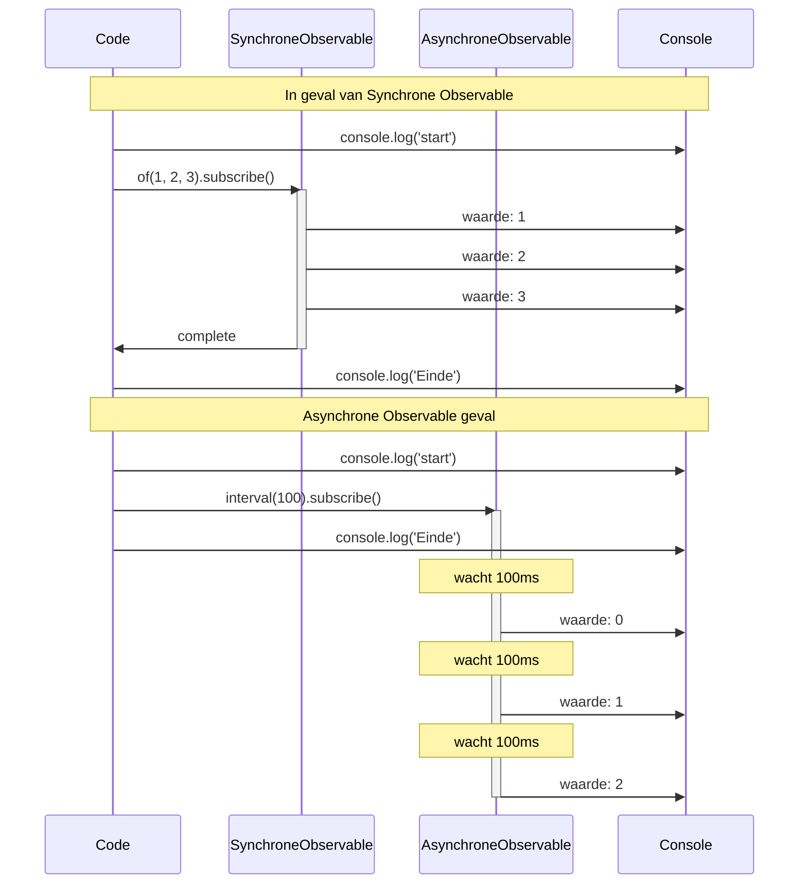
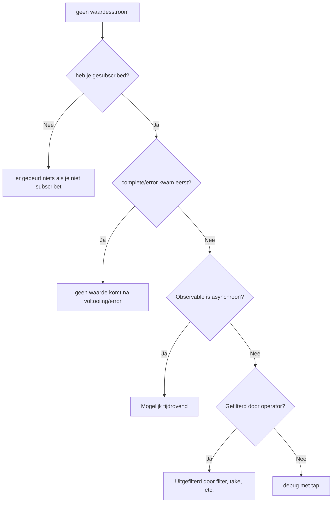

# Timing en Volgorde Begrijpen

In RxJS is het **"Waarom stroomt de waarde niet?" Is de volgorde verkeerd?"** heel gewoon om met dergelijke problemen geconfronteerd te worden. Deze pagina beschrijft basiskennis en praktische debuggingtechnieken om timing en volgorde correct te begrijpen.

## Wanneer stromen waarden?

### Probleem: Je denkt dat de waarde onmiddellijk zal stromen na subscribe

Een misvatting waar veel beginners in vallen is dat ze de waarde onmiddellijk zullen krijgen na subscribe.

#### ❌ Slecht voorbeeld: verwachten de waarde onmiddellijk te krijgen
```typescript
import { of } from 'rxjs';
import { delay } from 'rxjs';

let result: number | undefined;

of(42).pipe(
  delay(100)
).subscribe(value => {
  result = value;
});

console.log(result); // undefined (waarde nog niet aangekomen)
```

#### ✅ Goed voorbeeld: verwerken binnen subscribe
```typescript
import { of } from 'rxjs';
import { delay } from 'rxjs';

of(42).pipe(
  delay(100)
).subscribe(value => {
  console.log(value); // 42 wordt uitgevoerd na 100ms
});
```

> [!IMPORTANT] Belangrijke principes
> - Observable kan **asynchroon** zijn
> - Processen die waarden gebruiken moeten worden gedaan **in subscribe**
> - Verwacht geen waarden buiten subscribe

## Synchroon versus asynchroon begrijpen

### Synchrone Observable versus Asynchrone Observable

RxJS heeft zowel **synchrone** als **asynchrone** Observables.

#### Voorbeeld van Synchrone Observable

```typescript
import { of } from 'rxjs';

console.log('start');

of(1, 2, 3).subscribe(value => {
  console.log('waarde:', value);
});

console.log('Einde');

// Output:
// start
// waarde: 1
// waarde: 2
// waarde: 3
// Einde
```

#### Asynchrone Observable Voorbeeld

```typescript
import { interval } from 'rxjs';
import { take } from 'rxjs';

console.log('start');

interval(100).pipe(
  take(3)
).subscribe(value => {
  console.log('waarde:', value);
});

console.log('Einde');

// Output:
// start
// Einde
// waarde: 0  (na 100ms)
// waarde: 1  (na 200ms)
// waarde: 2  (na 300ms)
```

### Visualiseer synchrone versus asynchrone uitvoeringsstroom

Het volgende sequentiediagram illustreert het verschil in uitvoeringstiming tussen synchrone Observable en Observable.



> [!TIP] Timingverschillen
> - **Synchrone Observable**: voltooi verwerking in subscribe voordat je naar de volgende regel gaat
> - **Asynchrone Observable**: subscribe keert onmiddellijk terug, waarden stromen later

### Criteria voor synchroon/asynchroon

| Observable | Synchroon/Asynchroon | Reden |
|---|---|---|
| `of(1, 2, 3)` | Synchroon | Waarde wordt onmiddellijk bepaald |
| `from([1, 2, 3])` | Synchroon | Onmiddellijk beschikbaar vanuit array |
| `interval(1000)` | Asynchroon | Timer kost tijd |
| `fromEvent(button, 'click')` | Asynchroon | Wacht op gebruikersinteractie |
| `ajax('/api/data')` | Asynchroon | Wacht op HTTP-verzoek |
| `timer(1000)` | Asynchroon | Start na 1 seconde |
| `of(1).pipe(delay(100))` | Asynchroon | Vertraagd door delay |

### Veelvoorkomend probleem: mengen van synchroon en asynchroon

#### ❌ Slecht voorbeeld: geen gegarandeerde volgorde
```typescript
import { of } from 'rxjs';
import { delay } from 'rxjs';

console.log('1: start');

of('sync').subscribe(value => {
  console.log('2:', value);
});

of('asynchroon').pipe(
  delay(0) // asynchroon zelfs bij 0ms
).subscribe(value => {
  console.log('3:', value);
});

console.log('4: einde');

// Output:
// 1: start
// 2: sync
// 4: einde
// 3: asynchroon  ← delay(0) plaatst ook asynchroon in wachtrij
```

#### ✅ Goed voorbeeld: intentie verduidelijken
```typescript
import { of, concat } from 'rxjs';
import { delay } from 'rxjs';

// Gebruik concat als je de volgorde wilt garanderen
concat(
  of('eerste'),
  of('volgende').pipe(delay(100)),
  of('laatste')
).subscribe(value => {
  console.log(value);
});

// Output:
// eerste
// volgende    (na 100ms)
// laatste    (na 100ms)
```

## Hoe een Marble Diagram te lezen

Het Marble Diagram is een diagram dat het gedrag van Observable op een **tijdas** visualiseert.

### Basisnotatie

```
Tijdas:  ------a----b----c----|
            ↑     ↑    ↑    ↑    ↑
            start waarde a  waarde b  waarde c  complete

Betekenis van symbolen:
-  : Tijd verstreken (ca. 10ms)
a  : waarde uitgegeven (next)
|  : voltooiing (complete)
#  : error
() : gelijktijdige uitgifte (a,b)
```

### Praktisch voorbeeld 1: map operator

```
Input:  ----1----2----3----|
        map(x => x * 10)
Output: ----10---20---30---|
```

```typescript
import { of } from 'rxjs';
import { map, delay, concatMap } from 'rxjs';

of(1, 2, 3).pipe(
  concatMap(v => of(v).pipe(delay(100))), // pipe elke 100ms
  map(x => x * 10)
).subscribe(value => console.log(value));

// 100ms: 10
// 200ms: 20
// 300ms: 30
```

### Praktisch voorbeeld 2: merge

```
A:     ----a----b----|
B:     --c----d----e----|
       merge(A, B)
Output:  --c-a--d-b--e----|
```

```typescript
import { interval, merge } from 'rxjs';
import { map, take } from 'rxjs';

const a$ = interval(200).pipe(
  map(i => `A${i}`),
  take(2)
);

const b$ = interval(150).pipe(
  map(i => `B${i}`),
  take(3)
);

merge(a$, b$).subscribe(value => console.log(value));

// 150ms: B0
// 200ms: A0
// 300ms: B1
// 400ms: A1
// 450ms: B2
```

### Praktisch voorbeeld 3: switchMap (annuleren)

```
Buiten:  ----A------B----C----|
          switchMap(x => inner)
inner A:  ----1--2|  (annuleren bij B)
inner B:         ----3--4|  (geannuleerd door C)
inner C:              ----5--6|
Output:   ----1------3----5--6|
```

```typescript
import { fromEvent, interval } from 'rxjs';
import { switchMap, map, take } from 'rxjs';

const button = document.querySelector('button')!;

fromEvent(button, 'click').pipe(
  switchMap(() =>
    interval(100).pipe(
      map(i => `waarde${i}`),
      take(3)
    )
  )
).subscribe(value => console.log(value));

// klik 1 → waarde 0 → waarde 1 → (klik 2 om volgende te annuleren)
// klik 2 → waarde 0 → waarde 1 → waarde 2 → klaar
```

## Scheduler Rol

De Scheduler regelt **wanneer/hoe** de Observable waarden publiceert.

### Soorten Scheduler

| Scheduler | Gebruik | Beschrijving |
|---|---|---|
| **queueScheduler** | Synchrone verwerking | Onmiddellijk uitgevoerd in de huidige event loop |
| **asapScheduler** | Microtaken | Zelfde timing als Promise.then() |
| **asyncScheduler** | Macro taak | Zelfde timing als setTimeout() |
| **animationFrameScheduler** | Animatie | Zelfde timing als requestAnimationFrame() |

### Praktisch voorbeeld: timing regelen met observeOn

#### ❌ Slecht voorbeeld: UI geblokkeerd door synchroon proces
```typescript
import { range } from 'rxjs';
import { map } from 'rxjs';

console.log('start');

range(1, 1000000).pipe(
  map(x => x * x)
).subscribe(value => {
  // 1 miljoen berekeningen worden synchroon uitgevoerd → UI bevriest
});

console.log('Einde'); // output na afronding berekening
```

#### ✅ Goed voorbeeld: asynchroon met asyncScheduler
```typescript
import { range, asyncScheduler } from 'rxjs';
import { map, observeOn } from 'rxjs';

console.log('start');

range(1, 1000000).pipe(
  map(x => x * x),
  observeOn(asyncScheduler) // zet in async wachtrij
).subscribe(value => {
  // voer asynchroon uit → UI wordt niet geblokkeerd
});

console.log('Einde'); // output onmiddellijk
```

> [!TIP] Waar Scheduler te gebruiken
> - **Zware berekeningsverwerking**: asynchroon maken met asyncScheduler om blokkeren van UI te vermijden
> - **Animatie**: Vloeiend tekenen met animationFrameScheduler
> - **Testen**: virtualiseer tijd met TestScheduler

Zie **[Hoofdstuk 7: Scheduler Gebruiken](/nl/guide/schedulers/async-control)** voor details.

## Veelvoorkomende problemen en debugmethoden

### Probleem 1: Waarden stromen niet

#### Checklist



#### Debuggingtechniek: tap gebruiken

```typescript
import { of } from 'rxjs';
import { map, filter, tap } from 'rxjs';

console.log('start');

of(1, 2, 3, 4, 5).pipe(
  tap(v => console.log('👁️ Originele waarde:', v)),
  filter(x => x % 2 === 0),
  tap(v => console.log('✅ Filter gepasseerd:', v)),
  map(x => x * 10),
  tap(v => console.log('🔄 Na conversie door map:', v))
).subscribe(result => {
  console.log('📦 eindresultaat:', result);
});

console.log('Einde');

// Output:
// start
// 👁️ Originele waarde: 1
// 👁️ Originele waarde: 2
// ✅ Filter gepasseerd: 2
// 🔄 Na conversie door map: 20
// 📦 eindresultaat: 20
// 👁️ Originele waarde: 3
// 👁️ Originele waarde: 4
// ✅ Filter gepasseerd: 4
// 🔄 Na conversie door map: 40
// 📦 eindresultaat: 40
// 👁️ Originele waarde: 5
// Einde
```

> [!NOTE] Punt
> `of()` is synchrone Observable, dus het "Einde" wordt uitgevoerd nadat alle verwerking in subscribe voltooid is. tap kan tussen elke stap worden ingevoegd om de stroom van waarden te volgen.

### Probleem 2: Volgorde is niet zoals verwacht

#### ❌ Slecht voorbeeld: mergeMap verstoort de volgorde
```typescript
import { of } from 'rxjs';
import { mergeMap, delay } from 'rxjs';

of(1, 2, 3).pipe(
  mergeMap(x =>
    of(x * 10).pipe(
      delay(Math.random() * 100) // willekeurige vertraging
    )
  )
).subscribe(value => console.log(value));

// Voorbeeldoutput: 20, 10, 30 (volgorde niet gegarandeerd)
```

#### ✅ Goed voorbeeld: volgorde gegarandeerd met concatMap
```typescript
import { of } from 'rxjs';
import { concatMap, delay } from 'rxjs';

of(1, 2, 3).pipe(
  concatMap(x =>
    of(x * 10).pipe(
      delay(Math.random() * 100)
    )
  )
).subscribe(value => console.log(value));

// Output: 10, 20, 30 (altijd in die volgorde)
```

### Probleem 3: Geen voltooiing (oneindige stream)

#### ❌ Slecht voorbeeld: operator vast aan het wachten op voltooiing
```typescript
import { interval } from 'rxjs';
import { reduce } from 'rxjs';

interval(1000).pipe(
  reduce((acc, val) => acc + val, 0) // voltooit nooit
).subscribe(total => {
  console.log(total); // deze regel wordt niet uitgevoerd
});
```

#### ✅ Goed voorbeeld: take om te scheiden
```typescript
import { interval } from 'rxjs';
import { reduce, take } from 'rxjs';

interval(1000).pipe(
  take(5),                            // krijg alleen 5
  reduce((acc, val) => acc + val, 0)  // som na voltooiing
).subscribe(total => {
  console.log('totaal:', total); // voert "totaal: 10" uit na 5 seconden
});
```

## Debugtools en -technieken

### 1. Logoutput met tap

```typescript
import { of } from 'rxjs';
import { map, filter, tap } from 'rxjs';

const debug = <T>(label: string) => tap<T>(value =>
  console.log(`[${label}]`, value)
);

of(1, 2, 3, 4, 5).pipe(
  debug('🔵 input'),
  filter(x => x > 2),
  debug('🟢 na filter'),
  map(x => x * 10),
  debug('🟡 na map')
).subscribe();

// [🔵 input] 1
// [🔵 input] 2
// [🔵 input] 3
// [🟢 na filter] 3
// [🟡 na map] 30
// [🔵 input] 4
// [🟢 na filter] 4
// [🟡 na map] 40
// [🔵 input] 5
// [🟢 na filter] 5
// [🟡 na map] 50
```

### 2. RxJS DevTools (browserextensie)

De Chrome/Edge-extensie "RxJS DevTools" stelt je in staat om:

- Real-time monitoring van alle Observables
- Visualisatie in Marble Diagram
- Volg subscribe/unsubscribe

#### Hoe te installeren
1. Zoek naar "RxJS DevTools" in de Chrome Web Store
2. Voeg de extensie toe
3. Open het "RxJS" tabblad in DevTools

### 3. Aangepaste debug operator

```typescript
import { interval, map, take, tap, timestamp } from "rxjs";
import { MonoTypeOperatorFunction } from 'rxjs';


function debugWithTime<T>(label: string): MonoTypeOperatorFunction<T> {
  return source => source.pipe(
    timestamp(),
    tap(({ value, timestamp }) => {
      console.log(`[${label}] ${new Date(timestamp).toISOString()}:`, value);
    }),
    map(({ value }) => value)
  );
}

// Gebruik
interval(500).pipe(
  take(3),
  debugWithTime('⏰ timer'),
  map(x => x * 10),
  debugWithTime('🔄 na conversie')
).subscribe();

// [⏰ timer] 2025-10-19T10:20:59.467Z: 0
// [🔄 na conversie] 2025-10-19T10:20:59.467Z: 0
// [⏰ timer] 2025-10-19T10:20:59.967Z: 1
// [🔄 na conversie] 2025-10-19T10:20:59.967Z: 10
// [⏰ timer] 2025-10-19T10:21:00.467Z: 2
// [🔄 na conversie] 2025-10-19T10:21:00.468Z: 20
```

### 4. Marble Testing (testverificatie)

```typescript
import { TestScheduler } from 'rxjs/testing';
import { map } from 'rxjs';

describe('timing testen', () => {
  let scheduler: TestScheduler;

  beforeEach(() => {
    scheduler = new TestScheduler((actual, expected) => {
      expect(actual).toEqual(expected);
    });
  });

  it('map converteert waarden', () => {
    scheduler.run(({ cold, expectObservable }) => {
      const input$  = cold('--a--b--c--|', { a: 1, b: 2, c: 3 });
      const expected =     '--x--y--z--|';
      const result$ = input$.pipe(map(v => v * 10));

      expectObservable(result$).toBe(expected, { x: 10, y: 20, z: 30 });
    });
  });
});
```

Zie **[Hoofdstuk 9: Marble Testing](/nl/guide/testing/marble-testing)** voor details.

## Begripschecklist

Controleer of je de volgende vragen kunt beantwoorden.

```markdown
## Basiskennis
- [ ] Leg het verschil uit tussen synchrone en asynchrone Observable
- [ ] Lees de basisnotatie (-, a, |, #) in het Marble Diagram
- [ ] Begrijp dat waarden niet kunnen stromen zonder subscribe

## Timingcontrole
- [ ] Leg het verschil uit tussen delay, debounceTime en throttleTime
- [ ] Begrijp de rol van Scheduler
- [ ] Leg het verschil uit tussen observeOn en subscribeOn

## Debuggen
- [ ] Debug de stroom van waarden met tap
- [ ] Identificeer waarom waarden niet stromen
- [ ] Weet wat te doen als de volgorde anders is dan verwacht

## Praktijk
- [ ] Scheid een oneindige Observable met take
- [ ] Implementeer het verschil tussen mergeMap en concatMap volgorde
- [ ] Kan de timing van fouten regelen met catchError
```

## Volgende Stappen

Zodra je timing en volgorde begrijpt, is de volgende stap om te leren over **state management en delen**.

→ **[Moeilijkheden met state management](/nl/guide/overcoming-difficulties/state-and-sharing)** - Subject, share/shareReplay gebruik

## Gerelateerde Pagina's

- **[Hoofdstuk 7: Scheduler Gebruiken](/nl/guide/schedulers/async-control)** - Details van Scheduler
- **[Hoofdstuk 9: Marble Testing](/nl/guide/testing/marble-testing)** - Timing testen met TestScheduler
- **[Hoofdstuk 8: Debugtechnieken voor RxJS](/nl/guide/debugging/)** - Debuggen in het algemeen
- **[Operator Selectie Raadsel](/nl/guide/overcoming-difficulties/operator-selection)** - Hoe de juiste operator te kiezen

## 🎯 Oefenproblemen

### Probleem 1: Onderscheid maken tussen synchroon en asynchroon

Is de volgende Observable synchroon of asynchroon?

```typescript
// A
of(1, 2, 3)

// B
from([1, 2, 3])

// C
of(1, 2, 3).pipe(delay(0))

// D
Promise.resolve(42)

// E
interval(1000).pipe(take(3))
```

<details>
<summary>Oplossing</summary>

- **A: Synchroon** - `of` publiceert de waarde onmiddellijk
- **B: Synchroon** - `from` breidt array onmiddellijk uit
- **C: Asynchroon** - `delay(0)` plaatst ook asynchroon in wachtrij
- **D: Asynchroon** - Promise is altijd asynchroon
- **E: Asynchroon** - `interval` is timer-gebaseerd

> [!NOTE] Punt
> `delay(0)` en `Promise` worden behandeld als asynchroon zelfs als de vertraging 0 ms is.

</details>

### Probleem 2: Een Marble Diagram lezen

Voorspel de output van het volgende Marble Diagram.

```typescript
import { of, zip } from 'rxjs';
import { delay } from 'rxjs';

const a$ = of(1, 2, 3);
const b$ = of('A', 'B', 'C').pipe(delay(100));

zip(a$, b$).subscribe(console.log);
```

```
Marble Diagram:
a$:  (123)|
b$:  -----(ABC)|
     zip(a$, b$)
Output: ?
```

<details>
<summary>Oplossing</summary>

```typescript
// output in één keer na 100ms:
[1, 'A']
[2, 'B']
[3, 'C']
```

> [!NOTE] Reden
> `zip` wacht tot waarden beschikbaar zijn uit beide streams, dus het zal niet uitvoeren totdat delay(100) op `b$` is vrijgegeven. `a$` geeft waarden synchroon uit, maar wacht op `b$` voordat paren worden gemaakt.

</details>

### Probleem 3: Volgorde Garanderen

In de volgende code, welke operator moet ik gebruiken als ik de outputvolgorde wil garanderen?

```typescript
import { of } from 'rxjs';
import { mergeMap, delay } from 'rxjs';

of('A', 'B', 'C').pipe(
  mergeMap(letter =>
    of(`${letter} voltooid`).pipe(
      delay(Math.random() * 100)
    )
  )
).subscribe(console.log);

// huidige output: willekeurige volgorde (bijv., B voltooid, A voltooid, C voltooid)
// verwachte output: A voltooid, B voltooid, C voltooid
```

<details>
<summary>Oplossing</summary>

**Gewijzigde code:**
```typescript
import { of } from 'rxjs';
import { concatMap, delay } from 'rxjs';

of('A', 'B', 'C').pipe(
  concatMap(letter =>  // mergeMap → concatMap
    of(`${letter} voltooid`).pipe(
      delay(Math.random() * 100)
    )
  )
).subscribe(console.log);

// Output: A voltooid, B voltooid, C voltooid (altijd in die volgorde)
```

> [!NOTE] Reden
> - `mergeMap`: parallelle uitvoering, dus voltooiingsvolgorde is niet gegarandeerd
> - `concatMap`: sequentiële uitvoering, output in dezelfde volgorde als input

</details>

### Probleem 4: Omgaan met oneindige streams

Wijs het probleem in de volgende code aan en corrigeer het.

```typescript
import { interval } from 'rxjs';
import { map, toArray } from 'rxjs';

interval(1000).pipe(
  map(x => x * 2),
  toArray()
).subscribe(arr => {
  console.log('Array:', arr); // wordt deze regel uitgevoerd?
});
```

<details>
<summary>Oplossing</summary>

**Probleem:**
- `interval` geeft waarden oneindig uit, dus het voltooit nooit
- `toArray()` wacht op voltooiingssignaal, dus geen waarde wordt voor altijd uitgegeven

**Gecorrigeerde code:**
```typescript
import { interval } from 'rxjs';
import { map, take, toArray } from 'rxjs';

interval(1000).pipe(
  take(5),          // krijg alleen 5 en klaar
  map(x => x * 2),
  toArray()
).subscribe(arr => {
  console.log('Array:', arr); // [0, 2, 4, 6, 8]
});
```

> [!IMPORTANT] Punt
> Bij het gebruik van `reduce`, `toArray`, `last`, of andere "wacht op voltooiing operators" voor een oneindige stream, moet je deze altijd scheiden met `take`, `first`, `takeUntil`, etc.

</details>
