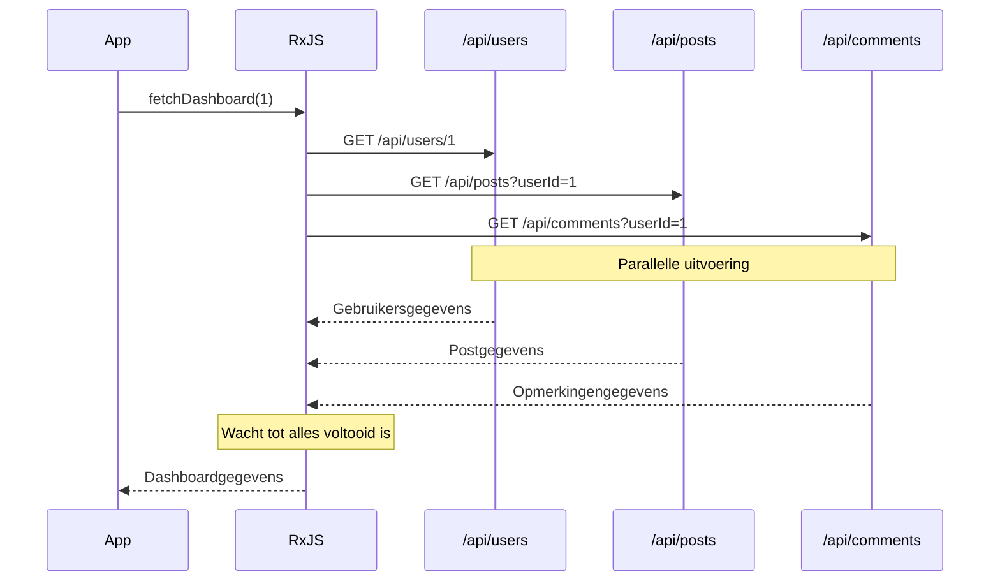
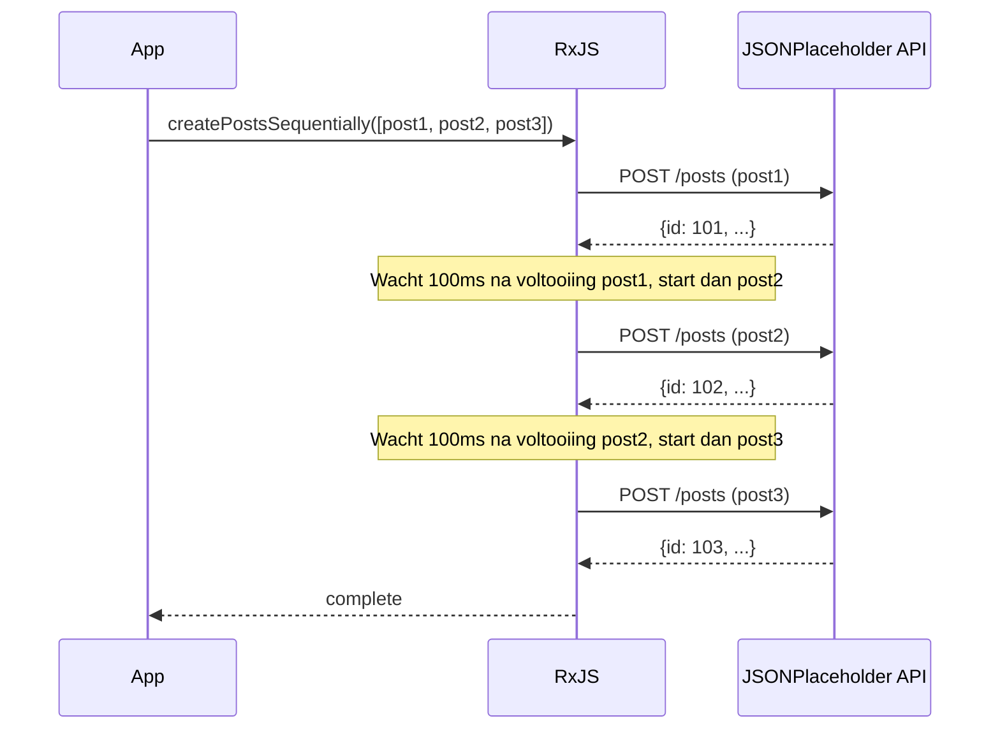
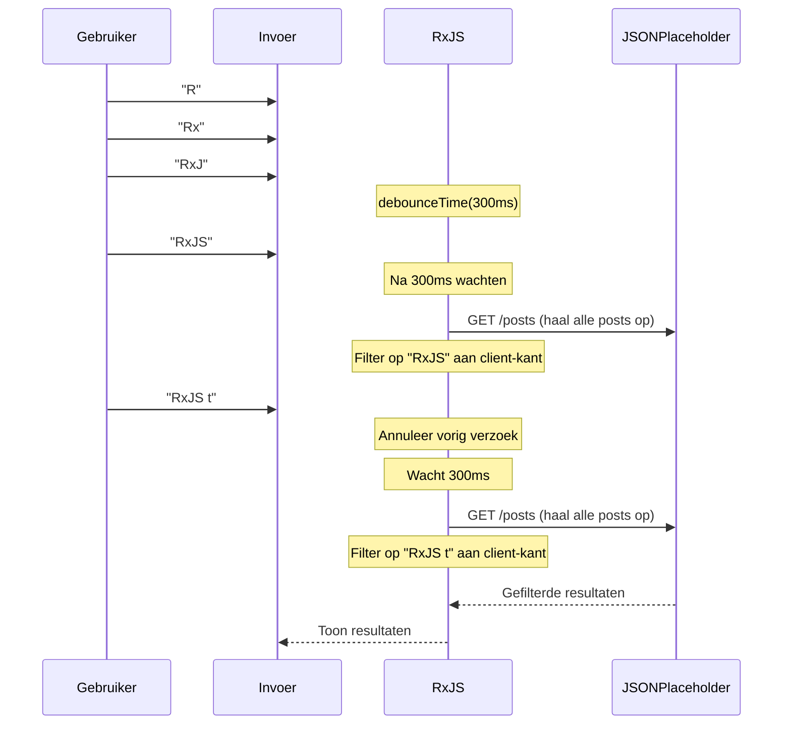

# API-aanroeppatronen

API-aanroepen zijn een van de meest frequent geïmplementeerde processen in webontwikkeling. RxJS stelt u in staat om complexe asynchrone API-aanroepen declaratief en robuust te implementeren.

Dit artikel beschrijft concrete implementatiepatronen voor verschillende API-aanroepscenario's die in de praktijk voorkomen, inclusief foutafhandeling en annuleringsprocessen.

## Wat u in dit artikel leert

- Basis GET/POST-verzoekimplementatie
- Parallelle aanroep van meerdere API's (forkJoin)
- Seriële verzoeken die sequentiële uitvoering vereisen (concatMap)
- Koppeling van verzoeken met afhankelijkheden (switchMap)
- Retry en foutafhandeling
- Timeout-afhandeling
- Annulering van verzoeken

> [!TIP] Vereisten
> Dit artikel veronderstelt kennis van [Hoofdstuk 4: Operators](../operators/index.md) en [Hoofdstuk 6: Foutafhandeling](../error-handling/strategies.md).

## Basis API-aanroepen

### Probleem: Eenvoudige GET-verzoek

Het meest basale geval implementeert een enkel GET-verzoek.

### Implementatievoorbeeld

```typescript
import { from, Observable, map, catchError, timeout } from 'rxjs';

// JSONPlaceholder API User type
// https://jsonplaceholder.typicode.com/users
interface User {
  id: number;
  name: string;
  username: string;
  email: string;
  address: {
    street: string;
    suite: string;
    city: string;
    zipcode: string;
    geo: {
      lat: string;
      lng: string;
    };
  };
  phone: string;
  website: string;
  company: {
    name: string;
    catchPhrase: string;
    bs: string;
  };
}

// Haal een lijst met gebruikers op
function fetchUsers(): Observable<User[]> {
  return from(
    fetch('https://jsonplaceholder.typicode.com/users')
      .then(response => {
        if (!response.ok) {
          throw new Error(`HTTP error! status: ${response.status}`);
        }
        return response.json();
      })
  ).pipe(
    timeout(5000), // Timeout na 5 seconden
    catchError(err => {
      console.error('Fout bij ophalen gebruiker:', err);
      throw err;
    })
  );
}

// Gebruiksvoorbeeld
fetchUsers().subscribe({
  next: users => {
    console.log('Gebruikerslijst:', users);
    console.log('Eerste gebruiker:', users[0].name); // Voorbeeld: "Leanne Graham"
  },
  error: err => console.error('Fout:', err)
});
```

> [!NOTE] from() vs ajax()
> Dit voorbeeld wikkelt de standaard `fetch` in met `from()`, maar u kunt ook de officiële RxJS `ajax()` gebruiken. `ajax()` is geavanceerder en ondersteunt annulering van verzoeken en voortgangsbewaking.

### POST-verzoek

Dit patroon is voor het maken van nieuwe gegevens.

```typescript
import { from, Observable, catchError } from 'rxjs';

// JSONPlaceholder API Post type
// https://jsonplaceholder.typicode.com/posts
interface Post {
  id: number;
  userId: number;
  title: string;
  body: string;
}

interface CreatePostRequest {
  userId: number;
  title: string;
  body: string;
}

function createPost(postData: CreatePostRequest): Observable<Post> {
  return from(
    fetch('https://jsonplaceholder.typicode.com/posts', {
      method: 'POST',
      headers: {
        'Content-Type': 'application/json',
      },
      body: JSON.stringify(postData)
    }).then(response => {
      if (!response.ok) {
        throw new Error(`HTTP error! status: ${response.status}`);
      }
      return response.json();
    })
  ).pipe(
    catchError(err => {
      console.error('Fout bij aanmaken post:', err);
      throw err;
    })
  );
}

// Gebruiksvoorbeeld
createPost({
  userId: 1,
  title: 'RxJS leren',
  body: 'API-aanroeppatronen leren met RxJS.'
}).subscribe({
  next: post => {
    console.log('Post aangemaakt:', post);
    console.log('Post ID:', post.id); // JSONPlaceholder wijst automatisch een ID toe (bijv. 101)
  },
  error: err => console.error('Fout:', err)
});
```

> [!TIP] Praktische tips
> - **Type-veiligheid**: Definieer responstypen duidelijk
> - **Foutafhandeling**: Controleer HTTP-statuscodes correct
> - **Timeouts**: Voorkom lange wachttijden

## Parallelle verzoeken (forkJoin)

### Probleem: Ik wil meerdere API's tegelijkertijd aanroepen

U wilt mogelijk meerdere onafhankelijke API's parallel aanroepen en doorgaan met de verwerking nadat alle reacties zijn ontvangen.

### Oplossing: Gebruik forkJoin

`forkJoin` wacht tot meerdere Observables allemaal voltooid zijn en retourneert alle resultaten in een array (equivalent aan Promise.all).

```typescript
import { forkJoin, from, Observable, map } from 'rxjs';

// JSONPlaceholder API Comment type
// https://jsonplaceholder.typicode.com/comments
interface Comment {
  postId: number;
  id: number;
  name: string;
  email: string;
  body: string;
}
interface Post {
  id: number;
  userId: number;
  title: string;
  body: string;
}
interface User {
  id: number;
  name: string;
  username: string;
  email: string;
  address: {
    street: string;
    suite: string;
    city: string;
    zipcode: string;
    geo: {
      lat: string;
      lng: string;
    };
  };
  phone: string;
  website: string;
  company: {
    name: string;
    catchPhrase: string;
    bs: string;
  };
}
interface Dashboard {
  user: User;
  posts: Post[];
  comments: Comment[];
}

function fetchUserById(id: number): Observable<User> {
  return from(
    fetch(`https://jsonplaceholder.typicode.com/users/${id}`).then(r => r.json())
  );
}

function fetchPostsByUserId(userId: number): Observable<Post[]> {
  return from(
    fetch(`https://jsonplaceholder.typicode.com/posts?userId=${userId}`).then(r => r.json())
  );
}

function fetchCommentsByPostId(postId: number): Observable<Comment[]> {
  return from(
    fetch(`https://jsonplaceholder.typicode.com/comments?postId=${postId}`).then(r => r.json())
  );
}

// Haal dashboardgegevens parallel op
function fetchDashboard(userId: number): Observable<Dashboard> {
  return forkJoin({
    user: fetchUserById(userId),
    posts: fetchPostsByUserId(userId),
    comments: fetchCommentsByPostId(1) // Haal opmerkingen op voor post ID=1
  }).pipe(
    map(({ user, posts, comments }) => ({
      user,
      posts,
      comments
    }))
  );
}

// Gebruiksvoorbeeld
fetchDashboard(1).subscribe({
  next: dashboard => {
    console.log('Gebruiker:', dashboard.user.name); // Voorbeeld: "Leanne Graham"
    console.log('Aantal posts:', dashboard.posts.length); // Voorbeeld: 10
    console.log('Aantal opmerkingen:', dashboard.comments.length); // Voorbeeld: 5
  },
  error: err => console.error('Fout bij ophalen dashboard:', err)
});
```

#### Uitvoeringsflow



> [!IMPORTANT] Kenmerken van forkJoin
> - Wacht tot alle Observables voltooid zijn
> - **Als er één mislukt, mislukt de hele operatie**
> - Alle Observables moeten minimaal één waarde uitgeven

### Verbeterde foutafhandeling

Bij parallelle verzoeken wilt u mogelijk andere resultaten ophalen, zelfs als sommige mislukken.

```typescript
import { forkJoin, of, catchError } from 'rxjs';

function fetchDashboardWithFallback(userId: number): Observable<Dashboard> {
  return forkJoin({
    user: fetchUserById(userId).pipe(
      catchError(err => {
        console.error('Fout bij ophalen gebruiker:', err);
        return of(null); // Retourneer null bij fout
      })
    ),
    posts: fetchPostsByUserId(userId).pipe(
      catchError(err => {
        console.error('Fout bij ophalen posts:', err);
        return of([]); // Retourneer lege array bij fout
      })
    ),
    comments: fetchCommentsByUserId(userId).pipe(
      catchError(err => {
        console.error('Fout bij ophalen opmerkingen:', err);
        return of([]); // Retourneer lege array bij fout
      })
    )
  }).pipe(
    map(({ user, posts, comments }) => ({
      user: user || { id: userId, name: 'Onbekend', email: '' },
      posts,
      comments
    }))
  );
}
```

> [!TIP] Gedeeltelijke foutafhandeling
> Door `catchError` toe te passen op elke Observable, kan het hele proces doorgaan, zelfs als een deel ervan mislukt.

## Seriële verzoeken (concatMap)

### Probleem: Ik wil API's op volgorde uitvoeren

U wilt het volgende verzoek uitvoeren nadat het vorige verzoek is voltooid (bijv. meerdere bestandsuploads achter elkaar).

### Oplossing: Gebruik concatMap

`concatMap` voert de volgende Observable uit nadat de vorige is voltooid.

```typescript
import { from, Observable, concatMap, tap, delay, catchError } from 'rxjs';

// JSONPlaceholder API Post type
// https://jsonplaceholder.typicode.com/posts
interface Post {
  id: number;
  userId: number;
  title: string;
  body: string;
}

interface CreatePostRequest {
  userId: number;
  title: string;
  body: string;
}

function createPost(postData: CreatePostRequest): Observable<Post> {
  return from(
    fetch('https://jsonplaceholder.typicode.com/posts', {
      method: 'POST',
      headers: {
        'Content-Type': 'application/json',
      },
      body: JSON.stringify(postData)
    }).then(response => {
      if (!response.ok) {
        throw new Error(`HTTP error! status: ${response.status}`);
      }
      return response.json();
    })
  ).pipe(
    catchError(err => {
      console.error('Fout bij aanmaken post:', err);
      throw err;
    })
  );
}

// Maak meerdere posts achter elkaar aan (rekening houdend met API-snelheidslimieten)
function createPostsSequentially(posts: CreatePostRequest[]): Observable<Post> {
  return from(posts).pipe(
    concatMap((postData, index) =>
      createPost(postData).pipe(
        tap(result => console.log(`Post ${index + 1} aanmaken voltooid:`, result.title)),
        delay(100) // Wacht 100ms rekening houdend met API-snelheidslimiet
      )
    )
  );
}

// Gebruiksvoorbeeld
const postsToCreate: CreatePostRequest[] = [
  {
    userId: 1,
    title: 'Eerste post',
    body: 'Dit is de eerste post.'
  },
  {
    userId: 1,
    title: 'Tweede post',
    body: 'Dit is de tweede post.'
  },
  {
    userId: 1,
    title: 'Derde post',
    body: 'Dit is de derde post.'
  }
];

const results: Post[] = [];

createPostsSequentially(postsToCreate).subscribe({
  next: post => {
    results.push(post);
    console.log(`Voortgang: ${results.length}/${postsToCreate.length}`);
  },
  complete: () => {
    console.log('Alle posts aangemaakt:', results.length, 'posts');
  },
  error: err => console.error('Fout bij aanmaken post:', err)
});
```

#### Uitvoeringsflow



> [!NOTE] concatMap vs mergeMap
> - **concatMap**: Voer op volgorde uit (vorige voltooid, dan volgende)
> - **mergeMap**: Voer parallel uit (meerdere gelijktijdige uitvoeringen mogelijk)
>
> Gebruik `concatMap` wanneer volgorde belangrijk is, `mergeMap` wanneer volgorde niet uitmaakt en snelheid prioriteit heeft.

## Verzoeken met afhankelijkheden (switchMap)

### Probleem: De volgende API aanroepen met de vorige API-reactie

Een van de meest voorkomende patronen, het gebruik van het resultaat van de eerste API-reactie om de volgende API aan te roepen.

### Oplossing: Gebruik switchMap

`switchMap` neemt de waarde van de vorige Observable en converteert deze naar een nieuwe Observable.

```typescript
import { from, Observable, switchMap, map } from 'rxjs';

interface UserProfile {
  user: User;
  posts: Post[];
}
interface Post {
  id: number;
  userId: number;
  title: string;
  body: string;
}
interface User {
  id: number;
  name: string;
  username: string;
  email: string;
  address: {
    street: string;
    suite: string;
    city: string;
    zipcode: string;
    geo: {
      lat: string;
      lng: string;
    };
  };
  phone: string;
  website: string;
  company: {
    name: string;
    catchPhrase: string;
    bs: string;
  };
}

function fetchUserById(id: number): Observable<User> {
  return from(
    fetch(`https://jsonplaceholder.typicode.com/users/${id}`).then(r => r.json())
  );
}

function fetchPostsByUserId(userId: number): Observable<Post[]> {
  return from(
    fetch(`https://jsonplaceholder.typicode.com/posts?userId=${userId}`).then(r => r.json())
  );
}

// Haal gebruikersdetails en hun posts op
function fetchUserProfile(userId: number): Observable<UserProfile> {
  return fetchUserById(userId).pipe(
    switchMap(user =>
      // Na het ophalen van gebruikersinfo, haal hun posts op
      fetchPostsByUserId(user.id).pipe(
        map(posts => ({
          user,
          posts
        }))
      )
    )
  );
}

// Gebruiksvoorbeeld
fetchUserProfile(1).subscribe({
  next: profile => {
    console.log('Gebruiker:', profile.user.name);
    console.log('Posts:', profile.posts);
  },
  error: err => console.error('Fout:', err)
});
```

### Praktisch voorbeeld: Zoekfunctionaliteit-implementatie

Een veelvoorkomend patroon in de praktijk: API's aanroepen op basis van gebruikerszoekinvoer.

```typescript
import { from, fromEvent, Observable, of, map, debounceTime, distinctUntilChanged, switchMap, catchError } from 'rxjs';

// Gebruik JSONPlaceholder Post als zoekresultaat
interface SearchResult {
  id: number;
  userId: number;
  title: string;
  body: string;
}

function searchAPI(query: string): Observable<SearchResult[]> {
  return from(
    fetch('https://jsonplaceholder.typicode.com/posts')
      .then(response => {
        if (!response.ok) {
          throw new Error(`HTTP error! status: ${response.status}`);
        }
        return response.json();
      })
  ).pipe(
    // Client-side filtering op titel
    map((posts: SearchResult[]) =>
      posts.filter(post =>
        post.title.toLowerCase().includes(query.toLowerCase())
      )
    )
  );
}

// Traditionele aanpak (ter referentie in commentaar)
// const searchInput = document.querySelector<HTMLInputElement>('#search');

// Zelfvoorzienend: maakt dynamisch zoekinvoer en resultatencontainer aan
const searchInput = document.createElement('input');
searchInput.id = 'search';
searchInput.type = 'text';
searchInput.placeholder = 'Voer zoekwoorden in (minimaal 2 tekens)';
searchInput.style.padding = '10px';
searchInput.style.margin = '10px';
searchInput.style.width = '400px';
searchInput.style.fontSize = '16px';
searchInput.style.border = '2px solid #ccc';
searchInput.style.borderRadius = '4px';
searchInput.style.display = 'block';
document.body.appendChild(searchInput);

const resultsContainer = document.createElement('div');
resultsContainer.id = 'results';
resultsContainer.style.padding = '10px';
resultsContainer.style.margin = '10px';
resultsContainer.style.minHeight = '100px';
resultsContainer.style.border = '1px solid #ddd';
resultsContainer.style.borderRadius = '4px';
resultsContainer.style.backgroundColor = '#f9f9f9';
document.body.appendChild(resultsContainer);

const search$ = fromEvent(searchInput, 'input').pipe(
  map(event => (event.target as HTMLInputElement).value),
  debounceTime(300),           // Wacht 300ms na invoer
  distinctUntilChanged(),      // Negeer als de waarde hetzelfde is als vorige keer
  switchMap(query => {
    if (query.length < 2) {
      return of([]); // Lege array als minder dan 2 tekens
    }
    return searchAPI(query).pipe(
      catchError(err => {
        console.error('Zoekfout:', err);
        return of([]); // Lege array bij fout
      })
    );
  })
);

search$.subscribe(results => {
  console.log('Zoekresultaten:', results);
  // Toon resultaten in UI
  displayResults(results, resultsContainer);
});

function displayResults(results: SearchResult[], container: HTMLElement): void {
  // Toon resultaten in de DOM
  container.innerHTML = results
    .map(r => `<div style="padding: 8px; margin: 4px; border-bottom: 1px solid #eee;">${r.title}</div>`)
    .join('');

  if (results.length === 0) {
    container.innerHTML = '<div style="padding: 8px; color: #999;">Geen zoekresultaten</div>';
  }
}
```

> [!TIP] Client-side filtering
> Aangezien de JSONPlaceholder API geen zoek-endpoint heeft, worden alle posts opgehaald en gefilterd aan de client-kant. In de praktijk wordt dit patroon gebruikt wanneer de backend geen zoekfunctie heeft of wanneer de hoeveelheid gegevens klein is.
>
> **Voorbeeldzoekopdrachten**:
> - Zoek naar "sunt" → Meerdere posts gevonden
> - Zoek met "qui est esse" → Gevonden op titels met "qui est esse"
> - Zoek met "zzz" → Geen resultaten gevonden (N.v.t.)

#### Uitvoeringsflow



> [!IMPORTANT] Belangrijke eigenschappen van switchMap
> **Annuleert automatisch de vorige Observable wanneer een nieuwe waarde arriveert.**
> Dit zorgt ervoor dat reacties op oudere API-verzoeken worden genegeerd, zelfs als ze later arriveren (vermijdt Race Condition).

### switchMap vs mergeMap vs concatMap

Dit is het gebruik van higher-order mapping operators.

| Operator | Gedrag | Gebruikssituatie |
|----------|--------|------------------|
| `switchMap` | Annuleer vorige wanneer nieuwe waarde arriveert | **Zoeken, autocomplete** (alleen het laatste resultaat is nodig) |
| `mergeMap` | Voer alles parallel uit | **Parallelle verwerking** (elke volgorde, alle resultaten nodig) |
| `concatMap` | Voer op volgorde uit (vorige voltooid, dan volgende) | **Processen waarbij volgorde belangrijk is** (bijv. bestandsuploads) |
| `exhaustMap` | Negeer nieuwe waarden totdat de vorige voltooid is | **Voorkom dubbele indiening** (tegenmaatregel tegen opeenvolgende knopindrukken) |

```typescript
// switchMap: Toon alleen de laatste zoekresultaten
searchInput$.pipe(
  switchMap(query => searchAPI(query))
);

// mergeMap: Upload alle bestanden parallel
from(files).pipe(
  mergeMap(file => uploadFile(file))
);

// concatMap: Upload bestanden achter elkaar
from(files).pipe(
  concatMap(file => uploadFile(file))
);

// exhaustMap: Voorkom dubbele indiening van formulierinzendingen
submitButton$.pipe(
  exhaustMap(() => submitForm())
);
```

## Retry en foutafhandeling

### Probleem: Ik wil tijdelijke netwerkfouten afhandelen

Wanneer een netwerkfout of timeout optreedt, wilt u mogelijk automatisch opnieuw proberen.

### Oplossing: Gebruik retry en retryWhen

```typescript
import { from, Observable, timer } from 'rxjs';
import { retry, retryWhen, mergeMap, catchError, of, timeout } from 'rxjs';

// JSONPlaceholder API User type
// https://jsonplaceholder.typicode.com/users
interface User {
  id: number;
  name: string;
  username: string;
  email: string;
  address: {
    street: string;
    suite: string;
    city: string;
    zipcode: string;
    geo: {
      lat: string;
      lng: string;
    };
  };
  phone: string;
  website: string;
  company: {
    name: string;
    catchPhrase: string;
    bs: string;
  };
}

function fetchUsers(): Observable<User[]> {
  return from(
    fetch('https://jsonplaceholder.typicode.com/users')
      .then(response => {
        if (!response.ok) {
          throw new Error(`HTTP error! status: ${response.status}`);
        }
        return response.json();
      })
  ).pipe(
    timeout(5000), // Timeout na 5 seconden
    catchError(err => {
      console.error('Fout bij ophalen gebruiker:', err);
      throw err;
    })
  );
}

// Eenvoudige retry (maximaal 3 keer direct)
function fetchWithSimpleRetry(): Observable<User[]> {
  return fetchUsers().pipe(
    retry(3), // Probeer maximaal 3 keer opnieuw bij fout
    catchError(err => {
      console.error('Fout na retry:', err);
      return of([]); // Retourneer lege array bij definitieve fout
    })
  );
}

// Retry met exponentiële backoff
function fetchWithExponentialBackoff(): Observable<User[]> {
  return fetchUsers().pipe(
    retryWhen(errors =>
      errors.pipe(
        mergeMap((error, index) => {
          const retryAttempt = index + 1;

          // Probeer maximaal 3 keer opnieuw
          if (retryAttempt > 3) {
            throw error;
          }

          // Exponentiële backoff: 1, 2, 4 seconden
          const delayMs = Math.pow(2, index) * 1000;
          console.log(`Retry ${retryAttempt}/3 (na ${delayMs}ms)`);

          return timer(delayMs);
        })
      )
    ),
    catchError(err => {
      console.error('Fout zelfs na retry:', err);
      return of([]);
    })
  );
}

// Gebruiksvoorbeeld
fetchWithExponentialBackoff().subscribe({
  next: users => console.log('Gebruiker succesvol opgehaald:', users),
  error: err => console.error('Definitieve fout:', err)
});
```

**Voorbeeld van exponentiële backoff in actie:**

```
1e poging: Voer direct uit
↓ Fout
2e poging: Voer uit na 1 seconde wachten
↓ Fout
3e poging: Voer uit na 2 seconden wachten
↓ Fout
4e poging: Voer uit na 4 seconden wachten
↓ Succes of definitieve fout
```

> [!TIP] Selecteer retry-strategie
> - **Directe retry**: `retry(3)` - Eenvoudig, nuttig voor netwerkuitval
> - **Vast interval**: `retryWhen` + `delay(1000)` - Serverbelasting in overweging genomen
> - **Exponentiële backoff**: `retryWhen` + `timer` - Best practice voor AWS, etc.

### Retry alleen bij specifieke fouten

Niet alle fouten moeten opnieuw worden geprobeerd (bijv. 401 Unauthorized vereist geen retry).

```typescript
import { throwError } from 'rxjs';

interface HttpError {
  status: number;
  message: string;
}

function shouldRetry(error: HttpError): boolean {
  // Statuscodes die opnieuw geprobeerd moeten worden
  const retryableStatuses = [408, 429, 500, 502, 503, 504];
  return retryableStatuses.includes(error.status);
}

function fetchWithConditionalRetry(): Observable<User[]> {
  return fetchUsers().pipe(
    retryWhen(errors =>
      errors.pipe(
        mergeMap((error: HttpError, index) => {
          const retryAttempt = index + 1;

          // Niet-herhaalbare fout
          if (!shouldRetry(error)) {
            console.error('Niet-herhaalbare fout:', error);
            return throwError(() => error);
          }

          // Maximaal 3 keer
          if (retryAttempt > 3) {
            return throwError(() => error);
          }

          const delayMs = Math.pow(2, index) * 1000;
          console.log(`Retry ${retryAttempt}/3 (status: ${error.status})`);

          return timer(delayMs);
        })
      )
    ),
    catchError(err => {
      console.error('Definitieve fout:', err);
      return of([]);
    })
  );
}
```

> [!WARNING] Retry-opmerkingen
> - **POST-verzoek**: Risico op duplicaten bij retry als er geen idempotentie is
> - **Authenticatiefouten**: 401/403 niet opnieuw proberen, vragen om opnieuw in te loggen
> - **Validatiefout**: 400 niet opnieuw proberen, gebruiker vragen te corrigeren

## Timeout-afhandeling

### Probleem: Ik wil omgaan met trage API-reactie

Als het netwerk traag is of de server niet reageert, wil ik een timeout na een bepaalde tijd.

### Oplossing: Gebruik timeout-operator

```typescript
import { timeout, catchError, of, from, Observable, throwError } from 'rxjs';

// JSONPlaceholder API User type
// https://jsonplaceholder.typicode.com/users
interface User {
  id: number;
  name: string;
  username: string;
  email: string;
  address: {
    street: string;
    suite: string;
    city: string;
    zipcode: string;
    geo: {
      lat: string;
      lng: string;
    };
  };
  phone: string;
  website: string;
  company: {
    name: string;
    catchPhrase: string;
    bs: string;
  };
}

function fetchUsers(): Observable<User[]> {
  return from(
    fetch('https://jsonplaceholder.typicode.com/users')
      .then(response => {
        if (!response.ok) {
          throw new Error(`HTTP error! status: ${response.status}`);
        }
        return response.json();
      })
  ).pipe(
    timeout(5000), // Timeout na 5 seconden
    catchError(err => {
      console.error('Fout bij ophalen gebruiker:', err);
      throw err;
    })
  );
}

// Timeout na 5 seconden
function fetchWithTimeout(): Observable<User[]> {
  return fetchUsers().pipe(
    timeout(5000), // Fout als geen reactie binnen 5 seconden
    catchError(err => {
      if (err.name === 'TimeoutError') {
        console.error('Verzoek time-out');
        // Fallback-verwerking bij timeout
        return of([]); // Retourneer lege array
      }
      throw err; // Andere fouten worden opnieuw gegooid
    })
  );
}

// Aangepast timeout-bericht
function fetchWithCustomTimeout(): Observable<User[]> {
  return fetchUsers().pipe(
    timeout({
      each: 5000,
      with: () => throwError(() => new Error('Aangepaste timeout-fout'))
    }),
    catchError(err => {
      console.error('Fout:', err.message);
      return of([]);
    })
  );
}
```

### Retries en timeouts

In de praktijk worden timeouts en retries gecombineerd gebruikt.

```typescript
function fetchWithTimeoutAndRetry(): Observable<User[]> {
  return fetchUsers().pipe(
    timeout(5000),           // 5 seconden timeout bij elke retry
    retry(3),                // Probeer 3 keer opnieuw na timeout
    catchError(err => {
      console.error('Fout na timeout en retry:', err);
      return of([]);
    })
  );
}
```

> [!TIP] Stel timeout-waarde in
> - **Normale API**: 5 - 10 seconden
> - **Snelle API**: 2 - 3 seconden
> - **Bestandsupload**: 30 - 60 seconden
> - **Achtergrondverwerking**: Meer dan 60 seconden
>
> Stel in om balans te vinden tussen gebruikerservaring en serverbelasting.

## Annulering van verzoek

### Probleem: Ik wil een API-verzoek annuleren dat niet langer nodig is

Ik wil een lopend API-verzoek annuleren wanneer een pagina-overgang of component wordt vernietigd.

### Oplossing: Gebruik takeUntil

```typescript
import { Subject, takeUntil, from, timeout, catchError } from 'rxjs';

// JSONPlaceholder API User type
// https://jsonplaceholder.typicode.com/users
interface User {
  id: number;
  name: string;
  username: string;
  email: string;
  address: {
    street: string;
    suite: string;
    city: string;
    zipcode: string;
    geo: {
      lat: string;
      lng: string;
    };
  };
  phone: string;
  website: string;
  company: {
    name: string;
    catchPhrase: string;
    bs: string;
  };
}

class UserListManager {
  private destroy$ = new Subject<void>();
  private users: User[] = [];


   fetchUsers(): Observable<User[]> {
    return from(
      fetch('https://jsonplaceholder.typicode.com/users')
        .then(response => {
          if (!response.ok) {
            throw new Error(`HTTP error! status: ${response.status}`);
          }
          return response.json();
        })
    ).pipe(
      timeout(5000), // Timeout na 5 seconden
      catchError(err => {
        console.error('Fout bij ophalen gebruiker:', err);
        throw err;
      })
    );
  }

  init(): void {
    // Haal een lijst met gebruikers op bij initialisatie
    this.fetchUsers().pipe(
      takeUntil(this.destroy$) // Automatisch annuleren bij vernietiging van instantie
    ).subscribe({
      next: (users: User[]) => {
        this.users = users;
        console.log('Gebruiker ophalen voltooid:', users);
      },
      error: (err: any) => console.error('Fout:', err)
    });
  }

  destroy(): void {
    // Geactiveerd wanneer instantie wordt vernietigd
    this.destroy$.next();
    this.destroy$.complete();
  }
}

// Gebruiksvoorbeeld
const userList = new UserListManager();
userList.init();

// Wanneer opruimen vereist is
// userList.destroy();
```

### Annuleren door gebruikersactie

Hier is een voorbeeld van het implementeren van een expliciete annuleerknop.

```typescript
// Traditionele aanpak (ter referentie in commentaar)
// const cancelButton = document.querySelector<HTMLButtonElement>('#cancel');
// const loadButton = document.querySelector<HTMLButtonElement>('#load');

// Zelfvoorzienend: maakt dynamisch laden en annuleerknoppen aan
const loadButton = document.createElement('button');
loadButton.id = 'load';
loadButton.textContent = 'Gebruikers laden';
loadButton.style.padding = '10px 20px';
loadButton.style.margin = '10px';
loadButton.style.fontSize = '16px';
loadButton.style.fontWeight = 'bold';
loadButton.style.color = '#fff';
loadButton.style.backgroundColor = '#4CAF50';
loadButton.style.border = 'none';
loadButton.style.borderRadius = '4px';
loadButton.style.cursor = 'pointer';
document.body.appendChild(loadButton);

const cancelButton = document.createElement('button');
cancelButton.id = 'cancel';
cancelButton.textContent = 'Annuleren';
cancelButton.style.padding = '10px 20px';
cancelButton.style.margin = '10px';
cancelButton.style.fontSize = '16px';
cancelButton.style.fontWeight = 'bold';
cancelButton.style.color = '#fff';
cancelButton.style.backgroundColor = '#f44336';
cancelButton.style.border = 'none';
cancelButton.style.borderRadius = '4px';
cancelButton.style.cursor = 'pointer';
document.body.appendChild(cancelButton);

const statusDisplay = document.createElement('div');
statusDisplay.id = 'status';
statusDisplay.style.padding = '10px';
statusDisplay.style.margin = '10px';
statusDisplay.style.fontSize = '14px';
statusDisplay.style.minHeight = '20px';
document.body.appendChild(statusDisplay);

const cancel$ = fromEvent(cancelButton, 'click');

fromEvent(loadButton, 'click').pipe(
  switchMap(() => {
    statusDisplay.textContent = 'Laden...';
    statusDisplay.style.color = '#FF9800';
    return fetchUsers().pipe(
      takeUntil(cancel$) // Afbreken bij klik op annuleerknop
    );
  })
).subscribe({
  next: users => {
    console.log('Gebruiker ophalen voltooid:', users);
    statusDisplay.textContent = `Gebruikers geladen: ${users.length} items`;
    statusDisplay.style.color = '#4CAF50';
  },
  error: err => {
    if (err.name === 'AbortError') {
      console.log('Verzoek geannuleerd');
      statusDisplay.textContent = 'Verzoek geannuleerd';
      statusDisplay.style.color = '#999';
    } else {
      console.error('Fout:', err);
      statusDisplay.textContent = `Fout: ${err.message}`;
      statusDisplay.style.color = '#f44336';
    }
  }
});
```

> [!IMPORTANT] Best practices voor annulering
> - **Implementeer altijd een annuleringsproces** - Voorkomt geheugenlekken en netwerkverspilling
> - **Gebruik takeUntil** - Meer declaratief en minder vergeetbaar dan unsubscribe()
> - **Bij vernietiging van componenten** - Activeer destroy$ om alles af te melden

## Praktisch voorbeeld van serviceklasse

Hier is een voorbeeld van een complete serviceklasse die de vorige patronen samenvat en in de praktijk kan worden gebruikt.

```typescript
import { Observable, Subject, throwError, timer, catchError, retryWhen, mergeMap, timeout, shareReplay, takeUntil, from } from 'rxjs';

// JSONPlaceholder API User type
// https://jsonplaceholder.typicode.com/users
interface User {
  id: number;
  name: string;
  username: string;
  email: string;
  address: {
    street: string;
    suite: string;
    city: string;
    zipcode: string;
    geo: {
      lat: string;
      lng: string;
    };
  };
  phone: string;
  website: string;
  company: {
    name: string;
    catchPhrase: string;
    bs: string;
  };
}
interface Post {
  id: number;
  userId: number;
  title: string;
  body: string;
}

export class ApiService {
  private destroy$ = new Subject<void>();
  private cache = new Map<string, Observable<any>>();

  /**
   * Basis GET-verzoek
   */
  get<T>(url: string, options?: RequestOptions): Observable<T> {
    return this.request<T>('GET', url, options);
  }

  /**
   * POST-verzoek
   */
  post<T>(url: string, body: any, options?: RequestOptions): Observable<T> {
    return this.request<T>('POST', url, { ...options, body });
  }

  /**
   * GET-verzoek met cache
   */
  getWithCache<T>(url: string, options?: RequestOptions): Observable<T> {
    const cacheKey = url;

    if (this.cache.has(cacheKey)) {
      return this.cache.get(cacheKey) as Observable<T>;
    }

    const request$ = this.get<T>(url, options).pipe(
      shareReplay(1) // Cache de resultaten
    );

    this.cache.set(cacheKey, request$);
    return request$;
  }

  /**
   * Cache wissen
   */
  clearCache(url?: string): void {
    if (url) {
      this.cache.delete(url);
    } else {
      this.cache.clear();
    }
  }

  /**
   * Basis verzoekverwerking
   */
  private request<T>(
    method: string,
    url: string,
    options?: RequestOptions
  ): Observable<T> {
    const config: RequestInit = {
      method,
      headers: {
        'Content-Type': 'application/json',
        ...options?.headers
      },
      body: options?.body ? JSON.stringify(options.body) : undefined
    };

    return from(
      fetch(url, config).then(response => {
        if (!response.ok) {
          throw {
            status: response.status,
            message: response.statusText
          };
        }
        return response.json();
      })
    ).pipe(
      timeout(options?.timeout || 10000), // Standaard 10 seconden
      this.retryStrategy(options?.retry),
      // Omdat openbare API's zoals JSONPlaceholder gegevens direct retourneren,
      // geen noodzaak om response.data uit te pakken
      catchError(err => this.handleError(err)),
      takeUntil(this.destroy$) // Automatisch annuleren wanneer service wordt vernietigd
    );
  }

  /**
   * Retry-strategie
   */
  private retryStrategy(retryConfig?: RetryConfig) {
    return retryWhen<any>(errors =>
      errors.pipe(
        mergeMap((error, index) => {
          const retryAttempt = index + 1;
          const maxRetries = retryConfig?.maxRetries || 3;

          // Controleer of retries mogelijk zijn
          if (!this.shouldRetry(error) || retryAttempt > maxRetries) {
            return throwError(() => error);
          }

          // Exponentiële backoff
          const delayMs = retryConfig?.useExponentialBackoff
            ? Math.pow(2, index) * 1000
            : (retryConfig?.delayMs || 1000);

          console.log(`Retry ${retryAttempt}/${maxRetries} (na ${delayMs}ms)`);
          return timer(delayMs);
        })
      )
    );
  }

  /**
   * Bepaal of er een fout is die opnieuw geprobeerd moet worden
   */
  private shouldRetry(error: any): boolean {
    if (error.name === 'TimeoutError') {
      return true; // Retry voor timeout
    }

    // Herhaalbare HTTP-statuscodes
    const retryableStatuses = [408, 429, 500, 502, 503, 504];
    return retryableStatuses.includes(error.status);
  }

  /**
   * Foutafhandeling
   */
  private handleError(error: any): Observable<never> {
    let errorMessage = 'API-fout opgetreden';

    if (error.name === 'TimeoutError') {
      errorMessage = 'Verzoek time-out';
    } else if (error.status) {
      errorMessage = `HTTP ${error.status}: ${error.message}`;
    }

    console.error(errorMessage, error);
    return throwError(() => new Error(errorMessage));
  }

  /**
   * Verwerking wanneer service wordt vernietigd
   */
  destroy(): void {
    this.destroy$.next();
    this.destroy$.complete();
    this.cache.clear();
  }
}

// Type definitie
interface RequestOptions {
  headers?: Record<string, string>;
  body?: any;
  timeout?: number;
  retry?: RetryConfig;
}

interface RetryConfig {
  maxRetries?: number;
  delayMs?: number;
  useExponentialBackoff?: boolean;
}

// Opmerking: ApiResponse type wordt gebruikt wanneer de API-reactie is verpakt
// Openbare API's zoals JSONPlaceholder retourneren gegevens direct, dus dit type is onnodig
// Gebruik dit type wanneer uw eigen API het { data: T, status: number } formaat gebruikt
interface ApiResponse<T> {
  data: T;
  status: number;
}

// Gebruiksvoorbeeld
const apiService = new ApiService();

// Eenvoudige GET (met JSONPlaceholder API)
apiService.get<User[]>('https://jsonplaceholder.typicode.com/users').subscribe({
  next: users => console.log('Gebruikers:', users),
  error: err => console.error('Fout:', err)
});

// POST met aangepaste instellingen (met JSONPlaceholder API)
apiService.post<Post>(
  'https://jsonplaceholder.typicode.com/posts',
  { userId: 1, title: 'Test Post', body: 'Dit is een testpost.' },
  {
    timeout: 5000,
    retry: {
      maxRetries: 3,
      useExponentialBackoff: true
    }
  }
).subscribe({
  next: post => console.log('Post aangemaakt:', post),
  error: err => console.error('Fout:', err)
});

// GET met cache
apiService.getWithCache<User[]>('https://jsonplaceholder.typicode.com/users').subscribe({
  next: users => console.log('Gebruikers (cache):', users)
});

// Wanneer service wordt vernietigd
// apiService.destroy();
```

> [!TIP] Praktisch serviceontwerp
> - **Configureerbaar**: Flexibele configuratie van timeouts, retries, etc.
> - **Cache-functionaliteit**: Voorkom dubbele verzoeken
> - **Foutafhandeling**: Uniforme foutafhandeling
> - **Automatische opruiming**: destroy() zorgt voor vrijgave van bronnen

## Testcode

Dit is een voorbeeldtest van een API-aanroeppatroon.

```typescript
import { TestScheduler } from 'rxjs/testing';
import { of, throwError } from 'rxjs';

describe('ApiService', () => {
  let testScheduler: TestScheduler;
  let apiService: ApiService;

  beforeEach(() => {
    testScheduler = new TestScheduler((actual, expected) => {
      expect(actual).toEqual(expected);
    });
    apiService = new ApiService();
  });

  afterEach(() => {
    apiService.destroy();
  });

  it('should fetch users successfully', () => {
    testScheduler.run(({ expectObservable, cold }) => {
      const mockResponse = { data: [{ id: 1, name: 'Test User', email: 'test@example.com' }] };

      // Mock fetch
      spyOn(window, 'fetch').and.returnValue(
        Promise.resolve({
          ok: true,
          json: () => Promise.resolve(mockResponse)
        } as Response)
      );

      const result$ = apiService.get<User[]>('/api/users');

      expectObservable(result$).toBe('(a|)', {
        a: mockResponse.data
      });
    });
  });

  it('should retry on timeout', () => {
    testScheduler.run(({ expectObservable, cold, flush }) => {
      let callCount = 0;

      spyOn(window, 'fetch').and.callFake(() => {
        callCount++;
        if (callCount < 3) {
          // Eerste 2 aanroepen time-out
          return new Promise(() => {}); // Onopgeloste Promise
        }
        // Derde keer slaagt
        return Promise.resolve({
          ok: true,
          json: () => Promise.resolve({ data: [] })
        } as Response);
      });

      const result$ = apiService.get<User[]>('/api/users', {
        timeout: 100,
        retry: { maxRetries: 3, delayMs: 100 }
      });

      // Zorg ervoor dat retries worden uitgevoerd
      flush();
      expect(callCount).toBeGreaterThan(1);
    });
  });
});
```

## Samenvatting

Door het API-aanroeppatroon met RxJS onder de knie te krijgen, kunt u robuuste en onderhoudbare applicaties bouwen.

> [!IMPORTANT] Belangrijkste punten
> - **forkJoin**: Voer meerdere API's parallel uit, wacht op voltooiing van alle
> - **concatMap**: Voer API's op volgorde uit (vorige voltooid, dan volgende)
> - **switchMap**: Ideaal voor verzoeken met afhankelijkheden, zoekfunctionaliteit
> - **retry/retryWhen**: Automatische retry bij fout, exponentiële backoff aanbevolen
> - **timeout**: Stel altijd een timeout in
> - **takeUntil**: Automatisch annuleren wanneer component wordt vernietigd

> [!TIP] Best practices
> - **Type-veiligheid**: Definieer typen voor alle API-reacties
> - **Foutafhandeling**: Implementeer `catchError` voor alle verzoeken
> - **Annuleringsafhandeling**: Zorg voor opruiming met `takeUntil`
> - **Retry-strategie**: Probeer op passende wijze opnieuw afhankelijk van statuscode
> - **Caching**: Voorkom dubbele verzoeken met `shareReplay`

## Volgende stappen

Zodra u het API-aanroeppatroon onder de knie heeft, ga dan verder met de volgende patronen:

- [Formulierverwerking](./form-handling.md) - Real-time validatie, automatisch opslaan
- [UI-gebeurtenisafhandeling](./ui-events.md) - Integratie van UI-gebeurtenissen en API-aanroepen
- [Real-time gegevensverwerking](./real-time-data.md) - WebSocket, SSE
- [Cache-strategieën](./caching-strategies.md) - Caching van API-reacties
- Foutafhandelingspraktijken (in voorbereiding) - Meer geavanceerde foutafhandelingsstrategieën

## Gerelateerde secties

- [Hoofdstuk 4: Operators](../operators/index.md) - switchMap, mergeMap, concatMap details
- [Hoofdstuk 6: Foutafhandeling](../error-handling/strategies.md) - Basis van catchError, retry
- [Hoofdstuk 2: Cold/Hot Observable](../observables/cold-and-hot-observables.md) - Begrip van shareReplay

## Referentiebronnen

- [RxJS Officieel: ajax](https://rxjs.dev/api/ajax/ajax) - ajax() details
- [MDN: Fetch API](https://developer.mozilla.org/nl/docs/Web/API/Fetch_API) - Hoe fetch() te gebruiken
- [Learn RxJS: Higher-order Observables](https://www.learnrxjs.io/learn-rxjs/operators) - Vergelijking van switchMap etc.
