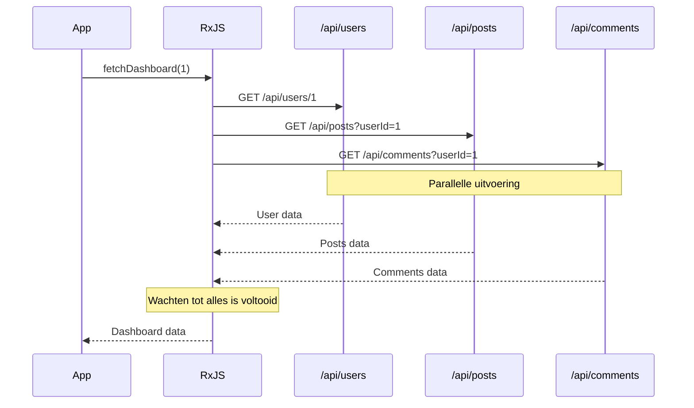
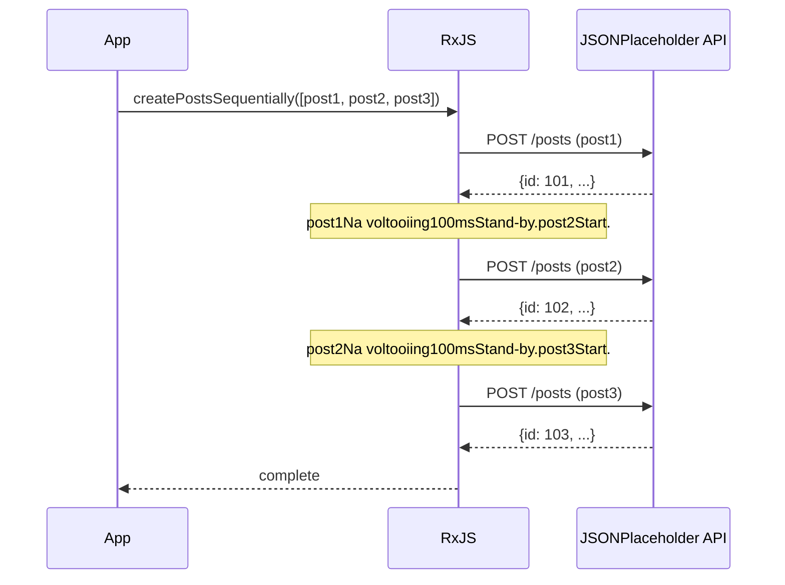

# API-oproeppatroon.

API-oproepen zijn een van de meest geïmplementeerde processen bij webontwikkeling, en met RxJS kun je complexe asynchrone API-oproepen declaratief en robuust implementeren.

Dit artikel beschrijft concrete implementatiepatronen voor verschillende API aanroepscenario's die je in de praktijk tegenkomt, inclusief foutafhandeling en annuleringsafhandeling.

## Wat je in dit artikel leert.

- Basis GET/POST verzoek implementatie
- Parallel aanroepen van meerdere API's (forkJoin)
- Reeks verzoeken die sequentiële uitvoering vereisen (concatMap)
- Ketens van verzoeken met afhankelijkheden (switchMap)
- Herhaling en foutafhandeling
- Time-out afhandeling
- Annulering van verzoeken

```typescript
import { from, Observable, catchError } from 'rxjs';

// JSONPlaceholder API(na een zelfstandig naamwoord) gebaseerd op ...Posttype
// https://jsonplaceholder.typicode.com/posts
interface Post {
  id: number;
  userId: number;
  title: string;
  body: string;
}

interface CreatePostRequest {
  userId: number;
  title: string;
  body: string;
}

function createPost(postData: CreatePostRequest): Observable<Post> {
  return from(
    fetch('https://jsonplaceholder.typicode.com/posts', {
      method: 'POST',
      headers: {
        'Content-Type': 'application/json',
      },
      body: JSON.stringify(postData)
    }).then(response => {
      if (!response.ok) {
        throw new Error(`HTTP error! status: ${response.status}`);
      }
      return response.json();
    })
  ).pipe(
    catchError((err: unknown) => {
      console.error('Fout bij het maken van een bericht:', err);
      throw err;
    })
  );
}

// Gebruiksvoorbeeld
createPost({
  userId: 1,
  title: 'RxJSLeren van',
  body: 'RxJShet gebruik van deAPILeren van het patroon van aanroepen naar'
}).subscribe({
  next: post => {
    console.log('Aangemaakte berichten:', post);
    console.log('Een berichtID:', post.id); // JSONPlaceholderworden automatischIDtoegewezen (bijv.: 101)
  },
  error: err => console.error('Fout:', err)
});
```

> Dit artikel maakt deel uit van de [Hoofdstuk 4: Operators](../operators/index.md) en [Hoofdstuk 6: Foutafhandeling](../error-handling/strategies.md).

## Basis API-aanroepen.

### Probleem: Eenvoudig GET-verzoek.

Het meest eenvoudige geval implementeert een enkel GET-verzoek.

### Voorbeeldimplementatie.


```typescript
import { from, Observable, map, catchError, timeout } from 'rxjs';

// JSONPlaceholder API(na een zelfstandig naamwoord) gebaseerd op ...Usertype
// https://jsonplaceholder.typicode.com/users
interface User {
  id: number;
  name: string;
  username: string;
  email: string;
  address: {
    street: string;
    suite: string;
    city: string;
    zipcode: string;
    geo: {
      lat: string;
      lng: string;
    };
  };
  phone: string;
  website: string;
  company: {
    name: string;
    catchPhrase: string;
    bs: string;
  };
}

// Lijst met gebruikers ophalen
function fetchUsers(): Observable<User[]> {
  return from(
    fetch('https://jsonplaceholder.typicode.com/users')
      .then(response => {
        if (!response.ok) {
          throw new Error(`HTTP error! status: ${response.status}`);
        }
        return response.json();
      })
  ).pipe(
    timeout(5000), // 5Time-out in seconden
    catchError((err: unknown) => {
      console.error('Fout bij overname gebruiker:', err);
      throw err;
    })
  );
}

// Gebruiksvoorbeeld
fetchUsers().subscribe({
  next: users => {
    console.log('Gebruikerslijst:', users);
    console.log('Eerste gebruiker:', users[0].name); // Voorbeeld: "Leanne Graham"
  },
  error: err => console.error('Fout:', err)
});
```

```typescript
import { from, Observable, catchError } from 'rxjs';

// JSONPlaceholder API(na een zelfstandig naamwoord) gebaseerd op ...Posttype
// https://jsonplaceholder.typicode.com/posts
interface Post {
  id: number;
  userId: number;
  title: string;
  body: string;
}

interface CreatePostRequest {
  userId: number;
  title: string;
  body: string;
}

function createPost(postData: CreatePostRequest): Observable<Post> {
  return from(
    fetch('https://jsonplaceholder.typicode.com/posts', {
      method: 'POST',
      headers: {
        'Content-Type': 'application/json',
      },
      body: JSON.stringify(postData)
    }).then(response => {
      if (!response.ok) {
        throw new Error(`HTTP error! status: ${response.status}`);
      }
      return response.json();
    })
  ).pipe(
    catchError((err: unknown) => {
      console.error('Fout bij het maken van een bericht:', err);
      throw err;
    })
  );
}

// Gebruiksvoorbeeld
createPost({
  userId: 1,
  title: 'RxJSLeren van',
  body: 'RxJShet gebruik van deAPILeren van het patroon van aanroepen naar'
}).subscribe({
  next: post => {
    console.log('Aangemaakte berichten:', post);
    console.log('Een berichtID:', post.id); // JSONPlaceholderworden automatischIDtoegewezen (bijv.: 101)
  },
  error: err => console.error('Fout:', err)
});
```

> Dit voorbeeld omwikkelt de standaard `fetch` met `from()`, maar je kunt ook de officiële RxJS `ajax()` gebruiken. ajax()` is geavanceerder en ondersteunt verzoekannulering en voortgangscontrole.

### POST-verzoek.

Patroon voor het maken van nieuwe gegevens.


```typescript
import { from, Observable, catchError } from 'rxjs';

// JSONPlaceholder API(na een zelfstandig naamwoord) gebaseerd op ...Posttype
// https://jsonplaceholder.typicode.com/posts
interface Post {
  id: number;
  userId: number;
  title: string;
  body: string;
}

interface CreatePostRequest {
  userId: number;
  title: string;
  body: string;
}

function createPost(postData: CreatePostRequest): Observable<Post> {
  return from(
    fetch('https://jsonplaceholder.typicode.com/posts', {
      method: 'POST',
      headers: {
        'Content-Type': 'application/json',
      },
      body: JSON.stringify(postData)
    }).then(response => {
      if (!response.ok) {
        throw new Error(`HTTP error! status: ${response.status}`);
      }
      return response.json();
    })
  ).pipe(
    catchError((err: unknown) => {
      console.error('Fout bij het maken van een bericht:', err);
      throw err;
    })
  );
}

// Gebruiksvoorbeeld
createPost({
  userId: 1,
  title: 'RxJSLeren van',
  body: 'RxJShet gebruik van deAPILeren van het patroon van aanroepen naar'
}).subscribe({
  next: post => {
    console.log('Aangemaakte berichten:', post);
    console.log('Een berichtID:', post.id); // JSONPlaceholderworden automatischIDtoegewezen (bijv.: 101)
  },
  error: err => console.error('Fout:', err)
});
```

> - **Typeveiligheid**: duidelijk het type antwoord definiëren
> - **Foutenafhandeling**: HTTP-statuscodes goed controleren
> - **Time-outs**: lange wachttijden voorkomen

## Parallelle verzoeken (forkJoin)

### Probleem: ik wil meerdere API's tegelijk aanroepen.

Het kan zijn dat u meerdere onafhankelijke API's parallel wilt aanroepen en pas verder wilt gaan nadat alle antwoorden zijn ontvangen.

### Oplossing: Gebruik forkJoin.

forkJoin` wacht tot meerdere Observable zijn voltooid en retourneert alle resultaten in een array (gelijk aan Promise.all).


```typescript
import { forkJoin, from, Observable, map } from 'rxjs';

// JSONPlaceholder API(na een zelfstandig naamwoord) gebaseerd op ...Commenttype
// https://jsonplaceholder.typicode.com/comments
interface Comment {
  postId: number;
  id: number;
  name: string;
  email: string;
  body: string;
}
interface Post {
  id: number;
  userId: number;
  title: string;
  body: string;
}
interface User {
  id: number;
  name: string;
  username: string;
  email: string;
  address: {
    street: string;
    suite: string;
    city: string;
    zipcode: string;
    geo: {
      lat: string;
      lng: string;
    };
  };
  phone: string;
  website: string;
  company: {
    name: string;
    catchPhrase: string;
    bs: string;
  };
}
interface Dashboard {
  user: User;
  posts: Post[];
  comments: Comment[];
}

function fetchUserById(id: number): Observable<User> {
  return from(
    fetch(`https://jsonplaceholder.typicode.com/users/${id}`).then(r => r.json())
  );
}

function fetchPostsByUserId(userId: number): Observable<Post[]> {
  return from(
    fetch(`https://jsonplaceholder.typicode.com/posts?userId=${userId}`).then(r => r.json())
  );
}

function fetchCommentsByPostId(postId: number): Observable<Comment[]> {
  return from(
    fetch(`https://jsonplaceholder.typicode.com/comments?postId=${postId}`).then(r => r.json())
  );
}

// Parallel ophalen van dashboardgegevens
function fetchDashboard(userId: number): Observable<Dashboard> {
  return forkJoin({
    user: fetchUserById(userId),
    posts: fetchPostsByUserId(userId),
    comments: fetchCommentsByPostId(1) // Een berichtID=1Commentaar ophalen van
  }).pipe(
    map(({ user, posts, comments }) => ({
      user,
      posts,
      comments
    }))
  );
}

// Gebruiksvoorbeeld
fetchDashboard(1).subscribe({
  next: dashboard => {
    console.log('Gebruiker:', dashboard.user.name); // Voorbeeld: "Leanne Graham"
    console.log('Aantal berichten:', dashboard.posts.length); // Voorbeeld: 10Aantal berichten
    console.log('Aantal opmerkingen:', dashboard.comments.length); // Voorbeeld: 5Aantal berichten
  },
  error: err => console.error('Fout bij overname dashboard:', err)
});
```

#### Uitvoeringsstroom


```mermaid
sequenceDiagram
    participant App
    participant RxJS
    participant API1 as /api/users
    participant API2 as /api/posts
    participant API3 as /api/comments

    App->>RxJS: fetchDashboard(1)
    RxJS->>API1: GET /api/users/1
    RxJS->>API2: GET /api/posts?userId=1
    RxJS->>API3: GET /api/comments?userId=1

    Note over API1,API3: Parallelle uitvoering

    API1-->>RxJS: User data
    API2-->>RxJS: Posts data
    API3-->>RxJS: Comments data

    Note over RxJS: Wachten tot alles is voltooid

    RxJS-->>App: Dashboard data
```

```typescript
import { from, Observable, catchError } from 'rxjs';

// JSONPlaceholder API(na een zelfstandig naamwoord) gebaseerd op ...Posttype
// https://jsonplaceholder.typicode.com/posts
interface Post {
  id: number;
  userId: number;
  title: string;
  body: string;
}

interface CreatePostRequest {
  userId: number;
  title: string;
  body: string;
}

function createPost(postData: CreatePostRequest): Observable<Post> {
  return from(
    fetch('https://jsonplaceholder.typicode.com/posts', {
      method: 'POST',
      headers: {
        'Content-Type': 'application/json',
      },
      body: JSON.stringify(postData)
    }).then(response => {
      if (!response.ok) {
        throw new Error(`HTTP error! status: ${response.status}`);
      }
      return response.json();
    })
  ).pipe(
    catchError((err: unknown) => {
      console.error('Fout bij het maken van een bericht:', err);
      throw err;
    })
  );
}

// Gebruiksvoorbeeld
createPost({
  userId: 1,
  title: 'RxJSLeren van',
  body: 'RxJShet gebruik van deAPILeren van het patroon van aanroepen naar'
}).subscribe({
  next: post => {
    console.log('Aangemaakte berichten:', post);
    console.log('Een berichtID:', post.id); // JSONPlaceholderworden automatischIDtoegewezen (bijv.: 101)
  },
  error: err => console.error('Fout:', err)
});
```

> - Wacht tot alle Observable zijn voltooid.
> - **Als een van hen faalt, faalt het geheel**
> - Alle Observable moeten ten minste één waarde afgeven

### Verbeterde foutafhandeling

Bij parallelle verzoeken wil je misschien andere resultaten ophalen, zelfs als sommige mislukken.


```typescript
import { forkJoin, of, catchError } from 'rxjs';

function fetchDashboardWithFallback(userId: number): Observable<Dashboard> {
  return forkJoin({
    user: fetchUserById(userId).pipe(
      catchError((err: unknown) => {
        console.error('Fout bij overname gebruiker:', err);
        return of(null); // Geeft bij fout terugnullGeeft  terug
      })
    ),
    posts: fetchPostsByUserId(userId).pipe(
      catchError((err: unknown) => {
        console.error('Fout na overname:', err);
        return of([]); // Geeft bij fout een lege matrix terug
      })
    ),
    comments: fetchCommentsByUserId(userId).pipe(
      catchError((err: unknown) => {
        console.error('Fout bij ophalen commentaar:', err);
        return of([]); // Geeft bij fout een lege matrix terug
      })
    )
  }).pipe(
    map(({ user, posts, comments }) => ({
      user: user || { id: userId, name: 'Unknown', email: '' },
      posts,
      comments
    }))
  );
}
```

__oproep_26___

> Door `catchError` toe te passen op elke Observable, kan het hele proces doorgaan, zelfs als sommige ervan mislukken.

## Serieverzoek (concatMap)

### Probleem: ik wil de API's in volgorde uitvoeren.

U wilt het volgende verzoek uitvoeren nadat het vorige is voltooid (bijvoorbeeld meerdere bestandsuploads achter elkaar).

### Oplossing: gebruik concatMap.

concatMap` voert de volgende Observable uit nadat de vorige is voltooid.

```typescript
import { from, Observable, concatMap, tap, delay, catchError } from 'rxjs';

// JSONPlaceholder API(na een zelfstandig naamwoord) gebaseerd op ...Posttype
// https://jsonplaceholder.typicode.com/posts
interface Post {
  id: number;
  userId: number;
  title: string;
  body: string;
}

interface CreatePostRequest {
  userId: number;
  title: string;
  body: string;
}

function createPost(postData: CreatePostRequest): Observable<Post> {
  return from(
    fetch('https://jsonplaceholder.typicode.com/posts', {
      method: 'POST',
      headers: {
        'Content-Type': 'application/json',
      },
      body: JSON.stringify(postData)
    }).then(response => {
      if (!response.ok) {
        throw new Error(`HTTP error! status: ${response.status}`);
      }
      return response.json();
    })
  ).pipe(
    catchError((err: unknown) => {
      console.error('Fout bij het maken van een bericht:', err);
      throw err;
    })
  );
}

// Meerdere berichten achter elkaar maken (inAPISnelheidsbeperking rekening gehouden)
function createPostsSequentially(posts: CreatePostRequest[]): Observable<Post> {
  return from(posts).pipe(
    concatMap((postData, index) =>
      createPost(postData).pipe(
        tap(result => console.log(`Een bericht${index + 1}Creatie voltooid:`, result.title)),
        delay(100) // APIRekening houdend met snelheidsbeperking100msWachten op
      )
    )
  );
}

// Gebruiksvoorbeeld
const postsToCreate: CreatePostRequest[] = [
  {
    userId: 1,
    title: '1Tweede bericht',
    body: 'Dit is de1De tweede post.'
  },
  {
    userId: 1,
    title: '2Tweede bericht',
    body: 'Dit is de2De tweede post.'
  },
  {
    userId: 1,
    title: '3Tweede bericht',
    body: 'Dit is de3De tweede post.'
  }
];

const results: Post[] = [];

createPostsSequentially(postsToCreate).subscribe({
  next: post => {
    results.push(post);
    console.log(`Voortgang: ${results.length}/${postsToCreate.length}`);
  },
  complete: () => {
    console.log('Alle aangemaakte berichten Voltooid:', results.length, 'Aantal berichten');
  },
  error: err => console.error('Fout bij het maken van een bericht:', err)
});
```

#### Uitvoeringsstroom


```mermaid
sequenceDiagram
    participant App
    participant RxJS
    participant API as JSONPlaceholder API

    App->>RxJS: createPostsSequentially([post1, post2, post3])

    RxJS->>API: POST /posts (post1)
    API-->>RxJS: {id: 101, ...}
    Note over RxJS: post1Na voltooiing100msStand-by.post2Start.

    RxJS->>API: POST /posts (post2)
    API-->>RxJS: {id: 102, ...}
    Note over RxJS: post2Na voltooiing100msStand-by.post3Start.

    RxJS->>API: POST /posts (post3)
    API-->>RxJS: {id: 103, ...}

    RxJS-->>App: complete
```

```typescript
import { from, Observable, catchError } from 'rxjs';

// JSONPlaceholder API(na een zelfstandig naamwoord) gebaseerd op ...Posttype
// https://jsonplaceholder.typicode.com/posts
interface Post {
  id: number;
  userId: number;
  title: string;
  body: string;
}

interface CreatePostRequest {
  userId: number;
  title: string;
  body: string;
}

function createPost(postData: CreatePostRequest): Observable<Post> {
  return from(
    fetch('https://jsonplaceholder.typicode.com/posts', {
      method: 'POST',
      headers: {
        'Content-Type': 'application/json',
      },
      body: JSON.stringify(postData)
    }).then(response => {
      if (!response.ok) {
        throw new Error(`HTTP error! status: ${response.status}`);
      }
      return response.json();
    })
  ).pipe(
    catchError((err: unknown) => {
      console.error('Fout bij het maken van een bericht:', err);
      throw err;
    })
  );
}

// Gebruiksvoorbeeld
createPost({
  userId: 1,
  title: 'RxJSLeren van',
  body: 'RxJShet gebruik van deAPILeren van het patroon van aanroepen naar'
}).subscribe({
  next: post => {
    console.log('Aangemaakte berichten:', post);
    console.log('Een berichtID:', post.id); // JSONPlaceholderworden automatischIDtoegewezen (bijv.: 101)
  },
  error: err => console.error('Fout:', err)
});
```

> - concatMap**: sequentiële uitvoering (vorige voltooid, dan volgende)
> - mergeMap**: parallelle uitvoering (meerdere gelijktijdige uitvoeringen mogelijk).
>
> - concatMap` als volgorde belangrijk is, mergeMap` als volgorde niet nodig is en snelheid prioriteit heeft.

## Afhankelijkheid aanvragen (switchMap)

### Probleem: de volgende API aanroepen met behulp van het vorige API-antwoord.

Een van de meest voorkomende patronen, waarbij het resultaat van de eerste API-respons wordt gebruikt om de volgende API aan te roepen.

### Oplossing: gebruik switchMap.

De `switchMap` neemt de waarde van de vorige Observable en zet deze om in een nieuwe Observable.


```typescript
import { from, Observable, switchMap, map } from 'rxjs';

interface UserProfile {
  user: User;
  posts: Post[];
}
interface Post {
  id: number;
  userId: number;
  title: string;
  body: string;
}
interface User {
  id: number;
  name: string;
  username: string;
  email: string;
  address: {
    street: string;
    suite: string;
    city: string;
    zipcode: string;
    geo: {
      lat: string;
      lng: string;
    };
  };
  phone: string;
  website: string;
  company: {
    name: string;
    catchPhrase: string;
    bs: string;
  };
}

function fetchUserById(id: number): Observable<User> {
  return from(
    fetch(`https://jsonplaceholder.typicode.com/users/${id}`).then(r => r.json())
  );
}

function fetchPostsByUserId(userId: number): Observable<Post[]> {
  return from(
    fetch(`https://jsonplaceholder.typicode.com/posts?userId=${userId}`).then(r => r.json())
  );
}

// Gebruikersgegevens en hun berichten ophalen
function fetchUserProfile(userId: number): Observable<UserProfile> {
  return fetchUserById(userId).pipe(
    switchMap(user =>
      // Na het ophalen van gebruikersgegevens en hun berichten
      fetchPostsByUserId(user.id).pipe(
        map(posts => ({
          user,
          posts
        }))
      )
    )
  );
}

// Gebruiksvoorbeeld
fetchUserProfile(1).subscribe({
  next: profile => {
    console.log('Gebruiker:', profile.user.name);
    console.log('Een bericht:', profile.posts);
  },
  error: err => console.error('Fout:', err)
});
```

### Praktisch voorbeeld: een zoekfunctie implementeren

Dit is een veelgebruikt patroon in de praktijk, waarbij de API wordt aangeroepen als reactie op de zoekinvoer van de gebruiker.

```typescript
import { from, fromEvent, Observable, of, map, debounceTime, distinctUntilChanged, switchMap, catchError } from 'rxjs';

// JSONPlaceholder (na een zelfstandig naamwoord) gebaseerd op ... Post als zoekresultaten.
interface SearchResult {
  id: number;
  userId: number;
  title: string;
  body: string;
}

function searchAPI(query: string): Observable<SearchResult[]> {
  return from(
    fetch('https://jsonplaceholder.typicode.com/posts')
      .then(response => {
        if (!response.ok) {
          throw new Error(`HTTP error! status: ${response.status}`);
        }
        return response.json();
      })
  ).pipe(
    // Client-side filteren op titel
    map((posts: SearchResult[]) =>
      posts.filter(post =>
        post.title.toLowerCase().includes(query.toLowerCase())
      )
    )
  );
}

// Traditional approach (commented for reference)
// const searchInput = document.querySelector<HTMLInputElement>('#search');

// Self-contained: creates search input and results container dynamically
const searchInput = document.createElement('input');
searchInput.id = 'search';
searchInput.type = 'text';
searchInput.placeholder = 'Voer zoektermen in (minstens2tekens of meer)';
searchInput.style.padding = '10px';
searchInput.style.margin = '10px';
searchInput.style.width = '400px';
searchInput.style.fontSize = '16px';
searchInput.style.border = '2px solid #ccc';
searchInput.style.borderRadius = '4px';
searchInput.style.display = 'block';
document.body.appendChild(searchInput);

const resultsContainer = document.createElement('div');
resultsContainer.id = 'results';
resultsContainer.style.padding = '10px';
resultsContainer.style.margin = '10px';
resultsContainer.style.minHeight = '100px';
resultsContainer.style.border = '1px solid #ddd';
resultsContainer.style.borderRadius = '4px';
resultsContainer.style.backgroundColor = '#f9f9f9';
document.body.appendChild(resultsContainer);

const search$ = fromEvent(searchInput, 'input').pipe(
  map(event => (event.target as HTMLInputElement).value),
  debounceTime(300),           // Na het invoeren300msWacht op
  distinctUntilChanged(),      // Genegeerd als de waarde hetzelfde is als de vorige keer
  switchMap(query => {
    if (query.length < 2) {
      return of([]); // 2Indien minder dan 1 karakter, lege matrix
    }
    return searchAPI(query).pipe(
      catchError((err: unknown) => {
        console.error('Fout zoeken:', err);
        return of([]); // Lege matrix in geval van fout
      })
    );
  })
);

search$.subscribe(results => {
  console.log('Zoekresultaten:', results);
  // UIResultaten weergeven in
  displayResults(results, resultsContainer);
});

function displayResults(results: SearchResult[], container: HTMLElement): void {
  // Geeft de resultaten weer inDOMResultaten weergeven in
  container.innerHTML = results
    .map(r => `<div style="padding: 8px; margin: 4px; border-bottom: 1px solid #eee;">${r.title}</div>`)
    .join('');

  if (results.length === 0) {
    container.innerHTML = '<div style="padding: 8px; color: #999;">Geen zoekresultaten</div>';
  }
}
```

```typescript
import { from, Observable, catchError } from 'rxjs';

// JSONPlaceholder API(na een zelfstandig naamwoord) gebaseerd op ...Posttype
// https://jsonplaceholder.typicode.com/posts
interface Post {
  id: number;
  userId: number;
  title: string;
  body: string;
}

interface CreatePostRequest {
  userId: number;
  title: string;
  body: string;
}

function createPost(postData: CreatePostRequest): Observable<Post> {
  return from(
    fetch('https://jsonplaceholder.typicode.com/posts', {
      method: 'POST',
      headers: {
        'Content-Type': 'application/json',
      },
      body: JSON.stringify(postData)
    }).then(response => {
      if (!response.ok) {
        throw new Error(`HTTP error! status: ${response.status}`);
      }
      return response.json();
    })
  ).pipe(
    catchError((err: unknown) => {
      console.error('Fout bij het maken van een bericht:', err);
      throw err;
    })
  );
}

// Gebruiksvoorbeeld
createPost({
  userId: 1,
  title: 'RxJSLeren van',
  body: 'RxJShet gebruik van deAPILeren van het patroon van aanroepen naar'
}).subscribe({
  next: post => {
    console.log('Aangemaakte berichten:', post);
    console.log('Een berichtID:', post.id); // JSONPlaceholderworden automatischIDtoegewezen (bijv.: 101)
  },
  error: err => console.error('Fout:', err)
});
```

> De JSONPlaceholder API heeft geen zoekfunctie, dus alle berichten worden opgehaald en gefilterd aan de kant van de client. In de praktijk wordt dit patroon gebruikt als de back-end geen zoekfunctie heeft of als de hoeveelheid gegevens klein is.
>
> **Voorbeeld zoekopdracht**:
> - Zoeken op "sunt" → meerdere berichten gevonden.
> - Zoeken met "qui est esse" → treffers met titels die "qui est esse" bevatten.
> - Zoeken met "zzz" → Geen resultaten (niet van toepassing)

#### Uitvoeringsstroom


```typescript
import { from, Observable, map, catchError, timeout } from 'rxjs';

// JSONPlaceholder API(na een zelfstandig naamwoord) gebaseerd op ...Usertype
// https://jsonplaceholder.typicode.com/users
interface User {
  id: number;
  name: string;
  username: string;
  email: string;
  address: {
    street: string;
    suite: string;
    city: string;
    zipcode: string;
    geo: {
      lat: string;
      lng: string;
    };
  };
  phone: string;
  website: string;
  company: {
    name: string;
    catchPhrase: string;
    bs: string;
  };
}

// Lijst met gebruikers ophalen
function fetchUsers(): Observable<User[]> {
  return from(
    fetch('https://jsonplaceholder.typicode.com/users')
      .then(response => {
        if (!response.ok) {
          throw new Error(`HTTP error! status: ${response.status}`);
        }
        return response.json();
      })
  ).pipe(
    timeout(5000), // 5Time-out in seconden
    catchError((err: unknown) => {
      console.error('Fout bij overname gebruiker:', err);
      throw err;
    })
  );
}

// Gebruiksvoorbeeld
fetchUsers().subscribe({
  next: users => {
    console.log('Gebruikerslijst:', users);
    console.log('Eerste gebruiker:', users[0].name); // Voorbeeld: "Leanne Graham"
  },
  error: err => console.error('Fout:', err)
});
```


```typescript
import { from, Observable, catchError } from 'rxjs';

// JSONPlaceholder API(na een zelfstandig naamwoord) gebaseerd op ...Posttype
// https://jsonplaceholder.typicode.com/posts
interface Post {
  id: number;
  userId: number;
  title: string;
  body: string;
}

interface CreatePostRequest {
  userId: number;
  title: string;
  body: string;
}

function createPost(postData: CreatePostRequest): Observable<Post> {
  return from(
    fetch('https://jsonplaceholder.typicode.com/posts', {
      method: 'POST',
      headers: {
        'Content-Type': 'application/json',
      },
      body: JSON.stringify(postData)
    }).then(response => {
      if (!response.ok) {
        throw new Error(`HTTP error! status: ${response.status}`);
      }
      return response.json();
    })
  ).pipe(
    catchError((err: unknown) => {
      console.error('Fout bij het maken van een bericht:', err);
      throw err;
    })
  );
}

// Gebruiksvoorbeeld
createPost({
  userId: 1,
  title: 'RxJSLeren van',
  body: 'RxJShet gebruik van deAPILeren van het patroon van aanroepen naar'
}).subscribe({
  next: post => {
    console.log('Aangemaakte berichten:', post);
    console.log('Een berichtID:', post.id); // JSONPlaceholderworden automatischIDtoegewezen (bijv.: 101)
  },
  error: err => console.error('Fout:', err)
});
```

> ** Annuleert automatisch de vorige Observable als er een nieuwe waarde binnenkomt. **
> Dit zorgt ervoor dat antwoorden op oudere API verzoeken worden genegeerd, zelfs als ze later aankomen (Race Condition voorkomen).

### switchMap vs mergeMap vs concatMap

Het gebruik van hogere orde mapping operatoren.


```typescript
import { from, Observable, catchError } from 'rxjs';

// JSONPlaceholder API(na een zelfstandig naamwoord) gebaseerd op ...Posttype
// https://jsonplaceholder.typicode.com/posts
interface Post {
  id: number;
  userId: number;
  title: string;
  body: string;
}

interface CreatePostRequest {
  userId: number;
  title: string;
  body: string;
}

function createPost(postData: CreatePostRequest): Observable<Post> {
  return from(
    fetch('https://jsonplaceholder.typicode.com/posts', {
      method: 'POST',
      headers: {
        'Content-Type': 'application/json',
      },
      body: JSON.stringify(postData)
    }).then(response => {
      if (!response.ok) {
        throw new Error(`HTTP error! status: ${response.status}`);
      }
      return response.json();
    })
  ).pipe(
    catchError((err: unknown) => {
      console.error('Fout bij het maken van een bericht:', err);
      throw err;
    })
  );
}

// Gebruiksvoorbeeld
createPost({
  userId: 1,
  title: 'RxJSLeren van',
  body: 'RxJShet gebruik van deAPILeren van het patroon van aanroepen naar'
}).subscribe({
  next: post => {
    console.log('Aangemaakte berichten:', post);
    console.log('Een berichtID:', post.id); // JSONPlaceholderworden automatischIDtoegewezen (bijv.: 101)
  },
  error: err => console.error('Fout:', err)
});
```


```typescript
import { from, Observable, map, catchError, timeout } from 'rxjs';

// JSONPlaceholder API(na een zelfstandig naamwoord) gebaseerd op ...Usertype
// https://jsonplaceholder.typicode.com/users
interface User {
  id: number;
  name: string;
  username: string;
  email: string;
  address: {
    street: string;
    suite: string;
    city: string;
    zipcode: string;
    geo: {
      lat: string;
      lng: string;
    };
  };
  phone: string;
  website: string;
  company: {
    name: string;
    catchPhrase: string;
    bs: string;
  };
}

// Lijst met gebruikers ophalen
function fetchUsers(): Observable<User[]> {
  return from(
    fetch('https://jsonplaceholder.typicode.com/users')
      .then(response => {
        if (!response.ok) {
          throw new Error(`HTTP error! status: ${response.status}`);
        }
        return response.json();
      })
  ).pipe(
    timeout(5000), // 5Time-out in seconden
    catchError((err: unknown) => {
      console.error('Fout bij overname gebruiker:', err);
      throw err;
    })
  );
}

// Gebruiksvoorbeeld
fetchUsers().subscribe({
  next: users => {
    console.log('Gebruikerslijst:', users);
    console.log('Eerste gebruiker:', users[0].name); // Voorbeeld: "Leanne Graham"
  },
  error: err => console.error('Fout:', err)
});
```

## Herhalingen en foutafhandeling

### Probleem: ik wil tijdelijke netwerkfouten afhandelen

In het geval van een netwerkfout of time-out, wil je misschien automatisch een nieuwe poging doen.

### Oplossing: gebruik retry en retryWhen.


```typescript
import { from, Observable, map, catchError, timeout } from 'rxjs';

// JSONPlaceholder API(na een zelfstandig naamwoord) gebaseerd op ...Usertype
// https://jsonplaceholder.typicode.com/users
interface User {
  id: number;
  name: string;
  username: string;
  email: string;
  address: {
    street: string;
    suite: string;
    city: string;
    zipcode: string;
    geo: {
      lat: string;
      lng: string;
    };
  };
  phone: string;
  website: string;
  company: {
    name: string;
    catchPhrase: string;
    bs: string;
  };
}

// Lijst met gebruikers ophalen
function fetchUsers(): Observable<User[]> {
  return from(
    fetch('https://jsonplaceholder.typicode.com/users')
      .then(response => {
        if (!response.ok) {
          throw new Error(`HTTP error! status: ${response.status}`);
        }
        return response.json();
      })
  ).pipe(
    timeout(5000), // 5Time-out in seconden
    catchError((err: unknown) => {
      console.error('Fout bij overname gebruiker:', err);
      throw err;
    })
  );
}

// Gebruiksvoorbeeld
fetchUsers().subscribe({
  next: users => {
    console.log('Gebruikerslijst:', users);
    console.log('Eerste gebruiker:', users[0].name); // Voorbeeld: "Leanne Graham"
  },
  error: err => console.error('Fout:', err)
});
```

**Voorbeeld van exponentiële backoff in actie:***


```typescript
import { forkJoin, from, Observable, map } from 'rxjs';

// JSONPlaceholder API(na een zelfstandig naamwoord) gebaseerd op ...Commenttype
// https://jsonplaceholder.typicode.com/comments
interface Comment {
  postId: number;
  id: number;
  name: string;
  email: string;
  body: string;
}
interface Post {
  id: number;
  userId: number;
  title: string;
  body: string;
}
interface User {
  id: number;
  name: string;
  username: string;
  email: string;
  address: {
    street: string;
    suite: string;
    city: string;
    zipcode: string;
    geo: {
      lat: string;
      lng: string;
    };
  };
  phone: string;
  website: string;
  company: {
    name: string;
    catchPhrase: string;
    bs: string;
  };
}
interface Dashboard {
  user: User;
  posts: Post[];
  comments: Comment[];
}

function fetchUserById(id: number): Observable<User> {
  return from(
    fetch(`https://jsonplaceholder.typicode.com/users/${id}`).then(r => r.json())
  );
}

function fetchPostsByUserId(userId: number): Observable<Post[]> {
  return from(
    fetch(`https://jsonplaceholder.typicode.com/posts?userId=${userId}`).then(r => r.json())
  );
}

function fetchCommentsByPostId(postId: number): Observable<Comment[]> {
  return from(
    fetch(`https://jsonplaceholder.typicode.com/comments?postId=${postId}`).then(r => r.json())
  );
}

// Parallel ophalen van dashboardgegevens
function fetchDashboard(userId: number): Observable<Dashboard> {
  return forkJoin({
    user: fetchUserById(userId),
    posts: fetchPostsByUserId(userId),
    comments: fetchCommentsByPostId(1) // Een berichtID=1Commentaar ophalen van
  }).pipe(
    map(({ user, posts, comments }) => ({
      user,
      posts,
      comments
    }))
  );
}

// Gebruiksvoorbeeld
fetchDashboard(1).subscribe({
  next: dashboard => {
    console.log('Gebruiker:', dashboard.user.name); // Voorbeeld: "Leanne Graham"
    console.log('Aantal berichten:', dashboard.posts.length); // Voorbeeld: 10Aantal berichten
    console.log('Aantal opmerkingen:', dashboard.comments.length); // Voorbeeld: 5Aantal berichten
  },
  error: err => console.error('Fout bij overname dashboard:', err)
});
```

> - **Immediate retry**: `retry(3)` - eenvoudig, handig voor netwerkstoringen
> - **Vast interval**: `retryWhen` + `delay(1000)` - houdt rekening met serverbelasting
> - **Exponentiële backoff**: `retryWhen` + `timer` - best practice voor AWS etc.

### Herhaal alleen bij specifieke fouten

Niet alle fouten moeten opnieuw worden geprobeerd (bijv. 401 Ongeautoriseerd vereist geen nieuwe poging).


```typescript
import { from, Observable, map, catchError, timeout } from 'rxjs';

// JSONPlaceholder API(na een zelfstandig naamwoord) gebaseerd op ...Usertype
// https://jsonplaceholder.typicode.com/users
interface User {
  id: number;
  name: string;
  username: string;
  email: string;
  address: {
    street: string;
    suite: string;
    city: string;
    zipcode: string;
    geo: {
      lat: string;
      lng: string;
    };
  };
  phone: string;
  website: string;
  company: {
    name: string;
    catchPhrase: string;
    bs: string;
  };
}

// Lijst met gebruikers ophalen
function fetchUsers(): Observable<User[]> {
  return from(
    fetch('https://jsonplaceholder.typicode.com/users')
      .then(response => {
        if (!response.ok) {
          throw new Error(`HTTP error! status: ${response.status}`);
        }
        return response.json();
      })
  ).pipe(
    timeout(5000), // 5Time-out in seconden
    catchError((err: unknown) => {
      console.error('Fout bij overname gebruiker:', err);
      throw err;
    })
  );
}

// Gebruiksvoorbeeld
fetchUsers().subscribe({
  next: users => {
    console.log('Gebruikerslijst:', users);
    console.log('Eerste gebruiker:', users[0].name); // Voorbeeld: "Leanne Graham"
  },
  error: err => console.error('Fout:', err)
});
```

__OPROEP_31___

> - **POST-verzoek**: risico op duplicaat bij opnieuw proberen indien geen gelijkheid
> - **Authenticatiefouten**: 401/403 niet opnieuw proberen, vraag opnieuw inloggen
> - **VALIDatiefout**: 400 niet opnieuw proberen, vraag gebruiker om correctie

## Time-out afhandeling

### Probleem: ik wil omgaan met trage API-respons

Als het netwerk traag is of de server niet reageert, wilt u na een bepaalde tijd een time-out instellen.

### Oplossing: gebruik de timeout operator.


```typescript
import { from, Observable, map, catchError, timeout } from 'rxjs';

// JSONPlaceholder API(na een zelfstandig naamwoord) gebaseerd op ...Usertype
// https://jsonplaceholder.typicode.com/users
interface User {
  id: number;
  name: string;
  username: string;
  email: string;
  address: {
    street: string;
    suite: string;
    city: string;
    zipcode: string;
    geo: {
      lat: string;
      lng: string;
    };
  };
  phone: string;
  website: string;
  company: {
    name: string;
    catchPhrase: string;
    bs: string;
  };
}

// Lijst met gebruikers ophalen
function fetchUsers(): Observable<User[]> {
  return from(
    fetch('https://jsonplaceholder.typicode.com/users')
      .then(response => {
        if (!response.ok) {
          throw new Error(`HTTP error! status: ${response.status}`);
        }
        return response.json();
      })
  ).pipe(
    timeout(5000), // 5Time-out in seconden
    catchError((err: unknown) => {
      console.error('Fout bij overname gebruiker:', err);
      throw err;
    })
  );
}

// Gebruiksvoorbeeld
fetchUsers().subscribe({
  next: users => {
    console.log('Gebruikerslijst:', users);
    console.log('Eerste gebruiker:', users[0].name); // Voorbeeld: "Leanne Graham"
  },
  error: err => console.error('Fout:', err)
});
```

### Combinatie van opnieuw proberen en time-out

In de praktijk worden time-outs en herhalingen gecombineerd gebruikt.


__callout_32___

> - **Normale API**: 5 - 10 seconden
> - **Snelle API**: 2 - 3 seconden
> - **Bestand uploaden**: 30 - 60 seconden
> - **Achtergrondverwerking**: meer dan 60 sec.
>
> Ingesteld om gebruikerservaring en serverbelasting in balans te brengen.

## Annuleringsproces aanvragen.

### Probleem: Ik wil API-verzoeken annuleren die niet langer nodig zijn.

Ik wil een lopend API-verzoek annuleren wanneer een paginaovergang of component wordt vernietigd.

### Oplossing: gebruik takeUntil.


```typescript
import { from, Observable, map, catchError, timeout } from 'rxjs';

// JSONPlaceholder API(na een zelfstandig naamwoord) gebaseerd op ...Usertype
// https://jsonplaceholder.typicode.com/users
interface User {
  id: number;
  name: string;
  username: string;
  email: string;
  address: {
    street: string;
    suite: string;
    city: string;
    zipcode: string;
    geo: {
      lat: string;
      lng: string;
    };
  };
  phone: string;
  website: string;
  company: {
    name: string;
    catchPhrase: string;
    bs: string;
  };
}

// Lijst met gebruikers ophalen
function fetchUsers(): Observable<User[]> {
  return from(
    fetch('https://jsonplaceholder.typicode.com/users')
      .then(response => {
        if (!response.ok) {
          throw new Error(`HTTP error! status: ${response.status}`);
        }
        return response.json();
      })
  ).pipe(
    timeout(5000), // 5Time-out in seconden
    catchError((err: unknown) => {
      console.error('Fout bij overname gebruiker:', err);
      throw err;
    })
  );
}

// Gebruiksvoorbeeld
fetchUsers().subscribe({
  next: users => {
    console.log('Gebruikerslijst:', users);
    console.log('Eerste gebruiker:', users[0].name); // Voorbeeld: "Leanne Graham"
  },
  error: err => console.error('Fout:', err)
});
```

### Door gebruiker gecontroleerde annulering

Dit is een voorbeeld van het implementeren van een expliciete annuleringsknop.


__oproep_33___

> - **implementeer altijd een cancelproces** - voorkomt geheugenlekken en netwerkverspilling
> - **Gebruik takeUntil** - meer declaratief en minder vergeetbaar dan unsubscribe()
> - **Bij het vernietigen van componenten** - vuur destroy$ om alle componenten af te melden

## Voorbeelden van praktische serviceklassen

Dit is een voorbeeld van een complete serviceklasse die de voorgaande patronen samenvat en in de praktijk gebruikt kan worden.


```typescript
import { from, Observable, map, catchError, timeout } from 'rxjs';

// JSONPlaceholder API(na een zelfstandig naamwoord) gebaseerd op ...Usertype
// https://jsonplaceholder.typicode.com/users
interface User {
  id: number;
  name: string;
  username: string;
  email: string;
  address: {
    street: string;
    suite: string;
    city: string;
    zipcode: string;
    geo: {
      lat: string;
      lng: string;
    };
  };
  phone: string;
  website: string;
  company: {
    name: string;
    catchPhrase: string;
    bs: string;
  };
}

// Lijst met gebruikers ophalen
function fetchUsers(): Observable<User[]> {
  return from(
    fetch('https://jsonplaceholder.typicode.com/users')
      .then(response => {
        if (!response.ok) {
          throw new Error(`HTTP error! status: ${response.status}`);
        }
        return response.json();
      })
  ).pipe(
    timeout(5000), // 5Time-out in seconden
    catchError((err: unknown) => {
      console.error('Fout bij overname gebruiker:', err);
      throw err;
    })
  );
}

// Gebruiksvoorbeeld
fetchUsers().subscribe({
  next: users => {
    console.log('Gebruikerslijst:', users);
    console.log('Eerste gebruiker:', users[0].name); // Voorbeeld: "Leanne Graham"
  },
  error: err => console.error('Fout:', err)
});
```

__oproep_34___

> - **Configureerbaar**: flexibele configuratie van time-outs, aantal nieuwe pogingen, enz.
> - **Cachefunctionaliteit**: voorkomt dubbele verzoeken
> - **Foutenafhandeling**: uniforme foutenafhandeling
> - **Automatisch opruimen**: destroy() zorgt ervoor dat bronnen worden vrijgegeven

## Testcode

Voorbeeldtest voor API aanroeppatroon.


```typescript
import { from, Observable, catchError } from 'rxjs';

// JSONPlaceholder API(na een zelfstandig naamwoord) gebaseerd op ...Posttype
// https://jsonplaceholder.typicode.com/posts
interface Post {
  id: number;
  userId: number;
  title: string;
  body: string;
}

interface CreatePostRequest {
  userId: number;
  title: string;
  body: string;
}

function createPost(postData: CreatePostRequest): Observable<Post> {
  return from(
    fetch('https://jsonplaceholder.typicode.com/posts', {
      method: 'POST',
      headers: {
        'Content-Type': 'application/json',
      },
      body: JSON.stringify(postData)
    }).then(response => {
      if (!response.ok) {
        throw new Error(`HTTP error! status: ${response.status}`);
      }
      return response.json();
    })
  ).pipe(
    catchError((err: unknown) => {
      console.error('Fout bij het maken van een bericht:', err);
      throw err;
    })
  );
}

// Gebruiksvoorbeeld
createPost({
  userId: 1,
  title: 'RxJSLeren van',
  body: 'RxJShet gebruik van deAPILeren van het patroon van aanroepen naar'
}).subscribe({
  next: post => {
    console.log('Aangemaakte berichten:', post);
    console.log('Een berichtID:', post.id); // JSONPlaceholderworden automatischIDtoegewezen (bijv.: 101)
  },
  error: err => console.error('Fout:', err)
});
```

## Samenvatting.

Door het API-aanroeppatroon met RxJS onder de knie te krijgen, kunnen robuuste en onderhoudbare toepassingen worden gebouwd.


```typescript
import { forkJoin, from, Observable, map } from 'rxjs';

// JSONPlaceholder API(na een zelfstandig naamwoord) gebaseerd op ...Commenttype
// https://jsonplaceholder.typicode.com/comments
interface Comment {
  postId: number;
  id: number;
  name: string;
  email: string;
  body: string;
}
interface Post {
  id: number;
  userId: number;
  title: string;
  body: string;
}
interface User {
  id: number;
  name: string;
  username: string;
  email: string;
  address: {
    street: string;
    suite: string;
    city: string;
    zipcode: string;
    geo: {
      lat: string;
      lng: string;
    };
  };
  phone: string;
  website: string;
  company: {
    name: string;
    catchPhrase: string;
    bs: string;
  };
}
interface Dashboard {
  user: User;
  posts: Post[];
  comments: Comment[];
}

function fetchUserById(id: number): Observable<User> {
  return from(
    fetch(`https://jsonplaceholder.typicode.com/users/${id}`).then(r => r.json())
  );
}

function fetchPostsByUserId(userId: number): Observable<Post[]> {
  return from(
    fetch(`https://jsonplaceholder.typicode.com/posts?userId=${userId}`).then(r => r.json())
  );
}

function fetchCommentsByPostId(postId: number): Observable<Comment[]> {
  return from(
    fetch(`https://jsonplaceholder.typicode.com/comments?postId=${postId}`).then(r => r.json())
  );
}

// Parallel ophalen van dashboardgegevens
function fetchDashboard(userId: number): Observable<Dashboard> {
  return forkJoin({
    user: fetchUserById(userId),
    posts: fetchPostsByUserId(userId),
    comments: fetchCommentsByPostId(1) // Een berichtID=1Commentaar ophalen van
  }).pipe(
    map(({ user, posts, comments }) => ({
      user,
      posts,
      comments
    }))
  );
}

// Gebruiksvoorbeeld
fetchDashboard(1).subscribe({
  next: dashboard => {
    console.log('Gebruiker:', dashboard.user.name); // Voorbeeld: "Leanne Graham"
    console.log('Aantal berichten:', dashboard.posts.length); // Voorbeeld: 10Aantal berichten
    console.log('Aantal opmerkingen:', dashboard.comments.length); // Voorbeeld: 5Aantal berichten
  },
  error: err => console.error('Fout bij overname dashboard:', err)
});
```

> - forkJoin**: meerdere API's parallel uitvoeren, allemaal wachtend op voltooiing
> - concatMap**: API's in volgorde uitvoeren (vorige voltooid, dan volgende)
> **switchMap**: ideaal voor afhankelijke verzoeken, zoekfuncties
> - **retryWhen**: automatisch opnieuw proberen bij fouten, exponentiële backoff aanbevolen
> - **timeout**: altijd een timeout instellen
> - **takeUntil**: automatische annulering bij vernietiging van component


```typescript
import { forkJoin, from, Observable, map } from 'rxjs';

// JSONPlaceholder API(na een zelfstandig naamwoord) gebaseerd op ...Commenttype
// https://jsonplaceholder.typicode.com/comments
interface Comment {
  postId: number;
  id: number;
  name: string;
  email: string;
  body: string;
}
interface Post {
  id: number;
  userId: number;
  title: string;
  body: string;
}
interface User {
  id: number;
  name: string;
  username: string;
  email: string;
  address: {
    street: string;
    suite: string;
    city: string;
    zipcode: string;
    geo: {
      lat: string;
      lng: string;
    };
  };
  phone: string;
  website: string;
  company: {
    name: string;
    catchPhrase: string;
    bs: string;
  };
}
interface Dashboard {
  user: User;
  posts: Post[];
  comments: Comment[];
}

function fetchUserById(id: number): Observable<User> {
  return from(
    fetch(`https://jsonplaceholder.typicode.com/users/${id}`).then(r => r.json())
  );
}

function fetchPostsByUserId(userId: number): Observable<Post[]> {
  return from(
    fetch(`https://jsonplaceholder.typicode.com/posts?userId=${userId}`).then(r => r.json())
  );
}

function fetchCommentsByPostId(postId: number): Observable<Comment[]> {
  return from(
    fetch(`https://jsonplaceholder.typicode.com/comments?postId=${postId}`).then(r => r.json())
  );
}

// Parallel ophalen van dashboardgegevens
function fetchDashboard(userId: number): Observable<Dashboard> {
  return forkJoin({
    user: fetchUserById(userId),
    posts: fetchPostsByUserId(userId),
    comments: fetchCommentsByPostId(1) // Een berichtID=1Commentaar ophalen van
  }).pipe(
    map(({ user, posts, comments }) => ({
      user,
      posts,
      comments
    }))
  );
}

// Gebruiksvoorbeeld
fetchDashboard(1).subscribe({
  next: dashboard => {
    console.log('Gebruiker:', dashboard.user.name); // Voorbeeld: "Leanne Graham"
    console.log('Aantal berichten:', dashboard.posts.length); // Voorbeeld: 10Aantal berichten
    console.log('Aantal opmerkingen:', dashboard.comments.length); // Voorbeeld: 5Aantal berichten
  },
  error: err => console.error('Fout bij overname dashboard:', err)
});
```

> - **Type veiligheid**: definieer types voor alle API antwoorden
> - **Foutenafhandeling**: implementeer `catchError` voor alle verzoeken
> - **Afhandeling annuleringen**: zorg voor opschoning met `takeUntil`.
> - **Retriestrategie**: probeer opnieuw op gepaste wijze volgens statuscode
> - **Caching**: voorkom dubbele verzoeken met `shareReplay`.

## Volgende stappen.

Als je het API aanroeppatroon onder de knie hebt, kun je verder met de volgende patronen.

- form-handling](./form-handling.md) - real-time validatie, automatisch opslaan.
- UI-gebeurtenis-afhandeling](./ui-events.md) - integratie van UI-events en API-oproepen.
- real-time gegevensverwerking](./real-time-data.md) - WebSocket, SSE.
- caching-strategieën](./caching-strategies.md) - Cachen van API-reacties
- Foutbehandelingspraktijken (in voorbereiding) - Meer geavanceerde foutbehandelingsstrategieën

## Gerelateerde secties.

- Hoofdstuk 4: Operatoren](../operators/index.md) - meer over switchMap, mergeMap en concatMap.
- Hoofdstuk 6: Foutafhandeling](../error-handling/strategies.md)) - basis van catchError, retry.
- Hoofdstuk 2: Cold/Hot Observable](../observables/cold-and-hot-observables.md)) - shareReplay begrijpen

## Referentiebronnen

- RxJS Official: ajax](https://rxjs.dev/api/ajax/ajax) - Meer over ajax().
- MDN: Fetch API](https://developer.mozilla.org/ja/docs/Web/API/Fetch_API) - Hoe fetch() te gebruiken.
- [Learn RxJS: Higher-order Observable](https://www.learnrxjs.io/learn-rxjs/operators) - Vergelijking van switchMap etc.
