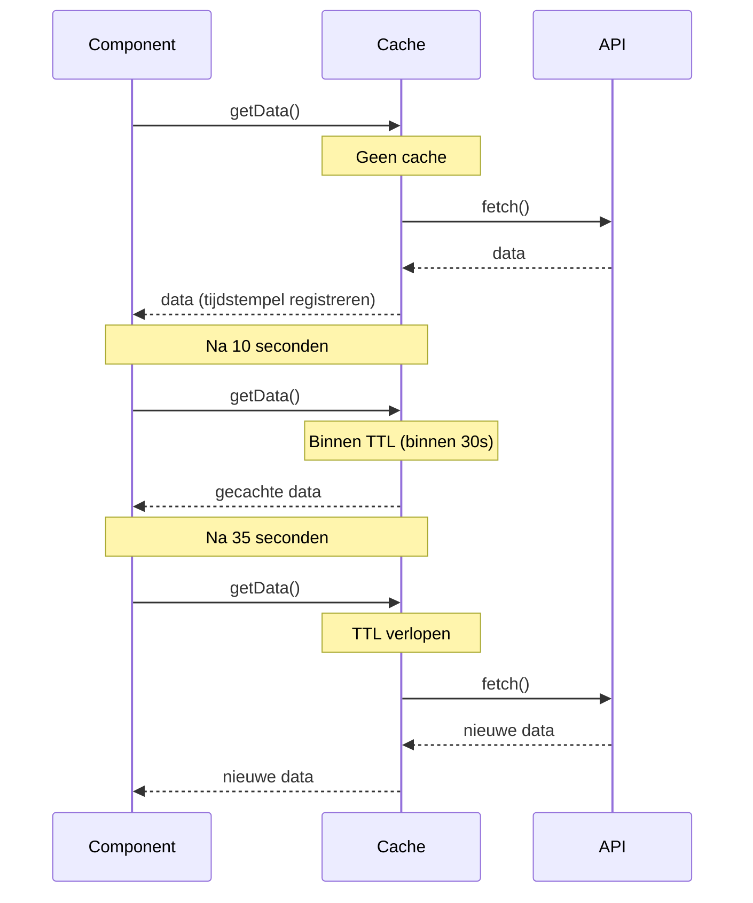
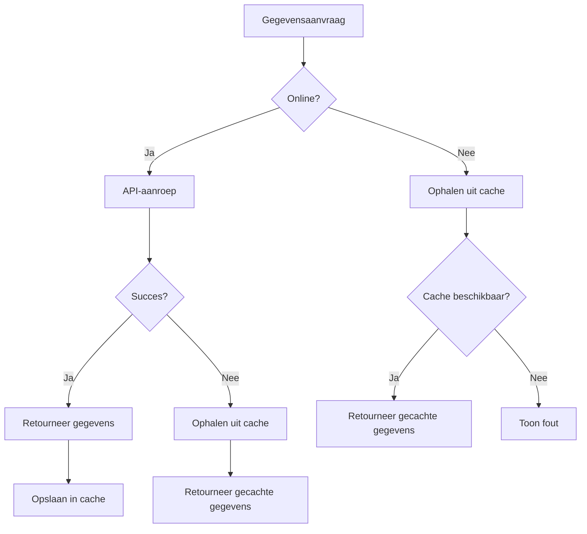

# Cachestrategiepatronen

Caching is een van de belangrijkste technieken voor prestatie-optimalisatie, en met RxJS kun je declaratieve en flexibele caching-strategieën implementeren.

Dit artikel beschrijft specifieke patronen van caching-strategieën die in de praktijk nodig zijn, van basis-caching met shareReplay tot caching met TTL, cache-invalidatie en coördinatie met lokale opslag.

## Wat je in dit artikel leert

- Basis-caching met shareReplay
- Implementatie van cache met TTL (time-to-live)
- Handmatige vernieuwing en cache-invalidatie
- Interactie met lokale opslag
- Offline-ondersteuning en cache-fallback
- Cache-monitoring en debugging

> [!TIP] Vereisten
> Dit artikel is gebaseerd op [Hoofdstuk 2: Cold/Hot Observable](../observables/cold-and-hot-observables.md) en [Hoofdstuk 4: Operators](../operators/index.md). Een begrip van `shareReplay` en `share` is bijzonder belangrijk.

## Basis-cache (shareReplay)

### Probleem: Vermijd het meerdere keren aanroepen van dezelfde API

Wanneer meerdere componenten dezelfde API-gegevens nodig hebben, willen we dubbele verzoeken vermijden.

### Oplossing: Cache met shareReplay

```typescript
import { Observable, of, shareReplay, catchError, tap } from 'rxjs';

interface User {
  id: number;
  name: string;
  email: string;
}

class UserService {
  private users$: Observable<User[]> | null = null;

  getUsers(): Observable<User[]> {
    // Retourneer cache indien beschikbaar
    if (this.users$) {
      console.log('Retourneren vanuit cache');
      return this.users$;
    }

    // Creëer nieuw verzoek en cache
    console.log('Uitvoeren van nieuw verzoek');
    this.users$ = this.fetchUsersFromAPI().pipe(
      tap(() => console.log('API-aanroep voltooid')),
      shareReplay(1), // Cache de laatste 1 waarde
      catchError(err => {
        // Wis cache bij fout
        this.users$ = null;
        throw err;
      })
    );

    return this.users$;
  }

  clearCache(): void {
    this.users$ = null;
    console.log('Cache gewist');
  }

  private fetchUsersFromAPI(): Observable<User[]> {
    return of([
      { id: 1, name: 'Taro Yamada', email: 'yamada@example.com' },
      { id: 2, name: 'Hanako Sato', email: 'sato@example.com' }
    ]);
  }
}

// Gebruiksvoorbeeld
const userService = new UserService();

// Eerste aanroep (API-uitvoering)
userService.getUsers().subscribe(users => {
  console.log('Component 1:', users);
});

// Tweede aanroep (vanuit cache)
userService.getUsers().subscribe(users => {
  console.log('Component 2:', users);
});

// Output:
// Uitvoeren van nieuw verzoek
// API-aanroep voltooid
// Component 1: [...]
// Retourneren vanuit cache
// Component 2: [...]
```

> [!IMPORTANT] Opmerkingen over shareReplay
> - **Geheugenlek**: houdt cache zelfs wanneer abonnementen naar 0 gaan
> - **Referentietype delen**: objecten worden gedeeld via referentie, dus wijzigingen beïnvloeden alle abonnees
> - **Foutafhandeling**: aanbevolen om cache te wissen bij fouten

### shareReplay Configuratieopties

```typescript
import { shareReplay } from 'rxjs';

// Basisgebruik
source$.pipe(
  shareReplay(1) // Cache de laatste 1 waarde
);

// Gedetailleerde configuratie
source$.pipe(
  shareReplay({
    bufferSize: 1,        // Aantal te cachen waarden
    refCount: true,       // Vernietig cache wanneer aantal abonnees 0 bereikt
    windowTime: 5000      // Vernietig cache na 5 seconden (optioneel)
  })
);
```

> [!TIP] Verschillend gebruik van refCount
> - `refCount: true` - verwijder cache wanneer aantal abonnees 0 bereikt (geheugenefficiëntie ◎)
> - `refCount: false` (standaard) - persistente cache (prestaties ◎)
>
> Kies volgens uw gebruikssituatie.

## Cache met TTL (Time To Live)

### Probleem: Ik wil oude caches automatisch invalideren

Ik wil de cache automatisch vernietigen na een bepaalde periode en nieuwe gegevens ophalen.

### Oplossing: Combineer tijdstempels en filters

```typescript
import { Observable, of, shareReplay, map, switchMap } from 'rxjs';

interface CachedData<T> {
  data: T;
  timestamp: number;
}

class TTLCacheService<T> {
  private cache$: Observable<CachedData<T>> | null = null;
  private ttl: number; // Time To Live (milliseconden)

  constructor(ttl: number = 60000) {
    this.ttl = ttl; // Standaard: 60 seconden
  }

  getData(fetchFn: () => Observable<T>): Observable<T> {
    if (this.cache$) {
      // Controleer of cache geldig is
      return this.cache$.pipe(
        switchMap(cached => {
          const age = Date.now() - cached.timestamp;
          if (age < this.ttl) {
            console.log(`Retourneren vanuit cache (verloopt over ${(this.ttl - age) / 1000}s)`);
            return of(cached.data);
          } else {
            console.log('Cache verlopen - nieuwe ophalen');
            this.cache$ = null;
            return this.getData(fetchFn);
          }
        })
      );
    }

    // Haal nieuwe gegevens op en cache
    console.log('Uitvoeren van nieuw verzoek');
    this.cache$ = fetchFn().pipe(
      map(data => ({
        data,
        timestamp: Date.now()
      })),
      shareReplay(1)
    );

    return this.cache$.pipe(map(cached => cached.data));
  }

  clearCache(): void {
    this.cache$ = null;
    console.log('Cache gewist');
  }

  getCacheAge(): number | null {
    // Haal verstreken cachetijd op (voor debugging)
    if (!this.cache$) return null;

    let timestamp = 0;
    this.cache$.subscribe(cached => {
      timestamp = cached.timestamp;
    });

    return Date.now() - timestamp;
  }
}

// Gebruiksvoorbeeld
interface Product {
  id: number;
  name: string;
  price: number;
}

const productCache = new TTLCacheService<Product[]>(30000); // 30 seconden TTL

function fetchProducts(): Observable<Product[]> {
  console.log('API-aanroep');
  return of([
    { id: 1, name: 'Product A', price: 1000 },
    { id: 2, name: 'Product B', price: 2000 }
  ]);
}

// Eerste keer (nieuwe ophaling)
productCache.getData(() => fetchProducts()).subscribe(products => {
  console.log('Opgehaald:', products);
});

// Na 10 seconden (vanuit cache)
setTimeout(() => {
  productCache.getData(() => fetchProducts()).subscribe(products => {
    console.log('Na 10s:', products);
    console.log('Cache-leeftijd:', productCache.getCacheAge(), 'ms');
  });
}, 10000);

// Na 35 seconden (verlopen, opnieuw ophalen)
setTimeout(() => {
  productCache.getData(() => fetchProducts()).subscribe(products => {
    console.log('Na 35s (verlopen):', products);
  });
}, 35000);
```

**TTL Cache-gedrag:**



## Handmatige vernieuwing en cache-invalidatie

### Probleem: Gebruiker wil gegevens willekeurig vernieuwen

Wanneer op de "Vernieuwen"-knop wordt geklikt, wil ik de cache weggooien en de nieuwste gegevens ophalen.

### Oplossing: Controle door Subject en switch

```typescript
import { Observable, Subject, merge, of, switchMap, shareReplay, tap } from 'rxjs';

class RefreshableCacheService<T> {
  private refreshTrigger$ = new Subject<void>();
  private cache$: Observable<T>;

  constructor(fetchFn: () => Observable<T>) {
    this.cache$ = merge(
      this.refreshTrigger$.pipe(
        tap(() => console.log('Handmatige vernieuwing'))
      ),
      // Voor initiële uitvoering
      of(undefined).pipe(tap(() => console.log('Initiële lading')))
    ).pipe(
      switchMap(() => fetchFn()),
      tap(data => console.log('Gegevens ophalen voltooid:', data)),
      shareReplay(1)
    );
  }

  getData(): Observable<T> {
    return this.cache$;
  }

  refresh(): void {
    this.refreshTrigger$.next();
  }
}

const refreshButton = document.createElement('button');
refreshButton.id = 'refresh-button';
refreshButton.textContent = 'Nieuws vernieuwen';
refreshButton.style.padding = '10px 20px';
refreshButton.style.margin = '10px';
refreshButton.style.fontSize = '16px';
refreshButton.style.fontWeight = 'bold';
refreshButton.style.color = '#fff';
refreshButton.style.backgroundColor = '#2196F3';
refreshButton.style.border = 'none';
refreshButton.style.borderRadius = '4px';
refreshButton.style.cursor = 'pointer';
document.body.appendChild(refreshButton);

const newsContainer = document.createElement('div');
newsContainer.id = 'news-container';
newsContainer.style.padding = '15px';
newsContainer.style.margin = '10px';
newsContainer.style.border = '2px solid #ccc';
newsContainer.style.borderRadius = '8px';
newsContainer.style.minHeight = '200px';
newsContainer.style.backgroundColor = '#f9f9f9';
document.body.appendChild(newsContainer);

const newsCache = new RefreshableCacheService<string[]>(() =>
  of(['Nieuws 1', 'Nieuws 2', 'Nieuws 3'])
);

// Abonneer op gegevens
newsCache.getData().subscribe(news => {
  console.log('Nieuwslijst:', news);
  displayNews(news, newsContainer);
});

// Vernieuwingsknop klik
refreshButton.addEventListener('click', () => {
  console.log('Gebruiker klikte op vernieuwen');
  refreshButton.textContent = 'Vernieuwen...';
  refreshButton.disabled = true;
  refreshButton.style.backgroundColor = '#999';
  newsCache.refresh();
  setTimeout(() => {
    refreshButton.textContent = 'Nieuws vernieuwen';
    refreshButton.disabled = false;
    refreshButton.style.backgroundColor = '#2196F3';
  }, 1000);
});

function displayNews(news: string[], container: HTMLElement): void {
  container.innerHTML = news
    .map(item => `<div style="padding: 10px; margin: 5px 0; border-bottom: 1px solid #ddd; font-size: 14px;">${item}</div>`)
    .join('');

  if (news.length === 0) {
    container.innerHTML = '<div style="padding: 20px; text-align: center; color: #999;">Geen nieuws</div>';
  }
}
```

### Voorwaardelijke cache-invalidatie

```typescript
import { BehaviorSubject, Observable, switchMap, shareReplay, distinctUntilChanged, of } from 'rxjs';

interface CacheOptions {
  forceRefresh: boolean;
  userId?: number;
}

class ConditionalCacheService {
  private options$ = new BehaviorSubject<CacheOptions>({
    forceRefresh: false
  });

  data$ = this.options$.pipe(
    distinctUntilChanged((prev, curr) => {
      // Haal opnieuw op als forceRefresh of userId verandert
      return !curr.forceRefresh && prev.userId === curr.userId;
    }),
    switchMap(options => {
      console.log('Gegevens ophalen:', options);
      return this.fetchData(options.userId);
    }),
    shareReplay(1)
  );

  getData(userId?: number): Observable<any> {
    this.options$.next({
      forceRefresh: false,
      userId
    });
    return this.data$;
  }

  refresh(userId?: number): void {
    this.options$.next({
      forceRefresh: true,
      userId
    });
  }

  private fetchData(userId?: number): Observable<any> {
    console.log('API-aanroep - userId:', userId);
    return of({ userId, data: 'voorbeeldgegevens' });
  }
}

// Gebruiksvoorbeeld
const conditionalCache = new ConditionalCacheService();

// Haal gegevens van gebruiker 1 op
conditionalCache.getData(1).subscribe(data => {
  console.log('Gebruiker 1 gegevens:', data);
});

// Dezelfde gebruiker, dus vanuit cache
conditionalCache.getData(1).subscribe(data => {
  console.log('Gebruiker 1 gegevens (gecached):', data);
});

// Andere gebruiker, dus opnieuw ophalen
conditionalCache.getData(2).subscribe(data => {
  console.log('Gebruiker 2 gegevens:', data);
});

// Handmatige vernieuwing
conditionalCache.refresh(1);
```

## Integratie met lokale opslag

### Probleem: Ik wil de cache behouden na het opnieuw laden van de pagina

Ik wil een persistente cache implementeren met behulp van de lokale opslag van de browser.

### Oplossing: Combineer met lokale opslag

```typescript
import { Observable, of, defer, tap, catchError } from 'rxjs';

interface StorageCacheOptions {
  key: string;
  ttl?: number; // milliseconden
}

interface CachedItem<T> {
  data: T;
  timestamp: number;
}

class LocalStorageCacheService {
  getOrFetch<T>(
    options: StorageCacheOptions,
    fetchFn: () => Observable<T>
  ): Observable<T> {
    return defer(() => {
      // Probeer op te halen uit lokale opslag
      const cached = this.getFromStorage<T>(options.key, options.ttl);

      if (cached) {
        console.log('Opgehaald uit lokale opslag:', options.key);
        return of(cached);
      }

      // Geen cache, dus nieuwe ophalen
      console.log('Nieuwe ophaling:', options.key);
      return fetchFn().pipe(
        tap(data => {
          this.saveToStorage(options.key, data);
        }),
        catchError(err => {
          console.error('Ophalingsfout:', err);
          throw err;
        })
      );
    });
  }

  private getFromStorage<T>(key: string, ttl?: number): T | null {
    try {
      const item = localStorage.getItem(key);
      if (!item) return null;

      const cached: CachedItem<T> = JSON.parse(item);

      // TTL-controle
      if (ttl) {
        const age = Date.now() - cached.timestamp;
        if (age > ttl) {
          console.log('Cache verlopen:', key);
          localStorage.removeItem(key);
          return null;
        }
      }

      return cached.data;
    } catch (error) {
      console.error('Lokale opslag leesfout:', error);
      return null;
    }
  }

  private saveToStorage<T>(key: string, data: T): void {
    try {
      const item: CachedItem<T> = {
        data,
        timestamp: Date.now()
      };
      localStorage.setItem(key, JSON.stringify(item));
      console.log('Opgeslagen in lokale opslag:', key);
    } catch (error) {
      console.error('Lokale opslag opslagfout:', error);
    }
  }

  clearCache(key?: string): void {
    if (key) {
      localStorage.removeItem(key);
      console.log('Cache gewist:', key);
    } else {
      localStorage.clear();
      console.log('Alle cache gewist');
    }
  }

  getCacheSize(): number {
    let size = 0;
    for (const key in localStorage) {
      if (localStorage.hasOwnProperty(key)) {
        size += localStorage[key].length;
      }
    }
    return size;
  }
}

// Gebruiksvoorbeeld
interface Settings {
  theme: string;
  language: string;
  notifications: boolean;
}

const storageCache = new LocalStorageCacheService();

function fetchSettings(): Observable<Settings> {
  console.log('Instellingen ophalen van API');
  return of({
    theme: 'dark',
    language: 'nl',
    notifications: true
  });
}

// Haal instellingen op (vanuit lokale opslag of API)
storageCache.getOrFetch(
  { key: 'user-settings', ttl: 3600000 }, // 1 uur TTL
  fetchSettings
).subscribe(settings => {
  console.log('Instellingen:', settings);
  applySettings(settings);
});

// Dezelfde gegevens opgehaald na pagina herladen (indien binnen TTL)
// storageCache.getOrFetch(...) // vanuit lokale opslag

function applySettings(settings: Settings): void {
  document.body.className = `theme-${settings.theme}`;
  console.log('Instellingen toegepast:', settings);
}
```

### Opslag groottebeheer

```typescript
class ManagedStorageCacheService extends LocalStorageCacheService {
  private maxSize = 5 * 1024 * 1024; // 5MB

  saveWithLimit<T>(key: string, data: T): boolean {
    const item: CachedItem<T> = {
      data,
      timestamp: Date.now()
    };

    const itemString = JSON.stringify(item);
    const itemSize = new Blob([itemString]).size;

    // Als huidige grootte + nieuwe itemgrootte de limiet overschrijdt
    if (this.getCacheSize() + itemSize > this.maxSize) {
      console.log('Opslagcapaciteitslimiet - oudste item verwijderen');
      this.removeOldestItem();
    }

    try {
      localStorage.setItem(key, itemString);
      return true;
    } catch (error) {
      console.error('Opslaan mislukt:', error);
      return false;
    }
  }

  private removeOldestItem(): void {
    let oldestKey: string | null = null;
    let oldestTimestamp = Date.now();

    for (const key in localStorage) {
      if (localStorage.hasOwnProperty(key)) {
        try {
          const item = JSON.parse(localStorage[key]);
          if (item.timestamp < oldestTimestamp) {
            oldestTimestamp = item.timestamp;
            oldestKey = key;
          }
        } catch (error) {
          // Negeer parse-fouten
        }
      }
    }

    if (oldestKey) {
      localStorage.removeItem(oldestKey);
      console.log('Oudste item verwijderd:', oldestKey);
    }
  }
}
```

## Offline-ondersteuning

### Probleem: Ik wil gecachte gegevens weergeven wanneer offline

We willen UX verbeteren door gecachte gegevens weer te geven, zelfs wanneer er geen netwerkverbinding is.

### Oplossing: Cache-first strategie

```typescript
import { Observable, of, throwError, fromEvent, merge, map, startWith, distinctUntilChanged, switchMap, catchError, tap } from 'rxjs';

class OfflineFirstCacheService {
  private onlineStatus$ = merge(
    fromEvent(window, 'online').pipe(map(() => true)),
    fromEvent(window, 'offline').pipe(map(() => false))
  ).pipe(
    startWith(navigator.onLine),
    distinctUntilChanged(),
    tap(online => console.log('Online-status:', online))
  );

  getData<T>(
    cacheKey: string,
    fetchFn: () => Observable<T>
  ): Observable<T> {
    return this.onlineStatus$.pipe(
      switchMap(online => {
        if (online) {
          // Online: ophalen van API en cachen
          console.log('Online - ophalen van API');
          return fetchFn().pipe(
            tap(data => {
              this.saveToCache(cacheKey, data);
            }),
            catchError(err => {
              console.error('API-ophalingsfout - terugvallen op cache');
              return this.getFromCache<T>(cacheKey);
            })
          );
        } else {
          // Offline: ophalen uit cache
          console.log('Offline - ophalen uit cache');
          return this.getFromCache<T>(cacheKey);
        }
      })
    );
  }

  private saveToCache<T>(key: string, data: T): void {
    try {
      localStorage.setItem(key, JSON.stringify(data));
      console.log('Cache opgeslagen:', key);
    } catch (error) {
      console.error('Cache opslaan mislukt:', error);
    }
  }

  private getFromCache<T>(key: string): Observable<T> {
    try {
      const cached = localStorage.getItem(key);
      if (cached) {
        const data = JSON.parse(cached);
        console.log('Opgehaald uit cache:', key);
        return of(data);
      }
    } catch (error) {
      console.error('Cache-leesfout:', error);
    }

    return throwError(() => new Error('Cache niet gevonden'));
  }
}

// Traditionele benadering (als referentie uitgecommentarieerd)
// const container = document.querySelector('#articles');
// const message = document.querySelector('#offline-message');

// Zelfstandig: creëert artikelenweergave dynamisch
const articlesContainer = document.createElement('div');
articlesContainer.id = 'articles';
articlesContainer.style.padding = '15px';
articlesContainer.style.margin = '10px';
articlesContainer.style.border = '2px solid #ccc';
articlesContainer.style.borderRadius = '8px';
articlesContainer.style.backgroundColor = '#f9f9f9';
document.body.appendChild(articlesContainer);

const offlineMessage = document.createElement('div');
offlineMessage.id = 'offline-message';
offlineMessage.style.padding = '15px';
offlineMessage.style.margin = '10px';
offlineMessage.style.backgroundColor = '#f8d7da';
offlineMessage.style.color = '#721c24';
offlineMessage.style.border = '1px solid #f5c6cb';
offlineMessage.style.borderRadius = '4px';
offlineMessage.style.display = 'none';
offlineMessage.style.textAlign = 'center';
offlineMessage.style.fontWeight = 'bold';
document.body.appendChild(offlineMessage);

// Gebruiksvoorbeeld
const offlineCache = new OfflineFirstCacheService();

function fetchArticles(): Observable<any[]> {
  return of([
    { id: 1, title: 'Artikel 1', content: 'Inhoud 1' },
    { id: 2, title: 'Artikel 2', content: 'Inhoud 2' }
  ]);
}

offlineCache.getData('articles', fetchArticles).subscribe({
  next: articles => {
    console.log('Artikelen:', articles);
    displayArticles(articles, articlesContainer);
    offlineMessage.style.display = 'none';
  },
  error: err => {
    console.error('Gegevens ophalen mislukt:', err);
    showOfflineMessage(offlineMessage);
  }
});

function displayArticles(articles: any[], container: HTMLElement): void {
  container.innerHTML = articles
    .map(a => `
      <article style="padding: 15px; margin: 10px 0; border-bottom: 2px solid #ddd;">
        <h2 style="margin: 0 0 10px 0; font-size: 18px; color: #333;">${a.title}</h2>
        <p style="margin: 0; font-size: 14px; color: #666;">${a.content}</p>
      </article>
    `)
    .join('');

  if (articles.length === 0) {
    container.innerHTML = '<div style="padding: 20px; text-align: center; color: #999;">Geen artikelen</div>';
  }
}

function showOfflineMessage(message: HTMLElement): void {
  message.textContent = 'Offline. Geen gecachte gegevens beschikbaar.';
  message.style.display = 'block';
}
```

**Offline-ondersteuningsstrategie:**



## Cache-monitoring en debugging

### Visualisatie van cache-status

```typescript
import { BehaviorSubject, Observable, map } from 'rxjs';

interface CacheEntry {
  key: string;
  size: number;
  timestamp: number;
  hits: number;
}

interface CacheStats {
  entries: CacheEntry[];
  totalSize: number;
  hitRate: number;
}

class ObservableCacheService {
  private cacheEntries$ = new BehaviorSubject<Map<string, CacheEntry>>(new Map());
  private totalRequests = 0;
  private cacheHits = 0;

  stats$: Observable<CacheStats> = this.cacheEntries$.pipe(
    map(entries => {
      const entriesArray = Array.from(entries.values());
      const totalSize = entriesArray.reduce((sum, entry) => sum + entry.size, 0);
      const hitRate = this.totalRequests > 0
        ? (this.cacheHits / this.totalRequests) * 100
        : 0;

      return {
        entries: entriesArray,
        totalSize,
        hitRate
      };
    })
  );

  getData<T>(key: string, fetchFn: () => Observable<T>): Observable<T> {
    this.totalRequests++;

    const entries = this.cacheEntries$.value;
    const entry = entries.get(key);

    if (entry) {
      // Cache-hit
      this.cacheHits++;
      entry.hits++;
      this.cacheEntries$.next(new Map(entries));
      console.log(`Cache-hit: ${key} (${entry.hits} keer)`);
      // Werkelijke gegevensophalinglogica
    } else {
      // Cache-miss
      console.log(`Cache-miss: ${key}`);
      // Nieuwe ophaling en cache-registratie
      const newEntry: CacheEntry = {
        key,
        size: 0, // Bereken werkelijke gegevensgrootte
        timestamp: Date.now(),
        hits: 1
      };
      entries.set(key, newEntry);
      this.cacheEntries$.next(new Map(entries));
    }

    return fetchFn();
  }

  clearStats(): void {
    this.totalRequests = 0;
    this.cacheHits = 0;
    this.cacheEntries$.next(new Map());
  }
}

// Traditionele benadering (als referentie uitgecommentarieerd)
// const statsElement = document.querySelector('#cache-stats');

// Zelfstandig: creëert cache-statistieken element dynamisch
const cacheStatsElement = document.createElement('div');
cacheStatsElement.id = 'cache-stats';
cacheStatsElement.style.padding = '20px';
cacheStatsElement.style.margin = '10px';
cacheStatsElement.style.border = '2px solid #ccc';
cacheStatsElement.style.borderRadius = '8px';
cacheStatsElement.style.backgroundColor = '#f9f9f9';
cacheStatsElement.style.fontFamily = 'monospace';
document.body.appendChild(cacheStatsElement);

// Gebruiksvoorbeeld
const observableCache = new ObservableCacheService();

// Monitor cache-statistieken
observableCache.stats$.subscribe(stats => {
  console.log('=== Cache-statistieken ===');
  console.log(`Vermeldingen: ${stats.entries.length}`);
  console.log(`Totale grootte: ${(stats.totalSize / 1024).toFixed(2)} KB`);
  console.log(`Hit-rate: ${stats.hitRate.toFixed(1)}%`);

  // Update UI
  updateCacheStatsUI(stats, cacheStatsElement);
});

function updateCacheStatsUI(stats: CacheStats, element: HTMLElement): void {
  element.innerHTML = `
    <div style="margin-bottom: 15px;">
      <h3 style="margin: 0 0 10px 0; color: #333;">Cache-statistieken</h3>
      <div style="padding: 10px; background-color: #fff; border-radius: 4px; margin: 5px 0;">
        <strong>Vermeldingen:</strong> ${stats.entries.length}
      </div>
      <div style="padding: 10px; background-color: #fff; border-radius: 4px; margin: 5px 0;">
        <strong>Totale grootte:</strong> ${(stats.totalSize / 1024).toFixed(2)} KB
      </div>
      <div style="padding: 10px; background-color: #fff; border-radius: 4px; margin: 5px 0;">
        <strong>Hit-rate:</strong> ${stats.hitRate.toFixed(1)}%
      </div>
    </div>
    <div>
      <h4 style="margin: 10px 0; color: #666;">Vermeldingen:</h4>
      ${stats.entries.map(e => `
        <div style="display: flex; justify-content: space-between; padding: 8px; margin: 5px 0; background-color: #fff; border-radius: 4px; border-left: 3px solid #2196F3;">
          <span style="font-weight: bold;">${e.key}</span>
          <span style="color: #2196F3;">${e.hits} hits</span>
        </div>
      `).join('')}
    </div>
  `;

  if (stats.entries.length === 0) {
    element.innerHTML = '<div style="padding: 20px; text-align: center; color: #999;">Geen cache-vermeldingen</div>';
  }
}
```

## Samenvatting

Het beheersen van het cachestrategiepatroon kan de prestaties en gebruikerservaring aanzienlijk verbeteren.

> [!IMPORTANT] Belangrijkste punten
> - **shareReplay**: beste voor basis geheugencaching
> - **TTL**: automatische invalidatie van verouderde gegevens
> - **Handmatige vernieuwing**: door gebruiker geïnitieerde update
> - **Lokale opslag**: persistente cache
> - **Offline-ondersteuning**: cache-first strategie
> - **Monitoring**: visualisatie van hit-rates en groottes

> [!TIP] Beste praktijken
> - **Geschikte TTL**: vervaltijd gebaseerd op de aard van de gegevens
> - **Wissen bij fout**: vernietig cache bij fouten
> - **Groottebeheer**: stel opslagcapaciteitslimieten in
> - **Gebruik van refCount**: voorkom geheugenlekken
> - **Cache-sleutel**: gebruik een unieke en gemakkelijk te begrijpen sleutel

## Volgende stappen

Zodra je het cachestrategiepatroon beheerst, ga je verder met de volgende patronen.

- [Realtime gegevensverwerking](./real-time-data.md) - Cache realtime gegevens
- [API-aanroepen](./api-calls.md) - Cache API-reacties
- [UI-gebeurtenisverwerking](./ui-events.md) - Cache gebeurtenisgegevens
- Foutafhandeling in de praktijk (in voorbereiding) - Omgaan met cache-fouten

## Gerelateerde secties

- [Hoofdstuk 2: Cold/Hot Observable](../observables/cold-and-hot-observables.md) - shareReplay-details
- [Hoofdstuk 4: Operators](../operators/multicasting/shareReplay.md) - Hoe shareReplay te gebruiken
- [Hoofdstuk 10: Anti-patronen](../anti-patterns/common-mistakes.md) - Misbruik van shareReplay

## Referentiebronnen

- [RxJS Officieel: shareReplay](https://rxjs.dev/api/operators/shareReplay) - Meer over shareReplay
- [MDN: Web Storage API](https://developer.mozilla.org/nl/docs/Web/API/Web_Storage_API) - Hoe lokale opslag te gebruiken
- [Learn RxJS: Caching](https://www.learnrxjs.io/) - Praktische voorbeelden van cache-patronen
