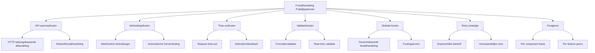

# Foutafhandeling Praktijkpatronen

In RxJS-applicaties is correcte foutafhandeling de basis voor het bouwen van een betrouwbaar systeem. Dit artikel presenteert zeven foutafhandelingspatronen die onmiddellijk in de praktijk kunnen worden gebruikt.

## Waarom is foutafhandeling belangrijk?

In een Observable-stream wordt de stream beëindigd als er een fout optreedt en stromen er geen verdere waarden meer. Het niet begrijpen van dit kenmerk en het verwaarlozen van foutafhandeling kan ertoe leiden dat de applicatie onverwacht stopt of geen correcte feedback aan de gebruiker geeft.

**Drie doelstellingen van foutafhandeling**:
1. **Continuïteit garanderen** - Ervoor zorgen dat de stream kan doorgaan nadat er een fout is opgetreden
2. **Gebruikerservaring verbeteren** - Passende foutmeldingen en herstelmogelijkheden bieden
3. **Systeemobserveerbaarheid** - Vroege detectie van problemen door foutlogboeken en monitoring

Dit artikel legt uit hoe je de basiskennis die je hebt geleerd in Hoofdstuk 6, "[Foutafhandeling](/nl/guide/error-handling/strategies.md)" toepast op praktische scenario's.

## Structuur van dit artikel



## Foutafhandeling bij API-aanroepen

API-aanroepen zijn het meest foutgevoelig; er moet een verscheidenheid aan foutscenario's worden afgehandeld, waaronder HTTP-statuscodes, netwerkfouten en time-outs.

### Foutafhandeling op basis van HTTP-status

Afhankelijk van de HTTP-statuscode wordt de juiste foutafhandeling uitgevoerd.

```typescript
import { Observable, throwError, catchError, retry, tap } from 'rxjs';
import { ajax, AjaxError } from 'rxjs/ajax';

/**
 * HTTP foutdetails
 */
interface HttpErrorInfo {
  status: number;
  message: string;
  retryable: boolean;
  userMessage: string;
}

/**
 * HTTP foutclassificatieservice
 */
class HttpErrorClassifier {
  /**
   * Genereer foutinformatie uit statuscode
   */
  classify(error: AjaxError): HttpErrorInfo {
    const status = error.status;

    // 4xx Client fouten
    if (status >= 400 && status < 500) {
      return this.handleClientError(status, error);
    }

    // 5xx Server fouten
    if (status >= 500) {
      return this.handleServerError(status, error);
    }

    // Netwerkfout (status = 0)
    if (status === 0) {
      return {
        status: 0,
        message: 'Netwerkfout',
        retryable: true,
        userMessage: 'Kan geen verbinding maken met het netwerk. Controleer de verbinding.'
      };
    }

    // Overige fouten
    return {
      status,
      message: 'Onbekende fout',
      retryable: false,
      userMessage: 'Er is een onverwachte fout opgetreden.'
    };
  }

  private handleClientError(status: number, error: AjaxError): HttpErrorInfo {
    switch (status) {
      case 400:
        return {
          status,
          message: 'Bad Request',
          retryable: false,
          userMessage: 'Er is een fout in de ingevoerde informatie.'
        };

      case 401:
        return {
          status,
          message: 'Unauthorized',
          retryable: false,
          userMessage: 'Authenticatie vereist. Log alstublieft in.'
        };

      case 403:
        return {
          status,
          message: 'Forbidden',
          retryable: false,
          userMessage: 'U bent niet gemachtigd om deze bewerking uit te voeren.'
        };

      case 404:
        return {
          status,
          message: 'Not Found',
          retryable: false,
          userMessage: 'Gegevens niet gevonden.'
        };

      case 422:
        return {
          status,
          message: 'Unprocessable Entity',
          retryable: false,
          userMessage: 'Invoergegevens kunnen niet worden verwerkt.'
        };

      case 429:
        return {
          status,
          message: 'Too Many Requests',
          retryable: true, // Herhaalbaar (wachttijd vereist)
          userMessage: 'Te veel verzoeken. Wacht even en probeer het opnieuw.'
        };

      default:
        return {
          status,
          message: `Client Error ${status}`,
          retryable: false,
          userMessage: 'Het verzoek kon niet worden verwerkt.'
        };
    }
  }

  private handleServerError(status: number, error: AjaxError): HttpErrorInfo {
    switch (status) {
      case 500:
        return {
          status,
          message: 'Internal Server Error',
          retryable: true,
          userMessage: 'Er is een serverfout opgetreden. Wacht een moment en probeer het opnieuw.'
        };

      case 502:
      case 503:
      case 504:
        return {
          status,
          message: 'Service Unavailable',
          retryable: true,
          userMessage: 'De server is tijdelijk niet beschikbaar. Wacht een moment en probeer het opnieuw.'
        };

      default:
        return {
          status,
          message: `Server Error ${status}`,
          retryable: true,
          userMessage: 'Er is een serverfout opgetreden.'
        };
    }
  }
}

/**
 * HTTP client service
 */
class HttpClientService {
  private errorClassifier = new HttpErrorClassifier();

  /**
   * GET verzoek (met foutafhandeling)
   */
  get<T>(url: string): Observable<T> {
    return ajax.get<T>(url).pipe(
      tap(() => console.log(`GET ${url} - Success`)),
      catchError(error => this.handleError(error, url))
    );
  }

  /**
   * POST verzoek (met foutafhandeling)
   */
  post<T>(url: string, body: any): Observable<T> {
    return ajax.post<T>(url, body).pipe(
      tap(() => console.log(`POST ${url} - Success`)),
      catchError(error => this.handleError(error, url))
    );
  }

  /**
   * Geünificeerde foutafhandeling
   */
  private handleError(error: any, url: string): Observable<never> {
    console.error(`HTTP Error at ${url}:`, error);

    if (error instanceof AjaxError) {
      const errorInfo = this.errorClassifier.classify(error);

      // Log foutinformatie
      this.logError(errorInfo, url);

      // Gooi gebruiksvriendelijke fout
      return throwError(() => errorInfo);
    }

    // Niet-AjaxError fouten (bijv. programmeerfouten)
    return throwError(() => ({
      status: -1,
      message: error.message || 'Onbekende fout',
      retryable: false,
      userMessage: 'Er is een onverwachte fout opgetreden.'
    }));
  }

  private logError(errorInfo: HttpErrorInfo, url: string): void {
    // Stuur naar foutlogservice (later beschreven)
    console.error('HTTP Error:', {
      url,
      status: errorInfo.status,
      message: errorInfo.message,
      timestamp: new Date().toISOString()
    });
  }
}
```

> [!TIP] HTTP foutclassificatiecriteria
> - **4xx Client Fouten**: Normaal niet herhaalbaar (invoercorrectie vereist)
> - **5xx Server Fout**: retry toegestaan (tijdelijk server-side probleem)
> - **429 Too Many Requests**: retry toegestaan maar wachttijd vereist
> - **0 (Netwerkfout)**: Mogelijke retry (verbindingsprobleem)

### Gebruiksvoorbeeld: Foutafhandeling op basis van status

```typescript
import { Component, OnInit } from '@angular/core';
import { Subject, takeUntil } from 'rxjs';

interface User {
  id: number;
  name: string;
  email: string;
}

class UserDetailManager {
  private destroy$ = new Subject<void>();
  private httpClient = new HttpClientService();

  user: User | null = null;
  loading = false;
  errorMessage = '';
  canRetry = false;

  // Callback voor UI-updates (optioneel)
  onStateChange?: (state: { user: User | null; loading: boolean; errorMessage: string; canRetry: boolean }) => void;

  init(): void {
    this.loadUser();
  }

  loadUser(): void {
    this.loading = true;
    this.errorMessage = '';
    this.canRetry = false;
    this.updateUI();

    this.httpClient.get<User>('/api/users/1')
      .pipe(takeUntil(this.destroy$))
      .subscribe({
        next: user => {
          this.user = user;
          this.loading = false;
          this.updateUI();
        },
        error: (errorInfo: HttpErrorInfo) => {
          this.loading = false;
          this.errorMessage = errorInfo.userMessage;
          this.canRetry = errorInfo.retryable;
          this.updateUI();

          // Omleiden naar inlogscherm voor authenticatiefouten
          if (errorInfo.status === 401) {
            setTimeout(() => {
              window.location.href = '/login';
            }, 2000);
          }
        }
      });
  }

  private updateUI(): void {
    if (this.onStateChange) {
      this.onStateChange({
        user: this.user,
        loading: this.loading,
        errorMessage: this.errorMessage,
        canRetry: this.canRetry
      });
    }
  }

  destroy(): void {
    this.destroy$.next();
    this.destroy$.complete();
  }
}

// Gebruiksvoorbeeld
const userDetail = new UserDetailManager();
userDetail.onStateChange = (state) => {
  console.log('State bijgewerkt:', state);
  // Voeg hier UI-updatelogica toe
};
userDetail.init();
```

> [!IMPORTANT] Gebruikerservaringsoverwegingen
> - Foutmeldingen zijn geen technische details, maar geven aan **wat de gebruiker vervolgens moet doen**
> - Herhaalbare fouten tonen een **Opnieuw proberen-knop**
> - Authenticatiefouten **leiden de gebruiker automatisch naar het inlogscherm**

## Afhandeling van netwerkfouten

Aangezien netwerkfouten vaak tijdelijke problemen zijn, implementeer een geschikte retry-strategie.

```typescript
import { Observable, timer, throwError, retryWhen, mergeMap, tap } from 'rxjs';
/**
 * Netwerkfout specifieke retry-configuratie
 */
interface NetworkRetryConfig {
  maxRetries: number;
  initialDelay: number;
  maxDelay: number;
  backoffMultiplier: number;
}

/**
 * Netwerk retry operator
 */
function retryWithBackoff(config: NetworkRetryConfig) {
  const {
    maxRetries = 3,
    initialDelay = 1000,
    maxDelay = 16000,
    backoffMultiplier = 2
  } = config;

  return <T>(source: Observable<T>) => source.pipe(
    retryWhen(errors => errors.pipe(
      mergeMap((error, index) => {
        const retryAttempt = index + 1;

        // Gooi fout als max retries overschreden
        if (retryAttempt > maxRetries) {
          return throwError(() => ({
            ...error,
            message: `Netwerkfout: ${maxRetries} retries mislukt`,
            userMessage: 'Kan geen verbinding maken met het netwerk. Wacht een moment en probeer het opnieuw.'
          }));
        }

        // Bereken vertraging met exponentiële backoff
        const delay = Math.min(
          initialDelay * Math.pow(backoffMultiplier, index),
          maxDelay
        );

        console.log(
          `Retry ${retryAttempt}/${maxRetries} - Opnieuw proberen na ${delay}ms...`
        );

        // Retry na vertraging
        return timer(delay).pipe(
          tap(() => console.log(`Retry ${retryAttempt} bezig...`))
        );
      })
    ))
  );
}

/**
 * Netwerkbewuste HTTP client
 */
class NetworkAwareHttpClient {
  private httpClient = new HttpClientService();
  private errorClassifier = new HttpErrorClassifier();

  /**
   * GET verzoek met netwerkfoutafhandeling
   */
  get<T>(url: string, retryConfig?: Partial<NetworkRetryConfig>): Observable<T> {
    const defaultConfig: NetworkRetryConfig = {
      maxRetries: 3,
      initialDelay: 1000,
      maxDelay: 16000,
      backoffMultiplier: 2
    };

    const config = { ...defaultConfig, ...retryConfig };

    return this.httpClient.get<T>(url).pipe(
      catchError(error => {
        // Retry alleen voor netwerkfouten (status = 0)
        if (error.status === 0) {
          return throwError(() => error);
        }
        // Faal onmiddellijk voor andere fouten zonder retry
        return throwError(() => error);
      }),
      retryWithBackoff(config)
    );
  }
}
```

### Gebruiksvoorbeeld: Offline ondersteuning

```typescript
import { fromEvent, merge, map, startWith, switchMap, of } from 'rxjs';

/**
 * Online/offline status beheer
 */
class OnlineStatusService {
  /**
   * Observable voor online status
   */
  online$ = merge(
    fromEvent(window, 'online').pipe(map(() => true)),
    fromEvent(window, 'offline').pipe(map(() => false))
  ).pipe(
    startWith(navigator.onLine)
  );
}

/**
 * Offline-capabele dataviewer
 */
class DataViewerManager {
  private destroy$ = new Subject<void>();
  private networkClient = new NetworkAwareHttpClient();
  private onlineStatus = new OnlineStatusService();

  isOnline$ = this.onlineStatus.online$;
  data: any = null;
  loading = false;
  errorMessage = '';

  // Callback voor UI-updates (optioneel)
  onStateChange?: (state: { isOnline: boolean; data: any; loading: boolean; errorMessage: string }) => void;

  init(): void {
    // Laad automatisch gegevens bij online komen
    this.isOnline$.pipe(
      switchMap(isOnline => {
        this.updateUI(isOnline);
        if (isOnline) {
          return this.loadData();
        }
        return of(null);
      }),
      takeUntil(this.destroy$)
    ).subscribe({
      next: data => {
        if (data) {
          this.data = data;
          this.loading = false;
          this.errorMessage = '';
        }
      },
      error: error => {
        this.loading = false;
        this.errorMessage = error.userMessage;
      }
    });
  }

  private loadData(): Observable<any> {
    this.loading = true;

    return this.networkClient.get('/api/data', {
      maxRetries: 5,
      initialDelay: 2000
    });
  }

  private updateUI(isOnline: boolean): void {
    if (this.onStateChange) {
      this.onStateChange({
        isOnline,
        data: this.data,
        loading: this.loading,
        errorMessage: this.errorMessage
      });
    }
  }

  destroy(): void {
    this.destroy$.next();
    this.destroy$.complete();
  }
}

// Gebruiksvoorbeeld
const dataViewer = new DataViewerManager();
dataViewer.onStateChange = (state) => {
  if (!state.isOnline) {
    console.log('U bent offline. Controleer uw internetverbinding.');
  }
  console.log('State bijgewerkt:', state);
};
dataViewer.init();
```

> [!TIP] Best Practices voor offline afhandeling
> - **Monitor online status** en probeer automatisch opnieuw wanneer de verbinding is hersteld
> - **Maak offline staat expliciet** voor gebruikers om frustratie te verminderen
> - **Gedeeltelijk functioneel zelfs wanneer offline in combinatie met lokale cache**

## Time-out fouten afhandelen

Genereer een time-outfout als er gedurende een langere periode geen respons is en handel deze op de juiste manier af.

```typescript
import { timeout, catchError, throwError, Observable } from 'rxjs';

/**
 * Time-out configuratie
 */
interface TimeoutConfig {
  duration: number;
  message: string;
}

/**
 * Time-out bewuste HTTP client
 */
class TimeoutAwareHttpClient {
  private networkClient = new NetworkAwareHttpClient();

  /**
   * GET verzoek met time-out
   */
  get<T>(
    url: string,
    timeoutConfig: TimeoutConfig = {
      duration: 30000,
      message: 'Verzoek verlopen'
    }
  ): Observable<T> {
    return this.networkClient.get<T>(url).pipe(
      timeout({
        each: timeoutConfig.duration,
        with: () => throwError(() => ({
          status: -2, // Aangepaste status voor time-out
          message: 'Timeout',
          retryable: true,
          userMessage: timeoutConfig.message
        }))
      }),
      catchError(error => {
        if (error.status === -2) {
          console.error(`Timeout: ${url} (${timeoutConfig.duration}ms)`);
        }
        return throwError(() => error);
      })
    );
  }

  /**
   * Geschikte time-out instellingen per bewerkingstype
   */
  getWithOperationType<T>(
    url: string,
    operationType: 'fast' | 'normal' | 'slow'
  ): Observable<T> {
    const timeoutConfigs = {
      fast: {
        duration: 5000,
        message: 'Verzoek verlopen (5 seconden)'
      },
      normal: {
        duration: 30000,
        message: 'Verzoek verlopen (30 seconden)'
      },
      slow: {
        duration: 60000,
        message: 'Verzoek verlopen (60 seconden)'
      }
    };

    return this.get<T>(url, timeoutConfigs[operationType]);
  }
}
```

### Voorbeeld van gebruik: Time-out met gebruikersfeedback

```typescript
import { Subject, interval, takeUntil, map, startWith } from 'rxjs';

/**
 * Manager voor langlopende bewerkingen
 */
class SlowOperationManager {
  private destroy$ = new Subject<void>();
  private timeoutClient = new TimeoutAwareHttpClient();

  loading = false;
  elapsedTime = 0;
  errorMessage = '';
  result: any = null;

  // Callback voor UI-updates (optioneel)
  onStateChange?: (state: {
    loading: boolean;
    elapsedTime: number;
    errorMessage: string;
    result: any;
  }) => void;

  startOperation(): void {
    this.loading = true;
    this.errorMessage = '';
    this.result = null;
    this.updateUI();

    // Verstreken tijd teller
    const timer$ = interval(1000).pipe(
      map(count => count + 1),
      startWith(0),
      takeUntil(this.destroy$)
    );

    timer$.subscribe(elapsed => {
      this.elapsedTime = elapsed;
      this.updateUI();
    });

    // Langlopende bewerking (60 seconden time-out)
    this.timeoutClient.getWithOperationType('/api/slow-operation', 'slow')
      .pipe(takeUntil(this.destroy$))
      .subscribe({
        next: result => {
          this.result = result;
          this.loading = false;
          this.destroy$.next(); // Stop timer
          this.updateUI();
        },
        error: error => {
          this.errorMessage = error.userMessage;
          this.loading = false;
          this.destroy$.next(); // Stop timer

          // Toon aanvullende hint voor time-out
          if (error.status === -2) {
            this.errorMessage += ' Serverbelasting kan hoog zijn.';
          }
          this.updateUI();
        }
      });
  }

  retryOperation(): void {
    this.startOperation();
  }

  private updateUI(): void {
    if (this.onStateChange) {
      this.onStateChange({
        loading: this.loading,
        elapsedTime: this.elapsedTime,
        errorMessage: this.errorMessage,
        result: this.result
      });
    }
  }

  destroy(): void {
    this.destroy$.next();
    this.destroy$.complete();
  }
}

// Gebruiksvoorbeeld
const slowOp = new SlowOperationManager();
slowOp.onStateChange = (state) => {
  if (state.loading) {
    console.log(`Verwerking... (${state.elapsedTime} seconden verstreken)`);
    if (state.elapsedTime > 10) {
      console.log('Verwerking duurt even. Wacht een moment.');
    }
  }
  if (state.errorMessage) {
    console.error(state.errorMessage);
  }
  if (state.result) {
    console.log('Verwerking is voltooid:', state.result);
  }
};
slowOp.startOperation();
```

> [!WARNING] Time-out waarde instellen
> - **Te korte time-out**: veroorzaakt dat zelfs normale bewerkingen mislukken
> - **Te lange time-out**: laat de gebruiker te lang wachten
> - **Stel een geschikte waarde in** volgens de aard van de bewerking en toon de verstreken tijd aan de gebruiker

## Globale foutafhandeling

Beheer centraal, log en monitor fouten die in de hele applicatie optreden.

```typescript
import { Subject, Observable, share } from 'rxjs';
/**
 * Fout ernstigheidsniveaus
 */
enum ErrorSeverity {
  Info = 'info',
  Warning = 'warning',
  Error = 'error',
  Critical = 'critical'
}

/**
 * Applicatie foutinformatie
 */
interface AppError {
  id: string;
  timestamp: Date;
  severity: ErrorSeverity;
  message: string;
  userMessage: string;
  context?: any;
  stack?: string;
}

/**
 * Globale foutafhandeling service
 */
class GlobalErrorHandler {
  private errorSubject = new Subject<AppError>();

  /**
   * Stream van alle fouten
   */
  errors$: Observable<AppError> = this.errorSubject.asObservable().pipe(
    share()
  );

  /**
   * Registreer een fout
   */
  handleError(
    error: any,
    severity: ErrorSeverity = ErrorSeverity.Error,
    context?: any
  ): void {
    const appError: AppError = {
      id: this.generateErrorId(),
      timestamp: new Date(),
      severity,
      message: error.message || 'Onbekende fout',
      userMessage: error.userMessage || 'Er is een fout opgetreden',
      context,
      stack: error.stack
    };

    // Push fout naar stream
    this.errorSubject.next(appError);

    // Log naar console
    this.logToConsole(appError);

    // Stuur naar externe logservice voor kritieke/fout ernstigheden
    if (severity === ErrorSeverity.Critical || severity === ErrorSeverity.Error) {
      this.sendToLogService(appError);
    }
  }

  private generateErrorId(): string {
    return `err_${Date.now()}_${Math.random().toString(36).substr(2, 9)}`;
  }

  private logToConsole(error: AppError): void {
    const style = this.getConsoleStyle(error.severity);
    console.error(
      `%c[${error.severity.toUpperCase()}] ${error.message}`,
      style,
      {
        id: error.id,
        timestamp: error.timestamp.toISOString(),
        context: error.context,
        stack: error.stack
      }
    );
  }

  private getConsoleStyle(severity: ErrorSeverity): string {
    const styles = {
      [ErrorSeverity.Info]: 'color: #3498db',
      [ErrorSeverity.Warning]: 'color: #f39c12',
      [ErrorSeverity.Error]: 'color: #e74c3c',
      [ErrorSeverity.Critical]: 'color: #fff; background: #c0392b; font-weight: bold'
    };
    return styles[severity];
  }

  private sendToLogService(error: AppError): void {
    // Stuur naar externe logservice (Sentry, LogRocket, etc.)
    // Voorbeeldimplementatie:
    // Sentry.captureException(error);

    console.log('Stuur fout naar externe logservice:', error.id);
  }
}

/**
 * Foutmeldingsservice
 */
class ErrorNotificationService {
  private notificationSubject = new Subject<{
    message: string;
    type: 'info' | 'warning' | 'error'
  }>();

  notifications$ = this.notificationSubject.asObservable();

  constructor(private globalErrorHandler: GlobalErrorHandler) {
    // Abonneer op globale fouten en toon meldingen
    this.globalErrorHandler.errors$.subscribe(error => {
      this.showNotification(error.userMessage, this.mapSeverityToType(error.severity));
    });
  }

  showNotification(
    message: string,
    type: 'info' | 'warning' | 'error' = 'info'
  ): void {
    this.notificationSubject.next({ message, type });
  }

  private mapSeverityToType(severity: ErrorSeverity): 'info' | 'warning' | 'error' {
    if (severity === ErrorSeverity.Info) return 'info';
    if (severity === ErrorSeverity.Warning) return 'warning';
    return 'error';
  }
}
```

### Gebruiksvoorbeeld: Applicatiebrede foutbeheer

```typescript
import { Subject, Observable, of, switchMap, delay, startWith, catchError, throwError } from 'rxjs';

/**
 * Applicatiebrede foutmanager
 */
class AppErrorManager {
  private destroy$ = new Subject<void>();
  currentNotification$: Observable<any>;

  constructor(
    private errorNotificationService: ErrorNotificationService,
    private globalErrorHandler: GlobalErrorHandler
  ) {
    this.currentNotification$ = this.errorNotificationService.notifications$.pipe(
      switchMap(notification =>
        // Automatisch sluiten na 5 seconden
        of(notification).pipe(
          delay(5000),
          startWith(notification)
        )
      )
    );
  }

  init(): void {
    // Vang onbehandelde Promise-afwijzingen op
    window.addEventListener('unhandledrejection', event => {
      this.globalErrorHandler.handleError(
        { message: event.reason, userMessage: 'Er is een onverwachte fout opgetreden' },
        ErrorSeverity.Error,
        { type: 'unhandledRejection' }
      );
    });

    // Vang JavaScript-fouten op
    window.addEventListener('error', event => {
      this.globalErrorHandler.handleError(
        { message: event.message, stack: event.error?.stack },
        ErrorSeverity.Critical,
        { filename: event.filename, lineno: event.lineno }
      );
    });

    // Abonneer op meldingen voor UI-updates
    this.currentNotification$.subscribe(notification => {
      if (notification) {
        console.log(`[${notification.type}] ${notification.message}`);
      }
    });
  }

  dismissNotification(): void {
    // Sluit melding (vereenvoudigde implementatie)
  }

  destroy(): void {
    this.destroy$.next();
    this.destroy$.complete();
  }
}

/**
 * Gebruikersgegevensbeheerservice
 */
class UserService {
  constructor(
    private httpClient: HttpClientService,
    private globalErrorHandler: GlobalErrorHandler
  ) {}

  loadUser(userId: number): Observable<User> {
    return this.httpClient.get<User>(`/api/users/${userId}`).pipe(
      catchError(error => {
        // Registreer in globale foutafhandeling
        this.globalErrorHandler.handleError(
          error,
          ErrorSeverity.Error,
          { userId, operation: 'loadUser' }
        );

        // Gooi fout opnieuw (sta aanroeper toe om ook af te handelen)
        return throwError(() => error);
      })
    );
  }
}

// Gebruiksvoorbeeld
const globalErrorHandler = new GlobalErrorHandler();
const errorNotificationService = new ErrorNotificationService(globalErrorHandler);
const appErrorManager = new AppErrorManager(errorNotificationService, globalErrorHandler);
appErrorManager.init();

const userService = new UserService(new HttpClientService(), globalErrorHandler);
```

> [!IMPORTANT] Voordelen van globale foutafhandeling
> - **Gecentraliseerd beheer**: Registreer en monitor alle fouten op één plaats
> - **Verhoogde observeerbaarheid**: Abonneer op foutstreams voor statistieken en dashboards
> - **Unificatie van gebruikerservaring**: Consistente foutmeldingsUI
> - **Eenvoudiger debuggen**: Registreer fout-ID's, context en stack traces

## Implementeer retry-strategie

Implementeer flexibele retry-strategieën op basis van fouttype en situatie.

```typescript
import { Observable, throwError, timer, range, retryWhen, mergeMap, tap, finalize } from 'rxjs';
/**
 * Retry-strategietypes
 */
enum RetryStrategy {
  Immediate = 'immediate',      // Probeer onmiddellijk opnieuw
  FixedDelay = 'fixed',        // Vast interval
  ExponentialBackoff = 'exponential', // Exponentiële backoff
  LinearBackoff = 'linear'     // Lineaire backoff
}

/**
 * Retry-configuratie
 */
interface RetryConfig {
  strategy: RetryStrategy;
  maxRetries: number;
  initialDelay?: number;
  maxDelay?: number;
  shouldRetry?: (error: any) => boolean;
}

/**
 * Geavanceerde retry operator
 */
function advancedRetry(config: RetryConfig) {
  const {
    strategy,
    maxRetries,
    initialDelay = 1000,
    maxDelay = 32000,
    shouldRetry = () => true
  } = config;

  return <T>(source: Observable<T>) => source.pipe(
    retryWhen(errors => errors.pipe(
      mergeMap((error, index) => {
        const retryAttempt = index + 1;

        // Controleer of fout herhaalbaar is
        if (!shouldRetry(error)) {
          console.log('Niet-herhaalbare fout:', error.message);
          return throwError(() => error);
        }

        // Controleer max retry-pogingen
        if (retryAttempt > maxRetries) {
          console.error(`Retry mislukt: Mislukt na ${maxRetries} pogingen`);
          return throwError(() => ({
            ...error,
            message: `${error.message} (${maxRetries} retries mislukt)`,
            retriesExhausted: true
          }));
        }

        // Bereken vertraging op basis van retry-strategie
        const delay = calculateDelay(strategy, index, initialDelay, maxDelay);

        console.log(
          `Retry-strategie: ${strategy} | ` +
          `Poging ${retryAttempt}/${maxRetries} | ` +
          `Opnieuw proberen na ${delay}ms...`
        );

        return timer(delay);
      })
    ))
  );
}

/**
 * Bereken vertraging per strategie
 */
function calculateDelay(
  strategy: RetryStrategy,
  attemptIndex: number,
  initialDelay: number,
  maxDelay: number
): number {
  switch (strategy) {
    case RetryStrategy.Immediate:
      return 0;

    case RetryStrategy.FixedDelay:
      return initialDelay;

    case RetryStrategy.ExponentialBackoff:
      return Math.min(
        initialDelay * Math.pow(2, attemptIndex),
        maxDelay
      );

    case RetryStrategy.LinearBackoff:
      return Math.min(
        initialDelay * (attemptIndex + 1),
        maxDelay
      );

    default:
      return initialDelay;
  }
}

/**
 * Voorbeeld van voorwaardelijke retry
 */
class SmartRetryHttpClient {
  private httpClient = new HttpClientService();

  /**
   * Retry op basis van fouttype
   */
  getWithSmartRetry<T>(url: string): Observable<T> {
    return this.httpClient.get<T>(url).pipe(
      advancedRetry({
        strategy: RetryStrategy.ExponentialBackoff,
        maxRetries: 3,
        initialDelay: 1000,
        maxDelay: 16000,
        shouldRetry: (error) => {
          // Bepaal of fout moet worden herhaald

          // Netwerkfout -> retry
          if (error.status === 0) return true;

          // 5xx Serverfout -> retry
          if (error.status >= 500) return true;

          // 429 Too Many Requests -> retry
          if (error.status === 429) return true;

          // 4xx Clientfout -> niet opnieuw proberen
          if (error.status >= 400 && error.status < 500) return false;

          // Overige -> niet opnieuw proberen
          return false;
        }
      }),
      tap({
        next: () => console.log('Verzoek succesvol'),
        error: error => {
          if (error.retriesExhausted) {
            console.error('Alle retries mislukt');
          }
        }
      })
    );
  }
}
```

### Voorbeeld van gebruik: Vergelijking van retries per strategie

```typescript
import { Observable, finalize } from 'rxjs';

/**
 * Manager voor het testen van retry-strategieën
 */
class RetryTestManager {
  strategies = [
    { type: RetryStrategy.Immediate, name: 'Probeer onmiddellijk opnieuw' },
    { type: RetryStrategy.FixedDelay, name: 'Vast interval retry' },
    { type: RetryStrategy.ExponentialBackoff, name: 'Exponentiële backoff' },
    { type: RetryStrategy.LinearBackoff, name: 'Lineaire backoff' }
  ];

  log = '';

  // Callback voor log-updates (optioneel)
  onLogUpdate?: (log: string) => void;

  testStrategy(strategy: RetryStrategy): void {
    this.log = `Start testen ${strategy} strategie...\n`;
    this.updateLog();

    // Altijd-falende Observable (voor testen)
    const failingRequest$ = new Observable(subscriber => {
      this.log += `Verzoek bezig...\n`;
      this.updateLog();
      setTimeout(() => {
        subscriber.error({ status: 500, message: 'Testfout' });
      }, 100);
    });

    const startTime = Date.now();

    failingRequest$.pipe(
      advancedRetry({
        strategy,
        maxRetries: 3,
        initialDelay: 1000,
        maxDelay: 8000
      }),
      finalize(() => {
        const elapsed = Date.now() - startTime;
        this.log += `Voltooid (Verstreken tijd: ${elapsed}ms)\n`;
        this.updateLog();
      })
    ).subscribe({
      error: () => {
        this.log += 'Alle retries mislukt\n';
        this.updateLog();
      }
    });
  }

  private updateLog(): void {
    if (this.onLogUpdate) {
      this.onLogUpdate(this.log);
    }
  }
}

// Gebruiksvoorbeeld
const retryTest = new RetryTestManager();
retryTest.onLogUpdate = (log) => {
  console.log('Log:');
  console.log(log);
};
retryTest.testStrategy(RetryStrategy.ExponentialBackoff);
```

> [!TIP] Richtlijnen voor het selecteren van een retry-strategie
> - **Immediate**: Testomgeving of tijdelijke lock-contentie
> - **FixedDelay**: Rate limiting (429) of serverbelasting
> - **ExponentialBackoff**: Netwerkfout of tijdelijke serverfout (aanbevolen)
> - **LinearBackoff**: wanneer geleidelijk herstel wordt verwacht

## Foutgrensontwerp

Isoleer fouten per component of per module om te voorkomen dat gedeeltelijke fouten zich door de hele applicatie verspreiden.

```typescript
import { Subject } from 'rxjs';

/**
 * Foutgrensmanager
 *
 * Vangt fouten per sectie op
 * en voert fallback-afhandeling uit
 */
class ErrorBoundaryManager {
  fallbackTitle = 'Er is een fout opgetreden';
  fallbackMessage = 'Kan deze sectie niet laden. Probeer het opnieuw.';

  hasError = false;
  private destroy$ = new Subject<void>();
  private globalErrorHandler: GlobalErrorHandler;

  // Callback voor UI-updates (optioneel)
  onStateChange?: (state: { hasError: boolean; fallbackTitle: string; fallbackMessage: string }) => void;
  onErrorOccurred?: (error: any) => void;

  constructor(globalErrorHandler: GlobalErrorHandler, options?: { fallbackTitle?: string; fallbackMessage?: string }) {
    this.globalErrorHandler = globalErrorHandler;
    if (options?.fallbackTitle) this.fallbackTitle = options.fallbackTitle;
    if (options?.fallbackMessage) this.fallbackMessage = options.fallbackMessage;
  }

  /**
   * Vang fout op
   */
  catchError(error: any, context?: any): void {
    this.hasError = true;

    // Registreer in globale foutafhandeling
    this.globalErrorHandler.handleError(
      error,
      ErrorSeverity.Warning,
      { ...context, boundaryLocation: 'ErrorBoundaryManager' }
    );

    // Informeer ouder
    if (this.onErrorOccurred) {
      this.onErrorOccurred(error);
    }

    this.updateUI();
  }

  /**
   * Reset foutstatus
   */
  retry(): void {
    this.hasError = false;
    this.updateUI();
  }

  private updateUI(): void {
    if (this.onStateChange) {
      this.onStateChange({
        hasError: this.hasError,
        fallbackTitle: this.fallbackTitle,
        fallbackMessage: this.fallbackMessage
      });
    }
  }

  destroy(): void {
    this.destroy$.next();
    this.destroy$.complete();
  }
}

/**
 * Dashboard sectie manager
 */
class DashboardManager {
  private userBoundary: ErrorBoundaryManager;
  private statisticsBoundary: ErrorBoundaryManager;
  private notificationsBoundary: ErrorBoundaryManager;

  constructor(globalErrorHandler: GlobalErrorHandler) {
    this.userBoundary = new ErrorBoundaryManager(
      globalErrorHandler,
      { fallbackTitle: 'Gebruikersinformatie kan niet worden geladen' }
    );
    this.statisticsBoundary = new ErrorBoundaryManager(
      globalErrorHandler,
      { fallbackTitle: 'Kan statistieken niet laden' }
    );
    this.notificationsBoundary = new ErrorBoundaryManager(
      globalErrorHandler,
      { fallbackTitle: 'Kan melding niet laden' }
    );

    // Foutafhandeling voor gebruikerssectie
    this.userBoundary.onErrorOccurred = (error) => {
      console.log('Er is een fout opgetreden in de gebruikerssectie:', error);
      // Laad alternatieve gegevens indien nodig
    };
  }

  getUserBoundary(): ErrorBoundaryManager {
    return this.userBoundary;
  }

  getStatisticsBoundary(): ErrorBoundaryManager {
    return this.statisticsBoundary;
  }

  getNotificationsBoundary(): ErrorBoundaryManager {
    return this.notificationsBoundary;
  }
}

/**
 * Gebruikersinformatie manager
 */
class UserInfoManager {
  private httpClient = new HttpClientService();
  private errorBoundary?: ErrorBoundaryManager;

  user: User | null = null;
  loading = false;

  // Callback voor UI-updates (optioneel)
  onStateChange?: (state: { user: User | null; loading: boolean }) => void;

  constructor(errorBoundary?: ErrorBoundaryManager) {
    this.errorBoundary = errorBoundary;
  }

  init(): void {
    this.loadUser();
  }

  loadUser(): void {
    this.loading = true;
    this.updateUI();

    this.httpClient.get<User>('/api/user/me').subscribe({
      next: user => {
        this.user = user;
        this.loading = false;
        this.updateUI();
      },
      error: error => {
        this.loading = false;
        this.updateUI();

        // Propageer fout naar foutgrens
        if (this.errorBoundary) {
          this.errorBoundary.catchError(error, {
            component: 'UserInfoManager',
            operation: 'loadUser'
          });
        }
      }
    });
  }

  private updateUI(): void {
    if (this.onStateChange) {
      this.onStateChange({
        user: this.user,
        loading: this.loading
      });
    }
  }
}

// Gebruiksvoorbeeld
const globalErrorHandler = new GlobalErrorHandler();
const dashboard = new DashboardManager(globalErrorHandler);

const userInfo = new UserInfoManager(dashboard.getUserBoundary());
userInfo.onStateChange = (state) => {
  if (state.loading) {
    console.log('Laden...');
  } else if (state.user) {
    console.log(`Gebruiker: ${state.user.name} (${state.user.email})`);
  }
};
userInfo.init();
```

> [!IMPORTANT] Voordelen van foutgrenzen
> - **Lokalisatie van fouten**: fouten in één sectie hebben geen invloed op andere secties
> - **Verbeterde gebruikerservaring**: Biedt een gedeeltelijk functionele UI
> - **Eenvoudiger debuggen**: Identificeert duidelijk waar fouten optreden
> - **Gefaseerd herstel**: retry sectie per sectie

## Samenvatting

Dit artikel beschreef zeven praktische foutafhandelingspatronen voor RxJS-applicaties.

### Kernpunten

> [!TIP] Foutafhandelingsprincipes
> 1. **Voorspel fouten**: Identificeer mogelijke foutscenario's van tevoren
> 2. **Categoriseer op de juiste manier**: Implementeer een proces voor elk type fout
> 3. **Denk aan de gebruiker**: geef volgende acties aan, geen technische details
> 4. **Zorg voor observeerbaarheid**: log alle fouten
> 5. **Stel grenzen in**: beperk de impact van fouten

### Checklist voor patroontoepassing

- [ ] Classificeer HTTP-fouten op basis van statuscode
- [ ] Implementeer geschikte retry-strategieën voor netwerkfouten
- [ ] Stel time-out waarden in volgens de aard van de bewerking
- [ ] Centraliseer beheer met een globale foutafhandeling
- [ ] Onderscheid tussen herhaalbare en niet-herhaalbare fouten
- [ ] Isoleer fouten per component met foutgrenzen
- [ ] Toon foutmeldingen op een gebruiksvriendelijke manier

### Gerelateerde secties

- **[Foutafhandeling](/nl/guide/error-handling/strategies.md)** - Basisfoutafhandelingsstrategieën
- **[API-aanroeppatronen](/nl/guide/practical-patterns/api-calls.md)** - Basis API-communicatiepatronen
- **[Real-time gegevensverwerking](/nl/guide/practical-patterns/real-time-data.md)** - Verbindingsfoutafhandeling in WebSocket
- **[Anti-patronen](/nl/guide/anti-patterns/)** - Veelgemaakte fouten bij foutafhandeling

## Testcode

Voorbeeld testcode om het gedrag van foutafhandeling te verifiëren.

```typescript
import { TestBed } from '@angular/core/testing';
import { of, throwError } from 'rxjs';

describe('HttpErrorClassifier', () => {
  let classifier: HttpErrorClassifier;

  beforeEach(() => {
    classifier = new HttpErrorClassifier();
  });

  it('should classify 404 as client error', () => {
    const error = { status: 404 } as AjaxError;
    const result = classifier.classify(error);

    expect(result.status).toBe(404);
    expect(result.retryable).toBe(false);
    expect(result.userMessage).toContain('niet gevonden');
  });

  it('should classify 500 as retryable server error', () => {
    const error = { status: 500 } as AjaxError;
    const result = classifier.classify(error);

    expect(result.status).toBe(500);
    expect(result.retryable).toBe(true);
    expect(result.userMessage).toContain('serverfout');
  });

  it('should classify network error (status 0) as retryable', () => {
    const error = { status: 0 } as AjaxError;
    const result = classifier.classify(error);

    expect(result.status).toBe(0);
    expect(result.retryable).toBe(true);
    expect(result.userMessage).toContain('netwerk');
  });
});

describe('SmartRetryHttpClient', () => {
  let client: SmartRetryHttpClient;
  let httpClientSpy: jasmine.SpyObj<HttpClientService>;

  beforeEach(() => {
    httpClientSpy = jasmine.createSpyObj('HttpClientService', ['get']);
    client = new SmartRetryHttpClient();
    (client as any).httpClient = httpClientSpy;
  });

  it('should retry on 500 error', (done) => {
    let attempts = 0;
    httpClientSpy.get.and.callFake(() => {
      attempts++;
      if (attempts < 3) {
        return throwError(() => ({ status: 500 }));
      }
      return of({ data: 'success' });
    });

    client.getWithSmartRetry('/api/test').subscribe({
      next: result => {
        expect(attempts).toBe(3);
        expect(result).toEqual({ data: 'success' });
        done();
      }
    });
  });

  it('should not retry on 404 error', (done) => {
    let attempts = 0;
    httpClientSpy.get.and.callFake(() => {
      attempts++;
      return throwError(() => ({ status: 404 }));
    });

    client.getWithSmartRetry('/api/test').subscribe({
      error: () => {
        expect(attempts).toBe(1);
        done();
      }
    });
  });
});

describe('GlobalErrorHandler', () => {
  let handler: GlobalErrorHandler;
  let receivedErrors: AppError[];

  beforeEach(() => {
    handler = new GlobalErrorHandler();
    receivedErrors = [];

    handler.errors$.subscribe(error => {
      receivedErrors.push(error);
    });
  });

  it('should emit error to stream', () => {
    handler.handleError(
      { message: 'Testfout' },
      ErrorSeverity.Error
    );

    expect(receivedErrors.length).toBe(1);
    expect(receivedErrors[0].message).toBe('Testfout');
    expect(receivedErrors[0].severity).toBe(ErrorSeverity.Error);
  });

  it('should generate unique error IDs', () => {
    handler.handleError({ message: 'Fout 1' });
    handler.handleError({ message: 'Fout 2' });

    expect(receivedErrors[0].id).not.toBe(receivedErrors[1].id);
  });
});
```

## Referentiebronnen

Hier zijn enkele bronnen om u te helpen meer te leren over foutafhandeling.

- [Officiële RxJS Documentatie - Error Handling](https://rxjs.dev/guide/error-handling) - de officiële handleiding voor foutafhandeling
- [Learn RxJS - catchError](https://www.learnrxjs.io/learn-rxjs/operators/error_handling/catch) - Details over de catchError operator
- [Learn RxJS - retry / retryWhen](https://www.learnrxjs.io/learn-rxjs/operators/error_handling/retry) - Hoe de retry operator te gebruiken
- [Angular Error Handling Best Practices](https://angular.io/guide/http#error-handling) - HTTP foutafhandeling in Angular
