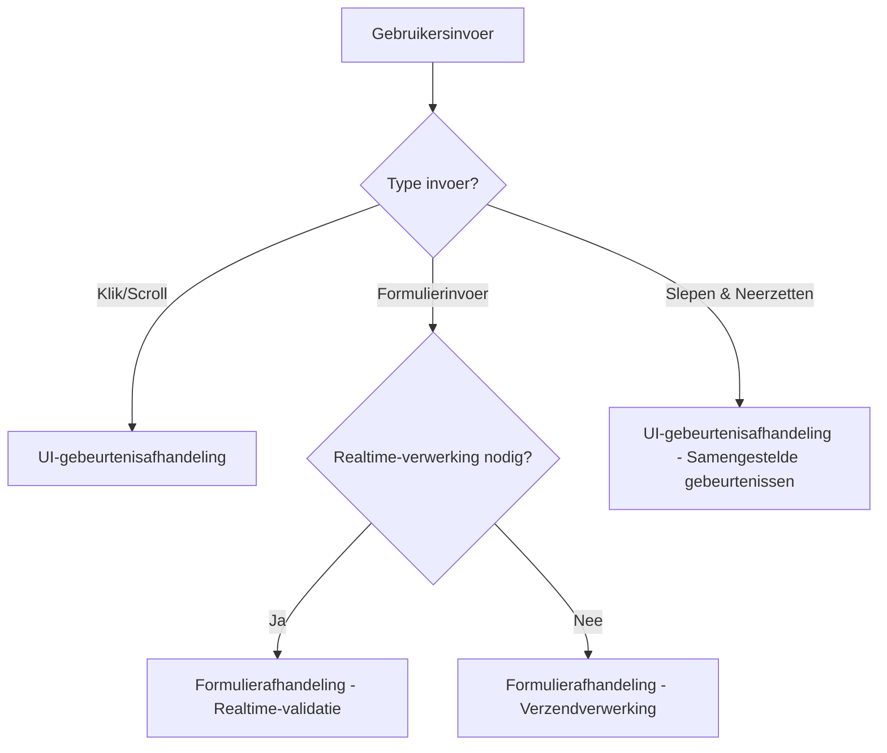
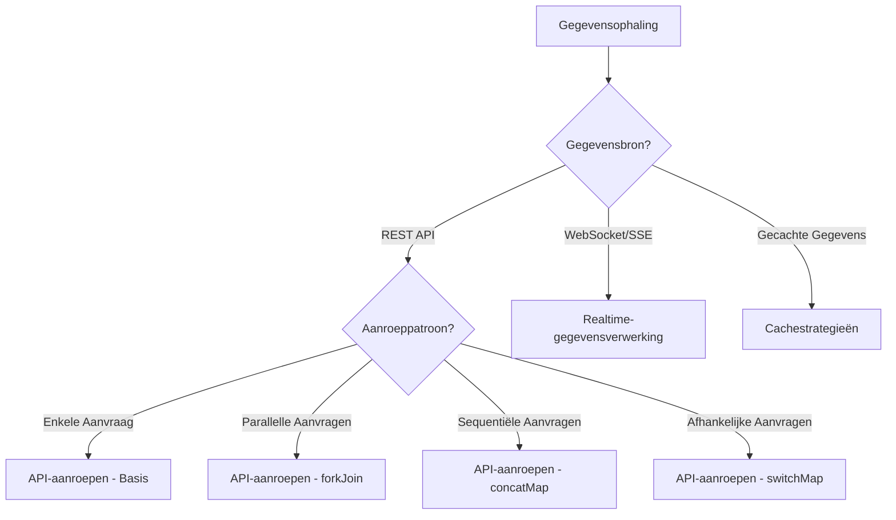
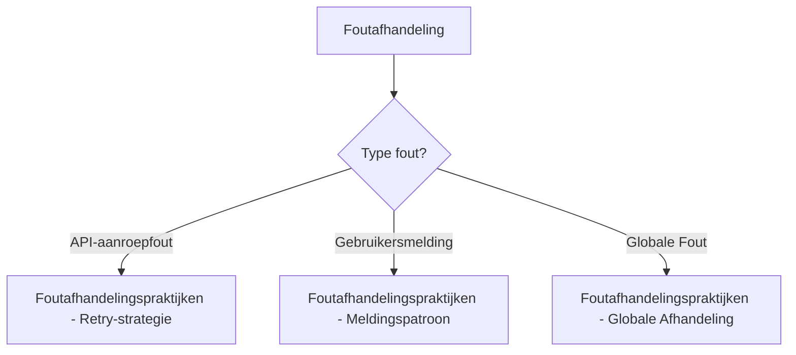

# Praktische Patronen

Zodra je de fundamenten van RxJS onder de knie hebt, is de volgende belangrijke stap "hoe je het gebruikt" in daadwerkelijke applicatieontwikkeling. Dit hoofdstuk introduceert concrete implementatiepatronen voor scenario's die vaak voorkomen in praktisch werk.

## Waarom Praktische Patronen Belangrijk Zijn

Zelfs als je individuele RxJS-operators begrijpt, vereist het combineren ervan om echte problemen op te lossen ervaring en kennis van patronen. Door praktische patronen te leren, kun je:

- **Ontwikkelsnelheid verhogen** - Vermijd het opnieuw uitvinden van het wiel en pas bewezen patronen toe
- **Kwaliteit verbeteren** - Beheers best practices voor foutafhandeling, geheugenlek-preventie, enz.
- **Onderhoudbaarheid verbeteren** - Consistente patronen verbeteren de leesbaarheid en onderhoudbaarheid van code
- **Probleemoplossing** - Identificeer de oorzaak van problemen en selecteer geschikte oplossingen

## Structuur van Dit Hoofdstuk

Praktische patronen worden uitgelegd in drie fasen volgens moeilijkheidsgraad en gebruiksfrequentie.

### Kernpatronen (Meest Frequent)

Dit zijn basispatronen die het meest frequent worden gebruikt in praktisch werk. Beheers deze eerst.

| Patroon | Inhoud | Belangrijkste Doel |
|---------|---------|-------------|
| [UI-gebeurtenisafhandeling](./ui-events.md) | UI-operaties zoals klikken, scrollen, slepen & neerzetten | Algemene frontend |
| [API-aanroepen](./api-calls.md) | HTTP-communicatie, parallelle/sequentiële verwerking, foutafhandeling | Web API-integratie |
| [Formulierafhandeling](./form-handling.md) | Realtime-validatie, automatisch opslaan, coördinatie van meerdere velden | Formulier-implementatie |

### Geavanceerde Patronen

Geavanceerde patronen voor complexere scenario's.

| Patroon | Inhoud | Belangrijkste Doel |
|---------|---------|-------------|
| [Geavanceerde Formulierpatronen](./advanced-form-patterns.md) | JSON Patch, grootschalig formulier automatisch opslaan, Ongedaan maken/Opnieuw doen, samenwerkend bewerken | Enterprise-formulieren |
| [Realtime-gegevensverwerking](./real-time-data.md) | WebSocket, SSE, Polling, verbindingsbeheer | Realtime-communicatie |
| [Cachestrategieën](./caching-strategies.md) | Gegevenscaching, TTL, invalidatie, offline-ondersteuning | Prestatie-optimalisatie |

### Gespecialiseerde Patronen

Gespecialiseerde patronen voor specifieke uitdagingen.

| Patroon | Inhoud | Belangrijkste Doel |
|---------|---------|-------------|
| [Foutafhandelingspraktijken](./error-handling-patterns.md) | API-aanroepfouten, retry-strategieën, globale foutafhandeling | Foutbeheer |
| [Voorwaardelijke Vertakking in subscribe](./subscribe-branching.md) | Vermijd vertakking in subscribe, vertakking binnen pipelines | Codekwaliteit |

> [!TIP] Hoe te Leren
> Voor beginners wordt aanbevolen om in volgorde te beginnen met **Kernpatronen**. Vooral "API-aanroepen" en "Formulierafhandeling" zijn essentiële patronen in praktisch werk.

## Patroonstructuur

Elke patroonpagina wordt uitgelegd met de volgende structuur:

1. **Probleembeschrijving** - De uitdaging die dit patroon oplost
2. **Basisimplementatie** - Het eenvoudigste implementatievoorbeeld
3. **Praktische Voorbeelden** - Concrete code die bruikbaar is in praktisch werk
4. **Voor/Na Vergelijking** - Codevergelijking voor en na verbetering
5. **Opmerkingen en Best Practices** - Veelgemaakte fouten en tegenmaatregelen
6. **TypeScript Type-definities** - Type-veilige implementatiemethoden
7. **Testcode** - Hoe het patroon te testen
8. **Prestatieoverwegingen** - Geheugenlekken en prestatie-optimalisatie

## Richtlijnen voor Patroonselectie

Richtlijnen voor het selecteren van geschikte patronen volgens de te implementeren functionaliteit.

### Bij het Afhandelen van Gebruikersinvoer



### Bij het Afhandelen van Gegevensophaling



### Bij het Verbeteren van Foutafhandeling



## Denken Bij Implementatie

Introductie van de basisdenkwijze bij het implementeren van RxJS-patronen.

### 1. Denk Declaratief

Druk "wat je wilt doen" declaratief uit en vermijd procedurele code.

```typescript
// ❌ Procedureel (imperatief)
let result = [];
source.subscribe(value => {
  if (value > 10) {
    const transformed = value * 2;
    result.push(transformed);
  }
});

// ✅ Declaratief
const result$ = source.pipe(
  filter(value => value > 10),
  map(value => value * 2)
);
```

### 2. Bouw Verwerking met Pipelines

Combineer kleine operators om complexe verwerking te bouwen.

```typescript
const searchResults$ = searchInput$.pipe(
  debounceTime(300),           // Wacht 300ms op invoer
  distinctUntilChanged(),      // Sluit duplicaten uit
  filter(query => query.length >= 2), // Zoek met 2+ tekens
  switchMap(query => searchAPI(query)), // API-aanroep
  catchError(err => of([]))    // Lege array bij fout
);
```

### 3. Voorkom Geheugenlekken

Goed abonnementsbeheer is essentieel.

```typescript
// ✅ Automatische vrijgave met takeUntil
private destroy$ = new Subject<void>();

ngOnInit() {
  this.data$.pipe(
    takeUntil(this.destroy$)
  ).subscribe(/*...*/);
}

ngOnDestroy() {
  this.destroy$.next();
  this.destroy$.complete();
}
```

### 4. Vergeet Foutafhandeling Niet

Implementeer foutafhandeling voor alle asynchrone verwerking.

```typescript
// ✅ Juiste foutafhandeling met catchError
apiCall$.pipe(
  retry(3),
  catchError(err => {
    console.error('API fout:', err);
    return of(defaultValue);
  })
).subscribe(/*...*/);
```

### 5. Benut Type-veiligheid

Maak maximaal gebruik van TypeScript's type-systeem.

```typescript
interface User {
  id: number;
  name: string;
  email: string;
}

// ✅ Duidelijke type-definities
const users$: Observable<User[]> = fetchUsers();
const activeUsers$: Observable<User[]> = users$.pipe(
  map(users => users.filter(u => u.isActive))
);
```

## Relatie met Bestaande Kennis

De patronen in dit hoofdstuk passen kennis die in vorige hoofdstukken is geleerd toe op de praktijk.

| Praktisch Patroon | Gerelateerd Hoofdstuk | Toegepaste Kennis |
|------------|-----------|------------|
| UI-gebeurtenisafhandeling | [Hoofdstuk 4: Operators](../operators/index.md) | debounceTime, throttleTime, distinctUntilChanged |
| API-aanroepen | [Hoofdstuk 6: Foutafhandeling](../error-handling/strategies.md) | catchError, retry, timeout |
| Formulierafhandeling | [Hoofdstuk 3: Creation Functions](../creation-functions/index.md) | combineLatest, withLatestFrom |
| Geavanceerde Formulierpatronen | [Hoofdstuk 4: Transformatie-operators](../operators/transformation/pairwise.md) | pairwise, scan, bufferTime, concatMap |
| Realtime-gegevens | [Hoofdstuk 5: Subject](../subjects/what-is-subject.md) | Subject, BehaviorSubject, shareReplay |
| Cachestrategieën | [Hoofdstuk 2: Cold/Hot](../observables/cold-and-hot-observables.md) | shareReplay, share |
| Foutafhandeling | [Hoofdstuk 6: Foutafhandeling](../error-handling/strategies.md) | catchError, retry, retryWhen |
| subscribe Vertakking | [Hoofdstuk 10: Anti-patronen](../anti-patterns/index.md) | Het vermijden van anti-patronen |

> [!NOTE] Wanneer te Herzien
> Het herzien van gerelateerde hoofdstukken voordat je elk patroon leert, verdiept het begrip.

## Veelgestelde Vragen

### V1: Welk patroon moet ik eerst leren?

**A:** Het wordt aanbevolen om te leren in volgorde van hoogste gebruiksfrequentie in praktisch werk.

1. **API-aanroepen** - Fundament van webontwikkeling
2. **Formulierafhandeling** - Gebruikersinvoerverwerking
3. **UI-gebeurtenisafhandeling** - Interactieve UI
4. **Foutafhandeling** - Robuuste applicaties
5. Andere patronen - Volgens projectbehoeften

### V2: Kan ik patronen ongewijzigd gebruiken?

**A:** Ja. De patronen in dit hoofdstuk zijn bedoeld voor gebruik in praktisch werk.
Echter,

- Pas aan volgens projectvereisten
- Overweeg prestaties en geheugengebruik
- Volg team-codeerstandaarden

### V3: Kan ik ze gebruiken met Angular/React/Vue?

**A:** Ja. De patronen in dit hoofdstuk zijn framework-onafhankelijk.
Echter,

- Voor framework-specifieke integratiemethoden, raadpleeg Hoofdstuk 15: Framework-integratie (in voorbereiding)
- Uitschrijving volgens de levenscyclus van elk framework is noodzakelijk

## Samenvatting

De Praktische Patronen-verzameling is een concrete gids voor het benutten van RxJS in daadwerkelijke projecten.

> [!IMPORTANT] Belangrijkste Punten
> - Leer in volgorde van **Kernpatronen**
> - Begrijp verbeteringen door **Voor/Na vergelijkingen**
> - Implementeer altijd **geheugenlek-preventie**
> - Vergeet **foutafhandeling** niet
> - Benut **type-veiligheid**

> [!TIP] Leertips
> - Voer code uit om begrip te verdiepen
> - Pas toe op je eigen projecten
> - Combineer patronen om complexe verwerking te bouwen
> - Leer ook testcode

Als volgende stap wordt aanbevolen om te beginnen met het meest gebruikte [API-aanroeppatroon](./api-calls.md).

## Referentiebronnen

- [RxJS Officiële Documentatie](https://rxjs.dev/) - Officiële API-referentie
- [Learn RxJS](https://www.learnrxjs.io/) - Praktische voorbeelden per operator
- [RxJS Marbles](https://rxmarbles.com/) - Visueel begrip van operatorgedrag
- [Hoofdstuk 11: RxJS-moeilijkheden Overwinnen](../overcoming-difficulties/index.md) - Veelvoorkomende moeilijkheden en hoe ze te overwinnen
- [Hoofdstuk 10: Anti-patroonverzameling](../anti-patterns/index.md) - Patronen om te vermijden
