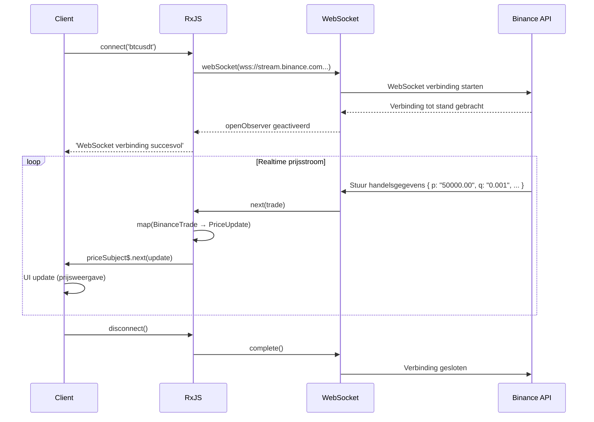

# Realtime gegevensverwerking patronen

Realtime gegevensverwerking is een belangrijke functie in moderne webapplicaties zoals chat, notificaties, koersupdates, IoT-sensormonitoring, etc. Met RxJS kunt u complexe realtime communicatie op een declaratieve en robuuste manier implementeren.

Dit artikel beschrijft specifieke patronen van realtime gegevensverwerking die in de praktijk nodig zijn, waaronder WebSockets, Server-Sent Events (SSE) en Polling.

## Wat u leert in dit artikel

- Implementeren en beheren van WebSocket-communicatie
- Gebruik van Server-Sent Events (SSE)
- Realtime updates via Polling
- Verbindingsbeheer en automatische herverbinding
- Samenvoegen en bijwerken van gegevens
- Bouwen van een realtime notificatiesysteem
- Foutafhandeling en verbindingsstatusbeheer

> [!TIP] Vereisten
> Dit artikel is gebaseerd op [Hoofdstuk 5: Subject](../subjects/what-is-subject.md) en [Hoofdstuk 4: Operators](../operators/index.md). Een begrip van `Subject`, `shareReplay`, `retry` en `retryWhen` is vooral belangrijk.

## WebSocket-communicatie

### Probleem: Ik wil bidirectionele realtime communicatie implementeren

Cryptocurrency-prijzen, koersupdates, chatapplicaties, etc. vereisen tweerichtings realtime communicatie tussen server en client. In dit voorbeeld gaan we cryptocurrency-prijzen in realtime monitoren met behulp van een openbare WebSocket API die daadwerkelijk werkt.

### Oplossing: gebruik RxJS webSocket

Gebruik de **Binance openbare WebSocket API** om bitcoin-transactiegegevens in realtime op te halen. Deze code is direct uitvoerbaar en de werkelijke prijsgegevens zullen stromen.

```typescript
import { EMPTY, Subject, retry, catchError, tap, map } from 'rxjs';
import { webSocket, WebSocketSubject } from 'rxjs/webSocket';

// Binance WebSocket API handelsgegevens type
// https://binance-docs.github.io/apidocs/spot/en/#trade-streams
interface BinanceTrade {
  e: string;      // Gebeurtenistype "trade"
  E: number;      // Gebeurtenistijd
  s: string;      // Symbool "BTCUSDT"
  t: number;      // Handels-ID
  p: string;      // Prijs
  q: string;      // Hoeveelheid
  T: number;      // Handelstijd
  m: boolean;     // Is de koper de market maker?
}

// Beknopt type voor weergave
interface PriceUpdate {
  symbol: string;
  price: number;
  quantity: number;
  time: Date;
  isBuyerMaker: boolean;
}

class CryptoPriceService {
  private socket$: WebSocketSubject<BinanceTrade> | null = null;
  private priceSubject$ = new Subject<PriceUpdate>();

  public prices$ = this.priceSubject$.asObservable();

  /**
   * Verbind met Binance openbare WebSocket API
   * @param symbol Cryptocurrency paar (bijv. "btcusdt", "ethusdt")
   */
  connect(symbol: string = 'btcusdt'): void {
    if (!this.socket$ || this.socket$.closed) {
      // Binance openbare WebSocket API (geen authenticatie vereist)
      const url = `wss://stream.binance.com:9443/ws/${symbol}@trade`;

      this.socket$ = webSocket<BinanceTrade>({
        url,
        openObserver: {
          next: () => {
            console.log(`WebSocket verbinding succesvol: ${symbol.toUpperCase()}`);
          }
        },
        closeObserver: {
          next: () => {
            console.log('WebSocket verbinding gesloten');
          }
        }
      });

      this.socket$.pipe(
        // Converteer Binance gegevens voor weergave
        map(trade => ({
          symbol: trade.s,
          price: parseFloat(trade.p),
          quantity: parseFloat(trade.q),
          time: new Date(trade.T),
          isBuyerMaker: trade.m
        })),
        tap(update => console.log('Prijs update:', update.price)),
        retry({
          count: 5,
          delay: 1000
        }),
        catchError(err => {
          console.error('WebSocket fout:', err);
          return EMPTY;
        })
      ).subscribe(priceUpdate => {
        this.priceSubject$.next(priceUpdate);
      });
    }
  }

  disconnect(): void {
    if (this.socket$) {
      this.socket$.complete();
      this.socket$ = null;
    }
  }
}

// Dynamisch UI-elementen maken
const priceContainer = document.createElement('div');
priceContainer.id = 'price-display';
priceContainer.style.padding = '20px';
priceContainer.style.margin = '10px';
priceContainer.style.border = '2px solid #f0b90b'; // Binance kleur
priceContainer.style.borderRadius = '8px';
priceContainer.style.backgroundColor = '#1e2329';
priceContainer.style.color = '#eaecef';
priceContainer.style.fontFamily = 'monospace';
document.body.appendChild(priceContainer);

const latestPriceDisplay = document.createElement('div');
latestPriceDisplay.style.fontSize = '32px';
latestPriceDisplay.style.fontWeight = 'bold';
latestPriceDisplay.style.marginBottom = '10px';
priceContainer.appendChild(latestPriceDisplay);

const tradesContainer = document.createElement('div');
tradesContainer.style.maxHeight = '400px';
tradesContainer.style.overflowY = 'auto';
tradesContainer.style.fontSize = '14px';
priceContainer.appendChild(tradesContainer);

// Gebruiksvoorbeeld
const priceService = new CryptoPriceService();
priceService.connect('btcusdt'); // Bitcoin/USDT handelsgegevens

// Ontvang prijsupdates
priceService.prices$.subscribe(update => {
  // Toon laatste prijs prominent
  latestPriceDisplay.textContent = `${update.symbol}: $${update.price.toLocaleString('nl-NL', { minimumFractionDigits: 2 })}`;
  latestPriceDisplay.style.color = update.isBuyerMaker ? '#f6465d' : '#0ecb81'; // Kleurcode per verkoop/koop

  // Toon handelsgeschiedenis
  displayTrade(update, tradesContainer);
});

function displayTrade(update: PriceUpdate, container: HTMLElement): void {
  const tradeElement = document.createElement('div');
  tradeElement.style.padding = '5px';
  tradeElement.style.margin = '3px 0';
  tradeElement.style.borderBottom = '1px solid #2b3139';
  tradeElement.style.color = update.isBuyerMaker ? '#f6465d' : '#0ecb81';

  const timeStr = update.time.toLocaleTimeString('nl-NL');
  const side = update.isBuyerMaker ? 'VERKOOP' : 'KOOP';
  tradeElement.textContent = `[${timeStr}] ${side} $${update.price.toFixed(2)} × ${update.quantity.toFixed(4)}`;

  container.insertBefore(tradeElement, container.firstChild);

  // Houd max 50 items
  while (container.children.length > 50) {
    container.removeChild(container.lastChild!);
  }
}

// Opschonen voorbeeld
// priceService.disconnect();
```

> [!TIP] Openbare WebSocket API die u daadwerkelijk kunt proberen
> Deze code **werkt direct door kopiëren en plakken**; Binance's openbare WebSocket API vereist geen authenticatie en biedt realtime cryptocurrency transactiegegevens.
>
> **U kunt ook andere cryptocurrency paren proberen**:
> - `priceService.connect('ethusdt')` - Ethereum/USDT
> - `priceService.connect('bnbusdt')` - BNB/USDT
> - `priceService.connect('adausdt')` - Cardano/USDT
>
> Details: [Binance WebSocket API Docs](https://binance-docs.github.io/apidocs/spot/en/#websocket-market-streams)

**WebSocket communicatiestroom:**



> [!IMPORTANT] WebSocket eigenschappen
> - **Bidirectioneel**: kan van zowel server als client worden verzonden (alleen ontvangen in dit voorbeeld)
> - **Realtime**: lagere latentie dan HTTP, prijsupdates in milliseconden
> - **Statusbeheer**: moet verbindingen en verbreking correct beheren
> - **Subject**: WebSocketSubject heeft zowel Subject als Observable eigenschappen
> - **Herverbinden**: Automatisch herverbinden bij netwerkverbreking is belangrijk (besproken in volgende sectie)

### Implementeren van automatisch herverbinden

WebSocket-verbindingen kunnen worden verbroken door netwerkstoring of serverherstart. Het implementeren van automatisch herverbinden verbetert de gebruikerservaring.

**Belang van herverbinden**:
- Frequente tijdelijke netwerkverbrekingen in mobiele omgevingen
- Automatisch herstel tijdens serveronderhoud
- Elimineert de noodzaak voor gebruikers om handmatig opnieuw te verbinden

Hieronder is een voorbeeldimplementatie van automatisch herverbinden met een exponentiële backoff-strategie.

```typescript
import { retryWhen, delay, tap, take } from 'rxjs';
import { webSocket, WebSocketSubject } from 'rxjs/webSocket';

class ReconnectingWebSocketService {
  private socket$: WebSocketSubject<any> | null = null;
  private reconnectAttempts = 0;
  private maxReconnectAttempts = 5;

  connect(url: string): WebSocketSubject<any> {
    if (!this.socket$ || this.socket$.closed) {
      this.socket$ = webSocket({
        url,
        openObserver: {
          next: () => {
            console.log('WebSocket verbinding succesvol');
            this.reconnectAttempts = 0; // Reset teller bij succesvolle verbinding
          }
        },
        closeObserver: {
          next: (event) => {
            console.log('WebSocket verbroken:', event);
            this.socket$ = null;
          }
        }
      });

      // Auto-herverbinden
      this.socket$.pipe(
        retryWhen(errors =>
          errors.pipe(
            tap(() => {
              this.reconnectAttempts++;
              console.log(`Herverbindingspoging ${this.reconnectAttempts}/${this.maxReconnectAttempts}`);
            }),
            delay(this.getReconnectDelay()),
            take(this.maxReconnectAttempts)
          )
        )
      ).subscribe({
        next: message => console.log('Ontvangen:', message),
        error: err => console.error('Maximaal aantal herverbindingspogingen bereikt:', err)
      });
    }

    return this.socket$;
  }

  private getReconnectDelay(): number {
    // Exponentiële backoff: 1s, 2s, 4s, 8s, 16s
    return Math.min(1000 * Math.pow(2, this.reconnectAttempts), 16000);
  }

  disconnect(): void {
    if (this.socket$) {
      this.socket$.complete();
      this.socket$ = null;
    }
  }
}
```

> [!TIP] Herverbindingsstrategie
> - **Exponentiële backoff**: Verhoog geleidelijk het herverbindingsinterval (1 seconde -> 2 seconden -> 4 seconden...)
> - **Maximaal aantal pogingen**: voorkom oneindige lussen
> - **Reset bij succesvolle verbinding**: reset de teller naar 0
> - **Gebruikersnotificatie**: Toon verbindingsstatus in UI

### Verbindingsstatusbeheer

**Expliciet verbindingsstatus beheren** om passende feedback aan de UI te geven. Gebruikers zijn altijd op de hoogte van hun huidige verbindingsstatus (verbonden, verbinden, herverbinden, fouten, etc.).

**Voordelen van verbindingsstatusbeheer**:
- Controle van laadweergave (spinner tonen tijdens verbinden)
- Weergave van foutmeldingen (bij verbindingsfout)
- Passende feedback aan de gebruiker ("herverbinden..." etc.)
- Eenvoudiger debuggen (statusovergangen kunnen worden gevolgd)

Het volgende voorbeeld gebruikt `BehaviorSubject` om verbindingsstatus reactief te beheren.

```typescript
import { BehaviorSubject, Observable } from 'rxjs';
import { webSocket, WebSocketSubject } from 'rxjs/webSocket';

enum ConnectionState {
  CONNECTING = 'verbinden',
  CONNECTED = 'verbonden',
  DISCONNECTED = 'verbroken',
  RECONNECTING = 'herverbinden',
  FAILED = 'mislukt'
}

class WebSocketManager {
  private socket$: WebSocketSubject<any> | null = null;
  private connectionState$ = new BehaviorSubject<ConnectionState>(
    ConnectionState.DISCONNECTED
  );

  getConnectionState(): Observable<ConnectionState> {
    return this.connectionState$.asObservable();
  }

  connect(url: string): void {
    this.connectionState$.next(ConnectionState.CONNECTING);

    this.socket$ = webSocket({
      url,
      openObserver: {
        next: () => {
          console.log('Verbinding succesvol');
          this.connectionState$.next(ConnectionState.CONNECTED);
        }
      },
      closeObserver: {
        next: () => {
          console.log('Verbinding gesloten');
          this.connectionState$.next(ConnectionState.DISCONNECTED);
        }
      }
    });

    this.socket$.subscribe({
      next: message => this.handleMessage(message),
      error: err => {
        console.error('Fout:', err);
        this.connectionState$.next(ConnectionState.FAILED);
      }
    });
  }

  private handleMessage(message: any): void {
    console.log('Bericht ontvangen:', message);
  }

  disconnect(): void {
    if (this.socket$) {
      this.socket$.complete();
      this.socket$ = null;
    }
  }
}

const statusElement = document.createElement('div');
statusElement.id = 'connection-status';
statusElement.style.padding = '10px 20px';
statusElement.style.margin = '10px';
statusElement.style.fontSize = '16px';
statusElement.style.fontWeight = 'bold';
statusElement.style.textAlign = 'center';
statusElement.style.borderRadius = '4px';
document.body.appendChild(statusElement);

// Gebruiksvoorbeeld
const wsManager = new WebSocketManager();

// Monitor verbindingsstatus
wsManager.getConnectionState().subscribe(state => {
  console.log('Verbindingsstatus:', state);
  updateConnectionStatusUI(state, statusElement);
});

wsManager.connect('ws://localhost:8080');

function updateConnectionStatusUI(state: ConnectionState, element: HTMLElement): void {
  element.textContent = state;

  // Stijl gebaseerd op verbindingsstatus
  switch (state) {
    case ConnectionState.CONNECTED:
      element.style.backgroundColor = '#d4edda';
      element.style.color = '#155724';
      element.style.border = '1px solid #c3e6cb';
      break;
    case ConnectionState.CONNECTING:
      element.style.backgroundColor = '#fff3cd';
      element.style.color = '#856404';
      element.style.border = '1px solid #ffeeba';
      break;
    case ConnectionState.DISCONNECTED:
      element.style.backgroundColor = '#f8d7da';
      element.style.color = '#721c24';
      element.style.border = '1px solid #f5c6cb';
      break;
    case ConnectionState.FAILED:
      element.style.backgroundColor = '#f8d7da';
      element.style.color = '#721c24';
      element.style.border = '2px solid #f44336';
      break;
  }
}
```

## Server-Sent Events (SSE)

### Probleem: Behoefte aan eenrichtings push-notificatie van server

We willen eenrichtingsnotificaties van de server naar de client implementeren (nieuwsupdates, koersupdates, dashboard-updates, etc.).

#### SSE-kenmerken

- **Eenrichtingscommunicatie**: Alleen server naar client (gebruik WebSocket als bidirectioneel nodig is)
- **HTTP/HTTPS gebaseerd**: werkt met bestaande infrastructuur, proxy/firewall ondersteuning
- **Auto-herverbinden**: Browser herverbindt automatisch bij verbreking
- **Gebeurtenisclassificatie**: meerdere gebeurtenistypes kunnen worden verzonden (`message`, `notification`, `update`, etc.)
- **Tekstgegevens**: Binair niet ondersteund (verzonden als JSON-string)

### Oplossing: Combineer EventSource en RxJS

> [!NOTE] Over de openbare SSE API
> Helaas zijn er weinig openbare SSE API's gratis beschikbaar. De volgende codevoorbeelden moeten worden begrepen als **implementatiepatronen**.
>
> **Hoe het daadwerkelijk te proberen**:
> 1. **Lokale server**: Zet een eenvoudige SSE-server op met Node.js of vergelijkbaar (zie hieronder)
> 2. **SSE-service**: Sommige cloudservices bieden SSE-functies
> 3. **Demo-site**: Bouw een front-end + mock server omgeving met StackBlitz, etc.

```typescript
import { Observable, Subject, retry, share } from 'rxjs';

interface ServerEvent {
  type: string;
  data: any;
  timestamp: Date;
}

class SSEService {
  createEventSource(url: string): Observable<ServerEvent> {
    return new Observable<ServerEvent>(observer => {
      const eventSource = new EventSource(url);

      eventSource.onmessage = (event) => {
        observer.next({
          type: 'message',
          data: JSON.parse(event.data),
          timestamp: new Date()
        });
      };

      eventSource.onerror = (error) => {
        console.error('SSE fout:', error);
        observer.error(error);
      };

      eventSource.onopen = () => {
        console.log('SSE verbinding succesvol');
      };

      // Opruimen
      return () => {
        console.log('SSE verbinding gesloten');
        eventSource.close();
      };
    }).pipe(
      retry({
        count: 3,
        delay: 1000
      }),
      share() // Deel verbinding tussen meerdere abonnees
    );
  }
}

const stockPriceContainer = document.createElement('div');
stockPriceContainer.id = 'stock-prices';
stockPriceContainer.style.padding = '15px';
stockPriceContainer.style.margin = '10px';
stockPriceContainer.style.border = '2px solid #ccc';
stockPriceContainer.style.borderRadius = '8px';
stockPriceContainer.style.backgroundColor = '#f9f9f9';
document.body.appendChild(stockPriceContainer);

const stockElementsMap = new Map<string, HTMLElement>();

// Maak initiële aandelenprijs elementen (voorbeeld aandelen)
const initialStocks = ['AAPL', 'GOOGL', 'MSFT', 'AMZN'];
initialStocks.forEach(symbol => {
  const stockRow = document.createElement('div');
  stockRow.id = `stock-${symbol}`;
  stockRow.style.padding = '10px';
  stockRow.style.margin = '5px 0';
  stockRow.style.display = 'flex';
  stockRow.style.justifyContent = 'space-between';
  stockRow.style.borderBottom = '1px solid #ddd';

  const symbolLabel = document.createElement('span');
  symbolLabel.textContent = symbol;
  symbolLabel.style.fontWeight = 'bold';
  symbolLabel.style.fontSize = '16px';

  const priceValue = document.createElement('span');
  priceValue.textContent = '€0';
  priceValue.style.fontSize = '16px';
  priceValue.style.color = '#2196F3';

  stockRow.appendChild(symbolLabel);
  stockRow.appendChild(priceValue);
  stockPriceContainer.appendChild(stockRow);

  stockElementsMap.set(symbol, priceValue);
});

// Gebruiksvoorbeeld
const sseService = new SSEService();
const stockPrices$ = sseService.createEventSource('/api/stock-prices');

stockPrices$.subscribe({
  next: event => {
    console.log('Aandelenupdate:', event.data);
    updateStockPriceUI(event.data, stockElementsMap);
  },
  error: err => console.error('Fout:', err)
});

function updateStockPriceUI(data: any, elementsMap: Map<string, HTMLElement>): void {
  const priceElement = elementsMap.get(data.symbol);
  if (priceElement) {
    priceElement.textContent = `€${data.price}`;
    // Voeg animatie toe voor prijsupdate
    priceElement.style.fontWeight = 'bold';
    priceElement.style.color = data.change > 0 ? '#4CAF50' : '#f44336';
  }
}
```

### Afhandelen van aangepaste gebeurtenissen

Naast de standaard `message` gebeurtenis, stelt SSE u in staat om **aangepaste gebeurtenistypes** te definiëren. Dit maakt verschillende verwerking mogelijk voor elk type gebeurtenis.

**Voordelen van aangepaste gebeurtenistypes**:
- Maakt verschillende verwerking mogelijk afhankelijk van het type gebeurtenis
- Definieer gebeurtenissen voor verschillende doeleinden, zoals `message`, `notification`, `error`, etc.
- Maakt het mogelijk voor abonnees om alleen de gebeurtenissen te monitoren die ze nodig hebben
- Verbeterde leesbaarheid en onderhoudbaarheid van code

Aan de serverzijde specificeert het `event:` veld de gebeurtenisnaam:
```
event: notification
data: {"title": "Nieuw bericht", "count": 3}
```

Het volgende voorbeeld biedt meerdere gebeurtenistypes als afzonderlijke Observable-streams.

```typescript
class AdvancedSSEService {
  createEventSource(url: string): {
    messages$: Observable<any>;
    notifications$: Observable<any>;
    errors$: Observable<any>;
  } {
    const messagesSubject = new Subject<any>();
    const notificationsSubject = new Subject<any>();
    const errorsSubject = new Subject<any>();

    const eventSource = new EventSource(url);

    // Reguliere berichten
    eventSource.addEventListener('message', (event) => {
      messagesSubject.next(JSON.parse(event.data));
    });

    // Aangepaste gebeurtenis: notificaties
    eventSource.addEventListener('notification', (event) => {
      notificationsSubject.next(JSON.parse(event.data));
    });

    // Aangepaste gebeurtenis: fouten
    eventSource.addEventListener('error-event', (event) => {
      errorsSubject.next(JSON.parse(event.data));
    });

    // Verbindingsfouten
    eventSource.onerror = (error) => {
      console.error('SSE verbindingsfout:', error);
      if (eventSource.readyState === EventSource.CLOSED) {
        console.log('SSE verbinding gesloten');
      }
    };

    return {
      messages$: messagesSubject.asObservable(),
      notifications$: notificationsSubject.asObservable(),
      errors$: errorsSubject.asObservable()
    };
  }
}

// Gebruiksvoorbeeld
const advancedSSE = new AdvancedSSEService();
const streams = advancedSSE.createEventSource('/api/events');

streams.messages$.subscribe(msg => {
  console.log('Bericht:', msg);
});

streams.notifications$.subscribe(notification => {
  console.log('Notificatie:', notification);
  showNotification(notification);
});

streams.errors$.subscribe(error => {
  console.error('Serverfout:', error);
  showErrorMessage(error);
});

function showNotification(notification: any): void {
  // Toon notificatie
  console.log('Toon notificatie:', notification.message);
}

function showErrorMessage(error: any): void {
  // Toon foutmelding
  console.error('Toon fout:', error.message);
}
```

> [!NOTE] WebSocket vs SSE
> | Kenmerk | WebSocket | Server-Sent Events |
> |---------|-----------|-------------------|
> | **Richting** | Bidirectioneel | Eenrichting (Server → Client) |
> | **Protocol** | Eigenaar protocol | HTTP |
> | **Browserondersteuning** | Breed | Breed (behalve IE) |
> | **Auto-herverbinden** | Geen (implementatie vereist) | Ja (browser handelt automatisch af) |
> | **Gebruikssituaties** | Chat, games | Notificaties, dashboard-updates |
> | **Implementatiemoeilijkheid** | Enigszins hoog | Laag (HTTP-gebaseerd) |
> | **Gegevensformaat** | Tekst/binair | Alleen tekst |

### SSE eenvoudige servervoorbeeld (Node.js)

Dit is een voorbeeld van het implementeren van een eenvoudige SSE-server voor leerdoeleinden.

**server.js** (met Express):
```javascript
const express = require('express');
const app = express();

// CORS ondersteuning
app.use((req, res, next) => {
  res.header('Access-Control-Allow-Origin', '*');
  res.header('Access-Control-Allow-Headers', 'Origin, X-Requested-With, Content-Type, Accept');
  next();
});

// SSE eindpunt
app.get('/api/events', (req, res) => {
  // Stel SSE headers in
  res.writeHead(200, {
    'Content-Type': 'text/event-stream',
    'Cache-Control': 'no-cache',
    'Connection': 'keep-alive'
  });

  // Stuur elke seconde een bericht
  const intervalId = setInterval(() => {
    const data = {
      timestamp: new Date().toISOString(),
      value: Math.random() * 100
    };

    res.write(`data: ${JSON.stringify(data)}\n\n`);
  }, 1000);

  // Opruimen bij client verbreking
  req.on('close', () => {
    clearInterval(intervalId);
    res.end();
  });
});

app.listen(3000, () => {
  console.log('SSE server gestart: http://localhost:3000');
});
```

**Hoe te starten**:
```bash
npm install express
node server.js
```

Nu kunt u SSE ontvangen van `http://localhost:3000/api/events`.

## Polling patroon

### Probleem: Ik wil in realtime updaten in een omgeving waar WebSocket/SSE niet beschikbaar is

Ik wil periodiek API aanroepen om gegevens bij te werken in een oude browser of firewall-omgeving, of op een server die WebSocket/SSE niet ondersteunt.

### Oplossing: Combineer interval en switchMap

**JSONPlaceholder API** om periodiek geposte gegevens te pollen. Deze code is direct uitvoerbaar, en u kunt daadwerkelijke gegevensopvraging ervaren.

```typescript
import { interval, from, of, switchMap, retry, catchError, startWith, tap } from 'rxjs';

// JSONPlaceholder API post type
// https://jsonplaceholder.typicode.com/posts
interface Post {
  userId: number;
  id: number;
  title: string;
  body: string;
}

interface PollingResponse {
  posts: Post[];
  count: number;
  timestamp: Date;
  updatedAt: string;
}

/**
 * Basis Polling implementatie
 * @param fetchFn Gegevens ophaalfunctie
 * @param intervalMs Polling interval (milliseconden)
 */
function createPolling<T>(
  fetchFn: () => Promise<T>,
  intervalMs: number = 5000
) {
  return interval(intervalMs).pipe(
    startWith(0), // Voer eerste verzoek onmiddellijk uit
    switchMap(() =>
      from(fetchFn()).pipe(
        retry(3), // Probeer 3 keer opnieuw bij fout
        catchError(err => {
          console.error('Polling fout:', err);
          throw err; // Gooi fout opnieuw
        })
      )
    ),
    tap(() => console.log('Gegevens opgehaald'))
  );
}

// Dynamisch UI-elementen maken
const pollingContainer = document.createElement('div');
pollingContainer.id = 'polling-container';
pollingContainer.style.padding = '15px';
pollingContainer.style.margin = '10px';
pollingContainer.style.border = '2px solid #4CAF50';
pollingContainer.style.borderRadius = '8px';
pollingContainer.style.backgroundColor = '#f9f9f9';
document.body.appendChild(pollingContainer);

const statusDisplay = document.createElement('div');
statusDisplay.style.padding = '10px';
statusDisplay.style.marginBottom = '10px';
statusDisplay.style.fontWeight = 'bold';
statusDisplay.style.color = '#4CAF50';
pollingContainer.appendChild(statusDisplay);

const postsDisplay = document.createElement('div');
postsDisplay.style.maxHeight = '400px';
postsDisplay.style.overflowY = 'auto';
pollingContainer.appendChild(postsDisplay);

// Gebruiksvoorbeeld: Poll JSONPlaceholder API
const polling$ = createPolling<Post[]>(
  () => fetch('https://jsonplaceholder.typicode.com/posts')
    .then(response => {
      if (!response.ok) {
        throw new Error(`HTTP fout! status: ${response.status}`);
      }
      return response.json();
    }),
  10000 // Poll elke 10 seconden
);

polling$.subscribe({
  next: (posts) => {
    const now = new Date();
    statusDisplay.textContent = `Laatst bijgewerkt: ${now.toLocaleTimeString('nl-NL')} | Berichten: ${posts.length}`;

    // Toon alleen laatste 10
    updatePostsUI(posts.slice(0, 10), postsDisplay);
  },
  error: (err) => {
    statusDisplay.textContent = `Fout: ${err.message}`;
    statusDisplay.style.color = '#f44336';
  }
});

function updatePostsUI(posts: Post[], container: HTMLElement): void {
  container.innerHTML = posts
    .map(post => `
      <div style="padding: 10px; margin: 5px 0; border-bottom: 1px solid #ddd; background: white; border-radius: 4px;">
        <div style="font-weight: bold; color: #333;">${post.title}</div>
        <div style="font-size: 12px; color: #666; margin-top: 4px;">Post ID: ${post.id} | Gebruiker ID: ${post.userId}</div>
      </div>
    `)
    .join('');

  if (posts.length === 0) {
    container.innerHTML = '<div style="padding: 20px; text-align: center; color: #999;">Geen gegevens</div>';
  }
}
```

> [!TIP] Praktisch nut van Polling
> Polling werkt betrouwbaar zelfs in omgevingen waar WebSockets en SSE niet beschikbaar zijn.
>
> **Richtlijn voor polling interval**:
> - **Realtime is belangrijk**: 1-3 seconden (dashboards, monitoringschermen)
> - **Algemene gegevensupdates**: 5-10 seconden (nieuwsfeeds, notificaties)
> - **Achtergrondupdates**: 30-60 seconden (e-mail ontvangstcontroles)
>
> **Let op**: Vermijd onnodig korte intervallen, rekening houdend met serverbelasting

### Adaptieve Polling (Slimme Polling)

**Als gegevenswijzigingen klein zijn, kan het geleidelijk verhogen van het polling-interval de serverbelasting verminderen.**

Gebruik een backoff-strategie om "slimme polling" te implementeren die geleidelijk het polling-interval verhoogt als gegevens niet veranderen en het interval reset als er een wijziging is.

```typescript
import { timer, defer, switchMap, expand, EMPTY, from } from 'rxjs';

/**
 * Adaptieve Polling configuratie
 */
interface PollingConfig {
  initialDelay: number;      // Initieel polling interval (milliseconden)
  maxDelay: number;          // Maximaal polling interval (milliseconden)
  backoffMultiplier: number; // Backoff vermenigvuldiger (interval verhogingssnelheid)
}

/**
 * Adaptieve Polling Service
 * Verhoogt geleidelijk polling interval wanneer gegevenswijzigingen klein zijn
 */
class AdaptivePollingService {
  private config: PollingConfig = {
    initialDelay: 1000,    // Start vanaf 1 seconde
    maxDelay: 60000,       // Verleng tot max 60 seconden
    backoffMultiplier: 1.5 // Vertraag met 1,5x
  };

  /**
   * Start adaptieve polling
   * @param fetchFn Gegevens ophaalfunctie
   * @param shouldContinue Voortzettingsvoorwaarde (stopt polling als false)
   */
  startPolling<T>(
    fetchFn: () => Promise<T>,
    shouldContinue: (data: T) => boolean
  ) {
    let currentDelay = this.config.initialDelay;

    return defer(() => from(fetchFn())).pipe(
      expand((data) => {
        // Controleer voortzettingsvoorwaarde
        if (!shouldContinue(data)) {
          console.log('Polling voltooiingsvoorwaarde bereikt');
          return EMPTY; // Stop polling
        }

        // Bereken volgend polling interval (exponentiële backoff)
        currentDelay = Math.min(
          currentDelay * this.config.backoffMultiplier,
          this.config.maxDelay
        );

        console.log(`Volgende poll: ${(currentDelay / 1000).toFixed(1)} seconden later`);

        // Voer volgend verzoek uit na gespecificeerde vertraging
        return timer(currentDelay).pipe(
          switchMap(() => from(fetchFn()))
        );
      })
    );
  }
}

// Gebruiksvoorbeeld: Poll wachtend op taakvoltooiing
interface JobStatus {
  id: string;
  status: 'pending' | 'processing' | 'completed' | 'failed';
  progress: number;
}

const pollingService = new AdaptivePollingService();

// Poll taakstatus (ga door tot voltooid of mislukt)
pollingService.startPolling<JobStatus>(
  () => fetch('/api/job/123').then(r => r.json()),
  (job) => job.status !== 'completed' && job.status !== 'failed'
).subscribe({
  next: job => {
    console.log(`Taakstatus: ${job.status} (${job.progress}%)`);
    // Update UI (voortgangsbalk, etc.)
  },
  complete: () => {
    console.log('Taak voltooid! Polling beëindigd');
  },
  error: err => {
    console.error('Polling fout:', err);
  }
});
```

**Adaptieve Polling gedragsbeeld:**

Met een exponentiële backoff-strategie verandert het polling-interval als volgt:

| Poging | Interval (seconden) | Verstreken tijd | Beschrijving |
|---------|-------------------|--------------|-------------|
| 1e | Onmiddellijk | 0s | Eerste uitvoering is onmiddellijk |
| 2e | 1,0s | 1s | initialDelay |
| 3e | 1,5s | 2,5s | 1,0 × 1,5 |
| 4e | 2,25s | 4,75s | 1,5 × 1,5 |
| 5e | 3,375s | 8,125s | 2,25 × 1,5 |
| ... | ... | ... | Interval neemt geleidelijk toe |
| Max | 60s | - | Bereikt maxDelay |

**Voordelen**:
- Serverbelasting **neemt exponentieel af** wanneer gegevens niet veranderen
- Ideaal voor wachten op gebeurtenissen zoals taakvoltooiing
- Stopt automatisch polling wanneer aan voltooiingsvoorwaarden is voldaan

> [!TIP] Polling best practices
> **Verschillen tussen basis polling en adaptieve polling**:
> - **Basis polling**: wanneer gegevens op regelmatige intervallen moeten worden opgehaald (dashboards, nieuwsfeeds)
> - **Adaptieve polling**: Wachten op een gebeurtenis om te voltooien (taakvoltooiing, uploadproces)
>
> **Algemene opmerkingen**:
> - **Begrenzing**: Stel maximaal polling-interval in om gebruikerservaring te behouden
> - **Foutafhandeling**: Implementeer een retry-strategie bij netwerkfouten
> - **Uitschrijven**: Geef resources vrij door uit te schrijven wanneer niet langer nodig
> - **Serverbelasting**: poll zo vaak als nodig

## Gegevens samenvoegen en bijwerken

### Probleem: Ik wil gegevens van meerdere realtime bronnen samenvoegen

In een echte applicatie kunt u informatie ontvangen van **meerdere gegevensbronnen** zoals WebSockets, SSE, Polling, etc. U wilt ze mogelijk integreren en op een enkel dashboard weergeven.

**Voorbeelden van meervoudige bronintegratie**:
- Dashboard: Realtime prijs via WebSocket + voorraadtelling via Polling
- Monitoringsysteem: Waarschuwingen door SSE + Systeemstatus door Polling
- Chat-app: berichten via WebSocket + gebruikersstatus via Polling

### Oplossing: Gebruik merge en scan

Gebruik `merge` om meerdere streams in één te combineren, en `scan` om status te accumuleren en de gegevensset up-to-date te houden.

**Bewerkingsstroom**:
1. Combineer meerdere gegevensbronnen met `merge`
2. Beheer geaccumuleerde status met `scan` (overschrijf dezelfde ID's, voeg nieuwe toe)
3. Sorteer op tijdstempel
4. Weergeven in UI

```typescript
import { merge, Subject, scan, map } from 'rxjs';

interface DataItem {
  id: string;
  value: number;
  source: 'websocket' | 'sse' | 'polling';
  timestamp: Date;
}

class DataAggregator {
  private websocketData$ = new Subject<DataItem>();
  private sseData$ = new Subject<DataItem>();
  private pollingData$ = new Subject<DataItem>();

  // Integreer gegevens van alle bronnen
  aggregatedData$ = merge(
    this.websocketData$,
    this.sseData$,
    this.pollingData$
  ).pipe(
    scan((acc, item) => {
      // Update bestaande gegevens of voeg nieuwe toe
      const index = acc.findIndex(i => i.id === item.id);
      if (index >= 0) {
        acc[index] = item;
      } else {
        acc.push(item);
      }
      return [...acc]; // Retourneer nieuwe array (Onveranderlijk)
    }, [] as DataItem[]),
    map(items => items.sort((a, b) => b.timestamp.getTime() - a.timestamp.getTime()))
  );

  addWebSocketData(data: DataItem): void {
    this.websocketData$.next(data);
  }

  addSSEData(data: DataItem): void {
    this.sseData$.next(data);
  }

  addPollingData(data: DataItem): void {
    this.pollingData$.next(data);
  }
}

// Zelfstandig: maakt dashboard element dynamisch
const dashboard = document.createElement('div');
dashboard.id = 'dashboard';
dashboard.style.padding = '15px';
dashboard.style.margin = '10px';
dashboard.style.border = '2px solid #ccc';
dashboard.style.borderRadius = '8px';
dashboard.style.backgroundColor = '#f9f9f9';
document.body.appendChild(dashboard);

// Gebruiksvoorbeeld
const aggregator = new DataAggregator();

aggregator.aggregatedData$.subscribe(items => {
  console.log('Geaggregeerde gegevens:', items);
  updateDashboard(items, dashboard);
});

// Ontvang gegevens van WebSocket
aggregator.addWebSocketData({
  id: '1',
  value: 100,
  source: 'websocket',
  timestamp: new Date()
});

// Ontvang gegevens van SSE
aggregator.addSSEData({
  id: '2',
  value: 200,
  source: 'sse',
  timestamp: new Date()
});

function updateDashboard(items: DataItem[], container: HTMLElement): void {
  container.innerHTML = items
    .map(item => {
      const sourceColors: Record<string, string> = {
        websocket: '#4CAF50',
        sse: '#2196F3',
        polling: '#FF9800'
      };
      return `
        <div style="display: flex; justify-content: space-between; padding: 10px; margin: 5px 0; border-bottom: 1px solid #ddd;">
          <span style="font-weight: bold;">${item.id}</span>
          <span>${item.value}</span>
          <span style="color: ${sourceColors[item.source]}; font-weight: bold;">${item.source}</span>
        </div>
      `;
    })
    .join('');

  if (items.length === 0) {
    container.innerHTML = '<div style="padding: 20px; text-align: center; color: #999;">Geen gegevens</div>';
  }
}
```

### Deduplicatie

```typescript
import { merge, Subject, scan, distinctUntilChanged, map } from 'rxjs';

interface Message {
  id: string;
  content: string;
  timestamp: number;
}

class DeduplicatedMessageStream {
  private sources = {
    primary$: new Subject<Message>(),
    fallback$: new Subject<Message>()
  };

  messages$ = merge(
    this.sources.primary$,
    this.sources.fallback$
  ).pipe(
    // Dedupliceer op bericht-ID
    scan((seenIds, message) => {
      if (seenIds.has(message.id)) {
        return seenIds; // Al ontvangen
      }
      seenIds.add(message.id);
      return seenIds;
    }, new Set<string>()),
    // Meld alleen nieuwe ID's
    distinctUntilChanged((prev, curr) => prev.size === curr.size),
    map(seenIds => Array.from(seenIds))
  );

  addPrimaryMessage(message: Message): void {
    this.sources.primary$.next(message);
  }

  addFallbackMessage(message: Message): void {
    this.sources.fallback$.next(message);
  }
}
```

## Realtime notificatiesysteem

### Complete notificatiesysteem implementatie

Realtime notificaties zijn een essentiële functie voor het tijdig communiceren van belangrijke informatie naar gebruikers. Ze worden gebruikt voor nieuwe berichten, systeemwaarschuwingen, voorraadnotificaties en veel andere situaties.

**Vereisten notificatiesysteem**:
- Notificatieweergave op prioriteit (urgent, hoog, gemiddeld, laag)
- Gelezen/ongelezen statusbeheer
- Notificaties toevoegen, markeren als gelezen en alle notificaties in één keer wissen
- Integratie met browser notificatie API (optioneel)
- Persistentie van notificaties (bijv. lokale opslag)

**Implementatiepunten**:
- Beheer notificatielijs status met `scan`
- Redux-achtige statusupdate met actiepatronen
- Kleurgecodeerde weergave gebaseerd op prioriteit

Het volgende is een voorbeeld van een complete notificatiesysteem implementatie voor praktisch gebruik.

```typescript
import { Subject, merge, scan, map } from 'rxjs';

enum NotificationPriority {
  LOW = 'laag',
  MEDIUM = 'gemiddeld',
  HIGH = 'hoog',
  URGENT = 'urgent'
}

interface Notification {
  id: string;
  title: string;
  message: string;
  priority: NotificationPriority;
  timestamp: Date;
  read: boolean;
}

class NotificationSystem {
  private notificationSubject$ = new Subject<Notification>();
  private readNotification$ = new Subject<string>(); // notificatie-ID
  private clearAll$ = new Subject<void>();

  // Notificatie statusbeheer
  notifications$ = merge(
    this.notificationSubject$.pipe(
      map(notification => ({ type: 'add' as const, notification }))
    ),
    this.readNotification$.pipe(
      map(id => ({ type: 'read' as const, id }))
    ),
    this.clearAll$.pipe(
      map(() => ({ type: 'clear' as const }))
    )
  ).pipe(
    scan((notifications, action) => {
      switch (action.type) {
        case 'add':
          return [action.notification, ...notifications];
        case 'read':
          return notifications.map(n =>
            n.id === action.id ? { ...n, read: true } : n
          );
        case 'clear':
          return [];
        default:
          return notifications;
      }
    }, [] as Notification[])
  );

  // Ongelezen telling
  unreadCount$ = this.notifications$.pipe(
    map(notifications => notifications.filter(n => !n.read).length)
  );

  // Filter op prioriteit
  urgentNotifications$ = this.notifications$.pipe(
    map(notifications =>
      notifications.filter(n => n.priority === NotificationPriority.URGENT && !n.read)
    )
  );

  addNotification(notification: Omit<Notification, 'id' | 'timestamp' | 'read'>): void {
    const fullNotification: Notification = {
      ...notification,
      id: `notif-${Date.now()}-${Math.random()}`,
      timestamp: new Date(),
      read: false
    };

    this.notificationSubject$.next(fullNotification);

    // Toon waarschuwing voor urgente notificaties
    if (notification.priority === NotificationPriority.URGENT) {
      this.showAlert(fullNotification);
    }
  }

  markAsRead(notificationId: string): void {
    this.readNotification$.next(notificationId);
  }

  clearAllNotifications(): void {
    this.clearAll$.next();
  }

  private showAlert(notification: Notification): void {
    // Toon browsernotificatie
    if ('Notification' in window && Notification.permission === 'granted') {
      new Notification(notification.title, {
        body: notification.message,
        icon: '/notification-icon.png'
      });
    }
  }
}

const notificationContainer = document.createElement('div');
notificationContainer.id = 'notifications';
notificationContainer.style.padding = '15px';
notificationContainer.style.margin = '10px';
notificationContainer.style.border = '2px solid #ccc';
notificationContainer.style.borderRadius = '8px';
notificationContainer.style.minHeight = '200px';
notificationContainer.style.maxHeight = '400px';
notificationContainer.style.overflowY = 'auto';
notificationContainer.style.backgroundColor = '#f9f9f9';
document.body.appendChild(notificationContainer);

const badgeContainer = document.createElement('div');
badgeContainer.style.position = 'fixed';
badgeContainer.style.top = '20px';
badgeContainer.style.right = '20px';
document.body.appendChild(badgeContainer);

const notificationBadge = document.createElement('span');
notificationBadge.id = 'notification-badge';
notificationBadge.style.display = 'none';
notificationBadge.style.padding = '5px 10px';
notificationBadge.style.backgroundColor = '#f44336';
notificationBadge.style.color = '#fff';
notificationBadge.style.borderRadius = '50%';
notificationBadge.style.fontSize = '14px';
notificationBadge.style.fontWeight = 'bold';
badgeContainer.appendChild(notificationBadge);

const urgentAlertContainer = document.createElement('div');
urgentAlertContainer.id = 'urgent-alert';
urgentAlertContainer.style.display = 'none';
urgentAlertContainer.style.position = 'fixed';
urgentAlertContainer.style.top = '60px';
urgentAlertContainer.style.right = '20px';
urgentAlertContainer.style.padding = '15px';
urgentAlertContainer.style.backgroundColor = '#f44336';
urgentAlertContainer.style.color = '#fff';
urgentAlertContainer.style.borderRadius = '8px';
urgentAlertContainer.style.maxWidth = '300px';
urgentAlertContainer.style.boxShadow = '0 4px 6px rgba(0,0,0,0.3)';
urgentAlertContainer.style.zIndex = '1000';
document.body.appendChild(urgentAlertContainer);

// Gebruiksvoorbeeld
const notificationSystem = new NotificationSystem();

// Monitor notificaties
notificationSystem.notifications$.subscribe(notifications => {
  console.log('Alle notificaties:', notifications);
  updateNotificationUI(notifications, notificationContainer);
});

// Monitor ongelezen telling
notificationSystem.unreadCount$.subscribe(count => {
  console.log('Ongelezen telling:', count);
  updateBadge(count, notificationBadge);
});

// Monitor urgente notificaties
notificationSystem.urgentNotifications$.subscribe(urgent => {
  if (urgent.length > 0) {
    console.log('Urgente notificaties:', urgent);
    showUrgentAlert(urgent, urgentAlertContainer);
  } else {
    urgentAlertContainer.style.display = 'none';
  }
});

// Voeg notificatie toe
notificationSystem.addNotification({
  title: 'Nieuw bericht',
  message: 'U heeft een bericht van Yamada',
  priority: NotificationPriority.MEDIUM
});

// Urgente notificatie
notificationSystem.addNotification({
  title: 'Beveiligingswaarschuwing',
  message: 'Verdachte aanmeldingspoging gedetecteerd',
  priority: NotificationPriority.URGENT
});

function updateNotificationUI(notifications: Notification[], container: HTMLElement): void {
  const priorityColors: Record<NotificationPriority, string> = {
    [NotificationPriority.LOW]: '#9E9E9E',
    [NotificationPriority.MEDIUM]: '#2196F3',
    [NotificationPriority.HIGH]: '#FF9800',
    [NotificationPriority.URGENT]: '#f44336'
  };

  container.innerHTML = notifications
    .map(n => {
      const bgColor = n.read ? '#f5f5f5' : '#fff';
      const borderColor = priorityColors[n.priority];
      return `
        <div style="padding: 10px; margin: 5px 0; background-color: ${bgColor}; border-left: 4px solid ${borderColor}; border-radius: 4px;">
          <h4 style="margin: 0 0 5px 0; font-size: 16px;">${n.title}</h4>
          <p style="margin: 0 0 5px 0; font-size: 14px;">${n.message}</p>
          <small style="color: #666;">${n.timestamp.toLocaleTimeString()}</small>
        </div>
      `;
    })
    .join('');

  if (notifications.length === 0) {
    container.innerHTML = '<div style="padding: 20px; text-align: center; color: #999;">Geen notificaties</div>';
  }
}

function updateBadge(count: number, badge: HTMLElement): void {
  badge.textContent = count > 0 ? count.toString() : '';
  badge.style.display = count > 0 ? 'inline-block' : 'none';
}

function showUrgentAlert(notifications: Notification[], container: HTMLElement): void {
  container.style.display = 'block';
  container.innerHTML = notifications
    .map(n => `<div style="padding: 8px; border-bottom: 1px solid rgba(255,255,255,0.3);"><strong>${n.title}</strong>: ${n.message}</div>`)
    .join('');
}
```

## Verbindingsgezondheidscontrole

### Heartbeat implementatie

Bij het onderhouden van WebSocket-verbindingen voor lange perioden, is het nodig om periodiek te controleren **of de verbinding daadwerkelijk actief is**. Dit maakt vroege detectie van netwerkapp-timeouts en server-side verbrekingen mogelijk.

**Doel van Heartbeat (Heartbeat / Ping-Pong)**:
- Verifieer dat de verbinding daadwerkelijk actief is
- Voorkom netwerkapp-timeouts (Keep-Alive)
- Vroege detectie van verbindingsverlies aan serverzijde
- Trigger automatische herverbinding

**Mechanisme**:
1. Client stuurt periodiek `ping` (bijv. elke 30 seconden)
2. Server stuurt `pong` terug
3. Als geen `pong` binnen een bepaalde periode wordt geretourneerd, wordt de verbinding als abnormaal beschouwd
4. Voer herverbindingsproces uit

Het volgende is een voorbeeld van verbindingsmonitoring die heartbeat implementeert.

```typescript
import { interval, switchMap, timeout, catchError, retry } from 'rxjs';
import { webSocket } from 'rxjs/webSocket';

interface HeartbeatMessage {
  type: 'ping' | 'pong';
  timestamp: number;
}

class HealthCheckWebSocket {
  private socket$ = webSocket<any>('ws://localhost:8080');
  private heartbeatInterval = 30000; // 30 seconden
  private timeoutMs = 5000; // 5 seconden

  connect(): void {
    // Stuur periodiek ping
    const heartbeat$ = interval(this.heartbeatInterval).pipe(
      switchMap(() => {
        console.log('Ping versturen');
        this.socket$.next({ type: 'ping', timestamp: Date.now() });

        // Wacht op pong (met timeout)
        return this.socket$.pipe(
          timeout(this.timeoutMs),
          catchError(err => {
            console.error('Pong timeout - verbinding abnormaal', err);
            throw err;
          })
        );
      }),
      retry({
        count: 3,
        delay: 1000
      })
    );

    heartbeat$.subscribe({
      next: message => {
        if (message.type === 'pong') {
          console.log('Pong ontvangen - verbinding normaal');
        }
      },
      error: err => {
        console.error('Heartbeat fout:', err);
        // Herverbindingsproces
        this.reconnect();
      }
    });
  }

  private reconnect(): void {
    console.log('Poging tot herverbinden...');
    // Herverbindingslogica
  }
}
```

## Testcode

Realtime gegevensverwerking is een moeilijk deel om te testen, maar RxJS's `TestScheduler` kan worden gebruikt om tijdafhankelijke verwerking betrouwbaar te testen.

**Testuitdagingen**:
- Moeilijk om WebSocket-verbindingen te reproduceren
- Timingafhankelijke verwerking (herverbindingen, heartbeats, etc.)
- Verificatie van asynchrone verwerking

**TestScheduler voordelen**:
- Draait in virtuele tijd (testen zonder daadwerkelijk te wachten)
- Intuïtieve testbeschrijving met marble diagrams
- Betrouwbare verificatie van herverbindingen, retries, etc.

Het volgende is een voorbeeld van een WebSocket herverbindings- en pollingtest.

```typescript
import { retry } from 'rxjs';
import { TestScheduler } from 'rxjs/testing';
import { webSocket } from 'rxjs/webSocket';

describe('Realtime gegevensverwerking', () => {
  let testScheduler: TestScheduler;

  beforeEach(() => {
    testScheduler = new TestScheduler((actual, expected) => {
      expect(actual).toEqual(expected);
    });
  });

  it('moet WebSocket herverbinding afhandelen', () => {
    testScheduler.run(({ cold, expectObservable }) => {
      // WebSocket mock (eerst fout, dan succes)
      const source$ = cold('--#--a-b-|', {
        a: { type: 'message', data: 'test1' },
        b: { type: 'message', data: 'test2' }
      });

      const result$ = source$.pipe(retry(1));

      expectObservable(result$).toBe('--#--a-b-|', {
        a: { type: 'message', data: 'test1' },
        b: { type: 'message', data: 'test2' }
      });
    });
  });
});
```

## Samenvatting

Door realtime gegevensverwerkingspatronen te beheersen, kunt u reactieve en responsieve applicaties bouwen.

> [!IMPORTANT] Belangrijkste punten
> - **WebSocket**: ideaal voor tweerichtings realtime communicatie
> - **SSE**: Ideaal voor eenrichtings server-naar-client communicatie
> - **Polling**: fallback voor oudere omgevingen
> - **Auto-herverbinden**: Robuust verbindingsbeheer met exponentiële backoff
> - **Statusbeheer**: Monitor verbindingsstatus met BehaviorSubject
> - **Gegevensintegratie**: merge en scan meerdere bronnen

> [!TIP] Best practices
> - **Verbindingsstatus visualisatie**: maak verbindingsstatus expliciet voor de gebruiker
> - **Foutafhandeling**: juiste fallback bij verbindingsfout
> - **Resourcebeheer**: Zorg ervoor dat ongewenste verbindingen worden gesloten
> - **Adaptieve polling**: pas intervallen aan naar de situatie
> - **Deduplicatie**: Voorkom dubbele ontvangst van dezelfde gegevens

## Volgende stappen

Zodra u de realtime gegevensverwerkingspatronen beheerst, gaan we verder met de volgende patronen.

- [Cachingstrategieën](./caching-strategies.md) - Caching van realtime gegevens
- [API-aanroepen](./api-calls.md) - Realtime gegevens en API-integratie
- [Formulierafhandeling](./form-handling.md) - Realtime validatie
- Foutafhandelingspraktijken (in voorbereiding) - Geavanceerde afhandeling van verbindingsfouten

## Gerelateerde secties

- [Hoofdstuk 5: Subject](../subjects/what-is-subject.md) - Details over Subject, BehaviorSubject
- [Hoofdstuk 4: Operators](../operators/index.md) - Details over retry, retryWhen, switchMap
- [Hoofdstuk 6: Foutafhandeling](../error-handling/strategies.md) - Foutafhandelingsstrategieën

## Referentiebronnen

- [RxJS Officieel: webSocket](https://rxjs.dev/api/webSocket/webSocket) - Details over webSocket()
- [MDN: EventSource](https://developer.mozilla.org/en-US/docs/Web/API/EventSource) - Hoe SSE te gebruiken
- [MDN: WebSocket](https://developer.mozilla.org/en-US/docs/Web/API/WebSocket) - WebSocket basis
